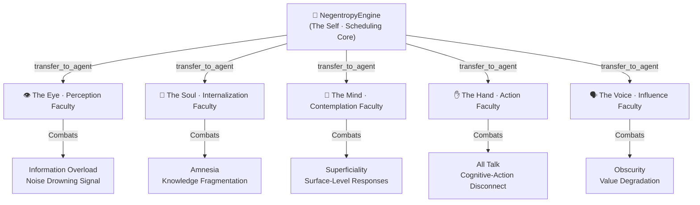
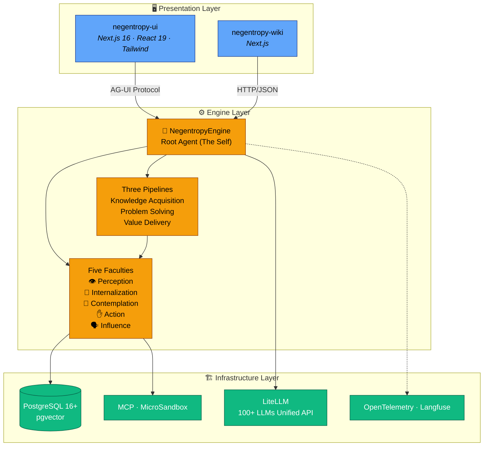

[English](./README.md) | [简体中文](./docs/i18n/zh-CN/README.md)

<h1 align="center">🔮 Negentropy</h1>

<p align="center">
  <strong>An agentic system built on a "One Root, Five Wings" architecture, dedicated to combating the entropy production of infomation and forging a continuously self-evolving cognitive framework.</strong>
</p>

<div align="center">

[](https://www.python.org/)
[](./LICENSE)
[](https://docs.astral.sh/uv/)
[](https://google.github.io/adk-docs/)
[](https://nextjs.org/)

</div>

<p align="center">
  <b>🔮 The Self · Scheduling Core | Bypasses atomic task execution. Strictly adhering to <strong>Orthogonal Decomposition</strong>, it acts as the master conductor, assigning intents to the most capable faculties.</b> <br/> <b>👁️ The Eye · Perception</b> | <b>💎 The Soul · Internalization</b> | <b>🧠 The Mind · Contemplation</b> | <b>✋ The Hand · Action</b> | <b>🗣️ The Voice · Influence</b>
  <br/>
</p>

---

<p align="center">
<b><small><small><strong>Disclaimer</strong> · All tools and methodologies provided by this project are for reference only. The project team bears no direct or indirect responsibility for the outcomes of using this system. The term "cultivation/practice" herein refers purely to the self-evolution and optimization of the system, free of any religious connotations.</small></small></b>
</p>

---

## 🤔 Why Negentropy Engine?

You've probably test-driven your fair share of agentic systems by now, and inevitably stepped into these classic pitfalls:

- 🌀 **Information Overload** —— Agents devour oceans of data, but signal and noise fly together. You're left with a pile of "truthful nonsense."
- 🕳️ **Goldfish Memory** —— The hard-won conclusions from your last dialogue are tossed out the window by the next. It's like rebooting life every five minutes.
- 🏄 **Surface-Level Skimming** —— Agents give you textbook answers but never dig into second-order problems. Nobody's ever asking "But _why_?" on your behalf.
- 💬 **Armchair Strategists** —— The analysis is flawless, but the moment real work (executing code, touching files) is required, you hit the dreaded "I suggest you do this manually."
- 🌫️ **Impenetrable Jargon** —— What should be a professional insight reads like an ancient scroll. The value degradation in transmission approaches a solid 80%.

**Negentropy's Answer**: We engage these entropic forms head-on. The goal isn't just to build another Agent, but to forge a **continuously self-evolving cognitive system**.



---

## ✨ Core Features

- 🏗️ **"One Root, Five Wings" Orchestration** —— A master orchestrator teaming up with five orthogonal faculties. The root agent handles the dispatching, while the five wings systematically obliterate information overload, amnesia, superficiality, inaction, and obscurity.

- 🔄 **Three Standardized Pipelines** —— Pre-packaged pipelines for Knowledge Acquisition, Problem Solving, and Value Delivery. Say goodbye to the tedious chore of manually wiring multi-step tasks. It works out of the box.

- 🧠 **Dynamic Memory System** —— A memory decay mechanism modeled on the Ebbinghaus Forgetting Curve, paired with structured factual storage and memory governance. This ensures the Agent actually _remembers_ instead of merely _repeating_.

- 📚 **Knowledge Management Engine** —— From document ingestion, semantic chunking, and vector retrieval to knowledge graphs and semantic search—a full-lifecycle knowledge management suite.

- 🐱 **Sandboxed Code Execution** —— Dual-channel isolated execution via MCP Protocol + MicroSandbox. Safely allows the Agent to get its hands dirty, graduating from "all talk" to "taking action."

- 🔧 **Pluggable Backends** —— Sessions, Memories, Artifacts, and Credentials fully support seamless switching between in-memory / PostgreSQL / VertexAI / GCS. Use in-memory for dev, Postgres for prod. Zero-code smooth migration.

- 📡 **Full-Stack Observability** —— Structured logging via `structlog` + Distributed tracing with OpenTelemetry + Trace analysis via Langfuse. Every "thought" the Agent has is fully documented and auditable.

---

## ✨ Quick Start

> **One command brings up the full stack** (postgres + perceives + backend + ui + wiki) with **zero cloud credentials** required to boot. LLM chat is activated by **one of OpenAI / Anthropic / Gemini API keys**; for a fully local, zero-key setup, see [Local LLM (Ollama)](./docs/concepts/local-llm-ollama.md).

### Prerequisites

<center>

| Dependency | Minimum Version | Purpose |
| :--- | :--- | :--- |
| Docker Engine + Compose v2 | Engine 24+ · Compose 2.24+ | One-click launch (includes the database) |
| _or (native path)_ Python · [uv](https://docs.astral.sh/uv/) · Node.js · [pnpm](https://pnpm.io/) | 3.13 · latest · 22+ · latest | Hot-reload without Docker |

</center>

> The Docker path needs **no** local PostgreSQL. The native path needs a pgvector-enabled Postgres (see [Development Guide](./docs/concepts/development.md)). `mise` / `asdf` users get the right Python & Node automatically via the root `.tool-versions`.

### A. One-click (Docker, recommended)

```bash
git clone https://github.com/ThreeFish-AI/negentropy.git
cd negentropy
./dev            # = setup + build & start the full stack + health self-check
```

`./dev` automatically: creates `.env.docker.local`, layers local-safe config, builds & starts 5 containers, polls `backend /health`, and runs `negentropy doctor`.

**Drop in one LLM key** in `.env.docker.local` (gitignored) to enable chat:

```bash
OPENAI_API_KEY=sk-...        # or ANTHROPIC_API_KEY / GEMINI_API_KEY
```

Then open **http://localhost:3192**.

| Service | URL |
| :--- | :--- |
| backend | http://localhost:3292 (+ `/docs`, `/health`) |
| ui (chat) | http://localhost:3192 |
| wiki (knowledge base) | http://localhost:3092 |
| perceives (content extraction) | http://localhost:2992 |

### B. Native path (hot-reload, no Docker)

```bash
git clone https://github.com/ThreeFish-AI/negentropy.git
cd negentropy
./dev native     # delegates to scripts/cli.sh: deps + migrations + frontend build + all services
```

> Requires a local pgvector Postgres. `pg_cron` is **no longer needed** — since migration `0042`, scheduling runs in-process.

### C. More

- First-run demo content: `./dev seed-demo`
- Preflight self-check: `./dev doctor`
- All subcommands: `./dev help`
- Contributors: `uv tool install pre-commit && pre-commit install`
- Env setup, migrations, integrations, troubleshooting: [Development Guide](./docs/concepts/development.md)
- Zero-key local LLM: [Local LLM (Ollama)](./docs/concepts/local-llm-ollama.md)
- Docker operations (production deploy): [Docker Operations](./docs/concepts/docker-operations.md)

> **Note:** `apps/cognizes` is a **separate** project; `./dev` and `docker compose` do **not** start it.

---

## 🏛️ Architecture Overview

<p align="center">
  <b><strong>Design Philosophy</strong> | The system's namesake draws from Erwin Schrödinger's concept in <em>What is Life?</em>—life feeds on <strong>negative entropy (Negentropy)</strong><sup><link url=#ref1>1</link></sup>.
</p>

### One Root, Five Wings

The **NegentropyEngine** refrains from executing atomic tasks directly; it exists solely for scheduling and dispatching. The five faculties operate purely in their element, while three pipelines encapsulate common multi-faculty collaboration patterns. The architecture rigidly adheres to **Orthogonal Decomposition**, ensuring decoupled responsibilities and strictly localized mutations.

<center>

| Totem | Faculty                    | Agent Name               | Combats              | Core Responsibility                                                         | Exclusive Tools                            |
| :---: | :------------------------- | :----------------------- | :------------------- | :-------------------------------------------------------------------------- | :----------------------------------------- |
|   👁️   | The Eye · Perception       | `PerceptionFaculty`      | Information Overload | Wide-area scanning, noise filtering, multi-source cross-validation          | `search_knowledge_base`, `search_web`      |
|   💎   | The Soul · Internalization | `InternalizationFaculty` | Amnesia              | Knowledge structuring, long-term memory governance, consistency maintenance | `save_to_memory`, `update_knowledge_graph` |
|   🧠   | The Mind · Contemplation   | `ContemplationFaculty`   | Superficiality       | Second-order thinking, strategic planning, root cause analysis              | `analyze_context`, `create_plan`           |
|   ✋   | The Hand · Action          | `ActionFaculty`          | All Talk             | Precision execution, code generation, safe mutation                         | `execute_code`, `read_file`, `write_file`  |
|   🗣️   | The Voice · Influence      | `InfluenceFaculty`       | Obscurity            | Value delivery, format adaptation, persuasion and education                 | `publish_content`, `send_notification`     |

</center>

> Dive into the complete architectural blueprint, pipeline orchestration mechanics, and design pattern registry in [docs/framework.md](./docs/concepts/framework.md).

### Three-Tier Architecture



---

## 📚 Document Navigator

<center>

| Document                                                    | Description                                                                                     |
| :---------------------------------------------------------- | :---------------------------------------------------------------------------------------------- |
| [User Guide](./docs/user-guide.md)                          | End-user guide covering all features: chat, knowledge, memory, plugins, admin, and wiki         |
| [Development Guide](./docs/concepts/development.md)         | Environment setup, daily workflows, db migrations, integrations, troubleshooting                |
| [Docker Operations](./docs/concepts/docker-operations.md)   | Compose service topology, local one-click path, production deploy, ops runbook                  |
| [Local LLM (Ollama)](./docs/concepts/local-llm-ollama.md)   | Optional zero-key local LLM via Ollama (install, register, caveats)                             |
| [Architecture Design](./docs/concepts/framework.md)         | Deep dive into the One Root/Five Wings, pipeline choreography, design patterns, engine workings |
| [Knowledge System](docs/concepts/035-the-knowledge-base.md) | Detailed design and usage of the knowledge management module                                    |
| [Memory System](docs/concepts/025-the-memory-system.md)     | Memory lifecycle, forgetting curves, and governance mechanics                                   |
| [Knowledge Graph](docs/concepts/036-the-knowledge-graph.md) | Graph modeling and query implementation                                                         |
| [QA Pipeline](./docs/concepts/design/qa-delivery-pipeline.md)               | Quality gates and release workflows                                                             |
| [SSO Integration](./docs/concepts/design/sso.md)                            | Google OAuth authentication config                                                              |
| [Engineering Changelog](./docs/concepts/engineering-changelog.md)    | Milestones and baseline mutation records                                                        |
| [AI Collaboration Protocol](./AGENTS.md)                    | Agent cooperation guidelines and engineering codebase                                           |

</center>

---

## 🤝 Community & Contributions

If you're holding onto an inspiration that pulls chaos back into order, or if you bump into any snags while navigating the system, please don't hesitate to share your wisdom:

1. Before hitting the keyboard, kindly take a detour through the [Development Guide](./docs/concepts/development.md).
2. Sling your game-changing ideas into our [Issues](https://github.com/ThreeFish-AI/negentropy/issues) or directly submit a [Pull Request](https://github.com/ThreeFish-AI/negentropy/pulls) packing some serious paradigm-shifting power.

Please hold "Entropy Reduction," "Context-Driven," and "Evidence-Based Engineering" as your **core principles**, ensuring every mutation aligns perfectly with Systemic Integrity.

---

<a id="ref1"></a>[1] E. Schrödinger, "What is Life? The Physical Aspect of the Living Cell," _Cambridge University Press_, 1944.

---

<p align="center">
  <a href="./LICENSE">Apache License 2.0</a>, © 2026 <a href="https://github.com/ThreeFish-AI">ThreeFish-AI</a>
</p>
