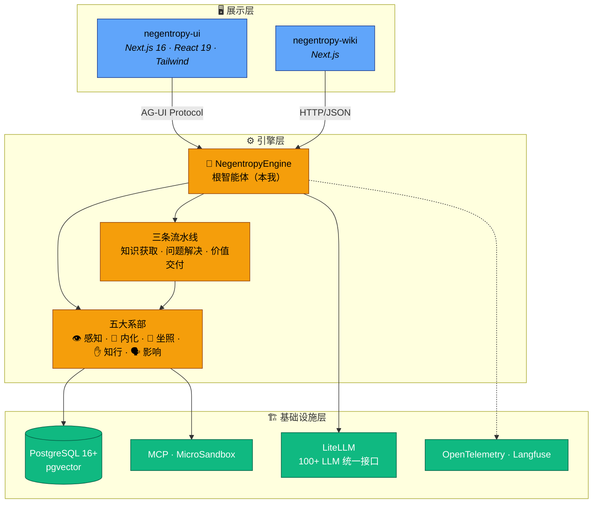
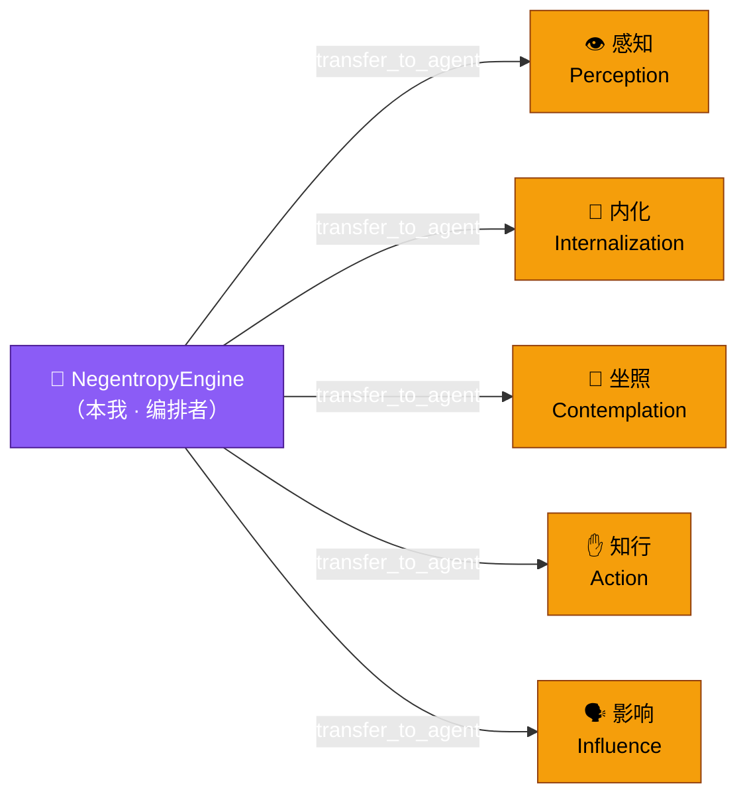

# 🔮 Negentropy (熵减)

> 对抗知识系统的熵增 —— 以「一核五翼」架构驱动的 AI Agent 熵减引擎。

<div align="center">

[](https://www.python.org/)
[](./LICENSE)
[](https://docs.astral.sh/uv/)
[](https://google.github.io/adk-docs/)
[](https://nextjs.org/)

</div>

---

## 🤔 为什么要造这个轮子？

你或许已经用过了不少 AI Agent 框架，但大概率踩过这些坑：

- 🌀 **信息过载** —— Agent 获取了海量信息，但信号和噪音齐飞，你只得到一堆「有用的废话」
- 🕳️ **金鱼记忆** —— 上一轮对话的结论，下一轮就被忘得一干二净，仿佛每次都在重启人生
- 🏄 **浅尝辄止** —— Agent 只会表面回答，从不会深挖二阶问题——「为什么」永远没人替你问
- 💬 **纸上谈兵** —— 分析得头头是道，真正需要执行代码、操作文件时就开始「建议您手动操作」
- 🌫️ **晦涩难懂** —— 明明是专业的洞察，输出却像天书，价值传递的损耗率直逼 80%

**Negentropy 的回答**：把这些熵增逐一对抗。不是再做一个 Agent 框架，而是构建一个**持续自我进化的认知系统**。

---

## ✨ 核心特性

- 🏗️ **「一核五翼」智能体编排** —— 不是又一个单体 Agent，而是一个编排者 + 五个正交系部的分工协作架构。根智能体负责调度决策，五大系部分别对抗信息过载、遗忘、肤浅、虚谈和晦涩

- 🔄 **三条标准流水线** —— 预封装的知识获取、问题解决、价值交付流水线，告别手动编排多步骤任务的繁琐，开箱即用

- 🧠 **动态记忆系统** —— 基于艾宾浩斯遗忘曲线的记忆衰减机制，结构化事实存储，记忆审计与治理，让 Agent 真正「记住」而不是「复读」

- 📚 **知识管理引擎** —— 文档摄入、语义分块、向量检索、知识图谱、语义搜索，一套完整的知识生命周期管理

- 🐱 **沙箱代码执行** —— MCP 协议 + MicroSandbox 双通道隔离执行，安全地让 Agent 真正「动手」而不是只动嘴

- 🔧 **可插拔后端** —— Session / Memory / Artifact / Credential 全部支持 inmemory / PostgreSQL / VertexAI / GCS 切换，开发用 inmemory，生产上 postgres，平滑迁移零代码修改

- 📡 **全链路可观测** —— structlog 结构化日志 + OpenTelemetry 分布式追踪 + Langfuse Trace 分析，Agent 的每一次「思考」都有据可查

---

## 🏛️ 架构概览

### 三层架构



### 一核五翼



**NegentropyEngine** 不直接执行原子任务，只做调度决策。五个系部各司其职，三条流水线封装常见的多系部协作模式。架构遵循**正交分解**原则，确保系部间职责独立、变更局部化。

| 图腾 | 系部 | Agent 名称 | 对抗目标 | 核心职责 | 专属工具 |
| :--: | :--- | :--------- | :------- | :------- | :------- |
| 👁️ | 慧眼·感知 | `PerceptionFaculty` | 信息过载 | 广域扫描、噪音过滤、多源交叉验证 | `search_knowledge_base`, `search_web` |
| 💎 | 本心·内化 | `InternalizationFaculty` | 遗忘 | 知识结构化、长期记忆管理、一致性维护 | `save_to_memory`, `update_knowledge_graph` |
| 🧠 | 元神·坐照 | `ContemplationFaculty` | 肤浅 | 二阶思维、策略规划、错误根因分析 | `analyze_context`, `create_plan` |
| ✋ | 妙手·知行 | `ActionFaculty` | 虚谈 | 精准执行、代码生成、安全变更 | `execute_code`, `read_file`, `write_file` |
| 🗣️ | 喉舌·影响 | `InfluenceFaculty` | 晦涩 | 价值传递、格式适配、说服与教育 | `publish_content`, `send_notification` |

> 完整的架构设计方案、流水线编排机制、设计模式目录详见 [docs/framework.md](./docs/framework.md)。

---

## 🚀 快速开始

### 前置要求

| 依赖 | 最低版本 | 用途 |
| :--- | :------- | :--- |
| Python | 3.13+ | 后端运行时 |
| [uv](https://docs.astral.sh/uv/) | 最新 | Python 包管理 |
| Node.js | 18+ | 前端运行时 |
| [pnpm](https://pnpm.io/) | 最新 | 前端包管理 |
| PostgreSQL | 16+ (含 pgvector) | 数据持久化 |

### 1. 克隆项目

```bash
git clone https://github.com/ThreeFish-AI/negentropy.git
cd negentropy
```

### 2. 启动后端

```bash
cd apps/negentropy
cp .env.example .env          # 复制并填写环境变量
uv sync --dev                  # 安装全部依赖（含开发依赖）
uv run alembic upgrade head    # 应用数据库迁移
uv run adk web --port 8000 --reload_agents src/negentropy  # 启动引擎
```

### 3. 启动前端

```bash
cd apps/negentropy-ui
pnpm install                   # 安装依赖
pnpm run dev                   # 启动开发服务器 (localhost:3333)
```

### 4. 开始对话

打开浏览器访问 `http://localhost:3333`，开始与 NegentropyEngine 对话。

> 完整的环境搭建指南、数据库迁移、前后端对接、故障排查详见 [docs/development.md](./docs/development.md)。

---

## 🛠️ 技术栈

### 后端引擎

| 类别 | 技术选型 |
| :--- | :------- |
| 语言 | Python 3.13 |
| Agent 框架 | [Google ADK](https://google.github.io/adk-docs/) |
| LLM 接口 | [LiteLLM](https://docs.litellm.ai/) (统一 100+ LLM 接入) |
| Web 框架 | FastAPI (通过 ADK Web Server) |
| ORM | SQLAlchemy 2.0 (async, asyncpg) |
| 数据库 | PostgreSQL 16+ (pgvector) |
| 迁移 | Alembic |
| 沙箱 | MCP + MicroSandbox |
| 可观测性 | structlog + OpenTelemetry + Langfuse |
| 配置 | Pydantic Settings (正交配置域) |
| 包管理 | [uv](https://docs.astral.sh/uv/) |

### 前端应用

| 类别 | 技术选型 |
| :--- | :------- |
| 框架 | Next.js 16 (App Router) |
| UI | React 19, TypeScript, Tailwind CSS |
| AI 集成 | AG-UI Protocol ([CopilotKit](https://github.com/CopilotKit/CopilotKit)) |
| 图谱可视化 | D3.js (Force Graph) |
| 图表渲染 | Mermaid |
| 测试 | Vitest (单元/集成), Playwright (E2E) |
| 包管理 | [pnpm](https://pnpm.io/) |

---

## 📁 项目结构

```
negentropy/
├── apps/
│   ├── negentropy/              # 后端引擎 (Python, uv)
│   │   ├── src/negentropy/
│   │   │   ├── agents/          # 一核五翼智能体编排
│   │   │   ├── engine/          # 引擎层 (API / 工厂 / 适配器 / 沙箱)
│   │   │   ├── config/          # 正交配置域
│   │   │   ├── knowledge/       # 知识管理
│   │   │   ├── models/          # 数据模型 (ORM)
│   │   │   ├── plugins/         # 插件系统
│   │   │   ├── auth/            # 认证与授权
│   │   │   └── storage/         # 存储抽象层
│   │   └── tests/               # 测试 (unit / integration / performance)
│   ├── negentropy-ui/           # 前端应用 (Next.js 16, pnpm)
│   └── negentropy-wiki/         # Wiki 文档站 (Next.js, pnpm)
├── docs/                        # 项目文档
├── AGENTS.md                    # AI 协作协议与工程准则
└── LICENSE                      # Apache License 2.0
```

> 完整的目录结构说明详见 [docs/development.md](./docs/development.md#2-项目结构)。

---

## 📚 文档导航

| 文档 | 说明 |
| :--- | :--- |
| [开发指南](./docs/development.md) | 环境搭建、日常开发工作流、数据库迁移、前后端对接、故障排查 |
| [架构设计](./docs/framework.md) | 一核五翼详解、流水线编排、设计模式目录、引擎层、数据持久化、前端架构 |
| [知识系统](./docs/knowledges.md) | 知识管理模块的详细设计与使用 |
| [记忆系统](./docs/memory.md) | 记忆生命周期、遗忘曲线、治理机制 |
| [知识图谱](./docs/knowledge-graph.md) | 知识图谱建模与查询 |
| [QA 流水线](./docs/qa-delivery-pipeline.md) | 质量门禁与发布流程 |
| [SSO 集成](./docs/sso.md) | Google OAuth 认证配置 |
| [工程变更日志](./docs/engineering-changelog.md) | 里程碑与基线变更记录 |
| [AI 协作协议](./AGENTS.md) | Agent 协作行为准则与工程规范 |

---

## 💭 设计哲学

系统的命名源自薛定谔 (Erwin Schrödinger) 在《生命是什么？》中提出的概念——生命以**负熵 (Negentropy)** 为食<sup>[[1]](#ref1)</sup>。

映射到 AI Agent 系统，核心对抗的是知识处理中的五种熵增形态：

| 熵增形态 | 系统表征 | 对抗系部 |
| :------- | :------- | :------- |
| 信息过载 | 噪音淹没信号 | 👁️ 感知系部 |
| 遗忘 | 知识碎片化 | 💎 内化系部 |
| 肤浅 | 表层响应 | 🧠 坐照系部 |
| 虚谈 | 认知-行动断裂 | ✋ 知行系部 |
| 晦涩 | 价值传递失真 | 🗣️ 影响系部 |

> 系统不只是一个 Agent 框架，而是一个以「熵减」为目标、持续自我进化的认知体系。

<a id="ref1"></a>[1] E. Schrödinger, "What is Life? The Physical Aspect of the Living Cell," *Cambridge University Press*, 1944.

---

## 🤝 参与贡献

本项目严格遵循 [AGENTS.md](./AGENTS.md) 中定义的协作协议与工程行为准则。

**核心原则**：熵减、上下文驱动、循证工程。

提交代码前请确保：

- 变更符合系统完整性 (Systemic Integrity) 要求
- 通过后端 / 前端 QA 门禁（单元测试 + 集成测试 + Lint）
- 遵循 [开发指南](./docs/development.md) 中的工作流

---

## 📄 License

本项目基于 [Apache License 2.0](./LICENSE) 开源。

---

> **免责声明**：本项目提供的所有工具与方法论仅供参考。用户在使用过程中产生的任何结果，项目组不承担直接或间接责任。这里的「修行」指代系统的自我演化与优化过程，不涉及任何宗教含义。
