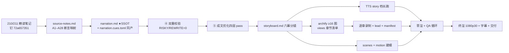

# Stage ② 策划案 ——《知识的集装箱：Agent Skills 开放标准》

> 完全重做版（2026-09-27）。信源：`research/sources.toml`（24 条）+ `research/source-notes.md`（A1–A28 断言映射）；叙事蓝本 = [210 精读笔记](../../../../../docs/research/agent-infra/210-agent-skills-open-standard.md)（钉 `72a657351`）。

## 1. 定位表

| 项 | 值 |
| --- | --- |
| 平台 | B 站 / YouTube 中长视频 |
| 时长目标 | 14:00–14:40（硬窗 [13.0, 15.6] 分钟；字数预算 ≈ 3950–4150 字 @280 字/分含停顿等效口径） |
| 形态 | AI 配音（story 段落演绎档，克隆音色 me-bright）+ Remotion 代码动画 + archify 逐章图解回放；无真人 |
| 受众 | 不预设 ML 背景的开发者：天天用 AI 编程助手、遇过「AI 不知道我们团队的规矩」、听说过 skills/插件但没想过「标准为什么长这样」 |
| 核心范围 | 210 六机制中的五个：包格式与身份 / 渐进披露经济学 / description 路由工艺 / 生态实测与宽容-严格 / 被解释文本的注入面 + 治理悬案收尾 |
| 明确砍掉 | MCP 对比细节（一句带过）、evals 工程全流程（一句带过）、Jev/系列他集一切关联（反串线红线） |

## 2. 叙事策略

**剧场（单一世界观，全片唯一）**：知识的港口。一个标准 = 集装箱箱体规范；技能 = 装着「作业指导书 + 工具」的集装箱；name = 箱号铭牌 = 舱位登记名；description = 货签面单；模型 = 调度员兼作业组长；客户端 = 港口（各有吊机与章程）；信任 = 海关检疫（标准之外各港自理）；规范仓库 = 发布箱体规范的 ISO 会议室 + 一位只验箱不验货的官方验箱师。**角色单射表见 210 开篇 [!TIP] 映射表**（本片不得出现映射表之外的新角色；确需新增先登记）。

**主线问题（钩子→悬念→回答）**：
- 钩子（P0）：2025 年，Anthropic 把自己家的技能格式捐成开放标准——一年后，OpenAI、Google、微软、Cursor 全接了。四十六家客户端，包含所有正面竞对。一个连版本号都没有、全文 247 行的规范，凭什么？
- 悬念（P1–P5）：拆开这只「集装箱」看它到底规定了什么——你会发现它规定的部分小得惊人，而它**故意不规定**的部分大得惊人：箱子放哪、谁来查验、走哪条航线，它一概不管。
- 回答（P6）：管得越少，越多人肯用——这是格式赢得生态的算法；代价是，它不管的那三件事，成了还没打完的战争。

**记忆点节奏（约 60–90 秒一个，全部可溯源 source-notes）**：
1. 「一个文件夹、一份说明文件，这就是全部」（A1）②
2. 「台账只留一行，提箱才搬整册——全载要付 16.9 倍」（A4 + 090 实测）③
3. 「货签上写『帮忙处理文档』，这只箱子永远没人提」（A3/A14/A15）④
4. 「同一个格式，四个港口四副模样；只有一个港口设了海关」（A20–A24）⑤
5. 「验箱师手册和 ISO 条文，十三条对不上」（A25）⑤
6. 「货签里藏一行小字，能偷到删除权限」（X4）⑥
7. 「分发规范的提案，在仓库里躺了七个月」（A26）⑦

**理性收尾原则**：不贩卖焦虑（不渲染「prompt injection 大战」）；结尾把悬念留在开放问题（标准下一战：分发与版本化），并以「格式只保证包里装什么——好不好用靠淬炼，可不可信靠港口」收束（对齐 210 规律 4/5）。

## 3. 视觉语言

**色彩语义契约**（theme.ts 定稿，跨幕严格用色）：

| 色 | 值 | 语义（全片唯一） |
| --- | --- | --- |
| 引航青 | `#45DFFF` | 港口/规范/台账/航道——一切「系统与规则」面 |
| 货签粉 | `#FF7A9E` | 集装箱/知识/技能/正文——一切「内容与对象」面 |
| 警示金 | `#FFC85C`（deny） | 悬案/边界/未证明/留白 |
| 底座 | `#0E1116` 深海夜港 | 背景 |
| 瞬时红 | `#FF5C5C`（danger） | 仅攻击/失败瞬间（X4 注入、身份漂移） |
| 瞬时绿 | `#7ED321`（ok） | 仅验证通过/确认门瞬间 |

- 规范条文引文用引航青引号卡；实测数字用等宽字体角标；金句卡用衬线体（theme.serif）。
- 公式与字段表（六字段）只作画面角标卡，不进口播主线逐字段念（口播只点 name/description 两个必填）。
- 恒定视觉锚〔M-001〕：**集装箱母题**全片锁死描边色（货签粉描边）与绝对线宽，多次同形出场只换标签；**台账行母题**锁引航青单像素行。分镜「画面/动效」列随标〔M-001〕〔M-003〕，避免〔X-001〕空间逆旁白（「越少越大」时箱子反而小、堆场反而空）。
- 空间语义恒定：画面纵深=港口平面；左侧=堆场（目录/存量），右侧=泊位/作业台（上下文/使用中）；「进入上下文」永远向右。严禁某幕把堆场画右侧。

## 4. 分幕结构表

| 幕 | 目标时间 | 主题 | 叙事要点（→ source-notes / 210） | 视觉锚点 |
| --- | --- | --- | --- | --- |
| P0 | ~1.8 min | 46 家就范的怪事 | 钩子（46 家含全部竞对 A17/A19）；旧路两条都死：猜不可靠 / 全塞开场白成本随装机量爆炸（A5）；本集问题：这格式凭什么 | 夜港全景；两只旧船对照（猜=雾中盲航引航青 / 塞=超载船倾覆警示金） |
| P1 | ~2.2 min | 一个文件夹的标准 | 箱体解剖：目录+SKILL.md、六字段只两个必填（A1–A3）、name=目录名借文件系统身份（A2）、正文完全自由（A6）；「Keep the format small」治理宪法（A8）；极简是策略不是没做完 | 集装箱爆炸图〔M-001〕；角件特写=六字段角标卡；登记处抽屉（name=目录名） |
| P2 | ~2.2 min | 台账与提箱 | 三级渐进披露（A4）；成本函数从装机量换成使用量（A5）；OpenAI 侧 2%/8000 字符同构旁证（A21 带归属句）；实测 16.9×/16.3×（自建玩具限定，X 表）；craft：正文 <5000 token 是建议不是强制 | 船期表台账墙（引航青一行行）vs 开箱作业台；数字翻牌（2,321 vs 39,222）；对岸港口同款台账（OpenAI 口径卡） |
| P3 | ~2.2 min | 货签决定生死 | description 独扛路由（A3）；好签/差签对照（「帮忙处理文档」永不触发 A15）；近失配负例与验证集选优（A13/A14）；模型只查「超出自身能力」的任务；静默退化无报错 | 货签面单特写（粉）；分拣员视线动线；两张签并排（好签亮起绿 / 差签蒙灰）；失败=无声（〔M-002〕以静写闷） |
| P4 | ~2.0 min | 四个港口四种章程 | 生态实测：Gemini 最贴规范且唯一默认确认门（A22）、Claude Code 私货字段最多（A20）、OpenAI yaml 旁路（A21）、VS Code 三路通吃（A23）；宽容 vs 严格：严格门拒载 33% 为他端写的技能（X2）；验箱师 13 分歧（A25）；四家均无签名（A24 四级表述） | 四港口鸟瞰四联卡（各自章程牌）；海关岗亭只有一家亮灯；验箱师对照表（13 条红叉角标） |
| P5 | ~2.0 min | 两个破坏实验 | 实验一：拆掉 project>user 优先级 → 同名箱跨港漂移、行为不可复现（X1）；实验二：货签藏一行缩进小字 → 伪 allowed-tools 混入（X4，M5 首测）；升华：技能是被解释的文本，不是被执行的代码——注入面在文本而非代码 | 实验室双屏：左=扫描序翻转（两港台账 diff 泛红）、右=放大镜下货签暗行瞬时红；作业指导书被工人照做的示意 |
| P6 | ~1.8 min | 留白处的战争 | 治理悬案：分发规范提案停摆 7 个月（A26）、字段松紧对冲并存（A27）、MCP 命名空间是阻力最小方向（A28 一句带过）；集装箱史对照：箱体先行、海关协作是几十年后事故倒逼；金句收尾 + 信源卡 + 下期预告卡 | 悬案卷宗堆（警示金）； ISO 会议室时间线（1956→2026 折叠）；金句衬线卡；信源卡渐黑 |

字数预算合计 ≈ 3950–4150 字（各幕按目标分钟 × 280 分摊；P0≈500 / P1≈620 / P2≈620 / P3≈620 / P4≈560 / P5≈560 / P6≈500）。

## 5. 生产管线图

## 6. 边界与不做的事

- BGM 留空轨（后期人工配乐位）；本片不做双语（zh 单语）。
- 210/信源之外的旁证不进口播；他方数字（2%/8000、46 家）一律带归属句或自复算声明（source-notes §三）。
- 不出现他集标题、集数序号、「上一集/本系列」等顺序词（check_series 规则 1）；「下期」仅可用于收尾。
- 画面文字一律关键词锚点，禁整句复述口播（RSI-007 复述门）；archify 章节标注按「全屏独占/画中画」措辞，分镜全文禁 archify full|inset 字面串。
- 破坏实验数字（16.9×/33%/X1-X5）口播必须带「我们自建玩具实测」限定，防止观众误当官方基准。
