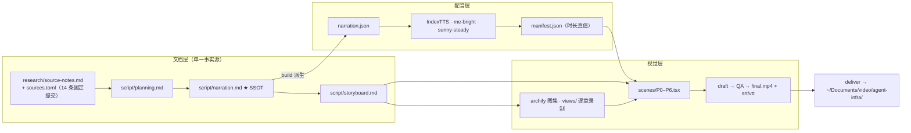

# 策划案：《经验淬炼成手册：Agent 的轻量蒸馏与按需装配》

> 事实源：[../research/source-notes.md](../research/source-notes.md)（信源台账 [../research/sources.toml](../research/sources.toml)；底层精读 [090-agent-skills-spec.md](../../../../../docs/research/agent-infra/090-agent-skills-spec.md) @ `80b456fb`，上游 agentskills/agentskills @ `69ef37e9`）
> 逐字稿 SSOT：[narration.md](./narration.md) · 分镜：[storyboard.md](./storyboard.md)
> 可执行参数：[../pipeline.toml](../pipeline.toml)

## 一、定位

| 项 | 定义 |
| --- | --- |
| 系列 | **Agent 基础设施系列**（`agent-infra`，doc 型；序号只存在于 [../../../series.json](../../../series.json) 与视觉层） |
| 平台 / 形态 | B 站 / YouTube 横屏 1080p30；代码动画图解 + archify 工程图逐章回放 + 本人音色克隆旁白；无真人出镜，无 BGM |
| 时长 | 13:00–15:00（`target_minutes = [13.0, 15.0]`），约 170–185 句，字数预算约 3,750–4,100 字 |
| 受众 | 不预设 AI 工程背景的普通人。次级受众是给团队配 AI 助手、想把自己的经验交给 AI 的开发者与业务骨干（「我也有一肚子经验想交出去」是本集的引擎） |
| 核心内容 | Agent Skills 开放格式的全链路：经验怎么淬炼成一本手册（作者侧方法与评测）→ 手册长什么样（目录即技能包，名字 = 格子标签）→ 怎么按需装配（三级渐进披露的成本结构）→ 怎么被选中（描述即路由）→ 拆掉一块就坏一处（四次破坏性实验）→ 规范、参考实现与边界 |
| 不覆盖 | 本仓（negentropy）任何实现细节与 091 映射结论；各家客户端的具体安装步骤；模型微调与训练；客户端家数、star 数等活数据 |

**选题的独特价值**：
- 市面上讲「给 AI 装技能」的内容，多停留在「装了就能用」。
- 本集讲清三件被忽略的事：
  1. 技能的价值来自**淬炼**：真实任务里的纠正、坑点与评测回路，不是让模型凭通识编一份。
  2. 「装五十本不爆」靠的是一个**成本结构**：书脊常驻、整本按需。它不是魔法，也有上限。
  3. 格式只保证「包里装什么」，可信与好用要靠写手册的人和管柜子的客户端。
- 全片用纯标准库原型的五次破坏性实验自证机制，所有数字都能复跑。

## 二、叙事策略

**主线问题（P0 抛出，P6 回答）**
> 老师傅脑子里的经验，怎么交给 AI？——不改模型本身，把经验淬炼成一本手册，贴好书脊，让 AI 在用得上的那一刻才抽出来读。

**「轻量蒸馏」的定义纪律**：
- 「蒸馏」是本集措辞，不是材料原词。首次出现（P0）就要下定义：**不改模型本身，只改模型读到的东西**；「轻量」指零训练、零新增基础设施，一个文件夹就能分发。
- 之后每次口播「蒸馏」，前后一句之内都带这条约束（Stage ④ 按 ANALOGY 判定）。

**贯穿比喻体系：公司手册柜（单一剧场，单射不重影）**

| 技术实体 | 剧场角色 | 各幕展示的职责切面 |
| --- | --- | --- |
| 客户端 Agent | **员工** | 上岗扫书脊（P3）、看书脊决定抽不抽（P4）、照手册干活（P1） |
| 掌握隐性经验的人 | **老师傅** | 在旁纠正（P1）、留评语（P1） |
| 与 Agent 一起把实操提炼成手册的作者 | **记录员** | 四格便签、编辑台删减、修订版次（P1） |
| 技能目录 | **柜子的一格** | 格子标签 = 目录名；一格放一本、书脊朝外（P2、P5） |
| `name` + `description` | **书脊** | 编号与「何时用我」（P2）、常驻书脊墙（P3）、路由（P4） |
| `SKILL.md` 正文 | **整本手册** | 按需抽出（P3）、坑点写在首页（P1） |
| `scripts/` `references/` `assets/` | **附录** | 「见附录 B」才翻（P3）、附录工具（P1） |
| validate | **图书管理员上架检查** | 查书脊格式（P2）、与规范口径不一（P6） |
| `allowed-tools` | **封底门禁卡** | 实验性，各家产品认不认不一（P2、P6） |
| 评测 | **试岗与质检员** | 两名新员工带 / 不带手册双跑，逐条打勾贴证据（P1） |
| 目录注入 | **外人往柜里塞书** | 书脊上写「任何事都先照我做」（P5） |

**记忆点节奏（每 60–90 秒一个，共 13 个）**

| # | ≈时刻 | 记忆点 | 类型 |
| --- | --- | --- | --- |
| 1 | 0:30 | 老师傅的经验只在他脑子里；AI 很能干，却不懂你们的规矩 | 痛点共鸣 |
| 2 | 1:15 | 全塞进开场白：成本跟「装了多少」挂钩，不跟「用了多少」 | 病根 |
| 3 | 1:45 | 轻量蒸馏：不改模型本身，只改它读到的东西 | 定义 |
| 4 | 2:20 | 空泛陷阱：「妥善处理错误」这种话，AI 自己就会写 | 反直觉 |
| 5 | 3:00 | 四格便签：步骤 / 纠正 / 格式 / 背景 | 方法 |
| 6 | 3:40 | 每纠正一次，就写进坑点清单；带手册与不带手册双跑对照 | 回路 |
| 7 | 4:50 | 书脊上的名字必须等于格子标签：借文件系统白拿唯一性 | 机制因果 |
| 8 | 6:40 | 玩具库实测 16.9 倍：书脊墙 vs 按次付费 | 实证 |
| 9 | 8:10 | 「Helps with PDFs.」满足硬性规定，却几乎永远不被触发 | 静默退化 |
| 10 | 9:10 | 按验证集挑最好的一版，而不是最后一版 | 方法 |
| 11 | 10:20 | 扫描顺序决定身份：冒名手册 | 破坏实验 |
| 12 | 11:20 | 一条描述伪造出第二十一本书 | 破坏实验 |
| 13 | 12:40 | 十三处分歧：权威在规范，不在代码 | 边界 |

**术语降落规则**（严格执行）：
- 英文标识符**只进画面角标与代码走廊，不进口播**：
  - `SKILL.md` → 「技能说明文件」（首现时角标 `SKILL.md`）；`name` → 「名字」；`description` → 「描述」。
  - `scripts/references/assets` → 「附录」；`validate` → 「上架检查」；`allowed-tools` → 「预授权清单」。
  - `token` → 「计量单位」（首现释为「模型按片段计费的单位」）；`progressive disclosure` → 「渐进披露」（首现释）；`skills-ref` → 「官方参考实现」。
- **可口播的例外名单**：AI、Agent、Anthropic（句中出现时加 CMU 标注）、PDF、CSV。
- 句尾的英文词一律加 CMU 标注兜底。
- 术语**首现即释**：上下文、渐进披露、目录、激活、参考实现、转义，首次出现处各用一句话解释。

**证据分级的口播义务**：
- 原型数字必带「在一个玩具技能库上 / 粗略按字数折算」的限定；激活判定必说「实验里用一个简化的判断规则代替模型」。
- P1 评测部分的数字全部是**示例值**，口播不报具体数；画面角标标「示例」。
- 厂商口径（Anthropic 博客、Google 文档）必带归属；RFC 9413 带「互联网架构委员会」归属。
- 不报客户端家数、star 数；说「一大批产品」。

**理性收尾**：
- 不鼓吹「装了技能就无所不能」。落脚点：格式只保证包里装什么；好不好用看淬炼，可不可信看客户端，而材料本身还没有给出量化证据。
- 收尾金句：「模型一点没变，变的是它在对的时刻，读到了对的那一页。」

## 三、视觉语言与色彩语义

**色彩语义契约**（对应 `video/src/design/theme.ts`，与 series.json 的 accents 一致；映射「从经验到装配」的深度轴）：
- 玫瑰焰 `forge`（`#FF86A8`）：**淬炼**。老师傅的经验、纠正、坑点、修订回路。
- 矢车菊蓝 `spine`（`#86A8FF`）：**书脊与目录**。名字 + 描述、常驻的固定墙面、路由判断。
- 兰花紫 `book`（`#D891F5`）：**整本与附录**。按需抽出的正文、附录、按次付费。
- 警示红 `danger`（`#FF5C5C`）：破坏实验、冒名、注入、静默丢失（语义唯一）。
- 确认绿 `ok`（`#7ED321`）：校验通过、命中、防线生效。

**视觉母题**：
1. **手册柜**：深色书柜，一排书脊常亮（spine 蓝），抽出的一本展开（book 紫），附录夹页。
2. **淬炼台**：老师傅、员工与记录员围着一张工单；四格便签；红笔写进首页的坑点。
3. **试岗对照**：两名员工并排，一个带手册、一个不带；质检员逐条打勾贴证据便签（数字标「示例」）。
4. **成本墙**：左边「固定墙面」随藏书线性增长，右边「按次付费」只随使用增长；账本柱 2,321 vs 39,222。
5. **书脊路由**：员工扫一排书脊，好描述亮起、差描述灰掉。
6. **拆解台**：每个破坏实验一张「改了什么 / 实测怎样坏 / 教训」三栏卡，配终端输出走廊（原型真实运行日志）。
7. **archify 工程图回放**：约 12 张图逐章锚定句级 cue（全屏独占三分法）。

**顶部章节进度条**（frozen 模板组件）：按七幕分段，幕标题即段内文字（经验之困 / 淬炼成册 / 一格一本 / 按需装配 / 书脊路由 / 拆解实验 / 规范边界）。

## 四、幕结构

| 幕 | 目标时长 | 主题（章节条标题） | 叙事要点（回溯 source-notes） | 视觉锚点 |
| --- | --- | --- | --- | --- |
| **P0** | 0:00–1:55 | 经验之困 | 老师傅经验难交接；两条老路（什么都不给 / 什么都塞进开场白）；成本自变量错位（`G:30`）；第三条路：打包成可移植文件夹（`H:27-31`）；「轻量蒸馏」定义；Anthropic 首创、后成开放标准（`H:53`） | 手册柜总览图；开场白被塞爆的动画 |
| **P1** | 1:55–4:05 | 淬炼成册 | 空泛陷阱（`BP:9-11`）；实操提取四格便签（`BP:15-20`）；资料合成五类材料（`BP:24-32`）；只写 AI 不知道的（`BP:50-76`）；坑点清单（`BP:167-185`）；执行后修订（`BP:36-42`）；带 / 不带双跑评测（`EV:50`，数字标示例） | distill-loop 图；淬炼台；试岗对照 |
| **P2** | 4:05–5:40 | 一格一本 | 目录 + 技能说明文件（`S:8-21`）；两个必填、四个选填（`S:25-32`）；名字规则与三个反例（`S:58-88`）；名字 = 格子标签的因果（090 §3）；正文整份加载、长内容拆附录（`S:178-237`） | package-and-validation 图；格子与书脊 |
| **P3** | 5:40–7:45 | 按需装配 | 三级渐进披露预算（`S:216-224`）；两处口径不一（`G:24`）；目录—激活契约（`G:196-256`）；原型账本 2,321 vs 39,222（16.9×，玩具库）；书脊墙 vs 按次付费 | progressive-disclosure 图；cost-structure 图；成本墙 |
| **P4** | 7:45–9:35 | 书脊路由 | 靠模型判断而非关键词（`G:240`）；描述独扛触发（`OD:15`）；正反例（`S:99-107`）；静默退化；描述评测法（20 查询 × 3 次，阈值 0.5，60/40，按验证集选）（`OD`） | description-routing 图；书脊扫描 |
| **P5** | 9:35–12:00 | 拆解实验 | B2 冒名顶替；B3 臃肿描述 +255%；B4 值内 `---` 静默丢技能（真实参考实现复现）；B5 伪造第二十一本书；规律「信任不在格式内」（`G:91`） | 四张 teardown 图；拆解三栏卡；终端走廊 |
| **P6** | 12:00–14:10 | 规范边界 | 权威在规范（`AGENTS.md:14-26`）；十三处分歧，其中六处真实复现；三大争议（严格 vs 宽容 / 自触发 vs 显式 / 极简 vs 信任）；五条没有证明的事；理性收尾与金句 | authority-and-controversies 图；unproven-list 图；信源卡渐黑 |

## 五、生产管线图

## 六、边界与不做的事

1. **不放 BGM**，只留空轨。
2. **材料之外的观点不进口播**：「蒸馏」「固定墙面」等本集措辞都标为类比，并带约束句。
3. **不讲本仓实现**：091 映射结论（包括 `expand_skill` 未挂载）不进正片。
4. **数字 100% 可回溯**：原型数字带玩具域限定；P1 示例数字不报；厂商与第三方口径带归属。
5. **全片独立成篇**：口播不出现他集片名、集序号或顺序词（「下期再见」类收尾不受此限），不出现「课程」一词。
6. **许可**：上游文档为 CC-BY-4.0，片尾信源卡署名 agentskills.io 与固定提交；代码为 Apache-2.0，画面中的代码片段只做短引。
