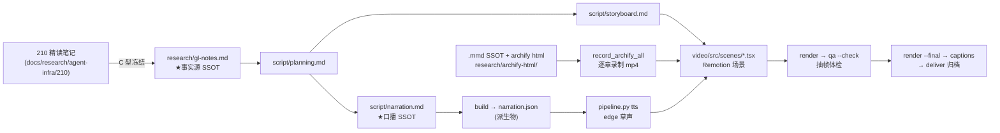

# 策划案：《Agent Skills 开放标准》（210 重学版换代重制）

> 事实源：[../research/gl-notes.md](../research/gl-notes.md)（C 型冻结快照 @63ce3d925，原始信源清单见其头部）。本节各要点均标 gl-notes 锚。
> 配音：edge 草声一档到底（用户拍板）；写稿预算 **280 字/分**（含停顿等效口径，pipeline.toml 显式覆写；目标窗 [11.5, 13.5] 分 ⇒ 全片字数硬约束 ≈ 3220–3780 字，规划锚 3500 字 ≈ 12.5 分）。

## 1. 定位表

| 项 | 取值 |
|---|---|
| 平台 | B 站 / YouTube 中长视频（1080p30） |
| 时长目标 | 11.5–13.5 分（硬约束区间，最终以配音实测为准） |
| 形态 | AI 配音（edge 草声）+ Remotion 代码动画 + archify 双图逐章回放，无真人 |
| 受众 | 不预设 ML/Agent 背景的普通人；用过 AI 编程工具、听说过「提示词」「上下文」即可 |
| 核心内容范围 | gl-notes §1（两难）→ §3（格式与身份）→ §4（三级披露）→ §5（语义路由）→ §6+§8（兼容与治理）→ §7（安全边界）→ §9（规律与争议）→ §12（边界护栏）；§11 实验室作为 X1–X5 消融素材分配进对应机制幕；§13 自测题、§14 仓内映射不进正片 |

## 2. 叙事策略

- **视觉母题全片统摄**：一张「目录索引卡」（两行：name + description）作恒定视觉锚〔M-001〕——它是三级披露常驻层的具象化身：翻面=正文整载、侧栏抽卡=资源按需调阅；锁死描边色与线宽，跨幕同形出场只换周边标签。210 为去类比剧场的标准技术文档语体，**零贯穿剧场**；局部点亮只允许 1–3 句即切回机制画面。
- **开篇钩子**：按 RSI-039 出 4 个候选交人拍板（见下方矩阵）；p0-01 执行「这是 XXX……」句式，且与主干（三级渐进披露/生态极简）强关联。
- **主线问题**：教 AI 干活的知识，为什么不能在开工时全塞给它？→ 因为注意力是稀缺资源 → Agent Skills 用「目录常驻、正文按需」的三级账本，把固定成本改成使用成本 → 而这个极小标准的胜利与代价（路由靠一句话、安全靠自觉）。
- **记忆点节奏**（每 60–90 秒一个，全部取自事实源）：
  1. 20 技能 × 3000 token ≈ 6 万——开场白先被挤爆（§1，**示意算式口径**，画面带「示意估算」角标，gl-notes §10 对账行约束）；
  2. 39,222 vs 2,321 = **16.9×**——全量装载与目录常驻的账（§4/§10，lab2 复算【一】级）；
  3. OpenAI 的 2% 预算门——跨厂商在同一件事上达成共识（§4）；
  4. 「一根字符串决定路由」+ near-miss 负例（§5）；
  5. X2：严格校验砍掉 1/3 的跨端技能（§6，lab2 实测 33.3%）；
  6. X4：描述字段的缩进伪字段能把工具授权注入进来（§7）；
  7. 五条规律收敛：**核心资产是被解释的文本，不是被执行的代码**（§9）。
- **理性收尾**：不贩卖焦虑；悬念留在开放问题（§9 争议三：信任真空由谁补位——「很可能要等一次重大安全事件，才倒逼出标准层的防线」），尾幕给 §12 五条「材料没有证明的事」边界护栏卡。

### 人机协同钩子候选矩阵（★ 待拍板）

| # | 类型 | 钩子文本（p0-01 起） | 留存逻辑 | 主干关联 | 抛出的引子 |
|---|---|---|---|---|---|
| H1 | 数字反差型 | 「这是一个只强制要求一个文件夹的开放标准，却有 46 家主流 AI 工具照着它实现。」 | 极小约束 vs 超大采纳的反差 | §3 极简格式 + §8 生态采纳 | 为什么这么小的东西能赢？ |
| H2 | 痛点成本型 | 「这是一个先把开场白挤爆、再谈能力的成本困局：20 份说明书，6 万 token。」 | 具体大数字+每个 AI 用户可感知的「变笨」体验 | §1 两难 + §4 三级账本 | 知识能不能按需上桌？ |
| H3 | 实验反直觉型 | 「这是五次破坏性实验拆出来的结论：把格式校验做严，反而砍掉三分之一的可用技能。」 | 反直觉结论+实验实证感 | §6 严格 vs 宽容争议 | 标准该怎么把握松紧？ |
| H4 | 揭示新物种型 | 「这是一份只在需要时才翻开的说明书：目录常驻、正文按需付费。」 | 「按需付费」迁移到知识的新鲜感 | §4 三级披露（全片主干） | 账是怎么记的？ |

> **★ 选定 H4（用户拍板 2026-10-06）**——理由：钩子即主干，p0-01 直接锚定全片核心机制（三级披露），「按需付费」引子与 P2 账本幕无缝衔接；揭示后须 1–3 句失配拦截落地到「开放规范」本体（说明书是局部类比，防剧场化）。配套标题定 **T1《目录常驻，正文按需：Agent Skills 开放标准》**（已同步 series.json / series.md；deliver 归档按此题起 v1 序列）。

## 3. 视觉语言

- **色彩语义契约**（对 bg `#0E1116` 对比度 ≥4.5:1，`qa_frames.py --check-theme` 实测；色相避让已用色，落 theme.ts 时以 check_series INFO 行复核）：
  - **目录金**＝三级披露/成本账本（目录卡描边、账本数字）；
  - **路由靛**＝语义路由/命中信号（description 高亮、命中脉冲）；
  - **治理紫**＝多客户端/生态治理（客户端阵列、PR 看板）；
  - 警示红 `#FF5C5C`＝破坏性实验的「拔掉后」；确认绿 `#7ED321`＝「机制在位」；金句卡衬线体。
- **X1–X5 统一形态＝正反同屏消融对比**（C 型素材映射 #3 契约）：左半「拆掉组件 X」红色演示退化（崩溃步骤+退化数字），右半「机制在位」绿色演示拦截；警示角标写明拆的是什么。
- **数字呈现＝带基线锚的动态标尺**（素材映射 #4）：16.9×、33.3%、2% 一律 `useCount` 爬升+基线虚线，禁多列大表照搬；示意算式（6 万）须带「示意估算」角标（§1 是推断演示非实测，对账表口径）。
- **archify 双图逐章回放**：`disclosure-lifecycle`（§4 三级运行链）主 P2；`governance-layers`（三层治理面）主 P4；章↔句锚定在 ⑥ 定稿，全屏回放窗外的装置让位（ArchifyYield 契约）。
- **开篇首镜视听合力**：钩子句配目录卡入场动效+数字爬升，禁静止文字卡（06 定式）；全景坐标（§2 四层架构）退至 P0 末换幕锚点高亮一次。
- 公式/字段表只作画面角标彩蛋，不进口播主线。

## 4. 分幕结构表

| 幕 | 目标时间 | 主题 | 叙事要点（事实源锚） | 视觉锚点 |
|---|---|---|---|---|
| P0 | 1.5 分 | 两难开场 | 两个极端困境：自由发挥会幻觉、全塞挤爆上下文；20×3000≈6 万示意算式；引出「有没有第三条路」（§1） | 钩子句+目录卡入场；两难天平 |
| P1 | 1.8 分 | 一个文件夹的答案 | 技能包=文件夹+SKILL.md 六字段；name=目录名强绑定、免中心注册表；X1 消融：拆作用域优先级→2/10 跨端漂移（§3） | 目录索引卡解剖；六字段卡贴；X1 正反同屏 |
| P2 | 2.2 分 | 三级渐进披露 | 目录常驻(~50–100/项)→正文整载(<5000)→资源按需；39,222 vs 2,321=16.9×；OpenAI 2%/8000 印证（§4） | **disclosure-lifecycle 逐章回放**；useCount 账本标尺 |
| P3 | 1.8 分 | 一句话的路由 | description 独扛路由决策；哑火 vs 喧宾夺主两种失效；near-miss 负例写法；20 组/6:4 评测（§5） | 路由靛信号流；负例卡红绿对照 |
| P4 | 2.4 分 | 46 家的默契与分歧 | 目录发现/作用域遮蔽（X5：1 处静默分歧）；宽容 vs 严格（X2：4/12 拒载=33%）；X3 布尔翻转；46 家采纳、Claude 10+ 私有字段、48 PR 四向拉扯（§6+§8） | **governance-layers 逐章回放**；客户端阵列；X2/X3/X5 消融位 |
| P5 | 1.5 分 | 被解释的文本 | 核心资产是提示词不是二进制；脚本也不自动执行；X4 注入：缩进伪字段→allowed-tools 泄漏；四家仅 Gemini 有确认门、均无签名（§7） | X4 消融主场；「权限输入源」红线卡 |
| P6 | 1.3 分 | 规律、争议与边界 | 五条规律快收敛（身份借文件系统/按使用付费/一根字符串路由/被解释的文本/互操作压倒完备）；三大争议留开放；§12 边界护栏五条；主线回收：两难已解，账本在记（§9+§12） | 规律五连卡；护栏卡；目录卡终态回扣 |

## 5. 生产管线图

```mermaid
flowchart LR
  A["210 精读笔记<br/>(docs/research/agent-infra/210)"] -->|C 型冻结| B["research/gl-notes.md<br/>★事实源 SSOT"]
  B --> C["script/planning.md"]
  C --> D["script/narration.md<br/>★口播 SSOT"]
  D --> D2["build → narration.json<br/>(派生物)"]
  D2 --> E["pipeline.py tts<br/>edge 草声"]
  M[".mmd SSOT + archify html<br/>research/archify-html/"] --> R["record_archify_all<br/>逐章录制 mp4"]
  C --> S["script/storyboard.md"]
  S --> V["video/src/scenes/*.tsx<br/>Remotion 场景"]
  R --> V
  E --> V
  V --> Q["render → qa --check<br/>抽帧体检"]
  Q --> F["render --final → captions<br/>→ deliver 归档"]
```

## 6. 边界与不做的事

- **BGM 留空轨**；不做真人出镜、不做 AI 生成图像素材。
- **活数据不进口播**：46 家/48 条 PR/Claude 私有字段数——口播一律「截至 2026 年 9 月的统计」时点归属句，或改说趋势；画面角标带取数时点。
- **示意算式与实测数字分家**：6 万（§1 推断）与 16.9×（lab2 实测）两个体系不得并排比较、画面必须分别标注口径（对账表「口播可用性」列约束）。
- 上游许可：规范文档 CC-BY-4.0、代码 Apache-2.0——本片为解读与再创作，画面口播原创，引用注明出处；不展示受版权保护的整页截图。
- 口播永不出现他集标题与集数序号（check_series 执法）；本仓映射结论（211）不进正片。
- 砍掉的广度（§11 实验室操作指南、§13 自测题）收尾一句话带过，不硬塞。
