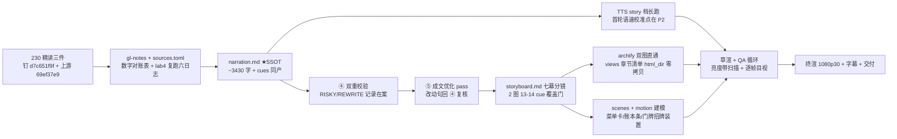

# Stage ② 策划案 ——《刻意做小：Agent Skills 开放标准》

> 信源：`research/gl-notes.md`（C 型冻结快照）+ `research/sources.toml`（活源台账）+
> `research/number-reconciliation.md`（数字对账表）+ `research/lab4-*.log`（六份复跑日志）；
> 叙事蓝本 = [230 三代重读精读](../../../../../docs/research/agent-infra/230-agent-skills-standard.md)（钉本分支 `d7c651f9f`）。
> 本片为 E1 换代原位重制：v2《知识的集装箱》的港口剧场整体退役，本片启用 230 白话体系，两版框架零共享。

## 1. 定位表

| 项 | 值 |
| --- | --- |
| 平台 | B 站 / YouTube 中长视频 |
| 时长目标 | 硬窗 [12.5, 14.5]：~3,430 字 @story 档 254 字/分 ≈ 13:30（首轮 TTS 后按实测校准回写） |
| 形态 | AI 配音（story 段落演绎档，克隆音色 me-bright）+ Remotion 代码动画 + archify 逐章图解回放（2 图 = 230 伴生双图直通：agent-skills-std-lifecycle / agent-skills-std-dual-track，13–14 cue）；无真人 |
| 受众 | 不预设标准背景的开发者：天天给 AI 写提示词、见过 `.claude/skills` 或 `.agents/skills` 目录，但没想过「一个文件夹凭什么成为 46 家共用的标准」的人 |
| 核心范围 | 230 机制主线全链：五条设计规格 → 六字段格式契约（X1 身份消融）→ 三级渐进披露经济学（X4 预载 +13% / X5 压缩保护）→ description 路由与评测法 → 客户端生命周期与 `.agents/skills` 不对称（X3 注入演示）→ 双轨治理与关门哲学（X2 装载门）→ 五规律收束「刻意做小」 |
| 明确砍掉 | 供应链三战场（签名/分发/版本——他集领地，230 §12 显式让渡）、MCP 集成对比深挖（一句话带过）、46 家逐一盘点（只引钉死总数）、路由准确率评测实操（只讲方法论）、创作方法论四支柱（对写技能的人最有用但超时长窗，砍）、AI 元剧场彩蛋、仓内映射（231 不存在，本代无映射篇） |

## 2. 叙事策略

**剧场（继承 230 白话体系，全片唯一世界观）**：一家小餐馆——技能=一道菜，客户端=餐厅，模型=顾客。
角色单射表以 `research/gl-notes.md` 末尾《类比登记表》为唯一事实源（一物一喻，不在视频阶段造新喻）：
文件夹=包裹 · 目录名=门牌 · name=户口登记名 · description=招牌 · 目录行=菜单上一行 ·
激活=点菜上桌 · 资源文件=后厨备料 · tier1/2/3=菜单行/上桌/备料的三级记账 ·
压缩豁免=点过的菜不撤桌 · 严格校验器=车辆年检 · 宽容装载=交警路面执法 ·
规范面=菜谱标准 · 扩展字段=各家私改菜单 · 51 条 PR=排队提意见的街坊。
**禁用**（旧版框架隔离）：港口/集装箱/海关/货签/提箱/箱号/泊位/引航/舱位/角件/航线；230 §1 规格表「通俗版」列的这批港口系类比已在登记表标记「不继承」，Stage ③ 写稿须用菜单/门牌/招牌体系重述。

**主线问题（钩子→悬念→回答）**：
- 钩子（P0）：一个文件夹、一份说明文件——截至 2026 年 9 月底，46 家客户端登记采纳，正面竞对全在名单上。它没有注册中心、没有审核、没有版本号，凭什么？（两条老路死法铺垫：让模型猜=不可靠；把手册塞进开场白=又贵又互相稀释）
- 悬念（P1–P5）：把它的四条核心规矩逐条拆给你看——身份钉在目录名上，拆掉=技能静默蒸发（X1）；成本按三级记账，拆掉按需性=常驻 +13%（X4）；路由只靠一句话（评测法四步）；装载宽容与校验严格是同一官方的两张面孔（X2/X3；治理争议=关门哲学 51 条 PR 排队）
- 回答（P6）：五条规律摆一起，答案自己浮出来——管得越少，越多人敢用；不是没做完，是刻意不做。

**记忆点节奏（约 60–90 秒一个，全部可溯源 gl-notes/对账表）**：
1. 「为装了多少付钱，还是为用了多少付钱」（§1 规格①）②
2. 「门牌必须跟户口登记名一致——标准不设发牌机构，文件系统就是登记处」（§3）②
3. 「名字漂移，技能蒸发，零告警」（X1）②
4. 「菜单上一行 ≈ 一百 token 常驻，点菜才上桌，备料才翻库房」（§4 三级记账）③
5. 「拆掉按需性，常驻 613 涨到 694——涨幅恰好是一份从没被读过的说明书」（X4）④
6. 「全片最薄也最致命的约定：最多一千零二十四字符，独扛全部路由」（§5）④
7. 「目录块不是数据结构，是被解释的文本——一行恶意招牌能伪造一个不存在的技能」（X3）⑤
8. 「装载是交警路面执法保通行，校验是车辆年检保合规——年检自愿，两轨无强制联动」（§8）⑥
9. 「门关得越久，功能越从侧门长」（§11 争议②）⑥

**理性收尾原则**：不神化标准（材料未证明五条如实口播：46 家无第三方复核、三级 token 是建议值、路由可靠性无依据、跨产品复用未证明、信任与完整性基本缺席——P6 边界护栏卡收束）；供应链留白不展开只一句定性（「另一场没打完的战争」不点他集）；活数据（star 数/冻结天数）只进画面角标带取数日期。

## 3. 视觉语言

**色彩语义契约**（theme.ts 定稿，跨幕严格用色）：

| 色 | 值 | 语义（全片唯一） |
| --- | --- | --- |
| 账本金 | `#F2B33D`（concept） | 三级记账/账本数字/目录常驻行——经济学核心的一切 |
| 门牌靛 | `#6D8BFF`（conceptDeep） | 身份与路由信号：name/description、门牌、招牌、目录行文字 |
| 年检紫 | `#A88BE8`（deny） | 制度与治理面：规范、校验、分歧表、守门哲学 |
| 底座 | `#0E1116` 深底 | 背景 |
| 消融红 | `#FF5C5C`（danger） | 仅破坏实验的退化侧（X1–X5 红侧） |
| 消融绿 | `#7ED321`（ok） | 仅破坏实验的完好侧（左绿对照组） |

**视觉母题「一页菜单 · 一行账」（贯穿装置，右上角恒定锚 + 底部计量带）**：
- 〔M-001〕**技能菜单卡**：右上角常驻小卡，六行=lab4 真实夹具名（shift-swap 换班 / report-merger 周报合并 / deploy-helper 部署 / pantry-inventory 盘点 / legacy-notes 归档 / evil-craft 恶意样本）；剧情推进打点：P1 上架盖章 → P2 激活行打勾 → X1 一行静默消失 → X3 一行染红伪造 → P6 合页收拢。
- 〔M-002〕**账本条**：底部计量带，tier1/tier2/tier3 三格计数器随片累计 454→+62→+97→613；X4 镜头红侧跳 694（数字必带基线标尺 useCount，禁搬大表）。
- 〔M-003〕P0 文件夹树全景开场（`.agents/skills/` 一棵树展开六个文件夹——Map-First 锚）。
- 〔M-004〕门牌/招牌字形系统（门牌靛统一）：P1 蓝底白字门牌版式演 name=目录名；P3 街头招牌版式演 description 与评测四步——身份与路由共享一套「挂牌」视觉语言。
- 〔M-005〕worked example 单射：「帮我把这周五和小李的换班在系统里提交」贯穿 P2 全链（发现→目录→激活→按需→压缩），台词取 lab4 复跑日志。

- 规范原文引文用引号卡（引语态）；实测数字等宽角标；金句卡衬线体（theme.serif）。
- 空间语义恒定：左=标准/发布方，右=客户端/用户端，「装载流向」永远向右；全屏独占期间装置让位（forbid_inset）。

## 4. 分幕结构表（七幕；句区间与字数为 Stage ③ 写稿目标，narration.md 定稿后回填实际计数）

| 幕 | 目标字数 | 目标时间 | 核心问题 | X 实验 | archify（图:章） |
| --- | --- | --- | --- | --- | --- |
| P0 四十六家之谜 | 460 | ~1.8 min | 一个文件夹凭什么让 46 家包括竞对都采纳？ | — | dual-track: 生态登记 |
| P1 包裹与门牌 | 500 | ~2.0 min | 标准只钉死哪两件事？身份为什么钉在目录名上？ | X1 全消融 | dual-track: 规范面 |
| P2 一页菜单 ★核心 | 660 | ~2.6 min | 装很多技能为什么还不贵？三级记账怎么运转？ | X4 全消融 + X5 简式 | lifecycle: 装载→目录→激活→执行→压缩 |
| P3 一句招牌 | 520 | ~2.0 min | 什么时候用哪个技能，凭什么一句话说了算？ | 内在反例「背题王」 | lifecycle: 激活 |
| P4 门口的规矩 | 420 | ~1.7 min | 各家客户端怎么装包裹？互操作靠什么？ | X3 全消融（注入演示） | lifecycle: 注入防御+严格校验 |
| P5 交警与年检 | 480 | ~1.9 min | 同一官方为什么两套口径？门为什么关这么久？ | X2 简式 | dual-track: 校验轨道+装载轨道+扩展三家 |
| P6 刻意做小 | 390 | ~1.5 min | 五条规律摆一起，什么答案自己浮出来？ | — | dual-track: 守门哲学 |

合计 ~3,430 字 ≈ 13:30 @254 字/分（硬窗 [12.5,14.5]；P2 为信息密度峰，P6 留白收束）。

> 定稿回填（2026-10-02，narration.md 实测）：实际 **124 句 / 3678 字** @ 285 字/分等效（story 裸语速实测 349 → `--duration-factor 1.15`）= **13:07.7**，落窗；分幕实际——P0 12 句 354 字 · P1 15 句 450 · P2 26 句 772 · P3 18 句 540 · P4 21 句 670 · P5 16 句 488 · P6 16 句 404（P4 较目标 +60% 为注入演示三句让装置，P0 −23% 为开场提速；上表目标值保留作 Stage ③ 对照）。

## 5. 生产管线图

```mermaid
flowchart LR
    A[230 精读三件<br/>钉 d7c651f9f + 上游 69ef37e9] --> B[gl-notes + sources.toml<br/>数字对账表 + lab4 复跑六日志]
    B --> C[narration.md ★SSOT<br/>~3430 字 + cues 同产]
    C --> D[④ 双重校验<br/>RISKY/REWRITE 记录在案]
    D --> E[⑤ 成文优化 pass<br/>改动句回 ④ 复核]
    E --> F[storyboard.md 七幕分镜<br/>2 图 13-14 cue 覆盖门]
    C --> G[TTS story 档长跑<br/>首轮语速校准点在 P2]
    F --> H[archify 双图直通<br/>views 章节清单 html_dir 零拷贝]
    F --> I[scenes + motion 建模<br/>菜单卡/账本条/门牌招牌装置]
    G & H & I --> J[草渲 + QA 循环<br/>亮度带扫描 + 逐帧目视]
    J --> K[终渲 1080p30 + 字幕 + 交付]
```

## 6. 边界与不做的事

- BGM 留空轨；本片 zh 单语（英文版触发条件=用户明确要求）。
- 230/台账之外的旁证不进口播；他方数字一律自复算或带归属角标；46 家/51 条 PR/冻结一律带「截至 2026 年 9 月底」钉死口径；star 数（25,811）与冻结天数只进画面角标 + 取数日期（2026-09-30），不进口播。
- 不出现他集标题、集数序号、「上一集/本系列」等顺序词（跨系列全局红线）；「下期」白名单至多一次。
- 画面文字一律关键词锚点（≤6 字），禁整句复述口播（复述门）；X 实验镜画面只放数字+标签+结构；storyboard 禁 archify 全屏/画中画英文字面串。
- lab4 数字口播带「我们的玩具原型实测」限定；X1–X5 标签只进画面角标，口播说「拆掉哪条规矩」。
- 旧版框架词零出现（港口/集装箱/海关/货签/提箱/泊位/引航等——写稿红线自查表）；「台账」一词统一改「菜单/账本」。
- 供应链叙事只用一句定性收口不展开（他集领地）；治理叙事只用事实句（51 条 PR/冻结天数/三方分歧均有对账表实证），不作动机推断。
- 片尾口径卡「数据截至 2026-09-30」；成片前 48h 固定复核两线：agentskills/agentskills 主仓 HEAD 与 51 条 open PR 计数，任一解冻启用备播文案。
