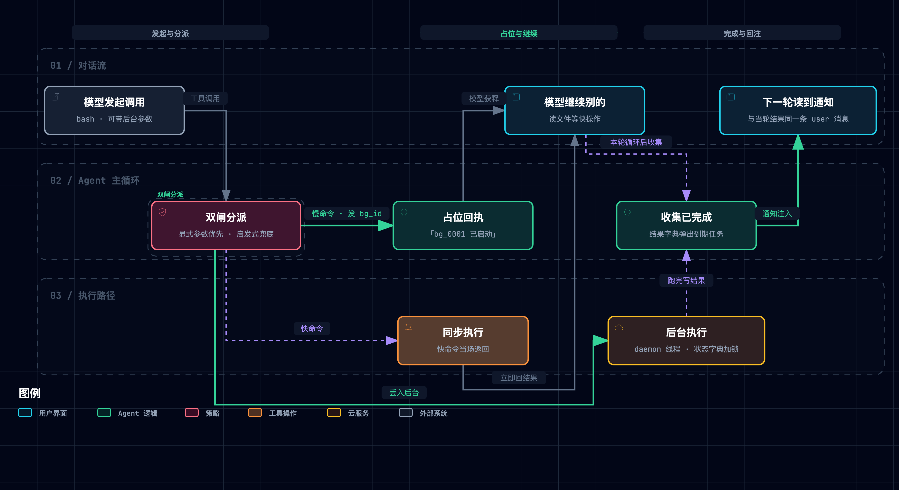
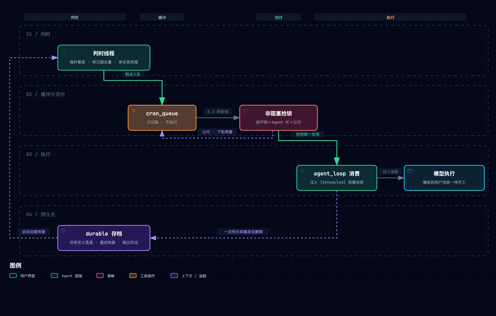

<!-- C 型信源登记 · guided-learn 精读产物冻结快照（to-video references/01「C 型信源」契约） -->
<!-- 本文件 = 本集唯一事实源正文（narration 断言回溯到此；此头上溯原始信源） -->

# C 型冻结登记头

| 项 | 值 |
|---|---|
| GL 产物 | 《Learn Claude Code 并发与调度精读与通俗拆解（s13 后台任务 × s14 定时调度）》＝ 本仓 `docs/research/agent-harness/176-claude-code-concurrency-relearn.md` @ 9b6e08863（PNG 采集修复 edd69213b） |
| 冻结日期 | 2026-10-02（本集 Stage ①，自当前分支 HEAD 复制；上游正文此后变更不自动跟进） |
| 生成方式 | guided-learn 零继承独立重学（黑名单禁读 170–175 与旧 ep4 取证；源钉 `67a9126c`，main 轨 `ce8f9f18` 对照） |
| GL 取数日期 | 2026-09-30（全部上游信源） |
| 活源台账 | `sources.toml`（source_ledger.py 派生+登记，15 条；audit FAIL 0 / verify FAIL 0 @2026-10-02） |
| 字节归档 | `source-archive/67a9126/`（站点轨四文件＋LICENSE）· `source-archive/ce8f9f1/`（main 轨双 README＋LICENSE） |

**原始信源清单**（176 参考 [1]–[9] ↔ 台账条目映射）：

| 176 参考 | 台账条目 | kind | 说明 |
|---|---|---|---|
| [1] 仓库 @67a9126c | s13-readme / s13-code / s14-readme / s14-code | repo | 教学版四文件（固定 commit，MIT） |
| [2] 站点 s13/s14 两页 | s13-site / s14-site | site | SSG 预渲染（与 [1] 同源） |
| [3] scheduled-tasks | off-scheduled-tasks | site | 官方定时任务文档（.md 静态端点） |
| [4] env-vars | off-env-vars | site | 官方环境变量登记表 |
| [5] tools-reference | off-tools-reference | site | 官方工具参考（Bash 节） |
| [6] routines | off-routines | site | 官方 Routines（云例程） |
| [7] interactive-mode | off-interactive-mode | site | 官方交互模式（Background Bash） |
| [8] tool-use overview | off-tooluse-overview | site | Messages API 配对语义（platform 文档） |
| [8b] handle-tool-calls | off-handle-tool-calls | site | 配对语义补证（O15 增量；`tool_use_id` 回传＋未解决 400） |
| [9] main 轨 @ce8f9f18 | main-s11-readme / main-s12-readme | repo | 平行分叉对照（英文原稿、无源码对照节） |

**证据定级**：按 B 型三级 ≤ 二级处理；176 §6 中课程对闭源实现解读、官方无记载者（45 秒看门狗、七种后台任务类型、Haiku 摘要、`tengu_kairos_cron`、cron 降级服务标记等）一律三级——口播须带归属句、不得说成产品既成事实、画面角标归属。176 内置 lab 实测（e1–e5）**本集已复算**（见附录一），按「本集实测」升一级登记。

---

（以下为 GL 产物正文冻结快照，正文未动；仅 7 处相对链接按冻结落位深度改写，规则 5 死链归零）

---
sidebar_position: 11
title: "Learn Claude Code 并发与调度重学精读（s13 后台任务 × s14 定时调度）"
description: "以最新版 guided-learn 对 Learn Claude Code「并发」层两节（s13 Background Tasks / s14 Cron Scheduler）的独立重学精读：占位回执与通知注入的配对语义、cron 四层解耦（判时/缓冲/交付/执行）、教学版与生产版距离（官方文档逐项印证 + 抖动口径硬分歧 + 超时自动转后台三路径），配确定性原型与五次破坏性实验实测。"
---

# Learn Claude Code 并发与调度精读与通俗拆解（s13 后台任务 × s14 定时调度）

> [1] shareAI-lab, "Learn Claude Code: s13 Background Tasks & s14 Cron Scheduler," GitHub repository. [Online]. Available: https://github.com/shareAI-lab/learn-claude-code （commit 67a9126c，分支 fix/s08-s20-sync-frontmatter-parser，即站点线上版；2026-07-28，访问 2026-09-30）。
>
> 独立重学篇声明：本篇以指名材料为唯一输入全新写成；同主题的五层套件综观见 [174](../../../../../docs/research/agent-harness/174-claude-code-concurrency.md)，逐章引语归系列 source-notes，本篇不重述。上游 main 分支为 17 章旧编号平行轨（同主题章在 `s11_/s12_`，英文原稿、无源码对照节、分派仅显式请求），与站点轨内容分叉，本篇主讲站点轨并在受影响处注记差异[9]。

**一句话定位**：这两节教 Agent 把「等」从主循环里赶出去——慢命令丢到后台线程（s13，空间维度），周期任务交给独立调度线程按时间表自动生产（s14，时间维度），主循环只消费「通知」与「触发」两种异步回执。

**SCQA 导读**：（共识）Agent 是让大模型自己调用工具（跑命令、读文件）去完成任务的程序；它的主循环一问一答地转：模型说「调这个工具」，程序执行并把结果交回，模型再说下一步，直到不再调工具为止。（痛点）一条命令跑十分钟，模型就干等十分钟，而大模型按处理的文字量（token）计费，空转也在花钱；「每天九点跑测试」靠人提醒，「定时」名存实亡。（问题）怎么让慢命令不堵路、周期任务自己走，还不违反对话协议？（回答）s13 用占位回执加通知注入解决「慢」，s14 用四层解耦解决「定时」；§3–§5 拆三组核心机制，§6 对照生产版距离，§8 动手实验室可用原型复跑全部结论。

> [!TIP]
> **白话主线**：①慢命令会卡住 Agent 主循环，模型干等白烧 token；②周期任务靠人提醒或模型记忆，会话一断就丢，失去「定时」本义；③对话协议规定一次调用只配一个结果，所以先回占位结果、真结果事后以独立通知进场；④定时被拆成「判时线程＋队列＋空闲交付＋执行」四层，「到点」与「有空」互不阻塞；⑤验证靠两章可跑的教学代码与官方文档逐项对照——多数主张获印证，并抓到一处关于「抖动」（为避免大量会话在同一时刻一齐请求接口，调度器按任务编号给触发时间加的固定偏移，同一任务每次相同）的口径硬分歧。

## 1. 它要解决什么问题

材料开篇各给了一个生活引子——此为课程自身的说法：s13 说你不会站在洗衣机前干等三十分钟，s14 说闹钟不需要你盯着才会响[2]。两个引子指向同一类问题：**等待被直接塞进了推理循环里，触发权全部攥在人和模型手里**。

具体拆成两个真实处境：

- **慢命令堵路**。读文件毫秒级、`git status` 一秒内返回，都不用等；但 `pip install torch` 十分钟、`npm run build` 三分钟（均为课程举例）[1]。这些命令一跑，Agent 就停在工具调用上，什么都做不了——而 LLM 按 token 计费，空转就是浪费[1]。
- **周期任务靠人推**。s13 之后 Agent 什么都能做，但每件事仍要人开口才动。「每天早上九点跑测试」「每三十分钟检查 CI」，这些事不该需要人每次来推[1]。

于是设计规格只有两条：慢操作要异步执行，而且结果得以对话允许的形态回来；定时生产要和执行拆开，交付时不能和正在进行的一轮对话打架。本篇全部机制都是这两条的展开，对应关系如下：

| 规格 | 通俗版 | 对应机制 |
| --- | --- | --- |
| 慢操作异步化，结果以对话合法形态回来 | 先回「在做了」，结果做完另行通知 | 占位回执＋通知注入（§3） |
| 定时生产与执行解耦，交付不与当前回合打架 | 到点先记账，等有空再干活 | 四层调度（§4）、持久化前提（§5） |

## 2. 全貌解剖

**分层看，这两节的东西可以排成三层**：最底下是三组核心机制（与 SCQA「§3–§5 拆三组」同口径），中间是教学版与生产版的对照证据，最上面是这一层在整个框架里的位置。这里的教学版指课程自带的 Python 教学代码，生产版指课程所对照的真实产品 Anthropic 的 Claude Code。

| 层 | 部分 | 回答的问题 |
| --- | --- | --- |
| 核心机制 | 占位回执＋通知注入＋分派双闸门（机制一）；cron 四层调度（机制二）；durable 持久化（机制三） | 慢结果怎么合法回来、谁决定去后台；定时怎么不打架；重启后还在吗 |
| 证据链 | 课程对生产版源码的十五段解读 × 官方文档逐项对照 | 教学版与生产版差多远 |
| 地图坐标 | 并发层在五层 Harness 中的位置；官方定时三档 | 这层为什么存在、生产世界怎么选 |

**因果脉络一条线**：观察到「慢命令阻塞＋周期靠人推」→ 归因于「等待被塞进循环、Harness（包在大模型外面、负责执行工具和管理对话的那层程序）没有时间感」→ 立下两条设计规格 → 机制上，s13 把慢命令交给后台线程并立刻回占位结果，s14 把判时交给独立线程、用队列衔接交付 → 证据上，教学代码全量可跑，官方文档逐项印证并暴露分歧[3]。

**前置概念三个，用到时再讲**：Agent 循环（模型说调工具、拿到结果、继续说，往复到不再调工具）；cron 表达式（§4 展开）；daemon 线程（进程退出时自动跟着退的后台线程，§3 用到）。

**最值得学的四个焦点，按价值排序**：一是配对语义驱动的通知注入——任何「异步结果回注对话」的系统都会撞上它；二是四层解耦——「到点」与「有空」两个正交条件的标准解法；三是生产版的守门机制箱（超时自动转后台、防止后台命令卡死的看门狗、抖动、过期、上限）；四是「任务写进磁盘不等于任务会自己跑」这条前提，它是最常见的误解点，§5 专门讲。

## 3. 机制一：慢命令后台化与通知回注

### 3.1 一条快命令和一条慢命令的不同下场

先看简单的一半。Agent 循环里，模型每发起一次工具调用，对话里必须马上跟一个对应结果，而且一次调用只配一个结果——这是对话 API 的硬规矩[8]。快命令当场执行、当场回结果，循环继续。

麻烦在慢命令。等它跑完再回，模型这十分钟干等；不能先回一个、回头再补一个——**每次调用的应答名额只有一个**。就像网购：下单那刻必须有回音（哪怕只是订单号），货到时另发一条到货短信——短信是独立消息，不改写订单应答、也不占它的名额。

### 3.2 谁决定哪条命令去后台

分派逻辑只有十几行，但闸门有两道：先看模型有没有明确要求「放后台」，没有的话，再看命令里有没有暗示耗时的关键词[1]。代码骨架如下：

```python
def should_run_background(tool_name, tool_input):
    if tool_input.get("run_in_background"):
        return True                      # 第一道：模型显式请求
    return is_slow_operation(...)        # 第二道：关键词启发式兜底
```

第一道闸门是模型的 `run_in_background` 参数（bash 工具 schema 里同名同义）[1]——模型自己判断这条命令值得后台。第二道是教学版的兜底，也叫启发式（凭经验规则猜，不保证准）：只对 bash 命令、且模型没有明确要求时才启用，先把命令整体转成小写，里面含下面十一个关键词之一就猜它是慢操作：install、build、test、deploy、compile、docker build、pip install、npm install、cargo build、pytest、make[1]。匹配是按字面片段找，命令里只要出现这串字母就算命中，比如 pytest 里就含 test。

有个容易漏看的细节：显式「假」挡不住启发式。参数给了 `run_in_background=false`，第一道闸门不成立，随即落入第二道——命令含慢关键词照样后台化[1]。这是代码事实，不是设计宣言；它意味着「模型的明确要求优先」只对「要放后台」成立，模型明确说「不要放后台」反而不起作用。

### 3.3 占位回执与后台执行

决定后台化后，循环立刻做三件事[1]。第一，把这次工具调用交给一个后台线程去跑。线程可以理解为同一个程序里并行干活的另一条流水线，这里用的是 daemon 线程，程序退出时它跟着退出。第二，给任务发一个编号，形如 `bg_0001`、`bg_0002` 依次递增，并把任务状态记进一张登记表。这张表加了锁：锁是一个一次只允许一方持有的令牌，拿到它才能改表，所以两条流水线不会同时改乱它。第三，**马上给模型回占位结果**：「后台任务 bg_0001 已启动，结果完成后可得」。模型拿到占位，知道这条命令还在跑，转头就能干别的。教学版只用内存字典记状态；课程注明生产版会把输出写进文件，任务可以中途停掉，输出也能事后接着读——生命周期是完整的[1]。

### 3.4 通知注入：真结果怎么回来

后台命令跑完后，输出不是补进原来的应答（名额已用掉），而是包装成一条独立的任务通知，结构是固定的一组尖括号标签（XML 样式，形如 `<task_notification>…</task_notification>`），里面依次是任务号、状态、原命令、不超过 200 字的摘要[1]。送它进对话的不是另开的线程，而是 Agent 主循环自己：每一轮执行完当轮的工具调用、准备把结果交回模型之前，主循环顺手查一遍登记表，把已完成的任务收成通知，和当轮的工具结果**合入同一条用户消息**送进对话（在教学代码和官方示例里，消息列表只出现模型和用户两种发言身份；程序交回的工具结果、后台通知都装进用户消息送进去，系统提示另走单独的参数），模型像收到一条新消息一样读到它。这一步不经过队列，主循环直接去登记表里取；取的时候同样要先拿登记表那把锁，只占一瞬。

端到端走查一遍（材料给的两回合剧本[1]）：第 1 回合，模型发起 `npm install`（带后台参数）→ 循环回占位结果 `bg_0001 已启动` → 模型口头预告「顺手把配置文件也读了」。第 2 回合，模型读 package.json（快命令，同步，当场拿内容）→ 循环收集后台结果 → 安装通知与配置文件内容同框出现。Agent 没干等一分钟。

教学版在每轮工具循环时顺手收集后台结果；生产版用一条通知队列把完成事件送进后续回合，不必等工具循环[1]。


图的语言：双闸分派决定去留，占位回执守住协议名额，通知以独立身份回流对话——图的文字源见 [.mmd 文件](../../../../../docs/assets/mermaid/agent-harness/claude-code-bg-tasks--placeholder-notification-loop.mmd)，交互版 [HTML](../../../../../docs/assets/architecture/agent-harness/claude-code-bg-tasks--placeholder-notification-loop.html)。

## 4. 机制二：cron 定时调度与四层解耦

### 4.1 把「到点」和「有空」拆给四个角色

s14 的引子是闹钟——到点自响，不需要人盯着。机制上，定时被拆成四个角色：判时的调度线程、缓冲的队列、交付的线程、执行的 Agent 循环[1]。它们的分工如下：

| 角色 | 干什么 | 关键点 |
| --- | --- | --- |
| Scheduler（判时） | 独立 daemon 线程，每秒看一次表 | 只管时间，不管 Agent 在干嘛 |
| Queue（缓冲） | 到点的任务先进队列 | 队列只是账本，不执行任何东西 |
| Queue Processor（交付） | 查「队列有活吗＋Agent 空闲吗」 | 抢不到锁就走开，过 0.2 秒再看 |
| Consumer（执行） | Agent 循环从队列取任务注入对话 | 像收到用户消息一样开工 |

教学版的交付端是最小实现；课程注明生产版的对应组件还要处理 UI 阻塞、队列优先级和不同消息模式[1]。

像医院叫号：排班表定「几点看谁」（判时），叫号屏排队（缓冲），护士见诊室空了才叫下一位（交付），医生接诊（执行）——排班表从不关心医生此刻忙不忙。这个比方到此为止：医院可以加急插队，教学版队列没有优先级；病人会失约，任务不会。

### 4.2 定时任务长什么样

每个任务是一个五字段的小结构：编号、cron 表达式、触发时注入的提示词、是否周期、是否写入磁盘长期保存（落盘）[1]。cron 表达式是 Unix 系统用了五十年的定时写法，一共五段，依次写「分 时 日 月 星期」[1]。某段写 `*` 表示任意，写数字表示正好是这个值，写 `1-5` 表示一个范围，写 `*/5` 表示每隔 5 个单位。比如「0 9 * * *」是每天早上 9:00，「*/5 * * * *」是每 5 分钟，「0 9 * * 1-5」是工作日早上 9:00：

```
0    9   *   *   *      每天早上 9:00
*/5  *   *   *   *      每 5 分钟
0    9   *   *   1-5    工作日早上 9:00
```

五段里有反直觉的一条：**日和星期这一对，两个都写死时任一命中即触发**（OR），其余分、时、月是全 AND[1]。像家规「周末或下雨天才能吃零食」——两个条件都写进了规则，任一中就可以吃，不必同时成立。「0 9 1 * 1」在 9 月 28 日（周一）会触发：日位写 1 不匹配 28，但星期位匹配周一，OR 放行。这条语义生产版官方文档也原样确认[3]。

### 4.3 判时线程的三道保险

调度线程每秒醒一次，逐个任务判时[1]。三道保险各自防一种死法：

- **去重记号带日期**。调度线程每秒都醒一次；对到点的周期任务，同一分钟里会判到点约六十次（一次性任务第一次判中就被移出登记表），所以需要一个「这一分钟已经触发过」的记号。每个任务只留最近一次触发的记号，写成「哪天哪小时哪分」，下一次判到点时，记号相同就跳过。记号必须带日期：只记「九点」的话，每天只触发一次的任务，第二天九点会撞上自己昨天留下的「九点」而被跳过，从此只跑一天。每 5 分钟一次的任务不受影响，因为相邻两次的时分总不相同。原型实测：把记号改成只记时分，每日任务第二天触发数从 1 变 0（见 [§8](#8-动手实验室) 实验 e2）。
- **单个任务单独兜错**。判时循环里每个任务包一层异常捕获——一条坏任务只记一笔错误，调度线程继续活。原型实测：拆掉这层捕获，一条毒任务让调度线程当场死亡，全部定时静默停摆（[§8](#8-动手实验室) 实验 e1）。
- **注册与加载双重校验**。注册前逐段校验表达式（分钟 0–59、小时 0–23、日 1–31、月 1–12、星期 0–6），非法直接返回可读错误；从磁盘恢复时跳过非法条目，防一条坏数据拖垮启动[1]。

### 4.4 非阻塞交付

交付线程的循环只有六行[1]：队列空就先走；抢锁抢不到（说明 Agent 正忙）就走开，0.2 秒后再来；抢到了再确认一次队列非空，然后拉起一轮执行。像敲单人卫生间的门：敲一下里面有动静就走开，过会儿再来——不堵在门口死等，一次也只进一个人。

为什么走开而不是等？因为「抢不到锁」本身就是答案：Agent 忙，此刻本不该交付。代码的写法是：拿不到锁就先走开，0.2 秒后再回来，每次回来先重看队列还有没有活，拿到锁后还要再确认一遍。由此可以推断，改成原地等的写法，线程就会停在取锁这一步，看不到这期间队列的变化。无论哪种写法，这个交付线程都要等 Agent 空下来才交付。原型实测：无视锁硬注入，注入发生在回合进行中，打破了「同一时刻只有一方在往对话里写东西」这条规矩（[§8](#8-动手实验室) 实验 e4）。

端到端走查（材料的全周期剧本[1]）：启动时从磁盘恢复持久任务、起判时和交付两条线程 → 注册「每 2 分钟跑一次 date」 → 两分钟后判时命中、入队 → 交付线程发现队列有活且 Agent 空闲 → 注入「[Scheduled] run date」 → 模型像收到用户消息一样执行。全程不需要人输入任何东西。


图的语言：判时与执行互不相识，队列和锁是它们之间唯一的通道——图的文字源见 [.mmd 文件](../../../../../docs/assets/mermaid/agent-harness/claude-code-cron--four-layer-decoupling.mmd)，交互版 [HTML](../../../../../docs/assets/architecture/agent-harness/claude-code-cron--four-layer-decoupling.html)。

## 5. 机制三：durable 持久化与「进程内」前提

任务定义可以选两档[1]：durable 写进 `.scheduled_tasks.json`，Agent 重启后加载恢复；session-only 只活在内存里，进程关闭就没。

这里藏着整章最容易误解的前提，材料用醒目块直接写明[1]：**cron 调度器活在 Agent 进程里**。进程就是操作系统里正在运行的这一个程序实例。进程关闭，调度跟着停；durable 只意味着「任务定义」跨重启保留，下次启动时调度器才会发现「该触发了」并触发。想要「应用关着也能定时跑」，答案是系统 crontab 或 systemd timer，不是这个调度器。

生产版的官方口径（截至 2026-09-30）把这条边界画得更细[3]：会话级任务是默认形态，关终端就停，新开对话会清空全部任务；用 `--resume` 恢复会话时会恢复已排程的任务，但有四类例外（已过期的周期任务、时间已过的一次性任务、自定节奏的 `/loop`、后台 bash 与 monitor 任务）；在关闭功能开关拉取（feature-flag fetching off）时，用户要求跨会话保留的任务会写进项目的 `.claude/scheduled_tasks.json`，而这个文件被复制到别的目录后**只列出不执行**。需要脱离会话、无人值守地跑时，官方指向另外三条路：云上的 Routines、桌面端本地任务、GitHub Actions[6]。官方文档还用一张对比表把云端、桌面端与会话内的 `/loop` 三档排在一起（要不要开机、要不要开着会话、能不能碰本地文件等），正是「进程内前提」的产品化答案[3]。

## 6. 机制四：教学版与生产版的距离

本篇 §3–§5 讲的都是教学代码。真正落进产品时差多少？课程的 s13 与 s14 各附一节「深入 CC 源码」（分别六段、九段），是课程作者对 Claude Code 闭源实现的解读——只给文件名与行号，无官方链接[1]。把其中可对照的主张逐项拿去对官方文档（截至 2026-09-30）[3][4][5]，结果落成三类。

第一类是获得官方印证的主张。管理定时任务的底层工具有三个（CronCreate 新建、CronList 列出、CronDelete 删除），用标准五段表达式；每个任务有 8 字符编号，一个会话最多同时挂 50 个定时任务；时间按本地时区；调度器每秒检查、以低优先级入队、只在两轮对话之间触发；周期任务自创建起 7 天后过期。另外，与定时无关的一项：只读工具与子代理同时执行的上限默认是 10（环境变量 `CLAUDE_CODE_MAX_TOOL_USE_CONCURRENCY`）。主要几条对照如下表：

| 课程主张（对生产版源码的解读） | 官方口径 |
| --- | --- |
| CronCreate / CronDelete / CronList 三工具，5 字段 cron | 官方文档原样记载[3] |
| 任务 8 字符 ID、上限 50 个 | 「A session can hold up to 50 scheduled tasks」[3] |
| 本地时区解释；不支持 L/W/? | 两条均原样确认[3] |
| 调度器每秒检查、低优先级入队、回合间触发、忙时等待 | 「checks every second...enqueues them at low priority. A scheduled prompt fires between your turns」[3] |
| 周期任务 7 天过期，过期前最后触发一次 | 「expire 7 days after creation. The task fires one final time, then deletes itself」[3]；课程另称「可配置、上限 30 天」[1]，官方未载 |
| 一次性任务 :00/:30 最多提前 90 秒、确定性抖动按任务 ID | 两条原样确认[3] |
| `CLAUDE_CODE_DISABLE_CRON` 一键关停 | 官方环境变量表在册[4] |
| 前台并发上限默认 10 | `CLAUDE_CODE_MAX_TOOL_USE_CONCURRENCY`（默认 10）在册[4]，官方限定词是「只读工具与 subagent」 |
| bash 的 `run_in_background` 参数 | 官方工具参考在册[5] |

第二类是硬分歧，落在抖动上限。课程说周期任务延迟「最多期间的 10%，上限 15 分钟」[1]；官方说「最多 30 分钟，或对每小时以内的高频任务是区间之半」[3]。两边口径不同且课程未标注版本。闭源之下无法裁决谁对；**产品现状以官方文档为准**，课程口径记为对其所读版本的解读。

第三类是官方有、课程没讲的：生产版的后台化其实有三条路。模型显式参数之外，还有用户按键 Ctrl+B 把正在跑的命令转后台，以及**命令跑满超时自动转后台**（默认 120 秒，`sleep` 开头的命令除外，结果消息明说「did not complete within its 120s timeout and was moved to the background」）[5][7]。第三条路恰好解释了教学版 `timeout=120` 的血统——同一个数字，教学版拿它当错误上限，生产版拿它当转后台的触发线。另有输出写文件可读回、5GB 输出熔断、内存压力收割、总开关 `CLAUDE_CODE_DISABLE_BACKGROUND_TASKS` 等生产级护栏[4][5][7]。

课程解读里**官方无记载**的部分（45 秒停滞看门狗、七种后台任务类型、Haiku 侧查询摘要、内部开关 `tengu_kairos_cron`、cron 请求的降级服务标记等[1]），本篇一律以「据课程对闭源实现的解读」转述，不作独立论断——它们归入 [§10.2 材料没有证明的事](#102-材料没有证明的事)。

## 7. 关键实证数字

五个关键数字：教学版原型四种分派各出现一次；教学版后台任务复用 120 秒超时；通知摘要只留前 200 字；官方定时任务每会话上限 50 个、7 天过期；官方抖动最多 30 分钟或区间之半。逐项条件见下表：

| 实验/事实 | 关键数字 | 条件·截至 | 一句话读法 |
| --- | --- | --- | --- |
| 原型基线：四例分派 | heuristic/sync/heuristic/explicit 各一 | 教学版逻辑@67a9126c | 三条路径全部可观察、互不混淆 |
| 后台任务复用执行器超时 | 120 秒 | 教学版 code.py 实测 | 十分钟的后台任务两分钟就「完成」——以超时错误身份 |
| 通知摘要截断 | 200 字 | 教学版 code.py 实测 | 长输出的通知只剩头 200 字 |
| 生产版定时上限 | 50 个/会话；7 天过期 | 官方文档@2026-09-30 | 上限与过期都是产品设计，不是技术极限 |
| 生产版抖动 | ≤30 分钟或区间之半；一次性 :00/:30 提前 ≤90 秒 | 官方文档@2026-09-30 | 课程口径（10%/15 分钟）与之冲突，以官方为准 |

表里的数字分两类读：前三行是教学代码的行为，后两行是官方产品口径。三条核心宣称各有独立证据：配对语义的协议依据来自官方 API 文档[8]；上限 50 与七日过期来自官方产品文档[3]；120 秒超时同时见于教学版代码[1]与官方超时语义[5]——三处互相独立。

## 8. 动手实验室

原型是单文件确定性仿真（395 行，纯标准库，无随机数——真实线程被替换为脚本化完成时刻加伪时钟，机制逻辑与教学版逐条对应）：

```sh
python3 docs/research/agent-harness/assets/cc_async_scheduling_lab.py --selftest
```

机制 → 代码速查：分派双闸 `should_run_background`；后台注册与收集 `BackgroundTasks.start/tick/collect`；cron 匹配 `cron_matches`（DOM/DOW OR 在尾部四行）；校验 `validate_cron`；判时三保险 `CronScheduler.step`；非阻塞交付 `QueueProcessor.step`。

五次破坏性实验，每次只拆一个机制、真跑记录退化。结论依次是：拆掉单任务兜错，一条坏任务杀死整个调度线程；去重记号去掉日期，每日任务第二天不再触发；日与星期的「或」改成「且」，该触发的日子静默漏掉；交付线程无视忙锁，消息插进了正在进行的一轮；拔掉关键词兜底，没被要求后台的慢命令让主循环干等 600 秒。以下是实际运行日志摘录：

| 实验 | 改了什么 | 实测（base→broken） | 教训 |
| --- | --- | --- | --- |
| e1 | 拆除单任务异常隔离 | dead=False→True; fires=2→0 | 一条坏任务能杀死整个调度线程，全部定时静默停摆 |
| e2 | 去重记号去掉日期 | day1=1→1; day2=1→0 | 记号不带日期，每日任务第二天被昨日记录挡住 |
| e3 | DOM/DOW 同约束 OR 改 AND | '0 9 1 * 1'@周一: True→False | 按直觉改 AND 会静默漏触发 |
| e4 | 交付线程无视忙锁硬注入 | inj_busy=False→True; walk_aways=5→0 | 硬注入打断进行中的回合，同一时刻两方同时往对话里写 |
| e5 | 拔掉启发式兜底 | pip 分派 heuristic→sync; 主循环阻塞 0s→600s | 没有兜底，模型忘说「丢后台」就原地干等全程 |

基线里还埋着两个「照着材料写就会撞上」的教学版限制：后台跑一个 600 秒的任务，通知末行是 `<summary>Error: Timeout (120s)</summary>`——后台路径复用了执行器的 120 秒超时，材料开篇那个「十分钟 pip install」的例子在教学版里其实跑不完；摘要恒截 200 字，冗长构建日志只剩开头。

原型只证明机制逻辑按上述方式运作；数值与教学版行为的对应以材料原文为准，不据此断言材料数字有误。

## 9. 底层规律与核心争议

### 9.1 五条底层规律

**规律一，异步回注律**。在一问必有一答、且一对一的对话协议里，慢操作不能赊账——先用占位答复把问答闭环，真结果以新消息身份进场[1][8]。没有它，要么主循环停摆，要么协议违规。

**规律二，触发权收归律**。周期工作该由框架创建与持有，不该靠模型记忆[2]。官方把会话级任务默认限七天，理由原文是「bounds how long a forgotten loop can run」[3]——设计上预设了遗忘。

**规律三，队列缓冲律**。判时的只管看表，干活的只管干活，中间一条队列吸收「到点但没空」的时间差[1]。官方同一语义的表述是「忙时等待、错过只补一发」[3]。

**规律四，防惊群律**。大量任务在同一墙钟时刻触发会造成同步峰值；按任务身份做确定性偏移，把触发时间摊开且同一任务每次偏移相同[3]。官方建议：要准点就避开整点分钟位。

**规律五，降级生存律**。坏输入只损失自己：单任务兜错、注册校验、加载跳过，三层防御让调度器活着[1]；官方连「错过触发」都写成了明确的降级语义[3]。

五条各管一维：协议经济、职责归属、并发结构、时间分布、容错。

### 9.2 两个真实争议

**谁该决定「这条命令去后台」**。教学版说模型没开口时用关键词猜[1]；课程转述的生产版说「模型自己决定，不靠关键词猜」[1]；官方又揭示第三条路——跑满超时自动转后台[5]。三方各自站在信息最全的层上做决策：模型知道意图，命令文本泄露耗时线索，系统知道实际耗时。生产版的答案是三层叠加（显式优先＋按键＋超时兜底）；真正的分歧只剩「启发式该不该留在生产里」——这取决于误报成本，材料没有给出测量数据。

**定时任务该活多久**。Unix cron 五十年的传统是不过期、直到亲手删；官方把会话级任务默认限七天、到期自删[3]；教学版两头都做——durable 落盘且无任何过期逻辑[1]。分歧根源是防的东西不同：传统 cron 防「漏跑该跑的事」，官方防「无人认领的自动化悄悄烧钱」。不可消除，只能分档：要长存的走云 Routines 或桌面任务[6]。

## 10. 适用边界

### 10.1 成立条件

- **定义域**：单 Agent、单进程；输入是 bash 类工具调用与 cron 表达式；对话 API 的一对一配对约束成立[8]。
- **成立工况**：两章教学代码为聚焦主题，省略了完整的错误恢复、记忆与技能系统[1]；慢操作以分钟级命令行为主；定时粒度分钟级（cron 一分钟粒度，秒向上取整[3]）；本地时区；教学环境（无重负载、无恶意输入）。
- **明确不适用（Out-of-Scope）**：多 Agent 并行与协作（课程下一章的主题）；跨进程/无人值守调度（系统 crontab、云 Routines 的领地[6]）；事件驱动响应（文件变化、宕机告警——时间表机制不看事件）；教学代码的生产化加固。

### 10.2 材料没有证明的事

1. 45 秒看门狗、七种后台任务类型、Haiku 摘要、`tengu_kairos_cron`、cron 降级服务标记等，均为课程对闭源源码的解读（仅文件名加行号），官方无记载，无法独立复核[1]。
2. 课程抖动口径（期间 10%、上限 15 分钟）与官方（最多 30 分钟或区间之半）不一致且未标版本；闭源下无法裁决，产品现状以官方为准[1][3]。
3. 启发式兜底的准确率无任何评估数据——误报、漏报都没测过；「生产版完全不靠启发式」也只是源码解读的断言[1]。
4. 教学版后台路径复用 120 秒超时（代码实测），其开篇「十分钟 pip install」的例子在教学版实际会以超时错误收场——教学版并未真正解决它自己举的例子；生产版对应行为是超时自动转后台[1][5]。
5. 教学版的通知把命令与输出前 200 字直接拼进 XML 样式的标签，未做任何转义[1]。据此可以推断两点：命令或输出含 `<`、`&` 时标签结构会被打乱；未经处理的外部输出直接进入用户消息，也是潜在的提示注入面。材料未提及此风险；生产版是否转义，课程只给了通知样例，看不出来[1]。

## 11. 用户自测与费曼研讨套件

读完本篇，可以拿这三道题检验自己（答案都能从文中推出；欢迎回贴答案，我来做费曼点评）：

1. **概念辨析**：教学版的 durable 存档与官方的 `.claude/scheduled_tasks.json` 都「写在磁盘上」。它们回答的是同一个问题吗？各自在什么条件下才会被写入、被读回？
2. **思想实验**：一个 Agent 注册了「每分钟一次」和「每天早上九点」两个任务，九点整它正在跑一个持续三分钟的长回合。回合结束后，教学版的对话里会出现几条定时消息？官方口径下又是几条？哪一条设计差异决定了两个数不同？
3. **反方辩护**：有人主张「删掉关键词启发式，只认模型的显式请求」。替这个主张写出至少两条最强的理由，再指出它在本篇哪一个实验里会付出什么代价；如果这个 Agent 还要每周五 17:30 自动写周报，这条主张会不会影响周报任务？

## 参考

- [1] shareAI-lab, "Learn Claude Code: s13 Background Tasks & s14 Cron Scheduler," GitHub repository. [Online]. Available: https://github.com/shareAI-lab/learn-claude-code （commit 67a9126c；访问 2026-09-30）.
- [2] shareAI-lab, "s13 Background Tasks / s14 Cron Scheduler," Learn Claude Code 站点. [Online]. Available: https://learn.shareai.run/zh/s13/ 与 https://learn.shareai.run/zh/s14/ (访问 2026-09-30).
- [3] Anthropic, "Run prompts on a schedule," Claude Code Docs. [Online]. Available: https://code.claude.com/docs/en/scheduled-tasks (访问 2026-09-30).
- [4] Anthropic, "Environment variables," Claude Code Docs. [Online]. Available: https://code.claude.com/docs/en/env-vars (访问 2026-09-30).
- [5] Anthropic, "Tools reference: Bash," Claude Code Docs. [Online]. Available: https://code.claude.com/docs/en/tools-reference (访问 2026-09-30).
- [6] Anthropic, "Automate work with routines," Claude Code Docs. [Online]. Available: https://code.claude.com/docs/en/routines (访问 2026-09-30).
- [7] Anthropic, "Interactive mode: Background Bash commands," Claude Code Docs. [Online]. Available: https://code.claude.com/docs/en/interactive-mode (访问 2026-09-30).
- [8] Anthropic, "Tool use overview," Claude Docs. [Online]. Available: https://platform.claude.com/docs/en/agents-and-tools/tool-use/overview (访问 2026-09-30).
- [9] shareAI-lab, "Learn Claude Code: s11 Background Tasks & s12 Cron Scheduler," GitHub repository. [Online]. Available: https://github.com/shareAI-lab/learn-claude-code （commit ce8f9f18，main 轨平行实现；访问 2026-09-30）.

---

## 附录一 · 本集 lab 复算旁注（2026-10-02）

`python3 docs/research/agent-harness/assets/cc_async_scheduling_lab.py --selftest` → **SELFTEST PASSED ✔**。e1–e5 实测与 §8 表逐行一致，另录得 e1 细节 `poison_errs=132→0`（坏任务在被隔离时记 132 笔错误、拆除隔离后调度线程先死再无人记账）。本集据此把 §8 五行实测数字按「本集复算」登记（C 型四·证据定级升一级）。

## 附录二 · 类比登记表（GL 伴生资产承接，全片口播类比唯一事实源）

> 一物一喻继承：沿用 GL 已核准类比，不在视频阶段另造新比喻；每条失配边界须随类比进入分镜备注明示。

| 概念 | 类比（1–3 句） | 失配边界 | 首登章节 |
| --- | --- | --- | --- |
| 占位回执与通知注入的配对语义 | 网购下单立刻回「订单号」（问句必须有答），货到时另发一条到货短信——短信是独立消息，不改写订单应答也不占它的名额。 | 快递可合并订单/改地址，通知通道不可合并改写；短信可被忽略，通知必然进入对话历史。 | §3 机制一 |
| 调度与执行解耦（四层） | 医院叫号：排班表定「几点看谁」（判时），叫号屏排队（缓冲），护士见诊室空了才叫下一位（交付），医生接诊（执行）——排班表从不关心医生此刻忙不忙。 | 医院可加急插队（优先级 next），教学版队列无优先级；病人会失约，任务不会。 | §4 机制二 |
| DOM/DOW 的 OR 语义 | 家规「周末或下雨天才能吃零食」：两个条件都写进了规则，任一命中就可以吃——不需要两个同时成立。 | 零食两条件地位完全对等；cron 里日与星期之外还有时/分/月三处 AND 在把关。 | §4 机制三 |
| 非阻塞让行（agent_lock） | 单人卫生间敲门：敲一下里面有动静就走开，过一会儿再来——不堵在门口死等；一次也只进一个人。 | 卫生间占用者会自己出来，锁必须由占用方显式释放（教学版一致）；敲门可能没被听见（漏检），抢锁结果是确定的。 | §4 机制二 |

## 附录三 · 数字穿透台账（C 型三：全量穿透原始信源）

> 三路独立核查代理（2026-10-02）：repo 轨 R1–R17 / 官方轨 O1–O16 / 非数字抽检 N1–N10（附录四）。
> 总计 43 条：**41 pass / 2 adjust / 0 fail**；2 adjust 均已闭合（见裁定）。

### 穿透裁定（写作期必须消费的四个结论）

1. **R1 定谳**：s13 慢关键词共 **11 个**（`code.py:323-325` 逐词 install/build/test/deploy/compile/docker build/pip install/npm install/cargo build/pytest/make），与 176 清单逐词一致；GL 内部台账 sources.md U4 的「10 词」为转述误差，不采用。
2. **R8 修正**：两回合剧本中「读 package.json」发生在**第 2 回合**（README:164-176：第 1 回合止于占位与口头预告「Let me also read the config」；第 2 回合读文件，安装通知与文件内容同框）。Stage ③ 写 P2 走查按此表述，不照搬 176 §3.4 的压缩版。main 轨为三回合变体（s11 README:120-134），不进口播。〔评审修复轮：176 本体 §3.4 与本文件冻结副本已按源件同步修正，两处不再分叉。〕
3. **O15 补证闭合**：配对语义规范性原文由 handle-tool-calls 子页增量补证（`tool_use_id` 回传字段 + 结果块必须先行 + 未解决即 400 错误）；台账新增 `off-handle-tool-calls` 条目。口播可按「每个工具调用都要有一个带同一个编号的结果回它」表述。
4. **R10 补充**：`'0 9 1 * 1'` 因 OR 语义**每周一 09:00 与每月 1 日 09:00 都触发**——讲 OR 实例时可补这半句（更反直觉）。

### R 轨（教学版归档 67a9126 / main 轨 ce8f9f1）

| id | 断言 | 判定 | 证据锚 |
|---|---|---|---|
| R1 | 慢关键词 11 个清单 | pass | s13 code.py:323-325（逐词定谳） |
| R2 | 小写化后字面片段包含即命中（pytest 含 test） | pass | s13 code.py:322,326 |
| R3 | 显式 run_in_background=false 挡不住启发式 | pass | s13 code.py:331-333（False 为 falsy 直落第二道） |
| R4 | 后台三件事（daemon 线程/bg_{:04d}+锁/立刻占位） | pass | s13 code.py:363,347-348,357-362,437-439（占位文案含 Command: 中间句） |
| R5 | 通知四字段+摘要截 200 字 | pass | s13 code.py:380-386,379 |
| R6 | 通知与本轮工具结果合入同一条 user 消息 | pass | s13 code.py:447-455（results 在前通知在后，README 内嵌片段块序相反，不断言块序） |
| R7 | 后台复用执行器 120 秒超时（十分钟例子以超时收场） | pass | s13 code.py:188,192 + README:17 |
| R8 | 两回合剧本 | **adjust→闭合** | README:164-176（读文件在第 2 回合，见裁定 2） |
| R9 | CronJob 五字段；cron 五段 | pass | s14 code.py:351-357,389,641 |
| R10 | DOM/DOW OR 其余 AND；+1 mod 7；9 月 28 周一实例 | pass | s14 code.py:390,398-410 + date 核对（补：每月 1 日也触发） |
| R11 | validate 值域五组+可读错误+加载跳过 | pass | s14 code.py:453,458,476-479 |
| R12 | 每秒轮询；带日期记号单值覆盖；一次性触发即删 | pass | s14 code.py:524,527,532-534,537-538 |
| R13 | 0.2 秒交付：空让行→非阻塞抢锁失败让行→double-check；[Scheduled] 前缀 | pass | s14 code.py:777-786,693 |
| R14 | durable 写 .scheduled_tasks.json；import 即起线程 | pass | s14 code.py:348,462-465,559-562（main 轨 s12 README:124 明言相反：import 不起线程——两轨对照可作彩蛋） |
| R15 | 工具数 s13 8→8；s14 8→11 | pass | s13 README:192 + TOOLS 计数 8/11 |
| R16 | main 轨：英文原稿 178/153 行、无源码对照节、分派仅显式 | pass | ce8f9f1 双 README wc + grep 零命中 + s11:47-54 |
| R17 | 通知拼接零转义（< & 会打乱标签结构有代码依据） | pass | s13 code.py:380-386 f-string 直插，escape 零调用 |
| E1–E5 | 五次破坏性实验数字（dead/fires/day2/True→False/inj_busy/walk_aways/600s） | pass·本集复算 | 附录一 selftest（2026-10-02，含 poison_errs=132→0 细节） |

### O 轨（官方文档快照，verify 零漂移）

| id | 断言 | 判定 | 证据锚 |
|---|---|---|---|
| O1 | CronCreate/List/Delete 三工具+五段 | pass | scheduled_tasks:158-160,185 |
| O2 | 8 字符 ID；50 个/会话 | pass | scheduled_tasks:162 |
| O3 | 本地时区；不支持 L/W/?（及名字别名） | pass | scheduled_tasks:168,196 |
| O4 | 每秒检查/低优先级/回合间触发/忙时等待/错过只补一发 | pass | scheduled_tasks:166,209 |
| O5 | 7 天过期最后触发一次即删 | pass | scheduled_tasks:181 |
| O6 | 抖动 30 分钟或区间之半+90 秒提前；**官方无 10%/15 分钟字样（硬分歧成立）** | pass | scheduled_tasks:174-175；课程口径仅见 s14 README:283 |
| O7 | DISABLE_CRON 在册；并发默认 10（限定只读工具与 subagent） | pass | env_vars:247,312 |
| O8 | 120 秒超时自动转后台（sleep 除外+原文消息） | pass | tools_ref:158 + env_vars:185-186 |
| O9 | Ctrl+B 转后台（tmux 按两次） | pass | interactive:305 |
| O10 | 5GB 熔断；内存压力收割（v2.1.193+） | pass | interactive:315 + env_vars:243 |
| O11 | DISABLE_BACKGROUND_TASKS 总开关 | pass | env_vars:239 |
| O12 | --resume 四例外 | pass | scheduled_tasks:210 |
| O13 | feature-flag off：写文件/只列出不执行/symlink 报错 | pass | scheduled_tasks:211 |
| O14 | 三条出路+三档对比表 | pass | scheduled_tasks:213-217,17 |
| O15 | 配对语义（tool_use_id 回传+结果先行+未解决 400） | **adjust→补证闭合** | tooluse:761-762 + handle-tool-calls:56,66-67 |
| O16 | 「bounds how long a forgotten loop can run」逐字 | pass | scheduled_tasks:181 |

## 附录四 · 非数字断言抽检 10 条

| id | 断言 | 判定 | 证据锚 | 备注 |
|---|---|---|---|---|
| N1 | 洗衣机/闹钟两引子为课程原文 | pass | s13 README:15；s14 README | 非自创 |
| N2 | 医院叫号类比为 GL 自创 | pass | 全归档 grep 零命中（证伪性检查过） | 口播引用带 GL 归属色彩 |
| N3 | 生产版通知队列送后续回合 | pass | s13 README:160（工作原理节；深入源码 §四另有另证） | 证据节定位修正 |
| N4 | 生产版输出写文件/可停/续读 | pass | s13 README:99 | 三要素逐项命中 |
| N5 | 新开对话清空会话级任务 | pass | scheduled_tasks:210 | 限定 session-scoped，语境一致 |
| N6 | Unix 五十年说法为课程原文 | pass | s14 README:64 | 逐字 |
| N7 | 官方建议避开整点分钟位 | pass | scheduled_tasks:177 | 语境为一次性任务抖动 |
| N8 | 教学版队列无优先级 | pass | s14 code.py:351-361 五字段无 priority + README:48 反证 | |
| N9 | 三方站位为 GL 归纳层 | pass | 全信源 grep 三句并列零命中 | **口播引用须带 GL 归属，不得说成课程原文** |
| N10 | 两章省略错误恢复/记忆/技能 | pass | s13 README:27 + s14 同述 | 课程自述 |
