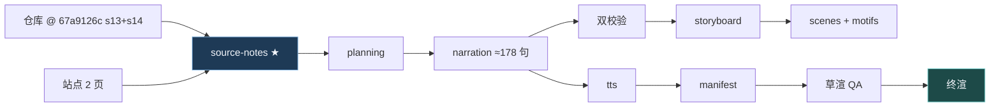

# 策划案：《AI 会自己开工吗？后台与定时》

> 事实源：[../research/source-notes.md](../research/source-notes.md)（信源清单 [../research/sources.toml](../research/sources.toml)）
> 逐字稿 SSOT：[narration.md](./narration.md) · 分镜：[storyboard.md](./storyboard.md)
> 可执行参数：[../pipeline.toml](../pipeline.toml)

## 一、定位

| 项 | 定义 |
|---|---|
| 系列 | Claude Code 通俗全解（独立成片） |
| 平台 / 形态 | B 站 / YouTube 1080p30，代码动画 + 本人克隆音色，无 BGM、无 emoji |
| 时长 | `target_minutes = [13.0, 14.6]`；≈3900 字 |
| 受众 | 普通人：都体验过「让 AI 装个依赖然后干等」；没想过「等待」本身是被设计掉的 |
| 核心内容 | 并发两章：s13 Background Tasks / s14 Cron Scheduler |
| 不覆盖 | s12 及多 Agent 各章；s11 恢复细节（占位条只到「合并注入」为止） |

**选题独特价值**：并发听起来是程序员的高深话题，本集把它翻译成两个人的日常——洗衣机和闹钟。
而底下的真相更妙：所谓后台，根本没有并行宇宙，只是「不等它」。两章合成一句人话：
**按下的不一定是它，等的一定不是你。**

## 二、叙事策略

**主线问题（P0 抛出、P5 回答）**
> 让它装个十分钟的依赖，这十分钟它在干什么？——干等。那能不能按下开始就走开？
> 再进一步：有些活，连按的人都不要。

**贯穿比喻体系：一台洗衣机与一只闹钟**
- s13 = 洗衣机（按下就走开，铃响了再来看；占位条=取衣凭证；通知队列=门口的信箱）。
- s14 = 闹钟（没人按，时间自己按；时间表=五格刻度盘；抖动=一排闹钟故意错峰响）。
- 递进句「按下的不一定是它，等的一定不是你」贯穿。

**记忆点节奏（10 个）**

| # | ≈时刻 | 记忆点 | 类型 | 回溯 |
|---|---|---|---|---|
| 1 | 0:30 | 十分钟干等，烧的是按字计费的钱 | 痛点 | s13 |
| 2 | 1:50 | 后台不是并行宇宙，只是「不等它」 | 本集最反直觉 | s13【三】 |
| 3 | 2:40 | 占位条先回，真结果后到——一次调用永对一条结果 | 机制之美 | s13 |
| 4 | 4:00 | 干完的通知不插队，「稍后」排在你的输入后面 | 现实感 | s13【三】 |
| 5 | 5:00 | 卡在「要不要继续？」上的活，有一只狗盯着 | 荒诞感 | s13【三】 |
| 6 | 6:20 | 定时的活不需要有人按开始 | 机制之美 | s14 |
| 7 | 7:30 | 表每秒跳一次，一分钟只放一枪 | 机制之美 | s14 |
| 8 | 8:40 | 全世界的定时器都卡整点，故意让它迟到一点——迟到多少是算出来的 | 反直觉 | s14【三】 |
| 9 | 10:00 | 七天不动就自动退休 | 现实感 | s14【三】 |
| 10 | 12:30 | 把进程关了表就停——它不是闹钟服务 | 诚实边界 | s14 |

**证据分级口播义务**：单线程真相/队列优先级/看门狗/七种任务/抖动确定性/七天退休/低优先级
标记全部【三】带归属句。勾选后台、关键词兜底、占位配对、四层模型、五格表、分钟标记、
进程内调度为【一】可直断。

**理性收尾**：不吹「AI 全自动未来」。落点——
**按下的不一定是它，等的一定不是你；但时钟还是装在它的身体里，不是挂在墙上。**

## 三、视觉语言

**色彩语义契约**（SSOT [../video/src/design/theme.ts](../video/src/design/theme.ts)）

| 色 | 值 | 语义 |
|---|---|---|
| 陶土橙 `core` | `#D97757` | 循环内核——本集题眼：环一秒不停 |
| 霜蓝 `later` | `#7FB2E0` | **本集己色**：不发生在这一轮里的事（后台块/队列/秒摆/被推迟的卡） |
| 石青 `mech` | `#64C4C0` | 把活挪出循环的机制 |
| 警示红 `deny` | `#EF6461` | 卡住/看门狗咬住/上限退休 |

两章不给两色：「谁按的开始」用**三段位置**编码（人在环上/人在环外/没有人），不用色相。

**母题（motifs.tsx，5 个）**
1. **LaundryClock**（洗衣机时钟）：按下后双手离开；计时环在画面角落自己走；完成时门开铃响。
2. **OffLoopWork**（环外跑）：主环持续转动；工作块沿环外旁轨滑行；占位条瞬间贴回环口。
3. **NoticeQueue**（通知队列）：环入口两级队列（下一轮/稍后）；用户输入卡永远排前。
4. **TimeDaemon**（秒摆）：每帧一跳的秒摆；命中分钟时一张卡片落入队列；坏任务砸出坑摆不停。
5. **HerdJitter**（防踩踏）：一排相同的表全指 9:00；各按算好的偏移错峰落下。

## 四、幕结构

| 幕 | 目标时长 | 主题 | 叙事要点 | 视觉锚点 |
|---|---|---|---|---|
| P0 | 0:00–0:55 | 十分钟干等 | 系列终端：装依赖进度条爬行；旁边计费表狂转；「你会站在洗衣机前等吗」 | 终端+计费表 |
| P1 | 0:55–2:50 | 丢后台 | 谁决定（勾选优先/关键词兜底）；线程守护位；【三】单线程真相 | LaundryClock + OffLoopWork |
| P2 | 2:50–5:00 | 接回来 | 占位条先回（配对语义）；通知排队列；【三】不插队「稍后」；七种任务角标；30 字标签一句 | NoticeQueue |
| P3 | 5:00–5:50 | 看门狗 | 【三】45 秒无动静→检查是否停在 y/n 提示上 | 秒表狗 |
| P4 | 5:50–8:00 | 没人按的开始 | 闹钟比喻；四层模型（秒摆/队列/处理器闸/消费）；五格时间表读法 | TimeDaemon |
| P5 | 8:00–11:00 | 时间表的真话 | 【三】抖动（确定性偏移防踩踏/整点提前 90 秒）；七天退休；诚实边界（进程关表停） | HerdJitter + 退休章 |
| P6 | 11:00–13:55 | 落点与信源 | 三种开始回收 + 一句话合同 + 信源卡 + 渐黑 | 三段位置图 + 金句卡 |

## 五、生产管线

## 六、边界与不做的事

1. 不做多 Agent/工作流（后话）；不做教程。
2. 不复刻站点美术；无 BGM/emoji；活数据纪律（notes §七）。
3. 【三】必带归属句；「cron」术语不进口播（用「时间表」）。
4. 口播不出现他集标题与顺序词。
