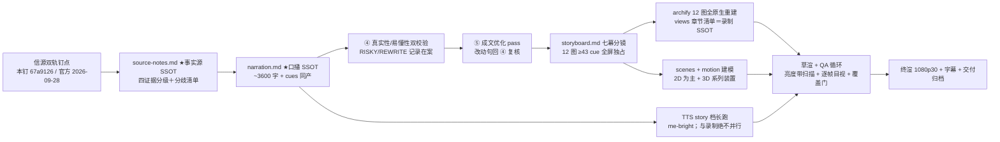

# Stage ② 策划案 ——《并发：谁来按下开始》（题已定，三处已同步）

> 事实源（一切口播断言的回溯终点）：[research/source-notes.md](../research/source-notes.md)（B 型·单一事实源，钉 67a9126（本集两章）／官方文档 code.claude.com@2026-09-28；main@0dcafa2 仅作「演进注记」对照，凡引以本钉为准）。
> 叙事蓝本：[174 精读章](../../../../../docs/research/agent-harness/174-claude-code-concurrency.md)（M1–M5 机制叙事＋轨 C 对照 a–h＋批判边界六条）。类比 SSOT：[170 §2 角色台账](../../../../../docs/research/agent-harness/170-claude-code-harness-overview.md)（通宵工坊剧场·全篇单射；制作期输入 `.temp/learn-cc-lab/analogy-plan.md` 与 `.temp/learn-cc-lab/dims/concurrency-brief.md` 不作持久引用——唯一例外：brief §5 两条负向清单以「制作期输入」名义进 P2 诚实注，备注显式标注）。
> 六节节名按 to-video skill 的 references/02-planning.md 规格；第 0 节为本次重制的拟题决策附加节。视觉契约落点：[theme.ts](../video/src/design/theme.ts)（本集维度色蓝已落位）；系列装置数据源：[series-layers.json](../video/src/series-layers.json)；可执行参数：[pipeline.toml](../pipeline.toml)（`chars_per_min = 254` 已填，无 ep2 的参数前置风险）。

## 0. 标题定案

题已定：**《并发：谁来按下开始》**（9 字，维度名前缀＋悬念判断句，合 ep1 立下的后四集句式建议——「谁来按下开始」即全片主线问题本身，标题里带着钩子）。系列五维重制启动时裁定，**三处已同步一致**——`series.json` 本集 `title`、`video/src/series-layers.json` layers[4].title、P6 身份卡受检硬编码（规则 8 按「：」后主段对账，Stage ⑥ 实现时落地核验）；`cardSub`「并发 · 时机」（已随裁定落 series.json）。无待决项，本节不列候选。

## 1. 定位表

| 项 | 值 |
| --- | --- |
| 平台 | B 站 / YouTube 中长视频 |
| 时长目标 | 硬窗 [13.0, 14.6] 分；**254 字/分含停顿口径**（ep1 CP1 实测校准值）定位 **3,600 字（±60）≈ 14.2 分**——直接按 254 写足，不走「按 280 写完再减脂」的回头路（ep1 教训：3,963 字减脂 319 字才落窗）。Stage ③ 定稿实测 **3,613 字 ≈ 14.2 分**，落窗。风险预案：story 档 manifest 实测若偏窗，沿 ep1 先例「补内容不注水」——优先序 = P4 官方对齐段 / P5 三档对照段，素材已在 notes |
| 形态 | AI 配音（story 段落演绎档＋克隆音色 me-bright）＋ Remotion 代码动画（2D 为主＋3D 系列装置）＋ archify 12 图**全原生重建**全屏独占逐章回放；无真人 |
| 受众 | 不预设背景的工程师观众：天天用 Claude Code（或任一 coding agent）、见过它跑长命令、把命令丢后台、设过定时任务，但没想过「等待是谁在等、开始是谁在按」的人 |
| 核心范围 | 两章机制主线全入片：后台任务两级判定＋占位回执＋登记板与锁（M1）／完成通知一问一答＋同框合流（M2）／停滞巡视＋进度摘要【三】全归属（M3）／四层解耦＋带日期分钟去重＋非阻塞试锁＋坏任务三层防护（M4）／durable 边界＋官方三档＋没有真并发收束（M5）＋轨 C 硬校准（超时自动转后台、退出清理、SDK 通知同构、Monitor 与 Push 双通路、每秒低优先级轮间触发、不补跑、三档定时）＋一条批判边界（「后台更省」零量化，证明的是时机不是开销） |
| 明确砍掉 | 定时抖动数值（重复任务延迟上限两口径冲突——分歧 #2，非主线，本集不进口播；「整点任务故意提早」彩蛋一并砍）；7 天过期与 50 任务上限（产品护栏，主线无位，图集/角标可补）；DOM/DOW 同约束取 OR 的 cron 冷知识（两源一致但非主线）；【三】源码行号级断言（enqueueTaskNotification／query.ts 消费点等只进角标）；前台并发上限默认 10（属「同时能跑几个」——本集明确不回答这个问题，只在收束句反面点一下，不引数字）；main 轨四道闸演进注记（前置钩子门禁／登记回滚／进程组回收——精读章文档层保留，不进口播）；精读章附录的工作流扇出并发（main 独有章，**附录内容不进口播，仅文档层**）；本集两章之后的一切机制（后续各归各集，口播零预告） |

## 2. 叙事策略

**剧场（单一世界观，全片唯一）**：通宵不打烊的工坊——模型是手很快但从不记事的师傅，harness 是工坊本身。本集四新角色严格沿 170 §2 台账单射：**自动清洗槽**＝后台任务（按下就走开）／**叫号器**＝后台完成通知（挂牌不喊人）／**学徒**＝停滞巡视＋进度摘要（只看不动手）／**墙上的定时钟**＝定时调度（不认识师傅，只认表）；「入口的小格子」为钟的附件（＝定时队列，只存条子），占位回执口语化为「号牌」（＝四位编号的任务号）。「传送带」「台面」「一托盘」「师傅」为已建角色复用（P0 复述半句即出场，不涉任何顺序词）；三条防撞规则原文有效（台账第一条的通名禁用词全程回避、四个帮手不混用——学徒只看不动手，不写摘要不挑记忆、三类卡片不同名——叫号器 ≠ 队友收件格 ≠ 排工板，入口小格子只存定时条）；类比每处 1–3 句即止、只承担结构同构不承担性能等同。

**主线问题（钩子→悬念→回答）**：
- 钩子（P0）：「慢活，等不等？到点的活，谁来按开始？」——传送带遇到两种时间：慢命令一跑十分钟、师傅按量计费干站着烧钱；到点的活不属于任何一次对话，触发权攥在用户手里，你忘了它就一整天没干。先埋收尾句：所谓后台，没有平行宇宙。
- 悬念（P1–P5）：两种「不等」各配一套装置——后台线（不等它：清洗槽两级判定甩活＋号牌占位＋叫号器独立通知＋学徒看增量）；定时线（没人按：钟判时＋小格子存条＋试锁判闲＋同流注入＋带日期去重＋坏闹钟三层防护）。另有一条副悬念线贯穿并在 P5 兑现：**处处像并发，实则一条传送带到底**——线程存在但不执行工具，教学版有真线程而产品只是「发起之后不去等」，语义一字不差。
- 回答（P6）：所谓后台没有平行宇宙，只是不等它；所谓定时没有魔法，只是钟替你按开始——外加一条诚实边界：调度随工坊打烊而停，durable 只保闹钟不保错过。

**记忆点节奏（约 60–90 秒一个，全片 15 个，全部可溯源 notes／brief §6 锚句白名单）**：锚句白名单——「所谓后台，没有平行宇宙」／「你不会站在洗衣机前面干等三十分钟」／「先给号牌，活慢慢干」／「一次派工只配一张回执，完成只能另立通知」／「叫号器不主动喊人，等人路过」／「判卡没卡，只问输出还长不长，不问跑了多久」（【三】）／「钟说的话和人说的话进了同一条流」／「墙上的钟不认识师傅——四层没有一层顺便看表」／「拿不到锁就是正忙，忙碌不需要另立牌子」／「一个坏闹钟，不许拖垮整面墙」／「存下的是闹钟，不是没响的那几次」／「错过不按次数补，空闲后最多补一次」（【官】）／「教学版有真线程，产品反而没有——所谓后台，就是发起之后不去等」（【三】）／「这一层回答谁来按下开始，从不回答同时能跑几个」／「证明的是不必干等，不是更便宜」。

**理性收尾原则**：不贩卖焦虑（后台/定时叙事不渲染「无人值守失控」想象——坏闹钟有防护、durable 边界如实交代）；不裁决「真线程 vs 单线程事件循环」之争（brief §4 唯一争议候选——并发语义与并发实现是两个正交维度，教学版用实现差异教语义，两派并非真冲突，P5 以「语义一字不差」收拢不站队）；「后台更省」以设计动机口径讲（brief §5.1 负向清单：材料零 token/费用量化），不伪装成测量结论。

## 3. 视觉语言

**色彩语义契约**（沿用 [theme.ts](../video/src/design/theme.ts) scaffold 既有系列键，跨幕严格用色；本集维度色蓝已落位，不新增色相）：

| 概念 | 键 | 值 | 语义（全片唯一） |
| --- | --- | --- | --- |
| 传送带／循环内核 | core | `#D97757` | **全系列恒定**——「循环始终不变」视觉锚〔M-001〕；本集戏份收窄为恒转底盘（「装置动、带不停」＝本集视觉动词），P5 自白幕主用 |
| 时机装置（清洗槽／叫号器／学徒／定时钟／入口小格子／号牌） | mech | `#7FB2E0` | **本集维度色（时机·蓝）**：一切「接管时间」的装置一律蓝——本集总命题「等待被外包」＝蓝色装置群把两类时间从传送带边搬走 |
| 机制深态（装置暗态／描边深档／3D 层板 lit 面） | mechDeep | `#5588B5` | mech 深档 |
| 传送带深档（底盘描边／托盘暗态） | coreDeep | `#B45A3C` | core 深档：与装置蓝形成「底／装」对比，防与 mech 撞义 |
| 卡死／坏闹钟／进程死亡／打烊停摆 | deny | `#EF6461` | 危险与失控唯一语义（P3 卡死槽位、P5 打烊灯灭主用） |
| 触发瞬态／通知送达一闪 | ok | `#7ED321` | 仅确认瞬间的瞬时绿（底座纪律） |
| 师傅／用户／数据流 | text 白／dim 灰 | `#F2F5FA`/`#9AA7B8` | **装置才有颜色**：非装置皆无彩（同 ep1/ep2 纪律；学徒为机制化身，用 mech 蓝描边剪影区别于无彩师傅） |

恒定空间契约（防〔X-001〕空间逆旁白）：**传送带恒居画面左中锚位**（core 橙恒转底盘——本集恒定主视觉的「底」）；时机装置自右缘／上缘挂入（mech 蓝），「接管时间」的动效永远表现为装置在动而传送带不停（甩活瞬间仅托盘离带、带速不变）；师傅剪影（text 白无彩）立于带侧。金句卡衬线体（theme.serif）；代码实景只进画面角标与实景卡（mono 等宽＋引语卡引语态），不进口播。

**3D 视觉语言（@remotion/three 路线，控制面积）**：
- **P0 与 P6 用 3D 层板（HarnessStack）作系列装置**：P0 五层栈落板→并发层点亮呼吸→缩退为顶边常驻条（HarnessBadge，P1–P6）；P6 p6 档放大收束。
- 正文幕（P1–P5）以 2D＋archify 全屏独占为主，3D 母题点缀限两处（候选：P1 清洗槽滚筒 solids-3d／P4 定时针摆 LottieEmphasis·clock-swing；Stage ⑥ 定）。理由同 ep1：ISSUE-177（chip 塌缩重叠）／180（同色面 3D 只剩棱线）／182（层序只对 z 一维）全部集中在 3D 段——**控制 3D 面积＝控制回归面**。

**系列横切装置**：顶边常驻条（HarnessBadge chip 档，层短名走 series-layers.json 数据）＋ P6 系列身份卡与下期卡（标题主段走规则 8 受检硬编码，数据对账 series-layers.json ↔ series.json；下期＝多 Agent 平台维度，仅视觉层，口播只说「下期」）。

**archify 图集预算（12 图全原生重建，6 型，命名循 `claude-code--{slug}.html`）**：docs 既有同名题材产物（timing-panorama 等）一律走**原生重建**，不留 html_overrides 通道——ep1 教训：旧格式回填不可用，复用即返工。图集表：

| # | slug | 型 | 幕 | 内容要点（回溯 source-notes） |
| --- | --- | --- | --- | --- |
| 1 | bg-two-verdicts | workflow | P1 | 两级判定：显式参数优先→关键词兜底→同步/后台分叉（§一·机制 1） |
| 2 | bg-placeholder-receipt | sequence | P1 | 占位回执时序：派工→号牌→独立线程→下一轮通知回流（§一·机制 2/4） |
| 3 | bg-board-and-lock | architecture | P1 | 登记板／锁临界区／daemon 退出连带（§一·机制 2/5＋防护与边界） |
| 4 | notify-protocol | state | P2 | 一问一答配对与独立通知块（§一·机制 3；官方对照 10 同构） |
| 5 | notify-merge | dataflow | P2 | 通知与工具结果同框合流（§一·机制 4） |
| 6 | apprentice-watch | workflow | P3 | 停滞判据（增量非时长）＋进度小字条（§一·生产版对照【三】；官方对照 12） |
| 7 | clock-four-layers | architecture | P4 | 四层解耦：判时／存条／判闲／注入单向链（§二·机制 1/9/10/11） |
| 8 | clock-dedupe | dataflow | P4 | 带日期的分钟标记一键挡两错（§二·机制 7） |
| 9 | clock-bad-jobs | state | P4 | 坏任务三层防护＋一次性触发即删（§二·机制 5/8＋防护与竞态） |
| 10 | durable-lifecycle | lifecycle | P5 | durable 生命周期：定义落盘→重启恢复→不补跑（§二·机制 12；官方对照 21） |
| 11 | schedule-three-tiers | architecture | P5 | 官方三档定时阶梯（官方对照 23【官】） |
| 12 | timing-panorama | architecture | P5 | 本维度总装全景（原生重绘：后台支路／通知支路／定时支路三线互不叠加、汇回传送带） |

cue 预算 ≥43（密度门 3.0/分 × ~14.2 分），锚定率门 0.30。

## 4. 分幕结构表（七幕；字数已按 narration.md v1 定稿实测回填，254 口径）

| 幕 | 目标时间／字数 | 主题 | 叙事要点（回溯 source-notes） | 视觉锚点 | 记忆点候选 |
| --- | --- | --- | --- | --- | --- |
| P0 | ~1.43 分／362 字 | 钩子·两类时间 | ①剧场重建（自含、零顺序词）：工坊＋师傅（手快不记事）＋Harness 一句＋传送带半句（170 §2）；②第一种时间：慢活——十分钟装框架、三分钟跑构建、传送带停等、按量计费空转烧钱（§一·定位与标语）；③第二种时间：到点的活——不属于任何对话、触发权攥在用户手里、你说一句动一下（§二·定位与标语）；④立碑：答案不是更快机器或多开工坊，是两样新装置（清洗槽＋定时钟）；收尾句预埋「所谓后台，没有平行宇宙」 | HarnessStack P0 3D 五层栈落板→并发层点亮呼吸；主问题字卡双联（mech 蓝点睛）；慢活卡带／日历墙九点刻度；两装置预告剪影（mech 蓝 ×2）；角标 `pip install`／`npm run build` | 「站着干等的每一秒，都是白烧的钱」；「所谓后台，没有平行宇宙」（预告态） |
| P1 | ~2.56 分／651 字 | 清洗槽·把慢活甩出去 | ①洗衣机比喻原话化：三十分钟滴滴、没人干站（§一·定位与标语）→ 清洗槽落位；②两级判定：主路师傅开口勾开关，兜底关键词猜慢活，「正路是开口，猜只是兜底」自承（§一·机制 1）；③占位回执：号牌四位编号当场返回、传送带一拍不停（§一·机制 2/4）；④登记板＋锁：编号/命令/状态、独立线程、首次两拨人同写一块板先立锁（§一·机制 2/5）；⑤边界：登记板不落纸面进程关即没、线程拴进程打烊断电、结果只裁开头一小段（§一·防护与边界）；⑥官方对照四连：异步+任务号即回／快捷键挪后台／超时自动转后台不硬停（教学版未教）／输出写文件读回（§一·官方文档对照 1/2/3/4【官】） | 两级判定分叉图；号牌弹出+带不停动效（〔X-001〕防线：甩活只托盘离带）；登记板持锁书写；边界三联卡（断电消散／大门拴线／小票裁短）；官方对照卡；archify: bg-two-verdicts＋bg-placeholder-receipt＋bg-board-and-lock | 「先给号牌，活慢慢干」；「头一回两拨人同写一块板——先立锁，再动手」 |
| P2 | ~1.96 分／497 字 | 叫号器·完成怎么知道 | ①硬协议：一次派工只配一张回执、占位回执已交过、完成是另一件事不能补发→通知另立门户（§一·机制 3 一问一答配对语义）；②同框合流：通知小票搭顺风车、与工具结果拼同一条消息（§一·机制 4）；③不主动唤醒：挂牌等人路过、下趟才看见、打烊即永失（§一·机制 3）；④官方同构：SDK 通知消息三态、外部长调用真实结果走同路；推人通路：桌面通知人走开也找得到（§一·官方文档对照 10/11【官】）；⑤诚实注（brief §5.1 负向清单）：空转烧钱是动机不是成绩单、材料零量化、证明的是不必干等不是更便宜 | 叫号器首现＋协议配对锁死卡；同框合流 dataflow；三态徽标＋推人通路卡；账本空白页诚实卡；archify: notify-protocol＋notify-merge | 「一次派工只配一张回执」；「叫号器不主动喊人，等人路过」；「证明的是不必干等，不是更便宜」 |
| P3 | ~1.45 分／369 字 | 学徒的字条·它还活着吗 | ①新担心：甩出去的活卡半路；教学版零落地（负向实证，§一·生产版对照）；②【三】归属句引入学徒：只看不动手、隔阵子瞄一眼；判据＝输出还长不长（增量非时长）、四十五秒不涨才凑近（数值带归属）；停在问话上等不会来的按键；(y/n) 嗅探（§一·生产版对照【三】）；③小字条：另一路更小的模型并行写、像给改动写标题不写成句子、近乎免费（并行且更快，§一·生产版对照【三】）；④官方产品面：监视工具盯后台输出逐行看、超时收队（§一·官方文档对照 12【官】） | 清洗槽群+卡死槽位 deny 红警示；教学版空页负向卡；学徒 mech 蓝描边剪影+小字条动效；旁路箭头先于主线；监视工具流式视图卡；archify: apprentice-watch | 「判卡没卡，只问输出还长不长，不问跑了多久」（【三】）；「近乎免费，因为并行而且更快」 |
| P4 | ~2.83 分／717 字 | 墙上的定时钟·谁来按开始 | ①触发权痛点收束＋闹钟比喻原话：设好七点照响不误（§二·定位与标语）；②钟＋五格时间表：分钟/小时/日/月/星期、老写法用五十年（§二·机制 2＋核心比喻）；③四层解耦：钟每秒醒只看表不看人→请求条塞入口小格子（只存条）→岗哨试锁判闲（拿得到=空、拿不到=忙跳过、锁本身就是状态）→传送带把条子当一句话收进对话、钟话人话同流听不出差别（§二·机制 1/9/10/11）；④防重放：每秒醒而表最小刻度是分钟、同分钟六十来次、日期+时分记号一键挡两错（当分钟重放+次日漏放，§二·机制 7）；⑤坏闹钟三层防护：注册先验表、运行期单独兜住、一个坏闹钟不拖垮整面墙；一次性响完即删（§二·机制 5/6/8＋防护与竞态）；⑥官方对齐：每秒检查低优先级入队、插在两轮之间绝不半截打断、忙则等本轮结束（§二·官方文档对照 14【官】） | 定时钟落墙+七点叙事卡+五格表特写；四层解耦总装图（单向箭头、钟与师傅背对）；六十格命中闪烁→记号牌挡下；坏闹钟防护卡；轮间触发时间轴；archify: clock-four-layers＋clock-dedupe＋clock-bad-jobs | 「墙上的钟不认识师傅」；「拿不到锁就是正忙，忙碌不需要另立牌子」；「钟说的话和人说的话进了同一条流」；「一个坏闹钟，不许拖垮整面墙」 |
| P5 | ~2.54 分／646 字 | 诚实的边界·durable 不是永生 | ①大实话：钟挂工坊墙上、工坊关门钟就停；后台线程进程死跟着死（§二·机制 12＋§一·防护与边界）；②durable 边界：存下的是闹钟不是没响的那几次、盘上只有任务定义、重启从当下看起错过不补；边界原话「想关机也在跑，请用系统自带的定时器」（§二·机制 12【二】）；官方同口径更精确：不按次数补、空闲后最多补一次（§二·官方文档对照 21【官】）；③官方三档：会话循环指令／桌面档最小一分钟重启也活着／云端档不用开会话（§二·官方文档对照 23【官】）——教学版把进程外定时划给操作系统、官方做成产品；④传送带自白：两个事实（托盘串行从不并排跑【一】；线程真有但不执行工具只甩活看表【一】）→【三】归属句：产品跑单线程事件循环、后台全部含义=发起之后不去等；教学版有真线程产品反而没有、语义一字不差；收束「回答谁来按下开始、要不要等，从不回答同时能跑几个」 | 打烊灯灭+钟停摆（deny 渐暗）；磁盘定义卡→重启→错过刻度灰置；三档阶梯图；全景拉远（槽转/钟走/带仍一条）；托盘串行动效；单线圈图；archify: durable-lifecycle＋schedule-three-tiers＋timing-panorama | 「存下的是闹钟，不是没响的那几次」；「教学版有真线程，产品反而没有」；「这一层回答谁来按下开始，从不回答同时能跑几个」 |
| P6 | ~1.46 分／371 字 | 收束·只是不等它 | ①两问题对账：慢活不等（开关+号牌+路过看牌）、到点没人按（钟看表+空了才递条）；②收预埋句：所谓后台没有平行宇宙——工坊没变两间、传送带没变两条、变的只有师傅学会了不站着等；③遗产句：等待可以外包（交给清洗槽/定时钟/叫号器），但外包的只是等待不是永动——打烊钟就停；边界之内装置尽管挂、之外交给系统和云端；④看工具的方法论（时机版）：别急着数同时跑几个，先看它把等待放到哪里、把开始交给谁；⑤系列装置收尾：最后一个区未亮灯＋下期（从一个人到一支队伍——怎么分工怎么对账），口播只说「下期」 | HarnessStack p6 档 3D 放大＋系列身份卡（chip 档）＋下期卡；两问题对账卡逐个打钩；金句卡衬线体终态〔M-003〕；三装置对账卡（mech ×3 打钩，core 橙底盘恒静） | 「所谓后台，没有平行宇宙，只是不等它」；「等待可以外包，但外包的只是等待，不是永动」 |

合计 **3,613 字 ≈ 14.2 分** @254（硬窗 [13.0, 14.6] 内；Stage ③ 定稿实测 170 句、句均 21.3 字、超 35 字句 0；15 个记忆点 ≈ 每 57 秒一个）。

## 5. 生产管线图

```mermaid
flowchart LR
    A[信源双轨钉点<br/>本钉 67a9126 / 官方 2026-09-28] --> B[source-notes.md ★事实源 SSOT<br/>四证据分级＋分歧清单]
    B --> C[narration.md ★口播 SSOT<br/>~3600 字 + cues 同产]
    C --> D[④ 真实性/易懂性双校验<br/>RISKY/REWRITE 记录在案]
    D --> E[⑤ 成文优化 pass<br/>改动句回 ④ 复核]
    E --> F[storyboard.md 七幕分镜<br/>12 图 ≥43 cue 全屏独占]
    F --> G[archify 12 图全原生重建<br/>views 章节清单＝录制 SSOT]
    F --> H[scenes + motion 建模<br/>2D 为主 + 3D 系列装置]
    C --> I[TTS story 档长跑<br/>me-bright；与录制绝不并行]
    G & H & I --> J[草渲 + QA 循环<br/>亮度带扫描 + 逐帧目视 + 覆盖门]
    J --> K[终渲 1080p30 + 字幕 + 交付归档]
```

## 6. 边界与不做的事

- **BGM 留空轨**；本片 zh 单语（英文版触发条件＝用户明确要求）。
- **规则 7 匿名化**：口播／画面备注／分镜／场景组件禁信源标识族与全部强标识词（词表以 check_series.py 规则 7 常量为准，含章号词形）——**画面备注同样不许出现章号**（一律用 source-notes 节号「§一…§二」表述，本集两章与 main 轨同号不同物，撞号纪律只在 research/source-map 层履行）；指称信源一律「这个开源项目」；【三】归属句模板：「这个开源项目的作者拆过真实实现后说……」（本集 2 处主归属＋块内复指）；【官】断言表述为「官方文档明写／说／确认」。
- **活数据不进口播**：本钉常数（同步超时秒数、输出与摘要截断长度、轮询节奏精确值、慢活关键词清单条数）一律定性表述；【三】数值带归属句可引（四十五秒停滞、小模型并行且更快）；官方数字带引语态可引（每秒检查、三档最小间隔）；README 叙事数字（十分钟装框架、三分钟跑构建、洗衣机三十分钟、闹钟七点、五格老写法用五十年）属教学叙事口径可引，不冒充系统参数。
- **英文标识符只进画面角标**（run_in_background／bg_0001／task_notification／tool_use ↔ tool_result／cron_queue／agent_lock／minute_marker／validate_cron／[Scheduled]／.scheduled_tasks.json／Monitor／PushNotification 等，口播用中文机制名）；可口播的英文词仅 Claude Code 与 Harness（术语规范），本稿口播英文收敛到 Harness 一处（p0-03），其余零英文口播。
- **分歧处置默认规则**：拆源码结论 vs 官方口径，取官方轨并双方并记（本集唯一数值冲突＝重复任务抖动上限，直接砍出不进口播——分歧 #2）；单侧口径（看门狗秒数／线程模型「不 await」／通知优先级档位）一律带归属句，不得包装成官方背书；README vs code 以 code.py 为准。
- **反串线（规则 1）**：口播不出现他集标题、集数序号或任何回看类顺序词（词形以 check_series.py 规则 1 常量为准）；「下期」仅收尾语与下期卡一次；「工坊只剩最后一个区没亮灯」属机制陈述可用（不作集数指涉）；「前面几区学会了记事、排活、不干等」是机制对账句，不点名任何一集。
- **类比纪律**：角色单射沿 170 §2 台账（本集四新角色已入账：清洗槽／叫号器／学徒／定时钟）；三条防撞规则有效（通名禁用词全程回避、四个帮手不混用、三类卡片不同名——叫号器 ≠ 队友收件格 ≠ 排工板）；类比 1–3 句即止，不承担性能等同。
- **画面纪律**：画面文字只放关键词／数字／标签（≤6 字），禁整句复述口播（双字幕教训）；storyboard 全文禁「archify full/inset」字面串（覆盖门全文计数即 FAIL）；全屏独占期间常驻装置让位。
- **许可**：教学仓 MIT（引语可上引语卡）；官方文档只作事实转述不大段复制；archify 图入库循仓内资产规范。
- **信源时效**：官方文档访问 2026-09-28；成片前若上游修订，回 notes 复核带版本口径的断言（超时自动转后台的默认值、三档最小间隔、SDK 通知字段）。
- **不做的事**：不预演第五维度机制（队伍／收件格／排工板零预告——下期只说「从一个人到一支队伍」）；不拿教学版瑕疵批评产品、不拿产品能力夸教学版（轨混禁令）；不引【三】文件行号级断言（负向清单）；精读章附录的工作流扇出并发不进口播（main 独有章，仅文档层）；不回答「同时能跑几个」（前台并发上限数字不引，只在收束句反面点一下）。
