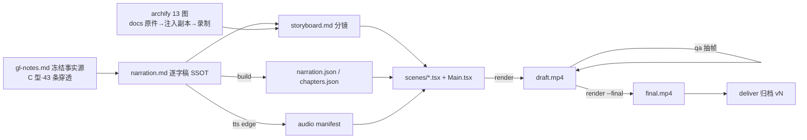

# 策划案 · 并发与调度：一张回执和四层钟（v1，人工已选定骨架 A / 标题 T4 / 钩子 H1）

> 注：T 系标题候选清单未入档本策划案（编号引用仅存本行与 H4 行两处；T4＝本片主标题「并发与调度：一张回执和四层钟」，人工拍板）。

> 依据 to-video skill「references/02-planning.md」六节规格撰写（技能仓在仓外，不作链接）；事实源 = [research/gl-notes.md](../research/gl-notes.md)（C 型冻结，43 条穿透全绿）。

## 一、定位表

| 项 | 值 |
|---|---|
| 平台 | B 站 / YouTube 中长视频 |
| 时长目标 | [13.0, 14.6] 分（254 字/分含停顿等效 → 可用 ~3300–3700 字；规划 **166 句 / ~3570 字 ≈ 14.0 分**） |
| 形态 | AI 配音（edge 草声 zh-CN-YunxiNeural；IndexTTS-2.5 升档待用户显式触发）+ Remotion 代码动画 + archify 逐章回放（全屏独占，forbid_inset） |
| 受众 | 不预设 ML 背景的普通人（系列既定口径） |
| 核心范围 | 176 全量：§1 病根与两条规格 → §3 后台化与通知回注 → §4 cron 四层解耦 → §5 durable 与进程内前提 → §6 教学版×生产版对账 → §8 五次破坏性实验 → §9 五规律两争议 → §10 边界 |
| 信源 | gl-notes.md（唯一事实源正文）+ sources.toml 15 条 + 附录二类比登记表（一物一喻继承）+ 附录三穿透裁定四条（写作期必须消费） |

## 二、叙事策略

- **骨架（人工选定 A「拆机实验室」）**：先快速立起两台装置（它们工作得很好）→ 进实验室**每次只拆一个零件**看它怎么死 → 与官方产品对账收束。结构上与旧版「装置逐一登场」区隔：每机制压缩为一幕内多拍（P2/P3 各四拍），腾出 P5 实验室 + P6 对账两个旧版没有的整幕。
- **视觉母题统摄 + 局部类比按难点准入**：全片连续感由工坊剧场（系列契约）+ core 橙传送带恒定锚（M-001）+ 两条空间分轨承担；类比只继承 gl-notes 附录二四条，1–3 句点亮即切回机制画面，不升格为贯穿剧场。
- **一条主线问题**：等待为什么被塞进了主循环？怎么把它赶出去，还不违反对话协议？
- **钩子矩阵（人工选定 H1）**：

| # | 钩子文本（p0-01） | 留存逻辑 | 主干锚点 | 核心引子 | 状态 |
|---|---|---|---|---|---|
| **H1** | **这是一台好机器——可只要拆掉一个零件，它就换一种死法。** | 反直觉悬念（好机器×死法） | §8 e1–e5（P5 实验室） | 每个零件缺一不可，逐个拆给你看 | **★ 选定（人工 2026-10-03）：与 P5 强咬合、P0 预告→P5 兑现→P6 回扣的结构闭环最完整** |
| H2 | 这是 Agent 最贵的十分钟：命令在跑，模型站在原地烧钱。 | 危机痛点 | §1 | 等待是主循环最贵的成本 | 落选 |
| H3 | 这是一百二十秒的两种命运：教学版拿它当死刑线，官方产品拿它当转后台的门铃。 | 数字反差 | §6/§7 | 教学与产品差多远 | 落选（荐配 B） |
| H4 | 这是一条铁律：一次调用，只配一个结果。 | 机制揭示 | §3.1 | 协议起点 | 落选（与 T2 同源风险） |
| H5 | 这是一张写在磁盘上的时间表——它永远不会自己跑。 | 误解颠覆 | §5 | 最常见误解点 | 落选 |

- **记忆点节奏**（每 60–90 秒）：P0 两种白等 → P1 立碑两条规格 → P2 网购回执类比+两回合同框 → P3 OR 反直觉（9 月 28 日周一实例+每月 1 日也触发）→ P4 磁盘≠活着 → P5 五开关五种死法 → P6 抖动硬分歧+五规律。
- **理性收尾**：悬念留在两争议（启发式该不该留生产 / 定时任务该活多久——官方与 Unix 传统防的东西不同，不可消除只能分档）；边界护栏卡收束；下期卡只说「下期」。
- **穿透裁定消费清单**（附录三，写作期硬约束）：① 11 个关键词（非 10）；② 两回合剧本按 R8 修正版（读 package.json 在第 2 回合）；③ 配对语义按「带同一个编号的结果」表述（O15 补证）；④ OR 实例补「每月 1 日也触发」半句。

## 三、视觉语言

- **色彩语义契约**（theme.ts 已就位）：
  - core 陶土橙 `#D97757` = 主循环/传送带（**全系列恒定锚**，〔M-001〕跨镜色值线宽逐像素一致）；
  - mech 时机蓝 `#7FB2E0` / mechDeep `#5C8FB8` = 本集维度色「时机层」机制族；
  - accent 金 `#EFB13C` = 强调/金句卡（系列「金=强调」语义族）；
  - 警示红 `#FF5C5C` = 实验室「拆掉后」崩溃态；确认绿 `#7ED321` = 「机制在位」基线态（P5 红绿对拍专属语义，C 型素材映射契约 3）。
- **空间分轨**（本集构图契约）：后台线（s13）走画面右缘纵深；定时线（s14）走画面上缘横陈；两线互不叠压。〔X-001〕自查：高亮位置与旁白主语一致。
- 深色底 `#0E1116`；金句卡衬线体（theme.serif）；cron 表达式与参数名只作画面角标。
- 定式引用：M-001（core 锚）、M-002（以静写闷——P0 干等烧钱段刻意无强调动效）、M-003（持续陈述配持续态——P4 durable 两档对比）。
- **C 型素材映射契约**（01 §七）：SCQA→P1 立碑全景坐标（换幕锚点图）；两回合剧本→P2 Animated State Trace（npm install 具体输入穿过双闸→占位→通知回注）；e1–e5→P5 Counterfactual Ablation Contrast（红绿对拍）；五数字→P6 动态标尺（useCount）；边界→P6 护栏卡。

## 四、分幕结构表（骨架 A 定稿）

| 幕 | 幕名（章节条 2–8 字） | 目标时间 | 句/字预算 | 176 章节 | 叙事要点（回溯锚） | 视觉锚点 |
|---|---|---|---|---|---|---|
| P0 | 两种白等 | ~1.2 分 | 14 / ~300 | 引言+§1 前半 | H1 钩子拆机预告；工坊场景回归（系列锚句）；慢命令堵路（计费条烧钱）；周期任务靠人推；抛主线问题 | 拆机预告剪影（五零件轮廓）；计费条〔M-002〕 |
| P1 | 病根与两条规格 | ~1.7 分 | 20 / ~430 | §1+§2 | 同一病根（等待塞进推理循环、触发权攥在人和模型手里）；两条规格立碑＝全片地图（异步回来/定时解耦） | 立碑装置+全景坐标图（换幕锚） |
| P2 | 一张回执 | ~3.0 分 | 34 / ~730 | §3 全 | 四拍：①协议硬规矩+网购类比（O15 表述）②双闸分派（11 关键词+显式假挡不住 R3）③占位回执三件事（bg_0001/锁/daemon）④两回合剧本走查（R8 修正版，Animated State Trace） | 右缘后台线；两回合同框；通知 XML 角标 |
| P3 | 四层钟 | ~3.0 分 | 34 / ~730 | §4 全 | 四拍：①四层解耦（定时钟+医院类比·候诊屏改词）②五段表达式+OR 反直觉（9 月 28 实例+每月 1 日 R10+零食家规）③三道保险（带日期记号/单任务兜错/双重校验）④敲门走开（0.2s 非阻塞）+全周期走查 | 上缘定时线；表达式五段格；四泳道图（复用 176 图） |
| P4 | 磁盘不等于活着 | ~1.4 分 | 16 / ~350 | §5 | durable 两档；调度器活在进程里；恢复四例外与只列出不执行；三条出路（云/桌面/Actions） | 磁盘文件×心跳线分离〔M-003〕 |
| P5 | 拆机实验室 | ~2.6 分 | 28 / ~600 | §8 | 五个开关五种死法：e1 毒任务灭调度线程 / e2 记号丢日期次日哑火 / e3 OR 改 AND 静默漏 / e4 硬注入打断回合 / e5 拔兜底干等 600 秒；另带教学版两处翻车（120s 复用/200 字截断） | 实验台五开关；红绿消融对拍 |
| P6 | 对账与五条规律 | ~1.7 分 | 20 / ~430 | §6+§9+§10 | 对账三类（获印证/抖动硬分歧 O6/官方没讲：120s 自动转后台+Ctrl+B+5GB）；学徒诚实注一句（三级归属）；五规律速收；两争议留悬念；边界护栏；下期卡 | 对账桌三色；五规律卡；护栏卡 |

合计 166 句 / ~3570 字 / ≈14.0 分（窗 [13.0,14.6] 中位；超窗先收 P2/P3 各一拍）。

## 五、生产管线图（Mermaid）

```mermaid
graph LR
  A[gl-notes.md 冻结事实源<br/>C 型·43 条穿透] --> B[narration.md 逐字稿 SSOT]
  B -->|build| C[narration.json / chapters.json]
  B --> D[storyboard.md 分镜]
  B -->|tts edge| E[audio manifest]
  F[archify 13 图<br/>docs 原件→注入副本→录制] --> D
  D --> G[scenes/*.tsx + Main.tsx]
  C --> G
  E --> G
  G -->|render| H[draft.mp4] -->|qa 抽帧| H
  H -->|render --final| I[final.mp4] --> J[deliver 归档 vN]
```

## 六、边界与不做的事

- BGM 留空轨；信源外观点不进口播；多 Agent 并行（下一章主题）只在 P6 边界一句带过不展开。
- **口播零信源站标识**：称谓三件套「教学版 / 这个开源项目 / 官方产品」（禁「课程」/站名/章号 s13 s14）；【三】断言（学徒看门狗、七种任务类型、Haiku 摘要等）前 3 句内归属句 + 画面角标。
- 活数据不进口播；本钉常数引用以附录三台账定级为准（120 秒/200 字/50 个/7 天/30 分钟或区间之半/90 秒/0.2 秒/1 秒/10 并发/11 关键词/600 秒/45 秒〔三级〕）。
- 英文标识符进角标不口播：cron→「定时表达式」（角标 `cron`）、run_in_background→「后台参数」（角标）、bg_0001 可读作编号、task_notification→「任务通知」（角标 XML 样式）；Harness 直呼（系列已验证口径）。
- N9 归纳（三方站位）如引用须带「有人这样归纳」归属；R14 main 轨 import 差异可作 P4 彩蛋（带轨道归属）。
- 声音：edge 草声交付完整成片；升档换声不阻塞本片交付。
