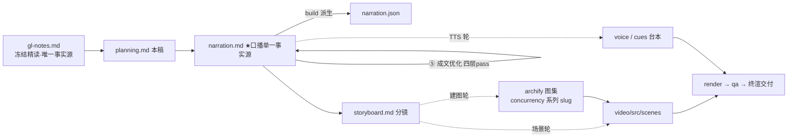

# 策划案：《并发》（v3 · 剧本换代待审 · C 型信源 = gl-notes）

> 状态：v3 换代稿（2026-10-07）。旧剧本退场，本稿以 `research/gl-notes.md`（冻结自 docs/research/agent-harness/174 精读）为唯一事实源；标题候选与钩子选定均待人工复核。本轮到分镜为止，不涉 TTS / 渲染 / 场景代码 / archify 建图。

## 0. 候选新标题（待审核 · series.json 本轮不改，维持《并发：谁来按下开始》）

| 候选 | 一句话理由 |
|---|---|
| A《并发：不等它，也不必在场》 | 直取两机制本质短语（「不等它」「没人按开始也照跑」），对仗且覆盖全片 |
| B《并发：一张回执与一座钟》 | 两件核心器物对举，画面感强，与 p0-01 钩子同构 |
| C《并发：把时间拆出对话》 | 落在 gl-notes 一句话定位（两种「把时间从对话里拆出来」的机制），抽象但准 |
| D《并发：谁在替 Agent 看表》 | 问题型，指向调度线程这一最反直觉的设计（对话循环自己看不了表） |
| E《并发：先回执，后叫号》 | 只覆盖后台任务半边，窄（备选下策） |

## 一、定位表

| 项 | 值 |
|---|---|
| 平台 | B 站 / YouTube 中长视频 |
| 时长目标 | 13.0–14.6 分钟（pipeline.toml 硬约束窗；字数口径 254 字/分 → 3302–3708 字，目标 3400–3600 字） |
| 形态 | AI 配音（story 档待 TTS 轮重配）+ Remotion 代码动画，无真人 |
| 受众 | 不预设工程背景的普通人：用过聊天式 AI、见过「一条命令跑半天」的任何观众 |
| 核心内容范围 | gl-notes §1–§9：后台任务「不等它」（§3，判定 + 占位回执 + 通知注入全因果链）、定时调度「没人按开始也照跑」（§4，五段式 + 四层解耦）、durable 与交付语义（§5）三机制精讲 + 五条底层规律收束（§8）；判定权之争作为「教学对生产」的活标本独立成幕（§3.1 + §8 争议 1）；两个核心争议各取一口，不展开第三层（workflow 扇出只在边界一句带过） |
| 系列位置 | 五集之四（工具与执行 → 规划与协调 → 记忆管理 → 并发 → 多 Agent），机制层层递进；本集把「时间」从对话循环里拆出来，为多 Agent 的并发协作铺最后一层地基 |

**Logline**：一条十分钟的命令能把 Agent 卡死在原地，到点的任务又没人来敲门；一张占位回执加一座不看对话的钟，让等待与触发都不再绑架对话（gl-notes 一句话定位 + SCQA）。

## 二、叙事策略

**主线一问一答闭环**：开场抛双问题——「慢命令挡路，结果怎么体面回来」（等待的困境）与「没人按开始，谁到点拉响」（触发的困境）→ P1 全景给出六条设计规格与「同一条注入通道两个源头」的对照框架 → P2–P5 四个机制逐个回答「怎么修、凭什么说修好了」（每个机制配原型实测或消融对比）→ P6 收束回「晚到的结果必须以新事件进场」的工程规律（回扣开篇取餐小票意象），并以「下期」点出多 Agent 协作的问题引子。

**开篇钩子候选矩阵（★ 待人工复核）**：

| # | 型 | 钩子文本（p0-01） | 吸引力留存逻辑 | 核心主干关联锚点 | 抛出的核心引子 |
|---|---|---|---|---|---|
| H1 | 悖论意象型 ★ | 「这是 Agent 递给你的一张取餐小票：菜还没好，单已经结了。」 | 「没出餐就结单」的悖论三秒锁注意力，且正是全片协议核心的具象 | 附录 A#3 点单取餐（占位回执 + 通知注入）；P2 首拍即拆解这张小票 | 单怎么结？餐好了谁叫号？叫到哪一桌？ |
| H2 | 危机痛点型 | 「这是一条能让 Agent 原地卡死十分钟的命令：不是机器慢，是它在干等。」 | 观众自己跑过慢命令的经验即时认领 +「干等」的荒谬感 | gl-notes SCQA 痛点一；P0 问题现场 | 怎么让它不等？结果怎么回来？ |
| H3 | 反直觉型 | 「这是凌晨三点、没有一个人在场，也准点开跑的一次任务。」 | 无人触发却照跑，直接违背「程序等人指令」直觉 | §4 走查（queue_delivery 无人输入照样交付） | 谁按的开始？谁看的表？ |
| H4 | 双和解型 | 「这是 Agent 和时间的两种和解：慢的不等它，定时的不靠人。」 | 一句话收拢全片双机制，结构感强 | gl-notes 一句话定位 | 两个「不」各是怎么做到的？ |
| H5 | 数字反差型 | 「这是一个六分钟入队一百八十次的定时任务：只因为少了一行去重。」 | 60 倍数字反差 + 「一行代码」悬念 | §7 实验 1（no-minute-dedupe） | 去重防的是什么？正常该入队几次？ |

★ 选定 H1（自动选定，待人工复核）。理由：取餐小票是本集协议骨架（规律 1「晚到的结果必须以新事件进场」）的具象物，P2 首拍立即兑现、P6 金句卡回扣闭环，首尾呼应零欠债；H2 的痛点现场并入 p0-02 起的问题铺陈（两全）；H3 留给 P3 幕首作悬念句（开环后置，不浪费）。

**视觉母题与局部类比纪律**：全片连续感由视觉母题统摄（恒定回合轨道 + 色彩语义 + 全景坐标），严禁把局部类比升格为贯穿剧场。口播类比只准入 gl-notes 附录 A 登记条目：本集六条全部拟用——#1 洗衣机（P0）、#2 闹钟（P0）、#3 点单取餐小票（P0 钩子 + P2）、#4 会员日规则（P3）、#5 快递驿站（P3）、#6 纸质日程本（P4）；六条均生活意象、无工坊系词，每处 1–3 句点亮即切回，失配边界句随行；不另造新喻。

**记忆点节奏**（约每 60–90 秒一个，全部取自 gl-notes 实证数字表 §6 与实验日志 §7，数字必带基线标尺）：
P2「第 1 轮拿回执、第 2 轮收通知、重复编号零」（§7 bg_lifecycle）→「通知复用编号，重复从零变一」（§7 实验 4）→「无人值守 30 分钟默认、最长 2 小时；超 5GB 终止」（§6，日期口径）→ P3「每秒对表、0.2 秒巡检」（§4.2）→「拿掉去重，入队 3 变 180 次」（§7 实验 1）→「拿掉空闲锁，回合切换 1 次变 9 次」（§7 实验 2）→「轮询放稀，5 个该触发的分钟只中 2 个」（§7 实验 3）→「会话级上限 50 个、周期任务 7 天自动过期」（§6）→ P4「停机不补跑」「重启后可能执行两次」（§5）→ P5「只认关键词，显式请求被否决、对话卡 600 模拟秒」（§7 实验 5）→ P6 五规律回看 + 金句卡。

**理性收尾原则**：不贩卖焦虑。P6 落在 gl-notes §9「材料没有证明的事」护栏上——后台化省多少 token 没有实测、源码考古数字不作现行值断言、教学线程模型对应产品事件循环只是课程单方陈述——把悬念留在两桩真开放的争议（判定权归属、丢与重的取舍），再以「下期」引出多 Agent 协作问题（不预告机制细节）。

## 三、视觉语言

**色彩语义契约**（沿用系列契约：深色底 `#0E1116`；警示红 `#FF5C5C` = 失败/反例/崩溃路径；确认绿 `#7ED321` = 机制在位/拦截成功；金句卡衬线体；公式/方法名只进角标）：

| 概念 | 专属色 | 语义 |
|---|---|---|
| 对话循环回合轨道（唯一不变的地基） | 银灰 `#9AA4B2` | 恒定视觉锚〔M-001〕：同一回合轨道全片反复出场，霜蓝事件搭车、琥珀金回合拉起，轨道自身零改动 |
| 后台任务链「不等它」 | 霜蓝 `#7FB2E0`（本集主题色） | 占位回执卡、后台线程轨迹、完成通知事件 |
| 定时调度链「没人按开始也照跑」 | 琥珀金 `#EFB13C` | 调度节拍脉冲、队列格、交付拉起动作 |
| durable 落盘 | 沙金描边 `#E5B567`（琥珀金邻档，虚线区分） | 定义文件与节拍器分离的表达；不与调度链同帧混用 |

构图纪律：全景坐标图（archify 母图）在换幕时高亮当前环节；消融实验一律左红右绿同屏（消融定式）；数字一律动态增长条 + 工况角标（含「官方文档截至 2026-10-07」「源码考古」口径角标），禁搬多列大表。视觉母题禁工坊系意象（工坊/车间/传送带/工序卡/叫号器/排工板/师傅及同族），一律工程直陈：装置、线程、队列、轨道、回执、账本、节拍、闸门。

## 四、分幕结构表

| 幕 | 目标时间 | 字数预算 | 主题 | 叙事要点（回溯 gl-notes） | 视觉锚点 |
|---|---|---|---|---|---|
| P0 卡住的十分钟 | 0:00–1:35 | ≈410 | 钩子 + 双困境现场 | H1 钩子落 p0-01；困境一：同步执行的代价——npm install 分钟级，一条命令没返回，同轮下一个调用排不了队、下一轮请求发不出，整条对话原地踏步（SCQA、§1）；洗衣机类比一句点亮即收（附录 A#1 + 失配边界）；困境二：触发的在场依赖——「每天 9 点跑测试」到点没人来发消息，你说一句它动一下（SCQA、§1）；闹钟类比一句（附录 A#2）；本集路线：一张回执、一座钟、一本账（§2 三大核心机制预告） | 冷启动直入：一条进度条卡住的命令行 + 空无一人的消息入口；双困境分屏 |
| P1 全景坐标 | 1:35–3:10 | ≈430 | 回合刻度与注入通道 | 回合（turn）是全片基本刻度：一轮 = 模型输出 + 工具执行 + 结果回填，「卡住」就是卡在某一轮的工具执行上（§1 前置概念）；六条设计规格压缩为四句：慢命令不得阻塞、配对必须立刻满足、完成走新通道、到点与有空解耦（§1 表）；最重要的一张对照表：后台任务与 cron 不是并列两件事，而是同一条注入通道的两个源头——前者借道后续轮次捎回结果，后者无轮可续时主动拉起一轮（§2）；记住这张图，后面每幕高亮讲到的那一环 | archify 母图（两链一通道全景坐标）首次亮出，回合轨道居中贯穿；霜蓝/琥珀金双链分列 |
| P2 占位回执 | 3:10–6:00 | ≈700 | 后台任务：不等它 | 谁决定进后台：模型用参数显式标注，看得见整段对话的是模型（§3.1）；教学旧版另有一套关键词兜底——埋钩子「这套兜底后来被删，为什么，后面专门说」（§3.1，P5 兑现）；生命周期三步：登记编号进带锁登记表、扔进后台线程、收集注入（§3.2）；因果链完整：协议硬规矩——每个工具调用必须恰好回一个结果；占位回执当场把配对名额用掉；完成是时间上滞后的新事件，必须开自己的新通道进场；通知带任务编号（bg_0001），绝不复用调用编号（§3.3 + 规律 1）；走查 beat：npm install + 读 package.json 两个回合，第 1 轮占位、第 2 轮收通知（§3.4，原型日志 bg_lifecycle：重复编号零）；消融 beat：通知复用原编号，重复从零变一，协议配对当场破坏（§7 实验 4）；生产对照：任务 ID 立即返回、输出写文件用读取工具取、前台超时自动转后台、无人值守默认 30 分钟最长 2 小时、超 5GB 终止（§3.2/§6，官方口径带日期） | 霜蓝回执卡 + 回合轨道；走查消息列表逐格推进；红绿消融（编号复用对比）；生产数字条 |
| P3 定时拉起 | 6:00–9:00 | ≈740 | 定时调度：没人按开始也照跑 | 后台解决了等，没解决开始；对话循环自己看表行不通——要么在执行要么在等输入，没有永远盯着钟的眼睛（§4 开篇，H3 悬念开环在此关上）；任务四要素与五段式表达式：分/时/日/月/星期（§4.1）；OR 陷阱：日位与星期位同时写具体值时任一命中即到点，直觉以为是「且」；会员日类比 + 失配边界（只覆盖日×星期一对，其余字段仍是且）（§4.1、附录 A#4）；四层解耦：调度线程每秒对表只对不执行 → 队列存「到点了」→ 交付线程 0.2 秒巡检、持空闲锁才拉起 → 注入一条新消息交给模型（§4.2）；快递驿站类比 + 失配边界（驿站等人上门，交付线程主动拉起还判断空闲）（§4.2、附录 A#5）；分钟标记带日期去重：同一分钟只放行一次（§4.2）；走查 beat：注册每 2 分钟任务 + durable，此后无人输入，第 2 分钟照样自动交付执行（§4.3，原型日志 queue_delivery）；消融 beat 三连：拿掉去重入队 3 变 180（60 倍）、拿掉空闲锁回合切换 1 次变 9 次（消息互相穿插覆盖）、轮询放稀 5 个分钟只中 2 个（§7 实验 1–3）；生产对照：会话级上限 50 个、周期任务 7 天自动过期给「被遗忘的循环」兜底（§6） | 琥珀金节拍脉冲 + 队列格 + 回合轨道拉起动画；日历 OR 对照帧；三组红绿消融；数字条 |
| P4 定义与节拍 | 9:00–11:05 | ≈560 | durable 与丢重取舍 | durable 最易听出超出本义的承诺：写进磁盘的是任务定义（表达式、指令、是否周期），每秒对表的节拍器是进程里的一条线程，进程一关就停、没有外部力量到点叫醒（§5）；纸质日程本类比 + 失配边界（纸本永远被动等人翻，durable 任务重启后会被调度器自动重新拾起）（§5、附录 A#6）；重启后两个细节：不补跑（停机错过的不补，只等下一个到点）；已入队的不丢——「待交付」标记先落盘再入队，崩溃重启看到标记就重新入队再交付一次，代价是同一任务可能被执行两次；模型调用失败则撤回消息重新入队（§5，main 轨至少一次交付）；官方三轨按「节拍器放在哪」分层：会话级宁丢勿重（过期一次性不补、多次触发只跑一次）、桌面版唤醒后最多补跑最近一次、云端干脆把调度挪出本机（§5 + 规律 4）；争议 2 一口：宁可重还是宁可丢，「恰好一次」要两阶段确认与幂等键、对分钟级注入过重，实践靠把任务写成幂等对冲（§8 争议 2） | 沙金虚线文件卡 vs 进程内节拍器；重启时间轴（定义回来、节拍重起、错过不补）；三轨分层图 |
| P5 谁来拍板 | 11:05–12:35 | ≈450 | 判定权之争 | 回收 P2 钩子：关键词兜底为什么被删——两头误判：快命令误判成慢（搜一个词命中 install 关键词）、慢命令误判成快（名字干净的重索引命令）（§3.1）；更深一层：该不该后台不只取决于快慢，还取决于后续工作是否依赖它的结果——这一点只有看得见整段对话的模型能判，宿主侧静态规则判不了（§3.1 + 规律 2）；消融 beat：判定权只剩关键词，显式请求后台的长命令被否决、同步执行、对话卡 600 模拟秒（正常零）（§7 实验 5）；真实产品的折中：显式参数为主 + 前台超时自动转后台——超时是比关键词硬的「慢」证据（§8 规律 2）；规律金句：判定权交给掌握上下文的一方（§8 规律 2）；争议 1 收口：这是工程问题而非本质难题，混合解法已可运行，但误判率没有实验数据、争议还开着（§8 争议 1 + §9.3）；抖动一口带过：防整点齐挤的偏移，官方口径与源码考古两说并陈、不作现行值断言（§6 表，双口径并陈示范） | 左右误判对照帧；关键词否决红绿消融；演化三步箭头（兜底→显式→超时兜底） |
| P6 规律与边界 | 12:35–13:55 | ≈340 | 收束 | 三件事回看：一张回执、一座钟、一本账，回合轨道一行没动（§8 五规律合观）；金句：晚到的结果，必须以新事件进场——回扣开篇取餐小票（§8 规律 1）；其余四条规律一句一拍带过（判定权/队列/定义与节拍/宁可重试不可静默丢失）（§8）；边界护栏：后台化省多少 token 没有实测、源码考古数字不作现行值断言、教学线程模型对应产品事件循环只是课程单方陈述（§9 材料没有证明的事）；两桩争议还开着（判定权归属、丢与重取舍）（§8）；「下期」引子：会自己等、自己定时之后，一群 Agent 怎么协作（只点问题不预告机制） | 全景图回归三机制点亮；金句卡（衬线体）；边界护栏卡；下期卡（视觉层） |

## 五、生产管线图

```mermaid
flowchart LR
    A[gl-notes.md<br/>冻结精读·唯一事实源] --> B[planning.md 本稿]
    B --> C[narration.md ★口播单一事实源]
    C -->|build 派生| C2[narration.json]
    C -->|④ 真实性+易懂性| C
    C -->|⑤ 成文优化 四层pass| C
    C --> D[storyboard.md 分镜]
    D -.->|场景轮| E[video/src/scenes]
    D -.->|建图轮| F[archify 图集<br/>concurrency 系列 slug]
    C -.->|TTS 轮| G[voice / cues 台本]
    E --> H[render → qa → 终渲交付]
    F --> E
    G --> H
```

本轮产物止于 D（虚线节点为后续轮次，本轮不动）。

## 六、边界与不做的事

**系列递进边界（照抄口径卡，ep④ 不进入）**：多 Agent 团队与跨会话消息协议（ep⑤ 本体）、多会话/多实例并发一致性（材料仅一句带过：真实 CC 用锁文件协调，课程未展开，本集同样仅一句带过不展开）、云端 Routines 网络细节（仅边界对照）。另按 gl-notes §9：main 轨 workflow 扇出式并发（s16_workflow_runtime）只在 P6 边界一句带过（三种并发各在一层、互不替代），不展开；教学代码自述的运行边界（进程组清理非沙箱、定时回合中交互确认被拒、导入不启线程）不进口播。

**开场装置衔接（场景层已有，剧本只做衔接）**：系列统一片头装置 leadInSec=23.5（705 帧 @30fps），口播 12 帧起播；片头三句口播固定在 narration SSOT 之外，剧本任何位置不复述、不改写；P0 冷启动直入本集钩子（不重复系列介绍、不自我介绍）；字数预算 3400–3600 不含开场。

**口播红线**：禁工坊系词汇及同族意象（工坊/车间/作坊/传送带/工序卡/副台/台面/收台/叫号器/排工板/插线口/师傅）——本集类比登记表六条均为生活意象，无同族冲突；禁顺序词（上一集/上集/上期/下一集/下集/第 N 集/前一集/本系列），收尾预告只许「下期」；观众可见层零信源站标识（不出现课程/站点名/章号，归属句用「拆过 Claude Code 源码的课程作者」句式；章节引用一律机制名不出现 sXX 编号）；【三】级断言前 3 句内必带归属句；活数据（star/章节数）不进口播；Harness 不翻译（口播英文例外清单 = Claude Code + Harness）；「上下文」「回合」首现带白话句；英文方法名（run_in_background / tool_use_id / tool_result / task_notification / cron / durable / agent_lock 等）进角标不口播（cron 表达式以「五段式表达式」白话指称）。

**本轮不做的事**：不跑 TTS、不动场景代码与 series.json / pipeline.toml / video/**（例外：build 派生的 video/src/chapters.json，幕标题随新稿再生）、不建 archify 图（storyboard 只写图意与预定 slug，不挂覆盖门字面标注）；两个核心争议各取一口（争议 1 在 P5、争议 2 在 P4），不展开第三争议（不存在第三争议，双轨其余差异属版本差异不构成争议）；关键数字表 12 行不整表进口播，只取叙事路径上的 7 项（每秒对表 / 30 分钟与 2 小时 / 5GB / 50 上限 / 7 天 / 60 倍 / 9 次），其余（90 秒早触发、Routines 1 小时、5 秒回收、看门狗、并发默认 10）不进正片——深度优先，砍掉的收尾一句话带过或留护栏；BGM 留空轨；论文外观点不进口播。
