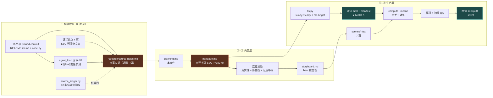

# 策划案：《拆开 Claude Code：让 AI 动手的四层机制》

> 事实源：[../research/source-notes.md](../research/source-notes.md)（信源清单 [../research/sources.toml](../research/sources.toml)）
> 逐字稿 SSOT：[narration.md](./narration.md) · 分镜：[storyboard.md](./storyboard.md)
> 可执行参数：[../pipeline.toml](../pipeline.toml)

## 一、定位

| 项 | 定义 |
|---|---|
| 系列 | **Claude Code 通俗全解**（新系列，与自进化系列完全无关，不互相引用） |
| 集次 | 首集（序号只存在于 [../../series.json](../../../series.json) 与视觉层） |
| 平台 / 形态 | B 站 / YouTube 横屏 1080p30，代码动画图解 + 本人音色克隆旁白，无真人出镜、无 BGM |
| 时长 | 13:00–14:36（用户上限 15 分钟，`target_minutes = [13.0, 14.6]`） |
| 受众 | **不预设编程背景的普通人**：知道「AI 能写代码」，但不知道「AI 怎么真的动手」。次级受众是用过 Claude Code 但没读过源码的开发者 |
| 核心内容 | 《Learn Claude Code》「工具与执行」四章：s01 Agent Loop / s02 Tool Use / s03 Permission / s04 Hooks |
| 不覆盖 | s05 之后的全部章节（规划、记忆、并发、多 Agent）；只在 P6 用一句「后面还有更多层」带过，不承诺、不列清单 |

**选题的独特价值**：市面上讲 Claude Code 的内容几乎都在讲「怎么用」。本集讲**它内部凭什么敢动手**——
而且这个答案小到可以完整讲完：一个二十来行的循环，加三层外挂。这是极少见的「能在 14 分钟里讲透一个真实工程内核」的题目。

## 二、叙事策略

**主线问题（贯穿全片，P0 抛出、P5 回答）**
> 模型能写出一条命令。那么，从「写出来」到「真的在你电脑上跑起来」，中间缺的那一层到底是什么？

**贯穿比喻体系：一条流水线 + 三层可拆卸装置**
- 循环 = **一条不停转的传送带**（模型举手要工具 → 带子继续转；不举手 → 停机）。
- 三层外挂依次挂上同一条传送带：**转接号码簿**（分发表）→ **三道门禁**（权限）→ **一排插线口**（钩子）。
- 铁律：**传送带从头到尾没换过**。这既是课程的主题句，也是我们实测验证过的事实（source-notes §五）。

**记忆点节奏（每 60–90 秒一个，共 11 个）**

| # | ≈时刻 | 记忆点 | 类型 |
|---|---|---|---|
| 1 | 0:30 | 你一直在给 AI 当复制粘贴的中间人 | 痛点共鸣 |
| 2 | 1:40 | 二十来行的循环，就是整个内核 | 反直觉的「小」 |
| 3 | 2:50 | 别信那个「我说完了」的标记，去看它手里有没有活 | 反直觉 |
| 4 | 4:00 | 十个抽屉，每个抽屉是后面的一章 | 全景预告 |
| 5 | 5:10 | 加一个工具，只改执行那一行 | 机制之美 |
| 6 | 6:20 | **能不能同时跑，跟是不是只读，是两件事** | 本集最反直觉 |
| 7 | 7:20 | 读文件的结果永远不许落盘，否则它会自己套自己 | 荒诞感 |
| 8 | 8:40 | 拒绝表是「示意闸门在哪」，不是「安全边界」——作者自己说的 | 诚实感 |
| 9 | 10:00 | 允许你的规则来自八个地方，公司策略压过你自己 | 现实感 |
| 10 | 11:40 | 钩子说「放行」，也绕不过配置里的「禁止」 | 安全收口 |
| 11 | 12:40 | 程序长了八成，循环还是那二十来行 | 主题回收 |

**术语降落规则**（严格执行）
- 英文标识符**只进画面角标，不进口播**：`stop_reason` → 「那个『我说完了』的标记」；`tool_use` → 「工具调用」；
  `TOOL_HANDLERS` → 「转接簿 / 分发表」；`PreToolUse` → 「工具执行前」；`isConcurrencySafe` → 「能不能同时跑」。
- 唯一例外是产品名 **Claude Code**（不可回避，已列为 TTS 试听硬关卡）。
- 每个新概念首现必配比喻，且比喻在画面里同时成立（听觉与视觉说同一件事）。

**证据分级的口播义务**（本集特有，最容易出错）
三级证据（课程作者对闭源产品源码的分析）**必须**带归属句：「课程作者拆过 Claude Code 的源码，他说……」。
画面同步压角标「课程作者的源码分析」。**绝不**把这类断言说成产品的既成事实。

**理性收尾**：不喊「AI 要取代程序员」，也不喊「不过如此」。落点是——
**它敢动手，不是因为它聪明，而是因为有人在它周围搭了几层结构**；而这几层结构，是可以被看懂的。

## 三、视觉语言

**色彩语义契约**（SSOT 在 [../video/src/design/theme.ts](../video/src/design/theme.ts)）

| 色 | 值 | 语义 | 对 `#0E1116` 对比度 |
|---|---|---|---|
| 陶土橙 `core` | `#D97757` | **循环内核**，全片恒定不变 | 6.06:1 |
| 石青 `mech` | `#64C4C0` | **外挂机制**（分发表 / 钩子插槽），可插拔 | 9.18:1 |
| 警示红 `deny` | `#EF6461` | **拒绝与危险**，语义唯一不作装饰 | 6.00:1 |

**反枚举原则**：四个章节**不给四色**。四章不是四个并列概念，而是「一个不变的内核 + 三层可拆卸的外挂」，
色彩映射的是这个深层轴。具体落法：
- 每次画面上出现循环，它都是同一个陶土橙、同一个线宽、同一个位置 —— 让「不变」被看见而不是被听说。
- 并列项（5 个工具、10 个字段、27 个事件、8 个来源）统一用 `panel` 底 + 编号，**被激活时**才染 `mech` 辉光。
- 顺序 / 层级用**位置、线型、亮度**编码，不用色相。
- s03 的三种结果不各占一色：allow 回 `core`（放行 = 回到主干）、ask 用 `mech`（需要一次外部介入）、deny 用 `deny`。

**排版与安全区**：底部角标 `bottom ≥ 150px`（避让字幕条）；代码块用 `mono`，金句卡用 `serif`；
金句卡每幕 ≤ 3 处（过密则贬值）。

**本集独有的视觉母题**（沉淀进 [../../pipeline/skills/06-remotion-implementation.md](../../../pipeline/skills/06-remotion-implementation.md)）
1. **终端打字**：等宽字逐字浮现 + 光标闪烁，用于 P0 痛点与各章「试一下」。
2. **环形循环**：陶土橙闭合轨道 + 沿轨运动的光点，是全片的恒定锚。
3. **字典分发表**：左键右值两列，命中行整行推入 `mech` 辉光。
4. **闸门路由**：一个请求从左侧进入，遇三道竖闸，按判定走 allow / ask / deny 三条出口。
5. **插槽注册板**：循环外围四个空插槽，回调卡片「啪」地插进去。

## 四、幕结构

| 幕 | 目标时长 | 主题 | 叙事要点（回溯 source-notes 章节） | 视觉锚点 |
|---|---|---|---|---|
| **P0** | 0:00–0:55 | 你在当那个中间人 | §一「问题」原文：模型输出命令就停了，人手动跑、手动贴回去 | 终端打字 → 三轮复制粘贴把画面塞满 |
| **P1** | 0:55–3:55 | 一个循环，就是全部 | §一 全节：两个信号 / 五步 / 「三十多行就是内核」；【三】`stop_reason` 不可靠、State 10 字段、多退出路径 | **Agent While-Loop 环** + `messages[]` 逐轮长高；10 抽屉点亮 |
| **P2** | 3:55–6:55 | 加一个工具，只改一行 | §二 全节：`cat/echo/sed` 的笨拙 / 分发表 / 加工具两步；【三】并发安全≠只读、连续块分批、FileRead 无穷上限 | **字典分发表** → 工具卡切 batch → 落盘自循环 |
| **P3** | 6:55–9:55 | 执行之前，先过闸门 | §三 全节：三道闸门 / 拒绝表的自我限定；【三】四种结果含 passthrough、8 个来源与优先级、YoloClassifier | **闸门路由**（三请求三路线）→ 八来源叠板 |
| **P4** | 9:55–12:45 | 挂在循环上，不写进循环里 | §四 全节：退化的循环 / 注册表 / 四事件；【三】27 事件、hook allow 不能绕过 deny/ask、防死循环 | **插槽注册板** → 27 格事件矩阵 → 不变式对撞 |
| **P5** | 12:45–14:00 | 四层叠起来是什么 | §五 实测：141→255 行而循环恒在 20–28 行；四层拼成 harness；「能动性来自模型，脚手架给它落地的地方」 | 四级台阶（循环段同色不变）→ 四层拼合 |
| **P6** | 14:00–14:35 | 收尾与信源 | 理性落点 + 信源卡（含 pinned commit 与访问日期）+ 系列身份卡 | 信源卡 + 渐黑 |

**取舍原则**：深度 > 广度。四章各给约 3 分钟、每章挑 1–2 个最反直觉的生产版细节做重点演绎，
其余「深入源码」条目一句话带过或只进画面清单，**不硬塞**。

## 五、生产管线

## 六、边界与不做的事

1. **不做「怎么用 Claude Code」的教程**——本集只讲内部机制。
2. **不复刻站点美术**：6 张 SVG 与 4 段交互可视化只取信息结构，配色构图动效全部本集自有；站点图片一律不下载不嵌入。
3. **不引用活数据**：LOC 绝对值、课程总章数、star 数一律不进口播（source-notes §九 禁用清单）。
4. **不把三级证据说成事实**：所有 CC 源码细节带归属句。
5. **不留 BGM**：只有旁白与静默（沿用系列既有形态）。
6. **不出现**其他系列片名、集数序号、顺序词。
7. **不承诺后续集数**：P6 只说「这套东西后面还有更多层」，不列章节、不给时间表。
