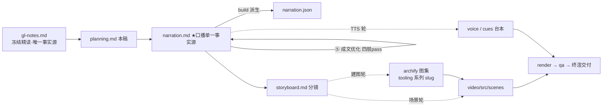

# 策划案：《工具与执行》（v3 · 剧本换代待审 · C 型信源 = gl-notes）

> 状态：v3 换代稿（2026-10-07）。旧剧本退场，本稿以 `research/gl-notes.md`（冻结自 docs/research/agent-harness/171 精读）为唯一事实源；标题候选与钩子选定均待人工复核。本轮到分镜为止，不涉 TTS / 渲染 / 场景代码 / archify 建图。

## 0. 候选新标题（待审核 · series.json 本轮不改，维持《工具与执行：一个循环，三层装置》）

| 候选 | 一句话理由 |
|---|---|
| A《工具与执行：把结果喂回去》 | 直取一句话定位（回喂循环是全部秘密），动作感强，与 p0-01 钩子同构 |
| B《工具与执行：循环不动的秘密》 | 落在规律 1「核心循环不变，能力正交叠加」，是全片论证的终点 |
| C《工具与执行：给模型接上一双手》 | 继承 gl-notes 附录 A 类比 #1/#2（手系连续叙事），画面感强，隐喻覆盖 P2 并延展 P3 |
| D《工具与执行：三十行与一整套装置》 | 数字反差型，同时交代「简洁内核 + 保护外圈」的形态论 |

## 一、定位表

| 项 | 值 |
|---|---|
| 平台 | B 站 / YouTube 中长视频 |
| 时长目标 | 13.0–14.6 分钟（pipeline.toml 硬约束窗；字数口径 254 字/分 → 3302–3708 字，目标 3400–3600 字） |
| 形态 | AI 配音（story 档待 TTS 轮重配）+ Remotion 代码动画，无真人 |
| 受众 | 不预设工程背景的普通人：用过聊天式 AI、见过它「给出命令就停」的任何观众 |
| 核心内容范围 | gl-notes §1–§9：主循环（§3）、工具分发（§4）、权限闸门（§5）、钩子注册表（§6）四机制精讲 + 五条底层规律收束（§9.1）；§3.4 判据之争作为「教学对生产」的活标本保留；三个核心争议只取「规则还是分类器」一口（§9.2 争议 1），其余两争议压进 P6 边界带过 |
| 系列位置 | 五集之首（工具与执行 → 规划与协调 → 记忆管理 → 并发 → 多 Agent），机制层层递进；本集建立「循环骨架」这一全系列地基 |

**Logline**：会写命令的模型没有手；一个三十行的回喂循环给它接上一双手，查表、闸门与挂点让这套装置敢用、能长（gl-notes §3.1 + §9.1）。

## 二、叙事策略

**主线一问一答闭环**：开场抛双问题——「模型怎么自己动手」（自动化的来回）与「真动手了你敢让它跑吗」（安全的来回）→ P1 全景给出四个特性的答卷框架 → P2–P5 四个机制逐个回答「怎么修、凭什么说修好了」（每个机制配原型实测）→ P6 收束回「核心循环不变，能力正交叠加」的工程规律，并以「下期」点出规划问题的引子。

**开篇钩子候选矩阵（★ 待人工复核）**：

| # | 型 | 钩子文本（p0-01） | 吸引力留存逻辑 | 核心主干关联锚点 | 抛出的核心引子 |
|---|---|---|---|---|---|
| H1 | 一句话本质型 ★ | 「这是让模型真正动手的全部秘密：把每一次执行的结果，喂回给它自己。」 | 把庞大系统折叠成一句谦卑的话，制造「就这么简单？」的认知落差 | gl-notes一句话定位；P2 首拍即拆解这句话 | 一句话够吗？闸门、配对、挂点都是这句长出来的什么？ |
| H2 | 危机反转型 | 「这是 Claude Code 敢放手让 AI 删文件的原因：它从来不信任模型的自觉。」 | 危险动作 + 归因反转（不信任），3 秒锁注意力 | 规律 2（安全靠机制不靠自觉）+ §5 权限 | 「不信任」怎么做成机制？ |
| H3 | 痛点型 | 「这是一个会写命令、却永远在等你按回车的模型。」 | 观众自身经验的即时认领（谁没当过粘贴机） | gl-notes 白话开场痛点；P0 问题现场 | 谁来替你按回车？按下去之后谁负责？ |
| H4 | 反直觉数字型 | 「这是三十行代码和一千七百多行代码的关系：差的不是本事，是保险丝。」 | 极小对极大的数字反差 + 「保险丝」悬念词 | §3.4（30 vs 1729）+ 规律 5 | 保险丝指什么？为什么核心不用长大？ |
| H5 | 图纸型 | 「这是给模型一双手的全部图纸：一个循环、一张表、三道闸门、一排挂点。」 | 「全部图纸」承诺 + 四件套预告全片结构 | §1 四个特性 ↔ 四机制一一对应 | 四件套各是怎么造的？ |

★ 选定 H1（自动选定，待人工复核）。理由：与一句话定位同构、被 P2 首拍立即兑现（不欠债）、且「秘密如此简单」与 P6「复杂全在外圈」形成首尾反差；H2 留存力强但把悬念押在 P4，对前半程是负债；H3 作 p0-02 起的问题现场句并入（两全）。

**视觉母题与局部类比纪律**：全片连续感由视觉母题统摄（恒定循环环体 + 色彩语义 + 全景坐标），严禁把局部类比升格为贯穿剧场。口播类比只准入 gl-notes 附录 A 登记条目：本集拟用 #1 接上一双手与 #2 长出更多的手（P2/P6/P3 连续叙事）、#4 火警接警（P2 判据）、#5 快递单号（P3 配对）、#6 骨架与保险丝（P2）、#9 分级判案机器（P4 auto 一句）、#3 牛马（P0）、#8 拒绝票比允许票重（P4 规律 3）；#10/#11（插座、喊号）按口径卡禁旧版隐喻系红线不进口播，机制改工程直陈；每处 1–3 句点亮即切回，失配边界句随行。

**记忆点节奏**（约每 60–90 秒一个，全部取自 gl-notes 实证数字表 §7 与 §8，数字必带基线标尺）：
P2「教学版整个循环约 30 行」（§3.4 口径：函数体 27 行含注释）→「三次调用、两次执行」（§3.3）→「判据换回收尾字段，10 轮只跑完 8 轮、落地 7 件变 5 件」（§8 实验 1）→ P3「1 个工具长到 5 个，只改两处」（§4.2）→「拔掉配对，两个结果当场错绑」（§8 实验 2）→ P4「硬拒绝表只有 7 条」（§5.2）→「用户点头压不过硬拒绝——拆掉这条，sudo 落地了」（§8 实验 3）→ P5「教学版 4 个事件，官方文档已经列到 33 个」（§6.4）→「钩子说 allow，也压不过 deny」（§6.4 不变式）→ P6 五机制回看 + 规律金句。

**理性收尾原则**：不贩卖焦虑。P6 落在 gl-notes §11 的护栏上——防御力没有攻防实测、分类器准确率没有数字、生产计数随时点漂移——把悬念留在开放问题（争议 1 的「语义判断可审计性缺口」），再以「下期」引出规划问题（不预告机制细节）。

## 三、视觉语言

**色彩语义契约**（沿用系列契约：深色底 `#0E1116`；警示红 `#FF5C5C` = 失败/反例/崩溃路径；确认绿 `#7ED321` = 修复/拦截成功；金句卡衬线体；公式/方法名只进角标）：

| 概念 | 专属色 | 语义 |
|---|---|---|
| 主循环骨架（唯一不变） | 陶土橙 `#D97757`（本集主题色） | 恒定视觉锚：同一环体全片反复出场，只换环上高亮段（〔M-001〕） |
| 工具与分发 | 青 `#64C4C0` | 能力生长面：工具卡、查表行、配对单号 |
| 裁决/闸门（拦截态） | 珊瑚红 `#EF6461` | 权限幕的闸门结构件与拦截高亮（与警示红同族但不同帧并用；同帧消融对比时以描边/填充区分） |
| 钩子/挂点 | 中性银灰 `#9AA4B2` + 陶土橙挂点描边 | 扩展层不夺主体色——挂点永远画在骨架上，示意「不改核心」 |

构图纪律：全景坐标图（archify 母图）在换幕时高亮当前环节；对比实验一律左红右绿同屏（消融定式）；数字一律动态增长条 + 工况角标，禁搬多列大表。视觉母题禁旧版隐喻系意象（车间/传送带/工序卡/叫号器/插线口/师傅及同族），一律工程直陈：装置、结构、机件、管线、闸门、队列、账本、挂点。

## 四、分幕结构表

| 幕 | 目标时间 | 字数预算 | 主题 | 叙事要点（回溯 gl-notes） | 视觉锚点 |
|---|---|---|---|---|---|
| P0 会写不会做 | 0:00–1:35 | ≈400 | 钩子 + 问题现场 | H1 钩子落 p0-01；模型能写出正确命令但输出完就停，用户手动执行、粘贴输出、再跑，每一来回都在当它的牛马（白话开场、附录 A#3，失配边界：人肉有安全直觉，程序只会机械回喂）；自动化的另一半问题：真能删文件改系统的程序凭什么敢让它跑（§1）；给出本集路线：回喂给一双手、查表让手更多、闸门让它敢用、挂点给扩展空间（§1 四个特性预告） | 冷启动直入：终端窗口 + 一条无人按下的命令行；双问题分屏 |
| P1 全景坐标 | 1:35–3:10 | ≈430 | 四个特性与一条主线 | 四个特性：持续/可扩展/可拦截/可插入，缺一整个方案不成立（§1 表）；四章一条主线：每一章对上一章的循环只动一个点（§1）；Harness 指模型外圈这层运行装置：模型决策、装置执行与守门（§1） | archify 母图（四机制全景坐标）首次亮出，环体居中；四色分区 |
| P2 三十行的循环 | 3:10–5:45 | ≈650 | Agent Loop | 会写命令≠会做事，自动化来回就是给模型接上一双手（§3.1、附录 A#1 + 失配边界）；五步循环：问题进消息、带工具定义调模型、回答里查工具调用、执行、结果以新消息塞回再调，直到没有工具调用（§3.2）；「回喂」首现白话定义；走查 beat：清单加牛奶三调用两执行（§3.3，具体输入穿全程）；判据之争：认内容块不认收尾字段，火警类比（§3.4、附录 A#4）；消融 beat：实验 1 换回收尾字段 10 轮丢 2 轮、落地 7→5（§8）；生产版 1729 行保险丝（§3.4，【三】归属句） | 环体主视觉（陶土橙）；消息条堆叠动画；判据对比帧（字段 vs 内容块）；30 vs 1729 基线标尺 |
| P3 查表分发 | 5:45–8:05 | ≈600 | Tool Use | 只有 bash 时模型要自己拼命令，意图与 shell 语法间做翻译，浪费且易错（§4.1）；专用工具有名字有参数结构，程序侧第一次拿到结构化信息（§4.1）；加一个工具只加两处：定义表一条 + 处理表一行，循环零改动（§4.2）；走查 beat：1→5 工具与一行查表（§4.2）；配对：一次多个调用各自带编号，乱序返回凭编号对回，快递类比（§4.3、附录 A#5）；消融 beat：实验 2 拔配对，两个结果当场错绑（§8）；生产对照一笔：每个调用过五步验证、读写分区保序（§4.4，【三】归属） | 工具卡阵列（青色）；查表演动画（定义表+处理表双列）；单号标签流转；红绿错绑对比帧 |
| P4 三道闸门 | 8:05–10:25 | ≈600 | Permission | Agent 能删文件跑任意命令，bash 没有保护（§5.1）；立场句：安全不能靠信任模型要靠代码，官方文档同口径「权限规则由 Claude Code 执行，不由模型执行」（§5.1，【二】）；三道闸门：硬拒绝 7 条一概不商量 → 规则匹配 → 用户审批，三道不命中直接执行，默认放行、例外才问（§5.2）；走查 beat：rm old-notes.txt 过三关，sudo 直接拦（§5.3）；消融 beat：实验 3 用户放行压过硬拒绝，sudo 落地（§8）；规律 3：拒绝票比允许票重（§9.1）；生产对照：八个规则来源、auto 模式分级判案机器（§5.4，【三】归属 + 附录 A#9） | 三道闸门串联（珊瑚红结构件）；命令通行/拦截路径动画；放行 vs 拦截红绿对比 |
| P5 钩子注册表 | 10:25–12:30 | ≈560 | Hooks | 检查直接写在循环里，每加一个检查循环烂一分，病灶是依赖方向（§6.1）；解法：注册表 = 事件名对到检查清单，循环只触发不执行（§6.2，工程直陈）；四个事件覆盖一个完整周期：输入提交后/执行前/执行后/停机前（§6.2）；三闸门降格为挂执行前的普通回调（§6.2）；走查 beat：Stop 钩子拦「做完了」——第一次停机被拦、注入一条新消息多跑一轮核对、第二次放行（§6.3 原型日志）；消融 beat：实验 5 忽略续跑指令，核对轮没发生（§8）；生产对照：事件 4→27→33 单调增长（§6.4，27【三】/33【二】）；不变式：钩子说 allow 也压不过 deny/ask（§6.4 官方原文） | 循环环体 + 外圈挂点（银灰）；事件触发脉冲；Stop 拦停动画；4→33 增长条 |
| P6 规律与边界 | 12:30–13:50 | ≈320 | 收束 | 五机制回看：循环一行没动，四层能力正交叠加（§9.1 规律 1）；金句：安全靠机制，不靠模型自觉（§9.1 规律 2）；收束句回扣四件套：回喂给它一双手、查表让手更多、闸门让它敢用、挂点给它空间（§9.1 规律 5、p6-02）；边界护栏：防御力没做攻防实测、分类器没有准确率数字、生产计数随时点漂移（§11.2/3/1）；开放争议：规则还是分类器，可审计性缺口消不掉（§9.2 争议 1 一句）；「下期」引子：会动手之后，谁替它安排接下来做什么（只点问题不预告机制） | 全景图回归四层点亮；金句卡（衬线体）；边界护栏卡；下期卡（视觉层） |

## 五、生产管线图

```mermaid
flowchart LR
    A[gl-notes.md<br/>冻结精读·唯一事实源] --> B[planning.md 本稿]
    B --> C[narration.md ★口播单一事实源]
    C -->|build 派生| C2[narration.json]
    C -->|④ 真实性+易懂性| C
    C -->|⑤ 成文优化 四层pass| C
    C --> D[storyboard.md 分镜]
    D -.->|场景轮| E[video/src/scenes]
    D -.->|建图轮| F[archify 图集<br/>tooling 系列 slug]
    C -.->|TTS 轮| G[voice / cues 台本]
    E --> H[render → qa → 终渲交付]
    F --> E
    G --> H
```

本轮产物止于 D（虚线节点为后续轮次，本轮不动）。

## 六、边界与不做的事

**系列递进边界（照抄口径卡，ep① 不进入）**：规划与协调（待办/子 agent/技能/系统提示/错误恢复）、记忆管理、并发调度、多 Agent 协作与权限冒泡、沙箱隔离与网络权限、server tools——收尾只以「下期」点出问题引子，不预告机制细节。P3 生产对照里 TaskCreate（任务创建工具）只作为「写但可并发」的一笔带过例证，不展开任务系统（那是多 Agent 层的事）。

**开场装置衔接（场景层已有，剧本只做衔接）**：系列统一片头装置 leadInSec=23.5（705 帧 @30fps），口播 12 帧起播；片头三句口播固定在 narration SSOT 之外，剧本任何位置不复述、不改写；P0 冷启动直入本集钩子（不重复系列介绍、不自我介绍）；字数预算 3400–3600 不含开场。

**口播红线**：禁旧版隐喻系词汇及同族意象（车间/作坊/传送带/工序卡/副台/台面/收台/叫号器/排工板/插线口/师傅——附录 A#10 插座、#11 喊号因此不进口播（※ 条目释义句式亦不进口播））；禁顺序词（上一集/上集/上期/下一集/下集/第 N 集/前一集/本系列），收尾预告只许「下期」；观众可见层零信源站标识（不出现课程/站点名/章号，归属句用「拆过 Claude Code 源码的作者」句式）；【三】级断言前 3 句内必带归属句；活数据（star/章节数）不进口播；Harness 不翻译（口播英文例外清单 = Claude Code + Harness）；「上下文」首现带白话句；英文方法名（tool_use_id / tool_result / stop_reason / needsFollowUp / stopHookActive 等）进角标不口播。

**素材取舍登记（2026-10-09 评审裁决）**：§8 实验 4（注销权限回调，outside_writes 0→1、asked 2→0）不进正片——避免与实验 3 同幕双消融过载，弃用而非遗漏（数字为【一】级留档备用）；尾幕边界护栏卡只落「材料没证明」半边，成立工况（单 Agent 命令行形态、用户在场可审批）不进口播，以系列递进边界替代承接（01 C型§七.5 取舍登记）；数字表「14 字段 HookResult」「教学截断 50000/max_tokens 8000」不进口播——前者【三】级源码计数与 4→27→33 记忆点同类相冲，后者无叙事支点；P2→P3 / P3→P4 换幕首镜以组件连续性（青色工具卡 / 珊瑚红闸门自 M-001 色系派生）替代角落母图锚点，构图纪律按此口径。

**本轮不做的事**：不跑 TTS、不动场景代码与 series.json / pipeline.toml、不建 archify 图（storyboard 只写图意与预定 slug，不挂覆盖门 cue）；三个核心争议只取争议 1 一口，争议 2（判据选址）压进 P2 一句带过、争议 3（自动化多远）压进 P4 auto 一句带过，均不展开——深度优先，砍掉的收尾一句话带过；两轨差异（§2 证据链层）不进正片主线，只以 P2 判据之争一处落地；BGM 留空轨；论文外观点不进口播。
