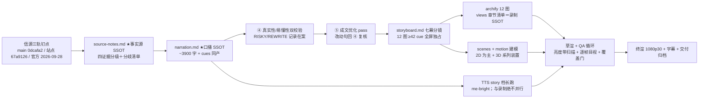

# Stage ② 策划案 ——《执行层：一个循环，三层装置》（推荐题，待 series.json 同步）

> 事实源（一切口播断言的回溯终点）：[research/source-notes.md](../research/source-notes.md)（B 型·单一事实源，钉 main@0dcafa2 / 站点轨 67a9126 / 官方文档 code.claude.com@2026-09-28）。
> 叙事蓝本：[171 精读章](../../../../../docs/research/agent-harness/171-claude-code-tooling-execution.md)（M1–M5 机制叙事与轨 C 对照）。类比 SSOT：[170 §2 角色台账](../../../../../docs/research/agent-harness/170-claude-code-harness-overview.md)（通宵工坊剧场·全篇单射；制作期输入 `.temp/learn-cc-lab/analogy-plan.md` 不作持久引用）。
> 六节节名按 vibe-video skill 的 references/02-planning.md 规格（280 字/分含停顿等效口径）；第 0 节为本次重制的重新拟题决策附加节。视觉契约落点：[theme.ts](../video/src/design/theme.ts)；收尾装置数据源：[series-layers.json](../video/src/series-layers.json)；可执行参数：[pipeline.toml](../pipeline.toml)。

## 0. 标题定案

旧题「执行层：一个循环，就是全部」退役（git 可溯）。三个候选（主标题:副标题 形态，副题承担全部信息量——卡眉已固定「X层」前缀）：

| # | 候选 | 字数 | 论据 |
| --- | --- | --- | --- |
| 1（推荐） | 执行层：一个循环，三层装置 | 11 | 记忆点：数字化对仗「一/三」一句装下全片骨架；与 171 章标题《一个循环，和挂在它外面的东西》同源压缩，Stage ③ 沿用其叙事骨架零转译。维度对齐：伞形覆盖 M1 循环＋三层挂载（号码簿 M2／门禁 M4／插线口 M5）不偏科，「三层可拆卸装置」是事实表述非修辞。排比潜力：后四集可沿用「层名：一 A，N B」或放宽为机制判断句，弹性最大。 |
| 2 | 执行层：加什么都别动循环 | 11 | 记忆点：工程戒律句式，行动指令强、从业者易复述。维度对齐：R1 核心-外围分离的正向表述，但重心偏 M2/M5，门禁层（M4）欠一句对应。排比潜力：可成戒律套，但五集全戒律训诫感过重。 |
| 3 | 执行层：它凭什么敢动手 | 10 | 记忆点：悬念问句 CTR 最强，但标题不含答案，长尾检索与二刷辨识弱。维度对齐：正对主线钩子；回答（三层装置）不在标题里，与 cardSub「执行层 · 循环」检索锚弱耦合。排比潜力：问句套可成，与现题「时机层：谁来按下开始」同形。 |

**Mentor 裁定（2026-09-29）**：采纳候选 1 的副题，但主标题前缀改用系列新维度名——「**工具与执行：一个循环，三层装置**」（12 字）。理由：重制决策「重新拟题」明确要求与新五维口径（工具与执行/规划与协调/记忆管理/并发/多 Agent 平台）对齐；「执行层」是旧层名，保留会让标题系统退回旧口径。cardSub 相应改「工具与执行 · 循环」。**采纳后的同步落点**（Stage ③ 前置，本文件只落决策）：`series.json` 本集 `title`、`video/src/series-layers.json` layers[0].title、P6 身份卡受检硬编码（规则 8 按「：」后主段对账）三处一致；`cardSub`「工具与执行 · 循环」（随裁定更新）。

**后四集句式建议（一句，不展开）**：统一「维度名：≤10 字机制判断句」（前缀＝工具与执行/规划与协调/记忆管理/并发/多 Agent 平台）（动词驱动、判断句优先、数字对仗加分；现题中「时机层：谁来按下开始」已合此形，其余三集重制时沿用现题或按此微调即可成套）。

## 1. 定位表

| 项 | 值 |
| --- | --- |
| 平台 | B 站 / YouTube 中长视频 |
| 时长目标 | 硬窗 [13.0, 14.6] 分（280 字/分等效口径 ≈ 3640–4090 字；规划按 **3,900 字 ≈ 13.9 分** 定位。风险预案：story 档历史实测 ~318 字/分偏快，若 manifest 实测跌破下限，按「补内容不注水」扩写——优先序=P2/P3/P4 各补一段官方对照，素材已在 notes） |
| 形态 | AI 配音（story 段落演绎档＋克隆音色 me-bright）＋ Remotion 代码动画（2D 为主＋3D 系列装置）＋ archify 12 图（10 新绘＋2 复用）全屏独占逐章回放；无真人 |
| 受众 | 不预设背景的工程师观众：天天用 Claude Code（或任一 coding agent）、知道它能跑命令改文件，但没想过「凭什么敢让它跑」的人 |
| 核心范围 | 四章主线机制全入片：循环与续轮判据（M1）／工具分发表与托盘（M2）／权限三道门与拆墙（M4）／钩子插线口（M5）＋校验链顺序（M3，收束在 P5）＋轨 C 官方对照八条硬校准＋判据之争（本集辨识度最高的记忆点） |
| 明确砍掉 | 六模式层／跨来源合并／五层优先级／信任门（P3 一句带过）；批调度实参级判定（只【三】带归属一层）；校验链段数口径（只讲顺序不数段）；产品内部结构【三】断层条目（读文件溢写上限／界面标签／passthrough——回站点轨重取证前不进口播）；s05 及以后一切机制（后续四层各归各集，口播零预告）；readline 兼容／网关 BASE_URL 自适配等工程杂项 |

## 2. 叙事策略

**剧场（单一世界观，全片唯一）**：通宵不打烊的工坊——模型是手很快但从不记事的师傅，harness 是工坊本身。角色严格沿 170 §2 台账单射（传送带／验活动作／转接号码簿／一托盘／门口三道门禁／危险品名册按词辨认／传送带边插线口）；三条防撞规则原文有效（「桌子」禁用、四个帮手不混用、三类卡片不同名）；类比每处 1–3 句即止、只承担结构同构不承担性能等同。

**主线问题（钩子→悬念→回答）**：
- 钩子（P0）：「它凭什么敢在你机器上动手？」——没有循环时人自己就是那个循环；有了循环它什么都敢执行、每加一条约束循环就烂一分。
- 悬念（P1–P5）：裸循环欠下三笔债，三层可拆卸装置各还一笔——能力债（每加工具动核心→号码簿）、安全债（什么都敢执行→门禁）、扩展债（横切行为写进循环体→插线口）；三笔债三种挂法，循环一行不改。
- 回答（P6）：机制很多，循环一个；敢动手靠的不是更聪明，是挂在循环外面的装置——而最上游的分工是：**决定权与放行权，是两个人的活**（费曼遗产句，P6 收尾记忆点）。

**记忆点节奏（约 60–90 秒一个，全部可溯源 notes／tooling-brief §6）**：全片 15 个，逐幕落位见分幕表；锚句白名单——「一个工具，一个循环，就是一个 Agent」／「看的是手里，不是嘴上」／「加一个工具，改的是号码簿，不是传送带」／「焊死的铁门，永远排在对讲机前面」／「被拒也要给回执」／「挂在循环上，不写进循环里」／「插线口只能收紧，不能放松」（官方口径句带「官方文档明写」）。

**理性收尾原则**：不贩卖焦虑（安全叙事只讲机制不对称，不渲染失控想象）；不裁决争议——教学版「权限是第一个插件」的结构美学 vs 产品「门禁独立成层」的安全必然，两种答案各对自己的规模负责，悬念留在开放判断上（notes 分歧 D2）。

## 3. 视觉语言

**色彩语义契约**（沿用 [theme.ts](../video/src/design/theme.ts) 既有系列键，跨幕严格用色；本集不新增色相，theme.model 与 mech 同值——师傅刻意走无彩剪影，避免与装置撞义）：

| 概念 | 键 | 值 | 语义（全片唯一） |
| --- | --- | --- | --- |
| 循环内核／传送带 | core | `#D97757` | **全系列恒定**——「循环始终不变」主线的视觉锚〔M-001〕：传送带母题锁死描边色与绝对线宽，全片同形出场只换周边标签 |
| 验活动作／内容块判据特写 | coreDeep | `#B45A3C` | core 深档：判据分屏的内容块清单高亮（内核自身的细节面） |
| 挂载机制（号码簿条目／门禁机体／插线口装置／3D 层板 lit 面） | mech | `#64C4C0` | **本集维度色**：一切「挂在循环外」的可拆卸装置 |
| 机制深态（托盘／面板描边／装置暗态） | mechDeep | `#4A8F8B` | mech 深档 |
| 硬拒绝／危险命令／拦截命中／倒置实验退化 | deny | `#EF6461` | 拒绝与危险唯一语义（与 danger 同源；本集不另用 danger 双红） |
| 审批询问（对讲机／人的时间） | dim | `#9AA7B8` | 灰＝唯一无彩色的环节：人开口才上色的「人色」——「人的时间放最后」的色彩版 |
| 放行确认瞬间 | ok | `#7ED321` | 仅确认瞬间的瞬时绿（底座纪律） |
| 师傅（模型）／用户／数据流 | text 白／dim 灰 | `#F2F5FA`/`#9AA7B8` | **装置才有颜色**：core 橙=循环、mech 青=挂载、deny 红=拒绝、ok 绿=放行瞬态；非装置皆无彩 |

恒定空间契约（防〔X-001〕空间逆旁白）：内核恒居画面左中锚位（core 橙），装置从右侧／上缘挂入（mech 青），「加机制」的动效永远不触碰内核图形；金句卡衬线体（theme.serif）；code.py 实景片段只进画面角标与实景卡（mono 等宽＋引语卡引语态），不进口播。

**3D 视觉语言（@remotion/three 路线，控制面积）**：
- **P0 与 P6 用 3D 层板（HarnessStack）作系列装置**：P0 开场五层栈落板→执行层点亮呼吸→缩退为顶边常驻条（HarnessBadge，P1–P6）；P6 p6 档放大收尾。
- **正文幕（P1–P5）以 2D＋archify 全屏独占为主**，3D 母题点缀限两处——P1 传送带转轮（solids-3d 母题一现）、P4 插线口脉冲（LottieEmphasis·plug-pulse）。
- 理由：3D 场景成本高，且 ISSUE-177（chip 塌缩重叠）／180（同色面 3D 只剩棱线）／182（层序只对 z 一维）三个缺陷模式全部集中在 3D 段——**控制 3D 面积＝控制回归面**；正文信息密度由 archify 承担（forbid_inset=true，全屏独占三分法）。

**系列横切装置**：顶边常驻条（HarnessBadge chip 档，层短名走 series-layers.json 数据）＋ P6 系列身份卡与下期卡（标题主段走规则 8 受检硬编码，数据对账 series-layers.json ↔ series.json）。

**archify 图集预算（12 图＝10 新绘＋2 复用，5 型，命名循 `claude-code--<slug>.html`；复用图与 html_pattern 不匹配，Stage ⑥ 分镜须显式登记）**：新绘 loop-anatomy（lifecycle）／loop-verdict（workflow）／dispatch-map（dataflow）／registry-contract（dataflow）／tool-batch-layers（workflow）／three-gates（state）／fence-to-intercom（architecture）／hook-channels（dataflow）／stop-veto（lifecycle）／checkchain-order（workflow）；复用 execution-panorama（全景总装）与 five-layer-dependency（P6 系列收尾一闪）。cue 预算 ≥42（密度门 3.0/分 × ~13.9 分），锚定率门 0.30。

## 4. 分幕结构表（七幕；字数为 280 口径目标预算，Stage ③ 以 check_script 实测计数对账）

| 幕 | 目标时间／字数 | 主题 | 叙事要点（回溯 source-notes） | 视觉锚点 | 记忆点候选 |
| --- | --- | --- | --- | --- | --- |
| P0 | ~1.1 分／~300 字 | 钩子·人肉循环 | ①主线问题起手：一个能读文件、跑命令的模型，凭什么敢放它在你机器上动手；②没有循环的世界：模型吐完命令就停，你跑、你把结果粘回去——「每一个来回，你都在做中间层」（§一·定位与标语）；③一个 `while True` 把人换下来，但裸循环欠两笔债：什么都敢执行（`rm -rf` 起点失败模式，§三·定位与标语）＋每加一条约束就往循环体写一行、很快认不出来（§四·定位与标语）；④悬念立碑：答案不是更聪明的循环，是挂在循环外的三层可拆卸装置——三笔债三种挂法，循环一行不改 | HarnessStackP0 3D 五层栈落板→执行层点亮；主问题字卡（「敢」字 deny 红点睛）；三债三装置预告剪影（mech 青×3） | 「人自己就是那个循环」；「三笔债，三种挂法，循环一行不改」 |
| P1 | ~2.5 分／~700 字 | 传送带·循环与验活 | ①最小 Agent＝一个工具＋一个循环（§一·定位与标语）；②循环三步＋三条落账纪律：assistant 先落账／非空工具结果纪律／tool_use_id 配对（§一·机制）；③判据：看手里（内容块）不看嘴上（停止标记）（§一·机制）；④判据之争——同一个开源项目的两个修订判据正好相反，官方文档不披露实现层、无法裁决（分歧 C·续轮判据＋§一·官方文档对照 4）；⑤【三】归属句：作者拆过闭源源码，他说产品另设独立标志位、理由「声明滞后于事实」（§一·生产版对照）；⑥官方产品层：三阶段「收集上下文→行动→验证结果」、可随时打断、Esc 取消正在运行的调用（§一·官方文档对照 1/5）；⑦第一章自带小护栏一句带过：提示词 Act, don't explain、危险模式黑名单、超时截断（§一·机制） | 传送带母题首秀〔M-001〕（core 橙恒线宽）；验活动作分屏（左内容块清单 coreDeep 高亮／右嘴上标记灰）；判据终态可停驻〔M-003〕；archify: loop-anatomy＋loop-verdict；3D 转轮母题一现 | 「一个工具，一个循环，就是一个 Agent」；「看的是手里，不是嘴上」 |
| P2 | ~2.35 分／~660 字 | 号码簿·能力长在表里 | ①翻译层痛点：模型想「读这个文件」却要拼 `cat`（§二·定位与标语）；②执行那行换成查表分发：加 4 个工具、循环零改动（§二·机制）；③「两步注册」的第三处暗契约：schema 属性名↔处理函数形参名逐字一致，对不上运行时直接炸（§二·机制）；④未知名字兜底错误串、每工具自带 try/except——循环对坏名字免疫（§二·机制）；⑤托盘三层写法：教学版逐个串行【一】→仓库索引却把「并发」列为该章关键概念（承诺了代码没有的东西）【一】→官方确认产品有并行与批层【官】；调度细节只【三】带归属一层（§二·机制＋§二·官方文档对照 3＋分歧 D3）；⑥safe_path 围栏首登场：文件工具钉死工作区内、越界直接报错（§二·机制）——为 P3 拆墙埋雷 | 号码簿翻页（mech 青条目逐条点亮、内核 core 恒静）；签名咬合卡（错配即 deny 红闪）；托盘三账对照；archify: dispatch-map＋registry-contract＋tool-batch-layers | 「加一个工具，改的是号码簿，不是传送带」；「名字对不上，运行时就炸——两步注册还藏着第三步」 |
| P3 | ~2.45 分／~680 字 | 门禁·安全不对称 | ①债到期：bash 不受围栏保护，「清理一下项目」可能就是 `rm -rf`（§三·定位与标语）；②三道闸门（硬拒绝表只对 bash 生效→规则匹配→用户审批、默认拒绝）＋接入循环只加一行（§三·机制）；③危险品名册按词辨认：词位正则只在命令位认 rm/del，model／delimiter／echo del 不误报（§三·机制）；④安全不对称官方逐句对齐：deny→ask→allow 首中即决、具体度不改次序、放行不能在拒绝上开洞（§三·官方文档对照 2/3）；⑤拆墙净效应：装门禁当天 safe_path 整体拆除、越界从报错降为问用户（§三·机制）；⑥被拒也给回执：Permission denied 以 tool_result 回灌、Agent 看得见自己被拒（§三·机制＋官方对照 9）；⑦权限由 harness 执行不由模型执行：提示词改得了尝试、改不了放行（§三·官方文档对照 6）——P6 遗产句伏笔；⑧产品面一句带过：默认免批面／六模式层／bare deny 连菜单都撤（§三·官方文档对照 1/7/10，砍深度） | 三道门空间装置（deny 焊死门→dim 灰对讲机→ok 敞门，次序锁死永不换位）；闸门倒置假想卡（拒绝表命令被放行，deny 红闪）；拆墙双联画（有墙→有门无墙）；回执卡；archify: three-gates＋fence-to-intercom | 「焊死的铁门，永远排在对讲机前面」；「被拒也要给回执」；「装门禁那天，墙被换成了对讲机」 |
| P4 | ~2.35 分／~660 字 | 插线口·扩展不进循环 | ①债：记日志／自动 git add 都要改循环体，「很快循环就认不出来了」（§四·定位与标语）；②HOOKS 注册表四事件＋register/trigger 两函数，循环只认函数不认具体检查（§四·机制）；③返回值 None/非 None 是唯一控制流信道，只有前置与退出握刹车油门（§四·机制）；④权限搬家：check_permission 原封不动搬进前置回调第一项——权限不再是特权逻辑、只是众多插件中的第一个；循环去硬化唯一改动（§四·机制）；⑤退出否决：Stop 返回非空即注入消息续跑（§四·机制）；⑥教学版三瑕疵如实讲并限定不外推：审计漏记（拦截即短路）／执行后返回值被丢弃却仍短路／文档口径落差（§四·机制）；⑦官方双向对照：产品钩子全并行＋deny>defer>ask>allow 合并；PostToolUse 有真实语义且副作用不可撤销；退出有 8 次连续续轮上限（§四·官方文档对照 6/7/9） | 插线口母题＋LottieEmphasis plug-pulse（装置插入脉冲）；权限「降级为第一个插头」仪式动效（从内核摘下、插进带边首口）；退出拽回回环箭头（core 橙回环）；archify: hook-channels＋stop-veto | 「挂在循环上，不写进循环里」；「收工不是循环一个人说了算」 |
| P5 | ~1.7 分／~470 字 | 扫码链·总装 | ①按一次工具调用的真实次序重走全片装置：结构校验→工具自校验→前置钩子→权限判定→真正执行——稳定的是顺序不是段数（接入点变化回溯 §三·机制＋§四·机制；顺序主张官方锚＝PreToolUse 先于权限提示，§二·官方文档对照 2）；②排序因果：越便宜越不可协商排前面，「要不要问人」是唯一花人类时间的一步、放最后；③悬念兑现盘点：能力债／安全债／扩展债各还一笔，循环骨架四章逐字不变（实测总表注·README「循环不变」互证）；④官方安全不变量收束：钩子决定绕不过拒绝/询问、阻断钩子压过放行、沉默不等于批准（§四·官方文档对照 3–5，「官方文档明写」） | archify 全景图全屏独占回放（复用 execution-panorama）；校验链流程（checkchain-order）；三债对账卡（mech×3 逐一打钩） | 「越便宜的检查排越前面，人的时间放在最后」；「插线口只能收紧，不能放松」（带官方口径措辞） |
| P6 | ~1.45 分／~430 字 | 收尾·机制很多循环一个 | ①回答主线问题：敢在你机器上动手，靠的不是更聪明，是循环外一层层挂上去的装置——机制很多，循环一个（实测总表注）；②费曼遗产句：决定权与放行权，是两个人的活——模型决定调什么工具，harness 决定放不放行（§一·定位与标语·全书分工语义＋§三·官方文档对照 6 官方 Note 背书）；③理性收尾·开放问题：教学版把权限做成第一个插件是结构美学的选择，产品把它独立成层是安全的必然——两种答案各对自己的规模负责，不裁决不站队（分歧 D2）；④系列装置收尾（视觉层）：五层栈、执行层常亮、下期卡 | HarnessStack p6 档 3D 放大＋系列身份卡（chip 档）＋下期卡；金句卡衬线体终态〔M-003〕；复用 five-layer-dependency 一闪（五层链收束到「机制很多，循环一个」） | 「机制很多，循环一个」；「决定权与放行权，是两个人的活」 |

合计 ~3,900 字 ≈ 13.9 分 @280（硬窗 [13.0, 14.6] 内；句均 20–24 字 ⇒ 约 165–195 句；15 个记忆点 ≈ 每 56 秒一个）。

## 5. 生产管线图

```mermaid
flowchart LR
    A[信源三轨钉点<br/>main 0dcafa2 / 站点 67a9126 / 官方 2026-09-28] --> B[source-notes.md ★事实源 SSOT<br/>四证据分级＋分歧清单]
    B --> C[narration.md ★口播 SSOT<br/>~3900 字 + cues 同产]
    C --> D[④ 真实性/易懂性双校验<br/>RISKY/REWRITE 记录在案]
    D --> E[⑤ 成文优化 pass<br/>改动句回 ④ 复核]
    E --> F[storyboard.md 七幕分镜<br/>12 图 ≥42 cue 全屏独占]
    F --> G[archify 12 图<br/>views 章节清单＝录制 SSOT]
    F --> H[scenes + motion 建模<br/>2D 为主 + 3D 系列装置]
    C --> I[TTS story 档长跑<br/>me-bright；与录制绝不并行]
    G & H & I --> J[草渲 + QA 循环<br/>亮度带扫描 + 逐帧目视 + 覆盖门]
    J --> K[终渲 1080p30 + 字幕 + 交付归档]
```

## 6. 边界与不做的事

- **BGM 留空轨**；本片 zh 单语（英文版触发条件＝用户明确要求）。
- **去站点化（规则 7）**：口播／分镜／场景组件禁 learn.shareAI／Learn Claude Code／shareAI／「课程」／「站点」／章号 s01–s20——**提「这门课／课程」同样在禁用面**，指称信源一律用「这个开源项目／这个开源教学项目」；【三】断言归属句模板：「这个开源项目的作者拆过源码，他说……」；【官】断言表述为「官方文档说……／官方文档明写……」。
- **活数据不进口播**：随修订漂移的常数（DENY_LIST 条数、截断上限、超时秒数、glob 上限）一律定性表述；README「三十多行」若引用须带「循环内核口径」（notes 本集特有纪律）。
- **英文标识符只进画面角标**（tool_use/tool_result/PreToolUse/stop_hook_active 等，口播用中文机制名）；可进口播的英文词仅 Claude Code 与 Harness（术语规范）。
- **分歧处置默认规则**：课程 vs 官方取官方轨并双方并记；README vs code 以 code.py 为准；判据之争两轨并陈不裁决（notes 分歧清单头部）。
- **撞号纪律**：内部文档涉 s03/s04 写「main 轨＋章全称」，观众层不出现任何章号。
- **反串线（规则 1）**：口播不出现他集标题／集数序号／「上一集／下一集／本系列」类顺序词；「下期」仅下期卡与收尾语一次；「后面还有四层」属机制陈述可用，不作集数指涉。
- **类比纪律**：角色单射沿 170 §2 台账＋制作期类比计划归位（新增仅危险品名册按词辨认一条）；三条防撞规则有效；类比 1–3 句即止，不承担性能等同。
- **画面纪律**：画面文字只放关键词／数字／标签（≤6 字），禁整句复述口播（双字幕教训）；storyboard 全文禁「archify full/inset」字面串（覆盖门全文计数）；全屏独占期间常驻装置让位。
- **许可**：课程仓 MIT（引语可上引语卡）；官方文档只作事实转述不大段复制；archify 图入库循仓内资产规范。
- **信源时效**：官方文档访问 2026-09-28；成片前若上游修订，回 notes 复核带版本口径的断言（如 auto 已是起步模式）与既有数字。
- **不做的事**：不预演后续四层机制（各归各集）；不数校验链段数；不用产品内部结构【三】断层条目（B2——回站点轨重取证前不进口播）；不拿教学版瑕疵批评产品、不拿产品能力夸教学版（轨混禁令）。
