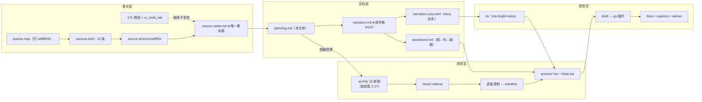

# 策划案 ·《工具与执行：一个循环，三层外设》（完全重制版）

> Stage ② 产物。事实源：[`../research/source-notes.md`](../research/source-notes.md)（B 型台账，钉
> `ce8f9f18`）＋[171 号精读](../../../../../docs/research/agent-harness/171-claude-code-tooling-execution.md)
> （本仓 HEAD `47e662dbb`）。章→集归属与钉选唯一登记处：[系列信源地图](../../../source-map/claude-code-explained.md)。

## 一、定位表

| 项 | 值 |
|---|---|
| 平台 | B 站 / YouTube 中长视频 |
| 时长目标 | 13.0–14.6 分钟（硬约束窗；口播预算 3302–3708 字 @254 字/分，瞄准 ~3550。@254 系策划期系列常数，ISSUE-203 实测校准 250 字/分——见 pipeline.toml；本集 v2 定稿实测 3326 字 ≈ 13.3 分 @250 含停顿口径） |
| 形态 | AI 配音（me-bright 克隆 + story 档）+ Remotion 代码动画 + archify 逐章图解，无真人 |
| 受众 | 不预设工程背景的普通人；第二层观众：用过 Claude Code 类工具、想懂原理的人 |
| 核心范围 | 课程「工具与执行」部全四节：Agent Loop（循环与续停判据）/ Tool Use（工具表与查表分发）/ Permission（三重把关）/ Hooks（生命周期节点）；外加四版演进对账（102→135→180→232 行） |
| 系列位置 | Claude Code Harness Engineering 第 1 集（共 5 集）；下期「规划与协调」（口播只说「下期」，标题走 P6 下期卡） |

## 二、叙事策略

**主线问题（钩子→悬念→回答）**：让模型替你干活，为什么不是「模型变聪明了」？——悬念：
一间一百零二行的「诊室」怎么长到两百三十二行、而接诊循环那一页只换过一行字？——
回答：敢放权靠的不是更聪明的医生，是**不换的循环 + 长在循环外的三层外设**（一张表、
一道关、一圈节点）。

**母题实现方式（对齐 02 规格「视觉母题全片统摄 + 局部类比按难点准入」）**：本集的连续感由
**视觉母题**统摄——〔M-001 恒定视觉锚〕接诊循环装置（圆环 + 五步位 + 病历本槽位）锁死
描边色（core `#D97757`）与绝对线宽（5px）与刻度绝对值，全片每次出场**同形可缩放**（直径随镜
适配 280–340：定妆/特写/常规三档＋1-C 判停缩微环 183 拨杆局部视图——R12 补登，R10 对齐 as-built），只换周边标签；诊室制度名词
（病历本=上下文、开单=tool_use、贴回病历=tool_result、开单表=工具表、把关=权限、规程
节点=钩子）作为**贯穿名词系**保证指代稳定，**不塑造角色剧情、不建剧场**（对齐 02 的
「严禁升格世界观」纪律——诊室只借制度结构与名词，不借人物戏）；每个局部类比 1–3 句
点亮直觉即切回机制画面，零类比直讲合法。

**三条铁的叙事纪律**（来自源材料本身的递进结构）：
1. **行数进度尺**贯穿全片：P0 抛出 102 → P1 循环 102 → P2 加表 135 → P3 加关 180 → P4
   加节点 232 → P5 四格并排对账「循环只换过一行取值方式」。数字口径：站点徽章的教学
   叙事进度尺（【二】），source-notes 并记仓库实测 151/206/267/280（【一】）；口播明确
   说「教学版」体量，不与运行版混淆。
2. **破坏性实验用代码语言陈述**（cc_tools_lab 五实验=本仓【一】级）：实验效果一律说
   「虚拟文件系统里 4 个文件变成 0 个」「1 轮就停、0 个工具执行」——隐喻只借制度结构
   （开单/核对/签字/病历），**全片零伤亡映射、零医疗事故意象**。
3. **【三】级断言（课程作者对 CC 闭源源码的分析）口播前 3 句内必带归属句**（「有人把
   它的实现拆开看过，从那份拆解看……」）；【官】级带「官方文档」口径与日期敏感数字
   （如钩子事件 27→33）。

**记忆点节奏（约每 60–90 秒一个，全部回溯 source-notes）**：
- P0 「把话说完了，活，还得你自己干」（v1 词面「它在聊天框里说完了，活还得你来干」，R11 归锚 v2 定稿）／「医生只认这一本病历，每一轮都从头读」（原案「唯一的记忆」系禁词「记忆」同染——④ 必改 #8，2026-10-02 评审回写）
- P1 「续诊还是结诊，只看一件事：这轮开没开单」／「用会迟到的信号当判据，任务半途而废」（实验 1）
- P2 「新本事进表，不进循环」／「同一个未知名字，怎么取值，决定了是崩溃，还是改道」（实验 2；v1 词面「取值方式决定…」，R13 归锚 v2 定稿）
- P3 「禁忌翻不了案——签再多的字也不行」／「把关的次序，本身就是机制」（实验 3）
- P4 「没意见是沉默，False 也是有意见」（实验 4）／「把关搬家，循环只换过一行取值方式」（防死循环双保险=实验 5；「只换过一行」单写系 #5/#6/#7 家族旧口径，2026-10-02 评审归锚）
- P5 「越便宜越没得商量的检查排越前，签字永远最后」（④ #13/#14 判台账与 171 双零——口播不引；原降级方案「画面标价签表达」未落，R13 纠偏：as-built 仅门位次语汇，成本→顺序由门序承担）／「一百零二到两百三十二，长的几乎全在循环外的东西」（原「全在循环外」系 #7 家族旧口径，2026-10-04 评审归锚——s03 check_permission 插在循环内，成片 p5-13 定稿「几乎全在循环外」）
- P6 「医生开单，科室干活——放行的永远是关卡，不是医生」（R11 归锚：原「科室」系策划期旧词面，定稿 p3-26/p6-05＝「放行的，永远是关卡」）／「先找它的循环，再数它的挂件」

**理性收尾**：不贩卖焦虑；把「教学版是压缩件、真产品的规模远超于此」如实交代，悬念留在
「真产品怎么长回规模」——即下期（规划与协调），口播只说「下期」。

## 三、视觉语言

**色彩语义契约**（底座沿用模板；概念三色承接本集系列位，语义按新叙事重定义）：

| 色 | 值 | 语义（全片恒定） |
|---|---|---|
| core 橙 | `#D97757` | 接诊循环——全片恒定母题（〔M-001〕锁描边色+线宽，只换标签） |
| mech 石青 | `#64C4C0` | 三层外设（开单表/把关/节点）——一切「长在循环外」的东西 |
| deny 红 | `#EF6461` | 禁忌与拦截（硬拒/阻断/词边界）；破坏实验的崩溃侧同用 |
| dim 灰 | `#9AA7B8`（底座） | 签字问人（ask）与「模型侧」——有意见但要人拍板 |
| ok 绿 | `#7ED321`（底座） | 放行瞬态（机制在位时的确认，消融对比的绿侧） |

- 深色底 `#0E1116` 系；金句卡衬线体（Songti SC）；代码/命令一律 mono（SF Mono）。
- 〔X-001〕空间隐喻不逆旁白：画面方向与旁白强弱一致（策划期纵向层叠方向「循环在下、
  外设自上生长」已由 as-built 契约取代——接诊循环恒居画面中央、三层外设自右缘依次挂入，
  见 storyboard 头「恒定空间契约」；「翻不了案」的禁忌表永远画在把关链最前且不可被覆盖）。
- 〔M-003〕持续陈述配持续态：结论句用可停驻终态画面，特效只作入场。
- 站点原图只转**文字规格**重建（图片纪律）；不复刻上游美术。

**去站点化安全替称词汇表**（规则 7；观众可见层全程用左列）：

| 禁用 | 安全替称 |
|---|---|
| 课程/站点/learn.shareai/shareAI | 「这套教学实现」「一百多行的教学版」「从零到一的教学仓」 |
| 章号 s01–s20 / 第 N 章 | 「第一节/第二节…」或直接讲机制名 |
| Learn Claude Code | Claude Code（产品名可用）／「这类 coding agent」 |
| 「深入 CC 源码」附录 | 「有人把它的实现拆开看过」 |

## 四、分幕结构表（七幕 · 字数预算合计 3560）

| 幕 | 目标时间 | 主题 | 叙事要点（回溯 source-notes 节） | 视觉锚点 |
|---|---|---|---|---|
| P0 失忆的医生 | 1.1 分 / 280 字 | 模型不记得你、也不会自己动手；没有循环你就是中间人；102 行最小形态已能转，但「敢用」还差三样 | s01·定位（金句引语）；无状态纯函数（机制【一】）；人肉往返痛点；行数尺第一格（【二】口径声明） | 聊天框两侧徒手往返（dim 灰人形）→病历本合上即忘→诊室定场：循环装置首现〔M-001〕+三层外设剪影（102 格进度尺点亮） |
| P1 接诊循环 | 2.6 分 / 660 字 | 循环五步+两角色协议；续停判据只看「这轮开没开单」；流式下盖章迟到→信迟到的信号任务半途而废（实验 1）；真产品判据与体量【三·归属】 | s01·机制（code.py:NN）；tool_result 借 user 信封的「两种署名」解释；实验 1（lab 行号）；生产判据【三】+「核心循环之外是保护壳」趋势句 | 病历本两栏逐条追加（报告贴进问方栏）；开单/收手判据分屏；实验 1 正反同屏消融〔红/绿〕；「几十倍」趋势卡（不引具体行数） |
| P2 开单表 | 2.3 分 / 590 字 | 能力长在表里：两笔注册（说明单＋登记行）、查表分发是循环与能力的全部接口；查表失败两形态（实验 2）；一轮多单按序打包、教学版零并发；真产品按连续块分批、并发安全按实参判【三·归属】；院内围栏只围检查不围外线（埋 P3 雷） | s02·机制（TOOLS schema/handlers/safe_path，code.py:NN）；实验 2；生产对照【三】（isReadOnly≠isConcurrencySafe 讲「按本次实参判」；**不引并发默认数**） | 开单表翻页逐行点亮（mech 青；循环恒静 core 橙）；KeyError 崩 vs Unknown 自纠双联；院内围栏细框+外线通道在框外（细节埋雷） |
| P3 三重把关 | 2.5 分 / 640 字 | 执行前三关：禁忌表硬拒→需签字→常规直做；三关皆空直接做（教学版默认放行 vs 真产品默认问）；**顺序即机制**（实验 3）；字面筛查过拦+漏拦两面如实交代+词边界补丁；被拒也给回执；真产品四态/8 来源趋势层【三+官】、auto 分类器【三】（原标【官】与台账 3.3 分级相悖，2026-10-02 评审改） | s03·机制（DENY_LIST/TOOL_RULES，code.py:NN）；实验 3；两面性（README 自认「非可靠安全边界」）；生产对照【三】（四态/8 来源/分类器——不用内部代号） | 三关流程装置（deny 禁忌表/dim 签字板/ok 直行道）；调序实验回放（红闪 4→0）；五条命令分路表（画面承载）；官方分类器对照【三】（生产侧归锚表述，不虚构内部机制） |
| P4 规程节点 | 2.4 分 / 610 字 | 横切需求挂节点不进循环：四节点+注册表、循环只喊不认识检查；返回值三值语义（**False 也是有意见**，实验 4）；非对称（执行前拦下/结诊拉回）；把关迁入首节点·循环本体近乎零改动（171 原话「几乎一行没改」）；Stop 防死循环双保险（标志位+官方 8 次上限，实验 5）；真产品 27→33 事件/14 字段/最严合并/钩子的允许翻不了配置的拒绝【三+官】 | s04·机制（HOOKS/trigger_hook/HookResult，code.py:NN）；实验 4/5；生产对照【三+官】（带日期读 33） | 四点位挂载图（循环环体四向伸出）；None 三值卡（False≠None 陷阱高亮）；「把关搬家」动效（从循环内摘下挂到首节点）；防死循环双保险对照（100 条 vs 3 条）；规模数字卡（27→33 带日期） |
| P5 一单走全程 | 1.6 分 / 410 字 | 一次工具调用的完整链路（参数核对→工具自检→节点把关→权限→执行）：越便宜越没得商量的排越前、签字最后（④ #13/#14 判双零——口播不引；原「画面标价签表达」未落，R13 纠偏：as-built 仅门位次语汇）；四版对账：102→135→180→232，接诊循环只换过一行取值方式；方法论点破——**简化保骨架、砍规模**（4 事件/27、1 来源/8、三关/多阶段） | 全链路顺序【一+官】（前置钩子先于权限提示的官方锚）；四版变更表【一】；「保骨架砍规模」规律句 | 全链路一镜走完（一单的旅程，五道工序依次点亮）；四格行数尺并排+循环页恒定高亮（core）；对账卡（表/关/节点逐一打钩 mech） |
| P6 收束 | 1.5 分 / 370 字 | 回答 P0：敢让模型动手，靠的是不换的循环+三层外设；分工遗产句（医生开单、科室干活——**放行的永远是关卡，不是医生**）；观看方法论（看任何 agent：先找它的循环，再数它的挂件）；下期预告（口播只说「下期」） | 收束回 P0 悬念；分工主线【官】背书（放行权在 harness）；系列身份卡+下期卡（规则 8：含本集主段「一个循环，三层外设」+下集主段「模型的视野是安排出来的」） | 诊室定场收束→循环母题恒定收束（core）→系列五层层板（复用 five-layer 图）→下期卡 |

**图集预算（14 图 = 13 新绘 + 1 复用；五型齐）**：

| # | 图 slug（前缀 `claude-code--`） | 型 | 幕 | 内容 | 章切分预设 |
|---|---|---|---|---|---|
| 1 | human-relay | workflow | P0 | 人当中间层的徒手往返 vs 循环接手 | 2 章（人肉往返/循环接手） |
| 2 | intake-loop | architecture | P1 | 接诊循环五步装置全图（母题定妆） | 3 章（五步/病历两栏/开单收手） |
| 3 | stop-reason-race | sequence | P1 | 流式下两判据的时序竞速（实验 1） | 3 章（迟到机理/信标记 1 轮停/看内容块 3 轮 2 工具） |
| 4 | dispatch-table | dataflow | P2 | tool_use→查表→handler→tool_result 数据流 | 3 章（两笔注册/查表分发/结果回喂） |
| 5 | lookup-failure | lifecycle | P2 | 硬索引 KeyError 崩 vs 软查表 Unknown 自纠（实验 2） | 2 章（崩溃/自纠） |
| 6 | gate-three-tier | lifecycle | P3 | 三重把关状态机（deny/ask/allow+皆空默认） | 4 章（禁忌/规则/签字/皆空默认） |
| 7 | gate-order-ablation | workflow | P3 | 调序+一个 y 的破坏实验（4 文件→0，实验 3） | 3 章（正常序/调序/清零回放） |
| 8 | gate-four-result | architecture | P3 | 生产版四态+8 来源分层（趋势层） | 3 章（四态/八来源分层/分类器） |
| 9 | hook-mount | dataflow | P4 | 四生命周期节点挂载全景 | 3 章（四点位/注册表/触发短路） |
| 10 | hookresult-tri | lifecycle | P4 | 返回值三值语义（None/非 None/False≠None，实验 4） | 3 章（三值/False 陷阱/反转实验） |
| 11 | stop-guard | lifecycle | P4 | Stop 防死循环双保险（标志位+8 次上限，实验 5） | 3 章（无防护 100 条/标志位/上限硬停） |
| 12 | preflight-chain | sequence | P5 | 一单走全程：五道工序校验链 | 4 章（参数/项目/节点/权限→执行） |
| 13 | four-version-ledger | lifecycle | P5 | 四版成长对账（102/135/180/232+循环恒定） | 4 章（四版各自增量/循环一行） |
| 复用 | five-layer-dependency（html_overrides） | architecture | P6 | 系列五层身份卡 | 沿用既有 guided-views |

覆盖门设计余量：锚定率目标 ≥0.33（门 0.30）；cue 密度目标 ~4.5/分（门 3.0）；每幕 ≥1
锚句（P0/P6 不豁免）；全屏独占（forbid_inset，storyboard 按三分法设计）。

## 五、生产管线图

```mermaid
flowchart LR
  subgraph 事实层
    A1["source-map（钉 ce8f9f18）"] --> A2["sources.toml · 12 条"]
    A2 --> A3["source-archive/ce8f9f1/"]
    A4["171 精读 + cc_tools_lab"] -.链接不复制.-> A5["source-notes.md ★唯一事实源"]
    A3 --> A5
  end
  subgraph 文档层
    A5 --> B1["planning.md（本文件）"]
    B1 --> B2["narration.md ★逐字稿 SSOT"]
    B2 --> B3["narration.cues.toml（story 台本）"]
    B2 --> B4["storyboard.md（镜↔句↔画面）"]
  end
  subgraph 视觉层
    B1 -- 图集预算 --> C1["archify 13 新图<br/>（锁定版 2.17）"]
    C1 --> C2["views/ sidecar"]
    C2 --> C3["逐章录制 → manifest"]
    B4 --> C4["scenes/*.tsx + Main.tsx"]
    C3 --> C4
  end
  subgraph 配音层
    B3 --> D1["tts（me-bright+story）"]
    D1 --> C4
    C4 --> E1["draft → qa 循环"]
    E1 --> E2["final + captions + deliver"]
  end
```

## 六、边界与不做的事

- **不做的内容**：并发细节与任何并发默认数（第 4 集领地；站点 3/官方 10 冲突不进口播）；
  多 Agent、规划、记忆机制零预告（防串线）；BGM 留空轨。
- **不引的具体数字**：query.ts 行数（两口径冲突→趋势句）；并发默认数（同上）；活数据
  （star/总量）不进口播。
- **旧稿隔离**（v2.1 工坊剧场版全部退役，新稿禁用）：师傅/传送带/号码簿/托盘/三道门禁/
  焊死的铁门/对讲机/插线口/上件前扫码/围墙/工位/灯牌等全部名词；「看手里不看嘴上」
  「机制很多循环一个」「挂在循环上不写进循环里」等金句（后者是课程 README 原句双重
  身份，去站点化下无法归属，新稿换自己的说法「挂到节点上，循环一个字不沾」）。
- **许可与归档**：字节归档随 LICENSE（MIT）已落 `research/source-archive/ce8f9f1/`；
  站点/仓库图片零下载零嵌入。
- **交付口径**：成片交付 `~/Documents/video/claude-code-explained/`，新标题自然落 v1；
  旧《工具与执行：一个循环，三层装置》v1/v2 归档保留（原位替换语义）。
