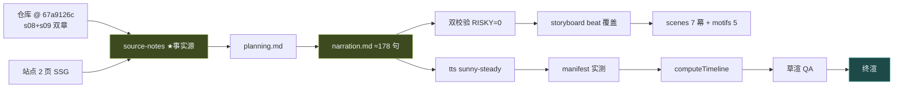

# 策划案：《AI 的记忆：会丢的和不能丢的》

> 事实源：[../research/source-notes.md](../research/source-notes.md)（信源清单 [../research/sources.toml](../research/sources.toml)）
> 逐字稿 SSOT：[narration.md](./narration.md) · 分镜：[storyboard.md](./storyboard.md)
> 可执行参数：[../pipeline.toml](../pipeline.toml)

## 一、定位

| 项 | 定义 |
|---|---|
| 系列 | Claude Code 通俗全解（独立成片，口播不引他集） |
| 平台 / 形态 | B 站 / YouTube 横屏 1080p30，代码动画 + 本人克隆音色，无 BGM、无 emoji |
| 时长 | `target_minutes = [13.0, 14.6]`；创作目标 ≈3900 字 / 165–195 句 |
| 受众 | 普通人：都听过「AI 没记性」，但没想过记性是可以被工程拆成「会丢的桌面」和「不丢的本子」的 |
| 核心内容 | 《Learn Claude Code》记忆管理两章：s08 Context Compact / s09 Memory（全系列单章信息密度最高的两章） |
| 不覆盖 | s10 及以后；s11 的完整恢复逻辑（本集只到「应急通道重试一次」为止） |

**选题独特价值**：所有 AI 产品宣传「记忆」，本集拆开给普通人看：记忆不是一个功能，是两套
互相咬合的机制——一套承认自己会丢（于是分级腾位），一套保证自己不丢（于是写进文件）。
而两套咬合的那个瞬间（先抢救、再碎纸）是全片最精采的工程瞬间。

## 二、叙事策略

**主线问题（P0 抛出、P5 回答）**
> 窗口装不下那一刻，会发生什么？无论怎么腾，总有些东西就是不许丢——这一层到底在哪？

**贯穿比喻体系：桌面与登记簿**（独立成片：开场一句自行重立「一张会塞满的桌子」）
- 对话历史 = 桌面上的纸（越堆越高、可以清理）。
- 四级腾位 = 桌面的收拾法（裁中段 / 旧纸折叠 / 大件入库 / 全桌重写摘要）。
- 摘要者 = 请来的帮工（有纪律：只写字不动手）。
- 登记簿 = 桌旁一本从不进碎纸机的本子（页只增不删；索引贴在桌角）。
- 做梦 = 深夜整理本子的人（有闸：一天一次、上锁）。

**记忆点节奏（11 个，每 60–90 秒）**

| # | ≈时刻 | 记忆点 | 类型 | 回溯 |
|---|---|---|---|---|
| 1 | 0:30 | 一次拒收，前面全白干——读过的每个字都要随身带着 | 痛点 | s08 问题 |
| 2 | 1:40 | 收拾桌面有四级，便宜的先来 | 结构感 | s08 |
| 3 | 2:30 | 剪中段不剪头尾——开头那三句是任务书 | 细节反直觉 | s08 头3尾47 |
| 4 | 3:20 | 大件先入库再折叠，顺序反了就再也找不到原文 | 机制之美 | s08 顺序论证 |
| 5 | 4:10 | 摘要帮工的纪律：只写字别调工具，开头结尾各叮嘱一遍 | 荒诞感 | s08【三】 |
| 6 | 5:10 | 压完还会往回捞：最多五个文件，捞回桌面 | 机制之美 | s08【三】回捞 |
| 7 | 6:00 | 「用 tab 别用空格」被摘成「有代码风格偏好」 | 本集最痛 | s09 问题 |
| 8 | 6:50 | 不丢的那层就是文件夹，没有数据库 | 反直觉 | s09 |
| 9 | 8:20 | 挑记忆的是另一个小模型，最多挑五条，拿不准就不挑 | 机制之美 | s09【三】 |
| 10 | 9:30 | 先抢救、再碎纸：提取发生在压缩之前 | 主题回收 | s09【三】时机 |
| 11 | 11:50 | 整理本子的活叫「做梦」，一天最多一次，还上着锁 | 彩蛋 | s09【三】 |

**证据分级口播义务**：回捞 / 摘要纪律 / Sonnet 挑选 / 停机钩子时机 / 四道闸全部【三】，
归属句前 3 句内必现。四类记忆、四级腾位、快照时机（教学版同构）为【一】可直断。

**理性收尾**：不神化「AI 有记忆」，也不嘲讽「金鱼脑」。落点——
**会丢的放桌面，不许丢的放本子；它记不住的，工程替它记住。**

## 三、视觉语言

**色彩语义契约**（SSOT [../video/src/design/theme.ts](../video/src/design/theme.ts)）

| 色 | 值 | 语义 |
|---|---|---|
| 陶土橙 `core` | `#D97757` | 循环内核（系列锚；本集在压缩瞬间出场） |
| 苔绿 `keep` | `#A9C46C` | **本集己色**：不许丢的那一层（记忆文件 / 索引 / 登记簿） |
| 石青 `mech` | `#64C4C0` | 收拾桌面的机制（四级梯 / 帮工 / 旁路小问） |
| 警示红 `deny` | `#EF6461` | 拒收 / 熔断 |

★ **本集特有纪律：丢失不用颜色画。** 被压缩的内容向 `dim`/`panel` **褪色**——褪色即遗忘。
两章不给两色：同一色块的**两种命运**——要么淡出视野，要么飞进 `keep` 登记簿。

**母题（motifs.tsx，5 个）**
1. **WindowFill**（塞满的窗口）：玻璃容器被色块灌满，撞上「拒收」墙。
2. **FourRungs**（四级腾位梯）：矮到高四级；顺序箭头锁死；换序演示时画面「自毁」一次再复位。
3. **SummonsStrip**（摘要帮工）：小个子把整摞纸重写成一张；头顶指令卡「只写字」；分析草稿写完即被撕。
4. **LedgerVault**（登记簿）：本子只进不出，索引页常驻桌角（`keep`）；碎纸机在旁永远轮不到它。
5. **SideQuery**（旁路一问）：细支路引到缩小环，吐回最多五张卡；拿不准的卡自动缩回。

## 四、幕结构

| 幕 | 目标时长 | 主题 | 叙事要点 | 视觉锚点 |
|---|---|---|---|---|
| P0 | 0:00–0:55 | 一次拒收 | 系列终端撞墙：读大文件×30、跑命令×20，窗口满、接口拒收、前面白干；抛主线问题 | WindowFill 灌满撞墙 |
| P1 | 0:55–2:50 | 一二级收拾 | 裁中段（50 条、头 3 尾 47、不拆请求回执对）；旧结果折叠（留最近 3 条、120 字阈值） | FourRungs 前两级 |
| P2 | 2:50–4:50 | 三四级与顺序论证 | 大件落盘（200KB、预览 2000 字）→ 全文摘要（转录保底 + 五类信息 + 连败 3 次熔断）；★顺序不可换的正确性推导 | 四级梯完整 + 换序自毁演示 |
| P3 | 4:50–6:00 | 应急与帮工纪律 | 应急通道（保最近 5 条、重试 1 次）；摘要帮工纪律（只写字·首尾各一遍·分析段撕掉）；★压完往回捞（≤5 文件） | SummonsStrip + 回捞钩 |
| P4 | 6:00–8:40 | 不丢的本子 | 「tab→风格偏好」之痛转折；文件夹即存储（三字段/四类记忆/索引常驻）；旁路小问挑 ≤5 条、拿不准不挑 | LedgerVault 立起 + SideQuery |
| P5 | 8:40–11:00 | 先抢救、再碎纸 + 做梦 | 轮末提取取压缩前快照（时间铰链）；攒 10 份触发合并；★「做梦」四道闸（24h/节流/5 会话/文件锁·1h 过期）+ 锁即时钟彩蛋 | 压缩瞬间的系列环 + Dream 四闸 |
| P6 | 11:00–13:55 | 落点与信源 | 一句话合同「会丢的放桌面，不许丢的放本子」+ 信源卡 + 身份卡 + 渐黑 | 金句卡 + 信源卡 |

## 五、生产管线

## 六、边界与不做的事

1. 不做「怎么开启 Claude Code 记忆」的教程；只讲机制。
2. 不复刻站点美术（文字规格重建）；无 BGM、无 emoji。
3. 活数据与精确常量纪律（见 notes §七禁用清单）。
4. 【三】必带归属句；s11 完整恢复逻辑不进本集。
5. 口播不出现他集标题与顺序词；桌面比喻在本集内一句重立，不依赖看过前作。
