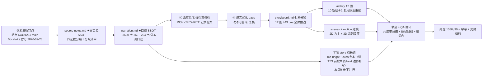

# Stage ② 策划案 ——《记忆管理：会丢的和不能丢的》（series.json 现题直录）

> 事实源（一切口播断言的回溯终点）：[research/source-notes.md](../research/source-notes.md)（B 型·单一事实源，钉站点轨 67a9126 / main 演进 0dcafa2 / 官方文档 code.claude.com@2026-09-28）。**双轨口径最高纪律：口播机制断言一律钉站点轨教学版；main 演进只进 P6 彩蛋段（「这个开源项目后来又改了一版」），不宣称因果；勿沿用旧精读基于 main 轨的判定（分歧 B1/简报 §1-M4 已澄清：站点轨两层加载讲做一致）。**
> 叙事蓝本：[173 精读章](../../../../../docs/research/agent-harness/173-claude-code-memory-management.md)（双轨叙事范本·M1–M5 机制叙事与轨 C 对照）。类比 SSOT：[170 §2 角色台账](../../../../../docs/research/agent-harness/170-claude-code-harness-overview.md)（通宵工坊剧场·全篇单射；制作期输入 `.temp/learn-cc-lab/analogy-plan.md` 不作持久引用）。
> 六节节名按 vibe-video skill 的 references/02-planning.md 规格；第 0 节为本次重制的拟题决策附加节。视觉契约落点：[theme.ts](../video/src/design/theme.ts)；收尾装置数据源：[series-layers.json](../video/src/series-layers.json)（已 scaffold：activeIndex 3 / next＝并发）；可执行参数：[pipeline.toml](../pipeline.toml)。

## 0. 标题定案

**已裁定直录 series.json 现题：《记忆管理：会丢的和不能丢的》**（13 字）。决策记录：

- **句式合规**：维度名「记忆管理」＋机制判断句「会丢的和不能丢的」（9 字），正合系列首集 §0 立下的「维度名：≤10 字机制判断句」后四集句式建议，五集标题成套。
- **信息量**：双句式对仗一句装下全片骨架——「会丢的」＝收台四步（压缩）、「不能丢的」＝登记簿（持久记忆），标题即分幕表的压缩。
- **系列身份锚**：与 173 精读章标题逐字同源（精读章/视频同题是本系列的既有先例），检索与二刷辨识双收益。
- **同步落点**：series.json 本集 `title` 已就位、零改动；`video/src/series-layers.json` layers[2] 已 scaffold 就位；P6 身份卡受检硬编码（规则 8 按「：」后主段「会丢的和不能丢的」对账）待视觉层落；`cardSub`「记忆管理 · 两套机制」沿用。

## 1. 定位表

| 项 | 值 |
| --- | --- |
| 平台 | B 站 / YouTube 中长视频 |
| 时长目标 | 硬窗 [13.0, 14.6] 分（pipeline.toml target_minutes）；定位 **3,600 字 ±60 ≈ 14.2 分 @254 字/分**（story 档含停顿等效实测口径，沿用 ep1 CP1 校准）。**前置同步落点：pipeline.toml 补 `chars_per_min = 254`**（默认 280 会把 3,600 字估成 12.9 分、估算门假 FAIL 下限——照 ep1 pipeline.toml 的校准注释格式落，Stage ③ 定稿跑 check 前完成）。风险预案：manifest 实测若超窗上沿，按「整句删、保留句 id 原号」的减脂策略（ep1 v2.1 先例） |
| 形态 | AI 配音（story 段落演绎档＋克隆音色 me-bright）＋ Remotion 代码动画（2D 为主＋3D 系列装置）＋ archify 12 图（10 新绘＋2 复用原生重建）全屏独占逐章回放；无真人 |
| 受众 | 不预设背景的工程师观众：天天用 Claude Code、见过它「记住偏好」的惊喜与「忘得干净」的扫兴，但没想过记忆底下是两套机制的人 |
| 核心范围 | 压缩章主线全入片：收台四步与成本分级（便宜的先跑贵的后跑）／编号≠执行序与「顺序不能换」的硬依赖（先落盘再占位）／配对不拆（丢内容不丢结构）／指针换空间与「重跑提示」型占位符不携指针（本钉点关键事实）／四条压缩入口与应急有界（保尾 5 条、只救一次）／压缩即遗忘与存档≠记忆；记忆章主线全入片：登记簿一文件一记忆与扉页派生重建／四类记忆／两层加载与缓存动机／目录员挑选（旁路小调用＋零向量否定事实）／撂活抽取与压缩前快照（写侧咬合）／写权不在模型手里／夜班整理与反向门／会话记忆双层分工；轨 C 官方对照七条硬校准（自动压缩确认／摘要保留面／挑选机制／读写主体张力／三十天豁免清理／读侧重注入／注入位置一句）＋ main 演进彩蛋（四项修复，不宣称因果） |
| 明确砍掉 | CLAUDE.md 专面（官 3–11：课程未教的用户手写层，口播不提）；contextCollapse／sessionMemoryCompact 零调用细节【三】；KAIROS 与团队记忆；**熔断器**（README 声明而 code.py 无实现——分歧 A3，口播不碰）；绝对行数／工具数／README 自标数字；教学常量（触发条数／头尾保留／窗口／长度门／字符上限）一律定性；snip 参数细节与 head/tail 交叠守卫（画面角标可留）；子代理面（一句带过）；生产版对照深条目（Read 特殊处理／cache_edits 路径／collapse 抑制／常量表）；注入位置三层口径只留一句（分歧 B1 主战场在精读章）；**占位符「覆盖缺口」这第二条不可达路径（source-notes 未登记，断言回溯不到——口播只讲「指针滑窗即丢」一条）**；官方阈值数字（200K 边界／967K——定性「随窗口走、可调」）；s10 及以后一切机制（后续各层归各集，口播零预告） |

## 2. 叙事策略

**剧场（单一世界观，全片唯一）**：通宵不打烊的工坊——模型是手很快但从不记事的师傅，harness 是工坊本身。本集新增物件：**台面**（上下文窗口，只增不减）与**登记簿**（`.memory/`，台面之外的持久册子）。角色严格沿 170 §2 台账单射（收台四步／记录员／大件搬仓库／取货条／掐中段与工序卡回单配对／登记簿／扉页目录／目录员／夜班整理工）；main 演进四条类比归位（analogy-plan §二：刚出炉的大件直接进仓库／腾到够放就停手／条子地址须是本坊门牌／掐口不二刀）只进 P6 彩蛋段；三条防撞规则原文有效（「桌子」禁用、四个帮手不混用、三类卡片不同名）；类比每处 1–3 句即止、只承担结构同构不承担性能等同。

**主线问题（钩子→悬念→回答）**：
- 钩子（P0）：「一场对话结束之后，它还记得什么？」——师傅从不记事（记不住），台面还会先满（装不下）；一句话：记不住，还装不下。
- 悬念（P1–P5）：两本账分开记——会丢的（收台四步：用有损换无限，但丢得有章法：配对不拆／指针换空间／便宜的先跑）与不能丢的（登记簿：跨压缩跨会话，但写权不在师傅手里：目录员挑选／撂活抽取／夜班整理）。每本账各埋一处反直觉：会丢的那边，磁盘上还在的东西台面上找不到路；不能丢的那边，师傅自己一个字都写不进去。
- 回答（P6）：记忆不是一个功能，是两套咬合的机制——一套承认会丢，一套保证不丢；咬合在两端（写侧取压缩前快照／读侧压后重注入·官方）；彩蛋收尾：这个开源项目后来自己修了那条找不到的路（不宣称因果）。

**记忆点节奏（约 60–90 秒一个，全部取自 memory-brief §6 白名单与 source-notes 叙事素材，共 15 个）**：逐幕落位见分幕表；锚句白名单——「上下文总会满，要有办法腾地方」／「便宜的先跑，贵的后跑」／「编号是讲课的顺序，干活是另一套顺序」／「裁剪可以丢内容，不能丢结构」／「先抄地址，再扔东西——旧条子上只写了需要就重跑一遍」／「磁盘上的原文还在，台面上却没有路」／「摘要留得住目标，留不住口味」／「存档与记忆，是两回事」／「模型没有持久状态」／「压缩会丢细节，要有一层永不参与压缩的存储」／「扉页不是手写的，每次写完从头重排」／「用模型选，不用相似度」（【三】归属句）／「师傅不能自己往登记簿上写字，执笔的另有其人」／「跨会话的记忆管一辈子，会话记忆管这一场」／「记忆不是一个功能，是两套咬合的机制」。

**理性收尾原则**：不贩卖焦虑（遗忘叙事只讲机制代价，不渲染「AI 失忆失控」）；不裁决争议（模型自选 vs 向量检索：成本可测、召回零度量、官方不表态，悬念留开放判断）；教学版瑕疵如实讲但限定不外推（轨混禁令：不拿教学版瑕疵批评产品、不拿产品能力夸教学版）。

## 3. 视觉语言

**色彩语义契约**（沿 [theme.ts](../video/src/design/theme.ts) 系列键；本集维度色换装为 series.json accents 的记忆·绿，概念色区改写并复算对比度）：

| 概念 | 键 | 值 | 语义（全片唯一） |
| --- | --- | --- | --- |
| 台面／循环内核（压缩始终围绕它腾位） | core | `#D97757` | **全系列恒定**——「循环始终不变」主线的视觉锚〔M-001〕：台面母题锁死描边色与绝对线宽，全片同形出场只换周边标签 |
| 台面深态（账目细节／堆高层的内面） | coreDeep | `#B45A3C` | core 深档 |
| 记忆侧机制（收台四步装置／取货条／登记簿／扉页／目录员／夜班） | mech | `#A9C46C` | **本集维度色（记忆·绿）**：一切「挂在台面之外」的机制（对 bg 预选对比度 ≈ 9.8:1，以 `--check-theme` 实测为准） |
| 机制深态（登记簿内页／面板描边／装置暗态） | mechDeep | `#7A9448` | mech 深档（预选 ≈ 5.6:1，同上复算） |
| 硬拒绝／API 拒收／找不到原文的路／危险 | deny | `#EF6461` | 拒绝与危险唯一语义（与 danger 同源） |
| 人的时间／用户叮咛／转录存档 | dim | `#9AA7B8` | 灰＝唯一无彩色的环节（「用户说过的话」的人色） |
| 确认瞬间（落盘完成／写入登记／配对保全） | ok | `#7ED321` | 仅确认瞬间的瞬时绿（底座纪律） |
| 师傅（模型）／数据流 | text 白／dim 灰 | `#F2F5FA`/`#9AA7B8` | **装置才有颜色**：core 橙=台面、mech 绿=记忆机制、deny 红=拒绝、ok 绿=确认瞬态；非装置皆无彩 |

恒定空间契约（防〔X-001〕空间逆旁白）：台面恒居画面左中锚位（core 橙）；会丢的机制（收台动作）从上缘压入、向下腾位；不能丢的登记簿从右缘挂入（mech 绿）；「腾位」与「登记」两组动效互不侵入对方锚区；金句卡衬线体（theme.serif）；占位符/标签原文（`Re-run if needed`、`MEMORY.md` 等）只进画面角标与引语卡（mono 等宽引语态），不进口播。

**3D 视觉语言（@remotion/three 路线，控面积）**：
- **P0 与 P6 用 3D 层板（HarnessStack）作系列装置**：P0 开场五层栈落板→记忆层点亮呼吸→缩退为顶边常驻条（HarnessBadge，P1–P6）；P6 p6 档放大收尾。
- **正文幕（P1–P5）以 2D＋archify 全屏独占为主**，3D 母题点缀限两处——P1 台面堆高（solids 堆叠母题一现）、P4 扉页翻页脉冲（LottieEmphasis·page-flip）。
- 理由沿 ep1 判例：ISSUE-177／180／182 三个缺陷模式全部集中在 3D 段——**控制 3D 面积＝控制回归面**；正文信息密度由 archify 承担（forbid_inset=true，全屏独占三分法）。

**系列横切装置**：顶边常驻条（HarnessBadge chip 档，层短名走 series-layers.json 数据）＋ P6 系列身份卡与下期卡（标题主段走规则 8 受检硬编码，数据对账 series-layers.json ↔ series.json）。

**archify 图集预算（12 图＝10 新绘＋2 复用，5 型，命名循 `claude-code--<slug>.html`；复用图与 html_pattern 不匹配，Stage ⑥ 分镜须显式登记）**：新绘 compact-pipeline（workflow）／pair-guard（state）／pointer-trade（dataflow）／compact-entries（lifecycle）／lossy-summary（state）／memory-ledger（architecture）／four-memory-types（dataflow）／two-layer-loading（dataflow）／stop-extraction（workflow）／night-shift（lifecycle）；复用 memory-panorama（P6 全景总装）与 five-layer-dependency（P6 系列收尾一闪）走**原生重建**（pipeline.toml 落 `[archify.html_overrides]` 两行映射＋guided-views 回填，循 ep1 execution-panorama 判例）。cue 预算 ≥43（密度门 3.0/分 × 14.2 分），锚定率门 0.30。

## 4. 分幕结构表（七幕；字数为 254 实测口径目标预算，Stage ③ 以 check_script 实测计数对账）

| 幕 | 目标时间／字数 | 主题 | 叙事要点（回溯 source-notes） | 视觉锚点 | 记忆点候选 |
| --- | --- | --- | --- | --- | --- |
| P0 | ~1.2 分／~300 字 | 打烊清台·两本账 | ①主线问题起手：一场对话结束之后它还记得什么——师傅撂下工具就走、从不记事，明天偏好一点不剩（§二·定位：LLM 没有持久状态／新会话连摘要也没有）；②台面有限：读过的文件、跑过的命令全堆在台面只增不减，满了接口直接拒收（§一·定位：prompt_too_long）；③数字具象：读一个大文件的输出就能占满台面（§一·叙事素材：单条 tool_result 可达 500KB）＋「不压缩根本没法在大项目里干活」；④两本账预告＋立碑：记忆不是一个功能（悬念，P6 兑现） | HarnessStack P0 3D 五层栈落板→记忆层点亮；清台动效；主问题字卡；两本账预告剪影（mech 绿 ×2） | 「记不住，还装不下」；「记忆不是一个功能」（悬念态） |
| P1 | ~2.2 分／~560 字 | 收台四步·便宜的先跑 | ①章标语：上下文总会满要有办法腾地方（§一·定位）；②四层手段＋成本分级：前三层纯文本零调用、第四层才一次 LLM（§一·M-7）；③编号≠执行序：README 自认讲解编号，实序先落盘再裁中段再压条子最后记录员（§一·M-7 引语）；④四层速览：裁中段保头尾／压条子／搬仓库留取货条／记录员摘要（§一·M-1~M-4）；⑤配对不拆：请求与回执同去同留、孤立回执使请求非法、切点向两侧让开（§一·M-1/M-5）；⑥参数随版本漂移一句带过、顺序与铁律不变（实测总表·数字纪律） | 3D 台面堆高一现；archify compact-pipeline（编号/实序对撞＋成本列 0/0/0/1）；pair-guard（工序卡回单成对）；常量打码卡 | 「便宜的先跑，贵的后跑」；「编号是讲课的顺序，干活是另一套顺序」；「裁剪可以丢内容，不能丢结构」 |
| P2 | ~2.6 分／~660 字 | 指针换空间·四条入口 | ①搬仓库细节：只盯最新一批算总账、超预算从最大的落盘、台面留包裹标签＋地址＋两千字预览（§一·M-3）；②压条子：滑出窗口的旧结果压成一行通用提示（§一·M-2）；③**本钉点关键事实**：这行提示不携磁盘地址——赌的是可重放不是可归档（§一·M-2 占位符形态＋173 §5 口播落点）；④顺序力学：压条子是破坏性替换、落盘必须在前——先抄地址再扔东西（§一·M-7 引语）；⑤找不到的路（教学版限定）：落盘过的取货条随大结果滑出窗口被压掉——磁盘原文还在、台面无路可达（§一·M-2 推论，只讲此一条）；⑥四条入口：自动／主动（第 9 个工具 compact，回执＋开新一轮）／应急（拒收后触发、保尾 5 条、只救一次再失败外抛）（§一·M-5/M-6）；⑦应急为什么不能省：字符估用量、尺子不准（§一·M-7＋风险 8）；⑧子代理不参与压缩一句带过（§一·M-7 关联边界）；⑨官方对照：自动压缩＋手动同机制、阈值随窗口走可调、先清旧输出再摘要但不给各层起名（§一·官方文档对照 23/24/25/26【官】） | archify pointer-trade（仓库/包裹标签/通用提示双形态）；compact-entries（三入口＋应急车道）；占位符原文引语卡；找不到的路演示（deny 红标注）；尺子不准小卡 | 「先抄地址，再扔东西——旧条子上只写了需要就重跑一遍」；「磁盘上的原文还在，台面上却没有路」；「应急只救一次」 |
| P3 | ~1.9 分／~480 字 | 压缩即遗忘·开第二本账 | ①摘要的代价：制表符叮嘱退化成「代码风格偏好」——摘要留得住目标留不住口味（§二·定位 README 例＋§一·风险 5）；②压缩即遗忘：每压一次偏好约束丢一层；③存档≠记忆：压缩前写盘存档但没有检索工具、对当下推理细节已不在上下文（§一·M-4 边界表述）；④根因：模型没有持久状态、所有信息都在窗口里；会话结束连摘要也清空（§二·定位金句）；⑤官方对照：每会话全新窗口＋两机制跨会话（官 1【官】）；摘要保留面双句式——教学版全部历史换一条消息 vs 官方保留请求意图/关键概念/文件片段/错误修法/待办（分歧 B5）；⑥立第二本账：压缩会丢细节，要有一层永不参与压缩的存储（§二·定位标语） | archify lossy-summary（具体话→笼统类别塌缩）；存档≠记忆双物卡；根因字卡；官方对照卡；登记簿剪影挂入 | 「摘要留得住目标，留不住口味」；「存档与记忆，是两回事」；「模型没有持久状态」；「压缩会丢细节，要有一层永不参与压缩的存储」 |
| P4 | ~2.5 分／~640 字 | 登记簿与扉页·两层加载 | ①登记簿：一文件一记忆、头部记名字说明类型、文件名从名字派生同名即同文件、不参与压缩不随会话清空（§二·M-1）；②扉页目录派生重建：每写一页从全部文件从头重排——索引是派生物、文件是事实源（§二·M-1）；③四类记忆按回答什么问题分＋官方定义同口径（§二·M-2＋官 12【官】）；④两层加载：扉页常驻垫纸（吃缓存）、正文按需拼进当前轮（拷贝不污染真实对话）、前缀一动缓存全白算（§二·M-3/M-5）；⑤注入位置官方一句：作为垫纸之后独立段落送达、不占垫纸本身（分歧 B1 双句式）；⑥目录员：旁路小调用只报序号不动笔拿不准不抽、最多五条、查询只用用户文本工具噪声天然滤掉、失败降级关键词（§二·M-4）；⑦零向量否定事实【一】＋【三】归属句（产品也是模型自选）＋官方只说标准文件工具按需读（分歧 B2 双句式） | LottieEmphasis page-flip；archify memory-ledger（写一页→扉页全量重排）；four-memory-types（四问卡）；two-layer-loading（双轨＋缓存命中）；目录员小剧场；零向量 grep 计数 0 卡 | 「扉页不是手写的，每次写完从头重排」；「索引常驻，正文按需」；「用模型选，不用相似度」（【三】） |
| P5 | ~2.3 分／~580 字 | 执笔与夜班·写权归属 | ①写权：六工具清单无任何记忆读写工具——师傅不能主动请记住也不能删（§二·M-10）；②撂活抽取：模型停止且无工具调用时收尾旁路开工、先看已有清单防重、确实有新信息才写、明说「记住」或稳定偏好是最认的信号（§二·M-6）；③时间铰链：抽取输入是压缩前快照——台面已压扁仍看到原文；写侧咬合（§二·M-6 pre_compress）；④夜班整理：文件数达阈值触发、去重合并矛盾淘汰过时、目录截断送看→删光全部→按新列表重写、无快照回滚失败静默、窗外记忆不进视野照样被删（教学版限定如实讲，§二·M-7 含原生风险观察）；⑤【三】一句带归属：产品整理四道门、外号叫做梦（§二·生产版对照 6）；⑥官方三连：读写主体表述为模型本身但写入路径未展开（分歧 B6）；转录三十天清理而记忆文件豁免（官 19）；压缩后记忆与最近文件从磁盘拿回、超大文件回来只剩路径引用（官 29/30——读侧咬合＋指针换空间回响）；⑦会话记忆分工：管一辈子 vs 管这一场，教学版未做（§二·M-8） | archify stop-extraction（撂活→快照→抽取→写盘→重排）；night-shift（先删后写＋反向门标注）；时间铰链卡；写权双人卡；官方三连卡；分工一句卡 | 「师傅不能自己往登记簿上写字，执笔的另有其人」；「存的是压缩前说过的话」；「夜班先删后写」；「管一辈子，管这一场」 |
| P6 | ~1.5 分／~440 字 | 演进彩蛋·两套机制收束 | ①彩蛋：这个开源项目后来又改了一版——占位符带上磁盘地址、指针再压缩认得出自己、没落盘的先存再压、掐口不二刀；台面上找不到原文的路一条条被堵上；照单记录收敛、不抢功不谈因果（§一·M-2 轨道差异注记＋简报 §1.6 V1/V2 实测）；②回答主线问题：会丢的收台四步用有损换无限、不能丢的登记簿用磁盘换窗口；③咬合两端：写入取压缩前快照／压缩后从磁盘把该拿的拿回来（§二·M-6＋官 29）；④金句兑现：记忆不是一个功能，是两套咬合的机制——一套承认会丢，一套保证不丢；⑤开放问题不裁决：模型自选 vs 向量检索（教学版与源码分析站前者、官方不表态、召回零度量）；⑥系列收尾：工坊地图还有两个区没开灯；下期＝时间的活（谁替它看表），仅下期卡与收尾语 | HarnessStack p6 档 3D 放大＋复用 memory-panorama（全景回放）＋five-layer-dependency 一闪；演进彩蛋对照卡（旧条子→带地址新条子）；开放问题天平卡悬置；身份卡＋下期卡；灯牌收暗 | 「这个开源项目后来自己修了」；「记忆不是一个功能，是两套咬合的机制」 |

合计 ~3,600 字 ≈ 14.2 分 @254（硬窗 [13.0, 14.6] 内；句均 20–24 字 ⇒ 约 160–170 句；15 个记忆点 ≈ 每 57 秒一个）。

## 5. 生产管线图

```mermaid
flowchart LR
    A[信源三轨钉点<br/>站点 67a9126 / main 0dcafa2 / 官方 2026-09-28] --> B[source-notes.md ★事实源 SSOT<br/>四证据分级＋分歧清单]
    B --> C[narration.md ★口播 SSOT<br/>~3600 字 ±60 · 254 字/分实测口径]
    C --> D[④ 真实性/易懂性双校验<br/>RISKY/REWRITE 记录在案]
    D --> E[⑤ 成文优化 pass<br/>改动句回 ④ 复核]
    E --> F[storyboard.md 七幕分镜<br/>12 图 ≥43 cue 全屏独占]
    F --> G[archify 12 图<br/>10 新绘＋2 复用原生重建]
    F --> H[scenes + motion 建模<br/>2D 为主 + 3D 系列装置]
    C --> I[TTS story 档长跑<br/>me-bright＋cues 台本（进 TTS 前按本稿 beat 边界补写）<br/>与录制绝不并行]
    G & H & I --> J[草渲 + QA 循环<br/>亮度带扫描 + 逐帧目视 + 覆盖门]
    J --> K[终渲 1080p30 + 字幕 + 交付归档]
```

## 6. 边界与不做的事

- **BGM 留空轨**；本片 zh 单语（英文版触发条件＝用户明确要求）。
- **双轨口径纪律（本集最高优先）**：口播机制断言一律钉站点轨教学版——占位符为「重跑提示」型、不携磁盘指针；「先落盘再占位」的顺序不变式；扉页派生重建；两层加载讲做一致（站点轨两个注入点都在，**勿沿用旧精读「两层加载只讲没做」的 main 轨判定**，分歧 B1/简报 §1-M4）；main 演进（0dcafa2）只在 P6 彩蛋一段出现且限定「这个开源项目后来又改了一版」，照单记录收敛、不宣称因果；官方对照走「教学版教 X；官方文档说 Y」双句式。
- **去站点化（规则 7）**：口播／分镜／场景组件禁 learn.shareAI／Learn Claude Code／shareAI／「课程」／「站点」／章号 s01–s20——「这门课」同样在禁用面，指称信源一律「这个开源项目」；【三】断言归属句模板：「这个开源项目的作者拆过真实实现后说……」；【官】断言表述为「官方文档说……／明写……／确认……」。
- **活数据不进口播**：教学常量（触发条数／头尾保留／窗口／长度门／字符上限）定性表述；可引数字白名单＝单条输出可达 500KB（定性为「读一个大文件」）、预览 2000 字符、保尾 5 条、最多 5 条记忆、三十天清理（官 19）；绝对行数／工具数不引。
- **英文标识符只进画面角标**（messages／tool_result／prompt_too_long／compact／MEMORY.md／pre_compress／session memory 等，口播用中文机制名）；可进口播的英文词仅 Claude Code 与 Harness（术语规范）；Memory／session memory 口播降级为「跨会话记忆／会话记忆」＋角标补名。
- **反串线（规则 1）**：口播不出现他集标题／集数序号／「上一集／下一集／本系列」类顺序词；「下期」仅下期卡与收尾语一次；「工坊地图还有两个区没开灯」属机制陈述可用，不作集数指涉。
- **类比纪律**：角色单射沿 170 §2 台账＋制作期类比计划归位（新增四条仅 P6 彩蛋段）；三条防撞规则有效；类比 1–3 句即止，不承担性能等同。
- **画面纪律**：画面文字只放关键词／数字／标签（≤6 字），禁整句复述口播（双字幕教训）；storyboard 全文禁「archify full/inset」字面串（覆盖门全文计数）；全屏独占期间常驻装置让位。
- **读法与多音字**：年份无空格、区间用「到」、无孤立「<」；「一行小字／这行字」等 háng 语境写稿即标 `<行|HANG2>`（RSI-014，pron-gate 前置）。
- **许可**：课程仓 MIT（引语可上引语卡）；官方文档只作事实转述不大段复制；archify 图入库循仓内资产规范。
- **信源时效**：官方文档访问 2026-09-28；成片前若上游修订，回 notes 复核带版本口径的断言（占位符形态／派生重建／两层加载三处是本钉点命门）。
- **不做的事**：不预演后续两层机制（各归各集）；不拿教学版瑕疵批评产品、不拿产品能力夸教学版（轨混禁令）；不渲染「AI 失忆」焦虑；熔断器不进口播（分歧 A3）；「覆盖缺口」第二条不可达路径不进口播（source-notes 未登记）；CLAUDE.md 专面不进口播。
