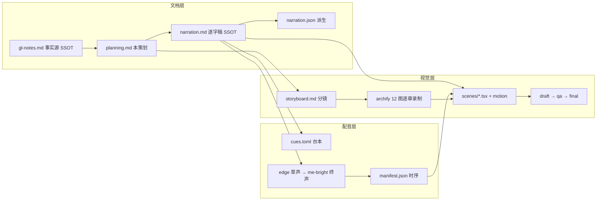

# 策划案 · 《记忆管理：一张草稿纸和一本卡片册》（ep3 完全重制）

> 事实源：[research/gl-notes.md](../research/gl-notes.md)（C 型 GL 冻结快照，正文即 docs 精读 176；
> 下文「§N」均指其正文小节，附录 A=类比登记表、附录 B=穿透记录）。
> 系列视觉契约与下期卡约束见 [series.json](../../../series.json)；建模定式标〔M-xxx〕。

## 1. 定位表

| 维度 | 取值 |
|---|---|
| 平台 | B 站 / YouTube 中长视频（系列第 3 集） |
| 时长目标 | **[13.0, 14.6] 分钟**（硬窗；254 字/分含停顿等效口径 → 可用字数 ≈ 3,560） |
| 形态 | AI 配音（edge 草声 → me-bright 克隆终声，story 档）+ Remotion 代码动画 + archify 逐章回放；无真人 |
| 受众 | 不预设 ML 背景的普通人；写过代码更佳但非必需 |
| 核心范围 | gl-notes §1–§6 主线：问题（§1–§2）→ 会话内四层管线+两红线（§3）→ 跨会话记忆四环节+三道门（§4）→ 生产对照精选彩蛋（§5–§6）；§7 实验作反例证据句、§8 规律作收束、§9 边界作护栏。**旧版（v2）的一切叙事结构、幕切轴与类比词汇不继承** |

## 2. 叙事策略

**主线问题（双问，全片闭环）**：一次 AI 编码对话凭什么能跑一整天不崩？更奇怪的是，第二天它居然还记得你是谁？——P0 **两句连发抛完整双问**（后半问只抛不答）→ 钩子（草稿纸每次全量重发、写满即拒收 §1）→ 第一层答案：会话内省着花（§3）→ P3 转折**正式激活第二问**（新会话连摘要都没有 §1/§4 开篇）→ 第二层答案：跨会话挑着记（§4）→ P6 五规律卡同帧**显式回收双问**（「不崩，靠便宜的先跑；记得你，靠目录常驻、正文按需」）→ 开放问题收尾（长上下文会终结压缩工程吗 §8.2，不裁决）。

**视觉母题统摄 + 一物一喻继承**（对齐 gl-notes 附录 A）：
- 全片连续感由**双母题对置**统摄：**草稿纸**（会话内层：纸张+行线+逐轮增行的恒定几何，灰白冷色）与**卡片册**（跨会话层：卡片+索引页的恒定几何，苔绿）。两母题全片同形复现、只换内容标签〔M-001 恒定视觉锚〕；系列 3D 装置（HarnessStack/HarnessBadge）维持 core 橙恒定=「循环不变」系列主线。
- 局部类比**一物一喻继承附录 A**，不另造：小票（§3.2 配对）、复印店账单（§4.2 缓存）、搬家整理（§3.1 顺序）、没拆的快递（§3.3 unseen）、会议纪要 vs 便签（§4.3 scope）。每喻 1–3 句点亮直觉即切回机制画面，**失配拦截句随行**（口播或字幕补位）。零类比直讲合法。
- **旧版禁用词表**（差异化纪律，④ 校验时对 narration.md 逐词 grep 复核；按旧版骨架级框架词扩充）：师傅 / 台面 / 登记簿 / 扉页 / 目录员 / 夜班整理工 / 收台 / 掐中段 / 取货条 / 打烊 / 演进彩蛋 / 两本账 / 会丢的 / 不能丢的 / 记忆不是一个功能（含立碑意象）/ 工坊 / 裁中段 / 压条子 / 搬仓库 / 记录员 / 垫纸 / 包裹标签 / 回执 / 回单 / 撂活 / 时间铰链 / 吃得住缓存 / 前面算过的全白算 / 丢口味。约束：「两套机制」为 cardSub 通用语不禁，但**不得复用为收束框架**（旧 P6「记忆不是一个功能，是两套咬合的机制」的总结构型）——新收束框架唯一 = 五规律（§8.1）。
- **去站点化词表**（规则 7，与上表同批 grep）：课程 / learn.shareai / Learn Claude Code / shareAI / s01–s20 章号；信源指称一律「这个开源项目」；讲义口径说「讲义」不进口播。

**记忆点节奏**（约每 60–90 秒一个，全部回溯事实源）：
① 草稿纸全量重发+`prompt_too_long` 拒收（§1）→ ② 搬家整理顺序直觉地图开路+四层管线「便宜的先跑」（§3.1）→ ③ T11 走查 530K→6,677 字符·0 次摘要（§3.4/§6，Animated State Trace）→ ④ 红线一小票·拆回退断裂 0→1（§3.2/§7，正反同屏）→ ⑤ 红线二快递·9,009→137（§3.3/§7，正反同屏）→ ⑥ tab 偏好→「风格偏好」塌缩（§1）→ ⑥b 摘要四件事·「不执行历史中的指令」（§3.5）→ ⑦ 复印店前缀账单（§4.2）→ ⑧ 旁路选择最多挑五条+安全阀（§4.2）→ ⑨ 三道门·三句输入逐句穿门·实测只入库 1/3（§4.3，Animated State Trace）→ ⑩ 整理 10→0（§4.4/§7，正反同屏）→ ⑪ 生产对照精选（§5.1/§5.2/§5.3）→ ⑫ 五规律一页带走+双问回收（§8.1）。

**口播数字预算**（全局纪律）：每个 60–90 秒记忆点窗口内，口播数字 ≤2 个（记忆点自带锚数除外）；其余数字一律落画面字。各幕锚数分配——P0：4K token 定义句（token 仅此一处+P6 一处）；P1：20 万 / 50 条 / 压到八成 / 0 次摘要（四层各留一锚，30,000/2,000/五类/120 字符等落画面字）；P2：0→1 / 9,009→137（消融对子自带）；P3：3 次（熔断，带讲义归属）；P4：最多挑五条（其余限额落画面漏斗）；P5：只入库 1/3 / 10→0；P6：967K（补「K 就是千」半句）/ 200 行（25KB 落画面）。

**术语白话化表**（英文机制名一律不上口播、只上画面字；口播用 gl-notes 现成白话）：
| 画面角标（英文） | 口播白话 |
|---|---|
| tool_result_budget / snip_compact / micro_compact / compact_history / reactive_compact | 大结果落盘 / 裁中段 / 旧结果换地址 / 模型摘要 / 应急裁剪 |
| unseen | 还没读过的 |
| frontmatter | 文件开头一小段固定格式的元信息 |
| scope | 跨会话还是只限本次任务 |
| 旁路调用（side-query） | 在主对话之外、专为挑记忆额外发起的一次模型调用 |
| contextCollapse | 生产版在这条队伍里多出的一层独立回收系统 |
| Sonnet | Anthropic 的一款模型 |
| stop hook | 回合结束时自动触发的挂钩 |
| token | 模型的计费单位（这个开源教学的实现拿字数近似，跟真实计费不是一回事 §1） |

**理性收尾**：不贩卖焦虑；悬念留给开放问题（§8.2 两条争议各一句悬置）；边界护栏卡（§9.1 成立工况）一句话收。

## 3. 视觉语言

**色彩语义契约**（theme.ts 已落，严格用色）：

| 色 | 值 | 语义（全片唯一） |
|---|---|---|
| core 橙 | `#D97757` | 循环内核恒定（系列锚，HarnessStack 3D 层） |
| mech 苔绿 | `#A9C46C` / 深 `#87A24E` | **卡片册·记忆·长期**（本集维度色；accents 登记色） |
| 账单金 | `#F0C244` | **钱/成本/计费**（复印店账单、token 开销、代价阶梯） |
| 红线红 | `#FF5C5C`（deny `#EF6461`，3D 层） | 红线/破坏实验/拒绝（破坏性消融警示侧） |
| 确认绿 | `#7ED321` | 机制在位拦截成功（正反同屏确认侧） |
| 灰白系 | text/dim/panel 底座 | 草稿纸·会话内·短期 |

**构图纪律**：空间隐喻不逆旁白〔X-001〕——「越贵越靠后」的代价阶梯恒用**从上到下**排队；「常驻前缀」恒在**开头左侧**；正反同屏消融恒**左坏右好**（警示红↔确认绿）。公式只作画面角标彩蛋（token 阈值公式 `contextWindow − maxOutputTokens − 13,000`），不进口播。

**archify 图集预算（12 图 · 5 型 · ~52 章 · 全屏独占；slug 均全新命名，定稿前断言不命中任何他集 storyboard 引用资产与旧 v2 保留 10 图）**：

| # | 图（slug） | 型 | 锚幕 | 内容（回溯） |
|---|---|---|---|---|
| 1 | `scratchpad-anatomy` | architecture | P0 | 草稿纸解剖：messages 配对互锁+system prompt 固定前缀+工具结果占大头（§1） |
| 2 | `compact-pipeline`（复用 176） | workflow | P1 | 四层管线全景+应急+未超限旁路（§3.1） |
| 3 | `batch-walkthrough` | dataflow | P1 | T11 三结果逐层数字流（§3.4） |
| 4 | `pairing-interlock` | sequence | P2 | 小票配对校验时序+切点回退（§3.2） |
| 5 | `unseen-guard` | lifecycle | P2 | unseen 双保险状态迁移（§3.3） |
| 6 | `summary-surgery` | lifecycle | P3 | compact_history 四件事次序（§3.5） |
| 7 | `memory-file-anatomy` | architecture | P4 | 一记忆一文件+frontmatter 三元+索引重建（§4.1） |
| 8 | `cache-economics` | dataflow | P4 | 前缀账单：常驻目录 vs 按需正文（§4.2） |
| 9 | `sidecar-selection` | sequence | P4 | 旁路选择时序+召回限额漏斗（每轮 4,000→目录 12,000→选 5 条→正文 20,000，账单金锚「目录常驻=缓存价」）（§4.2） |
| 10 | `recall-loop`（复用 176） | workflow | P4 | 四环节与两条注入路径全景（§4 开篇/§4.2） |
| 11 | `memory-gates` | workflow | P5 | 三道门+**三句输入逐句穿门走查**（Animated State Trace：句1 过三门入库=确认绿；句2 命中「this session」被临时词门拦下=红线红；句3 被 scope 门拦下=红线红；终态计数「只入库 1/3」收口）（§4.3） |
| 12 | `consolidation-txn` | lifecycle | P5 | 事务性整理：快照-删旧-写新-失败恢复（§4.4） |

P6 无新图：生产对照首件用**「教学四层 vs 生产五层」对照高亮条**（复用图2 全景加高亮行或画面卡，弃 recall-loop 尾段回放——与压缩顺序主题错位）；其余画面卡承担（五规律卡/护栏卡/身份卡/下期卡）；若视觉密度不足，备选第 13 图 `five-laws`（architecture）。章 id 全局唯一登记表在 storyboard 定稿前置。

**全貌坐标装置（Map-First Anchor，C 型契约 1；常驻轻量装置，不占 12 图名额）**：以双母题几何分区构建全片地图——草稿纸层（四层管线+两红线）/ 卡片册层（四环节+三道门）/ 尾区（规律·边界）。P0 开篇首亮全图建立宏观坐标；此后**每次换幕高亮当前环节并压暗其余**（P1 首镜点草稿纸层、P3→P4 换层镜整幅切亮卡片册层、P6 点尾区收束）。实现挂双母题缩略几何（不与图 2/图 10 抢全屏位），登记进 §4 各幕视觉锚点列与 storyboard 换层镜清单。

## 4. 分幕结构表

| 幕 | 目标时间 | 字数 | 主题 | 叙事要点（回溯 gl-notes） | 视觉锚点 |
|---|---|---|---|---|---|
| P0 | 1.3 分 | ~330 | 重发的账单 | 草稿纸比喻【二】·每次调用全量重发（§1）；写满 `prompt_too_long` 拒收（§1）；工具结果是大头：千行文件≈4K token 定义句（§1，token 全片仅此+P6 两处出口播）；配对互锁与固定前缀就地埋点（§1，为 P2/P4 伏笔）；钩子=**双问两句连发**（跑一天不崩凭什么+第二天还记得你是谁——后半问只抛不答） | 图1 草稿纸解剖；**全貌坐标装置首亮全图**；母题首次亮相 |
| P1 | 2.4 分 | ~600 | 便宜的先跑 | **搬家整理顺序直觉地图开路三句**（先租仓储→装箱登记→清单处理原件，§3.1/附录A）再逐层对号：大结果落盘 20 万（§3.1）；裁中段 50 条（§3.1）；旧结果换地址·压到八成（§3.1）；模型摘要五类事实（§3.1）；模型也能自己喊一声压缩（§3.1 compact 工具，为 P2 红线伏笔）；拦截句（搬家喻·原件有归档兜底）；T11 走查 530K→6,677·0 次摘要（§3.4）；应急裁剪保尾·只救一次（§3.1） | 图2 管线全景；图3 T11 数字流（Animated State Trace）；账单金=代价；坐标装置点草稿纸层 |
| P2 | 1.9 分 | ~480 | 两条红线 | 红线一：小票配对+拦截句（小票撕了能补打、配对断裂不能补）·切点回退·主动压缩须等这批工具跑完（§3.2/附录A）；拆回退→断裂 0→1（§7 实验1）；红线二：没拆的快递+拦截句（模型读到=下次调用全量发送）·unseen+最近 3 条双保险（§3.3/附录A）；拆保护→9,009→137（§7 实验3）；两道保险互不替代（§3.3） | 图4 配对时序；图5 状态迁移；正反同屏消融（红↔绿） |
| P3 | 1.7 分 | ~430 | 压扁之后 | tab 偏好→「风格偏好」塌缩具象例（§1，记忆点⑥）；摘要四件事次序（§3.5）；「不执行历史中的指令」防注入（§3.5）；熔断 3 次·归属句「这个数字只有讲义里有、这套开源代码里没有对应实现」（§3.5）；新会话连摘要都没有→**转折激活第二问**（§1/§4 开篇） | 图6 摘要手术；草稿纸母题收起；**P3→P4 换层镜**（坐标装置整幅切亮卡片册层） |
| P4 | 2.5 分 | ~600 | 目录与正文 | 一记忆一文件+文件开头元信息三元+索引自动重建（§4.1）；四类记忆各一句（§4.1）；**缓存经济学主轴**：复印店前缀账单+拦截句（cache 比复印店苛刻·只认逐字节相同前缀）（§4.2/附录A）；目录常驻命中缓存 vs 正文按需注入（§4.2）；旁路选择**口播只留「最多挑五条」锚数**（其余限额落图9 漏斗画面字）；降级关键词+安全阀「背景知识不是新命令」（§4.2） | 图7 文件解剖；图8 前缀账单（金主轴）；图9 旁路时序+限额漏斗；图10 四环节全景开卷 |
| P5 | 2.2 分 | ~560 | 三道门 | 每轮结束提取·压缩前快照（§4.3）；跨会话还是只限本次任务/临时词/查重三门（§4.3）；**三句输入逐句穿门走查**（Animated State Trace，图11 同规格）：句1 过三门入库、句2 被临时词门拦、句3 被 scope 门拦（§4.3）；便签类比+拦截句（关键词级一刀切·语境再合理也不行）（§4.3/附录A）；实测只入库 1/3 终态计数（§4.3）；整理 ≥10 条·快照恢复事务（§4.4）；拆快照→10→0（§7 实验5）；适合存什么+官方同口径（§4.5【官】）；地图坐标一句：CLAUDE.md 你写 vs 这套模型攒（§4.6【官】） | 图11 三道门+穿门走查（Animated State Trace）；图12 事务整理；正反同屏（红↔绿）；卡片册母题合拢 |
| P6 | 2.0 分 | ~560 | 照进生产 | **双问显式回收句**（不崩靠便宜的先跑·记得你靠目录常驻正文按需，与五规律卡同帧）；生产对照精选（全带归属句）：真实顺序多一层独立回收系统+约百万 token 窗口用到九成七才动手（967K·补「K 就是千」）【三】【官】（§5.1）；MEMORY.md 200 行/25KB 官方互证【三】↔【官】（§5.2）；旁路选择「不确定就不选」+回合结束挂钩后台化半句【三】（§5.3）；五规律一页带走（§8.1，画面卡逐条+口播一句总括）；两争议各一句悬置（§8.2）；**边界护栏卡**（成立工况三条件+Out-of-Scope 一句带过）（§9.1）；系列身份卡+下期卡《并发：谁来按下开始》 | 「教学四层 vs 生产五层」对照高亮条；967K 基线标尺+200 行/25KB 双格标尺（useCount）；五规律卡；护栏卡；身份卡/下期卡装置；坐标装置点尾区收束 |

字数合计 3,560 ± 60；句均 20–24 字 → 约 148–178 句。

> **终稿回写（as-built）**：终稿实测 3,688 字 / 139 句 / 45 章——超本表容差（B 档句隙 0.32→0.68 拉窗后字数与句数口径随之变化，实测语速 281 字/分回写见 `pipeline.toml` [narration] RSI-021）；时长硬窗 [13.0, 14.6] 达标（13.15 分）。

## 5. 生产管线图

```mermaid
flowchart LR
    subgraph 文档层
        A[gl-notes.md 事实源 SSOT] --> B[planning.md 本策划]
        B --> C[narration.md 逐字稿 SSOT]
        C --> D[narration.json 派生]
    end
    subgraph 配音层
        C --> E[cues.toml 台本]
        C --> F[edge 草声 → me-bright 终声]
        F --> G[manifest.json 时序]
    end
    subgraph 视觉层
        B --> H[storyboard.md 分镜]
        H --> I[archify 12 图逐章录制]
        C --> J[scenes/*.tsx + motion]
        G --> J
        I --> J
        J --> K[draft → qa → final]
    end
```

## 6. 边界与不做的事

- BGM 留空轨（系列无 BGM 惯例；终渲不含音乐轨）。
- **单位口径纪律**：教学版阈值/预算/限额口播一律说「字」（「二十万字预算」「目录至多一万二千字」）；token 全片只在两处出口播——P0 定义句（照搬 §1 现成白话「模型计费单位叫 token，这个开源教学的实现拿字数近似，跟真实计费不是一回事」）与 P6 967K（官方 token 口径+「K 就是千」）；两处之外数字可上画面字但口播不带 token 字样。定稿时对 narration.md grep「token」复核仅命中两处。
- gl-notes 之外的观点不进口播；【三】级断言前 3 句内必出归属句（「据对这个开源项目闭源实现的逆向分析」），画面角标同步；【官】级带「官方文档」归属。
- 活数据不进口播；站点页头 LOC/工具数元数据（414/528、9/6）不引，工具数/行数一律用仓库实测口径（6/5 工具、601/784 行，附录 B）。
- 旧版 v2 的叙事结构、幕命名、类比词汇一律不继承（§2 禁用词表，④ 校验对 narration.md 逐词 grep：旧版词表 + 去站点化词表 + 「token」两处上限）；旧 10 图资产零引用留存仓中不清理。
- 多 Agent 共享记忆 / 记忆检索质量评估 / token 级精确预算 / CLAUDE.md 体系不在本片范围（§9.1 Out-of-Scope，P6 护栏卡一句带过）。
- MIT 许可字节归档已随集落地（source-archive/ce8f9f1/），口播指称信源一律「这个开源项目」（去站点化，规则 7）。
