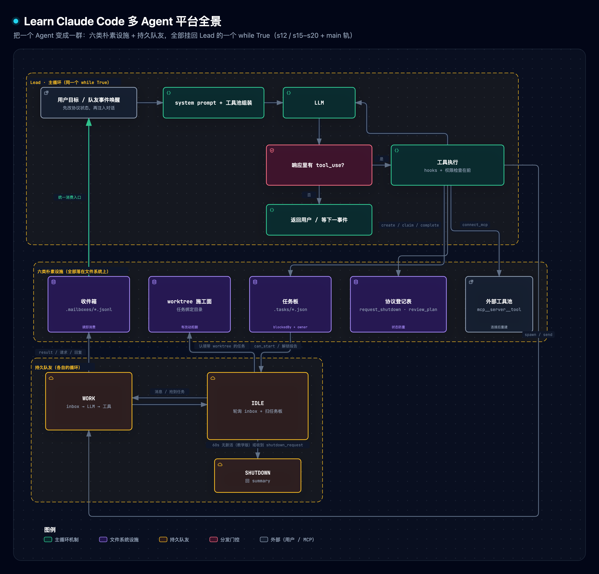

# gl-notes：Learn Claude Code「多 Agent 平台」精读冻结件（C 型信源 · ep⑤ 终集）

> **冻结登记**（2026-10-07 · vibe-video Stage ① C 型流程）
>
> - **GL 产物指针**：[docs/research/agent-harness/175-claude-code-multi-agent-platform.md](../../../../../docs/research/agent-harness/175-claude-code-multi-agent-platform.md)（guided-learn 产物，生成日期 2026-10-07）。本文件正文自其一级标题起**逐字冻结**，禁止任何改写。
> - **原始信源登记**：
>   - 站点轨（175 组织骨架，七章）：learn.shareai.run 站点页快照 `.temp/lcc-refresh/site/s12.html`、`s15.html`–`s20.html`（2026-10-07 抓取时点在场，工作区临时件未入库，20 章标题逐一与钉点对账）↔ 仓库 fix 分支 `67a9126c`（2026-07-29，README.md 中文默认）源文件 s12_task_system / s15_agent_teams / s16_team_protocols / s17_autonomous_agents / s18_worktree_isolation / s19_mcp_plugin / s20_comprehensive；
>   - main 轨（对照，四章）：`ce8f9f186058939da54c9d6fead78dfb5d0fd6c3`（2026-09-28，README.md 英文默认 / README.zh.md 中文，每章附可运行 code.py）s10_task_system / s13_agent_teams / s14_mcp_plugin / s15_integrated_harness；
>   - 官方补读：Anthropic「Orchestrate teams of Claude Code sessions」（code.claude.com/docs/en/agent-teams）、「Connect Claude Code to tools via MCP」（code.claude.com/docs/en/mcp）、Anthropic Eng「Building effective agents」（2024-12-19）、modelcontextprotocol.io（GL 访问日期 2026-10-07，对应冻结正文参考 [6][7][8][9]；agent-teams 页关键句本集 2026-10-07 WebFetch 复访仍在，见附录 C.2 第 7 条）。
> - **证据定级说明**：GL 对原始信源的转述一律按 B 型三级 **≤【二】** 处理；冻结正文中「真实 Claude Code 对应物 / 课程源码分析转述」类断言（九字段任务记录、认领锁 30 次重试、15 种消息类型、三向关机、六种传输等）按 **【三】** 级处理，口播须带归属句、不得说成产品既成事实；`lcc_multiagent_lab.py` 原型实测数字经本集复算实跑（附录 C.2 第 6 条：500 行 / 18 断言全绿 / 128 行日志），按 **【一】** 级引用（教学原型域口径）；站点轨与 main 轨 code.py 的工具计数经本集在钉点上逐章复数（附录 C.2 第 2 条），按 **【一】** 级引用。
> - **鲜度复核日期**：2026-10-07（复核动作与结论见附录 C.1）。
> - **链接适配说明**：本文件自 docs/research 迁入 research/ 后，正文全部相对链接（全景图 .mmd 图源 / 交互 HTML / dark·light PNG）的相对层级已按新落位统一改写，文字内容零改动。
> - **重冻登记**（2026-10-07 第二次冻结）：正文重冻自当前分支 175 现行版，收敛首次冻结（95cf698a6）未随 41215b5b3 契约修复同步的漂移（预测题段「临时改码实测」口径、恢复链接行）。

# Learn Claude Code 多 Agent 平台 精读与通俗拆解

> [1] shareAI-lab, *Learn Claude Code*（教学课程；中文 README 为默认语言），站点轨 s12_task_system / s15_agent_teams / s16_team_protocols / s17_autonomous_agents / s18_worktree_isolation / s19_mcp_plugin / s20_comprehensive 七章，commit `67a9126c`（fix 分支，2026-07-29；站点 learn.shareai.run 实况 2026-10-07 抓取，20 章标题逐一对账）. [Online]. Available: https://github.com/shareAI-lab/learn-claude-code
> [2]–[5] 同仓 main 轨（commit `ce8f9f18`，2026-09-28）：s10_task_system、s13_agent_teams、s14_mcp_plugin、s15_integrated_harness 四章（README.md 英文默认，本篇读 README.zh.md）。
> 版本交代：本地克隆的默认远端停在课程 2026-04 的旧谱系（`36897b1`「realign teaching path」至 `5dfe67f`，12 课 `agents/`+web 文档形态），与上游 main 的 17 章制（钉点 `ce8f9f18`，2026-09-28）是先后两代结构、非改版预告；本篇按任务钉点读上游 17 章制中的四章，用于与站点轨分章教学版对照，机制内容不受谱系差异影响。

**一句话定位**：把一个会调工具的 Agent 变成一群能并行干活的 Agent，缺的不是更聪明的模型，而是一组朴素设施：文件任务板、文件收件箱、带编号的请求-响应协议、空闲自认领、目录隔离、外部工具标准接入。它们最后全部挂回同一个 while True 循环。

单看一门「怎么写 Agent」的课程，前十一章讲的是一个人怎么把活干好：循环、工具、权限、hooks、记忆、压缩。课程把这些外围结构统称 Harness：模型负责判断和选择行动，Harness 负责把环境、工具、权限、记忆、团队和外部能力组织好[1]——下文反复出现这个词，指的就是这层外壳。这一部分（站点轨 s12 与 s15 到 s20，对应 main 轨的 s10、s13、s14、s15）回答下一个问题：活太大，一个人干不完、干不全、干不快，怎么办。直觉答案是「多开几个 Agent」，但课程用七章证明这个直觉几乎全是工程问题：多个 Agent 谁知道先做哪个任务（顺序）、谁在做什么（归属）、怎么把结果告诉对方（通信）、怎么体面地叫停（协商）、空闲了去哪找活（分工）、改文件时怎么不打架（隔离）、别人的工具怎么接进来（扩展）。每一章只补一类设施，每类设施都落在文件系统上：任务是 `.tasks/` 目录里的 JSON 文件，消息是 `.mailboxes/` 里的一行一行 JSONL，施工面是 git worktree，外部工具是统一命名的工具池条目。最后一章把全部机制放回同一个循环，证明循环本身从第一章起就没变过。本篇按设施归并这七章（§3 到 §9），配一个约 500 行的确定性原型（§11），并逐个拆掉机制实测退化。

> [!TIP]
> **白话主线**：单个 Agent 干大项目有三个硬伤：任务乱序、细节随上下文流失、串行太慢，所以要拆任务、组队并行。组队的难点不在「多开几个」，而在六个朴素问题：谁干什么、怎么说话、关键动作怎么协商、空闲了怎么找活、怎么不踩对方的文件、别人的工具怎么接。这套课程的解法是把答案全部写成文件系统上的普通设施，协商走带编号的请求-回复状态机，不指望模型自觉。每章一个可独立运行的 `code.py`，配到本篇的约 500 行原型上，把每个组件单独拆掉、看它各自怎么坏，就是验证。

## 1. 它要解决什么问题

具体到一个场景：「重构整个后端」。它涉及认证模块、数据库层、API 路由和测试。让一个 Agent 顺序做，第一问题是乱序：它可能先写调用数据库表的 API，写到一半才发现表不存在，回头返工。第二是遗忘：修 API 路由时，认证模块的细节已经挤出上下文窗口。第三是慢：四件事本可以并行。前十一章里现成的两个机制都不够用：s05 的 TodoWrite 是当前会话的执行清单，存在内存里，既不记录任务之间的先后依赖，也不记录归属，换一个会话就没了；s06 的子 Agent 是一次性临时工，叫来干一件事、只回传一句结论，不能通信、不能协作、不能跨任务保留身份。

main 轨 s13 把「组队」这件事需要回答的问题列得很完整，值得照抄一遍，因为它就是本篇的设计规格：谁判断并行有用、新增 Agent 由谁确认；每个队友如何跨任务保留身份和上下文；结果如何自动回到 Lead 而不是靠模型反复查询；空闲队友能否自己接手就绪任务；并行修改可能冲突时用什么工作目录；关机和计划审批如何成为可追踪、可执行的协议[3]。

| 规格要求 | 通俗版 | 对应机制 |
|---|---|---|
| 可恢复的目标 | 任务落盘，重启不丢，先后顺序挡在认领前面 | 任务板：`.tasks/*.json` + `blockedBy` + `owner`（§3） |
| 跨 Agent 通信 | 各自有收件箱，消息异步送达 | 文件收件箱：`.mailboxes/*.jsonl`（§4） |
| 可追踪的协商 | 关机、审批要有凭据、能对号、防重复生效 | 请求-响应协议：`request_id` + 状态机（§5） |
| 自主分工 | 队友空闲了自己看板、自己抢活 | 空闲轮询 + 扫描 + 认领（§6） |
| 不冲突的施工面 | 各改各的目录，收尾有保护 | git worktree 按任务绑定（§7） |
| 可扩展的能力 | 外部服务不改代码就接入 | MCP 发现-命名-组装（§8） |
| 一个可运行的整体 | 机制再多也挂在同一个循环上 | 综合回合的挂点表（§9） |

## 2. 全貌解剖

先看整张地图（全景拓扑的文本源在[这里](../../../../../docs/assets/mermaid/agent-harness/lcc-multiagent--panorama.mmd)，渲染产物由资产管线统一登记）。图的结论一句话可以说完：Lead 与每个队友各自跑一个结构相同的循环，六类设施全部是文件系统上的共享物，队友通过写收件箱和认领任务影响 Lead 的下一轮，而 Lead 从头到尾没有第二个循环。理解本篇内容，按三层进入：

> 交互版（下载到本地打开）：[`lcc-multiagent--panorama.html`](../../../../../docs/assets/architecture/agent-harness/lcc-multiagent--panorama.html) · 双主题渲染 [`dark`](../../../../../docs/assets/architecture/agent-harness/lcc-multiagent--panorama-dark.png) / [`light`](../../../../../docs/assets/architecture/agent-harness/lcc-multiagent--panorama-light.png)

| 层级 | 部分 | 回答的问题 | 性质 |
|---|---|---|---|
| 地基（精读） | 任务板 | 谁干什么、什么顺序、进度怎么跨会话恢复 | 教学代码全量实现 |
| 地基（精读） | 收件箱 | 队友之间怎么传话、结果怎么进入 Lead 的上下文 | 教学代码全量实现 |
| 地基（精读） | 协议 | 关机、审批这类关键动作怎么可追踪地协商 | 站点轨消息流程；main 轨加执行拦截 |
| 地基（精读） | 自治认领 | Lead 不再手动派活，队友自己找活干 | 两轨两种成熟度（§6 对照） |
| 证据链 | worktree 隔离 | 并行改文件怎么不互相覆盖、怎么安全收尾 | 教学代码全量实现 |
| 证据链 | 外部工具池 | 外部工具怎么不改 Agent 代码就接入 | 教学版 mock，官方文档印证 |
| 证据链 | 综合回合 | 学完全部机制后，「挂在哪」的位置感 | 教学代码全量实现 |
| 地图坐标 | 两轨差异与真实产品对应物 | 教学机制与真实 Claude Code 的距离 | 版本对照 + 官方文档 |

因果脉络从观察走到证据：观察是大项目下单 Agent 乱序、遗忘、串行慢；归因是目标、进度、通信全都只活在单个会话的内存里，TodoWrite 是清单不是契约；于是有了上面七行规格；机制层把规格落成五组代码（任务状态机、收件箱、协议登记表、空闲轮询、工具池组装）加两处外围（worktree、综合挂点）；证据闭环由三路构成：每章可运行的 `code.py`、最后一章的全挂回、以及官方文档对真实产品落地形态的印证（文件收件箱、文件锁认领、关机握手在真实 Claude Code 中确实如此，见 §10）。

学习焦点按价值排：最值得吃透的是任务板，它是一切的地基；其次是协议，「协议先于智能」这句话的落点就在那里。收件箱与统一消费排第三，它教会你消息即事件。原子认领是并发正确性的最小教学样例，综合回合给位置感，worktree 与 MCP 属于外围但实用。三个前置概念在需要处就地讲：agent loop（模型调工具、结果回填、再调模型，本篇只需记住「循环没变、周围变厚」）；子 Agent（一次性调用，§4 用它对照持久队友）；git worktree（一个仓库同时检出多个工作目录、各挂各的分支，§7 展开）。

## 3. 任务系统：从执行清单到可认领的契约

任务板要解决的痛点在 §1 已经摆过：TodoWrite 显示「编写 API」还没完成，但 Harness 无法据此判断这个任务现在能不能开始。任务系统补上这一层判断。

机制本身很朴素。每个任务是一个 JSON 文件（JSON 是一种纯文本的结构化记录格式，人能读、程序也能读），存在 `.tasks/` 目录，六个字段：编号、标题、描述、状态、归属人、依赖列表 `blockedBy`。状态只有三个值：pending（没人做）、in_progress（有人在做）、completed（做完），外加两个动作：claim 把 pending 推进到 in_progress 并写下归属人，complete 把 in_progress 推到 completed。认领前有一道依赖检查 `can_start`：依赖列表里每个任务都必须是 completed，有一个不是、甚至有一个文件根本不存在，就不许开始；不存在的依赖按被挡处理，引用错了编号不会放行，也不会崩溃。任务完成时除了改自己的状态，还会扫一遍全部任务，把「依赖刚刚凑齐、从被挡变成能做」的下游任务挑出来报告给模型，这一步叫解锁。解锁报告是主动推送：模型不需要挨个查询，完成动作自己会带回「接下来谁能开工」。

拿一个具体输入走一遍。内容工厂有四个任务：写初稿、配图、排版（依赖初稿和配图）、发布（依赖排版）。四个任务创建完、依赖登记完之后，任务板上只有写初稿和配图能被认领：排版的依赖里有未完成任务，发布的依赖链上有排版。写初稿被认领、完成后，解锁报告列出「配图已可做」（若配图尚无人做）；初稿和配图都完成后，排版解锁；排版完成后，发布解锁。每一步的判断都只看依赖任务的状态是不是 completed，认领不算完成，所以排版不会被「已认领但没做完」的初稿解锁。

站点轨与 main 轨在这里给出了同一机制的两种实现深度，对照着看最有效率。站点轨 s12 的 `create_task` 在创建时直接声明 `blockedBy`，一把梭建好任务图[1]；main 轨 s10 改成两阶段：先创建所有节点拿到运行时生成的编号，再用 `update_task` 按编号加依赖边[2]。两阶段不是绕弯子。同一轮回复里可能同时发出好几个工具调用，它们在任何工具结果出现之前就已定稿，所以后一个 `create_task` 拿不到前一个刚生成的编号；先建点、再拿真实编号连边，配合「依赖必须存在、目标必须 pending 且无人认领、不能自依赖或成环」的校验，把任务图变成一份经得起检查的契约。main 轨还有两处更严的细节：任务文件以排他模式创建，编号已存在时直接拒绝写入、不会产生重复的任务文件；`complete_task` 校验调用者是不是归属人，别人的任务完成不了[2]。

真实 Claude Code 的对应物比教学版重得多：任务记录九个字段（多出进行时态描述、下游列表、元数据），存储在 `~/.claude/tasks/{taskListId}/` 下每任务一个文件，认领用 `proper-lockfile` 文件锁包住「重读、查归属、查完成、查依赖、写归属」五步，最多重试 30 次、指数退避 5 到 100 毫秒；还有一个高水位标文件记录分配过的最大编号，删掉的任务其编号不会被复用[1]。教学版与真实版的分工在材料里说得很清楚：任务系统与错误恢复是独立的两层，互不耦合。

## 4. 团队：文件收件箱与持久队友

任务板回答了「谁干什么」，接下来是「怎么说话」。为什么不能让所有 Agent 共享同一个对话数组：一个队友的工具结果会灌进另一个队友的推理上下文，互相污染。也不能只靠 s06 的子 Agent：它只回传一次结论，中途不能问、不能改、不能等。

课程的做法分三件。先说角色名：与用户对话、提出分工方案并等用户确认后才拉人的那个主 Agent 叫 Lead，被拉来干活的叫队友[1][3]。第一件，收件箱：每个 Agent（包括 Lead）有一个 `.mailboxes/{名字}.jsonl` 文件（一行一条 JSON 记录的纯文本），发消息就是往对方文件里追加一行 JSON，读消息是读整个文件然后删掉文件。读和删是一体的，像快递柜：包裹放进去，谁取出谁得到，取出后柜格就空了，不会有人取到同一件两次。这个比方到边界就停：收件箱文件可以无限追加，快递柜满了会拒收。第二件，持久队友：Lead 调 `spawn_teammate` 工具，在程序里另起一条与主程序同时跑的执行流（行话叫后台线程），队友有自己的系统提示词（给它定角色的一段指令）、自己的消息历史、自己的精简工具集（bash——执行命令行指令的工具、读文件、写文件、发消息），跑完活把总结发回 Lead 的收件箱。第三件，Lead 的收件箱注入：主循环每轮结束后检查收件箱，把队友消息注入对话历史，让模型看到并做出反应；站点轨 s15 的实现还配了一个每秒一次的轮询器，有消息或后台任务完成就唤醒新一轮，不必等用户输入[1]。

队友和子 Agent 的区别值得单独记，因为它是「什么时候组队」的判断依据：子 Agent 生命周期是一次调用，上下文只服务一个任务，通信是返回一次结果；队友是多轮存活的执行单元，跨任务保留上下文，收发消息、参与协议。用课程自己的话说，一次性子 Agent 解决上下文隔离，持久队友解决长期并行协作[1]。

main 轨 s13 把这套机制往产品方向推了一大步，四处升级都值得点名。收件箱加了锁和条件变量：写入在锁内完成，等待方不再空转轮询，消息到达即被唤醒[3]。Lead 的收件箱不再暴露给模型当工具：消息的到达与消费属于运行时，CLI 同时等终端输入和收件箱，事件一到就先消费收件箱、更新协议状态、把团队事件注入历史、自动开一轮 Lead 调用；模型只处理已经投递进上下文的事件，不必反复查收[3]。结果与空闲是两个独立事件：队友完成一项任务后先发 `result`（这项任务产出了什么），再发 `idle_notification`（这个队友还能接活），一个含糊的「完成了」表达不了两种状态[3]。组队本身要先过用户这一关：Lead 的系统提示词写明「并行有用时先提出小团队方案、等用户确认，确认前不得调用 spawn_teammate」，理由是组队会改变成本、并发度和能动工作区的角色集合[3]。还有一件教学版整体省略、真实产品里必须有的东西：权限冒泡。队友遇到需要审批的操作，发请求到 Lead 的收件箱，用户的批准结果再回到队友，审批提示统一出现在 Lead 会话里[1][6]。这四处里最后一处（先提案等确认）是两轨的真实分歧，§12 争议二再展开。

## 5. 协议：带编号的请求-响应

有了通信，还要有协商。两个场景逼出同一套结构。关机：Lead 想让队友停下，把线程硬杀掉，它写到一半的文件就悬在那里，所以需要握手。计划审批：队友要动高风险的东西，应该先把计划给 Lead 看，批了再动手。这两个场景结构完全一样：一方发请求，另一方回回复，请求和回复用同一个编号关联，一张登记表追踪状态从 pending 变成 approved 或 rejected。

协议的运作像洗衣店一式两联的取衣票据：送洗时撕开两联各持一半，取衣时两联对上号才交衣，票据上写明品类，拿取衣票去取修的鞋会被柜台拒绝。请求带着编号出去，回复带着同一个编号回来，对上号、品类相符、这单还没结过，才改状态。

四步链路以关机为例。第一步，Lead 生成一个编号比如 `req_000142`，在登记表里记下「这是一个 pending 状态的关机请求，发给 alice」，然后把带编号的 shutdown_request 消息放进 alice 的收件箱。第二步，alice 收到消息，按消息类型分发：看到 shutdown_request，先收尾。第三步，alice 回一条 shutdown_response，元数据里带回同一个编号和同意与否。第四步，Lead 读到回复，去登记表对号，通过三道检查才改状态。三道检查各拦一种错：编号对不上就不理，拦住「一条回复误更新别人的请求」；类型对不上就不理，拦住「一条关机回复误批准一个计划请求」；状态不是 pending 就不理，拦住「同一条回复生效两次」。本篇原型把第二道检查单独拆掉实测过：拆掉后一条 shutdown_response 直接把一个 pending 的计划请求改成了 approved（§11 实验 E2 的实测日志）。同一套状态机服务两种协议，加新协议只是加一个新的类型分支。

这里有个容易被忽略的耦合，也是站点轨 s16 专门修过的坑：收件箱的读取是消费式的，如果「查收件箱」的工具和主循环各自去读，先读的一方把消息拿走了，协议核对却没做，登记表永远停在 pending。所以 Lead 的收件箱必须收敛成一个统一消费入口：先按编号路由协议回复、更新登记表，再把消息交给对话。站点轨的 `check_inbox` 工具和主循环末尾共用这一个函数[1]；main 轨走得更远，把这个工具从模型手里拿走，投递完全由运行时负责[3]。

与真实 Claude Code 对照，教学版的简化都标在明处。真实版的关机是三向通信：请求、批准（或拒绝并附原因）、再加一条系统级的通知；关机确认后自动清理终端窗格、把未完成任务清归属重置回 pending、从团队配置里移除成员。真实版的协议消息是带模式校验的结构化 JSON，共 15 种消息类型，普通文本消息包在 XML 标签里交付给模型；计划审批在真实版里由计划模式的退出动作产生，审批可以附带反馈让队友修改重提，甚至附带权限模式（「批准，但以计划模式运行」）[1]。

## 6. 自治：空闲自认领与并发正确性

协议管住了「怎么说清楚」，自治解决「谁派活」。s16 之前，队友等 Lead 分配：任务板上有十个未认领任务，Lead 得手动派十次，这不能扩展。自治的答案是让队友自己看板、自己认领、做完再找下一个。

教学版的生命周期是三阶段循环。WORK：收件箱、调模型、执行工具，模型不再要求工具时就结束本轮。教学版的 IDLE 是这样：不退出，每 5 秒醒一次，先看收件箱（关机请求和点名指令优先），收件箱空就扫任务板，找同时满足三个条件的任务：pending、无归属人、依赖全部完成；找到就认领，回到 WORK；60 秒没等到新活，就发总结、收摊关机（真实版是 500 毫秒级的邮箱轮询加事件唤醒，且无固定超时）[1]。SHUTDOWN：收到关机请求，走 §5 的握手退出。为什么收件箱优先于任务板：关机和指令是点名道姓的控制消息，晚处理耽误全局；任务板上的活是公共资源，晚一轮没关系。为什么认领必须检查结果而不是发出去就算数：扫描到的候选只是某一时刻的快照，另一个队友可能同时看上了同一个任务。

「同时看上同一个任务」是这一章真正的深水区。两个队友的认领动作各自是「读文件、查归属、写归属」三步。归属检查能挡住的那类失败是有感知的：认领返回失败（比如恰好被别人抢先一步）不当成成功，队友继续等下一轮。无锁交错时连这个感知都没有：两个执行者都从自己的快照里看到空任务，先后写入，后写的覆盖先写的，两边都以为自己抢到了。电影院线上选座就是这个问题：两人同时看到同一个空座，系统必须把锁座下单做成一步；看见不等于抢到。这个比方说的是目标状态，教学版恰恰没有这把锁，所以真的会出现后写覆盖；main 轨把这步补齐了：认领放进进程内锁加文件锁的双重临界区，进临界区后重新读文件（防「检查时刻」与「写入时刻」之间被抢，行话叫 TOCTOU），再加一条「一个归属人同时只许有一个进行中任务」的忙检查，把发现和认领明确分成两步：扫描只出候选快照，所有权变更只发生在锁内[3]。官方文档证实真实产品就是这么做的：任务认领用文件锁防止多个队友同时抢同一个任务的竞争[6]。

身份保持是自治里另一个不起眼但必要的细节。上下文压缩（s08 的机制）可能把队友的消息历史压成一段摘要，站点轨 s17 的做法是每次进入新一轮 WORK 前检查消息长度，过短就判定发生了压缩，重新注入一段身份信息（你是谁、角色是什么、继续干活）[1]。真实版没有这个问题，因为压缩会保留系统提示词。

main 轨与真实产品在「空闲怎么办」上做出了不同选择，这是 §12 争议一的现场：教学版 60 秒超时退出，main 轨持续等待直到收到关机请求，真实产品无固定超时、由 Lead 手动关机。

## 7. 隔离：任务绑定的施工面

自治让两个队友同时干活了，下一个坏法立刻出现：Alice 和 Bob 在同一个目录工作，都去改 `config.py`，互相覆盖，而且分不清哪些改动是谁的，回滚都不干净。任务板解决了「谁干什么」，收件箱解决了「怎么说话」，都没解决「在哪干」。

git worktree 是给这个问题的现成答案：同一份代码可以同时铺开多个互不干扰的工作目录，每个目录里各自的改动单独记在一条「分支」（一条独立线索）上，收尾时经人工审查后按分支合并，或经确认后丢弃——行话叫「一个仓库检出多个工作目录，每个目录挂自己的分支」[1]。课程的用法是任务级绑定。`create_worktree(name, task_id)` 在 `.worktrees/` 下建目录、建 `wt/{name}` 分支，然后把任务文件里的 worktree 字段写上目录名。绑定不改任务状态：任务仍是 pending，等队友认领时才推进到 in_progress，这样 Lead 可以提前建好任务和施工面，队友空闲时自然领走带目录的任务。队友认领到带 worktree 的任务后，它的 bash、读、写都在那个目录下执行（教学版用一个记录当前路径的小字典实现；真实版是进程级目录切换或子 Agent 目录覆盖）[1]。

收尾的保护比创建更值得学。`remove_worktree` 在删除前数两样东西：未提交的文件数、未推送的提交数，有任何一样非零就拒绝删，必须显式传「丢弃改动」才强删，或者走 `keep_worktree` 留着分支等人工审查合并。任务完成与目录清理是两件独立的事：complete 记录任务结果，收目录由人决定。每次生命周期操作（建、删、留）都往 `events.jsonl` 追加一条事件，出问题可以审计。名字本身也要校验：只允许字母数字点下划线横线、1 到 64 字符、拒绝 `.` 和 `..`，把路径穿越挡在门口[1]。

必须把边界说死，材料自己也说了：worktree 只分开 Git 工作目录和分支，不是安全沙箱。Shell 命令仍能访问父进程有权访问的任何路径[1][3]。拿它当不可信代码的隔离层，是把它当成它不是的东西。main 轨把「移除」进一步从模型工具里拿掉、收敛为宿主侧函数：删除前要检查任务所有权、目录租约和 Git 状态，破坏性移除必须另行取得用户确认[3]。

## 8. 外部工具：发现、命名、组装

到这里，Agent 的工具都是课程手写的：bash、读写、任务、团队、worktree。接第三个外部服务（比如公司内部的 Jira、自建部署系统）就要再手写一套定义、参数格式和调用代码，服务一改还要跟着改。MCP（Model Context Protocol，一个开放标准）把这件事拆成两半：外部服务实现「给工具清单」和「执行工具调用」两个入口，Agent 端负责连接、命名、权限判断和把工具交给模型。

教学版的实现浓缩成三步（外部服务用进程内模拟，且工具只给 Lead 用；真实版外部工具对子 Agent 同样可用、配置可继承，这是材料标注的教学简化）。连接：`connect_mcp(name)` 找到服务，拿到工具清单（对应真实协议的 `tools/list`），清单里每个工具带着自己的名字和说明文字，随工具池一起交给模型。命名：工具名统一成 `mcp__{服务名}__{工具名}`，两个服务都有 `check` 也不会顶名；名字里不属于字母数字下划线横线的字符一律替换成下划线。组装：每轮把内置工具和已连接的外部工具拼成同一个池子，模型看到的全名、执行时用的原始名，靠组装时的对照表翻译[1]。main 轨 s14 在同一路径上加了两个生产级细节：规范化之后撞名直接报错而不是悄悄覆盖，全名超 64 字符拒绝；权限不信任服务自己写的「只读」标注，宿主维护一张精确的已知只读名单，名单外的外部工具一律要用户确认[4]。后一条的原则值得单独记：外部服务的自我描述不能当授权依据。

连接外部服务之后有一个容易漏的连带动作：工具池变了，依赖工具列表的缓存必须作废。站点轨 s19 干脆去掉了前几章的提示词缓存，理由写在明处：缓存里的工具清单是旧的，继续用会导致模型调不到新工具[1]。原型里实测过这个退化：连接后沿用旧池调用新工具，返回的是 Unknown tool（§11 实验 E5）。

真实版的差距主要在传输与安全。教学版用进程内模拟服务；真实版支持六种传输（本地子进程的标准输入输出、HTTP、SSE、WebSocket、IDE 内嵌、进程内 SDK），本地与远程服务分批并发连接，有完整的 OAuth 认证、错误分类重连、以及服务反向推消息的通知通道[1]。官方文档印证了教学版的两个核心设计：工具名中非字母数字下划线横线的字符一律替换为下划线、权限规则按完整工具名书写（普通服务的全名为 `mcp__服务__工具`；插件内置服务的全名另带插件段，形如 `mcp__plugin_插件名_服务名__工具名`），项目级 `.mcp.json` 里的服务需要用户批准后加载[7]。

## 9. 综合回合：机制很多，循环一个

前六章每章只加一个机制，适合学，不适合跑。真实 Agent 不会带着单一机制出门。终点章把全部机制放回同一个可运行的系统，价值不在新机制，在位置感：每一件东西挂在循环的哪个位置。

挂点表值得整段抄下来，因为它是全课程的收束。用户输入后，UserPromptSubmit hooks 先看一眼；调用模型前，cron 队列和后台任务通知注入消息，压缩管线先压大输出再裁历史，记忆、技能目录、已连接服务状态组装进系统提示词；调用模型时包一层错误恢复（限流退避、超载切备用模型、超长先提额再续写、提示过长触发反应式压缩）；执行工具前，PreToolUse hooks 加权限拦截危险命令、越界路径和破坏性外部工具；执行时慢操作放后台线程先回占位结果；执行后 PostToolUse hooks 做大输出告警；本轮没有工具调用时，Stop hooks 收尾统计。每一步都是「循环周围变厚」，循环本身还是那四句：调模型、看响应里有没有 tool_use、执行工具、结果回填，再转一圈[1]。

综合版里两对容易混淆的东西分得清清楚楚。两层计划：`todo_write` 是当前会话的轻量清单，帮单个 Agent 不漂移；任务图是跨会话、可依赖、可认领的契约，支撑团队协作。两种委派要走不同的门：要的是「算完只拿结论」时用 `task` 工具，它起一次性子 Agent，独立消息历史、只回最终摘要；要的是「长期并肩、随时对话」时用 `spawn_teammate`，持久队友线程能收发消息、空闲认领[1]。工具池在综合版长到 27 个内置工具加动态外部工具（main 轨集成版是 26 个，差在错误恢复并入的方式不同）[1][5]。

课程的结语本身就是全篇的论点，值得原样放在这里：从第一章到最后一章，代码表面越来越复杂，但核心始终没变；Claude Code 的复杂性不是「另一个 Agent 大脑」，而是一个成熟 Harness 的复杂性。模型负责判断和行动选择，Harness 负责把环境、工具、权限、记忆、团队和外部能力组织好。机制很多，循环一个[1]。

## 10. 关键实证数字

| 数字 | 条件与出处 | 一句话读法 |
|---|---|---|
| Lead 内置工具 8 → 14 → 18 → 27 | 教学版 s12 → s15 → s19 → s20（main 集成版 26）[1][5] | 机制是逐层加挂的，综合版是全集 |
| 认领锁：最多重试 30 次、退避 5–100 ms | 真实 CC `claimTask`，课程源码分析转述[1] | 真实版把「抢座」做成了带锁原子操作 |
| 15 种结构化消息类型；关机三向通信 | 真实 CC 团队通信[1] | 教学版两种协议是全集的最小子集 |
| 轮询节奏：Lead 收件箱 1 s、队友权限 500 ms、教学版空闲 5 s / 超时 60 s | 课程源码分析与教学参数[1] | 轮询是兜底，真实方向是事件唤醒（main 轨已改） |
| 外部工具全名 ≤ 64 字符、非法字符替换为下划线 | main 轨 s14 校验[4]；官方文档同规则[7] | 命名空间是冲突的最后一道防线 |
| 真实 Agent teams 为实验特性、默认关闭（需设 `CLAUDE_CODE_EXPERIMENTAL_AGENT_TEAMS=1`）；建议 3–5 个队友、每人 5–6 个任务 | 官方文档，2026-10 快照[6] | 官方对「多开几个」持谨慎默认态度 |
| 进程内队友缓存 TTL 5 分钟；token 消耗显著高于单会话 | 官方文档[6] | 并行的代价是真实的钱 |

三条核心宣称的独立证据在此交代：真实 Claude Code 确实用文件收件箱（`~/.claude/teams/{team}/inboxes/{agent}.json`）与文件锁任务认领实现团队协作，官方文档与课程的源码分析互相印证[1][6]；MCP 工具命名规则与权限按全名书写，官方文档与课程实现一致[4][7]；「多 Agent 更费钱」只有官方文档的定性陈述（token 用量随活跃队友数线性增长、例行任务单会话更省），课程与官方都没有并行加速比的实测数字。另外，教学版自身标注的简化点（收件箱读删竞态、认领无锁、审批无执行拦截）在何种并发度下真的出事，材料没有量化，本篇原型只验证机制逻辑，不构成对真实系统的复现。

## 11. 动手实验室

原型位于 `docs/research/agent-harness/assets/lcc_multiagent_lab.py`，纯标准库、无网络、无随机数，LLM 全部换成脚本化序列，同一命令永远同一输出。运行方式：`python3 docs/research/agent-harness/assets/lcc_multiagent_lab.py`（有 uv 时用 `uv run --no-project python …` 等价）。场景是内容工厂：初稿与配图并行，排版依赖两者，发布依赖排版，外加一个依赖不存在编号的陷阱任务；两个脚本化队友自认领跑完整条链，最后走关机握手。自检共 18 条断言全绿，输出 128 行日志（本篇引用的日志均取自实际运行，标「实际运行日志」）。

机制到代码的行号速查（对 `lcc_multiagent_lab.py`）：

| 机制 | 位置 |
|---|---|
| 任务板：建/依赖检查/认领/完成+解锁/扫描 | `TaskStore` 33 行起（`can_start` 61、`claim` 72、`complete` 86、`scan_unclaimed` 97） |
| 消费式收件箱 | `MessageBus` 102 行起（`read_inbox` 119） |
| 协议登记与三重校验 | `Protocol` 138 行起（`match_response` 153、统一消费入口 `consume_lead_inbox` 184） |
| 空闲自认领生命周期 | `Teammate` 196 行起（`idle_turn` 221） |
| 并发认领模拟（TOCTOU） | `simulate_concurrent_claims` 247 |
| 外部工具发现-命名-组装 | `normalize_mcp_name` 268、`ToolPool` 283 起 |
| 场景与五组实验 | `scenario_normal` 340、`scenario_edge` 362、`exp1`–`exp5` 381–425、`selftest` 439 |

五组破坏性实验，每次只拆一个开关，改动一行以内，跑完记录退化（均实测）：

| 实验 | 改了什么 | 实测退化（实际运行日志） | 教训 |
|---|---|---|---|
| E1 坏依赖放行 | 依赖文件不存在由「视为被挡」改为「忽略」 | 基线 `Blocked by: ['task_999']`；拆后 `Claimed task_005 (ghost)`，依赖不存在编号的任务被认领 | 「不存在」和「已完成」必须区分，前者往往是引用错误 |
| E2 类型校验拆除 | `match_response` 跳过类型比对 | 基线 `ignored:type_mismatch`，计划仍 pending；拆后一条 shutdown_response 把 plan_approval 改成 `approved` | 编号对上还不够，品类对上才算同一件事 |
| E3 统一入口拆除 | 收件箱消费不再路由协议状态 | `req_000001 状态 = pending`；再读只剩 0 条，回复被读走且状态永远不更新 | 读即消费必须配单点入口，否则消息丢失加状态失同步 |
| E4 认领原子性拆除 | 无锁交错模拟两人抢同一任务 | `w1 wrote owner=w1`、`w2 wrote owner=w2`，双方都以为成功，终值 owner=w2 | 看见不等于抢到，检查与写入要在一个临界区 |
| E5 连接后不重建工具池 | 沿用连接前的旧池调新工具 | `Unknown tool: mcp__docs__search`；重建后正常返回 | 工具池是动态的，依赖它的缓存必须随它失效 |

另有一组为预测题跑的对照（临时改码实测；lab 未内置该实验入口，测完即还原，当前文件无此段代码）。复现步骤：① 打开 `docs/research/agent-harness/assets/lcc_multiagent_lab.py`，在 `if __name__ == "__main__":` 之前临时插入一段探针函数（仿 `exp2_type_check` 的写法：`fresh_world` 建场 → `protocol.request_shutdown("w1")` 发起关机 → 把同一条同意回复（同 `request_id`、`approve=True`）`bus.send` 两遍 → `consume_lead_inbox()` 统一消费），并在 `__main__` 入口调用它；② 探针第二轮运行时置 `protocol.status_check = False`——即 `Protocol.__init__`（:147，行尾注释「S2 预测题可拆」）指向的状态防重开关——再投一条 `approve=False` 的相反副本；③ 运行 `python3 docs/research/agent-harness/assets/lcc_multiagent_lab.py`。实测输出：防重在时第二次投递显示 `req_000001 already approved → ignored`，改写次数保持 1；拆掉后同一条同意回复投递两次，登记表被改写两次（mutations 1 → 2），「一个请求只决议一次」被打破；拆掉状态下第二份副本携带相反结论，已批准的关机被翻成 `rejected`（mutations 增至 3）。

## 12. 底层规律与核心争议

前面七节拆的是设施，这一节把它们收拢成可以带走的五条规律，再看三个真实存在的分歧。五条各管一个正交维度：状态存哪、协商谁兜底、并发怎么不坏、消息怎么不多不少、能力怎么长出来。

### 规律 1：共享状态出内存、入文件（state lives in files）

需要跨会话、跨 Agent 共享的东西，一律落成磁盘上的普通文件，不待在进程内存里。原因很直接：会话一断，内存里的进度全丢；两个进程看不见彼此的内存；没有文件就没有共同的可观察面。课程里任务、收件箱、目录绑定全是文件，真实产品同样用文件收件箱与文件锁实现团队协作[1][6]；反面教材是 TodoWrite，内存清单只活一个会话。这条路的源头是 Unix「一切皆文件」的协调传统（Ritchie 与 Thompson 1978 年的 Unix 论文），Kleppmann 在《Design of Data-Intensive Applications》（O'Reilly, 2017）里把文件与日志作为共享事实源的论述是同一脉。

### 规律 2：关键协商不靠自觉，靠协议状态机（protocol before intelligence）

关机、审批、认领这类动作，不写成「请在消息里说明白」的提示词，而是提供带编号、带类型校验、带防重的结构化协议，模型只是协议的参与者，对错由结构兜底。之所以必须如此：纯文本消息会被误解、漏处理、重复处理，「AI 答应过」不构成可追踪的状态变更。证据两头都有——正面是三重校验各拦一种错配（原型实验 E2 拆掉类型校验后的实测退化），main 轨更在工具分发层硬拦截未批准的写操作；反面是站点轨 s16 自述「没有实现执行门控」，模型可以不等批准就动手。Anthropic 自己的工程总结站在结构这一边：最成功的实现用的是简单、可组合的模式，而不是复杂框架[8]；并发同步由系统而非进程自觉保证，是操作系统教科书里的老定式（Silberschatz 等《Operating System Concepts》第 10 版, Wiley, 2018）。

### 规律 3：先查后写必须原子上锁（scan-then-claim atomicity）

扫描共享看板只是取快照，真正改变归属的「检查加写入」必须一口气做完、中间不许别人插手（行话叫在同一临界区完成）。缺了它，多队友抢同一个任务就是重复劳动加后写覆盖，原型实验 E4 的实测正是这个形态：无锁交错时双方都以为自己认领成功。三个版本给出三级证据：站点轨无锁、自述有竞争；main 轨锁内重读加忙检查；官方文档证实真实产品用文件锁[3][6]。教科书里这一章叫竞态条件与临界区（Silberschatz 等《Operating System Concepts》第 10 版, 2018），课程把它演成了可运行的三步对照。

### 规律 4：读即消费，单点入口（destructive read, single consumer）

收件箱的读取是删除式的，一条消息恰好被处理一次；换来的是所有读取必须收敛到一个统一入口，先对号改协议状态、再交出消息。多入口各读各的，坏处有两层：消息被先读的一方拿走，后读的扑空；更糟的是协议核对没做，状态机停在原地。原型实验 E3 实测了这个形态：工具直读之后，关机请求的登记项永远 pending，再读只剩零条。站点轨用统一消费函数收口，main 轨干脆把消费整个交给运行时。消息传递语义里「至少一次投递与恰好一次处理」的消费者责任，Kleppmann《Design of Data-Intensive Applications》第 11 章（O'Reilly, 2017）讲得最系统。

### 规律 5：能力接入走发现-命名-组装（namespaced discovery）

外部能力不靠改源码接入：连接时发现工具清单，统一命名空间防顶名，每轮组装进同一个池；池一变，依赖它的缓存作废。它同时解决三件事——每个服务都要重写一套工具代码、不同服务的同名工具互相顶名、缓存旧清单导致新工具永远调不到（原型实验 E5 的实测）。前缀命名与字符归一在两轨实现里一致，官方文档同样背书[7]，main 轨还加了撞名直接报错。MCP 作为开放标准把这条路产品化[9]。

### 争议 1：空闲队友超时退出还是长驻等待

一派让队友空闲 60 秒就关机（站点轨），看到的是空转烧资源；一派让队友等到关机请求才退出（main 轨与真实产品），看到的是依赖解锁时机不可预测、队友跑路后反复重建上下文更贵。分歧本质是闲置成本对重建成本的选址，随任务到达率与冷启动成本变化，没有普适答案。

### 争议 2：组队要不要先过人工闸门

main 轨把「先提方案、等用户确认再开队友」写进系统提示词，把组队当高危资源操作[3]；站点轨与真实产品现状都是 Lead 直接开，官方文档明说启动队友不需要用户确认，甚至具名的子 Agent 会被自动升级成队友[1][6]。厂商的折中是权限提示冒泡加实验开关默认关闭：谨慎默认、显式开启。分歧本质是信任边界画在产品层还是提示词层。

### 争议 3：计划审批拦在协议层还是执行层

站点轨只做消息流程，靠模型自觉等批准（材料自述未实现执行门控）；main 轨在工具分发层硬拦截，闸门未批准时 bash 与写文件直接返回 Blocked，且认领或释放任务会推进版本号让旧批文作废[3]；真实产品居中，计划批准由系统自动放行、工具级权限照常生效[6]。协议派要灵活（可带反馈修改重提），执行派要兜底（模型可能忘了等）。工程上 main 轨已经给出实现，剩下不可消除的是审批的语义判断本身。

## 13. 适用边界

成立条件：单机、共享文件系统可达；任务能拆成低冲突的独立子任务（不同文件、不同模块）；模型调用可用。并行收益在探索型与评审型工作上最大（并行调研、分头写新模块、竞争性假设的调试、跨层协调），官方文档对使用场景的列举与此一致[6]。定义域是教学课程的双轨代码：LLM 与外部服务均为模拟，原型同样只验证机制逻辑。

范围之外的事，按这份材料不能外推：

1. 不能证明多 Agent 比单 Agent 更快或更好。课程与官方文档都没有任何速度或质量的对照实验数字，官方只明确说了 token 消耗显著更高、并建议先考虑更轻的方案（子 Agent、跨会话消息）[6]。
2. 不能把 worktree 当安全隔离。它只分开 Git 工作目录与分支，不是沙箱，跑不可信代码超出它的保障范围[1][3]。
3. 不能认为教学版的简化无代价。收件箱读删竞态、认领无锁、审批无拦截这些标注为「教学可接受」的简化，在什么并发度下真的出事，材料没有量化。
4. 不能把课程对真实 Claude Code 的源码描述当作运行时证据。轮询周期、消息类型数等是静态阅读的转述，本篇未在真实产品上复测。
5. 不能把教学参数当设计依据。空闲 5 秒、超时 60 秒、队友 10 轮上限是教学取值，材料未给出依据；真实产品无固定超时。

## 14. 用户自测与费曼研讨套件

1. 不看正文，用五句话向一个没读过本文的朋友讲清：从「一个 Agent」到「一群」至少要补哪几类设施，以及为什么说协商靠协议不靠模型自觉。讲完翻回 §1 的规格表对答案，漏了哪格，就回读对应机制节。
2. 你的团队要接一个内部审批系统到 Agent（查单、提单两个能力），另一个团队同时接了一个也叫 check 的监控服务。画出接入后模型看到的完整工具名，指出冲突在哪里解决、哪一步之后工具才真正可调，以及每次新接入要连带作废什么。
3. 反向题：把「统一消费入口」从系统里拿掉，其余全保留，推演一次关机握手会在哪一步坏掉、坏成什么样；再用原型实验三的日志核对你的推演（§11）。能提前推对，说明消费式收件箱与单点入口的成对关系已经吃透。

## 参考（IEEE）

- [1] shareAI-lab, *Learn Claude Code*（教学课程），站点轨 s12 / s15 / s16 / s17 / s18 / s19 / s20 七章 README 及 code.py, commit 67a9126c, Jul. 29, 2026. [Online]. Available: https://github.com/shareAI-lab/learn-claude-code
- [2] shareAI-lab, *Learn Claude Code*, main 轨 s10_task_system/README.zh.md, commit ce8f9f18, Sep. 28, 2026. [Online]. Available: https://github.com/shareAI-lab/learn-claude-code/tree/ce8f9f18/s10_task_system
- [3] shareAI-lab, *Learn Claude Code*, main 轨 s13_agent_teams/README.zh.md, commit ce8f9f18, Sep. 28, 2026. [Online]. Available: https://github.com/shareAI-lab/learn-claude-code/tree/ce8f9f18/s13_agent_teams
- [4] shareAI-lab, *Learn Claude Code*, main 轨 s14_mcp_plugin/README.zh.md, commit ce8f9f18, Sep. 28, 2026. [Online]. Available: https://github.com/shareAI-lab/learn-claude-code/tree/ce8f9f18/s14_mcp_plugin
- [5] shareAI-lab, *Learn Claude Code*, main 轨 s15_integrated_harness/README.zh.md, commit ce8f9f18, Sep. 28, 2026. [Online]. Available: https://github.com/shareAI-lab/learn-claude-code/tree/ce8f9f18/s15_integrated_harness
- [6] Anthropic, "Orchestrate teams of Claude Code sessions," Claude Code Docs. [Online]. Available: https://code.claude.com/docs/en/agent-teams (accessed Oct. 7, 2026)
- [7] Anthropic, "Connect Claude Code to tools via MCP," Claude Code Docs. [Online]. Available: https://code.claude.com/docs/en/mcp (accessed Oct. 7, 2026)
- [8] E. S. and B. Zhang, Anthropic, "Building effective agents," Anthropic Eng. Blog, Dec. 19, 2024. [Online]. Available: https://www.anthropic.com/engineering/building-effective-agents (accessed Oct. 7, 2026)
- [9] Anthropic, "What is the Model Context Protocol?," Model Context Protocol. [Online]. Available: https://modelcontextprotocol.io (accessed Oct. 7, 2026)

## 附录 A · 类比登记表（本集口播类比唯一准入清单）

> 提取自冻结正文（一物一喻继承；口播引用只准入本表条目，1–3 句点亮即切回机制画面，失配边界句随行；正文未单列失配句的条目按「未标边界」如实登记，口播不引申表外属性）。

| # | 概念 | 类比（1–3 句） | 失配边界 | 首登章节 |
|---|---|---|---|---|
| A1 | 消费式收件箱（读即删） | 快递柜：包裹放进去，谁取出谁得到，取出后柜格就空了，不会有人取到同一件两次 | 收件箱文件可以无限追加，快递柜满了会拒收（正文原句） | §4 |
| A2 | 带编号的请求-响应协议 | 洗衣店一式两联的取衣票据：送洗时撕开两联各持一半，取衣时两联对上号才交衣，票据上写明品类，拿取衣票去取修的鞋会被柜台拒绝 | 正文未单列失配句；口播随行「对上号才交衣」的品类校验语义，不引申票据可转让、可代办等表外属性 | §5 |
| A3 | 原子认领 / TOCTOU | 电影院线上选座：两人同时看到同一个空座，系统必须把锁座下单做成一步；看见不等于抢到 | 这个比方说的是目标状态；教学版恰恰没有这把锁，真的会出现后写覆盖（正文原句） | §6 |
| A4 | 子 Agent（vs 持久队友） | 一次性临时工：叫来干一件事、只回传一句结论，不能通信、不能协作、不能跨任务保留身份 | 正文未单列失配句；口播随行「一次性调用、只回一次结论」的生命周期语义，不引申雇佣关系属性 | §1 / §4 |

## 附录 C · 穿透明细

### C.1 鲜度复核（2026-10-07）

- GL 产物（175）生成日期 2026-10-07，即本集事实源鲜度。
- 站点轨钉点 `67a9126c`（fix 分支 2026-07-29）：站点 learn.shareai.run 实况 2026-10-07 抓取，20 章标题与钉点逐章对账一致（对账动作与结论为 2026-10-07 时点记录，工作区临时件未入库 R0 事实卡，20/20 OK）；本集七章快照 `.temp/lcc-refresh/site/{s12,s15,s16,s17,s18,s19,s20}.html` 在场。
- main 轨钉点 `ce8f9f18`（2026-09-28）：自上轮钉点 `0dcafa2a` 增量仅 2 提交（Windows 进程清理修复 + 课程 prompt OS-aware shell），无机制级变更。
- 官方文档：agent-teams 页 2026-10-07 本集 WebFetch 复访，实验开关 / 3–5 队友 / 5–6 任务 / 缓存 5 分钟 / token 显著更高 / 认领文件锁 / 收件箱路径七项关键句全部仍在（逐条见 C.2 第 7 条）。

### C.2 数字穿透（≥5 条对钉点回源 · 本集实测）

| # | 冻结正文数字 | 回源动作与结果 | 判定 |
|---|---|---|---|
| 1 | 真实 CC 认领锁：最多重试 30 次、指数退避 5–100 ms（§3） | `git show 67a9126c:s12_task_system/README.md` L259 原句：「`proper-lockfile` 锁住 `{taskId}.json`（最多重试 30 次，指数退避 5-100ms）」 | 命中（【三】级转述，源文件在场） |
| 2 | Lead 内置工具 8 → 14 → 18 → 27（§10 表；main 集成版 26） | 本集在钉点上逐章解析 code.py 工具列表：站点轨 s12 TOOLS=8、s15 TOOLS=14、s19 BUILTIN_TOOLS=18、s20 BUILTIN_TOOLS=27（逐名清点，如 s20 为 bash…connect_mcp 共 27 项）；main 轨 s15 BUILTIN_TOOLS=26（多出 update_task / list_teammates、无 s20 的 edit_file/glob/todo_write/task/load_skill/compact 中的四项——口径=「内置工具列表条目数」） | 全中（本集复数，【一】级） |
| 3 | 15 种结构化消息类型（§5 / §10 表） | `git show 67a9126c:s15_agent_teams/README.md` L190–192 原句：「CC 的团队通信有 15 种结构化消息（`teammateMailbox.ts`）」 | 命中（【三】级转述） |
| 4 | 轮询节奏：Lead 收件箱 1 s、队友权限 500 ms、教学版空闲 5 s / 超时 60 s / 队友 10 轮上限（§4 / §6 / §10 表） | s15 README L112「`useInboxPoller` 每 1 秒」、L121/218「`useSwarmPermissionPoller` 每 500ms」；s17 README L23/39「每 5 秒轮询」、L141「WORK 阶段最多 10 轮」、L142「IDLE 超时 60 秒：12 次轮询 × 5 秒」 | 全中（【三】级转述 + 教学参数口径） |
| 5 | 外部工具全名 ≤64 字符、非法字符替换为下划线（§8 / §10 表） | `git show ce8f9f18:s14_mcp_plugin/README.zh.md` L104 原句：「`normalize_mcp_name()` 把不适合模型工具名的字符替换为下划线。组装工具池时还会检查规范化后的名称冲突和 64 字符长度限制」 | 命中（main 轨【二】级） |
| 6 | 原型：约 500 行（wc -l = 501）/ 自检 18 条断言全绿 / 输出 128 行日志（§11） | 本集实跑 `python3 docs/research/agent-harness/assets/lcc_multiagent_lab.py`：wc -l = 500；stdout 重定向实测 128 行；`ASSERT` 计数 = 18；SELFTEST PASSED；E1–E5 退化形态与冻结正文 §11 表逐条一致（如 E4 `w1 wrote owner=w1` / E5 `Unknown tool: mcp__docs__search` 均在实际日志中） | 全中（本集复算，【一】级） |
| 7 | 官方文档：实验特性默认关闭（`CLAUDE_CODE_EXPERIMENTAL_AGENT_TEAMS=1`）、建议 3–5 队友 / 每人 5–6 任务、进程内队友缓存 TTL 5 分钟、token 消耗显著高于单会话、任务认领用文件锁、收件箱 `~/.claude/teams/{team}/inboxes/{agent}.json`（§10 表及 §4/§6/§8 正文） | 2026-10-07 WebFetch 实访 code.claude.com/docs/en/agent-teams，七项均逐字在场：「Agent teams are experimental and disabled by default. Enable them by setting `CLAUDE_CODE_EXPERIMENTAL_AGENT_TEAMS=1`」「Start with 3-5 teammates for most workflows」「Having 5-6 tasks per teammate keeps everyone productive」「its cache holds for five minutes by default」「Agent teams use significantly more tokens than a single session」「Task claiming uses file locking to prevent race conditions」「Each agent's mailbox is a JSON file at `~/.claude/teams/{team-name}/inboxes/{agent-name}.json`」；另印证「先考虑更轻的方案」原句「Before you set up a team, check whether a lighter option does the job」 | 全中（【二】级官方口径） |

### C.3 口播引用纪律（下游 ②–⑥ 消费）

1. **【三】级归属句**：真实 Claude Code 的机制细节（任务九字段、认领锁 30 次重试、15 种消息类型、三向关机、六种传输、缓存 TTL 等）全部是「课程作者对闭源源码的分析转述」——口播前 3 句内必带归属句（「拆过 Claude Code 源码的作者说…」句式），画面角标同步压「源码分析」；不得说成产品既成事实。
2. **活数据不进口播**：star 数、章节数、榜单类随时点漂移的数字一律不口播。
3. **教学参数不当设计依据**（冻结正文 §13 第 5 条）：空闲 5 秒、超时 60 秒、队友 10 轮上限是教学取值，材料未给依据；口播引用必须带「教学版取值」口径，禁外推为工程建议。
4. **官方建议数字的口径**：3–5 个队友、每人 5–6 个任务、实验特性默认关闭——口播必带「官方文档建议 / 官方对多开几个持谨慎默认态度」框架（【二】级）。
5. **三类不可外推断言**（冻结正文 §13 第 1、2 条 + 边界护栏）：「多 Agent 比单 Agent 更快更好」（材料无对照实验，官方只有 token 消耗显著更高的定性陈述）、「worktree 是安全隔离」（只分开 Git 工作目录与分支，不是沙箱）——不进口播断言，只能以「材料没有证明的事」护栏形态出现。
6. **两轨引用一律「轨名 + 目录名」**（撞号防御）：s12/s15–s20（站点轨）与 s10/s13/s14/s15（main 轨）完全错位，禁裸章号；观众可见层（narration/storyboard）零章号零站点标识，章节一律以机制名指称。
