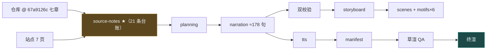

# 策划案：《一群 AI 怎么干活：看板、信箱与各自的桌子》

> 事实源：[../research/source-notes.md](../research/source-notes.md)（信源清单 [../research/sources.toml](../research/sources.toml)）
> 逐字稿 SSOT：[narration.md](./narration.md) · 分镜：[storyboard.md](./storyboard.md)
> 可执行参数：[../pipeline.toml](../pipeline.toml)

## 一、定位

| 项 | 定义 |
|---|---|
| 系列 | Claude Code 通俗全解（独立成片） |
| 平台 / 形态 | B 站 / YouTube 1080p30，代码动画 + 本人克隆音色，无 BGM、无 emoji |
| 时长 | `target_minutes = [13.0, 14.6]`；≈3900 字 |
| 受众 | 普通人：听过「AI 智能体协作」的营销话术，没见过它到底由哪几样朴素的东西拼成 |
| 核心内容 | 多 Agent 平台七章：s12 看板 / s15 队友 / s16 握手 / s17 自治 / s18 各自的桌子 / s19 一句 / s20 收束 |
| 不覆盖 | 外接工具生态细讲（s19 一句+角标）；工作流运行时（main 新增，本系列不涉及） |

**选题独特价值**：「多 Agent」是行业最热的词，拆开却全是朴素物件：一张看板、几个文件信箱、
带编号的握手、各干各的目录。本集让普通人看完能说出那句收束——**机制很多，循环一个**。
这也是整个系列的收官集：系列主线「循环不变」在此兑现终曲。

## 二、叙事策略

**主线问题（P0 抛出、P6 由 s20 标语直接回答）**
> 一个它已经能干很多了。可整个后端的改造，一个注意力盖不住。从「一个它」到「一群它」，
> 每多一样东西都要有人回答四件事：活挂在哪、话从哪走、怎么谈判、谁的桌子。

**贯穿比喻体系：一个工地**
- 看板 = 工地入口的排工序（谁干什么、先干哪个，写在板上不写在心里）。
- 信箱 = 每人门口的收件格（文件做的；读一条划掉一条）。
- 握手 = 派工单（同一编号一式两份；告别也要签字）。
- 桌子 = 各自的工位（同一个仓库，各开各的目录）。
- 外接设备 = 别人家的机器（标准插口，谁造的都行）。

**取舍原则（失衡对策·递进主线）**：七章不是并列导览。s12→s15→s16→s18 四问递进为骨，
s17 收掉「派工的人」，s19 一句带过，**s20 不作章节、作 P6 收束装置**（一整轮七步 + 标语）。

**记忆点节奏（12 个）**

| # | ≈时刻 | 记忆点 | 类型 | 回溯 |
|---|---|---|---|---|
| 1 | 0:30 | 一个人的注意力，盖不住整个后端 | 痛点 | s15 问题 |
| 2 | 1:30 | 大目标变成一个个文件——看板不在脑子里，在硬盘上 | 机制之美 | s12 |
| 3 | 2:15 | 不存在的依赖也算被挡 | 防御性设计 | s12 |
| 4 | 3:30 | 队友不是临时工，干完不发总结信不走 | 对比 | s15 |
| 5 | 4:20 | 信箱就是文件，读一条划掉一条 | 朴素反差 | s15 |
| 6 | 5:30 | 子辈的审批窗，冒泡到父辈的屏幕上 | 机制之美 | s15【三】 |
| 7 | 6:40 | 谈判靠同一个编号：发出去的问和收回来的答是一对 | 机制之美 | s16 |
| 8 | 7:20 | 直接杀线程会留下半拉子文件——告别也要握手 | 工程品味 | s16 |
| 9 | 8:40 | 空了自己看板自己认领，领之前先上锁 | 机制之美 | s17 |
| 10 | 9:40 | 六十秒没等到新活才收工 | 现实感 | s17 |
| 11 | 10:40 | 两个它写同一个文件会互相覆盖——给每人开一张自己的桌子 | 痛点回收 | s18 |
| 12 | 12:40 | 桌上乱着不许删；机制很多，循环一个 | 诚实+主题回收 | s18+s20 |

**证据分级口播义务**：文件锁/十五种消息/冒泡轮询节奏/三向关机/二十七工具/进程级切换/
无固定超时全部【三】带归属句。看板/信箱/编号握手/脏桌不删为【一】可直断。

**理性收尾**：不吹「AI 团队自主进化」，也不贬「不过是文件」。落点——
**一群它，还是那一个循环；多出来的不是智慧，是把协作拆成了看得见的零件。**

## 三、视觉语言

**色彩语义契约**（SSOT [../video/src/design/theme.ts](../video/src/design/theme.ts)）

| 色 | 值 | 语义 |
|---|---|---|
| 陶土橙 `core` | `#D97757` | 领队的循环（系列锚） |
| 赭金 `peer` | `#D9B36B` | **本集己色**：同类——队友环/队友工位（与 core 相距约 23° 的同家族色） |
| 石青 `mech` | `#64C4C0` | 机制（看板/信箱/握手轨/目录抽屉） |
| 警示红 `deny` | `#EF6461` | 被挡/拒绝关机/脏桌拒删 |

★ **N 个队友绝不 N 色**（反枚举最难考验）：所有队友环同色 `peer` 同线宽同节点，
靠**铭牌与位置**区分。领队恒 `core`。

**母题（motifs.tsx，6 个）**
1. **RingHerd**（一群环）：领队环（core）+ N 个相同队友环（peer），铭牌区分。
2. **TaskBoard**（看板）：三态任务卡 + 依赖箭头；完成时下游解锁闪光；认领锁形闪光。
3. **Mailboxes**（信箱行）：JSON 行飞入各自收件文件；读取即划掉（一行淡出）。
4. **HandshakeRail**（握手轨）：请求卡带编号出发停在「等回话」；应答卡凭同号合拢锁扣「咔」。
5. **SeparateDesks**（各开一张桌）：同一仓库底座上长出平行目录抽屉；乱桌抖动拒删。
6. **FullTurn**（一整轮·系列终曲）：七段传送带走 s20 的一轮；每段亮起前几集机制小图标；环居正中。

## 四、幕结构

| 幕 | 目标时长 | 主题 | 叙事要点 | 视觉锚点 |
|---|---|---|---|---|
| P0 | 0:00–1:00 | 一个注意力盖不住 | 系列终端：任务清单溢出一个窗口；「一个它」的极限；抛四问 | RingHerd 前奏（单环） |
| P1 | 1:00–2:50 | 活挂在哪（s12） | 任务=文件五字段；依赖成图完成即解锁；不存在的依赖也算被挡；【三】认领在文件锁内+高水位 | TaskBoard DAG |
| P2 | 2:50–5:30 | 话从哪走（s15） | 临时工 vs 队友（本集重立）；信箱就是文件读一条划一条；领队收信注入；【三】文件锁/十五种消息/权限冒泡/不许孵队友 | Mailboxes + 冒泡上浮 |
| P3 | 5:30–7:40 | 怎么谈判（s16） | 杀线程留半拉子文件→告别要握手；四步+同一编号；类型校验三重对号；计划审批同构；【三】三向关机+拒绝可附原因 | HandshakeRail 全程 |
| P4 | 7:40–10:00 | 自己看板自己认领（s17） | 三段生命周期（干活/歇着/走人）；歇时五秒两看（信箱优先看板其次）；认领三查；60 秒收工；压缩后身份重注入；【三】产品四件套+无固定超时 | IdleLoop 表盘 |
| P5 | 10:00–11:30 | 谁的桌子（s18）+ 一句外接（s19） | 同名文件互覆之痛；同一仓库各开目录；绑定不改状态；★脏桌不删；事件日志可审计；s19 一句+角标（防重名前缀） | SeparateDesks |
| P6 | 11:30–13:55 | 收束装置（s20） | ★七段传送带走一整轮（每段亮前几集机制小图标）；「机制很多，循环一个」回答系列主线；一句话合同；信源卡+渐黑 | FullTurn 终曲 |

## 五、生产管线

## 六、边界与不做的事

1. s19 只给一句+角标（生态细讲是另一类选题）；main 新增章不覆盖。
2. 不复刻站点美术；无 BGM/emoji；活数据纪律（notes §十一）。
3. 【三】必带归属句；教学版与产品差异如实标注（notes 分歧清单 2/3/4）。
4. 口播不出现他集标题与顺序词；「临时工」对照本集内自洽重立。
5. 系列终曲身份只体现在视觉（同一环的最终形态）与 s20 标语，口播不数集数。
