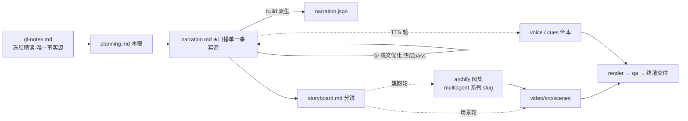

# 策划案：《多 Agent 平台》（v3 · 剧本换代待审 · 终集 · C 型信源 = gl-notes）

> 状态：v3 换代稿（2026-10-07）。旧剧本退场，本稿以 `research/gl-notes.md`（冻结自 docs/research/agent-harness/175 精读）为唯一事实源；标题候选与钩子选定均待人工复核。本轮到分镜为止，不涉 TTS / 渲染 / 场景代码 / archify 建图。**终集纪律**：收尾无下期卡、完结语气；P6 按终集形态设计（全设施收束回看前四层 + 系列金句 + 完结语）。

## 0. 候选新标题（待审核 · series.json 本轮不改，维持《多 Agent 平台：从一个到一群》）

| 候选 | 一句话理由 |
|---|---|
| A《多 Agent 平台：从一个到一群》 | 维持现状；「从一到一群」与 p0-01 钩子同构，零迁移成本 |
| B《多 Agent 平台：机制很多，循环一个》 | 直取课程结语金句（gl-notes §9），终集收束气质最强，与 P6 首尾呼应 |
| C《多 Agent 平台：谁先做，怎么说话，怎么不打架》 | 六个工程问题（§1）的口语浓缩，问题驱动型标题 |
| D《多 Agent 平台：一块任务板和一排收件箱》 | 设施直陈型；朴素感与「缺的不是模型」论点互证，但只覆盖地基两件 |
| E《多 Agent 平台：多开几个之后》 | 直觉反转型，短促有力，但信息量最低 |

## 一、定位表

| 项 | 值 |
|---|---|
| 平台 | B 站 / YouTube 中长视频 |
| 时长目标 | 13.0–14.6 分钟（pipeline.toml 硬约束窗；字数口径 254 字/分 → 3302–3708 字，目标 3400–3600 字） |
| 形态 | AI 配音（story 档待 TTS 轮重配）+ Remotion 代码动画，无真人 |
| 受众 | 不预设工程背景的普通人：见过「让 AI 帮忙干活」也体会过「活太大它接不住」的任何观众 |
| 核心内容范围 | gl-notes §3–§9 七类设施按「设施」归类精讲：任务图与收件箱（§3+§4 地基层）→ 协议（§5）→ 自治与原子认领（§6）→ 隔离与外部工具（§7+§8）→ 综合回合（§9）；五条底层规律收束（§12，取「状态入文件」「协议先于智能」「原子认领」三条主线贯穿，读即消费与命名空间发现随所属设施落地）；三个核心争议只取「空闲超时还是长驻」一口（§12 争议 1），其余压进 P6 边界带过；§11 五组破坏性实验按所属设施各取一个消融 beat |
| 系列位置 | 五集之末（工具与执行 → 规划与协调 → 记忆管理 → 并发 → 多 Agent），机制层层递进的收束集：全设施回看 + 系列金句「机制很多，循环一个」 |

**Logline**：一个 Agent 干不完的大活，直觉答案是「多开几个」，而真正要补的是一块任务板、一排收件箱、一套带编号的握手和几把锁——七件朴素设施，全部挂回同一个循环（gl-notes 一句话定位 + §1）。

## 二、叙事策略

**主线一问一答闭环**：开场抛「活太大，一个 Agent 乱序、遗忘、串行慢，多开几个行不行」→ P1 全景揭示「多开几个几乎全是工程问题：六个朴素问题 + 一份规格表」→ P2–P5 四组设施逐个回答「怎么修、凭什么说修好了」（每组配原型实测消融）→ P6 综合回合把七件设施挂回同一个循环，收束系列总纲「机制很多，循环一个」+ 完结语。

**开篇钩子候选矩阵（★ 待人工复核）**：

| # | 型 | 钩子文本（p0-01） | 吸引力留存逻辑 | 核心主干关联锚点 | 抛出的核心引子 |
|---|---|---|---|---|---|
| H1 | 缺口反转型 ★ | 「这是把一个 AI 变成一支队伍，真正缺的东西：不是更聪明的模型，是一组朴素的设施。」 | 「缺的不是模型」反直觉反转 + 「朴素设施」悬念词，3 秒锁注意力 | gl-notes 一句话定位；P1 六问题规格表立即兑现 | 朴素的设施指什么？为什么聪明帮不上忙？ |
| H2 | 危机反转型 | 「这是 AI 组队最反直觉的真相：难点不在多开几个，在六个没人替你答的工程问题。」 | 直觉（多开=容易）被正面推翻，制造认知失调 | §1「直觉答案几乎全是工程问题」+ §1 六问题 | 六个问题是什么？谁来答？ |
| H3 | 场景痛点型 | 「这是一个 Agent 接不住的活：重构整个后端，它先写调用数据库的接口，写到一半才发现表不存在。」 | 观众可感的工程翻车现场，画面感最强 | §1 场景（乱序/遗忘/串行三硬伤） | 它会怎么翻？翻在哪一步？ |
| H4 | 官方谨慎型 | 「这是 Anthropic 至今默认关闭的能力：让 AI 自己拉起一支队伍。」 | 厂商态度反差（连官方都不敢默认打开） | §10 表（实验特性默认关闭，官方文档【二】级） | 官方在怕什么？关着的是什么？ |
| H5 | 论点直陈型 | 「这是一门工程课用七章证明的事：从一到一群，靠的不是聪明，是设施。」 | 承诺感 + 立场先行，但表述偏平 | §1 七章论证结构 | 七章怎么排？设施是什么？ |

★ 选定 H1（自动选定，待人工复核）。理由：与 gl-notes 一句话定位逐字同构（回溯最硬）；「缺的不是模型是设施」的反差由 P0 问题现场 + P1 规格表立即兑现、不欠债；与 P6「朴素设施全挂回同一个循环」形成首尾闭环，终集气质吻合。H4 留存力最强但把悬念押在产品态度上，而「默认关闭」是 P6 边界护栏素材（【二】级口径负担），提前会透支终幕；H3 的问题现场并入 p0-02 起的乱序/遗忘/慢三硬伤（两全）。

**视觉母题与局部类比纪律**：全片连续感由视觉母题统摄——**同构循环群**（Lead 一个大环 + 队友若干小环，同形同色同线宽，全片反复出场，只换环间连线与高亮设施〔M-001〕），严禁把局部类比升格为贯穿剧场。口播类比只准入 gl-notes 附录 A 登记条目：本集拟用 A1 快递柜（P2 收件箱读即消费，随失配句）、A2 洗衣店两联票据（P3 协议编号配对）、A3 影院选座（P4 原子认领，随「教学版恰恰没有这把锁」边界句）、A4 一次性临时工（P2 子 Agent vs 队友）；每处 1–3 句点亮即切回机制画面，失配边界句随行。

**记忆点节奏**（约每 60–90 秒一个，全部取自 gl-notes §10 实证数字表、§11 实验表与正文机制数字；数字必带基线标尺）：
P2「六个字段、三个状态、两个动作」（§3）→「认领不算完成，解锁只认完成」（§3 走查）→「E1：依赖不存在的陷阱任务被认领了」（§11）→ P3「三道检查各拦一种错」（§5）→「E2：一条关机回复把计划请求改成了已批准」（§11）→「E3：回复被读走，登记表永远停在待定」（§11）→ P4「读文件、查归属、写归属，三步」（§6）→「E4：双方都以为抢到，终值是后写的」（§11）→ P5「删目录前数两样：没提交的文件、没推送的提交」（§7）→「E5：新工具调不到，返回未知工具」（§11）→ P6「工具从八个长到二十七个，循环没改」（§10 表，本集复算【一】级）→「官方默认关闭，token 显著更高」（§10 表【二】级）。

**理性收尾原则**：不贩卖焦虑。P6 落在 gl-notes §13 的护栏上——「多 Agent 更快更好」没有对照实验、worktree 不是沙箱、教学参数不是设计依据——把悬念留在开放争议（§12 争议 1：闲置成本对重建成本的选址，没有普适答案），再以系列金句与完结语收束（终集形态，无下期卡）。

## 三、视觉语言

**色彩语义契约**（沿用系列契约：深色底 `#0E1116`；警示红 `#FF5C5C` = 失败/反例/崩溃路径；确认绿 `#7ED321` = 修复/拦截成功/机制在位对照；金句卡衬线体；公式/方法名只进角标）：

| 概念 | 专属色 | 语义 |
|---|---|---|
| Lead 循环骨架与「循环一个」母题 | 协作金 `#D9B36B`（本集主题色） | 恒定视觉锚：同构循环群——Lead 大环 + 队友小环同形同色同线宽，全片只换环间连线与高亮设施（〔M-001〕） |
| 任务板与任务图 | 青 `#64C4C0` | 任务卡、`blockedBy` 依赖边、pending/in_progress/completed 状态机与解锁脉冲 |
| 通信与协议 | 鸢紫 `#9C90EE` | 收件箱文件、消息行、请求-响应编号、登记表状态机 |
| 自治与施工面 | 霜蓝 `#7FB2E0` | 空闲轮询、认领临界区、worktree 目录条与收尾保护 |
| 外部工具池 | 银灰 `#9AA4B2` + 协作金描边 | MCP 发现-命名-组装；描边金呼应「拼回同一个池、挂回同一个循环」 |

构图纪律：全景坐标图（archify 母图）在换幕时高亮当前设施层；消融实验一律左红右绿同屏（消融定式）；数字一律动态增长条 + 工况角标，禁搬多列大表。视觉母题禁工坊系意象（工坊/车间/作坊/传送带/工序卡/副台/台面/收台/叫号器/排工板/插线口/师傅及同族），一律工程直陈：装置、结构、机件、管线、队列、账本、闸门、挂点、施工面。

## 四、分幕结构表

| 幕 | 目标时间 | 字数预算 | 主题 | 叙事要点（回溯 gl-notes） | 视觉锚点 |
|---|---|---|---|---|---|
| P0 一个干不完 | 0:00–1:30 | ≈400 | 钩子 + 问题现场 | H1 钩子落 p0-01；重构后端场景：先写调用数据库的接口、写到一半发现表不存在（乱序），修路由时认证细节已挤出上下文（遗忘），四件事本可并行（串行慢）（§1）；现成机制不够用：执行清单是内存里的会话清单、不记依赖不记归属（§1 对照 TodoWrite），子 Agent 是一次性临时工、只回传一句结论（§1、附录 A4）；直觉答案「多开几个」几乎全是工程问题：顺序、归属、通信、协商、分工、隔离、扩展（§1 七问） | 冷启动直入：单个金环上任务块拥挤堆叠、溢出跌落；七问标签依次砸下 |
| P1 全景坐标 | 1:30–3:05 | ≈420 | 规格表与「状态入文件」 | 六个朴素问题就是设计规格：谁干什么、怎么说话、关键动作怎么协商、空闲怎么找活、怎么不踩对方的文件、别人的工具怎么接（§1 六问）；课程解法：答案全部写成文件系统上的普通设施——任务是 .tasks/ 目录的 JSON、消息是 .mailboxes/ 的 JSONL、施工面是 worktree、外部工具是统一命名的池条目（§1 末）；Lead 与队友：Lead 提分工等确认后拉人，队友各有系统提示词、消息历史、精简工具集（§4 第一/二件）；主线预告：七件设施最后全部挂回同一个循环（§9） | archify 母图首亮：金色大环居中、六个队友小环环外展开、六类设施以共享文件形态连线；本幕高亮「地基层」 |
| P2 任务板与收件箱 | 3:05–5:55 | ≈640 | 谁干什么、怎么说话 | 任务=JSON 文件六字段，三状态两动作：认领把 pending 推进 in_progress 写归属，完成推到 completed（§3）；依赖检查：blockedBy 里每个都必须 completed，不存在的依赖按被挡处理（§3）；解锁报告是主动推送：完成动作自己带回「接下来谁能开工」（§3）；走查 beat：内容工厂四任务——初稿配图并行、排版依赖两者、发布依赖排版，认领不算完成、排版不被已认领未完成的初稿解锁（§3 走查）；消融 beat：E1 把「不存在视为被挡」改成「忽略」，陷阱任务被认领（§11）；收件箱：每人一个 JSONL 文件，发消息=追加一行，读消息=读整个文件再删掉，快递柜类比+失配句（§4、附录 A1）；持久队友 vs 子 Agent：多轮存活、跨任务保留上下文、收发消息参与协议（§4）；结果与空闲是两个独立事件：任务产出什么 + 这个队友还能接活（§4 main 升级） | 任务卡阵（青）+依赖边生长；内容工厂四卡走查动画；收件箱文件（紫）逐行追加与清空；两角色对比帧 |
| P3 带编号的握手 | 5:55–8:20 | ≈590 | 协议：请求-响应状态机 | 关机与计划审批逼出同一结构：硬杀线程，写一半的文件悬在那里，需要握手（§5）；协议=洗衣店两联票据类比：对上号才交衣、品类相符（§5、附录 A2）；四步链路走查：生成编号 req_000142 登记 pending → 放进收件箱 → 对方收尾回同一编号 → 登记表对号改状态（§5）；三道检查各拦一种错：编号对不上拦误更新、类型对不上拦跨协议、非 pending 拦重复生效（§5）；消融 beat A：E2 拆类型校验，一条关机回复把计划请求改成已批准（§11）；读即消费的耦合坑：查收件箱的工具和主循环各自去读，先读的把消息拿走、协议核对没做（§5）；统一消费入口：先按编号路由协议回复、再交出消息（§5）；消融 beat B：E3 拆统一入口，回复被读走、登记表永远 pending（§11） | 登记表状态机（紫）；四步握手时序动画；三道检查三色闸片；E2/E3 红绿对比帧 |
| P4 自己找活干 | 8:20–10:40 | ≈570 | 自治与原子认领 | 等派活不能扩展：板上十个任务 Lead 手动派十次（§6）；三阶段生命周期：WORK 干活 → IDLE 每 5 秒醒一次，先看收件箱（关机与点名优先）、空了再扫任务板，认领回到 WORK，60 秒没活收摊（§6，教学版取值口径）；收件箱优先于任务板的理由：控制消息点名道姓、公共资源晚一轮没关系（§6）；深水区：两个队友同时看上同一个任务，认领=读文件查归属写归属三步（§6）；影院选座类比+边界句：看见不等于抢到，教学版恰恰没有这把锁（§6、附录 A3）；消融 beat：E4 无锁交错，双方都以为认领成功、终值是后写的（§11）；修法方向：检查与写入一口气做完（临界区），扫描只出候选快照、所有权变更只在锁内（§6 main）；身份保持：上下文压缩可能把队友历史压成摘要，过短就重新注入身份信息（§6） | 轮询节拍器（霜蓝）；任务板扫描-认领闭环；双队友竞争同卡的交错时序；E4 红绿对比帧 |
| P5 各改各的目录 | 10:40–12:35 | ≈560 | 隔离与外部工具 | 新坏法：同一目录都改 config.py、互相覆盖、分不清谁的改动（§7）；worktree：一个仓库同时铺开多个工作目录，各挂各的分支（§7）；任务级绑定：建目录、建分支、把目录名写进任务文件；绑定不改任务状态，队友认领时自然领走带目录的任务（§7）；收尾保护比创建更值得学：删前数两样——未提交的文件数、未推送的提交数，非零就拒绝删；丢弃要显式、留着等人工审查合并（§7）；任务完成与目录清理是两件独立的事（§7）；边界说死：worktree 只分开 Git 工作目录与分支，不是安全沙箱（§7——护栏句，P6 收束复现）；外部工具：接新服务不该再手写一套定义（§8）；MCP 三步：连接拿清单、统一命名 mcp__服务__工具防顶名、每轮拼进同一个池（§8）；命名规则：非法字符替换成下划线、撞名报错、超长拒绝（§8）；连带动作：工具池变了，依赖它的缓存必须作废（§8）；消融 beat：E5 沿用旧池调新工具，返回未知工具（§11） | worktree 目录条（霜蓝）分叉生长与收尾审计；工具池（银灰+金描边）拼装动画；E5 红绿对比帧 |
| P6 循环一个 | 12:35–14:05 | ≈400 | 综合回合与终幕 | 终点章把全部机制放回同一个可运行系统，价值不在新机制在位置感（§9）；挂点表走查：输入后钩子先看、调模型前队列与记忆注入、执行前权限拦截、执行后告警、无调用时收尾——循环周围变厚，循环还是那四句：调模型、看有没有工具调用、执行、回喂（§9）；两层计划：会话内轻量清单 vs 跨会话可依赖可认领的任务图（§9）；两种委派两道门：要结论用一次性子 Agent、要并肩用持久队友（§9）；工具从八个长到二十七个，循环零改动（§10 表+§11 复算【一】级）；系列回看：给它工具、给它规划、给它记忆、让它并发、再让它组队——机制层层递进，循环一个（§9 结语「机制很多，循环一个」）；边界护栏：多 Agent 更快更好没有对照实验、官方只说 token 显著更高并默认关闭（§13.1、§10【二】级）、worktree 不是沙箱（§13.2）、教学参数不是设计依据（§13.5）；开放争议一口：空闲队友超时退出还是长驻等待，是闲置成本对重建成本的选址，没有普适答案（§12 争议 1）；完结语（无下期卡） | 挂点表全景（金环+六设施点亮）；五层机制栈回看（视觉层系列身份卡）；金句卡「机制很多，循环一个」；边界护栏卡；完结卡收黑 |

## 五、生产管线图

```mermaid
flowchart LR
    A[gl-notes.md<br/>冻结精读·唯一事实源] --> B[planning.md 本稿]
    B --> C[narration.md ★口播单一事实源]
    C -->|build 派生| C2[narration.json]
    C -->|④ 真实性+易懂性| C
    C -->|⑤ 成文优化 四层pass| C
    C --> D[storyboard.md 分镜]
    D -.->|场景轮| E[video/src/scenes]
    D -.->|建图轮| F[archify 图集<br/>multiagent 系列 slug]
    C -.->|TTS 轮| G[voice / cues 台本]
    E --> H[render → qa → 终渲交付]
    F --> E
    G --> H
```

本轮产物止于 D（虚线节点为后续轮次，本轮不动）。

## 六、边界与不做的事

**系列递进边界（照抄口径卡 ep⑤ 终集清单）**：全设施收束回看前四层（工具与执行 / 规划与协调 / 记忆管理 / 并发——口播用机制动词化列举，不出现他集标题与顺序词，视觉层用系列身份卡）；「多 Agent 更优」「worktree 是安全隔离」「教学参数当设计依据」三类不可外推断言按护栏卡处理——材料无对照实验（gl-notes §13 明确清单），只以「材料没有证明的事」护栏形态出现，不作正面断言。「循环还是那一个」是本集与系列总纲的呼应点，机制层层递进的收束句可用（课程结语原文形态，gl-notes §9）。

**开场装置衔接（场景层已有，剧本只做衔接）**：系列统一片头装置 leadInSec=23.5（705 帧 @30fps），口播 12 帧起播；片头三句口播固定在 narration SSOT 之外，剧本任何位置不复述、不改写；P0 冷启动直入本集钩子（不重复系列介绍、不自我介绍）；字数预算 3400–3600 不含开场。

**口播红线**：禁工坊系词汇及同族意象（工坊/车间/作坊/传送带/工序卡/副台/台面/收台/叫号器/排工板/插线口/师傅）；禁顺序词（上一集/上集/上期/下一集/下集/第 N 集/前一集/本系列），**终集无下期卡**，收尾用完结语气不出现「下期」；观众可见层零信源站标识（不出现课程/站点名/章号；两轨引用一律「轨名+目录名」只在 research 层，归属句用「拆过 Claude Code 源码的作者」句式）；【三】级断言前 3 句内必带归属句；活数据不进口播；教学参数（空闲 5 秒/超时 60 秒/10 轮上限）必带「教学版取值」口径；官方建议数字（3–5 队友/5–6 任务/默认关闭）必带「官方文档」口径；Harness 不翻译（口播英文例外清单 = Claude Code + Harness）；「上下文」首现带白话句；英文方法名（spawn_teammate / request_id / blockedBy / mcp__服务__工具 / TOCTOU 等）进角标不口播。

**本轮不做的事**：不跑 TTS、不动场景代码与 series.json / pipeline.toml / video/**、不建 archify 图（storyboard 只写图意与预定 slug，不挂覆盖门 cue、不写覆盖门字面标注）；三个核心争议只取争议 1 一口，争议 2（组队要不要先过人工闸门）、争议 3（审批拦在协议层还是执行层）压进 P3 一句带过，均不展开——深度优先，砍掉的收尾一句话带过；main 轨 workflow_runtime / goal_loop 两章不在本集信源（chapter-map ⑤ 部分对照仅 s10/s13/s14/s15），不进入；真实产品侧细节（15 种消息类型、三向关机、六种传输、缓存 TTL 5 分钟等【三】/【二】级素材）只作 P6 收束的对照彩蛋，不进 P2–P5 主线；BGM 留空轨；论文外观点不进口播。
