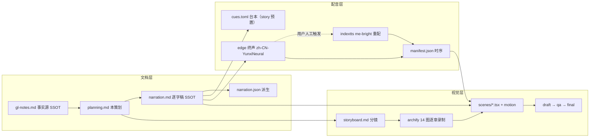

# 策划案 · 《多 Agent 平台：七件设施，一条走廊》（ep5 完全重制）

> 事实源：[research/gl-notes.md](../research/gl-notes.md)（C 型 GL 冻结快照，正文即 docs 精读 175；
> 下文「§N」均指其正文小节，附录 A=类比登记表、附录 B=复算与穿透记录）。
> 系列视觉契约与下期卡约束见 [series.json](../../../series.json)；建模定式标〔M-xxx〕。

## 1. 定位表

| 维度 | 取值 |
|---|---|
| 平台 | B 站 / YouTube 中长视频（系列第 5 集·终集） |
| 时长目标 | **[13.0, 14.6] 分钟**（硬窗；本集 edge 终声实测口径 **278 字/分**（ep3 重制 edge 草声锚，pipeline.toml 已落）→ 可用字数 ≈ 3,740） |
| 形态 | AI 配音（**edge 终声** zh-CN-YunxiNeural；indextts me-bright 重配待用户人工触发）+ Remotion 代码动画 + archify 逐章回放；无真人 |
| 受众 | 不预设 ML 背景的普通人；看过系列前四集更佳但非必需 |
| 核心范围 | gl-notes §1–§10 主线：问题（§1–§2）→ 任务墙（§3+s17 认领）→ 递话口（§4）→ 回执簿与值班钟（§5+§6）→ 门牌房（§7）→ 认证插座（§8）→ 环形走廊终考（§9–§10）；§11 六组破坏实验全数入片、§12 规律收束、§13 边界护栏。**旧版（v2）的一切叙事结构、幕切轴与类比词汇不继承** |

## 2. 叙事策略

**主线问题（单问，全片闭环）**：活多到要一班组人，**计划放在谁手里？**——P0 钩子后正面立问（只抛不答）→ 六件设施逐一给出局部答案（墙/口/簿/钟/房/插座）→ P6 **第七件设施揭晓**（走廊）+ 主问题显式回收（「谁都不持有——墙持有、簿持有、账本持有；走廊只是转」）。标题下半句「一条走廊」的悬念在 P0 埋（「外加一条谁都得走的走廊」）、P6 兑现。

**人机协同钩子候选矩阵（RSI-039，策划期必出）**：

| # | 钩子文本（p0-01 起） | 留存逻辑 | 主干关联锚点 | 抛出的引子 |
|---|---|---|---|---|
| 1 ★ | 「这是一栋通宵亮灯的小楼——里面每一位师傅手艺都是顶尖的，却谁也记不住昨天。」 | 反直觉矛盾：顶尖手艺 × 零记忆，3 秒制造「凭什么还能协作」认知缺口 | §1 无状态模型＋上下文窗口（系列既定失忆引擎，P6 收官回收最强） | 七样公共设施＋一条走廊；引出「谁持有计划」 |
| 2 | 「这是一个不用开会、不用记名字的施工队：大计划不放在任何人脑子里，全挂在墙上。」 | 悬念：计划挂在墙上？直接踩中主线问题 | §3 任务板落盘、跨会话恢复 | 墙上有什么、怎么防止乱占 |
| 3 | 「这不是一群更聪明的 AI——是一套给失忆者准备的公共制度。」 | 否定式钩：先破「换大脑」预期 | §12 规律五＋§9 收官断言 | 全片数七样制度、最后拆给你看 |
| 4 | 「这是一场拆给你看的协作：七样公共设施，每一样都当着你的面拆掉一次。」 | 危机型/实验预告：承诺「当夜出乱子」的破坏现场 | §11 破坏实验（六组全入片） | 「机制→拆掉→红灯」副线 |
| 5 | 「这是同一张任务卡的一生：从落盘到销账，它要过六道制度。」 | 旅程型：单对象一生，观众天然跟到底 | §2 六条设计规格（生命周期序） | 跟着 task_0002 走完全程 |

★ 选定：**钩子 1**（2026-10-02 计划期随制作方案获用户批准；Stage ③ 落稿时可复核）。理由：与系列失忆引擎直连（终集回收最强）；画面第一秒即「深夜亮灯小楼」高反差意象（开篇首镜视听合力）；第 2 拍自然接钩子 2 的「计划挂在墙上」与钩子 4 的「拆给你看」预告，三线合一。

**视觉母题统摄 + 一物一喻继承**（对齐 gl-notes 附录 A）：
- 全片连续感由**楼体剖面母题**统摄：一栋两层小楼——下层公共设施层（任务墙/递话口/回执簿/值班钟/认证插座，赭金）、上层私人房层（门牌房，深赭），楼心一条 **core 橙环形走廊**贯穿（〔M-001 恒定视觉锚〕：锁死描边色与线宽，全片同形出场只换标签，「循环不变」系列主线的本集化身）。零 3D、零 Lottie（ISSUE-202 裁定沿用）。
- 局部类比**一物一喻继承附录 A**（七行登记表），不另造新喻；每喻 1–3 句点亮直觉即切回机制画面，**失配拦截句随行**（口播或字幕补位）；零类比直讲合法。
- **旧版禁用词表**（差异化纪律，④ 校验对 narration.md 逐词 grep）：排工板 / 收件格 / 派工单 / 班次 / 隔间 / 插口 / 传送带 / 从一个到一群 / 一个到一群。兄弟集域词避让：急诊 / 病历 / 接诊（ep1 域）；视野错位 / 修正手法 / 焦距（ep2 域）；草稿纸 / 卡片册 / 台面 / 登记簿（ep3 域）；工坊 / 清洗槽 / 滚筒 / 钟盘（ep4 域）。「师傅」为系列通用角色词（四兄弟集共用），非域词，沿用。
- **去站点化词表**（规则 7，同批 grep）：课程 / learn.shareai / Learn Claude Code / shareAI / s12–s20 章号；信源指称一律「这个开源项目」；讲义口径说「讲义」不进口播。

**记忆点节奏**（约每 55–70 秒一个，全部回溯事实源）：
① 钩子矛盾句＋「顶尖手艺却记不住昨天」（§1）→ ② 主问题「计划放在谁手里？——谁都不放，挂在墙上」（§1/§3）→ ③ 「活挂在墙上，不挂在谁的脑子里——进程死了，墙还在」（§3 落盘）→ ④ fail-closed「引用一个不存在的编号，按还没完成处理；宁可不放行，也不崩溃」（§3）→ ⑤ t5race「守卫挡得住明抢，挡不住同一瞬间」（§6/§11）→ ⑥ 「一封信，一辈子只被读一次」（§4 消费式收信）→ ⑦ 「生不了下属，靠的不是拦，是没发」（§4 禁嵌套=工具单边界）→ ⑧ 「传话不看脸，看编号；销账只认它自己那张回执」（§5 三道核验）→ ⑨ B4 翻烧饼「错类销错单，重复翻烧饼」（§11）→ ⑩ 「指令，永远排在发现的活前面」（§6 先口后墙）→ ⑪ 「任务管目标，房管地盘，一个房号拴住两样」＋「有改动，拒拆」（§7）→ ⑫ 「进了这栋楼，都得挂楼牌」（§8 前缀防撞）→ ⑬ 「图新鲜，就不吃缓存」（§8 弃缓存代价）→ ⑭ 「信纸面上的单子，不信嘴上说的停」（§9 判据）→ ⑮ 收官「谁都不持有——墙持有、簿持有、账本持有；走廊只是转」＋「机制很多，循环一个」（§9 引语）。

**口播数字预算**（全局纪律：每个记忆点窗口口播数字 ≤2 个，其余落画面字）：P0 允许结构性计数（一栋楼/六件/第七件，本身即叙事骨架非实证数字）；P1「六个字段」1 锚＋三态两动作（机制骨架计数，④ 裁定放行）；P2 零（十五种消息类型=【三】落画面字）；P3「五秒/六十秒（十二拍）」2 锚＋「三道核验」1 锚；P4 零（1–64 位规则落画面字）；P5 零（两个服务同名 search 落画面）；P6「27 件内置工具」「两千一百三十行」2 锚＋「两种身份」1 锚。压缩三线（200,000/30,000/50,000）、输出上限（8,000→16,000）、续写 2 次一律**只落数字卡画面字**，口播不带（token 字样全片不出口播）。

**术语白话化表**（英文机制名一律不上口播、只上画面字；口播用 gl-notes 现成白话）：

| 画面角标（英文） | 口播白话 |
|---|---|
| task / Task / claim_task | 任务卡 / 认领（写名占住） |
| `.tasks/{id}.json` | 一张卡一个文件 |
| blockedBy / dependencies | 前置清单 |
| `.mailboxes/*.jsonl` | 门上的递话口（一行一条的文件） |
| spawn_teammate / teammate | 招一位常驻队友（后台线程） |
| subagent / task（一次性） | 一次性帮工 |
| request_id / protocol | 单号 / 回执 |
| shutdown_request → response | 关机请求 → 同意回执 |
| idle poll（5s） | 值班钟每五秒看一眼 |
| compaction / 身份重注入 | 对话被压缩 / 楼替他挂回工牌 |
| git worktree / `.worktrees/` | 门牌房（各改各的目录） |
| `mcp__{server}__{tool}` | 楼牌前缀（服务名__工具名） |
| MCP / tools·list＋call | 外接插座（报清单＋点名） |
| tool_use block / stop_reason | 工具调用块 / 嘴上说的停（不采信） |
| hooks（PreToolUse / Stop…） | 挂在循环固定位置的检查（门前 / 收尾） |
| lead | 队长 |

**理性收尾**：不贩卖焦虑；收官断言照抄 §9（复杂性是成熟 harness 的复杂性）；边界卡把悬念留在开放问题（并发正确性未证明——P1 撞墙即活证据），不裁决。

## 3. 视觉语言

**色彩语义契约**（theme.ts 已落种子，Stage ⑥⑧ 严格用色）：

| 色 | 值 | 语义（全片唯一） |
|---|---|---|
| core 橙 | `#D97757` | **环形走廊＝工作循环**（系列锚〔M-001〕，恒定描边与线宽） |
| 赭金 | `#D9B36B` | **七件设施·公共制度**（本集维度色，accents 登记色） |
| 深赭 | `#A8823F` | 私人房层 / 账本线 / 设施深化态（**仅装饰线与图形填充，不作正文文本色**——对 bg 对比不足 4.5:1，`qa --check-theme` 实测把关） |
| deny 红 | `#FF5C5C` | 破坏实验侧 / 守卫拦截 / 拒绝（正反同屏警示侧） |
| 确认绿 | `#7ED321` | 守卫在位 / 拦截成功（正反同屏确认侧） |
| 母题装饰底 | `#10151d` / `#04060a` / `#05070a` | 楼体面色（P0/P6 共用常量 `LODGE_INK`）/ P0 开场黑罩 / P6 6-J 夜幕——装饰底色不占语义槽，仅登记可追溯 |
| 灰白系 | text/dim/panel 底座 | 楼体结构 / 无状态个体（失忆的师傅） |

**构图纪律**：空间隐喻不逆旁白〔X-001〕——「公共制度层」恒在楼下层、「私人房间层」恒在楼上层（命题即「先有公共制度、再分私人地盘」）；正反同屏消融恒**左坏右好**（deny 红↔确认绿）；任务墙恒为纵向墙面、走廊恒为水平环线。公式/档位数字只作画面角标彩蛋，不进口播主线。

**C 型五构件映射契约**（gl-notes 静态构件 → 视频动态装置）：①全景图（§2 collab-panorama）＝**Map-First Anchor**（P6 终考装置）；②走查实例（§3–§9 各节）＝**Animated State Trace**（具体输入逐步上屏）；③破坏实验（§11）＝**正反同屏消融**（六组全入片，红绿双轨终端复现窗）；④数字表（§10）＝**useCount 动态标尺**（27 工具 / 2130 行数字卡，双档口径色）；⑤边界（§13）＝**护栏卡**（证明了什么 / 没证明什么）。

**archify 图集预算（14 图 · 6 型 · ~60 章 · 全屏独占；slug 均全新命名，定稿前断言不命中任何他集 storyboard 引用资产）**：

| # | 图（slug） | 型 | 锚幕 | 内容（回溯） |
|---|---|---|---|---|
| 1 | `seven-artifacts` | architecture | P0 | 楼体剖面总图：下层五设施＋上层门牌房＋楼心走廊占位，「七件套＋一条循环」骨架（§2） |
| 2 | `task-card-anatomy` | state | P1 | 六字段卡解剖 / 三态两动作 / 写名占住（§3） |
| 3 | `dependency-failclosed` | workflow | P1 | 前置守卫 fail-closed＋完成即播报解锁（§3 走查） |
| 4 | `claim-guards-break` | dataflow | P1 | 认领三守卫＋B1 / B2 / B2v 消融章（正反同屏，§3/§6/§11） |
| 5 | `claim-race-window` | sequence | P1 | t5race 交错窗口：两条检查线交错、落笔重叠（§6/§11） |
| 6 | `mailslot-consume` | workflow | P2 | 追加一行 / 整摞取走 / 只看不取＋B3 章（§4/§11） |
| 7 | `receipt-ledger` | sequence | P3 | 单号往返 / 三道核验＋B4 章（§5/§11） |
| 8 | `receipt-fsm` | state | P3 | pending→approved/rejected 一套状态机两类协议（§5） |
| 9 | `duty-clock-loop` | lifecycle | P3 | 三态节拍 / 先口后墙 / 超时收工＋B5 章＋身份工牌重注入（§6/§11） |
| 10 | `room-ledger-bind` | architecture | P4 | 中央账本—门牌房拓扑 / 绑定只加房号不改状态 / 名字校验（§7） |
| 11 | `room-teardown` | lifecycle | P4 | 拆房三出口 / 有改动拒拆 / 审计日志（§7） |
| 12 | `socket-pool` | dataflow | P5 | 连接＋发现 / 前缀挂牌 / 每轮重组 / 旧清单叫空（§8） |
| 13 | `collab-panorama`（复用 175 产物） | dataflow | P6 | 走廊站点图：十二类组件归位＋两种身份入场（§2/§9；**archify 3.0 产物无 guided-views，录制前回填本集 views 章节并过兼容层预检**） |
| 14 | `five-layer-dependency`（复用） | architecture | P0 一闪＋P6 全亮 | 五层栈终态（系列身份卡底图） |

章 id 全局唯一登记表在 storyboard 定稿前置；cue 预算 ≥ 41（3.0/分 × 13.7 分），锚定率门 ≥ 0.30。

**全貌坐标装置（Map-First 轻量常驻，不占 14 图名额）**：楼体剖面缩略几何（下层设施带＋上层房带＋走廊环）P0 首亮全图；**每次换幕高亮当前设施并压暗其余**；P6 走廊环点亮收束（第七件设施揭晓的视觉同步）。登记进 §4 各幕视觉锚点列与 storyboard 换幕镜清单。

## 4. 分幕结构表

| 幕 | 目标时间 | 字数 | 主题 | 叙事要点（回溯 gl-notes） | 视觉锚点 |
|---|---|---|---|---|---|
| P0 | 1.25 分 | ~345 | 失忆的楼 | 钩子（★矩阵 1）：通宵小楼＋顶尖手艺却记不住昨天（§1 工作循环/上下文窗口）；单干为什么塌：四模块细节放不进一份对话记忆、写到一半回头补表（§1）；旧待办三宗罪：换会话就没 / 别人看不见 / 没有先后依赖（§1）；**主线问题正面立起**：计划放在谁手里？——不是请更聪明的师傅，是给失忆的师傅们换一套房子（§1 白话主线）；七件套悬念预告（「外加一条谁都得走的走廊」留白，§2）；走廊 core 橙定妆「从今晚亮灯到天亮，一步没改过」 | 图1 楼体总图；**坐标装置首亮全图**；图14 五层一闪；走廊〔M-001〕定妆 |
| P1 | 2.2 分 | ~610 | 任务墙 | 拆单落盘：大目标拆四张卡、一张卡一个文件、六字段（§3）；三态两动作：认领写名 / 完成播报（§3）；「活挂在墙上，不挂在谁的脑子里」（§3）；前置守卫 fail-closed：引用不存在的编号按未完成处理（§3）；完成即播报：解锁写接口、写文档（§3 走查 Animated State Trace）；认领三条件：待办∧无主∧前置全清（§3/§6）；**演示① B1**（拆依赖→盖楼在打地基 pending 时被领走）；**演示② B2+B2v**（拆无主→占坑被顶 / 拆状态→完成品被重开）；**演示③ t5race**（同瞬间双认领、后写盖前写——教学版自认无锁【二】、据课程分析产品上双重文件锁【三】归属） | 图2 卡解剖；图3 守卫＋播报；图4 消融（左坏右好）；图5 交错窗口；坐标装置高亮任务墙 |
| P2 | 1.9 分 | ~530 | 递话口 | 一次性帮工 vs 常驻队友：帮工干完就走中间没法递话；队友=后台线程、自有系统提示与精简工具（§4）；递话口机制：发信=追加一行、收信=整摞取走清空（消费式）＋只看不取的探口（§4）；「一封信一辈子只被读一次」（§4）；楼替人盯口：键盘与异步消息汇入同一队列、谁先到谁触发（§4）；边界写在工具单上：没有招队友、没有开新活——「生不了下属，靠的不是拦，是没发」（§4 禁嵌套）；**演示④ B3**（拆消费语义→同一封信被读两遍）；官方对照：实验性、默认关、坏条目报错移除【官】（§4） | 图6 递话口＋B3 章；队列汇流装置；官方引语卡；坐标装置高亮递话口 |
| P3 | 2.1 分 | ~585 | 回执簿与值班钟 | 两个场景一个结构：关机不能直接杀（留半截文件）/ 大动作先报备（§5）；请求—回执—单号关联（§5）；三道核验：找单 / 验型 / 看未决，缺一不可（§5）；「传话不看脸，看编号」（§5）；**演示⑤ B4**（错类销错单→重复翻烧饼→终态 rejected）；诚实边界伏笔：教学版交计划并不真停、只发了一封信（§5，P6 合口）；值班钟三态：干活 / 空闲 / 收工（§6）；每五秒一次、先口后墙——「指令永远排在发现的活前面」（§6）；六十秒十二拍没等到活就收工、留最后一条结论（§6）；**演示⑥ B5**（拆超时→t=600 不停）；身份也会丢：对话被压缩过短→楼替他挂回工牌（§6） | 图7 单号往返＋B4 章；图8 状态机；图9 值班钟＋B5 章＋工牌重注入；坐标装置高亮回执簿+值班钟 |
| P4 | 1.65 分 | ~460 | 门牌房 | 事故：同目录改同一文件、后写盖先写、回滚不干净（§7）；版本控制三句话：仓库=中央账本 / 提交=记账 / 分支=各改各的线（§7）；门牌房=同一账本挂出的多个工作目录（§7）；绑定纪律：只加房号字段、不改状态——活还是待办等人领（§7）；开房前名字过校验、防路径逃逸（§7）；认领即进房＋**诚实记录**：钉点版自取认领只写路径提醒、目录不自动切（§7 走查，P6 修复伏笔）；拆房守卫：默认不拆 / 有改动拒拆 / 明说丢弃才强删连分支 / 保留等审（§7）；「有改动，拒拆」；事件日志一行一记、可审计（§7）；据课程分析：产品侧任务与工作树是两套独立系统【三】（§7） | 图10 账本—门牌房拓扑；图11 拆房三出口；坐标装置高亮门牌房（上层） |
| P5 | 1.55 分 | ~430 | 认证插座 | 痛点：内部工单 / 部署 / 知识库逐个重写接入不现实（§8）；两步插座：连接＋发现——报出工具清单即入池（§8）；挂牌命名：`服务名__工具名` 前缀、白名单外字符换下划线——两个服务都有 search 也不撞（§8）；「进了这栋楼，都得挂楼牌」（§8）；动态池代价：亲手拆掉提示缓存——旧清单叫空、每轮重组、连接即再组（§8）；「图新鲜，就不吃缓存」（§8）；铭牌只标注不拦截：「只读 / 破坏性」是文字不是保险丝（§8，门在收官章） | 图12 插座池；旧清单叫空（deny「查无此号」）；铭牌角标；坐标装置高亮认证插座 |
| P6 | 2.8 分 | ~780 | 环形走廊·终考 | **第七件设施揭晓＝走廊**（标题回收）；全组最重要一张表：每个机制住在循环哪个位置（§2/§9）；**终考装置**：走廊站点图先空格三秒让观众自填→逐格点亮（输入钩子→通知注入→压缩→组装→模型→判据→权限→三分发→回填→停止钩子，§9）；判据不变：看的是回答里有没有工具调用块、不是嘴上说的停（§9）；集成版五增量：权限成钩子 / **计划门真停（P3 伏笔合口）** / 四层压缩管线 / 失败恢复梯子 / **自取认领切目录（P4 缺口合口）**（§9）；两种身份入场：一条消息或一个工具，循环零分支（§9 费曼遗产句）；数字卡：27 件内置工具 / 2130 行（教学版实测口径，双档色；§10/附录B）；收官断言照抄：复杂性不是另一个大脑，是成熟 harness 的复杂性；机制很多，循环一个（§9）；**边界卡**：未证明并发正确性（P1 撞墙即活证据）/ 产品内部只有据课程分析一层转述（§13）；主问题回收＋五层全亮＋完结语气（终集无下期卡） | 图13 走廊站点图（空格→点亮）；真门急停（走廊冻结）；恢复梯子四级；数字卡（useCount）；边界护栏卡；图14 五层全亮＋系列身份卡；渐黑＋完结语（FinaleTail） |

字数合计 3,740 ± 60 → 13.45 分（窗内）；句均 20–24 字 → 约 156–187 句；句内宁长勿短（≤35 字）。

## 5. 生产管线图

```mermaid
flowchart LR
    subgraph 文档层
        A[gl-notes.md 事实源 SSOT] --> B[planning.md 本策划]
        B --> C[narration.md 逐字稿 SSOT]
        C --> D[narration.json 派生]
    end
    subgraph 配音层
        C --> E[cues.toml 台本（story 预置）]
        C --> F[edge 终声 zh-CN-YunxiNeural]
        F -.用户人工触发.-> F2[indextts me-bright 重配]
        F --> G[manifest.json 时序]
        F2 --> G
    end
    subgraph 视觉层
        B --> H[storyboard.md 分镜]
        H --> I[archify 14 图逐章录制]
        C --> J[scenes/*.tsx + motion]
        G --> J
        I --> J
        J --> K[draft → qa → final]
    end
```

## 6. 边界与不做的事

- BGM 留空轨（系列无 BGM 惯例；终渲不含音乐轨）。
- **单位与数字口径纪律**：教学版档位口播一律说「字」；压缩三线（200,000/30,000/50,000）与输出上限（8,000→16,000）、续写 2 次只落数字卡画面字，**token 字样全片不出口播**；行数用仓库实测 **2130**（站点页头 1708 为讲义口径不进口播，附录 B）；「十二拍」为 60÷5 推导口径，口播说「六十秒、十二拍」并落画面字注推导。
- gl-notes 之外的观点不进口播；【三】级断言前 3 句内必出归属句（「据对这个开源项目闭源实现的逆向分析」），画面角标同步；【官】级带「官方文档」归属；【二】级课程自述带「这套开源教学自己注明」。
- 活数据不进口播；产品侧延迟量级（~1 秒探测 / ~500 毫秒轮询 / 1 秒防抖 / 15 种消息类型）一律【三】归属＋画面字。
- 旧版 v2 的叙事结构、幕命名、类比词汇一律不继承（§2 禁用词表，④ 校验对 narration.md 逐词 grep：旧版词表＋兄弟集域词＋去站点化词表）；旧 13 图资产零引用留存仓中不清理。
- 后台任务与定时调度两章（s13/s14）不进入本片机制面（属并发主题，已由系列另集覆盖——口播零提及，仅 P6 站点图「通知注入 / 定时注入」格画面字带过）；高并发锁与分布式、成本经济学、产品内部实现细节不在范围（§13 非目标，P6 边界卡一句带过）。
- MIT 许可字节归档已随集落地（source-archive/67a9126/），口播指称信源一律「这个开源项目」（去站点化，规则 7）。
