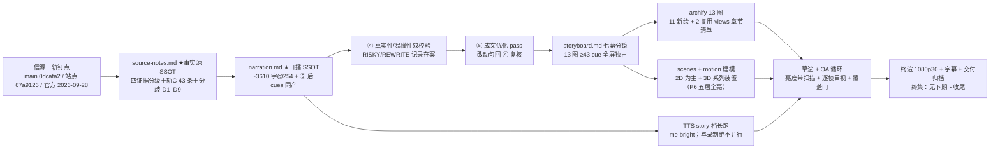

# Stage ② 策划案 ——《多 Agent 平台：从一个到一群》（题已定，三处已同步）

> 事实源（一切口播断言的回溯终点）：[research/source-notes.md](../research/source-notes.md)（B 型·单一事实源，钉 站点轨 67a9126（本集七章 s12/s15/s16/s17/s18/s19/s20）／官方文档 code.claude.com@2026-09-28；main@0dcafa2 仅作「演进注记」对照，凡引以本钉为准）。
> 叙事蓝本：[175 精读章](../../../../../docs/research/agent-harness/175-claude-code-multi-agent-platform.md)（M1–M7 机制叙事＋轨 C 对照 8 条硬校准＋批判边界五条）。类比 SSOT：[170 §2 角色台账](../../../../../docs/research/agent-harness/170-claude-code-harness-overview.md)（通宵工坊剧场·全篇单射，**零新增角色**；制作期输入 `.temp/learn-cc-lab/analogy-plan.md` 与 `.temp/learn-cc-lab/dims/multiagent-brief.md` 不作持久引用）。
> 六节节名按 vibe-video skill 的 references/02-planning.md 规格；第 0 节为本次重制的拟题决策附加节。视觉契约落点：[theme.ts](../video/src/design/theme.ts)（本集维度色金已落位 seed）；系列装置数据源：[series-layers.json](../video/src/series-layers.json)（**next=null——终集无下期卡**）；可执行参数：[pipeline.toml](../pipeline.toml)（chars_per_min=254）。

## 0. 标题定案

**直录**：`series.json`／`series-layers.json`／175 章标题三处已锁定的既有题《多 Agent 平台：从一个到一群》——本集不重议。理由：① 五维重制的维度名前缀已就位（多 Agent 平台＝第五维），副题「从一个到一群」六字、数字对仗「一/一」，合「维度名：≤10 字机制判断句」的系列套式；② 与 ep1「一个循环，三层装置」的数字对仗句式同构，五集成套；③ 标题即主线问题的答案预告（一个→一群），P0 主问题字卡「一个人」与标题形成问答呼应。**同步落点**：P6 身份卡硬编码按「：」后主段「从一个到一群」对账（规则 8；本集无下期卡，规则 8 只检本集身份卡）；`cardSub`「多 Agent 平台 · 协作」不动。

## 1. 定位表

| 项 | 值 |
| --- | --- |
| 平台 | B 站 / YouTube 中长视频 |
| 时长目标 | 硬窗 [13.0, 14.6] 分；**本系列实测口径 254 字/分**（ep1 story 档 CP1 校准，pipeline.toml 已生效）→ 规划按 **3,600 字 ≈ 14.2 分** 定位（浮动带 [3540, 3660]，v1 实落 3,610）。风险预案：manifest 实测若破窗，按「补内容不注水」扩写——优先序＝P2 官方对照补段（轨C #20 来源标注/不可代批、#21 投递前审查，素材已在 notes）／P4 事件日志句（§五·机制 7）；反向超窗则整句删（候选＝p2-10 探格／p3-15 领班不派活） |
| 形态 | AI 配音（story 档＋克隆音色 me-bright，台本 cues 待 Stage ⑤ 后同产）＋ Remotion 代码动画（2D 为主＋3D 系列装置）＋ archify 13 图（11 新绘＋2 复用）全屏独占逐章回放；无真人 |
| 受众 | 不预设背景的工程师观众：单 Agent 用得熟、见过「多开几个窗口各跑一个」的土法，但没想过一群 Agent 要共用什么底座的人 |
| 核心范围 | 七章主线机制全入片：任务图 M1／收件格＋派工单 M2+M3（合并一幕）/ 班次 M4／隔间 M5／插口 M6／综合收束 M7（兼系列终章）；**轨 C 八条校准全部口播落位**（§2 落位表）；「计划门三拍」（s16 自陈无门→s20 真门→官方产品自动批）作本集辨识度最高的叙事装置；收束双锚＝「两种身份入场」（费曼遗产句）＋「机制很多，循环一个」（系列总收束句） |
| 明确砍掉 | main 轨演进注记全量（双层锁原子认领／环检测／陈旧审批作废／人走活退回／拆归宿主——正片零出现）；【三】深水细节只留两条带归属（权限冒泡五步／副台命名渐变），15 种消息类型、28 小时超时、缓存断点卡位、claimTask 双重锁等一律不进口播；OAuth／六传输／Channel 反向通知（插口幕一句不带）；任务系统生产版对照（9 字段、highwatermark、ID 方案）；subagent 30 轮／messages 窗口条数等漂移常数（活数据纪律）；「缓存三层说」只讲教学版取舍 |

## 2. 叙事策略

**剧场（单一世界观，全片唯一）**：通宵不打烊的工坊——模型是手很快但从不记事的师傅，harness 是工坊本身。本集**零新增角色**：排工板（任务图）、收件格（邮箱）、派工单（协议）、班次（自治队友）、隔间（worktree）、标准插口（MCP）全部沿用 170 §2 台账单射；三条防撞规则原文有效（「桌子」禁用、四个帮手不混用、三类卡片不同名）；类比每处 1–3 句即止、只承担结构同构不承担性能等同。

**主线问题（钩子→悬念→回答）**：
- 钩子（P0）：「一个人干不完怎么办？」——台面摆不下整间工坊（上下文覆盖不了）、一双手串行、待办断电即失；答案不是更聪明的师傅，是一班组人共用的**五件朴素物件**。
- 悬念（P1–P5）：五件物件逐件登场——排工板（活放哪）→收件格＋派工单（怎么传话、怎么拍板）→班次（谁派活：没人派，自己看板）→隔间（在哪干）→插口（外接怎么进）；每件讲完都留一眼传送带，攒「机制很多、循环没动」的证据链。
- 回答（P6）：机制很多，循环一个；**多 Agent 机制只以两种身份入场：一条注入的消息，或工具架上的一个工具**（费曼遗产句，P6 落卡）；系列终章回响——五区全亮、「装置尽管加，循环不乱动」家规赠送。

**轨 C 八条校准落位表（§2 核心，口播全落位）**：

| # | 校准（旧叙事 → 官方口径） | 口播落点（narration 句 id） | 口径句式 |
| --- | --- | --- | --- |
| 1 | 隔离强度：「只是换目录」→ 产品四项硬阻断、不可关闭（轨C #25/D2） | P4 p4-16–18 | 「官方文档明写：产品的隔离，已经升级成工具调用层的硬阻断……这道检查关不掉」 |
| 2 | worktree 编进班组 → 班组页通篇不提隔间、绑定零记载（轨C #24/#30/D1） | P4 p4-19–21 | 「官方文档的班组页通篇不提隔间……绑定关系官方零记载」 |
| 3 | 计划审批是门禁核心 → 请求一到即自动批、不经 Lead 审阅（轨C #39/D3） | P2 p4 拍一（p2-28–29）＋P6 拍二三（p6-10–13） | 「可官方文档明写：产品的计划请求一到，就自动批准，不经领队审阅」 |
| 4 | 权限不冒泡（教学省略）→ 队友权限提示出现在 Lead 会话（轨C #40/D4） | P2 p2-30–32 | 【三】归属句＋「官方文档确认：队友的权限提示出现在领队会话，由人在那儿批准」 |
| 5 | 副台一次性 vs 队友常驻二分 → 命名即档位、界线渐变（轨C #42/#14/D7） | P2 p2-15–17 | 「给临时工起个名字，它就能被按名叫醒，还保留全部记忆」 |
| 6 | 班组机制产品开关态未述 → experimental、默认关、需环境变量（轨C #6） | P2 p2-05–06 | 「官方文档明写：整套班组机制还标着实验性，默认关闭，得手动开」 |
| 7 | 完成即解锁＋依赖 fail-closed → 官方自陈任务状态滞后＝忘结单活锁（轨C #3） | P1 p1-17–19 | 「挡得住坏前提的门，挡不住有人忘了结单」 |
| 8 | 完成事件：一条 result 消息 → 空闲通知内含最终答案（轨C #19/D5） | P3 p3-21–23 | 「产品的空闲通知本身就带着最终答案——一件事，一次说清」 |

**记忆点节奏（约 60 秒一个，全片 16 个，v1 句号已对齐）**：①p0-09「一双手也只有一双」②p0-15「传送带还是原来那一条」③p1-07「活放在板上，不放在谁的脑子里」④p1-11「坏掉的前提，不会变成放行的理由」⑤p1-16「看板人人能看，撕卡只能一个人撕」⑥p1-19「挡得住坏前提，挡不住忘了结单」（校准 7）⑦p2-06「机制是真的，标签还是实验的」（校准 6）⑧p2-09「整摞拿走、格子清空——消息只被读到一次」⑨p2-14「靠的不是拦他，是压根没发给他」⑩p2-20「传话不看脸，看编号」⑪p3-07「指令，永远排在临时发现的活前面」⑫p3-11「有依赖，不算不合格」⑬p4-06「任务管目标，隔间管地盘，一根编号绳子拴住两样」⑭p4-17「硬阻断，关不掉」（校准 1）⑮p5-13「外接机器的自我介绍，一句不算数」⑯p6-05＋p6-19 终章双锚「两种身份入场」＋「机制很多，循环一个」。

**理性收尾原则**：不裁决「审批归协商层还是执行层」（175 §4 争议候选——课程越把门做真、产品越把门自动化，两种答案各对自己的规模负责，p6-12/13 并陈不站队）；「教室 vs 厂房」校准总句收口（p6-14/15）；不渲染多 Agent 失控焦虑；终集收尾克制——完结语气、零煽情、零顺序词。

## 3. 视觉语言

**色彩语义契约**（[theme.ts](../video/src/design/theme.ts) seed 已落位，跨幕严格用色）：

| 概念 | 键 | 值 | 语义（全片唯一） |
| --- | --- | --- | --- |
| 循环内核／传送带 | core | `#D97757` | **全系列恒定**——「循环始终不变」主线的视觉锚〔M-001〕：传送带母题锁死描边色与绝对线宽，全片同形出场只换周边标签 |
| 协作物件（排工板卡／收件格／派工单／隔间门牌／插口装置／3D 层板 lit 面） | mech | `#D9B36B` | **本集维度色**：金＝协作——一切「多人共用」的挂载装置 |
| 机制深态（卡面描边／装置暗态） | mechDeep | `#B08F47` | mech 深档 |
| 硬拒绝／覆盖冲突／认领相撞／叫空 | deny | `#EF6461` | 拒绝与危险唯一语义（后写覆盖、双伸手同卡、旧清单叫新工具） |
| 审批与人（冒泡链用户节点／官方引语卡） | dim | `#9AA7B8` | 灰＝人色：唯一无彩环节 |
| 放行确认瞬间 | ok | `#7ED321` | 仅确认瞬态（依赖全绿放行） |
| 师傅／队友剪影／数据流 | text／dim | `#F2F5FA`/`#9AA7B8` | 装置才有颜色，人无彩 |

注：seed 里 `accent=#64C4C0` 为第一集维度青的残留，本集画面一律不用（防与 mech 金撞义）；2D 辅色一律走 dim／ok／deny 底座键，Stage ⑧ 前清理或改派并留三处决策记录。恒定空间契约（防〔X-001〕逆旁白）：传送带恒居左中锚位（core 橙），协作物件自右缘／上缘挂入（mech 金），「加机制」动效不触碰内核；金句卡衬线体；code.py 实景只进角标与引语卡（mono 等宽），不进口播。

**3D 视觉语言（@remotion/three 路线，控制面积）**：P0 与 P6 用 3D 层板（HarnessStack）作系列装置——P0 五层栈落板→多 Agent 平台层点亮呼吸→缩退顶边常驻条（HarnessBadge，P1–P6）；P6 p6 档放大＋**终集特款：五层全亮**。正文幕（P1–P5）以 2D＋archify 全屏独占为主，3D 母题点缀限两处（P1 排工板卡片磁吸 solids-3d 一现／P4 隔间推拉门 LottieEmphasis，Stage ⑥ 定稿）。理由：ISSUE-177/180/182 三缺陷模式集中在 3D 段，控制 3D 面积＝控制回归面；正文信息密度由 archify 承担（forbid_inset=true）。

**系列横切装置**：顶边常驻条（HarnessBadge chip 档，层短名走 series-layers.json）＋ P6 系列身份卡——**终集特款**：五层身份卡全亮、系列总收束句字卡（「机制很多，循环一个」）、**下期卡整体去掉**（series-layers.json `next=null`；规则 8 仅对账本集身份卡标题主段）；口播收尾用完结语气（「后会有期」），不出现「第一季／完结篇／最后一集」类顺序词。

**archify 图集预算（13 图＝11 新绘＋2 复用，6 型 ≥5，命名循 `claude-code--<slug>.html`；复用图与 html_pattern 不匹配，pipeline.toml `[archify.html_overrides]` 登记）**：新绘 task-board（state）／dependency-unlock（workflow）／board-vs-todo（architecture）／mailbox-consume（workflow）／protocol-roundtrip（sequence）／protocol-fsm（state）／shift-three-beats（lifecycle）／idle-claim-loop（dataflow）／worktree-bind（architecture）／worktree-teardown（lifecycle）／mcp-toolpool（dataflow）；复用 collab-panorama（＝`claude-code-multiagent--collab-panorama.html`，P6 机制归位全景）＋five-layer-dependency（＝`claude-code-harness--five-layer-dependency.html`，P6 系列收束一闪）。cue 预算 ≥43（3.0/分 × ~14.2 分），锚定率门 0.30。

## 4. 分幕结构表（七幕；字数为 254 口径目标预算，Stage ③ 以 check_script 实测对账；v1 实落见括号）

| 幕 | 目标时间／字数 | 主题 | 叙事要点（回溯 source-notes） | 视觉锚点 | 记忆点候选 |
| --- | --- | --- | --- | --- | --- |
| P0 | ~1.4 分／~350 字（v1 348） | 钩子·一个到一群 | ①场景请回＋主线问题起手（§二·定位：单 Agent 上下文覆盖不了大任务）；②三重困境：台面摆不下（§二动机金句）／一双手串行／待办会话内断电即失（§一·定位：TodoWrite 表达不了依赖跨不了会话）；③悬念立碑：更聪明的师傅划掉→五物件预告（175 §1 缺口表）；④系列锚句：传送带还是那一条 | HarnessStack P0 落板＋多 Agent 层点亮；台面溢出装置；五物件剪影（mech 金 ×5） | 「一双手也只有一双」；「传送带还是原来那一条」 |
| P1 | ~1.8 分／~455 字（v1 453） | 排工板·任务图 | ①大目标拆解＋次序隐喻（§一·定位）；②一文件一活六字段（§一·机制 1）；③三态两动作＋跨会话重读目录（§一·机制 2/5/8）；④依赖 fail-closed「缺失＝被挡」（§一·机制 4）；⑤完成即解锁播报（§一·机制 6）；⑥认领写归属＋自陈无锁竞态 vs 官方文件锁（§一·机制 5＋§四·机制 3＋轨C #2）；⑦轨C #7 官方已知限制：状态滞后→忘结单活锁（轨C #3） | 排工板母题（mech 金卡钉板）；依赖检查分屏（deny 红锁）；双伸手认领冲突；活锁死循环动画；archify task-board＋dependency-unlock＋board-vs-todo | 「活放在板上，不放在谁的脑子里」；「坏掉的前提，不会变成放行的理由」；「看板人人能看，撕卡只能一个人撕」；「挡得住坏前提，挡不住忘了结单」 |
| P2 | ~3.2 分／~810 字（v1 804） | 收件格与派工单·消息与协议 | ①临时工 vs 常驻同事四轴＋编制（§二·定位＋机制 4）；②轨C #6 实验开关前提（§二·轨C #6）；③收件格消费式读＋peek＋宿主轮询注入「模型不轮询」（§二·机制 1–3/10）；④工具单定边界：无招队友无开新活（§二·机制 5＋§四·机制 9＋175 §4）；⑤轨C #5 副台命名渐变（轨C #42/#14/D7）；⑥派工单编号关联＋三重校验＋先路由后返回（§三·机制 1–5）；⑦两种协议一套机制（§三·机制 7–8）；⑧门拍一：s16 自陈「协议层的请求，不是代码层的门」（§三·执行门控边界＋D3）；⑨轨C #4 权限冒泡双归属（D4＋§二·生产版对照 6＋轨C #40） | 收件格母题＋整摞拿走动画；工具单卡（deny 删除线）；派工单编号往返＋三闸门；冒泡链路图（dim 人色节点）；archify mailbox-consume＋protocol-roundtrip＋protocol-fsm | 「机制是真的，标签还是实验的」；「整摞拿走、格子清空」；「靠的不是拦他，是压根没发给他」；「传话不看脸，看编号」；「一张单子，只认得出它自己那一份回执」 |
| P3 | ~2.0 分／~515 字（v1 514） | 班次·自治 | ①领队手动派工不可扩展（§四·定位）；②三拍班次＋轮数上限＋超时下班（§四·机制 4）；③先格子后板＋关机两拍响应（§四·机制 1）；④三条件合取＋依赖语义（§四·机制 2＋定位金句）；⑤认领验证失败不当成功（§四·机制 3）；⑥领班不派活（§四·演示剧本）；⑦教学 vs 产品双向：超时自动退出 vs 无固定超时＋已停队友原地复活（§四·交叉参照＋轨C #11）；⑧轨C #8 完成事件两数法（轨C #19/D5） | 班次三态环（lifecycle）；先格子后板顺序箭头；三条件合取卡；教学/产品双向卡；archify shift-three-beats＋idle-claim-loop | 「指令，永远排在临时发现的活前面」；「有依赖，不算不合格」；「失败不当成功」 |
| P4 | ~2.1 分／~540 字（v1 539） | 隔间·隔离 | ①同目录互覆盖事故（§五·定位）；②worktree 工作副本各挂分支（§五·机制 1）；③绑定不改状态＋提前备料（§五·机制 2）；④认领切目录完成切回（§五·机制 3）；⑤拆除守卫三出口：默认不拆／强删连分支／保留等审（§五·机制 4–5/9——站点轨口径，禁用 main「分支不能丢」）；⑥轨C #1 强度校准（轨C #25/D2）；⑦轨C #2 解耦校准（轨C #24/#30/D1） | 隔间拓扑（编号绳相连）；拆除守卫三出口卡；双重校准卡 ×2（官方引语卡）；3D 推拉门点缀；archify worktree-bind＋worktree-teardown | 「任务管目标，隔间管地盘，一根编号绳子拴住两样」；「硬阻断，关不掉」 |
| P5 | ~1.65 分／~420 字（v1 414） | 插口·外接 | ①手写工具墙痛点（§六·定位）；②标准协议连接＋发现（§六·机制 1–3）；③命名空间＋归一化（§六·机制 4–5）；④工具池每轮重装「接上下轮自然可用」（§六·机制 6）；⑤弃缓存取舍（§六·机制 7 自陈）；⑥自我介绍不算数＋官方 blocked 前滤（§六·机制 8＋轨C #34） | 插头插入＋清单发现；号码簿重起名；旧清单叫空动画（deny 红）；名片→门禁摇头；archify mcp-toolpool | 「接上就进同一个号码簿」；「外接机器的自我介绍，一句不算数」 |
| P6 | ~2.1 分／~540 字（v1 538） | 收束·机制很多循环一个 | ①终点站机制归位＋27 工具（§七·机制 1–2/12）；②**两种身份入场**（§七·机制 2——费曼遗产句，金句卡落全句）；③门拍二三：s20 真门（§七·机制 8）→官方自动批（轨C #39/D3）→拦截挪权限层；④轨C 校准总句「教室→厂房」（175 §9）；⑤系列终章回响：主线回收＋五区全亮＋家规赠送（视觉：身份卡全亮＋完结装置，无下期卡） | HarnessStack p6 放大＋**五层全亮**；计划门三拍终章卡；校准总句金句卡；复用 collab-panorama＋five-layer-dependency | 「两种身份入场」；「机制很多，循环一个」 |

合计 ~3,610 字 ≈ 14.2 分 @254（硬窗 [13.0, 14.6] 内；149 句、句均 ~24 字；16 个记忆点 ≈ 每 53 秒一个）。

## 5. 生产管线图

```mermaid
flowchart LR
    A[信源三轨钉点<br/>main 0dcafa2 / 站点 67a9126 / 官方 2026-09-28] --> B[source-notes.md ★事实源 SSOT<br/>四证据分级＋轨C 43 条＋分歧 D1–D9]
    B --> C[narration.md ★口播 SSOT<br/>~3610 字@254 + ⑤ 后 cues 同产]
    C --> D[④ 真实性/易懂性双校验<br/>RISKY/REWRITE 记录在案]
    D --> E[⑤ 成文优化 pass<br/>改动句回 ④ 复核]
    E --> F[storyboard.md 七幕分镜<br/>13 图 ≥43 cue 全屏独占]
    F --> G[archify 13 图<br/>11 新绘 + 2 复用 views 章节清单]
    F --> H[scenes + motion 建模<br/>2D 为主 + 3D 系列装置（P6 五层全亮）]
    C --> I[TTS story 档长跑<br/>me-bright；与录制绝不并行]
    G & H & I --> J[草渲 + QA 循环<br/>亮度带扫描 + 逐帧目视 + 覆盖门]
    J --> K[终渲 1080p30 + 字幕 + 交付归档<br/>终集：无下期卡收尾]
```

## 6. 边界与不做的事

- **BGM 留空轨**；本片 zh 单语（英文版触发条件＝用户明确要求）。
- **去站点化（规则 7）**：narration.md **全文件**（含画面备注——校验器扫整文件）零 learn.shareAI／Learn Claude Code／shareAI／「课程」／「站点」／章号 s01–s20；称信源一律「这个开源项目」；【三】归属句「这个开源项目的作者拆过真实实现后说」；【官】句式「官方文档明写／说／确认」。
- **活数据不进口播**：轮询间隔／待命超时／干活轮数上限／消息窗口条数一律定性（「每隔几秒」「等太久」「一遍遍盯」）；「每秒轮询」降定性；工具数 27 为 README 变更表核对值，可精确引用（p6-04）。
- **英文只进角标**：Lead／request_id／worktree／MCP／peek 等全走画面角标；口播英文仅两处——Harness（既有集已验证直呼）＋Agent（P0 锚句一次，CMU 标注已内联，配音走 take 验收）。多音字「行(háng)」两处已标 HANG2（p5-09/p6-02）；「再添一层」替代「长一层」规避 zhǎng/cháng 歧义。
- **撞号纪律**：内部文档涉 s12/s15/s16/s17 一律「站点轨＋章全称」（本文件遵循）；narration 画面备注零章号，用 source-notes §一–§七 表述。
- **反串线（规则 1）**：口播不出现他集标题／集数序号／「上一集／下一集／本系列」等顺序词；**终集特款**——无下期卡，P6 收尾完结语气（「后会有期」），不出现「第一季／完结篇／最后一集」；「第一区／最后一区」为工坊空间陈述可用；「前面亮灯的几个区」为机制陈述可用。
- **分歧处置默认规则**：课程 vs 官方取官方轨并双方并记（轨C 八条全部落位、逐条口播化）；README vs code 以 code.py 为准（D8/D9）；D6 清理口径按站点轨（discard 强删连分支），main「分支不能丢」禁用于本集口播。
- **轨混禁令**：不拿教学版瑕疵批评产品、不拿产品能力夸教学版；「绑定教学版更严／隔离产品更严」双向差成对出现（P4 双校准）。
- **画面纪律**：画面文字只放关键词／数字／标签（≤6 字），禁整句复述口播（双字幕教训）；storyboard 全文禁「archify full/inset」字面串（覆盖门全文计数）；全屏独占期间常驻装置让位。
- **类比纪律**：零新角色，全部沿 170 §2 台账；三条防撞规则有效；规律 A（文件即协作底座）与规律 B（发现并发／所有权独占）进叙述不进口号。
- **许可**：课程仓 MIT（引语可上引语卡）；官方文档只作事实转述不大段复制；archify 复用两图已有 mmd/html/png 产物，不重绘。
- **信源时效**：官方文档访问 2026-09-28；成片前上游若修订，回 notes 复核带版本口径断言（实验开关／自动批／硬阻断三条最易漂）。
- **不做的事**：不预演其他四层机制（P6 系列收束只回望「循环不变」共同句，不点名任何一集内容）；不讲 main 轨演进（正片零出现）；不数消息类型种数、不引【三】深水常数；不裁决审批归属争议（开放收尾）。
