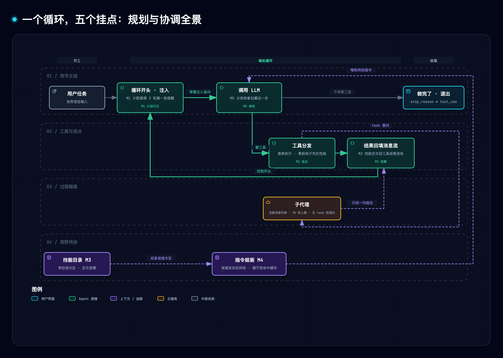

# gl-notes：「规划与协调」五节精读（C 型冻结快照）

> **冻结登记块**（Stage ① C 型；本文件 = 本集唯一事实源正文）：
> - **GL 产物**：`docs/research/agent-harness/176-claude-code-planning-control-deep-read.md`（guided-learn 生成 2026-10-01，随分支 ThreeFish-AI/guided-learn 提交入库；正文自下方一级标题起逐字冻结）
> - **原始信源**（B 型，摘自 GL sources.md 信源表，指纹台账见本集 `sources.toml`）：
>   - S0 站点五页 learn.shareai.run/zh/{s05,s06,s07,s10,s11}（site 轨，GL 取数 2026-09-30；快照字节 `source-archive/67a9126/site/`）
>   - S1 源码仓 shareAI-lab/learn-claude-code @ `67a9126c`（repo 轨，钉点分支 fix/s08-s20-sync-frontmatter-parser；五节字节 `source-archive/67a9126/`）
>   - S3–S8 理论锚点（Lost in the middle / tar pit / Simon / ROC / Saltzer-Schroeder 等，仅作理论引用非事实面）
> - **伴生资产**（GL 直通承接）：`.temp/lcc-planning-lab/{analogy.md, sources.md, repo/, sources/, experiments_raw_*.log}`（类比登记表已合入附录 A）
> - **证据定级**：GL 对原始信源的转述按 B 型 ≤【二】级；正文【课程转述】=【三】级（口播须归属句）；`planning_control_lab.py` 实测经本集复算（附录 C）——对应数字可按【一】级（本集复算）引用
> - **鲜度**：本集复核 2026-10-02（见附录 C 鲜度小节）
> - **链接适配**：正文自 docs/research/agent-harness/ 迁入本集后，§2 资产三链接的相对层级已改写为自 research/ 出发（内容零改动，仅路径层级）
> - **archify 全景图**：GL 产出的 docs 版 HTML（claude-code-planning-control--five-mechanisms.html）无引导章节标记，不能逐章录制；本集全景按既有决策以同一 `.mmd` 内容源重产带章节视频版（`pc2-panorama`），节点拓扑与正文 §2 同源

# Learn Claude Code「规划与协调」五节 精读与通俗拆解

> [1] shareAI-lab, "Learn Claude Code," 课程站点「规划与协调」（Planning & Control）部分五节：s05 TodoWrite / s06 Subagent / s07 Skill Loading / s10 System Prompt / s11 Error Recovery. [Online]. Available: https://learn.shareai.run/zh/s05/ （及 /zh/s06/ 、/zh/s07/ 、/zh/s10/ 、/zh/s11/）. 所据版本：站点 2026-09-30 实况快照；源码取同仓分支 `fix/s08-s20-sync-frontmatter-parser` 钉点 `67a9126c`（2026-07-28）[2]，逐节对账站点与该钉点内容一致（每章 6/6 小节标题交集，站点独有者仅为内嵌图题）。无勘误或撤稿迹象。

**一句话定位**：编码 Agent 里的模型，每轮只看得到「上下文」，也就是发给它的那一串消息列表。「规划与协调」讲的是在执行循环的固定位置装上五个装置，把「模型每轮看到什么」从放任自流变成显式管理：计划要看得见，大过程要挪出去，知识要按需进场，指令要按实况拼装，管线断了要分类自愈。

课程前四章已经搭好一个能用工具的循环：模型要工具就执行、把结果喂回去，不要就停。可一旦任务变长变大，这个循环会以五种方式失灵，而且病根相同。本文回答三个问题：这五种失灵分别是什么，五个装置各自怎么修，修好的凭据是什么。§1 摆出五个失败现场，§2 给全景图，§3–§7 逐个拆装置（每章都有一条具体输入的走查），§8–§9 给证据与可以亲手重跑的原型，§10 收拢成五条规律与两个争议，§11 列出材料没有证明的事。

> [!TIP]
> **白话主线**
> 1. 问题：模型每轮只看到消息列表——长任务里计划被工具结果冲掉、大任务的中间过程把主线挤爆、知识全塞指令区白花钱、指令越加越长互相打架、接口一抖整个程序直接崩；五类失败是同一个病根：模型看到的，与它此刻需要的，错位了。
> 2. 难点：上下文既是模型唯一的记忆，又是稀缺资源——塞多了稀释注意力，塞少了缺信息；而且模型自己看不见自己的忘性。
> 3. 思路：不改模型，改供给——计划写回消息流（不更新就提醒一句）、大任务派给一段全新对话只回传结论、技能目录常驻而全文按需加载、系统指令按真实状态分段拼装并缓存、接口调用按错误类别走最小恢复路径。
> 4. 验证：五个装置都能单独拆掉看退化——拆提醒会误报或失灵、拆隔离主线消息从 2 条涨到 19 条、拆两级指令区放大约 47 倍、拆缓存每次重拼、拆记账反复压缩自己的对话（本文 §9 实测）。

## 1. 它要解决什么问题

读懂后文只需要三个前置概念。第一个是循环本身 [3]：程序把消息列表和工具清单发给模型，模型要么举手说「我要用工具」，要么说「我做完了」；前者就执行工具、把结果追加回消息列表、回到开头，后者就退出。这个循环的骨架从第一章到最后一章不变，所有能力都是往上面**挂**装置挂出来的。第二个是分发表：工具不写死在循环里，而是登记在一张「工具名 → 处理函数」的表里，加一个工具就是登记一行映射，循环不动 [3]。第三个是事前钩子：每次工具执行前都要经过这个环节，权限检查挂在这里，危险命令在这里被拦下 [3]。记住它，后文「隔离不等于绕过安全」全靠它。另有两个词贯穿全文：「系统指令」（system prompt）是程序每轮随消息列表一起发给模型的那段固定说明，交代它是谁、有哪些工具、该怎么做事；「上下文窗口」是模型一次能读进的内容总量，有上限，满了接口就直接拒绝。

这五章各自对着一个失败现场（均为课程原文场景 [1]）：

| 失败现场 | 发生了什么 | 病根 |
|---|---|---|
| 长任务丢计划 | 「把所有 Python 文件改成 snake_case，跑测试，修好失败」——改到第 3 个文件，测试失败吸走了全部注意力，最初的目标被挤出上下文；10 步重构做完 1–3 步就开始即兴发挥 | 计划只存在于开头那句话里，工具结果不断涌入把它挤掉了 |
| 大过程淹没主线 | 修一个 bug 读了 30 个文件、聊了 60 轮，消息列表涨到 120 条，大半是追踪过程，与最终目标无关 | 中间过程与主线共用同一个消息列表 |
| 知识全带太贵 | React 规范 + SQL 指南 + API 文档共 6500 行全塞进系统指令，改 CSS 颜色时也整包携带 | 「可能有用」和「此刻要用」没有分开 |
| 指令堆积打架 | 每加一个能力就往指令里堆一段，换项目要重写整段，加一段工具描述可能与前面的指令冲突 | 指令被当成写死的文档，而不是按当前状态生成的配置 |
| 故障即崩 | 接口返回 529（过载），程序没有重试、没有换模型、没有减上下文，直接崩溃 | 错误被当成 bug，而不是分布式系统的常态 |

五个失败同一个病根：**模型看到的与它需要的错位了**。于是有了五条设计规格：计划可见、过程隔离、知识按需、指令按实况组装、故障分类恢复。合起来就是这门课说的「规划与协调」。

## 2. 全貌解剖


*图源 [claude-code-planning-control--five-mechanisms.mmd](../../../../../docs/assets/mermaid/agent-harness/claude-code-planning-control--five-mechanisms.mmd) · 交互版 [HTML](../../../../../docs/assets/architecture/agent-harness/claude-code-planning-control--five-mechanisms.html)*

这张图的结论是：循环不动，五个装置各挂一个固定位置。待办提醒挂在循环开头的注入点，子代理挂在工具分发，技能目录挂进指令组装，记忆段挂在状态检查，恢复逻辑包住模型调用那一步。

值得精读的核心是五个机制本身（§3–§7）。它们的证据分三层：教学代码（钉点源码 [2]，逐行可读），站点叙事与图示 [1]，以及每章附带的「深入 CC 源码」段。最后这一层是课程对闭源产品 Claude Code 的行号级分析，本篇一律标注**【课程转述】**，只作转述、不作独立证据，因为 CC 公开仓根目录下没有 `src` 目录（该路径返回 404，2026-10-01 经 GitHub API 核实 [9]）。在课程里的坐标上，这五章承接「工具与执行」四章（s01 循环、s02 分发表、s03 权限、s04 钩子），中间被「记忆管理」两章（s08 压缩、s09 记忆）隔开，后面通向任务系统与多 Agent 平台（s12 起）。

因果链可以一口气说完：五类失败的根源，是模型的世界只有上下文窗口，窗口稀缺又会自动膨胀，而「模型看到什么」从来没人显式管理；所以五条规格全是对视野的供给管理；五个机制分别落实一条规格；证据则由教学代码逐行、变更台账对照、本文原型拆件实测和课程转述的 CC 对照四路合围。

学习的轻重也要分清。最值得学的是 §4 子代理，它最反直觉，也是多 Agent 系统的地基；其次是 §6 指令组装，它把「系统指令」从文档翻转成运行时产物；再次是 §7 分类恢复，它是生产可用性的分水岭。§5 技能加载与 §3 待办清单较简单，各自揭示一个可迁移的工程判断。

还有一个课程结构事实需要提前说明：教学代码不是一条累积到最后的单链。按各章页头标注的工具数（目标五章另经钉点源码核对 [2]，前置各章取站点页 [3]），弧线是 s01=1 → s02=5 → s05=6 → s06=7 → s07=8 → s08=9（累积链顶点）→ s09=6 → s10=3 → s11=3。s09 起每章变成「聚焦演示文件」：只保留与本章机制相关的最小工具集（s10/s11 只剩 bash/read/write 三个），前几章的钩子、待办、子代理不再逐章携带。所以「循环不变」在 s08 之后只对单文件内部成立，跨章看的是机制专题而非同一份越滚越大的代码。课程各章的「相对上一章的变更」表也有同款失真：s10 的表在「之前」一栏写着 `bash, read_file, write_file (3)` 并标「不变」，而 s09 自己的页头与变更表都是 6 个 [1][3]——台账是每章的局部视角，不是严格账本。

## 3. 计划回到视野：待办清单与唠叨提醒（s05 TodoWrite）

五个失败里最先出现的是丢计划。模型的计划原本只活在开场那一句话里，工具结果一多，它就被挤出注意力。解法朴素得近乎笨：给模型一个 `todo_write` 工具，让它把步骤列成带状态的清单（pending / in_progress / completed），存在程序内存里，每次更新都在终端上画出来。这个工具**不做任何实际工作**，不能读文件，也不能跑命令；用课程自己的话说，它增加的不是执行能力，是规划能力 [1]。

光给工具还不够，模型干得起劲时会忘了更新清单。所以循环里加了个计数器：连续 3 轮没调 `todo_write`，就在下一轮调用前往消息列表里塞一条提醒。源码（钉点 [2]，`s05_todo_write/code.py`）里这套机制分四处落地：

- 工具实现 `run_todo_write`（144–155 行）：接收清单 → 归一化校验（字符串会先尝试按 JSON、再按 Python 字面量解析；状态必须是三种枚举值之一，非法输入直接返回错误信息、不动状态，124–142 行）→ 存入全局 `CURRENT_TODOS` → 逐项渲染（pending 空格、in_progress ▸、completed ✓）。
- 挂表（157–176 行）：`todo_write` 与其他 5 个工具一起登记进分发表，循环一行不改。
- 唠叨提醒（235–281 行）：`rounds_since_todo` 在每个「有工具调用」的轮次后 +1（257 行）；调了 `todo_write` 就清零（274–276 行）；循环开头检查计数器，满 3 且消息列表非空，就追加一条 user 角色的 `<reminder>Update your todos.</reminder>`（239–242 行）。它以用户消息的身份注入，而不是改系统指令，所以进入的是消息流、随历史携带，不会每轮常驻。
- 教学版还省略了 CC 待办项里给界面转圈提示用的「正在做什么」字段（课程注明教学版只有终端输出，用不上）【课程转述】[1]。
- 课程明说：固定「3 轮」是教学发明，CC 源码里没有这个固定轮数逻辑；CC 更接近的做法是「3 个以上待办全部完成、却没有验证步骤时，追加一条验证提示」【课程转述】[1]。

拿一条具体任务走一遍（对应原型 M1 场景，实际运行日志见 §9）。输入「把 example/ 下所有 py 文件补类型注解，然后加 docstring，最后加 main 守卫」：

1. 第 1 轮，模型先调 `todo_write` 交出 3 项、全部 pending；计数器先 +1，随即因调用了 `todo_write` 清零。
2. 第 2 轮，模型调 `edit_file` 正常干活，没碰清单，计数器变 1。
3. 第 3 轮，`bash` 跑测试，计数器变 2。
4. 第 4 轮，`edit_file` 修失败的测试，计数器变 3。
5. 第 5 轮循环开头，计数器已经 ≥3，程序注入一条 `<reminder>` 并清零，然后才调模型。模型重新看到自己的清单，把第 1 项标成 completed。

什么时候该用它？看到「多步任务，过程中又有大量工具结果涌入」，就该想到它。拆掉「调用即清零」这一行，模型明明更新过计划，也会被误提醒（§9 D1 实测：基线 0 次，拆后 1 次）。它的红线是不能当持久任务系统用：清单在内存里，进程退出即清空；依赖图、并发锁、跨会话恢复都是后面 s12 任务系统的事【课程转述】[1]。

## 4. 大过程挪出去：子代理，以及「隔离」到底隔离了什么（s06 Subagent）

待办清单能让计划留在视野里，却挡不住大过程把主线淹没。修 bug 要追踪调用链，读 30 个文件、60 轮对话，这些中间过程与最终目标无关，却全挤在主线的消息列表里。人遇到这种事会开一个新终端去追，追完把结论写进笔记，再回原终端继续。s06 给模型同样的能力：调用 `task` 工具，把一件事整段委托出去。

被委托的「子代理」拿到一段**全新的消息列表**，任务描述是它的第一条消息。它自己跑自己的循环，跑完只把最后一条消息里的文字交回来，中间读了什么、执行了什么，全部丢弃。有两样东西不丢：文件系统里已经发生的改动还在，子代理写的文件不会消失；安全检查也照跑，子代理每次调工具，同样要过主程序的事前钩子，危险命令照样被拦。

这里有一个全篇最需要掰直的直觉：**「隔离」隔离的是记忆，不是权限，也不是磁盘结果**。像请一位外包顾问：他自带笔记本记录自己的过程，最后只交一页结论；但他刷的是公司门禁卡，交付物也留在公司共享盘。这个比方到此为止：顾问是另一个人，而子代理是同一段程序的另一场对话，能力上没有差别。

源码（钉点 [2]，`s06_subagent/code.py`）里的关键点有四处：

- `spawn_subagent`（207–249 行）：新建 `messages`（210 行），自跑循环，设 30 轮安全上限（212 行）；子代理工具表 `SUB_TOOLS` 只有 bash/read/write/edit/glob 五个，没有 `task` 自己（182–194 行）；每块执行前照过事前钩子（224 行）；结束后用 `extract_text`（201–205 行）取最后一条消息的文本回传。
- 30 轮撞线时的兜底（239–247 行）：若最后一条是工具结果（撞线时停在半轮），向前回溯找最后一条有文本的助手消息；一条都没有就返回一句「子代理跑满 30 轮没有给出最终答案」。站点正文只展示了「取最后一条」，这段回退是源码里多出来的韧性细节 [1][2]。
- 为什么干脆不给 `task` 工具，而不只是嘱咐？只要允许委派，子任务会再生子任务，孙子任务再生重孙任务，链条长度没人管得住，一场任务能滚出几十个子代理，费用和混乱都失控。「不给工具」是一道结构防线，模型想违反也没有手段。子代理的系统指令里确实也写了「不要再委派」（58–62 行），但那只是双保险，主防线永远是不给工具。
- 主线只多一条消息：`task` 的工具结果就是那句摘要文本（252–257 行），进入主代理的消息流。

拿一条具体任务走一遍（对应原型 M2 场景）。输入「用子任务查这个项目用什么测试框架」：主代理调 `task` 把描述传进去；子代理开新列表跑 2 轮，先读 `pyproject.toml`，再读测试目录；它的最后一条消息是「项目用 pytest」；主代理只收到这一句工具结果，主线从 1 条消息变成 2 条。同一件事如果不隔离，8 轮子过程会全部写进主线，消息数从 1 涨到 19（§9 D2 实测）。

课程还转述了真实 Claude Code 的做法【课程转述】[1]。那里的子代理不是一种而是三种：普通（全新上下文）、fork（构造缓存友好前缀，与父共享 prompt cache，也就是服务端对相同开头内容的缓存，不必重算；隔离让位于经济）和通用（fork 门关闭时走普通路径）。fork 模式要命中缓存，系统指令、工具、模型、消息前缀、思考配置五件必须字节级一致。递归防护也不是「不给工具」一句那么简单，而是多层判断；权限弹窗会冒泡回父终端；另有异步路径。两种思路的取舍见 §10 争议一。

什么时候该用它？看到「子任务过程量大、结论小」，比如调查、总结、批量转换，就该委托出去。拆掉隔离，主线消息按 19:2 膨胀。它的红线是不能当权限边界用：子代理与主代理同权同责，安全从不因隔离而豁免。

## 5. 知识按需进场：技能两级加载（s07 Skill Loading）

任务拆开之后，每一块需要的知识也不一样。规范文档 6500 行全塞系统指令，改一个 CSS 颜色也要整包携带，课程说其中 99% 与当前任务无关（课程估算口径，无实测 [1]）。s07 的解法是两级：目录常驻系统指令，每个技能只放名字加一行描述（课程估约 100 token 量级；课程原文口径：system prompt 每轮按 token 计费）；全文等到模型调用 `load_skill` 时，才作为一条工具结果进入消息流（估约 2000 token 量级）。模型每轮都知道「我有哪些技能可用」，但只为真正用到的那份付全价。

关键区别就是 §10 规律一：**注入位置决定生命周期**。技能全文不是系统指令的一部分。它作为一次工具结果进入当前消息，之后随历史一起携带，直到被压缩、截断或会话结束。（「经工具结果注入」本身是教学简化：课程转述 CC 的工具结果只显示一句启动提示，技能内容另经新增消息注入对话【课程转述】[1]。）这与下一章的上下文压缩天然衔接：按需加载管「不该提前带的不要带」，压缩管「该丢的怎么丢」。目录则在系统指令里每轮常驻，不受消息流裁剪波及。

源码（钉点 [2]，`s07_skill_loading/code.py`）的四处落点如下：

- 启动扫描 `_scan_skills`（69–84 行）：遍历 `skills/` 子目录（按目录名排序），读每个 `SKILL.md`，解析 YAML 头（`---` 分隔、`yaml.safe_load`，53–64 行）取 `name` 与 `description`（缺省回退：名字用目录名、描述用正文第一行），连同全文存入注册表 `SKILL_REGISTRY`（一次性，启动时跑一次）。
- 目录注入（86–102 行）：`build_system()` 把注册表渲染成清单塞进系统指令。
- 按需加载 `load_skill`（269–274 行）：按注册表查名字，不走文件路径。调用方给的名字只是键，拼不出路径，所以天然没有路径遍历面。
- 子代理工具表（214–227 行）：没有 `load_skill`，也没有 `task`，所以子代理既不能委派，也不能加载技能。

拿一条具体输入走一遍（对应原型 M3 机制与 D3 单技能配置，实际运行日志见 §9）。技能目录里放一个 SQL 规范技能，启动后系统指令共 128 字符。模型说「我需要 SQL 规范」，于是调 `load_skill("sql-style")`，注册表命中，全文作为工具结果注入。如果并成一级、把全文全塞系统指令，128 字符会变成 5981 字符，放大约 47 倍，而且**每一轮**都带（§9 D3 实测）。

本文原型还实测了课程没提的三个边界行为（同构机制 [2]）。两个技能声明同名 `name` 时，目录序靠后的会静默覆盖靠前的，因为注册表以声明名为键。启动扫描是一次性快照，运行期新放的技能目录，旧注册表看不见；这是注册表为换取安全付出的代价，不是拆掉它的坏法。按名字查键还意味着，目录名与声明名不一致时，模型必须按目录宣传的声明名调用才能命中。

什么时候该用它？只有「复用频率高、体积小」的知识才配常驻，其余一律按需。拆掉注册表、改成按名字拼路径，路径遍历与名字错位会立刻出现（§9 T4 实测）。它的红线是别指望技能全文「常在」：全文进的是消息流，压缩一来就丢（见 §7 应急压缩与 §10 争议二）。丢了之后，模型并不「记得」规范内容，只能再调一次 `load_skill`，从注册表把全文重新取进来；目录则一直留在系统指令里，所以它仍然知道这份技能存在。

## 6. 指令按实况拼装：system prompt 是运行时产物（s10 System Prompt）

技能目录要进系统指令，记忆也要进，工具清单也要进，系统指令自己就成了下一个瓶颈。从第一章到第九章，系统指令是一行写死的字符串，能力每加一个就往里堆一句，直到换项目要重写，改一处怕碰坏别处，每轮请求还要全量携带。s10 的翻转是：把系统指令当成**运行时生成的东西**。像每日菜单：招牌菜永远印，时令菜看当天有没有货，现场拼一页；食材没变，就直接用昨天打印好的那页。这个比方到此为止，它不覆盖「分段独立维护」，更不覆盖服务端那层缓存。

源码（钉点 [2]，`s10_system_prompt/code.py`）分四层看：

- 分段：按主题切成 `identity / tools / workspace / memory` 四段，各段独立维护，改工具段不动身份段。这里有一处文档与代码的细差：站点展示的是四段字典 [1]，s10 的代码里字典却只放 identity 一段，tools/workspace/memory 在组装函数里现场生成（42–65 行）；到 s11 才把四段补齐进字典（`s11_error_recovery/code.py` 65–70 行，注释「from s10, synced」）。
- 组装 `assemble_system_prompt`（47–65 行）：分始终段（identity、tools、workspace）和按需段（memory），**判断依据是真实状态**。工具列表来自实际注册了哪些处理函数，工作目录来自当前路径，记忆段只在 `.memory/MEMORY.md` 文件真的存在且非空时才加。从头到尾没有「在消息里搜关键词」这种猜测。
- 缓存 `get_system_prompt`（72–93 行）：把状态字典用 `json.dumps(sort_keys=True)` 序列化当键，键没变就直接返回上次拼好的串。不用 Python 的 `hash()`，是因为它有进程随机化，遇到嵌套结构还会抛不可哈希错误（72–93 行注释）。
- 两层缓存的区别（课程特意强调 [1]）：这层只省「重新拼字符串」的本地功夫；真正的 API 层 prompt cache 是让服务端不重算整段前缀，CC 靠把静态段放前、动态段放后的边界划分来保住它【课程转述】[1]。顺序一乱，服务端缓存全失效。

拿一段具体对话走一遍（对应原型 M4 场景，实际运行日志见 §9）。第一问「读一下 README」，状态里没有记忆文件，拼出 3 段；第二问紧接着来，状态没变、键相同，缓存命中直接返回；接着用户让模型建了 `.memory/MEMORY.md`，下一轮状态字典变了，重组装成 4 段。同一上下文连续获取 5 次，正常是 1 次组装、4 次命中；如果键里掺进每轮都变的成分（比如工作目录尾巴），5 次全部重组装，命中 0 次（§9 D4 实测）。

课程还转述了 CC 的做法【课程转述】[1]：系统指令段数量不固定，受功能开关、输出风格、用户类型、token 预算影响，分静态段与动态段；`mcp_instructions` 是唯一「易失」段，因为 MCP 服务可随时连断；标准交互模式下核心系统指令约 20–30KB（课程估算口径）。

什么时候该用它？凡是「配置随环境变、大头可缓存」的生成物都适用，比如指令、菜单、报表头。拆掉缓存是白费功夫；拆掉「按真实状态判定」，就退化成关键词猜测，既会误触发又没法测试。它的红线是别指望本地缓存改善 API 计费，两层缓存是两码事。

## 7. 错误不是终点：分类恢复与记账（s11 Error Recovery）

前四个装置管的是「模型该看到什么」，最后一个装置管的是供给管线本身断了怎么办。生产环境里接口错误是常态：输出被截断、上下文超限、限流与过载（接口返回的错误码 429 表示限流，529 表示过载）。第一条纪律是**不盲目重试**：先分类，再走最小的恢复动作，并记住这一招用过没有。像修打印机：没墨换墨盒再打，卡纸抽纸重打，连续断电才换备用机，不会对着断电猛按打印键。这个比方少了一块：打印机靠人分诊，这里靠代码按错误信号自动分诊，还有一本账记住每招的剩余次数，讲记账时得回到工程术语。

整套逻辑可以在脑中搭成一张分诊地图：调用结果先过「成功没有」这道闸，过了就走正常工具循环；没过就按错误类别分流到三条恢复路径，每条路径的出口都汇回「再调一次」，闸口旁边始终立着那本账。源码（钉点 [2]，`s11_error_recovery/code.py`；常量 52–61 行）逐条对应如下：

- **路径一·输出截断**（`stop_reason == "max_tokens"`，301–318 行）：第一次发生时不保存半截输出，直接把上限从 8000 提到 64000、原样重发同一请求。原因是半截输出一旦进了消息列表，「话说一半」的状态就被固化了，升级后让模型重新说整段更干净。升级只有一次机会，靠账本记住。64K 仍截断，才保存半截输出并注入续写提示，意思是「从中断处直接接着说，不要道歉，不要复述」（58–61 行原文意译）；续写最多 3 次，用尽即退出。
- **路径二·上下文超限**（`prompt_too_long`，280–291 行）：触发一次应急压缩 `reactive_compact`（235–244 行）。教学版只保留最后 5 条消息，并在开头补一条说明性消息，大意是「先前的对话已被裁剪，从刚才中断处继续」；站点正文只说「保留最后 5 条」[1]，这条合成头消息是源码细节 [2]。压缩后重试，但只允许一次：已经压过还超限就退出，再压也不会更小。真实实现是让模型生成压缩摘要，教学版有意简化，因为 s08/s09 已教过摘要式压缩 [2]。
- **路径三·临时故障**（429/529，173–223 行）：指数退避加抖动。基础延迟是 `min(500 × 2^n, 32000)` 毫秒，抖动最多 +25%（确定性原型实测首三次 0.56s / 1.00s / 2.50s）；服务器给了 `Retry-After` 就优先听服务器的；最多 10 次。连续 3 次过载（529）且配置了备用模型，就切换模型。加抖动，是为了让一群并发请求不在同一秒集体重试。
- **账本 `RecoveryState`**（163–170 行）：记五项状态，分别是升级用过没有、续写用了几次、压缩试过没有、连续过载计数和当前模型。每一项都在回答「这一招还剩几次」。
- 覆盖面：教学版的瞬态恢复只认 429/529，课程注明真实系统还覆盖连接错误、超时等，CC 有 13 种以上原因码【课程转述】[1]。
- 分层包裹：`with_retry` 管瞬态（429/529，按异常类名与消息文本分类），外层 `try/except` 管其余（超限与不可恢复错误），`stop_reason` 检查管截断。三种恢复各管各的错误类型，互不越界（265–340 行）。

原型里有两段实测序列可以对照（对应 M5 场景，实际运行日志见 §9）。第一段，调用遇到 429，等 0.56s 重试，再遇 429，等 1.00s 重试，然后成功。第二段，连续三次 529：前两次各等 0.56s、1.00s，第三次触发切换备用模型并等 2.50s，然后成功。两段都零人工介入，账本保证每一招不超限。

课程还转述了 CC 的做法【课程转述】[1]：每轮调用后有十几种「原因/迁移」判定，教学版只展开最常见的 5 种；退避公式是 `500 × 2^(attempt-1)`，首试 0.5s；流式路径中，可恢复错误对界面暂扣不展示；连续 3 次过载切换模型时，会清空待处理消息；token 预算的「继续」也不是无限的，连续 3 次续写且 token 增量小于 500，就判定边际收益消失而停止。

什么时候该用它？凡是「外部依赖会以可分类方式失败」的系统都适用。拆掉记账，恢复机制会反复消费自己的病人（§9 D5 实测：拆后反复压缩 8 次，正常压缩 1 次后优雅退出）。它的红线是别把「重试」当兜底万能药：类别不匹配的恢复，比如对过载提高输出上限，纯属浪费。

## 8. 关键实证数字

五个机制讲完，本文原型的拆件实测数字可以集中摆出来。一句话概括：拆掉任何一个组件，都会出现可量化的退化，主线消息从 2 条涨到 19 条，系统指令放大约 46.7 倍，缓存命中从 4 次掉到 0 次，应急压缩从 1 次变成反复 8 次，提醒从 0 次变成 1 次误提醒。下表逐项列出，每行都是「正常 vs 拆掉一个组件」的同次运行对照：

| 实验（本文原型，确定性 mock） | 关键数字 | 条件·截至 | 一句话读法 |
|---|---|---|---|
| D2 拆上下文隔离 | 主线消息 1→**19** 条（正常 **2**） | 8 轮子任务；2026-09-30 实测 | 隔离的价值就是这条 19↔2 的差距 |
| D3 拆技能两级加载 | 系统指令 **128 → 5981** 字符（≈**46.7×**） | 1 个技能、全文约 5.8K 字符；同上 | 常驻的只能是索引，不是知识本体 |
| D1 拆唠叨清零 | 基线 **0** 次提醒 → 拆后 **1** 次误提醒 | 模型首轮更新计划、随后 2 轮工具；同上 | 状态机的复位与置位同等重要 |
| D4 拆缓存键稳定 | 5 次获取 **5** 次重组装 **0** 次命中（正常 1 组装 4 命中） | 键掺入每轮变化的成分；同上 | 缓存的前提是键确定 |
| D5 拆恢复记账 | 应急压缩 **8** 次（正常 **1** 次后退出） | 8 次连续超限错误；同上 | 每压一次都在丢消息，上限才是止损线 |
| T4 拆技能注册表 | `../` 名字读出目录外文件 `'TOP-SECRET'`；按声明名找不到文件 | 无注册表、按名拼路径变体；同上 | 注册表是「键不是路径」的结构防线 |
| T4 注册表自身的代价 | 启动后新放的技能，旧注册表查不到（`False`） | 保留注册表、运行期新增一个技能；同上 | 注册表是启动快照，换来安全就得接受「新增要重启才生效」 |

读这些数字要分清三类来源。本章的实测数字全部来自本文原型的确定性复演，是机制自洽性的证据，不构成对课程数字的复现；每行的正常对照值与拆后值同出自一次运行的日志。课程口径的 ~100/~2000 token 每技能、「99% 无关」、「约 20–30KB 系统指令」都是课程方估算，未见测量方法（§11 第 2 条）。对 CC 内部行为的全部行号级断言按【课程转述】分级，未独立核验（§11 第 1 条）。

## 9. 动手实验室

上一章的数字都能亲手复现。原型是纯标准库、确定性的，秒级跑完，位于本仓 `docs/research/agent-harness/assets/planning_control_lab.py`：

```bash
uv run --no-project python docs/research/agent-harness/assets/planning_control_lab.py --selftest     # 14 场景断言全绿
uv run --no-project python docs/research/agent-harness/assets/planning_control_lab.py --experiment D2  # 单拆一个机制看退化
uv run --no-project python docs/research/agent-harness/assets/planning_control_lab.py --t4            # 拆注册表变体（T4 两行实测）
```

原型里的 LLM 角色全部用脚本化序列替代：无网络、无随机数、不睡眠，退避延迟只计算并记录。所以它验证的是**机制自洽**，不是模型能力。机制与实现单元的对应如下：

| 机制 | 实现单元（原型内） | 课程对应（钉点 [2]） |
|---|---|---|
| M1 待办+唠叨 | `agent_loop_m1` / `run_todo_write` / `normalize_todos` | `s05_todo_write/code.py:124-142,144-155`（课程 235–281 行） |
| M2 子代理 | `spawn_subagent` / `extract_text` / `SUB_TOOLS` | `s06_subagent/code.py:182-262` |
| M3 技能两级 | `parse_frontmatter` / `scan_skills` / `build_system` / `load_skill` | `s07_skill_loading/code.py:53-102,269-274` |
| M4 指令组装 | `assemble_system_prompt` / `PromptCache.get` | `s10_system_prompt/code.py:42-93,157-168` |
| M5 分类恢复 | `retry_delay` / `with_retry` / `reactive_compact` / `RecoveryState` / `recovering_loop` | `s11_error_recovery/code.py:52-61,163-244,265-340` |

五次破坏性实验，每次只拆一个组件，逐条记录改了什么、实测看到什么、得出什么教训（引文均为实际运行日志）：

- **D1 拆唠叨清零**（删「调 todo_write 即计数清零」）：`[D1] result: (0, 1)`——同一脚本（模型第 1 轮写完计划、随后 2 轮工具就收尾），基线零提醒，拆后注入 1 次 `<reminder>` 误提醒。教训：记账不清零，提醒就从督促变骚扰。
- **D2 拆上下文隔离**（子代理与父共享消息列表）：`[D2] mainline messages: start=1 normal=2 broken=19`——8 轮子任务后主线 19 条消息，正常隔离只多 1 条摘要（同次运行对照）。教训：「只回结论」的前提是过程有地方死。
- **D3 拆两级加载**（全文全塞系统指令）：`[D3] system prompt chars: normal=128 broken=5981 ratio=46.7x`——系统指令放大约 46.7 倍且每轮携带。教训：常驻税只能收在索引上。
- **D4 拆缓存键稳定**（键掺入每轮变化成分）：`[D4] normal: assembles=1 hits=4; broken: assembles=5 hits=0`——同上下文正常 1 次组装 4 次命中；键被污染后 5 次获取全重组装零命中。教训：这正是课程用 `json.dumps(sort_keys=True)` 而非 `hash()` 的原因。
- **D5 拆恢复记账**（压缩记账恒为「未用过」）：`[D5] normal: result=EXIT_TOO_LONG compacts=1` / `[D5] result: ('EXIT_RETRIES', 8)`——同样 8 次超限，正常路径压缩 1 次后按「仍超限即退出」收场；拆掉记账后反复压缩 8 次（每次都在丢消息）。教训：不记账的恢复会吃掉自己的病人。

原型实测还额外发现三个课程没写的边界行为：同名技能会静默覆盖，因为注册表以声明名为键；唠叨检查发生在「下一轮开头」，所以连续 3 轮工具后直接收尾，收尾轮前仍会注入一次提醒；应急压缩会多出一条合成头消息（「先前的对话已被裁剪…」）。

## 10. 底层规律与核心争议

五个装置都挂在同一个骨架上：循环的结构不变，能力全靠往固定位置挂装置挂出来；循环体偶有小改（§2 已说明：s10 改用组装函数取指令、s11 给调用包上恢复逻辑）。把五个机制放在一起看，能抽出五条互不重叠的规律：第一条管信息放哪里，第二条管什么时候动，第三条管大过程怎么折叠，第四条管失败了怎么退，第五条管约束怎么立。合起来就是「管理模型视野」的完整决策面。

### 规律一：注入位置决定生命周期与成本

同一段信息，进系统指令就每轮常驻，还能被服务端缓存摊薄；进消息流就随历史携带，会被压缩、被截断；进子代理就当场丢弃。所以设计任何知识、指令或计划管线，先选注入点，再谈内容；位置还影响内容被看到的概率 [4]。技能两级加载是正用，D3 把全文塞进指令区的 46.7 倍放大是反面代价。

### 规律二：控制流只认真实状态，不做内容猜测

要不要提醒看计数器，要不要记忆段看文件存在性，走哪条恢复看错误类别。判定信号全部来自可查的系统状态，从不在消息文本里搜关键词。显式状态避免了隐式推断带来的复杂度 [5]；关键词猜测既会误触发，也没法写测试。

### 规律三：隔离是过程级的有损压缩

子代理把「读了 30 个文件」整段压成一句结论，与摘要压缩同族，只是粒度是整个子过程。复杂系统往往是「近可分解」的：内部各块自己的交互很密，块与块之间只传少量短消息，正是这种分层让整体的复杂度可控 [6]。D2 的 19 对 2 就是这次压缩省下的主线空间。

### 规律四：恢复资源有限，必须记账

升级一次、续写三次、压缩一次、退避十次，每种恢复都是消耗品。账本（RecoveryState）记「用过没有」，用尽就退。恢复必须有界，快速分类并走局部恢复，才不会退化成无差别重启 [7]。D5 拆掉记账后反复压缩 8 次，就是无界恢复的样子。

### 规律五：结构防线优于语言嘱咐

防递归靠「不给工具」，安全靠「钩子照跑」，防忘计划靠计数器注入。约束做进结构，就不依赖措辞的运气；这正是完全仲裁原则的要求：每次访问都必须经过检查 [8]。子代理指令里那句「不要再委派」只是双保险，真正拦住递归的是工具表里没有 `task`。

### 争议一：子任务上下文，隔离纯度还是缓存经济

教学版给子任务一段全新消息列表，看重的是正确性：过程不污染主线。课程转述的 CC fork 模式却构造「缓存友好前缀」，与父共享 prompt cache，看重的是成本：全新上下文意味着服务端要重算整段前缀【课程转述】[1]。两派看到的失败模式不同，所以都对，只是账本不同。这是一个连续谱上的选址问题：共享前缀与过程隔离在「消息前缀」这一件上正面相撞，教学场景选隔离端，高并发生产选缓存端。

### 争议二：知识放消息流还是常驻指令区，稳定性还是经济性

两级加载省 token，可进了消息流的全文会随历史被压缩，被应急裁剪（§7 只留末 5 条），「加载了又丢了」是真实代价：全文被裁后只能再调一次 `load_skill` 取回，好在目录仍在系统指令里，模型知道还能取。要稳定可见就得常驻，要省钱就得接受内容会过期。token 账与可用性账在窗口稀缺时必然冲突，这是本质难题：工程上只能按复用频率分档，高频常驻、低频按需，没有免费午餐。

## 11. 适用边界

开篇问的是五种失灵怎么修；这一章回答这些修法在什么范围内成立，以及材料有哪些事没有证明。

### 成立条件

- 定义域：教学式编码 Agent（单进程、同步、Anthropic Messages 形态）中围绕主循环（§1 讲的那个「要工具就执行、不要就退出」的循环）的五类视野管理机制；输入是自然语言任务与工具结果，输出是工具调用与文本结论。
- 成立工况：单用户交互会话；工具经分发表注册；接口调用可能以限流/过载/截断/超限失败。教学参数（3 轮、30 轮、5 条、10 次）是示意值，非生产配置。
- Out-of-Scope：真实 Claude Code 产品行为（闭源，仅课程转述）；任务持久化与依赖图（s12）；异步后台与 Agent 团队（s13/s15+）；压缩管线本体（s08，记忆管理层）；并行工具执行（教学版顺序执行）。

### 材料没有证明的事

1. 所有「深入 CC 源码」段的行号级断言不可独立核验——课程所引文件（如 query.ts、forkSubagent.ts）不在 CC 公开仓的根目录列表里，根目录下也没有 `src` 目录，该路径返回 404（2026-10-01 经 GitHub API 核实 [9]）；本篇按课程转述分级呈现，不构成对 CC 行为的独立证据。
2. 课程未提供任何性能测量：~100/~2000 token 每技能、「99% 无关」、系统指令「约 20–30KB」均为课程估算口径，无方法学。
3. 「固定 3 轮提醒」是教学发明；有无提醒对任务完成率的影响，课程未做任何对照实验（本文 D1 只证明「清零逻辑的缺失会制造误提醒」，不证明提醒本身提高完成率）。
4. 教学代码宣称的运行行为未附实测记录（需接口密钥）；本篇以同构原型验证机制自洽，不等同于课程代码实测。
5. 课程变更台账存在跨章失真（s10 表把之前的工具数记为 3 并标「不变」，而 s09 为 6），「循环不变」的累积叙事在 s09 起只对单文件内部成立——引用台账时须以钉点源码为准。

## 12. 用户自测与费曼研讨套件

1. **费曼对练**：不看文章，向同事讲清「子代理隔离的三不」——不隔离什么、隔离什么、为什么防递归靠不给工具而不是嘱咐。讲完回 §4 对答案。
2. **延伸追问**：你所在的系统里，哪些信息被放进了「每轮常驻」的位置（系统指令、全局配置、常驻缓存）？按规律一逐项审一遍：它们配得上常驻税吗？
3. **边界判断**：有人说「把恢复重试次数从 10 提到 100，系统就更稳了」——用 §7 的记账纪律与 D5 实测反驳或支持这个说法。

## 13. 与本仓的关联

本篇不做逐条的机制映射，以下仅凭本仓代码现查做轻量对位，不是映射结论。本仓引擎的自治任务链路同样体现规律五（结构防线优先）：Routine 的成功判定收敛在 `decide()`（`apps/negentropy/src/negentropy/engine/routine/decision.py:96`）的代码路径而非提示词约定；五机制中与本仓最直接可对话的是 M4（「按真实状态组装 + 稳定键」的装配纪律与 `ContextAssembler`，`apps/negentropy/src/negentropy/engine/adapters/postgres/context_assembler.py`，同题）与 M5（自愈循环的错误分类思想）。深入的逐条对位留待专项映射任务。

## 参考（IEEE）

- [1] shareAI-lab, "Learn Claude Code," 课程站点「规划与协调」（Planning & Control）五节（s05–s07, s10–s11 中文页）. [Online]. Available: https://learn.shareai.run/zh/s05/ （accessed Sep. 30, 2026）.
- [2] shareAI-lab, *learn-claude-code*（源码仓，分支 fix/s08-s20-sync-frontmatter-parser, commit 67a9126c）. [Online]. Available: https://github.com/shareAI-lab/learn-claude-code (accessed Sep. 30, 2026).
- [3] shareAI-lab, "Learn Claude Code," 课程站点前置六节（s01–s04, s08–s09 中文页）. [Online]. Available: https://learn.shareai.run/zh/s01/ （accessed Sep. 30, 2026）.
- [4] N. F. Liu, K. Lin, J. Hewitt, A. Paranjape, M. Bevilacqua, F. Petroni, and P. Liang, "Lost in the middle: How language models use long contexts," *Trans. Assoc. Comput. Linguistics*, vol. 12, pp. 157–173, 2024, doi: 10.1162/tacl_a_00638.
- [5] B. Moseley and P. Marks, "Out of the tar pit," presented at the BCS Software Practice Advancement (SPA) Conf., 2006. [Online]. Available: https://curtclifton.net/papers/MoseleyMarks06a.pdf
- [6] H. A. Simon, "The architecture of complexity," *Proc. Amer. Philos. Soc.*, vol. 106, no. 6, pp. 467–482, 1962.
- [7] D. Patterson *et al.*, "Recovery oriented computing (ROC): Motivation, definition, techniques, and case studies," EECS Dept., Univ. California, Berkeley, CA, USA, Tech. Rep. UCB/CSD-02-1175, Mar. 2002. [Online]. Available: https://www2.eecs.berkeley.edu/Pubs/TechRpts/2002/5574.html
- [8] J. H. Saltzer and M. D. Schroeder, "The protection of information in computer systems," *Proc. IEEE*, vol. 63, no. 9, pp. 1278–1308, Sep. 1975, doi: 10.1109/PROC.1975.9939.
- [9] GitHub REST API, "Get repository content: anthropics/claude-code"（根目录列表与 `src` 路径 404 实测存档）. [Online]. Available: https://github.com/anthropics/claude-code (accessed Oct. 1, 2026).


---

## 附录 A · 类比登记表（全片口播类比唯一事实源）

> 承接自 `.temp/lcc-planning-lab/analogy.md`《类比登记表》（外行抽检 B ≥4/5 分、失配探针 C 零带偏、裸讲终检 A PASS，2026-09-30 派发）。一物一喻继承：视频阶段不再另造新比喻；口播使用时失配边界句必须随行。次选类比（学生草稿纸 / 按目的地打包行李 / 水管工先诊断）仅备失配换喻时启用，启用须回本表登记。

| 概念 | 类比（1–3 句） | 失配边界 | 首登章节 |
|---|---|---|---|
| 上下文隔离≠权限隔离（M2） | 像请一位外包顾问：他自带笔记本记录自己的过程，最后只交一页结论；但他刷的是公司门禁卡，交付物也留在公司共享盘。 | 顾问是「另一个人」而子代理是同一段程序的另一场对话；类比只取「记录隔离＋结论回传＋权限/产物共用」，不能推出子代理能力与主代理不同。 | §4 M2 |
| system prompt 运行时组装（M4） | 像每日菜单：招牌菜永远印，时令菜看当天有没有货，现场拼一页；食材没变，就直接用昨天打印好的那页。 | 不覆盖「按段落独立维护」与 API 级前缀缓存的字节级命中；不能推出缓存能跨进程或跨会话。 | §6 M4 |
| 分类恢复不盲重试（M5） | 像修打印机：没墨换墨盒再打，卡纸抽纸重打，连续断电才换备用机——不会对着断电猛按打印键。 | 打印机靠人分诊，恢复路径靠代码按错误信号自动分诊；「记住用过没有」（RecoveryState）在打印机场景无对应，讲记账时必须回工程术语。 | §7 M5 |

另：「上下文」一词首次口播出现处须带一句白话（模型这一轮能看到的全部消息）——外行抽检 D1 的处置备注，随类比纪律执行。

## 附录 B · 信源补充（预留）

> 视频需要而 GL 未覆盖的内容追加于此，每条标一手出处；不回写 GL 原产物。（当前为空）

## 附录 C · 穿透明细与复算记录（本集执行）

> 执行日期 2026-10-02。三组并行穿透代理（只读）+ lab 本集复算 + 鲜度复核。**结论：73 条断言 0 FAIL**（72 PASS + 1 UNRESOLVED 已离线补证闭合）。

### C.1 鲜度复核（2026-10-02）

- `source_ledger.py verify`：受检 15（五章 × readme/code/site）**FAIL 0 · WARN 0**——今日重取全部信源，repo raw 指纹与 site 正文指纹与 GL 2026-09-30 取数**零漂移**。
- 远程分支 tip：`git ls-remote … fix/s08-s20-sync-frontmatter-parser` = `67a9126c`（钉点未移动）。
- 站点五页无 sitemap lastmod；指纹对账即鲜度判据（B 型纪律）。**事实源鲜度 = 2026-10-02 复核有效**。

### C.2 lab 复算记录（GL 内置实测 → 本集【一】级）

`python3 docs/research/agent-harness/assets/planning_control_lab.py`（本集复跑，秒级，输出与 §8/§9 表逐数一致）：

| 命令 | 关键输出 | 对照 |
|---|---|---|
| `--selftest` | `SELFTEST PASSED ✔`（14 场景全 PASS） | §9 |
| `--experiment D1` | `[D1] result: (0, 1)` | §8 行 3 ✓ |
| `--experiment D2` | `mainline messages: start=1 normal=2 broken=19` | §8 行 1 ✓ |
| `--experiment D3` | `system prompt chars: normal=128 broken=5981 ratio=46.7x` | §8 行 2 ✓ |
| `--experiment D4` | `normal: assembles=1 hits=4; broken: assembles=5 hits=0` | §8 行 4 ✓ |
| `--experiment D5` | `result: ('EXIT_RETRIES', 8)`（normal compacts=1） | §8 行 5 ✓ |
| `--t4` | `'TOP-SECRET'` / `Skill not found: pretty-name` / `False` | §8 行 6/7 ✓ |

### C.3 穿透抽查明细（三组并行，断言→归档字节三元组）

**组一 · 课程侧常量（26 条全 PASS）**：§3–§7 全部指向 code.py 的常量/机制断言逐字节命中，含 rounds_since_todo>=3 注入（s05:239-242/257/274-276）、30 轮上限与撞线回退（s06:212/239-247）、SUB_TOOLS 5 件无 task（s06:182-194）、PreToolUse 照跑（s06:223-224）、8000→64000 首升不存半截（s11:301-308）、续写≤3、compact 留 5 仅一次、min(500×2^n,32000)+25% 抖动与 Retry-After 优先、重试上限 10、529×3 切备用、json.dumps(sort_keys=True) 确定性缓存（s10:72-93）、SKILL_REGISTRY 无路径遍历（s07:269-274）、四段名与 s10 单段→s11 四段补齐、五章工具数 6/7/8/3/3 注册表实测吻合。gl-notes 约 30 处行号锚点与归档字节精确对齐零漂移。

**组二 · 站点数字（37 条：36 PASS + 1 UNRESOLVED→已闭合）**：三估算数（~100/~2000 token、99%、20–30KB）站点均平铺直陈无方法学，「课程估算口径」定性成立；五章页头工具数与 s10 台账「(3) 不变」失真原文逐字节坐实。UNRESOLVED 项（弧线前置四数 s01=1/s02=5/s08=9/s09=6，源页未入本档）已离线补证闭合：GL 前置页快照 `sources.md` 信源 S2 字节中，pre_s02 页载「1 个工具」（s01）与「5 个工具」（s02）字面，pre_s08 变更表载「8 + compact (9)」，pre_s09 变更表载「(9) → bash, read_file, write_file, edit_file, glob, task (6)」——四数全部坐实（证据在 `.temp/lcc-planning-lab/sources/pre_s0{1,2,8,9}.html`）。

**组三 · 非数字抽样（10/10 PASS）**：五机制各 1 + 两争议各 1 + 课程转述 3（三种子代理模式五件字节级一致 / 十几种 transition+边际收益停止 / 双任务系统 V1/V2）——转述与各章 README「深入 CC 源码」段逐句对得上，站点 HTML 快照 grep 确认同段承载，转述忠实。

**措辞级备注（不构成 FAIL，narration 引用时收严）**：
1. §5「描述回退用正文第一行」——s07:81 实际取整文件首行 `raw.split("\n")[0]`；frontmatter 存在但缺 description 时会取到 `---`。口播如引用此细节，措辞用「回退取文件首行」。
2. 「按 token 计费」为 GL 释义；站点原文「每次调用都带着……白白消耗 token」。口播取站点原文口径更稳。
3. 站点散文退避式（2^attempt）与其表格（2^(attempt-1)）自相矛盾，gl-notes 取与表格一致的一支；口播只说「指数退避」不展开公式形态。

### C.4 口播引用纪律（由 C.3 导出）

- 弧线叙事可用：s01=1 → s02=5 → s05=6 → s06=7 → s07=8 → s08=9（顶点）→ s09=6 → s10/s11=3（全数已核）；**禁用** s10 台账对 s01 的「3 个工具」说法（已知台账失真）。
- 前置页快照（pre_s*.html）属 S2 级信源字节，若后续需引用前置章细节，以其为锚。
