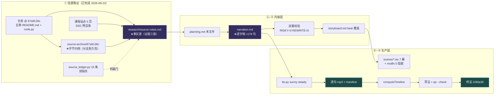

# 策划案：《规划层：模型的视野是安排出来的》

> 事实源：[../research/source-notes.md](../research/source-notes.md)（信源清单 [../research/sources.toml](../research/sources.toml)）
> 逐字稿 SSOT：[narration.md](./narration.md) · 分镜：storyboard.md（阶段⑤产出后回填链接）
> 可执行参数：[../pipeline.toml](../pipeline.toml)

## 一、定位

| 项 | 定义 |
|---|---|
| 系列 | **Claude Code Harness Engineering**（与自进化系列完全无关，口播互不引用） |
| 集次 | 序号只存在于 [../../series.json](../../../series.json) 与视觉层 |
| 平台 / 形态 | B 站 / YouTube 横屏 1080p30，代码动画图解 + 本人音色克隆旁白，无真人出镜、无 BGM |
| 时长 | 13:00–14:36（`target_minutes = [13.0, 14.6]`；创作目标 ≈3900 字） |
| 受众 | 不预设编程背景的普通人：知道「AI 能干活」，但没想过「它每一轮到底看见什么」；次级受众是用过 Claude Code 的开发者 |
| 核心内容 | 《Learn Claude Code》「规划与协调」五章：s05 TodoWrite / s06 Subagent / s07 Skills / s10 System Prompt / s11 Error Recovery |
| 不覆盖 | 记忆管理 / 并发 / 多 Agent 各章；s12 的重型任务系统只一句带过（归属切分见 source-map） |

**选题的独特价值**：所有人都见过「AI 干着干着忘了自己要干嘛」。本集讲的是这个毛病在机制层
的根源——它每一轮都把全部对话从头重读一遍，视野没有「昨天」；而工程上真正的解法不是更大的
脑子，是**替它安排视野**：写下来的清单、另开的副桌、按需翻开的目录、每轮重拼的垫纸、
出错时的补救梯子。五个装置各管一段，全部挂在循环外。

## 二、叙事策略

**主线问题（贯穿全片，P0 抛出、P5 回答）**
> 它每一轮到底看见什么？这件事，是它自己说了算吗？

**贯穿比喻体系：一张桌子**
- 模型 = 桌前的读者：没有记性、不控制桌面上有什么，每轮都把桌上全部纸从头读一遍。
- s05 计划 = **把清单钉在桌面上**（注意力会被抽走，钉住的清单不会）。
- s06 副桌 = **另开一张小桌**：脏活脏纸都摊在副桌上，干完只带回一张回执。
- s07 目录 = **桌角的目录卡**：手册按需取，不把整个书柜搬上桌。
- s10 垫纸 = **每轮重新铺一次的垫纸**（system prompt 是拼出来的，不是刻在桌上的）。
- s11 梯子 = **桌边挂的补救梯**：话没说完、桌上太满、门外施工，各有一级。
- 陶土橙的环始终在**桌子后面**——读者是为循环干活的，桌子怎么变，环没变过。

**记忆点节奏（每 60–90 秒一个，共 11 个）**

| # | ≈时刻 | 记忆点 | 类型 | 回溯 |
|---|---|---|---|---|
| 1 | 0:25 | 它每一轮都把全部对话重读一遍，没有「昨天」 | 痛点 | s10 问题/§四 |
| 2 | 1:35 | 忘了目标不是它笨，是清单被挤出了视野 | 反直觉 | s05 问题 |
| 3 | 2:15 | 那个工具什么都不执行，只把计划写下来 | 反直觉的「无用」 | s05 机制 |
| 4 | 3:25 | 副桌不是为隔离生的，是为缓存生的——五个东西一字不差才命中 | 本集最反直觉 | s06【三】 |
| 5 | 4:15 | 副桌会继承主桌读过的文件，隔离是半拉的 | 诚实感 | s06【三】 |
| 6 | 5:50 | 目录卡一百字、手册两千字，绝大多数手册永远不必翻开 | 经济账 | s07 |
| 7 | 7:40 | 垫纸不是写死的，是每轮拼出来的——按真实状态，不按关键词 | 机制之美 | s10 |
| 8 | 8:25 | 唯一不许进缓存的一段是外接工具段，因为它们随时会掉线 | 反直觉 | s10【三】 |
| 9 | 9:15 | 等待不是加倍，是翻倍再封顶：半秒、一秒、两秒……最多三十二秒 | 机制之美 | s11 |
| 10 | 10:35 | 连着三次过载就换人，先给小活干，「别道歉、别复述」 | 工程品味 | s11【三】 |
| 11 | 12:45 | 视野是安排出来的；安排它的不是模型自己 | 主题回收 | 全片 |

**术语降落规则**（严格执行）
- 英文标识符只进画面角标不进口播：`todo_write`→「写清单」；`task`→「派活」；
  `load_skill`→「翻手册」；system prompt→「垫纸」；`max_tokens`→「话没说完」；
  429/529→「限流」「过载」；prompt cache→「缓存」。唯一例外 **Claude Code**。
- 每个新概念首现必配比喻，且比喻在画面里同时成立。

**证据分级的口播义务**：s06/s07/s10/s11 的「生产版对照」几乎全是【三】——凡涉「其实产品里
是三种模式/字节级一致/唯一不缓存段/17 种原因」的断言，前 3 句内必有「课程作者拆过源码，
他说……」归属句，画面同步压「课程作者的源码分析」角标。s05 的「3 轮催更」是教学版设计，
口播明说「课程的教学版这么设计」。

**理性收尾**：不喊「AI 记性差」，也不神化「规划能力」。落点是——
**它没有变聪明，是有人替它把视野管了起来；管视野的这五样东西，全都挂在循环外面。**

## 三、视觉语言

**色彩语义契约**（SSOT [../video/src/design/theme.ts](../video/src/design/theme.ts)）

| 色 | 值 | 语义 | 对 `#0E1116` 对比度 |
|---|---|---|---|
| 陶土橙 `core` | `#D97757` | 循环内核（系列恒定锚，环在桌后） | 6.06:1 |
| 鸢紫 `view` | `#9C90EE` | **本集己色**：被安排给模型看的视野（清单卡 / 目录卡 / 垫纸段 / 副桌内容） | ~6.5:1（`--check-theme` 复验） |
| 石青 `mech` | `#64C4C0` | 挂在视野外的机制（取手册的手 / 拼垫纸的机械 / 梯子） | 9.18:1 |
| 警示红 `deny` | `#EF6461` | 熔断 / 超限 / 兜底退出 | 6.00:1 |

**反枚举原则**：五章不给五色——五章讲的不是五个并列概念，而是「同一张桌子的五样管理装置」，
色彩映射这个深层轴：凡「进它视野的东西」一律 `view`，凡「管理视野的机械」一律 `mech`，
「失败/放弃」一律 `deny`。并列项（五张清单卡、四段垫纸、三种恢复路径）用 `panel` 底 + 编号，
被激活时才染语义色。

**排版与安全区**：底部角标 `bottom ≥ 150px`；代码块 `mono`；金句卡 `serif` 每幕 ≤3；
无 emoji（全部绘制图形）。

**本集母题**（motifs.tsx，5 个）
1. **DeskScape**（视野台面）：全片主舞台——一张亮面桌子，物件进出都在桌沿有落点投影。
2. **PlanBoard**（计划钉）：三态卡钉进对话流，随距离变淡；催更印章落下。
3. **SideDesk**（副桌）：从主桌右侧滑出一张小桌（自带缩小克隆环），干完滑回只留回执卡；
   深挖帧两桌间「逐字节比对」等号锁。
4. **ManualShelf**（目录卡与手册）：薄卡常驻桌角（`view`），厚手册按需拉开（`mech`），
   翻开时计价器跳字（100 → 2000）。
5. **RemedyLadder**（补救梯）：三级台阶；等待条翻倍生长、32s 处封顶横杠、抖动毛边；
   模型卡三连 529 后翻面换人。

## 四、幕结构

| 幕 | 目标时长 | 主题 | 叙事要点（回溯 source-notes） | 视觉锚点 |
|---|---|---|---|---|
| **P0** | 0:00–0:55 | 它没有「昨天」 | 终端撞墙：干着干着忘了目标（s05 问题原文：改命名→跑测试→修失败→注意力被吸走）；抛主线问题 | 同一终端：清单滚出视野 + 走秒芯片 |
| **P1** | 0:55–2:55 | 把清单钉在桌上 | s05 全节：三态清单、写下来≠执行（「不增加执行能力」）、钉进对话流；【三】教学版 3 轮催更（归属句）+ 两套任务系统一句带过 | PlanBoard：清单钉入 + 催更印章 |
| **P2** | 2:55–5:25 | 另开一张副桌 | s06 全节：全新消息列表、只回结论、不许再派生、安全照样过闸；【三】三种模式、**分叉为缓存而生（五要素字节级一致）**、**隔离半拉（读文件状态继承）**、弹窗冒泡；异步一句「后面另说」 | SideDesk：滑出→干活→回执；深挖帧等号锁 |
| **P3** | 5:25–7:55 | 目录卡与垫纸 | s07（两级加载经济账：目录百字/手册两千字/注册表查名不走路径）+ s10（四段拼装、按真实状态不按关键词、缓存只免重复拼接）；【三】预算 1%/8K、唯一不缓存的外接工具段、两行 vs 20–30KB | ManualShelf 计价器 + 四段垫纸拼装 |
| **P4** | 7:55–10:15 | 桌边的补救梯 | s11 全节：话没说完（8K→64K 一次→续写≤3 次别道歉别复述）；桌上太满（压缩一次，再满就退）；门外施工（0.5→32s 翻倍封顶带抖动、3 次 529 换人）；【三】17 种原因、流式错误暂扣、收益递减停 | RemedyLadder 全景 + 等待条生长 |
| **P5** | 10:15–12:45 | 桌子换了五样，环没动 | 回收：五装置拼成「视野管理」；环第 2 次出场（系列锚）从桌后浮到前景，桌子淡为线稿；「它没有变聪明，是有人替它管视野」 | DeskScape 收拢 + 环浮前 |
| **P6** | 12:45–13:55 | 落点与信源 | 一句话合同 + 信源卡（钉版 67a9126c + 归档说明）+ 系列身份卡 + 渐黑 | 信源卡 + 身份卡 |

**取舍原则**：深度 > 广度。s06 的「缓存动机」与 s10 的「唯一不缓存段」是本集两大深挖点各给足
演绎；s05 催更、s07 预算数字、s11 的 17 种原因全部走「一句 + 角标」。s12 重型任务系统不进本集。

## 五、生产管线

## 六、边界与不做的事

1. 不做「怎么用 Claude Code」教程；只讲机制。
2. 不复刻站点美术：SVG 与交互演示只取信息结构（notes §七文字规格），配色构图动效全部本集自有。
3. 活数据（行数/章数/token 预算绝对值）不进口播；数字全部「我方实测 + 口径 + 日期」进角标。
4. 【三】断言必带归属句，不说成产品既成事实。
5. 无 BGM、无真人、无 emoji。
6. 口播不出现任何他集标题与顺序词（含「上一集/本系列/第 N 集」）；「下一章」可以（章≠集）。
7. s12 及之后的章节内容不进本集（一句「还有一套更重的任务系统」+ 角标封顶）。
