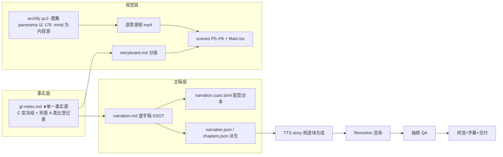

# 策划案：规划与协调：视野错位的五种修正手法（v1）

> 事实源：[gl-notes.md](../research/gl-notes.md)（C 型冻结快照，附录 A 类比登记表为口播类比唯一事实源）。本文件六节齐全；叙事要点全部回溯 gl-notes 节号。

## 一、定位表

| 维度 | 取值 |
|---|---|
| 平台 | B 站 / YouTube 中长视频（系列第 2 集，全系列恒定 14 分钟带） |
| 时长目标 | **[13.0, 14.6] 分**（硬约束；story 档 254 字/分口径 → 字数预算 3302–3708，规划 ~3480） |
| 形态 | AI 配音（story 段落演绎档 + 用户克隆音色）+ Remotion 代码动画 + archify 逐章图解（全屏独占），无真人 |
| 受众 | 不预设 ML/编程背景的普通人（智商在线的外行；「上下文」首现处配白话句，登记表纪律） |
| 核心范围 | gl-notes §1–§12 全量骨架：五失败现场 → 全景五挂点 → 五机制逐个走查（每个含具象输入走查 + 破坏性消融）→ 五规律两争议 → 边界；**不进入**记忆管理层（压缩管线本体）与任务系统（Out-of-Scope，§11） |

## 二、叙事策略

**Logline**：AI 长任务的五种失灵同根同源——看到的与需要的错位；这层给循环挂上五个装置，不改模型，改供给。

- **主线是一问一答的闭环**：开场五连失败蒙太奇（丢计划/过程淹没/知识全带/指令打架/一碰就崩）抛出「同一个病根是什么」→ 全景图揭示「模型每轮看到什么是被管理的」→ 逐装置回答「怎么修、凭什么说修好了」→ 收束回「五个装置背后是同五条工程规律」。
- **视觉母题统摄 + 局部类比准入**：全片连续感由**工坊剧场母题**（170 §2 角色台账，单射继承：台面=上下文窗口、工序卡=待办清单、副台=子代理、抽屉标签/手册=技能目录/正文、垫纸=system prompt、传送带=主循环、插线口=钩子）与**恒定循环锚**（陶土橙 #D97757 循环内核，M-001）统摄；口播局部类比只准入登记表三条（外包顾问/每日菜单/修打印机），1–3 句点亮直觉即切回机制画面，失配边界句随行；**本集新增视觉角色仅一个**：「分诊口」=包住模型调用步的恢复逻辑（避开「桌子」等防撞禁词，不与帮手/卡片系撞名）。
- **记忆点每 60–90 秒出一个，全部取自素材库**：P0 十步做完一二三步即兴 / 120 条消息 / 6500 行全带；P1 连续三轮唠叨一次、拆掉清零反而误提醒（0→1）；P2 主线消息 19↔2、外包顾问回执一页；P3 系统指令放大约四十七倍（128→5981）；P4 五次获取零命中 vs 一次组装四次命中；P5 退避 0.56s/1.00s/2.50s 三级递增、反复压缩 8 次 vs 1 次止损；P6 五规律金句收束。
- **理性收尾**：不贩卖「AI 会不会失控」焦虑；结尾落在「材料没证明的事」护栏卡（提醒本身是否提高完成率无对照实验；课程估算数字无方法学）与一个真开放的争议（隔离纯度 vs 缓存经济——两派账本不同、都对）。

## 三、视觉语言

- **色彩语义契约**（全片严格用色；qa --check-theme 复算 ≥4.5:1）：

| 色 | 值 | 语义（全片恒定） |
|---|---|---|
| core 陶土橙 | #D97757 | 循环内核——全系列恒定锚（M-001：循环始终不变） |
| coreDeep | #B45A3C | 循环内核描边/暗态 |
| mech 鸢紫 | #9C90EE | 本集五装置维度色（挂在循环外的机制） |
| mechDeep | #7A72C4 | 装置暗态/面板描边（对比度 4.53:1 实测） |
| 警示红 | #FF5C5C | 拆解态/故障/消融对比的「拔掉后」 |
| 确认绿 | #7ED321 | 机制在位/恢复成功/消融对比的「在位时」 |

- 深色底 #0E1116 系；金句卡衬线体；英文方法名（todo_write/task/load_skill/system prompt 等）只进角标不口播；公式（min(500×2^n,32000)）只作画面角标彩蛋。
- **五大构件→动态演绎映射契约**（①⑥ 消费，压字数时不许把具象过程删成抽象卡片）：
  1. SCQA+因果链 → **全景坐标**（pc2-panorama 全屏独占；每进一个机制幕，全景高亮当前挂点再放大——消除被动收看迷航）；
  2. 每机制 Worked Example → **单步具象输入流转**（五个走查原样保留：类型注解任务/查测试框架/SQL 规范加载/README 对话+记忆文件出现/429-529 序列，输入值穿装置、状态逐步变）；
  3. 破坏性实验 D1–D5 → **正反同屏消融对比**（警示红拆掉态 ↔ 确认绿在位态，退化数字动态标尺）；
  4. §8 数字表 → **带基线锚的动态标尺**（useCount，一句话读法直取）；
  5. §11 边界 → **护栏卡**（成立条件 + 材料没证明的事，P6 收尾）。
- 建模手册条目采用：M-001（恒定循环锚）、M-003（持续陈述配持续态）；防 X-001（空间隐喻逆旁白：高亮格与旁白主语逐镜核对）。

## 四、分幕结构表

| 幕 | 目标时间 | 主题 | 叙事要点（回溯 gl-notes） | 视觉锚点 |
|---|---|---|---|---|
| P0 | ~1.9 分 / ~460 字 | 五个失败现场 | 系列片头五层栈点亮本层；五失败蒙太奇各一拍（§1 表）；病根揭示「看到的与需要的错位」；总纲「不改模型，改供给」+ 全景五挂点首次亮相（§2） | HarnessStack 片头；五失败分格；pc2-panorama 全屏首亮 |
| P1 | ~2.0 分 / ~520 字 | 计划回到视野（M1） | 失败一回扣丢计划后，工序卡让计划可见（三态）；计数器三轮没更新就注入提醒；类型注解任务走五轮走查；拆掉清零消融出 0→1 误提醒；红线是不当持久任务系统（§3；D1） | 全景回照挂点①；工序卡装置；计数器刻度；D1 消融对比 |
| P2 | ~2.3 分 / ~580 字 | 大过程挪出去（M2） | 失败二回扣后，副台整段委托只回一页回执；隔离的是记忆而非权限与磁盘结果；防递归靠不给工具的结构防线；查测试框架走查对照 2 轮 vs 8 轮；拆隔离消融出 19↔2；外包顾问类比带失配句（§4；D2；三种子代理转述留 P6） | 全景回照挂点②；主线/副台双泳道时序；回执一页特写；19↔2 标尺 |
| P3 | ~1.8 分 / ~460 字 | 知识按需进场（M3） | 失败三回扣（6500 行全带）；抽屉标签常驻/手册按需的两级设计（§5）；SQL 规范走查：目录→点名→全文经工具结果进场；注入位置决定生命周期（进消息流会被裁）；D3 消融 128→5981 约 46.7 倍；边界：加载了又丢可再取（目录仍在） | 全景回照挂点③；抽屉装置；两级 token 对比；46.7× 标尺 |
| P4 | ~2.1 分 / ~540 字 | 指令按实况拼装（M4） | 失败四回扣（指令打架）；垫纸=运行时产物：分段（identity/tools/workspace/memory）+按真实状态拼装（§6）；README 对话走查：无记忆三段→状态未变缓存命中→记忆文件出现重组四段；确定性键 json.dumps 而非 hash()；两层缓存是两码事（本地拼串 vs API 前缀）【课程转述边界】；D4 消融：键被污染 5 组装 0 命中；每日菜单类比+失配句 | 全景回照挂点④；分段货架组装；缓存命中/失效双色；5/0 标尺 |
| P5 | ~2.2 分 / ~560 字 | 管线断了分类自愈（M5） | 失败五回扣（529 直接崩）；不盲重试先分诊：三条恢复路径（截断→升级 8000→64000 与续写≤3 / 超限→应急压缩留 5 条仅一次 / 瞬态→指数退避+连续三次 529 换模型）（§7）；账本 RecoveryState 记「每招还剩几次」；429-529 双序列走查（0.56s/1.00s/2.50s）；D5 消融：反复压缩 8 次 vs 1 次止损；修打印机类比+失配句（记账无对应须回工程术语） | 全景回照挂点⑤；分诊地图三路径；账本翻页；8↔1 标尺 |
| P6 | ~1.5 分 / ~370 字 | 五条规律与边界 | 五规律快闪收拢（注入位置定生命周期/只认真实状态/隔离是有损压缩/恢复必须记账/结构防线优于嘱咐，§10）；一个开放争议（隔离纯度 vs 缓存经济——两派账本不同）；护栏卡：三轮提醒是教学发明、提醒是否提高完成率无对照实验、估算数字无方法学（§11）；系列身份卡+下期卡 | 五规律金句条；护栏卡；系列五层身份卡+下期卡 |

字数合计 ~3480（窗内）；句均 20–24 字 → 约 150–170 句。

## 五、生产管线图

```mermaid
flowchart LR
    subgraph 事实层
        GL[gl-notes.md ★单一事实源<br/>C 型冻结 + 附录 A 类比登记表]
    end
    subgraph 文稿层
        N[narration.md 逐字稿 SSOT] --> C1[narration.cues.toml 配音台本]
        N --> B[narration.json / chapters.json 派生]
    end
    subgraph 视觉层
        SB[storyboard.md 分镜] --> SC[scenes P0–P6 + Main.tsx]
        AR[archify pc2- 图集<br/>panorama 以 176 .mmd 为内容源] --> RC[逐章录制 mp4]
    end
    GL --> N
    GL --> SB
    RC --> SC
    B --> TTS[TTS story 档逐块合成]
    TTS --> R[Remotion 渲染] --> QA[抽帧 QA] --> F[终渲+字幕+交付]
```

## 六、边界与不做的事

- **不讲记忆管理层与任务系统**：压缩管线、持久记忆、依赖图任务系统都是别层的装置——口播只用「别层的事」带过，不带任何他集标题与顺序词（反串线纪律）。
- **不讲 CC 产品行为作为既成事实**：三种子代理模式/Fork 缓存/十几种 transition 等全部【课程转述】，口播前三句内归属句、画面角标同步压「课程作者的源码分析」。
- **估算数字降级处理**：~100/~2000 token、99%、20–30KB 均为课程估算无方法学——口播带「课程作者的估算」或不点数；实测数字（19↔2、46.7×、8 次、0.56s 序列）为本集复算【一】级，可直接断言。
- **不做美术复刻**：课程站点 SVG 一律转文字规格重建（信息结构同构、视觉走本集契约）；不下载不嵌入站点图片。
- **BGM 留空轨**（系列一致的无配乐口径，AI 配音清晰度优先）；不引入新 Lottie 资产（ep4/5 headless ANGLE 挂死前科）；3D 只用系列装置层（HarnessStack）。
- **弧线数字口径**：s01=1→s08=9→s09=6→本层 3 全数已核可用；**禁用** s10 台账对 s01 的「3 个工具」失真说法（附录 C.4）。
