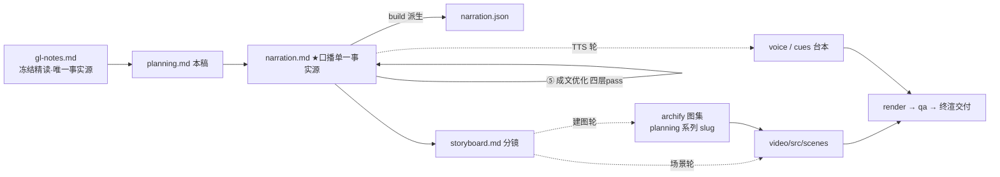

# 策划案：《规划与协调》（v3 · 剧本换代待审 · C 型信源 = gl-notes）

> 状态：v3 换代稿（2026-10-07）。旧剧本退场，本稿以 `research/gl-notes.md`（冻结自 docs/research/agent-harness/172 精读）为唯一事实源；标题候选与钩子选定均待人工复核。本轮到分镜为止，不涉 TTS / 渲染 / 场景代码 / archify 建图。

## 0. 候选新标题（待审核 · series.json 本轮不改，维持《规划与协调：模型的视野是安排出来的》）

| 候选 | 一句话理由 |
|---|---|
| A《规划与协调：它只看得见眼前一屏》 | 直取本集归因（每轮决策 ≈ 当轮可见文本的函数），与 p0-01 钩子同构，留存钩最强 |
| B《规划与协调：把目标顶回眼前》 | 落在 TodoWrite 的 nag reminder 这一最具体装置，动作感强，但只覆盖 P2 一幕略窄 |
| C《规划与协调：模型的视野是安排出来的》 | 现行标题（本集 GL 一句话定位的直译），信息完整但无新增留存点 |
| D《规划与协调：跑偏不是智力问题》 | 否定型反差，与 H3 钩子同构；风险是观众先入为主以为本集讲模型能力 |

## 一、定位表

| 项 | 值 |
|---|---|
| 平台 | B 站 / YouTube 中长视频 |
| 时长目标 | 13.0–14.6 分钟（pipeline.toml 硬约束窗；字数口径 254 字/分 → 3302–3708 字，目标 3400–3600 字） |
| 形态 | AI 配音（story 档待 TTS 轮重配）+ Remotion 代码动画，无真人 |
| 受众 | 不预设工程背景的普通人：见过 AI「干着干着就忘了最初要求」的任何观众 |
| 核心内容范围 | gl-notes §1–§11：「每轮看到什么」三通道视角 + 系统提示按状态组装（§1/§2/§6）、TodoWrite 计划外显（§3）、Subagent 过程隔离（§4）、Skill 两级加载（§5）、Error Recovery 分类恢复（§7）五机制精讲（各配原型走查与拆解实验）+ 五条底层规律收束（§10）；三个核心争议只取争议一（计划外显是补丁还是必需）一口，其余压进 P6 边界带过 |
| 系列位置 | 五集之二（工具与执行 → **规划与协调** → 记忆管理 → 并发 → 多 Agent）。承接姿态：循环骨架已立（无序号语义承接），本集回答「会干活之后怎么不跑偏」 |

**Logline**：会干活的 AI 干长活会跑偏，根源是它每轮只看当轮可见文本；五个外围装置把计划、知识、过程与错误全部安排进这份视野（gl-notes 一句话定位 + SCQA）。

## 二、叙事策略

**主线一问一答闭环**：开场抛问题——「循环已经跑起来了，为什么真把长任务交给它，做到第三步就开始即兴发挥」（SCQA）→ P1 揭示归因（模型每轮决策 ≈ 当轮可见文本的函数，换更聪明的模型修不好）并给出五装置全景 + 统一不变式 → P2–P5 四个机制幕逐个回答「这一类侵蚀怎么挡、凭什么说挡住了」（每幕配原型走查 + 拆解实验）→ P6 收束回「可见性即影响力」的工程规律，以「该丢的怎么丢」引出记忆问题（不预告机制细节）。

**开篇钩子候选矩阵（★ 待人工复核）**：

| # | 型 | 钩子文本（p0-01） | 吸引力留存逻辑 | 核心主干关联锚点 | 抛出的核心引子 |
|---|---|---|---|---|---|
| H1 | 归因颠覆型 ★ | 「这是 AI 干长活会跑偏的根本原因：它每一轮，只看得见摆在眼前的一屏文本。」 | 把「跑偏」从智力问题颠覆成视野问题，一句归因制造认知落差 | gl-notes §1 归因 + §10 规律一；P1 首拍立即拆解这句话 | 视野既然是安排出来的，谁在安排、怎么安排？ |
| H2 | 危机痛点型 | 「这是一个十步的任务，AI 做到第三步，就开始即兴发挥。」 | 观众自身经验的即时认领（谁没见过 AI 跑偏），数字反差留人 | gl-notes SCQA（snake_case 任务做到第三步即兴） | 它为什么会忘？谁把它拉回来？ |
| H3 | 反直觉否定型 | 「这不是模型不够聪明——再聪明的模型，也看不见不在它眼前的信息。」 | 否定式悬念（换更强模型修不好），直接打击默认解法 | gl-notes SCQA「这靠换更聪明的模型解决不了」 | 解法既然不在模型身上，在哪？ |
| H4 | 图纸型 | 「这是把跑偏的 AI 拉回正轨的五个装置：一张清单、一间会议室、一本目录、一副按状态拼装的提示、三条退路。」 | 「五个装置」全片结构预告，清单式承诺 | §1 五行规格表 ↔ 五机制一一对应 | 五件各是怎么造的、凭什么说有效？ |

★ 选定 H1（自动选定，待人工复核）。理由：与 GL 一句话定位同构（五章 = 安排「每轮看到什么」的五个侧面），被 P1 首拍立即兑现（不欠债），并与 P6 规律金句「可见性即影响力」形成首尾闭环；H2 留存力强但归因押后，并入 p0-03..06 作问题现场（两全）；H3 的否定句式留给 p0-08 承接；H4 清单句改写进 p0 末作路线预告。

**视觉母题与局部类比纪律**：全片连续感由视觉母题统摄（「视野窗」恒定几何锚 + 色彩语义 + 全景坐标），严禁把局部类比升格为贯穿剧场。口播类比只准入 gl-notes 附录 A 登记条目：本集拟用 #1 聊天群刷屏（P0）、#3 会议室与共用白板（P3）、#7 按需调页（P4）、#8 延展心智一句（P6「别考验记忆，考验摆放」）；#2 台面（※ 旧版隐喻系禁词）不进口播，机制改工程直陈（「汇合层」）；#4 欠债、#5 手稿/配置、#6 熄火的车如需引用均 1 句点亮即收、失配边界随行；每处 1–3 句点亮即切回。

**记忆点节奏**（约每 60–90 秒一个，全部取自 gl-notes §8 实证数字表与各机制节实测日志，数字必带基线标尺）：
P1「标准模式系统提示约 20–30KB，极简模式约 150 字符，差两个数量级」（§6【三】归属）→「关键词判据让一次闲聊误注入空记忆段，误报 0→1」（§6 E4）→ P2「拆掉提醒：完成 2/3 步、漂移动作 0→7 个」（§8 E1）→「阈值调到 1：提醒 6 次、对话 28 对 23 条」（§3）→「清单至多 20 条、进行中只许一条」（§3 main 轨）→ P3「主对话 4 条 / 147 字符，对照自己读 14 条 / 2626 字符」（§4）→「改回传全史，主对话 18 倍」（§8 E2）→「子代理描述合计超 15,000 tokens 启动即告警」（§4【二】）→ P4「6500 行规范，99% 与当前任务无关」（§5）→「目录约 100 tokens 常驻、全文约 2000 tokens 按需」（§5 课程估计口径）→「全文全内联：三轮总输入 8.3 倍，且随轮数放大」（§8 E3）→「真实产品把清单压在上下文的约 1%（上限 8000 字符，源码分析【三】）」（§5）→「15,000 tokens 告警与 1536 截断（官方文档【二】）」（§5）→ P5「输出额度 8K 升 64K、重试封顶 10 次、529 连挂 3 次换备用模型」（§7）→「一刀切重试：10 次全撞墙、白等 175.6 秒；分类路径压缩一次 0 秒恢复」（§8 E5）→「同一门课另一轨：16K、两次即切换」（§7）→ P6 五机制回看 + 规律金句。

**理性收尾原则**：不贩卖焦虑。P6 落在 gl-notes §11 的护栏上——教学数字无实验支撑、「不跑偏」的收益没有量化对照、课程深读的源码论断未锁版本——把悬念留在开放争议（争议一：模型规划能力够时，计划外显是多余打扰还是必需保险），再以「知识全文进了对话就一直在场，该丢的怎么丢」引出记忆问题（只点问题不预告机制）。

## 三、视觉语言

**色彩语义契约**（沿用系列契约：深色底 `#0E1116`；警示红 `#FF5C5C` = 漂移/反例/崩溃路径；确认绿 `#7ED321` = 机制在位/拦截成功；金句卡衬线体；公式/方法名只进角标）：

| 概念 | 专属色 | 语义 |
|---|---|---|
| 「每轮可见文本」视野层 | 鸢紫 `#9C90EE`（本集主题色） | 恒定视觉锚：同一「视野窗」母题全片反复出场，窗内内容随机制换装（〔M-001〕） |
| 计划与清单（TodoWrite） | 琥珀 `#E5B567` | 计划态：清单条、三态标记、提醒注入脉冲 |
| 隔离与结论（Subagent） | 青 `#64C4C0` | 过程态：子对话容器、结论回传单、白板（工作目录） |
| 知识与技能（Skill） | 天蓝 `#7FB2E0` | 知识态：目录行、全文展开、按需调页 |
| 恢复路径（Error Recovery） | 确认绿族 `#7ED321` 描边 | 韧性态：三路径分支、退避曲线、上界闸 |

构图纪律：全景坐标图（archify 母图）在换幕时高亮当前环节；对比实验一律左红右绿同屏（消融定式）；数字一律动态增长条 + 工况角标，禁搬多列大表。视觉母题禁旧版隐喻系意象（车间/作坊/传送带/工序卡/副台/台面/收台/叫号器/排工板/插线口/师傅及同族；gl-notes 附录 A#2「台面」因此不进口播），一律工程直陈：装置、结构、机件、管线、闸门、队列、清单、注册表、汇合层。

## 四、分幕结构表

| 幕 | 目标时间 | 字数预算 | 主题 | 叙事要点（回溯 gl-notes） | 视觉锚点 |
|---|---|---|---|---|---|
| P0 会干活之后 | 0:00–1:29 | ≈380 | 钩子 + 问题现场 | H1 钩子落 p0-01；无序号承接「循环已经跑起来了」（口径卡允许的语义承接；字数预算列为成稿实测回填，总 3561 字）；snake_case 任务现场：改文件、跑测试、修失败三步计划，做到修测试就被吸住，最初目标被忘（SCQA）；聊天群刷屏类比：记录还在、注意力只落最新一段 + 失配边界（人能回翻加重，模型注意力随长度摊薄）（§1、附录 A#1）；归因：跑偏是结构问题不是智力问题，换更聪明的模型修不好（SCQA）；路线预告：五个装置各管一类侵蚀（§1 表） | 冷启动直入：十步清单做到第三步开始分叉的进度画面；群聊刷屏意象一闪即收 |
| P1 每轮看到什么 | 1:29–3:42 | ≈560 | 三通道全景 + 系统提示按状态组装 | 归因落地：模型每轮决策 ≈ 当轮可见文本的函数；三通道 = 系统提示 + 对话列表 + 工具表（§1 前置概念）；「上下文」首现白话句；统一不变式：当轮可见文本须含完成任务所需的计划知识与规则、不含无关过程（§1 表）；第四、五个侵蚀源之一「提示硬编码失真」就地开讲：写死的提示加一段多一段、换项目整段重写（§6 开头）；解法三步：分段（identity/tools/workspace/memory）、按真实状态拼装（工具表实际注册了什么、记忆文件真存在才拼）、context 不变直接复用上次结果（§6）；走查 beat：episode D——同状态二次取提示命中缓存；闲聊「毫无记忆」提示不动；磁盘真出现记忆文件才多拼一段、113→154 字符（§6 原型日志）；消融 beat：E4 判据改关键词猜测，同一场闲聊误注入空记忆段 0→1（§6/§8）；生产对照一笔：真实产品三层缓存 + 静态/动态段切开，标准约 20–30KB 对极简约 150 字符（§6【三】归属 + 日期口径） | archify 母图首亮：鸢紫视野窗居中、三通道汇入；分段拼装动画；状态切换对比帧 |
| P2 计划顶回眼前 | 3:42–5:50 | ≈545 | TodoWrite | 机制两半：todo_write 带三态清单渲染回填对话 + nag reminder 计数器 3 轮不碰清单就注入一条提醒（§3）；它不执行任何东西，增加的是规划能力不是执行能力（§3 课程判断）；走查 beat：三步任务 t1–t9 时间线——更新、执行、被测试吸住连续三轮、t7 前提醒注入、t8 被拉回重建清单（§3 单步走查）；关键帧：吸收窗口（被一个环节吸住的轮次）把旧清单挤出注意力范围（§3）；消融 beat：E1 拆掉提醒——2/3 步、漂移动作 0→7、收尾失败；阈值当变量：调 1 提醒 6 次对话更啰嗦、调 999 与拆掉逐项相同（§3 原型日志）；两轨注入点一笔：站点轨注新 user 消息、main 轨追加进工具结果（§3）；main 轨校验：至多 20 条、进行中只许一条（§3）；争议引子：课程自认固定 3 轮是教学设定，真实实现没有固定轮数；官方口径「较新的模型默认不启用任务工具」（§3/§9 争议一【二】） | 琥珀清单条 + 计数器刻度；吸收窗口可视化（注意力区被挤占）；红绿消融对比 |
| P3 隔离与结论 | 5:50–8:02 | ≈560 | Subagent | 病灶：修一个 bug 读 30 个文件聊 60 轮，追踪调用链的中间过程理清后就没用了却一直占位（§1/§4）；机制：task 工具开子代理——全新对话列表只含任务描述、自己的循环、独立子提示「直接完成不再委派」；基础五件工具唯独没有 task，递归深度一层（§4）；走查 beat：找测试框架 6 份文件——子代理内部 15 条自生自灭，主对话只多 2 条；4 条/147 字符 对 自己读的 14 条/2626 字符（§4 实测）；消融 beat：E2 改回传全部子历史，主对话 16 条/2649 字符约 18 倍（§4/§8）；边界一：丢弃的是对话不是工作成果，文件副作用落在同一工作目录（会议室与共用白板，附录 A#3）；边界二：子代理每次工具调用照样过权限钩子，rm -rf 被拦下继续干活（§4 episode B）；生产对照：Fork 模式构造字节级一致前缀为省钱省时【三】；官方「子代理在自己的上下文窗口里干活只返回摘要」、自建子代理描述合计超 15,000 tokens 告警（§4【二】） | 青色子对话容器与主对话对照；结论回传单；红绿 18 倍对比条 |
| P4 知识按需 | 8:02–10:31 | ≈635 | Skill Loading | 病灶算账：React 规范 2000 行 + SQL 1500 + API 3000 = 6500 行全塞系统提示，改 CSS 也每轮带着，99% 无关；系统提示每轮请求全额计费（§5）；两级设计：目录常驻（启动扫描 frontmatter 进注册表，目录行每轮在场）+ 全文按需（模型点名才加载，按名查找不走文件路径）（§5）；走查 beat：episode C——首轮系统提示 281 字符其中目录只占约两百；第二轮点名加载 SQL 规范、全文进场一次，下一轮涨到 2384；第三轮起全文已在历史不再重复（§5 原型日志）；消融 beat：E3 全文全内联——系统段 281→8370、三轮总输入 3059→25323 约 8.3 倍，且常驻成本按轮计费倍数随轮数放大（§5/§8）；全文去向：不进系统提示、进对话历史，后续每轮都在场，只有压缩截断会话结束才清出（§5——下期引子的锚点）；按需调页类比：常驻集要小、缺页才按需调 + 失配边界（§10 规律三、附录 A#7）；生产对照：真实产品十类来源、清单压在上下文约 1%（上限 8000 字符）、描述截断 1536 字符【二】+ 深读【三】（§5） | 天蓝目录行 vs 全文档案；按需调页一闪；8.3 倍增长条（双柱+轮数放大箭头） |
| P5 分类恢复 | 10:31–12:40 | ≈545 | Error Recovery | 病灶：一次 529 过载直接崩溃，不重试不换路（§1/§7 引语级熄火一句）；三路径：截断→先升额度 8K→64K 原样重发、不够才存半截注入续写提示至多 3 次；超限→先压缩再重试、压缩过一次还超就退出；瞬态→指数退避 500ms 起步翻倍封顶 32 秒 + 0–25% 抖动错峰、Retry-After 优先、529 连挂 3 次换备用模型（§7）；走查 beat：episode E 虚拟时钟——529、529、429 三次瞬态共 3.7 秒后成功未换模型；三连 529 第三次触发切换（§7 原型日志）；消融 beat：E5 一刀切重试——超限也当瞬态原样重发，10 次全撞墙白等 175.6 秒，分类路径压缩一次 0 秒恢复；容量错误重试不减规模（§7/§8）；有界金句：每条路径都有上界，恢复机制自己不能变成新的死循环（§7）；同课两档参数一笔：另一轨 16K、重试 3 次、529 两次即切换——常数是调参不是机制必然（§7/§9 争议三） | 三路径分支图（绿描边）；退避曲线 + 抖动散点；红绿时间轴对比 |
| P6 规律与边界 | 12:40–14:01 | ≈345 | 收束 | 五机制回看：管的都是同一份「每轮可见文本」——计划顶回、过程挡外、知识按需、提示按状态、错误分类救回（§2/§10）；金句一：可见性即影响力，被稀释等于缺席（§10 规律一）；金句二：别考验记忆，考验摆放（§10 规律二延展心智工程版，附录 A#8）；边界护栏：教学数字无实验支撑、「不跑偏」收益无量化对照、深读源码论断未锁版本（§11）；开放争议：模型规划能力够时计划外显是打扰还是保险，答案随版本漂移（§9 争议一）；下期引子：知识全文进了对话就一直在场——该丢的怎么丢、该留的怎么留（§5 衔接句，只点问题不预告机制） | 全景图回归五装置点亮；金句卡（衬线体）；边界护栏卡；下期卡（视觉层） |

## 五、生产管线图

```mermaid
flowchart LR
    A[gl-notes.md<br/>冻结精读·唯一事实源] --> B[planning.md 本稿]
    B --> C[narration.md ★口播单一事实源]
    C -->|build 派生| C2[narration.json]
    C -->|④ 真实性+易懂性| C
    C -->|⑤ 成文优化 四层pass| C
    C --> D[storyboard.md 分镜]
    D -.->|场景轮| E[video/src/scenes]
    D -.->|建图轮| F[archify 图集<br/>planning 系列 slug]
    C -.->|TTS 轮| G[voice / cues 台本]
    E --> H[render → qa → 终渲交付]
    F --> E
    G --> H
```

本轮产物止于 D（虚线节点为后续轮次，本轮不动）。

## 六、边界与不做的事

**系列递进边界（照抄口径卡，ep② 不进入）**：压缩管线与持久记忆（下期本体——收尾只以「该丢的怎么丢」点出问题引子，不预告机制细节）、任务系统与团队（更后）、分布式多机协调；goal 闸门只作附录级一笔（判断整个目标是否完成的关卡），不展开——本轮全片不出现该闸门正片内容，仅在 gl-notes 附录留档。

**开场装置衔接（场景层已有，剧本只做衔接）**：系列统一片头装置 leadInSec=23.5（705 帧 @30fps），口播 12 帧起播；片头三句口播固定在 narration SSOT 之外，剧本任何位置不复述、不改写；P0 冷启动直入本集钩子（不重复系列介绍、不自我介绍）；字数预算 3400–3600 不含开场。承上集语义承接仅限 P0 一两句「循环已经跑起来了」式无序号表述（口径卡明文允许；顺序词本身禁用）。

**口播红线**：禁旧版隐喻系词汇及同族意象（车间/作坊/传送带/工序卡/副台/台面/收台/叫号器/排工板/插线口/师傅——gl-notes 附录 A#2「台面」因此不进口播，改「汇合层」工程直陈）；禁顺序词（上一集/上集/上期/下一集/下集/第 N 集/前一集/本系列），收尾预告只许「下期」；观众可见层零信源站标识（不出现课程/站点名/章号，归属句用「拆过 Claude Code 源码的作者」句式）；【三】级断言前 3 句内必带归属句；活数据（star/章节数）不进口播；Harness 不翻译（口播英文例外清单 = Claude Code + Harness）；「上下文」首现带白话句；英文方法名（todo_write / task / load_skill / stop_reason / prompt_too_long / Retry-After 等）进角标不口播。

**本轮不做的事**：不跑 TTS、不动场景代码与 series.json / pipeline.toml / video/**（例外：build 派生的 video/src/chapters.json，幕标题随新稿再生）、不建 archify 图（storyboard 只写图意与预定 slug，不挂覆盖门 cue）；三个核心争议只取争议一口，争议二（隔离粒度）压进 P3 Fork 一句带过、争议三（恢复预算）压进 P5 两档参数一句带过，均不展开——深度优先，砍掉的收尾一句话带过；两轨差异不进正片主线（s10/s11 双轨分歧只在对应幕以「另一轨取值不同」一笔落地）；BGM 留空轨；论文外观点不进口播。
