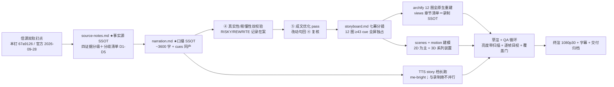

# Stage ② 策划案 ——《规划与协调：模型的视野是安排出来的》（题已定，三处已同步）

> 事实源（一切口播断言的回溯终点）：[research/source-notes.md](../research/source-notes.md)（B 型·单一事实源，钉 67a9126（本集五章）／官方文档 code.claude.com@2026-09-28；main@0dcafa2 仅作「演进注记」对照，凡引以本钉为准）。
> 叙事蓝本：[172 精读章](../../../../../docs/research/agent-harness/172-claude-code-planning-coordination.md)（M1–M5 机制叙事＋轨 C 对照 11 条＋批判边界五条）。类比 SSOT：[170 §2 角色台账](../../../../../docs/research/agent-harness/170-claude-code-harness-overview.md)（通宵工坊剧场·全篇单射；制作期输入 `.temp/learn-cc-lab/analogy-plan.md` 与 `.temp/learn-cc-lab/dims/planning-brief.md` 不作持久引用）。
> 六节节名按 to-video skill 的 references/02-planning.md 规格；第 0 节为本次重制的拟题决策附加节。视觉契约落点：[theme.ts](../video/src/design/theme.ts)（本集维度色紫已落位）；系列装置数据源：[series-layers.json](../video/src/series-layers.json)；可执行参数：[pipeline.toml](../pipeline.toml)。

## 0. 标题定案

题已定：**《规划与协调：模型的视野是安排出来的》**（14 字，维度名前缀＋机制判断句，合 ep1 立下的后四集句式建议）。系列五维重制启动时裁定，**三处已同步一致**——`series.json` 本集 `title`、`video/src/series-layers.json` layers[1].title、P6 身份卡受检硬编码（规则 8 按「：」后主段对账，Stage ⑥ 实现时落地核验）；`cardSub`「规划与协调 · 视野」（已随裁定落 series.json）。无待决项，本节不列候选。

## 1. 定位表

| 项 | 值 |
| --- | --- |
| 平台 | B 站 / YouTube 中长视频 |
| 时长目标 | 硬窗 [13.0, 14.6] 分；**254 字/分含停顿口径**（ep1 CP1 实测校准值）定位 **3,600 字（±60）≈ 14.2 分**——直接按 254 写足，不走「按 280 写完再减脂」的回头路（ep1 教训：3,963 字减脂 319 字才落窗）。**执行前提**：`pipeline.toml` 须补 `chars_per_min = 254`（当前 TODO 未填，skill 默认 280 会把 3,600 字估成 12.9 分、低于下限 13.0 误判 FAIL——先改参数再跑估算门）。风险预案：story 档 manifest 实测若再度偏窗，沿 ep1 先例「补内容不注水」——优先序 = P5 官方对照段 / P2 官方边界句，素材已在 notes |
| 形态 | AI 配音（story 段落演绎档＋克隆音色 me-bright）＋ Remotion 代码动画（2D 为主＋3D 系列装置）＋ archify 12 图**全原生重建**全屏独占逐章回放；无真人 |
| 受众 | 不预设背景的工程师观众：天天用 Claude Code（或任一 coding agent）、见过它列任务单、派子窗口、挂技能文件，但没想过「它每一轮看见的东西是谁摆上去的」的人 |
| 核心范围 | 五机制主线全入片：待办工序卡（M1）／子代理副台（M2）／技能两层渐进披露（M3）／系统提示装配（M4）／错误恢复补救梯（M5）＋轨 C 硬校准（分歧 D1/D2/D3 全处置、干净≠空、两条预算路径方向相反、规划能力＞规划工具收束）＋两条总规律（视野是被安排的／补救本身也要有闸） |
| 明确砍掉 | fork 三种执行模式与缓存细节（【三】不可核验面大＋字数紧；官方「免重述现状」动机句留 P2 可选池不承诺）；任务图（V2）机制本体（归第五维度集，本集只留「两套并存」口径半句）；「收台四步」压缩与记忆整合（第三维度集，本集只留「手册会被收掉」接缝一句）；退避精确公式与延迟表（两版指数口径并存，只定性＋官方十次上限）；17 行 reason/transition 全表（只讲三类骨架）；【三】文件行号级断言一律不进口播（负向清单）；本集五章之后的一切机制（后续各归各集，口播零预告） |

## 2. 叙事策略

**剧场（单一世界观，全片唯一）**：通宵不打烊的工坊——模型是手很快但从不记事的师傅，harness 是工坊本身。本集五角色严格沿 170 §2 台账单射：**台面**＝上下文窗口（本集主舞台）／**工序卡**＝待办清单／**副台**＝子 agent（只带回一张回执）／**抽屉标签与抽屉里的手册**＝技能目录与正文／**垫纸**＝system prompt；M5「补救梯」为 172 章自设比喻（传送带旁三级梯子，每级自带一道闸），与台账既有角色零撞义。「传送带」「门禁」为已建角色复用（P0 复述半句即出场，不涉任何顺序词）；三条防撞规则原文有效（台账第一条的通名禁用词全程回避、四个帮手不混用、三类卡片不同名）；类比每处 1–3 句即止、只承担结构同构不承担性能等同。

**主线问题（钩子→悬念→回答）**：
- 钩子（P0）：「它每一轮看到的东西，是谁决定的？」——师傅手快不记事，每轮开工把台面从头读一遍；看见什么不由师傅决定，由台面上摆了什么决定。台面以四种方式坑聪明的师傅：规矩被摊薄／过程长住台面／知识全额付费／一次事故整轮白干（第五件不安排台面、保住台面）。
- 悬念（P1–P5）：五件东西各管一环——工序卡把「还剩什么」钉回可见面（救注意力不救能力）；副台隔走过程只放结论上台（但隔离的是台面不是门禁）；抽屉把「知道有什么」与「读到内容」拆成两笔账（标签与手册寿命不同）；垫纸每轮按真实状态重铺（事实不是文本）；补救梯三级三闸（先判断后落笔）。另有一条副悬念线贯穿：**三连口径反转**（P1 任务工具默认态 →P2 派生递归默认 →P5 过载切模型）——「拆源码时的结论」与「官方现行口径」三度相撞，每幕一撞，构成「教学叙事 vs 产品现状」的节奏骨架。
- 回答（P6）：看见什么，从来不是它自己说了算——想什么是师傅的本事，看见什么是工坊的安排（本集遗产句）。

**记忆点节奏（约 60–90 秒一个，全片 14 个，全部可溯源 notes／brief §6 锚句白名单）**：锚句白名单——「它不增加动手的本事，只增加记得住的本事」／「它救的是注意力，不是能力」／「一次失败的更新，不会留下半张卡」／「副台只带回一张回执——回执上不写它有没有干完」／「隔离的是台面，不是门禁」／「干净上下文不等于空上下文」／「按名字取手册，所以没有路径可以骗它」／「手册会被收掉，标签不会」／「垫纸每轮重铺，看的是真实状态，不是你这句话」／「装配的依据是事实，不是文本」／「判断必须抢在落笔之前」／「顺序本身就是正确性」／「错误不是终点，是重试的起点——但每条退路都自带一道闸」／「看见什么，从来不是它自己说了算」。

**理性收尾原则**：不贩卖焦虑（错误叙事只讲机制与止损哲学，不渲染失控想象）；不裁决「规划外置 vs 内化」路线分歧（D1/C3——脚手架该随模型进步拆除还是本该永久存在，官方自己两头留后手）；「待办清单减少跑偏」一律以**设计主张**口径讲（负向清单：无对照实验、无漂移指标、无成功率数字），不伪装成测量结论。

## 3. 视觉语言

**色彩语义契约**（沿用 [theme.ts](../video/src/design/theme.ts) scaffold 既有系列键，跨幕严格用色；本集维度色紫已落位，不新增色相）：

| 概念 | 键 | 值 | 语义（全片唯一） |
| --- | --- | --- | --- |
| 传送带／循环内核 | core | `#D97757` | **全系列恒定**——「循环始终不变」视觉锚〔M-001〕；本集戏份收窄为底盘背景＋P5 事故现场 |
| 安排视野的装置（工序卡／副台／抽屉／垫纸／补救梯） | mech | `#9C90EE` | **本集维度色（紫）**：五件「安排台面」的东西一律紫——本集总命题「视野是被安排的」＝紫色装置群作用于台面 |
| 机制深态（装置暗态／描边深档／3D 层板 lit 面） | mechDeep | `#7A6BC9` | mech 深档 |
| 台面（上下文窗口）主视觉描边 | coreDeep | `#B45A3C` | 被安排的「底座」用 core 深档——与装置紫形成「底／装」对比，防与 mech 撞义 |
| 事故／硬失败／一次性闸命中 | deny | `#EF6461` | 拒绝与危险唯一语义（P5 主用：截断掐口／闸门落锁） |
| 师傅（翻版）／用户／过程数据 | text 白／dim 灰 | `#F2F5FA`/`#9AA7B8` | **装置才有颜色**：非装置皆无彩（同 ep1 纪律；副台上的师傅翻版同为无彩剪影） |
| 恢复成功／重发通过瞬态 | ok | `#7ED321` | 仅确认瞬间的瞬时绿（底座纪律） |

恒定空间契约（防〔X-001〕空间逆旁白）：**台面恒居画面中央**（coreDeep 描边大矩形——本集恒定主视觉，继承 ep1「内核左中」锚位法并换主角：执行层的锚是循环，本层的锚是台面）；五装置自右缘／上缘依次挂入（mech 紫），「安排台面」的动效永远作用于台面内容物（增／删／换），不触碰装置自身形体；师傅剪影（text 白无彩）立于台面后侧。金句卡衬线体（theme.serif）；代码实景只进画面角标与实景卡（mono 等宽＋引语卡引语态），不进口播。

**3D 视觉语言（@remotion/three 路线，控制面积）**：
- **P0 与 P6 用 3D 层板（HarnessStack）作系列装置**：P0 五层栈落板→规划与协调层点亮呼吸→缩退为顶边常驻条（HarnessBadge，P1–P6）；P6 p6 档放大收束。
- **正文幕（P1–P5）以 2D＋archify 全屏独占为主**，3D 母题点缀限两处（候选：P2 副台升起 solids-3d／P5 补救梯展开 LottieEmphasis·ladder-unfurl；Stage ⑥ 定）。理由同 ep1：ISSUE-177（chip 塌缩重叠）／180（同色面 3D 只剩棱线）／182（层序只对 z 一维）全部集中在 3D 段——**控制 3D 面积＝控制回归面**。

**系列横切装置**：顶边常驻条（HarnessBadge chip 档，层短名走 series-layers.json 数据）＋ P6 系列身份卡与下期卡（标题主段走规则 8 受检硬编码，数据对账 series-layers.json ↔ series.json；下期＝记忆管理维度）。

**archify 图集预算（12 图全原生重建，6 型，命名循 `claude-code--{slug}.html`）**：docs 既有同名题材产物（planning-panorama 等）一律走**原生重建**，不留 html_overrides 通道——ep1 教训：旧格式回填不可用，复用即返工。图集表：

| # | slug | 型 | 幕 | 内容要点（回溯 source-notes） |
| --- | --- | --- | --- | --- |
| 1 | todo-card-states | lifecycle | P1 | 三态流转＋终端图标区分（§一·机制 2；官方对齐 C4） |
| 2 | todo-swap-nag | workflow | P1 | 整表替换＋先校验后替换＋提醒回路计数归零（§一·机制 1/3/4） |
| 3 | side-desk-anatomy | architecture | P2 | 副台解剖：全新台面／单条回执／同工作区副作用（§二·机制 1/2/3） |
| 4 | side-desk-guards | state | P2 | 门禁照走＋轮数上限回溯兜底、回执同形（§二·机制 5/6） |
| 5 | skill-two-layers | dataflow | P3 | 两层渐进披露：标签常驻垫纸／手册按需入对话（§三·机制 1） |
| 6 | skill-registry | workflow | P3 | 启动扫描注册表＋按名查找（穿越顺带消掉）（§三·机制 2/5） |
| 7 | skill-lifespan | lifecycle | P3 | 手册随历史被清／标签常驻（与记忆维度的接缝；§三·机制 7） |
| 8 | prompt-sections | architecture | P4 | 分段定义＋始终段／按需段两类策略（§四·机制 1/2） |
| 9 | prompt-state-cache | workflow | P4 | 真实状态选段＋确定性缓存键、循环内重估（§四·机制 3/4/5） |
| 10 | recovery-ladder | state | P5 | 三级梯三类失败分治＋各层一次性闸（§五·机制 1–6） |
| 11 | truncation-before-write | sequence | P5 | 先判断后写入：截断路径顺序即正确性（§五·机制 1 顺序防护） |
| 12 | planning-panorama | architecture | P5 | 本维度总装全景（planning-panorama 题材原生重绘版；左半「这一轮看见什么」／右半「出错后怎么接着来」） |

cue 预算 ≥43（密度门 3.0/分 × ~14.2 分），锚定率门 0.30。

## 4. 分幕结构表（七幕；字数已按 narration.md v1 定稿实测回填，254 口径）

| 幕 | 目标时间／字数 | 主题 | 叙事要点（回溯 source-notes） | 视觉锚点 | 记忆点候选 |
| --- | --- | --- | --- | --- | --- |
| P0 | ~1.25 分／316 字 | 钩子·每轮从头读 | ①主线问题起手：「它每一轮看到的东西，是谁决定的？」；②剧场重建（自含、零顺序词）：工坊＋师傅（手快不记事）＋Harness 一句＋传送带与门禁半句（170 §2）；③不记事的机制含义：每轮开工把台面从头读一遍（总规律）；④四坑快闪：规矩被摊薄（十步重构做到第四步即兴，§一·定位与标语）／过程长住台面（探线索翻十个文件，§二·定位与标语）／知识全额付费（三份规范印死垫纸，§三·定位与标语）／一次事故整轮白干（过载直接崩，§五·定位与标语）；⑤立碑：答案不是更聪明的师傅，是五件安排台面的东西——看见什么，从来不是它自己说了算 | HarnessStack P0 3D 五层栈落板→本层点亮呼吸；主问题字卡（「谁」字 mech 紫点睛）；四坑四联卡快闪（摊薄／长住／全付／白干）；五装置预告剪影（mech 紫 ×5 挂入中央台面）；角标 `context window` | 「每一轮，都把台面从头读一遍」；「看见什么，从来不是它自己说了算」（预告态） |
| P1 | ~2.25 分／568 字 | 工序卡·救注意力 | ①痛点定性：跑偏不是变笨，是工具结果堆满台面、开工嘱托被摊薄（§一·定位与标语）；「跑偏减少」以设计主张口径讲（负向清单）；②第 6 号工具零执行副作用：不读文件不跑命令，只存内存画进度——增加的是规划能力不是执行能力（§一·机制 1）；③改卡的规矩很轴：整表替换＋先校验后替换，失败不留半张卡（§一·机制 3）；④三态流转＋图标区分（§一·机制 2）；⑤提醒回路：计数达阈值借用户口吻递条子、发出即归零（§一·机制 4）＋教学版自陈（产品源码无固定轮数，负向清单）；⑥三连反转之一 D1：【三】两套并存、交互式默认任务图（归属句＋时间状语）→【官】老卡默认禁用、四 Task 工具接管、新模型两套全关（C1/C2）＋理由「工具定义与提醒反而占上下文」（C3）；⑦M1 收束：规划能力＞规划工具＋plan mode 产品锚（C6：批准前一个字不落盘） | 工序卡钉上动效（mech 紫卡钉入台面上缘，coreDeep 台面恒静）；三态图标卡（空格／▸／✓）；改卡仪式（整张换新／验货失败作废）；D1 反转对撞卡（拆源码侧 vs 官方侧）；archify: todo-card-states＋todo-swap-nag | 「它不增加动手的本事，只增加记得住的本事」；「它救的是注意力，不是能力」；「一次失败的更新，不会留下半张卡」；「规划能力还在，规划工具在退场」 |
| P2 | ~2.3 分／584 字 | 副台·过程与结论分离 | ①痛点：上下文污染叙事（三十个文件、六十轮、一百多条，§二·定位与标语）；②副台机制：全新台面只放一张任务条子、跑自己的循环（§二·机制 1/7）；③只回一张回执：中间过程全部丢弃、当场作废（§二·机制 2）；④三条边界逐条划清：隔离的是对话不是世界（同工作区副作用保留，§二·机制 3）／隔离的是台面不是门禁（照过门禁，§二·机制 5）／副台上没有再支副台的工具（防递归写在能力里，§二·机制 4）；⑤三连反转之二 D2：【三】派生工具默认在禁用名单→【官】默认可再派、最深三层（C14）；⑥撞上限形态：倒序回溯找最近一段话当结论、兜底句可区分、回溯命中与正常收敛同形（§二·机制 6）；⑦官方双边界：干净上下文不等于空上下文（C11：项目嘱托＋代码状态快照）／隔离的是过程不是结果（C17：回执占台面、子代理自己花钱） | 副台升起动效（solids-3d 母题一现，mech 紫台体）；回执卡（单张纸跨过台面边界，过程碎纸留副台）；三条边界三联卡；回执同形演示（正常收敛／撞墙回溯两路径汇成同一形态）；archify: side-desk-anatomy＋side-desk-guards | 「副台只带回一张回执——回执上不写它有没有干完」；「隔离的是台面，不是门禁」；「干净上下文不等于空上下文」 |
| P3 | ~2.2 分／557 字 | 抽屉·知道与读到分账 | ①痛点反例：三份规范全拼进垫纸、摞起来六千多行、九成九无关每轮全付（§三·定位与标语，叙事口径数字）；②两层分离：标签常驻（便宜，百字量级）／手册按需（贵一个量级）——知道有什么与读到内容在时间上拆开（§三·机制 1）；③启动扫描注册表＋按名查找：压根没有拼路径这一步，穿越被设计顺带消掉（§三·机制 2/5）；④两层寿命差：手册进对话随历史往后走、清台时在被清之列，标签印在垫纸每轮都在（§三·机制 7）——与记忆维度的接缝；⑤官方配套数字定性引：清后重贴每本留开头一段、合计封顶——按需加载与及时清理是配套机制不是替代关系（C23）；⑥官方延伸一句：子目录惰性＋外部工具定义默认先收着（C24/C30） | 工具柜抽屉矩阵（标签亮 mech 紫／抽屉开）；按名查找演示（名字→注册表→手册，无路径分支可走）；生命周期分屏（手册随历史淡出 dim／标签恒在 mech）；archify: skill-two-layers＋skill-registry＋skill-lifespan | 「按名字取手册，所以没有路径可以骗它」；「手册会被收掉，标签不会」 |
| P4 | ~2.0 分／503 字 | 垫纸·事实不是文本 | ①术语挂钩：垫纸＝系统提示（师傅每轮开工读的第一张纸）；②写死的三种死法：换项目整张重写／改一处牵全身／每轮全量在场白付费（§四·定位与标语）；③改法拆开：分段定义独立维护＋按需拼接、始终段与按需段两类策略（§四·机制 1/2）；④关键设计规则：铺不铺记忆段看文件在不在、不看话里提没提——事实 vs 猜测（§四·机制 4，全层最值得记的一条）；⑤循环内重估＋确定性缓存键：排序序列化当键，不用语言内置哈希（逐进程随机、对付不了列表字典）（§四·机制 3/5）；⑥最硬官方锚 C26：项目嘱托以系统提示之后的用户消息送达、不属于系统提示本身；⑦官方量化门槛一句（C28 开头两百行） | 垫纸重铺仪式动效（每轮翻页）；分段拼装演示（段落块按状态点亮／熄灭）；「事实 vs 猜测」分屏（左问文件系统／右扫消息文本打叉）；缓存命中卡；archify: prompt-sections＋prompt-state-cache | 「垫纸每轮重铺，看的是真实状态，不是你这句话」；「装配的依据是事实，不是文本」 |
| P5 | ~2.7 分／684 字 | 补救梯·有界恢复 | ①痛点：早期版本过载直接崩（不重试不换模型就地熄火）＋生产环境报错是常态（§五·定位与标语）；②三种摔法：截断／超长／瞬态（§五·定位与标语）；③分治结构：三层不同层——内层管瞬态、外层兜异常、截断要等响应拿到后看停止原因（§五·机制 6）；④截断路径精妙：首次抬预算原样重发（残话不写进记录）——判断必须抢在落笔之前，顺序本身就是正确性；再截断才续写且有限次（§五·机制 1 顺序防护）；⑤超长路径：应急压缩一次性闸——再压也不会变小（§五·机制 2）；⑥瞬态路径：指数退避＋随机抖动（防同刻重试雪崩）＋官方最多重试十次（§五·机制 3；C32）；⑦过载切备用：教学版兜底（配了就切、没配清零继续等）（§五·机制 4）＋三连反转之三 D3：【三】连续三次自动切→【官】重试烧完提示手动换、自动切换仅配置降级链时发生（C35/C36）；⑧两条预算路径方向相反：官方输入侧降档 vs 本集输出侧升档，别混着引（C34）；⑨不可恢复退出协议（记日志＋写回＋退出不裸崩，§五·机制 7）＋官方 thrashing 同构（C39：反复填满即停手报错不在原地打转） | 三级梯空间装置（mech 紫三级＋闸门 deny 红落锁，梯级次序锁死）；顺序动效（先判断后写入的时序箭头，写在前打叉）；退避时间轴（间隔指数拉长＋抖动散点）；D3 对撞卡；两路径方向对开图（输入侧降／输出侧升）；archify: recovery-ladder＋truncation-before-write＋planning-panorama | 「判断必须抢在落笔之前」；「顺序本身就是正确性」；「错误不是终点，是重试的起点——但每条退路都自带一道闸」 |
| P6 | ~1.55 分／395 字 | 收束·视野是安排的 | ①回答主线问题：五机制收账各一句（钉回／隔走／分账／重铺／保住）；②五件东西没有一件给师傅添过新本事——改变的全部事情只有一件：每轮开工时他看得见什么（总规律）；③遗产句：想什么是师傅的本事，看见什么是工坊的安排——看见什么，从来不是它自己说了算；④开放问题不裁决：清单这类脚手架该随模型进步逐件拆掉、还是本来就长在工坊身上（D1/C3 路线分歧；官方关掉工具却留计划模式与能存住的任务——两头留后手）；⑤系列装置收尾：三个区没亮灯＋下期（记忆维度：台面装不下的事——该丢的怎么丢、不能丢的放哪儿），口播只说「下期」 | HarnessStack p6 档 3D 放大＋系列身份卡（chip 档）＋下期卡；五装置对账卡（mech ×5 逐一打钩，台面 coreDeep 恒静）；金句卡衬线体终态〔M-003〕 | 「看见什么，从来不是它自己说了算」；「想什么是师傅的本事，看见什么是工坊的安排」 |

合计 **3,607 字 ≈ 14.2 分** @254（硬窗 [13.0, 14.6] 内；Stage ③ 定稿实测 169 句、句均 21.3 字、超 35 字句 0；14 个记忆点 ≈ 每 61 秒一个）。

## 5. 生产管线图

```mermaid
flowchart LR
    A[信源双轨钉点<br/>本钉 67a9126 / 官方 2026-09-28] --> B[source-notes.md ★事实源 SSOT<br/>四证据分级＋分歧清单 D1-D5]
    B --> C[narration.md ★口播 SSOT<br/>~3600 字 + cues 同产]
    C --> D[④ 真实性/易懂性双校验<br/>RISKY/REWRITE 记录在案]
    D --> E[⑤ 成文优化 pass<br/>改动句回 ④ 复核]
    E --> F[storyboard.md 七幕分镜<br/>12 图 ≥43 cue 全屏独占]
    F --> G[archify 12 图全原生重建<br/>views 章节清单＝录制 SSOT]
    F --> H[scenes + motion 建模<br/>2D 为主 + 3D 系列装置]
    C --> I[TTS story 档长跑<br/>me-bright；与录制绝不并行]
    G & H & I --> J[草渲 + QA 循环<br/>亮度带扫描 + 逐帧目视 + 覆盖门]
    J --> K[终渲 1080p30 + 字幕 + 交付归档]
```

## 6. 边界与不做的事

- **BGM 留空轨**；本片 zh 单语（英文版触发条件＝用户明确要求）。
- **规则 7 匿名化**：口播／画面备注／分镜／场景组件禁信源标识族与全部强标识词（词表以 check_series.py 规则 7 常量为准，含章号词形）——**画面备注同样不许出现章号**（ep1 教训：备注里的章号形也要匿名化，一律用章全称或 source-notes 节号「§一…§五」表述）；指称信源一律「这个开源项目／这个教学项目」；【三】归属句模板：「这个开源项目的作者拆过真实实现后说……」（本集 3 处，D1/D2/D3 各一，另两处拆源码引语带「拆当时的源码」时间状语）；【官】断言表述为「官方文档明写／说……」。
- **活数据不进口播**：本钉常数（提醒轮数阈值、子代理轮数上限、续写次数、重试封顶、过载切换阈值、输出预算升档幅度、应急保留条数）一律定性表述；**官方数字**（重试上限十次、派生最深三层、记忆开头两百行）带「官方文档」引语态可引；README 叙事反例数字（十步重构、三份规范六千多行、三十文件六十轮）属教学叙事口径可引，不冒充系统参数。
- **英文标识符只进画面角标**（todo_write／task／load_skill／messages／stop_reason／max_tokens／429／529／Retry-After／CLAUDE.md 等，口播用中文机制名）；可口播的英文词仅 Claude Code 与 Harness（术语规范），本稿口播英文收敛到 Harness 一处，其余零英文口播。
- **分歧处置默认规则**：拆源码结论 vs 官方口径，取官方轨并双方并记，拆源码侧带时间状语（D1/D2/D3）；README vs code 以 code.py 为准（D4/D5）；退避公式指数两版并存，只定性不引公式、引用须注明版本（负向清单）。
- **反串线（规则 1）**：口播不出现他集标题、集数序号或任何回看类顺序词（词形以 check_series.py 规则 1 常量为准）；「下期」仅收尾语与下期卡一次；「工坊还有三个区没亮灯」属机制陈述可用（不作集数指涉）。
- **类比纪律**：角色单射沿 170 §2 台账＋172 章自设「补救梯」；三条防撞规则有效（台账第一条的通名禁用词全程回避、四个帮手不混用、三类卡片不同名——工序卡／抽屉标签／记忆索引扉页目录）；类比 1–3 句即止，不承担性能等同。
- **画面纪律**：画面文字只放关键词／数字／标签（≤6 字），禁整句复述口播（双字幕教训）；storyboard 全文禁「archify full/inset」字面串（覆盖门全文计数即 FAIL）；全屏独占期间常驻装置让位。
- **许可**：教学仓 MIT（引语可上引语卡）；官方文档只作事实转述不大段复制；archify 图入库循仓内资产规范。
- **信源时效**：官方文档访问 2026-09-28；成片前若上游修订，回 notes 复核带版本口径的断言（D1 默认态、C3 理由句、官方数字）。
- **不做的事**：不预演后续维度机制（「手册会被收掉」接缝一句即止，收台四步／任务图 /定时钟／收件格零预告）；不拿教学版瑕疵批评产品、不拿产品能力夸教学版（轨混禁令）；不引【三】文件行号级断言（负向清单）；fork 与缓存细节不进口播（【三】不可核验面，砍后无遗憾）。
