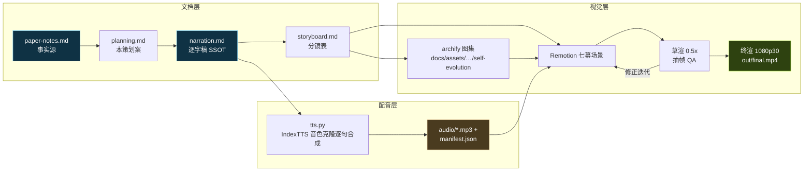

# 《翻旧账不花钱：AI 在梦里改章程》科普视频策划案

> 基于 T. Zheng, X. Wu, Z. Zhang, *et al.*, "Dream-RSI: Recursive Self-Improvement through Evolving Worlds," arXiv:2609.14858, Sep. 2026（Google × University of Maryland × Google DeepMind × University of Virginia；代码 github.com/zhengkid/Dream-RSI）
> 素材事实源：[../research/paper-notes.md](../research/paper-notes.md)（分章锚 `§S1…§S7`、`§A2`、`§原型`）
> 仓内精读底稿：[docs/research/self-evolution/144-dream-rsi.md](../../../../../docs/research/self-evolution/144-dream-rsi.md)（guided-learn 产物，类比例证的回溯终点）

## 一、定位

| 维度 | 决策 |
|---|---|
| 平台 | B 站 / YouTube 中长视频 |
| 时长 | 硬约束 **9–11 分钟**（估算锚 280 字/分含停顿等效口径；逐字稿 ≈2800 字，125–135 句） |
| 形态 | 动效图解式：**本人音色克隆配音**（IndexTTS-2.5，me-bright.wav + sunny-steady 成片档）+ Remotion 代码动画 + **archify 图集混合**（全屏独占切换，禁画中画回退） |
| 受众 | 对 AI 好奇的普通观众；不预设机器学习背景 |
| 核心内容 | 元探索策略改进：发现树（台账）→ 重放模拟器（做梦）→ 重放分 V 三分量与防回退下界 → 递归闭环；实证与批判边界；我们自己的玩具原型上亲手拆坏五次（D1/D4/D5 主打） |
| 系列关系 | 自进化系列第 4 集，完全独立成片：口播不出现其他集标题与集数序号（发布顺序见 [../../series.json](../../../series.json)） |

## 二、叙事策略

1. **一个贯穿全片的类比三件套**（沿用 144 已打磨体系，全片不换喻）：**探险队**（discovery agent，在线推演=真实进山，贵且慢）· **航拍地图沙盘**（历史池→重放模拟器，翻旧账免费）· **领队章程**（探索策略=一段可执行代码，全片唯一被改的东西）。P1 一张三件套总装图定妆，此后每幕先类比镜头再切机制镜头。
2. **一条主线问题**：递归自我改进靠长程探索，可探索章程是写死的——在线换章程，最忠实的评估办法就是整队再进一次山，烧不起。破局一句话：**已经走过的路，恰好已经是一个免费的模拟器**——翻旧账免费，重走一遍烧钱。
3. **每 60–90 秒一个记忆点**（取自 paper-notes 素材库）：0:40 烧钱账单计数器 → 1:50「元级评估的最忠实的模拟器就是真实环境本身」→ 3:00「翻旧账免费，重走一遍烧钱」→ 4:20 四章程同树分高下（0.83 vs 0.85）→ 5:40「假装你花了钱」+ 防回退保险 → 7:00 D4 排名反转（0.76→0.86 反超 0.85）→ 8:00 D5 锁死 0.80 vs 0.92 → 9:00 162× 口径警示 → 9:40 先省后探曲线。
4. **理性收尾**：不贩卖「AI 做梦就无敌」——收在论文没证明的事（重放分与在线表现的相关性零消融、做梦自身成本零报告、增益不一致无方差）+「把历史从档案变成模拟器」的总金句。

**超时砍项顺序（预登记）**：P2 接口细节 > P6 内核数字句 > P1 四柱快闪；并句不省字数，压时长只真删内容。

## 三、视觉语言（本集独立契约）

- **三色语义系统（三条深层轴）+ 昼夜二元母题**：
  - **冰蓝 `#7DD3FC` = 离线/免费/确定/可反复**（dream：做梦·重放模拟器·历史池——全片主色，月光/沙盘辉光）；
  - **暖白 `#FFE3B3` = 在线/贵/随机/一次性**（sun：真实进山·在线推演·烧钱——白昼日光）；
  - **嫩绿 `#A3E635` = 改进/胜出/章程演进**（grow：πt→πt+1·argmax 胜出·V 上升）。
  - **昼夜节奏**：P0/P2 暖白基调（白天进山）→ P3/P4 冰蓝基调（夜里做梦）→ P5 danger 红 `#FF5C5C` 压场（拆坏）→ P6 昼夜双色合流收束。
- 深底 `#0E1116` 系沿用；**ok 覆写决策**：底座 `#7ED321` → `#A3E635`（argmax 胜出=通过防回退闸，语义合一避免片内双绿，仿第 3 集先例）——本文件、theme.ts 注释、README 三处留档。
- **撞色核对**（check_series 规则 4，2026-09-22 INFO 行）：三值与系列已用色（金/青/紫/蓝/橙/绿/洋红）无精确撞车；sun `#FFE3B3` 与第 1 集金 `#F5C542` 同色相族不同明度——草渲目检违和则切「冰蓝 vs 钢灰 + danger 红价签」中性备选。
- **反枚举**：五策略/五实验一律 panel 底 + 编号卡，被评估/胜出才加 grow 辉光；V 三分量用 +/− 符号与 dim→text 亮度编码逐项点亮；时间维度（t=1→t=2）用位置与箭头，不用色相。
- 公式只作画面角标彩蛋（V = max s − β₁N + β₂·N/max(1,k)），不进口播；口播零符号（V=「重放分」、πt=「现任章程」、β=「罚/奖系数」）。
- 小数规约：口播读两位（零点八五），角标保留实验原始四位（0.8520）。
- 金句卡衬线大字居中 + 英文原文出处；底部烧录字幕单行、一句一条、与配音同步。
- **archify 图集混合**：复用 2 张（two-phase-loop / replay-simulator）+ 新作 ≥14 张；进片一律**全屏独占切换**，不做同屏画中画；旧图 archify 标准肤（cyan 强调系）不与本集色板同屏混排。

## 四、七幕结构（时间为目标值，最终以配音实测为准）

| 幕 | 目标时间 | 主题 | 叙事要点（回溯 paper-notes） | 视觉锚点 |
|---|---|---|---|---|
| P0 | 0:00–1:00 | 冷开场：烧钱账单与做梦赌注 | 一次真实进山的账单：数千次「提案-评估」循环、调用计数器狂飙（§S1 长程探索定义）→「想知道换条路会不会更好？最忠实的办法是整队再进一次山——再烧一遍钱」→ 论文赌注一句：把走过的路变成免费模拟器 → 论文卡（三机构）+ 标题卡 | 计费计数器滚动（sun 暖白+红价签）；论文卡；标题卡 |
| P1 | 1:00–2:20 | 两难与破局：章程写死的探险队 | 固定章程反复砸无效方向（AlphaEvolve 等现状，只进角标）vs 在线改章程：元级反馈延迟且昂贵 × 元空间巨大 = 改不起（§S1）→ 成本结构金句「最忠实的模拟器就是真实环境本身」（§S2 逐字）→ 破局：发现历史恰好已经是这样一个模拟器 → 三件套类比总装图定妆 → 四条设计规格快闪（显式可编程/历史即模拟器/下界保证/递归闭环，作四根柱、后续幕逐一点亮） | 两难对照墙；三件套总装图（archify：expedition-setup）；四柱落位 |
| P2 | 2:20–3:40 | 机制一：台账与同一套决策 | 每页台账记「从哪个营地出发/带什么装备/挖到什么/值多少分」，每页唯一指认前一页 → 天然长成树（§S3 发现树+primary parent）→ 批次=从哪继续+并行几个=策略的全部自由度（A(𝒯)、|C|≤W）→ **在线/离线同一决策接口**（卖点）→ 原型实景：一批三 worker 拿 0.50/0.35/0.80（§原型） | 发现树生长动画（sun 昼）；台账页翻动；三 worker 分叉 |
| P3 | 3:40–5:10 | 机制二：沙盘做梦（确定性重放） | 兵棋推演：章程说先去 B 山谷，推演员只翻台账那页**抄下当年真实结果**——没人重新进山（§S3 重放）→ 两条转移规则（选非根→揭示唯一记录子；选根→开最早创建的已录分支）→ 同一张沙盘让成千上万种章程各走时间线、全部免费 → 保真度边界埋线一句（重放不产生超出记录的结果，随机性被冻结成单次抽样——P6 伏笔）→ 原型实证：同一棵 12 节点树上四章程分高下 0.83/0.85/0.76/0.77（§原型） | 沙盘钉台账（dream 夜，冰蓝基调切换）；四章程对撞计分（archify：four-charters） |
| P4 | 5:10–6:40 | 机制三：评分与防回退 | 重放分 V = 最好收获 − 翻页工钱 + 并行效率奖；「**假装你花了钱**」金句——推演免费但每页对应真实计费，才不会选出只在沙盘好看的章程（§S3）→ 幕僚长（policy-development agent）照推演轨迹修订章程共 M 版 → argmax 候选永远含现任 → V*≥V⁰ 零成本防回退保险（D1 伏笔）→ 整个闭环只有章程在变、模型/评估器/接口全冻结 → 原型两轮递归 0.90→0.92、探测 12→11，胜出批次=深挖+试探+开新根（§原型） | V 算式逐项点亮（+绿/−红符号）；M 版章程卡；防回退闸门（grow）；两轮递归时间线 |
| P5 | 6:40–8:10 | 我们亲手拆坏它 | 一级证据（自家 489 行玩具域真跑输出）：**D1** 拆掉候选包含保证 → 被迫选 0.77，现任 0.83 本应兜底，下轮上线即退化；**D4** 重放越权（跳读最优记录后代、违反逐页序）→ 浅尝策略 0.76 虚涨到 0.86，**反超真最优 0.85**——排名反转；**D5** 语义引导替代重放（历史摘要成「深耕最有前途」注入）→ 终局 0.80 锁死一支，重放改进版 0.92 可达新支 → D2/D3 各一句快闪（拔并行奖→满批策略被低估 0.83→0.54；拔成本罚→铺张者误判为优）→ 金句收幕：「退化实验的断言，必须以真跑输出为准」（D4 初版纸面预期没复现反转的插曲） | danger 红压场；D1 闸门失守；D4 越权伸手 vs 逐页翻对照、三分数卡对撞定格；D5 锁死对比 |
| P6 | 8:10–10:00 | 实证、批判与收尾 | 硬数字带口径：**162×**（317 vs 51,200——必须口播警示「两边口径不同，论文没做定义级对齐」）；**先省后探**（评估次数 110→50→停滞后回升 ~92，性能 0.427→1.898——学到的策略真在自适应）；GPU 内核 2.43× 一句带过（只有曲线无绝对数值）→ 批判边界三条：① 重放分与在线表现的相关性零消融，防回退保证同时可能是过拟合放大器；② 做梦自身成本与超参零报告（修订调用不计入发现成本，总成本被低估）；③ 增益不一致且无方差（有的任务劣于基线、小数据集全败、差距在小数第 4 位）→ 总金句「翻旧账免费，重走一遍烧钱——把历史从档案变成模拟器」+ 引用卡 + 渐黑 | 三柱对撞（317/550/51,200 + 口径警示框）；先省后探双轴曲线；未证明清单 panel+编号；金句卡；渐黑 |

## 五、生产管线

- 公共脚本收敛于 [to-video skill pipeline/](https://github.com/ThreeFish-AI/to-video/blob/main/pipeline/README.md)（本工程 scripts/ 为薄包装）。
- 同步机制：每句一段 MP3；Remotion `calculateMetadata` 读 manifest 自动计算时间轴——改稿后重跑 build→tts→render；archify 素材经 manifest（章→帧偏移）由 ArchifyRecap 逐章锚句回放。
- 质量门：逐字稿定稿前过双重校验（真实性回溯 + 易懂性评审，两个独立子代理）；草渲后逐幕抽帧目检 + archify 接缝成对抽帧。

## 六、边界与不做的事

- **145 机制映射报告不进正片**（仓内工程文档，与对外叙事无关；README 可留链接）。
- **口径硬门**：无口径注记的数字句不入稿——162×（agent calls vs generations）、内核倍率（无绝对数值）、第 4 位小数级差距，逐条在 paper-notes `numbers` 口径列留档。
- **D4 只准用修正后数字**（跳读版 0.7600→0.8600 反超 0.8520）；初版「想象分支」0.788 仅作「以真跑为准」金句的素材，不得当反转证据。
- 论文之外的观点不进口播正文；延伸时明确口播「论文之外多说一句」。本集的玩具原型与 D1–D5 是**自家实测**（一级证据），口播用「我们自己做了一个玩具模型亲手拆」表述。
- 英文专名全进角标不口播（Dream-RSI / AlphaEvolve / SimpleTES / KernelBench / Gemini / ConvDiv），口播用中文指代。
- BGM 留空轨（版权考量）；不使用任何未经授权的第三方图片/音频素材，archify 图全部自产。
- Remotion 个人科普免费授权；IndexTTS-2.5 按 bilibili 模型许可（个人/研究可用）；声音克隆为本人自愿克隆；发布前按平台当期规则标注合成语音。
