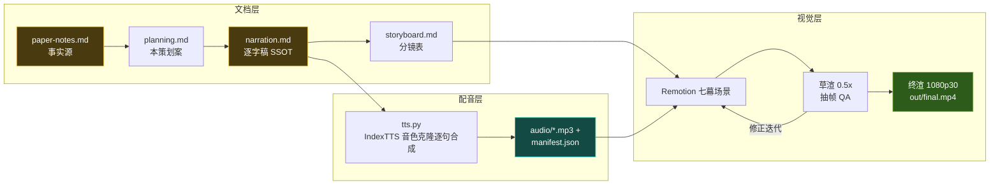

# 《上线之后，AI 才开始上学》科普视频策划案

> 基于 Che Jiang, Jincheng Zhong, Yu Fu, *et al.*, "Self-Improving Agents in the Era of Experience: A Survey of Self- to Meta-Evolution," *Frontis.AI / Tsinghua University*, Jun. 2026（88 页综述）
> 素材事实源：[../research/paper-notes.md](../research/paper-notes.md)

## 一、定位

| 维度 | 决策 |
|---|---|
| 平台 | B 站 / YouTube 中长视频 |
| 时长 | 由内容密度决定，硬约束 12–20 分钟（估算锚 280 字/分） |
| 形态 | 动效图解式：**本人音色克隆配音**（IndexTTS-2.5 sunny-steady 成片档）+ Remotion 代码动画，无真人出镜 |
| 受众 | 对 AI 好奇的普通观众；不预设机器学习背景 |
| 核心内容 | 全文主线：Harness=经验基础设施 → 经验的四个去处 → 元进化 → SI 评测 → 移动攻击面 |
| 系列关系 | 三集系列第 1 集，完全独立成片：口播不出现其他集标题与集数序号（发布顺序见 [../../series.json](../../../series.json)） |

## 二、叙事策略

1. **一个贯穿全片的拟人化**：上线部署的 AI = **入职新员工**——大脑（模型权重）出厂已定，公司给它配的**工位与流程**（Harness：工牌权限=工具、工作手册=提示词、笔记本=记忆、考勤与审批=控制逻辑）、**老板**（用户侧 U）、**车间**（环境侧 E）。每天下班后发生的"夜校"就是经验编译（trace→z）。
2. **一条主线问题**：今天的 AI 干完活就忘——**入职第一天，永远是第一天**。它能不能像老员工一样越干越熟练？综述答案：能，但前提是给经验修四条"去处"的管道，而且这条自进化流水线本身会变成一块新的攻击面。
3. **每 60–90 秒一个记忆点**（全部取自 paper-notes 第 4 段素材库）：~1200 个恶意技能的 ClawHavoc 事件、SkillsBench +16.2 分但也 16/84 任务负迁移、"经验不是原始日志而是提纯物"、SkillOS 的"老员工干活、图书管理员管技能库"、Hyperagents"连培训流程本身都在可改区"、tau-bench"单次成功率会骗人"、RobustBench-TC 40%/30% 掉分等。
4. **理性收尾**：论文的落点不是奇点叙事，而是"trace-to-capability 是个工程问题"——可靠反馈、安全自改架构、把评测变成持续体检。

## 三、视觉语言（本集独立契约）

- **三色语义系统（贯穿全片）**：
  - **金 `#F5C542` = 经验流**（trace→可用经验 z，全片主色）；
  - **青 `#2DD4BF` = Harness 运行时**（快时标外部更新面：技能/记忆/环境接口）；
  - **紫 `#B78CFF` = 参数内化**（慢时标权重巩固 θ）。
- 深色背景 `#0E1116` 系沿用；警示红 `#FF5C5C`、确认绿 `#7ED321`；金句卡衬线大字居中 + 英文原文出处。
- 公式（A_t=⟨M,H,U,E⟩、z_i=H(τ_i)、H⁺=Φ_H(H,z)、θ⁺=Φ_M(θ,Z)）只作画面角标彩蛋，不进口播主线。
- 底部烧录字幕：单行、每句一条、与配音逐句同步。

## 四、七幕结构（时间为目标值，最终以配音实测为准）

| 幕 | 目标时间 | 主题 | 叙事要点（回溯 paper-notes） | 视觉锚点 |
|---|---|---|---|---|
| P0 | 0:00–1:00 | 冷开场 | Silver & Sutton"经验时代"宣言 → 今天 AI 的"永远入职第一天"困境 → 主线问题：上线之后怎么越干越强？→ 88 页综述卡（清华 × Frontis.AI） | 宣言金句卡；日历翻页每天都是"第 1 天"；论文卡 |
| P1 | 1:00–3:20 | 一个上线 AI 的解剖图 | A_t 四元组拟人化（大脑/工位/老板/车间）；核心区分：聊天记录≠经验（须过滤/压缩/归因/验证才"可用"）；快慢双时标总览；三代进化史 Gen1 任务环→Gen2 跨任务复用→Gen3 运行时系统 | 新员工入职装配动画；"原油→精炼汽油"提纯漏斗；三代时间轴 |
| P2 | 3:20–6:55 | 经验的四个去处 | ① 技能库（SKILL.md 文件夹=带说明书的工具抽屉；创建/使用/进化三阶段；负面证据也是宝；验证准入防"负迁移"）② 记忆（五操作：记/压/并/取/改；三层自进化）③ 环境=天花板（可执行→协议化→可学习三层楼）④ 参数巩固（何时"写进大脑"：Cursor 实时 RL、部署后 trace 学习仍处早期） | 四管道分叉总图；技能抽屉动画；三层楼电梯；快慢双环 |
| P3 | 6:55–8:20 | 元进化：谁来管进化 | Figure 8 二维地图（改什么 × 谁控制）解析为三层 regime 阶梯：自己攒资产→学会怎么改进→出现专职 meta 层（SkillOS=老员工+图书管理员分岗；Hyperagents 连改进流程本身进可改区）；自指悖论与"失去稳定参照系" | 二维格阵让位三级阶梯；岗位分拆动画；镜像套娃 |
| P4 | 8:20–9:55 | 怎么知道真的变强了 | "刷分≠成长"；SI 六目标体检表（新任务涨分/老任务不忘/持续稳定/性价比/路径归因/安全不退化）；SIP-Bench T0→T1→T2 纵向体检（replay/adapt/held-out 三分题库）；基准也会腐烂需持续换新 | 体检报告卡；三条时间线；水涨船不高图 |
| P5 | 9:55–12:10 | 安全：会进化的系统=移动靶 | 一次性审计结构性失效；ClawHavoc ~1200 恶意技能供应链事件；记忆投毒（一次交互长期潜伏，>90% 轮次可被引导）；反馈操纵（污染"什么算进步"）；工具链组合出非预期路径与「对齐漂移」；治理原语：准入测试/最小权限/版本回滚/持续再认证 | 移动靶射击场；技能商店投毒动画；夜袭记忆库；对齐漂移罗盘 |
| P6 | 12:10–14:00 | 收尾 | 总金句"trace-to-capability"；九个开放问题压在同一块地基「验证」上（scales least well）；配套仓库 331 篇 × 9 章；三曲线悬念（compound/saturate/oscillate）；原文引用卡 | 星空开放问题墙；验证基石；三条曲线；引用卡 |

## 五、生产管线

- 公共脚本已收敛至 [pipeline/](../../../pipeline/README.md)（本工程 scripts/ 为薄包装）。
- 同步机制：每句一段 MP3；Remotion `calculateMetadata` 读 manifest 自动计算时间轴（句间 0.32s、幕间 +0.9s、片头 0.6s、片尾 2s）——改稿后只需重跑 build→tts→render。
- 质量门：逐字稿定稿前过 `pipeline/skills/04-verification.md` 双重校验（真实性回溯 + 易懂性评审）；渲染后逐幕抽帧目检。

## 六、边界与不做的事

- BGM 留空轨（版权考量，用户后期自选）；不使用任何未经授权的第三方图片/音频素材，全部画面为代码生成。
- 论文之外的观点不进口播正文；需要延伸时明确口播"论文之外多说一句"。
- 论文无公开 arXiv 号：引用卡写机构 + 日期，不编造编号。
- Remotion 采用个人科普用途免费授权；IndexTTS-2.5 按 bilibili 模型许可（个人/研究可用），发布前确认平台对合成语音的标注要求（详见 [../../pipeline/VOICE-CLONING.md §八](../../../pipeline/VOICE-CLONING.md)）。
