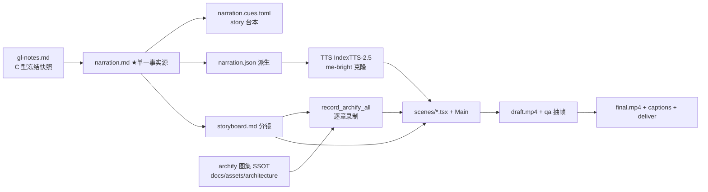

# 策划案 ·《拆解 Horizon Context：含义怎么治理、答案怎么可信》（完全重制版）

> Stage ② 产物。信源：`research/gl-notes.md`（C 型冻结快照 = guided-learn gen2 精读笔记 @192ae6ca9，
> 2026-09-30 信源实况；原型 selftest 复算 2026-10-01 全等升【一】）。锚点一律 §+稳定键。

## 一、定位表

| 项 | 值 |
|---|---|
| 平台 | B 站 / YouTube 中长视频 |
| 时长目标 | **16.0–18.0 分钟**（目标 17 分；story 档 254 字/分 ⇒ ≈4300±300 字；首轮 TTS 后实测校准） |
| 形态 | AI 配音（IndexTTS-2.5 声音克隆 · me-bright · story 段落演绎）+ Remotion 代码动画 + archify 逐章图例 |
| 受众 | 不预设数据工程背景的普通人（会逛 B 站的技术好奇者；「听说过 AI 连数据库、但不知道为什么会答错」） |
| 核心范围 | 011 §1 症状与病灶 → §2 M1–M7 七承重机制（全四拍：机制+走查+消融+收口）→ §3 三阶段骨架（§10–§12 取舍）→ §13 数字纪律 → §19 五规律三争议 → §15 边界。**完整版**：不砍机制幕的走查与消融（被动收看双门） |
| 系列位置 | context-layer 系列 E1（独立成片；口播零序号词零他集标题） |

## 二、叙事策略

**主线问题**（钩子→悬念→回答）：
「AI 已经会写 SQL，为什么问它『我们上季度收入多少』还是两个数对不上？」→
悬念：问题不在模型笨，在「你家的收入该怎么算、哪列碰不得」根本没写在哪 →
回答：Horizon Context 把业务定义做成治理引擎里**查询时强制执行**的对象——同一份定义，七个执行位（M1–M7）。

**视觉母题全片统摄**〔M-001 恒定视觉锚〕：
- 母题 = 「**同一份定义单**」（一张金色描边的定义卡：`净收入 = …`），锁死描边色 `#E8C06A` 与线宽，
  全片多次同形出场：P0 首次缺席（没有这张卡所以对不上账）→ P2 被注册进引擎 → P3 被策略挂上 →
  P4 被人签背书 → P5 被 Agent 持有 → P7 收口时满屏回照。只换周边标签，母题几何零变化。
- **零跨域剧场**（继承 gl-notes 附录 A 裁定）：全片无「实习生/大厦/闸机/工牌」贯穿喻体；
  仅 A1/A2/A3 三条本域实例按需点亮（1–3 句即切回机制画面）：
  - A1 fan trap：一张 100 美元发票关联 3 条明细，先 join 再求和 ⇒ 100 被记成 300（§2 M1，P2）
  - A2 平均的平均：9 张单的店均 2 人 + 1 张单的店 30 人，先各自平均再平均 ≠ 总客数÷总单数（§2 M1，P2）
  - A3 半可加：余额今天 500 + 昨天 500 ≠ 1000，同一笔钱数两遍（§2 M1，P2）
- 记忆点节奏（每 60–90 秒，全部取自 gl-notes）：两数对撞（P0）→ 300 vs 600（P2 Ann 走查）→
  明文 vs 星号（P3）→ 477 vs 48（P4/P7）→ 13/7 权限交集（P5）→ 五规律快闪（P7）。
- 理性收尾：增益数字全部带归属（Snowflake 自报/转述/第三方三级），把悬念留在开放争议
  （「语义层增益窗口是否收窄」「出楼之后谁管」），不贩卖焦虑。

**五大构件映射契约消费**（01 §七，防压字数时把具象过程删成抽象卡）：
1. SCQA+因果脉络链 → P1 全景坐标（Map-First Anchor：八层分层矩阵，后续每幕回照高亮当前层）；
2. 原型走查（场景 B Ann / 场景 A）→ P2/P3/P5 的 Animated State Trace（具体输入值逐步变换，禁只留规则结论）；
3. D1–D10 破坏实验 → 正反同屏消融对比（警示红 `#FF5C5C` 拔掉后崩溃 ↔ 确认绿 `#7ED321` 机制在位拦截）；
4. §13 数字表 → 口播直取一句话读法，画面化带基线锚点的动态标尺（useCount），禁照搬多列大表；
5. §15 边界 → P7 边界护栏卡（成立工况 / Out-of-Scope 两栏）。

## 三、视觉语言

**色彩语义契约**（theme.ts 落位，严格用色）：

| 色 | 值 | 语义（深度轴：定义→治理→验证） |
|---|---|---|
| 金 concept | `#E8C06A` | 「同一份定义」口径主线：语义视图/指标/定义卡母题 |
| 紫 conceptDeep | `#C9A0FF` | 治理与身份层：策略/Agent Identity/血缘账本 |
| 青 verify | `#5CBFB0` | 验证锚定与对账：VQR/证据分级/理性收口 |
| 警示红 | `#FF5C5C` | 消融实验「拔掉后」的崩溃路径与退化数字 |
| 确认绿 | `#7ED321` | 机制在位时的拦截/对账一致 |
| 底座 | `#0E1116` / panel `#171C26` | 深色底系 |

- 金句卡衬线体（theme.serif）；公式只作画面角标彩蛋不进口播；代码走廊用 selftest 真实终端输出
  （research/selftest-*-2026-10-01.txt，terminalBg `#0B0E14`）。
- archify 图例沿用仓级 SSOT（`docs/assets/architecture/cognitive-context/horizon-context--*.html`），
  剧场词命中图按「图零改动、画面列目标域收束」契约逐张裁定（详见 storyboard）。

## 四、分幕结构表

8 幕 ≈ 4360 字（句均 22–24 字 ⇒ 约 185±10 句）；各幕回溯锚全部指向 gl-notes。

| 幕 | 目标字数/秒 | 主题 | 叙事要点（回溯 gl-notes） | 视觉锚点 |
|---|---|---|---|---|
| P0 | 420 / ~99s | 三个症状一个病根 | 两个数对不上 $14.2M vs $12.8M【三→归属】；裸问大面积答错 ~25%【三 Snowflake 自报】/21%【四 转述 Anthropic】；密码列名直出（门禁穿透）；三病灶（口径散落/执行算错/门禁穿透 §1 对位表）；一句话定位 + 片名卡 | 两数对撞走查（同题两条取数路径分叉）；定义卡母题首次「缺席」 |
| P1 | 380 / ~90s | 全貌坐标·七机制地图 | 八层分层矩阵（§2 总览）；四层信号术语先讲清（Structural/Operational/Semantic/Behavioral——用同一列 amt_ttl_pre_dsc 具象落位）；承重 M1–M7 vs 供给 §10–§12 判词 | Map-First 全景坐标；「七机制×十次拆坏」预告墙（mechanism-experiment-matrix） |
| P2 | 760 / ~179s | M1 语义视图·双不变量 | 术语卡（语义视图/主键外键/粒度）；口径单点（五段式 DDL TABLES→METRICS）× 查询期重算（先聚后连不存冻结数）→「两个独立坏法」：存量过期（覆盖 <5% of 9,685【三】）与顺序错（A1/A2/A3 本域实例 + D1/D7 形态消融）；注册校验门拦坏关系（D6 形态）；物化一段带过（59 到 91 倍【三】，仅 Semantic SQL 路径）；收口「SQL 合法 ≠ 答案对」 | Ann 端到端走查（3×$100 → 引擎 300 vs 朴素 600 逐拍状态）；红绿消融同屏；定义卡母题被注册 |
| P3 | 650 / ~154s | M2+M3 规则与执法点 | 四类策略术语（掩码/行访问/聚合约束/投影限制）；策略挂数据本体、查询期求值、特权不豁免、tag 绑定、Agent 会话更严（IS_AGENT_ACTIVATED）；M3 分野：规则内容 vs 执法拓扑——检索面即治理面（PRIVATE 检索层过滤+执行层 RBAC 双层防线）；规律 2（强制力来自执行点） | 掩码策略四步走查（intern 查手机号：明文→星号）；D5 形态消融（拆执行层→泄露 vs blocked）；BI 看着打码/导出明文反例 |
| P4 | 600 / ~142s | M4+M5 两本账·背书与血缘 | VQR 核准题库（question/sql/verified_by/verified_at 四要素；命中短路重放已验证 SQL；未命中现算+无覆盖告警；优化每条至多 4 次、超 20 条拖慢【二】）；候选集性质（窄=锚定 vs 宽=需排序）；M5 列级血缘（引擎自动记边 + OpenLineage 外部事件过三道闸入同一账本）；答案出错沿链回溯 | 核准题命中短路（verified 与引擎重算对账一致）；OpenLineage 事件过闸落账走查；D8 形态消融（拆解析门→虚构边入账） |
| P5 | 600 / ~142s | M6+M7 代理身份与自动纳管 | Agent 默认继承全权（含管理员级【二】）；四类入口识别归因（原生/托管 MCP/IS_AGENTIC/SERVICE_AGENT）；权限天花板 = 用户 RBAC ∩ RSS、只减不增、实时求值、会话锁死（Classmethod 独立实测【四】）；M7 分类引擎持续扫描→系统标签→一次性映射→tag 策略（掩码不能直绑系统标签）；机器管发现、人管定规 | 新表自动打码四步走查（夜里建表→扫描→打标→次日打码）；D9/D10 形态双消融（快照冻结天花板仍持权；拆映射→已贴标仍明文） |
| P6 | 480 / ~113s | 供给与生态·不承重的三专章 | Collect→Enrich→Activate 骨架；双轨富化（Autopilot GA 显式轨 / Cortex Sense 私预隐式轨；冲突浮出人工裁决，非多数派投票）；检索分层增益（NDCG 0.22→0.59【三 全自报】一句带过）；出口三路（MCP/Ossie 开放规范/BI 互操作；Ossie 导出桥静默丢非等值关系【四 Datus】）；演进方法论：先造对象→再装治理→最后开生态 | D4 形态消融（冲突交给热度自动选→错误口径以 200:5 碾压）；自纠环一道错题修一处信号（C4 形态）；演进时间线快闪 |
| P7 | 470 / ~111s | 理性收口·规律与边界 | §13 读表纪律（增益端全部自报、无第三方复现——谁测的/什么条件/截至何时）；五规律快闪（定义层已商品化/执行点律/双保险/冲突浮出/三件套配套，各一句）；governance ≠ verification（477 vs 48【四 typedef 转述】）；边界（引擎周界内成立、导出即绕过、Out-of-Scope 五条取三）；费曼一问（怎么三问拆穿「不可绕过」宣称）；收尾 | 五规律总卡（five-laws 新图）；477 vs 48 对比标尺；边界护栏卡；定义卡母题满屏回照收束 |

弹性预算：写稿按上表幕级字数双控（总 4360 中值）；若首轮 TTS 实测外推 >18 分，砍序 = P2 物化段 →
P6 检索数字 → P7 规律五并三（保 2/3/5）。

## 五、生产管线图

## 六、边界与不做的事

- BGM 留空轨；无真人出镜；不做英文版（双语留待日后 lock 机制增量补齐）。
- 口播纪律：D1–D10 编号不进口播（画面可现）；厂商自报数字必带归属句（前 3 句内）；原型玩具数字
  带「我们用玩具数据复现了一遍」框架；英文标识符只进角标（白名单例外口播：Horizon Context /
  Snowflake / dbt / AI / SQL / MCP / Agent）；活数据（star/总量/榜单）不进口播；状态类断言带「截至 2026-09-30」
  时点（Semantic Studio 例外：按 2026-10-01 复核的 GA 口径 + 时点归属，见 gl-notes 附录 B）。
- E1↔E2 分工：本集只讲 Horizon Context 机制本体（M1–M7 + 供给生态 + 边界）；通用上下文层蓝图
  是同系列另一集的主题，口播与视觉零提及（防串线）。
- 破坏实验只讲「形态」：口播说「把这道闸拆掉」（画面角标示 D 编号与实测退化值），不说实验编号。
- 不做的：物化性能深挖、Ossie 规范细节、Business Glossary 存疑条目（§15 无一手出处不进口播）。
