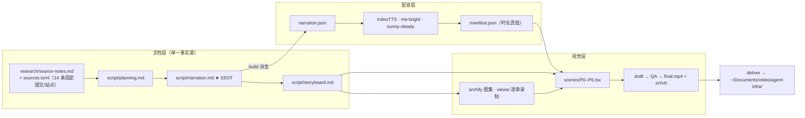

# 策划案：《让判断变便宜：Jev 决策模型拆解》

> 事实源：[../research/source-notes.md](../research/source-notes.md)（信源台账 [../research/sources.toml](../research/sources.toml)；底层精读 [200-jev-system-one-model.md](../../../../../docs/research/agent-infra/200-jev-system-one-model.md) @ `5ed96405`，上游 TypeSafe 官方 + adapter `e1d4cc9` + kev `b8aa777` + laya `76361c8`）
> 逐字稿 SSOT：[narration.md](./narration.md) · 分镜：[storyboard.md](./storyboard.md)
> 可执行参数：[../pipeline.toml](../pipeline.toml)

## 一、定位

| 项 | 定义 |
| --- | --- |
| 系列 | **Agent 基础设施系列**（`agent-infra`，doc 型；序号只存在于 [../../../series.json](../../../series.json) 与视觉层） |
| 平台 / 形态 | B 站 / YouTube 横屏 1080p30；代码动画图解 + archify 工程图逐章回放 + 本人音色克隆旁白；无真人出镜，无 BGM |
| 时长 | 13:00–15:36（`target_minutes = [13.0, 15.6]`），约 165–190 句，字数预算约 3,750–4,150 字 |
| 受众 | 不预设机器学习背景的普通人。次级受众是给 Agent 系统选型、被 LLM 账单与解析报错反复折磨的工程师（「我满屏都是这种小判断」是本集的引擎） |
| 核心内容 | Jev（System One 决策模型）的全链路拆解：小判断错配的诊断 → 闭合输出空间（合法≠正确）→ 一次编码·分支隔离·选项读出（快与便宜的真正来源）→ 校准概率（只在分布内成立）→ 快慢分工编排（收益在编排不在模型）→ 三个争议 → 边界与开放问题 |
| 不覆盖 | 本仓（negentropy）任何实现细节与 201 映射结论；训练复刻教程；厂商融资八卦与社区规模；具体接入教程与竞品报价表 |

**选题的独特价值**：
- 市面上讲 Jev 的内容，多在转述「快 200 倍、便宜 400 倍」的营销数字。本集把数字**分级拆开**：哪些是构造保证（零类型错误）、哪些是官方自报（67.8%、倍数）、哪些第三方对不上（首页演示复算仅约 75×/171×、第三方只测出快 1.2×）。
- 讲清「便宜」**不来自「模型更小」**，而来自计算形状：答案空间闭合 + 输入只读一次 + 多问并行 + 概率直读。
- 「校准只在分布内」是自动化执行的生死线——分布外要么嘴硬、要么闭嘴，没有免费的中庸（B4 实证）。
- 全片用纯标准库原型的六次破坏性实验自证机制，所有数字都能复跑。

## 二、叙事策略

**主线问题（P0 抛出，P6 回答）**
> Agent 里塞满了「小判断」——慢、贵、输出要解析、口头概率不可信。怎么把「判断」从「生成」通道里挪出来，变成软件能直接消费、便宜到随处调用的函数调用？

**「判断变便宜」的定义纪律**：
- 便宜 ≠ 模型更小、也不等于更聪明。首次出现（P0）就下定义：**把答案空间先写死，让模型一次前向给每个选项打出带概率的分数**——便宜来自这个结构，代价是放弃生成，且校准只在分布内成立。
- 之后每次口播说「便宜 / 快」，归因落在机制（闭合、读一次、批量问），不落在「小模型」的直觉上（Stage ④ 按 ANALOGY 判定）。

**贯穿比喻体系：快递分拣中心（单一剧场，单射不重影；失配边界三条见 source-notes 纪律 1）**

| 技术实体 | 剧场角色 | 各幕展示的职责切面 |
| --- | --- | --- |
| System 2 LLM | **调度员** | 慢且贵、会规划线路会写说明（P0）；只接复核件（P4） |
| Jev | **老分拣员** | 扫一眼面单填几张小票（P0–P2）；看得懂手写地址，不是扫码机（P0） |
| `state`（输入状态文本） | **面单** | 只扫一眼（P2）；换批面单就露怯（P5） |
| `questions`（命名问题集） | **几张分拣小票** | 是非小票 / 选格口小票 / 打等级小票（P1）；互不相看（P2） |
| `criteria`（选项集） | **挂牌的格口** | 一面墙最多 255 个（P1）；格口换牌全概率重排（P5） |
| 概率 | **心里的把握分配** | 分给每个格口（P3） |
| confidence | **把握集中度读数** | 机械读数不是自我反省（P3） |
| 校准 / 温度缩放 | **定期对账 / 统一打折** | 自称九成是否真九成（P3）；外文面单对不上账（P5） |
| RLCD 训练 | **职业训练（训练期奖惩）** | 与「对账」刻意区分，配方未公开（P3） |
| 三档分流 | **三条去向** | 直投 / 送调度员 / 人工异常台（P4） |
| 执行代码 | **传送带与推杆** | 照单执行（P4） |
| 杰文斯效应 | **分拣越便宜，过一遍分拣的东西越多** | 连内部传阅件都要过（P4） |

**记忆点节奏（每 60–90 秒一个，共 13 个）**

| # | ≈时刻 | 记忆点 | 类型 |
| --- | --- | --- | --- |
| 1 | 0:35 | 让会写专著的人去盖章：慢、贵、要解析、还爱口头打包票 | 痛点共鸣 |
| 2 | 1:20 | 错配：答案本来就只有几个，却让它写一段自由文字 | 病根 |
| 3 | 1:50 | 程序先把答案空间写死，模型一次前向给每个选项打分 | 定义 |
| 4 | 2:40 | 只能往挂牌格口里投：绝不会投出不存在的格口，但会投错 | 机制因果 |
| 5 | 3:30 | 「零类型错误」是构造保证不是实测；官方自报准确率 67.8% | 反直觉 |
| 6 | 4:30 | 一万次探针的逆向：问 100 个问题和问 1 个差不多一样快 | 实证 |
| 7 | 5:40 | 小票互不相看：退款 0.72 + 拒退 0.47 = 1.19 | 机制代价 |
| 8 | 6:50 | 把握读数是公式算出来的，不是模型学来的 | 反直觉 |
| 9 | 7:40 | 账面好看车间失火：自称错 0.7%，实际错 12% | 静默退化 |
| 10 | 8:50 | 省多少取决于「有把握的大多数」有多大，不是单价 | 方法 |
| 11 | 10:00 | 分拣越便宜，过一遍分拣的东西越多（杰文斯效应） | 升华 |
| 12 | 11:10 | 首页说快 193.6 倍，自家演示复算只有约 75 倍 | 口径拆解 |
| 13 | 12:50 | 分布外要么嘴硬要么闭嘴，没有免费的中庸 | 边界 |

**术语降落规则**（严格执行）：
- 英文标识符**只进画面角标与代码走廊，不进口播**：
  - `noul` → 「是非题」；`choice` → 「选择题」；`score` → 「打分题」（首现角标题型原名）。
  - `state` → 「状态底单」（首现释「一段描述现状的文本」）；`criteria` → 「挂牌的选项」；`confidence` → 「把握读数」。
  - `RLCD` → 「校准训练」（首现释「用奖惩教会模型说诚实的概率」）；`ECE` → 「校准误差」（首现释「自称把握与实际命中率的差距」）；`logprob` 不出现。
  - `System 1 / System 2` → 「快系统 / 慢系统」（首现各一句解释）；温度缩放可直说；`output_tokens` → 「计费的输出量」。
- **可口播的例外名单**：AI、Agent、LLM（首现释「大语言模型」）、API（首现释「程序调用接口」）、Jev、TypeSafe。
- 句尾英文词一律加 CMU 标注兜底。
- 术语**首现即释**：闭合输出空间、校准、分布内/分布外、快慢分工、构造保证、逆向分析，首次出现处各用一句话解释。

**证据分级的口播义务**：
- 厂商数字必带「官方自报」；逆向机制必带「有研究者用上万次探针做过逆向」；复刻必带「开源社区做了复刻」；原型数字必带「在一个简化原型上」；LangChain 评审实验必带全部三个限定（样本极小、单一评审人、与厂商联合发布）。
- **倍数并列义务**：说 193.6×/444.6× 的同一句组内必须并列「自家演示复算约 75×/171×」与「第三方只测出快 1.2×」，不裁决。
- 原型 B1–B6 数字一律带「简化原型」限定；官方 cookbook 12.2× 带「官方自报」。

**理性收尾**：
- 不鼓吹「判断模型取代 LLM」，也不嘲讽「就是个分类器」。落脚点：判断与生成分工；便宜的代价与边界（放弃生成、校准只在分布内、中文未证明）；把悬念留在开放问题上。
- 收尾金句：「判断的边界不在模型，在你的分布——当你把判断变便宜，你会拿它去量什么？」

## 三、视觉语言与色彩语义

**色彩语义契约**（对应 `video/src/design/theme.ts`，与 series.json 的 accents 一致；映射四大机制的语义轴）：
- 琥珀金 `slot`（`#F0B24A`）：**格口与闭合输出空间**（M1）。挂牌格口墙、criteria、构造保证。
- 青绿 `pass`（`#4FD8C4`）：**一次编码与速度**（M2）。面单扫描光、共享前缀、批量小票。
- 兰紫 `calib`（`#B79CFF`）：**概率与校准**（M3）。把握分配条、对账账本、校准误差台阶。
- 矢车菊蓝 `route`（`#6FA8FF`）：**分流与编排**（M4）。三条去向传送带、阈值闸门。
- 警示红 `danger`（`#FF5C5C`）：投错格口、破坏实验、嘴硬（语义唯一）。
- 确认绿 `ok`（`#7ED321`）：命中、校验通过、防线生效。

**视觉母题**：
1. **格口墙**〔M-001 恒定视觉锚〕：锁死描边色（slot 金）与绝对线宽，全片多次同形出场，只换格口标签（P0 立起、P1 展开 255 上限、P5 换牌重排）。
2. **面单与小票**：一张面单被青绿扫描光扫过一次，同时输出多张小票（P2 主构图）。
3. **把握指针**：格口间的把握分配条（紫）+ 集中度读数表盘（P3）。
4. **对账账本**：自称 / 实际两栏对齐，温度「统一打折」印章（P3、P5）。
5. **三岔传送带**：直投 / 复核 / 人工异常台三条去向（蓝），闸门标注阈值（P4）。
6. **拆解台**：每个破坏实验一张「改了什么 / 实测怎么坏 / 教训」三栏卡，配终端输出走廊（原型真实运行日志）（P1/P2/P3 内嵌）。
7. **倍数天平**：193.6×/444.6× 与 75×/171×/1.2× 两侧对账（P5）。
8. **archify 工程图回放**：约 12 张图逐章锚定句级 cue（全屏独占三分法）。

**顶部章节进度条**（frozen 模板组件）：按七幕分段，幕标题即段内文字（判断之贵 / 挂牌格口 / 一眼多票 / 把握对账 / 三条去向 / 三方争议 / 各归其位）。

## 四、幕结构

| 幕 | 目标时长 | 主题（章节条标题） | 叙事要点（回溯 source-notes） | 视觉锚点 |
| --- | --- | --- | --- | --- |
| **P0** | 0:00–2:00 | 判断之贵 | 小判断清单（工单归类/动作放行/输出及格/候选挑选）；四宗罪（3–329s、$0.20–10、解析、口头概率）；错配点破；Jev 一句话定位（函数调用 + 代价）；分拣中心剧场开场（调度员 vs 老分拣员） | 格口墙总览立起；「专著 vs 盖章」对比动画 |
| **P1** | 2:00–4:10 | 挂牌格口 | 契约三题型（是非/选择/打分）与 255/10 上限；格口 = 挂牌选项；「零类型错误」构造保证 vs 67.8% 自报；合法≠正确（陷阱面单、16% 零概率、13% 乱序翻转）；B2 拆闭合→'Billing team' 越界；类型安全是选择 | 格口墙展开；陷阱面单特写；B2 拆解卡 |
| **P2** | 4:10–6:20 | 一眼多票 | 一次编码（扫一眼面单）+ 分支隔离（小票互不相看）+ 选项读出；逆向归属句；平坦性（86.5ms→100 问）与计费口径；12.5× 合调红利；隔离探针 0.00 vs 0.90；反面代价：跨问题无不变量（1.19 / B6 同时执行）；编排解 | 面单扫描 → 多小票分流；one-pass-decision 图；B6 拆解卡 |
| **P3** | 6:20–8:40 | 把握对账 | 校准训练目标（诚实概率，配方未公开）；把握读数是公式不是学得；ECE 台阶 0.03→0.107→0.246（归属）；温度缩放修不了排序；S8/S9 原型（账面好看车间失火 / 学会闭嘴）；B3 拆校准的账单 | 把握指针表盘；对账账本；calibration-ladder 图；B3 拆解卡 |
| **P4** | 8:40–10:30 | 三条去向 | 三档分流（直投/复核/人工）；省多少取决于「有把握的大多数」（19.7% 直投，原型）；workflow 编法（代码规则+窄问题，官方自报 67.8%/$0.0004/0.4s）；Minecraft 131+35 案例；评审实验（三限定）；杰文斯效应 | 三岔传送带；fast-slow-harness 图；成本对比账本 |
| **P5** | 10:30–12:40 | 三方争议 | 分类器之争（微调 0.766 vs 零样本、Banking77 0.425 vs 0.870、知识差在底座）；自报基准信度（考核卷自出、参考答案 LLM 平均、倍数天平）；校准外推（台阶、公开基准可能在训练分布、B4 两难） | 选址谱；倍数天平；外文面单对不上账 |
| **P6** | 12:40–14:30 | 各归其位 | 不是替代 LLM（coding agent 页明言）；五条未证明（架构零公开 / 0% 非实测 / 倍数口径 / 中文未证明 / 并行采样间接）；收尾金句与开放问题；信源卡渐黑 | decision-vs-generation 图；信源卡 |

## 五、生产管线图

## 六、边界与不做的事

1. **不放 BGM**，只留空轨。
2. **材料之外的观点不进口播**：「分拣中心」「账面好看车间失火」等本集措辞都标为类比，并带约束句；类比失配边界三条（跨小票统一思考 / 手指点格口不保证对 / 对账≠训练）内化到 Stage ④ 判定。
3. **不讲本仓实现**：201 映射结论（包括「闭合输出空间」缺口）不进正片。
4. **数字 100% 可回溯**：原型数字带「简化原型」限定；厂商与第三方口径带归属；倍数并列呈现不裁决。
5. **全片独立成篇**：口播不出现他集片名、集序号或顺序词（「下期再见」类收尾不受此限），不出现「课程」一词。
6. **许可与归属**：上游文档与服务条款版权归 TypeSafe AI，片尾信源卡署名官方站点；kev/laya 代码 Apache-2.0 只做短引；Hume 逆向观点凡引用带作者归属；LangChain 实验带三限定。
7. **中文场景表述**：官方自认 CJK 较弱——口播提「中文还没有数据」必须带「这是官方自己说的」。
