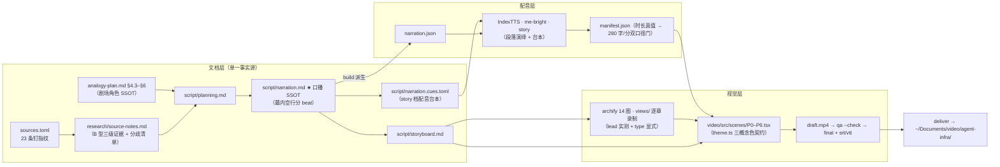

# 策划案：《只填格的判读员：Jev 决策模型》

> 事实源：[../research/source-notes.md](../research/source-notes.md)（下称 **SN**；信源台账 [../research/sources.toml](../research/sources.toml)，23 条钉指纹）。逐字稿 SSOT：`./narration.md` · 分镜：`./storyboard.md` · 可执行参数：[../pipeline.toml](../pipeline.toml)。类比 SSOT：《类比计划》§4.3–§4.6/§6（`analogy-plan.md`，本片与精读文档共用同一剧场，角色单射不得改）。
> 注：SN 按 8 个取证节组织（SN §P0–§P7）；成片收敛为 **7 幕（P0–P6）**，SN §P6+§P7 合并为成片 P6（表内回溯写作 `SN §P6/§P7`）。

## 一、定位

| 项 | 定义 |
| --- | --- |
| 系列 | **Agent 基础设施系列**（`agent-infra`，第 2 集；口播零集数与顺序词，序号只在 series.json 与视觉层） |
| 平台 / 形态 | B 站 / YouTube 横屏 1080p30；代码动画 + archify 工程图逐章回放 + 本人音色克隆旁白（story 段落演绎配音 + 台本 `narration.cues.toml`）；无真人出镜，无 BGM |
| 时长 | 硬约束 **[13.0, 15.0] 分钟**；首版字数预算 **≈3,700 字**（280 字/分含停顿等效口径），约 165–185 句，幕内空行分 beat（2–8 句/beat） |
| 受众 | 懂一点软件、**不预设 ML 背景**的技术观众；次级受众是「想把 LLM 接进自家流程」的开发者（引擎：每个数字我该信几分？） |
| 核心内容 | Jev（TypeSafe System One）四机制：闭合输出空间（预报单）→ 共享读·隔离问（大屏与封卡）→ 校准概率与 confidence（柱高与计算栏·领地）→ 代码持有的三道闸（快慢分工）；证据层用「本台自评 ⇄ 外部抽检」对账三个招牌数字，收在三个开放问题 |
| 不覆盖 | 本仓实现与 201 映射结论；RLCD 训练配方；架构内部（第三方推断只作角标）；中文社区二手转述；活数据（star/排名/速率）；Doom/Wikiracing 演示复刻 |

**选题的独特价值**：市面讲 Jev 的内容停在「快两百倍、零幻觉」的宣传句。本集把每句招牌话当待审数字，用官方自报 / 第三方实测 / 我们复算三种口吻对账——观众带走的不只是四个机制，还有一套「看到 AI 数字先问口径」的通用习惯。

## 二、叙事策略

**全片主线一句话（logline，40 字）**：只填格不写稿的判读员 Jev，让判断又快又便宜，可它报的「七成」只在自己的领地里作数。

**一条主线问题（钩子 → 悬念 → 回答）**

- 钩子（P0）：「模型聊天早已超人，自动化在哪？」（官方开篇原话，SN §P0）——主播超人、城市没自动化的暴雨夜；末句亮出「数字可信度」三级角标图例：本片每个数字先问「谁量的」。
- 悬念（P0 末）：一个不写稿、只填格的模型凭什么插进软件里？它承诺的「不越界、报得诚实、快两百倍」各能兑现几分？
- 回答（分幕兑现）：不越界＝真的（构造保证，但只保证形状，P2）；诚实＝分布内真的、分布外出台阶且不报警（P4–P5）；快＝量级真的、倍数是口径的函数（P6）；合＝收益在编排不在模型——代码持有控制流、门槛随风险伸缩、换分布先重标（P5–P6）。开场之问在 P6 收口：「主播早已超人，城市仍未自动化」→ 判读员不是更聪明的主播，而是一个让判断变便宜的新岗位。

**贯穿比喻体系：城市气象台（单一剧场，角色单射，取自《类比计划》§4.3，不得改）**

| 技术实体 | 剧场角色 | 首登 |
| --- | --- | --- |
| Jev / System One | **判读员**：只在预报单上落笔，从不写稿 | P0 |
| 聊天型 LLM（RLHF） | **电视天气主播**：逐字念稿、按观众喜好调教 | P0 |
| state | **当班资料包**（云图/雷达/读数）：大屏只放一遍 | P3 |
| Choice / Score / Noul | 预报单**单选行 / 等级行（可报「小到中雨」）/ 是否行** | P2 |
| criteria（≤255） | 每行**预印的格子**（备一格「其他」） | P2 |
| 闭合输出空间 | **预报单没有空白处**：报不出「紫色的雨」，可能把雨报成晴 | P2 |
| 一次编码·多问隔离 | **封卡**：每行一张、互不可见；暗号写进大屏人人读得到 | P3 |
| 无跨问题不变量 | 正反两张封卡 0.72+0.47=1.19，自洽交给代码 | P3 |
| 概率分布 / confidence | **柱高分 100% / 行尾「集中度」计算栏**（自动算出，判读员从不碰；是否行无此栏） | P4 |
| RLCD 校准训练 | **岗前实况记分牌**：报七成按七成对账，虚高虚低都扣分 | P4 |
| 分布外失效 | **调往高原**：照样报七成，台阶不报警（现实里没有调令） | P5 |
| 三档分流 + 代码控制流 | **应急预案三道闸**：自动 / 值班员复核 / 首席会商；带伞门槛低、停航门槛高 | P6 |
| System 2 推理模型 | **首席预报员**：慢而贵，起草预案与预报单、接疑难 | P6 |
| 人工复核者 / 开发者 | **值班员 / 应急办**（签发预案、按风险定门槛） | P6 |
| Jevons 效应 | 判断变便宜 → **城市沙盘冒出成千上万个询问气泡** | P6 |

**失配边界在哪里拦截（全部在成片里主动说破，逐条对应类比计划 §4.5/§6）**：#1 预测≠判读（P2，行文用判读式并明说「判的是桌上资料」）；#2 岗前训练后不再学习（P4 记分牌＝出厂前，P5 回扣同一套权重服务所有城）；#3 confidence 不是自信心（P4 计算栏一拍）；#4 不越界≠不会错（P2 高潮）；#5 校准只对一批、只在分布内（P4–P5）；#6 封卡是剧场规则、真实机制是第三方推断（P3 紧跟一句）；#7 不画专家小组/多人投票——画面恒为一人一桌一排封卡（P3）；#8 System One≠易出错的直觉（P0 命名句）；#9 集中度≠校准过的概率（P4 K 依赖 + P6 门槛句）；#10 现实里没有调令（P5 紧跟调令镜头）；#11 封卡仍是同一位判读员（P3 画面红线）。

**记忆点节奏（每 60–90 秒一个；类型：钩子/反直觉/实证/金句）**

| ≈时刻 | 记忆点 | 型 | 回溯 |
| --- | --- | --- | --- |
| 0:20 | 主播早已超人，城市仍未自动化 | 钩子 | SN §P0 |
| 0:55 | 判读员只填格不写稿；「不写稿的模型」一句立住人设 | 反直觉 | SN §P0 |
| 1:30 | 数字先问谁量的：自报/外测/复算三级角标 | 方法 | SN §P0 |
| 2:10 | 「应该不会下太大」不是概率（RLHF 发明者之一的回马枪） | 反直觉 | SN §P1 |
| 2:50 | 预报单没有空白处，报不出「紫色的雨」 | 反直觉 | SN §P2 |
| 3:30 | 格式对了天气没对：越界 0/6、内容错 2/6、0.981 自动执行 | 实证 | SN §P2 |
| 4:20 | 多一张卡只多看一眼：13 题合一请求便宜 12.2 倍（官方 cookbook） | 实证 | SN §P3 |
| 5:00 | 暗号实验：写进大屏 0.90、写在别的卡 0.00（独立研究者实测） | 实证 | SN §P3 |
| 5:40 | 两张封卡加出 1.19（官方自列） | 反直觉 | SN §P3 |
| 6:30 | 计算栏是表格算的，判读员从不碰 | 机制 | SN §P4 |
| 7:10 | 同一个「0.9」：两格对应 95%、十格对应 91% | 反直觉 | SN §P4 |
| 7:50 | 记分牌：说七成的那批日子里约七成真下，不担保单日 | 机制 | SN §P4 |
| 8:40 | **转**——调往高原：照样报七成，台阶不报警 | 反直觉 | SN §P5 |
| 9:20 | 公平骰子报 82.9%、实际 19% | 实证 | SN §P5 |
| 10:10 | 停不停课从不由判读员决定：三道闸、门槛随风险伸缩 | 机制 | SN §P6 |
| 11:00 | Jev 不是最准的（67.8% vs 74.1%），但每个模型进了流程都更准更快更便宜 | 实证 | SN §P6/§P7 |
| 11:45 | Jevons：判断越便宜，被判断的东西越多 | 反直觉 | SN §P6 |
| 13:10 | 193.6× 的三种口吻：自报 193.6 / 复算 97.8 / 外测 2–6 | 方法 | SN §P7 |
| 13:50 | 判读员不是更聪明的主播，而是让判断变便宜的新岗位 | 金句 | SN §P7 |

**「转」在哪里（起承转合）**：起＝P0–P1（观察与四条硬要求）；承＝P2–P4 前半（预报单、封卡、计算栏——机制一路兑现）；**转＝P4 末→P5（调往高原）**：此前每条承诺都兑现，「诚实」这一条在自己家以外悄悄失效且不报警——全片价值判断在此翻转；合＝P6（答案不在模型而在编排：代码持有控制流 + 证据对账三口吻 + 三个开放问题）。P2 末「窗外大雨、单上填晴」为一次预转（承诺兑现前的第一道裂缝）。

**理性收尾（不贩卖焦虑，把悬念留在开放问题）**：三问——①这是新岗位，还是老式分类员换了件衣服？（命名之争，架构保密短期不可证伪）②高原上的「七成」还算数吗？（换分布先重标门槛）③各城自培的判读员差在哪？（排序能力：5% 错误预算自动化率 0.70 vs 0.45–0.57）。金句收束 + 「下期见」（唯一允许的顺序语）。

**数字可信度贯穿设计（研究闸反馈的正面回答）**：P0 末用 4–6 句立「三级角标」图例（谁量的 → 该信几分）→ 全片每个性能数字挂角标（形状+文字双编码，见第三节）→ 三级口吻在口播层语法化为三种句式：**官方自报**＝「官方自己说/官方自己测」（§P1 价格、§P6 12.2×、§P7 193.6×）；**第三方实测**＝「有独立研究者/基准团队测过…」前 3 句内归属（§P3 暗号、§P5 密封集/骰子、§P7 测速）；**我们复算**＝「我们拿公开数据/玩具原型重算」（§P2 原型、§P4 K 依赖、§P7 97.8×）→ P6 把三枚角标并排收进「对账」一拍，与主题互为镜像：讲「校准」的片子自己先校准数字。

## 三、视觉语言

**色彩语义契约（写入 `video/src/design/theme.ts`；对 `#0E1116` 对比度按 WCAG 相对亮度计算，全部 ≥4.5:1；色相错开系列已占 28 色，最小 ΔH 与感知色差 ΔE2000 附后）**

| 概念 | 色名 | hex | 对 #0E1116 | 对 #171C26 面板 | 色相错开（最近已占色） | 语义 |
| --- | --- | --- | --- | --- | --- | --- |
| 格子（闭合输出 / 形状保证 / 预报单） | **格黄** | `#E0E25A` | **13.68:1** | 12.35:1 | ΔH 17.0°（#F5C542），ΔE2000 11.4 | M1：预印格子、criteria、类型安全——「表格的形状」 |
| 柱高（概率分布 / 校准 / 记分牌） | **柱青** | `#1BB5D1` | **7.72:1** | 6.97:1 | ΔH 10.1°（#7DD3FC），ΔE2000 11.7 | M3：柱高、实况对账、领地——「可对账的不确定性」 |
| 闸（预案 / 代码控制流 / 三道闸） | **闸品** | `#E860E4` | **6.51:1** | 5.87:1 | ΔH 14.0°（#D891F5），ΔE2000 9.0 | M4：代码、门槛、分流——「谁做决定」 |
| 主播 / 生成式（对照组） | **base dim** | `#9AA7B8` | **7.74:1** | 6.98:1 | 底座常量不参与撞色规则 | RLHF 聊天模型：中性不贬（官方立场：RLHF 适合对话） |
| 失败 / 越界 / 台阶 | 警示红 | `#FF5C5C` | 6.25:1 | — | 系级语义 | 仅失败态（错格、台阶、放行错单） |
| 通过 / 对账成立 | 确认绿 | `#7ED321` | 10.11:1 | — | 系级语义 | 仅 ✓ 态 |

- **深度轴**：三概念色沿「形状 → 不确定性 → 决定权」的判断生命周期展开，不按枚举项上色（三色彼此 ΔE2000 ≥46，同屏可分）。
- **派生量的配色纪律**：confidence / 集中度是概率的**算术派生**，不另起新色——用柱青的**描边形态 + mono 数字**（实心柱＝概率，描边栏＝读数），线型差承担「读数只是统计」的教学。
- **时间/顺序/来源等非色彩维度一律用位置、线型、亮度编码，不新增色相**（08 契约第 5 条）——可信度角标即按此设计。

**「数字可信度」三级角标（贯穿全片的视觉口径）**：固定数字卡右上角的单色小徽（不占概念色相）——

| 角标 | 形状编码 | 文字 | 口播句式（见叙事策略） |
| --- | --- | --- | --- |
| 官方自报 | **虚线描边**圆徽 | 「官方自报」 | 官方自己说/自己测 |
| 第三方实测 | **实线描边**圆徽＋署名 | 「外测·Hume」等 | 有独立研究者测过…（前 3 句归属） |
| 我们复算 | **实心填充**圆徽＋✓ | 「复算·原型 / 复算·复刻 / 复算·公开数据」 | 我们拿玩具原型/复刻模型/公开数据重算 |

可叠加小修饰：「✓原始数据核对过」加于第三方数字已被我们在钉提交复算的场合；「推断」灰斜体小注用于架构类第三方推断（从不说成实测）。角标首次出现（P0 末）给 4–6 秒图例 beat；P6「对账」一拍三徽并排收官。

**深色底与字体**：底 `#0E1116` + panel `#171C26`；金句卡衬线（theme.serif）；正文 sans；代码/数字/公式角标 mono。

**公式只作角标**：`(p_max − 1/K)/(1 − 1/K)` 与 Score 式只出现在画面角落（mono 小字＋「官方参考代码」小注），口播零公式；「服务端大概率同式、但这是推断」由画面小注承担。

**气象台剧场视觉资产（与建模手册定式的对应）**：

1. **预报单**〔M-001 恒定视觉锚〕：同一张表格轮廓全片复用（格黄描边＋柱青柱＋描边计算栏），只换行标签；跨幕抽帧色值线宽一致。
2. **判读员的「静」**〔M-002 以静写闷〕：匀速落笔、无表情特写、从不拍胸脯；「他只是往格子里填数」的旁白配零强调动效。
3. **结论卡**〔M-003 持续陈述配持续态〕：「格式对了，天气没对」「校准有领地」两金句卡入帧后停驻，特效只作入场。
4. **大屏（state）**：青蓝辉光信息流，只「放一遍」的动效强调（首放高亮、复看降为底光）。
5. **封卡**：一人一桌一排卡片（不画多人/不画投票）；行间（卡与卡）与行内（同一张卡的格子）分两镜。
6. **计算栏**：机械「咔哒」翻数（表格自动算），判读员的手的动效永远绕开这一栏。
7. **记分牌**：报出概率柱 vs 实况命中柱的双列对账（确认绿 ✓/警示红 ✗ 只在这出现）。
8. **调令与高原**：调令文件拉出＋背景由沿海变高原；台阶用警示红阶梯＋「读数不变」的平线并置。
9. **预案墙与三道闸**：闸品流程图墙；三闸门高低错落＝门槛随风险伸缩（空间隐喻与旁白同向，避 X-001）。
10. **城市沙盘（Jevons）**：询问气泡随单价下跌成千上万冒出（**不念钱数**——剧场示意，画面标「示意」）。
11. **毛病清单墙**：九类失败模式贴纸（jaggedness 官方自列，画面标「官方自列」角标）。
12. **对账台（P6）**：三枚可信度角标并排 + 193.6/97.8/2–6 三数字同框对账。

**顶部章节进度条**（frozen 模板）：七段，段内文字＝第四节的幕主题。

## 四、分幕结构

| 幕 | 目标时间 | 主题（章节条标签） | 叙事要点（回溯 SN） | 视觉锚点 | 计划 archify 图 |
| --- | --- | --- | --- | --- | --- |
| **P0** | 0:00–1:40 | 主播与判读员 | 官方开篇之问立「超人却没自动化」的悬念后，镜头切到气象台角落：一位只填格不写稿的判读员——因为「要人听写」这条老路先被堵死，于是先立「每个数字先问谁量的」的规矩（SN §P0） | 演播室 vs 判读员工位对切；角标图例卡 | `two-deliveries`（dataflow）· `triad-badges`（Remotion 原生） |
| **P1** | 1:40–3:40 | 四个病灶 | 主播的四个病灶（听写/口头置信/逐字慢贵/讨好）被应急办翻译成四条硬要求：只填格、报几成兑现几成、一屏全单作答、秒回且便宜——买到的不是更聪明，而是「判断的形状与不确定性可以被代码消费」（SN §P1） | 四病灶依次亮起→四要求换卡；主播出镜用 dim 中性 | `lesions-to-specs`（architecture）· `rlhf-rlvr-rlcd`（workflow） |
| **P2** | 3:40–5:40 | 预印的格子 | 三类行＋预印格子把答案空间钉进请求：选项上限 255 是契约不是口号（256 真被拒）；但形状保证只买到「不越界」——窗外大雨、单上填「晴」，0.981 也能自动执行，官方自认「保证形状、不保证对」（SN §P2） | 预报单三行样张；越界/错格演示；「其他」格 | `forecast-form-rows`（architecture）· `validation-roundtrip`（sequence） |
| **P3** | 5:40–7:40 | 大屏与封卡 | 资料只放一遍、每行一张封卡：多问近乎免费是官方 cookbook 实测（12.2×），暗号实验证明卡间互不可见；代价是无跨问题不变量（1.19）且同一行的格子互相影响（−0.28）——自洽要么并成一道单选、要么交给代码（SN §P3） | 大屏首放高亮；封卡排开；两枚正反卡加出 1.19 | `shared-read-isolated-branches`（dataflow，可改造仓内既有图）· `passphrase-probe`（sequence） |
| **P4** | 7:40–9:50 | 柱高与计算栏 | 柱高是训练对账的对象、计算栏只是柱高的算术（同 0.9 两格对应 95%、十格 91%）；记分牌的校准是对一批的群体承诺；幕末预转：再诚实的读数也只是读数（SN §P4） | 柱高分成 100% 演示；计算栏「咔哒」；记分牌对账 | `readout-pipeline`（dataflow）· `scoreboard-calibration`（Remotion 原生） |
| **P5** | 9:50–11:40 | 高原上的七成 | **全片之「转」**：分布内 ECE 0.031 到高原密封集 36.7%/0.220、骰子 82.9% 对 19%——报数不变、台阶出现且不报警；现实里没有调令，能看见台阶的只有影子运行与抽检；温度缩放修读数不修排序（SN §P5） | 调令拉开；高原背景；记分牌出台阶；影子运行监视器 | `calibration-territory`（lifecycle，可改造仓内既有图） |
| **P6** | 11:40–14:10 | 三道闸与账本 | 判断便宜之后：停不停课从不由判读员决定——代码持有控制流、三道闸门槛随风险伸缩、System 2 兜底；Jev 不是最准的但编排让每个模型更准更快更便宜；Jevons 气泡；最后本台自评 ⇄ 外部抽检对账 193.6×（自报/复算 97.8×/外测 2–6×），收在金句与三问（SN §P6/§P7） | 预案墙三道闸；三种城市架构并排；沙盘冒气泡；对账台三徽并排 | `three-gates-routing`（workflow）· `three-city-architectures`（architecture）· `speedup-ledger`（dataflow）· `evidence-reconciliation`（architecture） |

**archify 图清单（14 张，全片 ≥10、每幕 ≥1）**

| slug | 图型 | 幕 | 一句话内容 |
| --- | --- | --- | --- |
| two-deliveries | dataflow | P0 | 两种交付路径对照：自由文本（生成→解析→校验→代码）vs 预报单（资料+预印格→概率表→代码分支） |
| lesions-to-specs | architecture | P1 | 四病灶 → 四要求 → 四机制的因果对照 |
| rlhf-rlvr-rlcd | workflow | P1 | 同一预训练模型的三条后训练路径与各自优化目标 |
| forecast-form-rows | architecture | P2 | 预报单三类行：criteria/返回字段/边界（≤255、2–10 级、是否行无 confidence） |
| validation-roundtrip | sequence | P2 | 一次请求往返：出单→校验（256 拒 400）→落格→返回→代码分支 |
| shared-read-isolated-branches | dataflow | P3 | state 编码一次→N 题独立读出；行间不可见 vs 行内互相影响两层边界（仓内既有图改造） |
| passphrase-probe | sequence | P3 | 暗号实验三请求：兄弟题 0.00 / 移入 state 0.90（标注外测归属） |
| readout-pipeline | dataflow | P4 | 概率（实心）→公式→集中度（描边）→门槛；K=2/K=10 分支 |
| calibration-territory | lifecycle | P5 | 校准领地状态机：分布内→静默漂移→台阶（可恢复失败态）→影子抽检→重标温度→回到对账（仓内既有图改造） |
| three-gates-routing | workflow | P6 | 读数三档分流：自动/确认后执行/转人工；门槛随行动风险伸缩；疑难升 System 2 |
| three-city-architectures | architecture | P6 | 旧硬规则 / 主播自决（agent loop）/ 预案+判读员 三种城市架构对照 |
| speedup-ledger | dataflow | P6 | 193.6× 的来路：evals 设定→官方首页→复算 97.8×→首页 demo 171×→独立测速 2–6×（每节点挂可信度角标） |
| evidence-reconciliation | architecture | P6 | 证据总账：本台自评/外部抽检/毛病清单/自培判读员四方对三句招牌话的裁决 |
| triad-badges + scoreboard-calibration | Remotion 原生 | P0/P4 | 角标图例卡与「报的概率柱 vs 实况命中柱」对账图（非 archify） |

覆盖预算：14 图 × 约 4–5 章 ≈ 62 章 / ≈60 cue ≈ 4.3 cue/分（门 ≥3.0）、锚定 ≈33%（门 ≥30%）。**图型说明**：archify 仅支持 5 种图型（architecture/workflow/sequence/dataflow/lifecycle），本集 5 种全覆盖（3+5+2+2+2）；brief 的「≥6 图型」按上表以「5 archify 图型 + Remotion 原生数据图（第六视觉形态）」满足——覆盖门侧建议主代理将 `archify.min_diagram_types` 定为 5 并留决策记录（见交接待决）。

## 五、生产管线图

```mermaid
flowchart LR
    subgraph DOC["文档层（单一事实源）"]
        TOML["sources.toml<br/>23 条钉指纹"] --> SN["research/source-notes.md<br/>（B 型三级证据 + 分歧清单）"]
        ANA["analogy-plan.md §4.3–§6<br/>（剧场角色 SSOT）"] --> PLAN["script/planning.md"]
        SN --> PLAN
        PLAN --> NAR["script/narration.md ★ 口播 SSOT<br/>（幕内空行分 beat）"]
        NAR --> CUES["script/narration.cues.toml<br/>（story 档配音台本）"]
        NAR --> SB["script/storyboard.md"]
    end
    subgraph VOICE["配音层"]
        CUES --> TTS["IndexTTS · me-bright · story<br/>（段落演绎 + 台本）"]
        NAR -->|build 派生| NJ["narration.json"]
        NJ --> TTS
        TTS --> MAN["manifest.json（时长真值 → 280 字/分双口径门）"]
    end
    subgraph VISUAL["视觉层"]
        SB --> ARC["archify 14 图 · views/ 逐章录制<br/>（lead 实测 + type 显式）"]
        MAN --> SCN["video/src/scenes/P0–P6.tsx<br/>（theme.ts 三概念色契约）"]
        ARC --> SCN
        SB --> SCN
        SCN --> OUT["draft.mp4 → qa --check → final + srt/vtt"]
    end
    OUT --> DEL["deliver → ~/Documents/video/agent-infra/"]
```

## 六、边界与不做的事

1. **不放 BGM**，只留空轨——本片节奏靠旁白与图表静场，配乐会盖过「数字对账」的注意力焦点。
2. **201 映射零引用**：本仓实现结论不进正片（系列规则）；本片只讲上游机制与第三方证据。
3. **不裁决「是不是 LLM / 新架构」**：官方 FAQ、官方 primer、第三方逆向三口径并排呈现，结论留作开放问题一——架构保密使该命题短期不可证伪，站队即不诚实。
4. **零活数据**：star/排名/速率/版本号会陈旧（ISSUE-162 教训），一律定性表述；「最快被采用的模型」类营销句不引用。
5. **零中文二手转述**：社区转述存档中有 15 处口径失真（SN 纪律 5），全部不进正片——宁可少一个故事，不接一个错的数字。
6. **不讲 RLCD 配方与训练数学**：官方未公开，讲一半必然编造；只讲目标合同三句（primer:51–55）。
7. **公式零口播**：两式只作画面角标（受众为非 ML 观众，念公式即掉线）；教学目标用「两格 95%/十格 91%」的算术故事承担。
8. **剧场画面红线**：不画多人投票（并行＝同一判读员的调度）；计算栏永远自动算出；「不会错/零错误」不出现于画面；不引用真实灾害事件；主播不丑化（官方立场：RLHF 适合对话场景）；「判读一次一百块降到一分钱」不念钱数（剧场示意，画面标「示意」）。
9. **英文标识符只进角标不进口播**：Choice/Score/Noul→单选行/等级行/是否行；state→当班资料；confidence→集中度（首现角标注英文）；ECE→校准误差；token→计费单位；对照模型不点名（命名口径冲突，见 SN 分歧 #1）。
10. **不下载/嵌入任何官方图片素材**（版权 + 视觉一致性）；官方图只转文字规格由本集视觉契约重建。
11. **中文可用性不下结论**：官方仅定性承认「不如英文」，唯一配对数据是 64 例合成题——样本太小，报数字比不报更误导。
12. **许可与署名**：adapter（MIT）、kev/laya（Apache-2.0）引用注明固定提交；片尾信源卡署名 typesafe.ai 与各第三方（Hume/JevBench/LangChain/dice/distil/nibzard/kev/laya/Molas）+ 取数日期 2026-09-26。
13. **质量台阶硬门自查**（制作约定，Stage ③ 起生效）：story 段落演绎配音 + 台本；幕内空行分 beat；archify 覆盖锚定 ≥30% / cue ≥3.0/分 / 图型全覆盖（见第四节覆盖预算）；画面文字零复述口播；时长窗 [13.0, 15.0]。

**交接待决（主代理裁决后回写本文件）**：① `pipeline.toml` 的 `target_minutes = [13.0, 14.6]` 与 brief 硬门 [13.0, 15.0] 不一致，建议对齐为 [13.0, 15.0]（本文件按 [13.0, 15.0] 编制）；② 「≥6 图型」的解释与 `archify.min_diagram_types` 的取值（archify 枚举仅 5 种，见第四节说明）；③ sources.toml 台账缺口六项（SN 文末清单）是否补登——涉及 193.6×/12.2×/FAQ 三句招牌话的锚从「转引」升直引。
