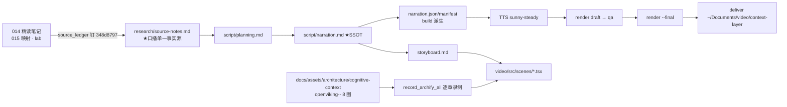

# 策划案：《给 AI 一座图书馆：OpenViking 上下文数据库》（Context Layer · 第 3 集）

## 1. 定位表

| 项 | 值 |
| --- | --- |
| 平台 | B 站 / YouTube 中长视频 |
| 时长目标 | **10–11 分钟**（硬约束 [9.5, 11.5]，≈2950 字 / ~120 句 / 句均 22–26 字） |
| 形态 | AI 配音（sunny-steady 音色克隆）+ Remotion 代码动画 + archify 动效图回放，无真人 |
| 受众 | 不预设 ML 背景的普通人（前两集观众可无缝接上，新观众零门槛） |
| 内容范围 | 014 精读笔记 §1/§3–§6/§9–§11 + 015 §结论/落地建议 + lab B1/B3/B6；砍掉：摄取切分细节、OKF 格式、TrieHI、ACL、许可证史（收尾一句带过开源与许可） |

## 2. 叙事策略

- **贯穿比喻（单射，源自 014《类比计划》）**：**一座会自己编目的图书馆**。Agent=带问题来的研究员；`viking://`=馆藏位置编号（三分区：公共馆藏/读者档案室/馆员手册室）；L0=书架侧面一句话标签、L1=书架导览页、L2=书；编目员=自底向上摘要生成；参考馆员=目录递归检索；专家=rerank；借阅推车=token 预算；来访装订=会话归档；读者档案卡=长期记忆（卡名=身份）；「已整理」章=`.done`。全片角色**只此一套**，严禁一物多喻。
- **主线问题**：AI 的记忆、文档、技能散在三处、每次对话都从零开始——能不能把它们放进**一棵树**，让 AI 像逛图书馆一样「先看标签、再进书架、最后才翻书」，聊完还能自动归档成档案？→ 回答：能，但有三个必须说清的「但是」（默认档不递归、成绩单是自报、越豪华越依赖标签质量）。
- **记忆点节奏**（约每 60–90 秒）：①一棵树装下三类东西（P1）；②标签是裁出来的、零成本（P2）；③攒够一成变动才重印（P2）；④默认档其实是翻卡片柜（P3）；⑤书架好坏不给书加分（P3）；⑥同一主题永远是同一张卡（P4）；⑦先盖「已整理」章才算完（P4）；⑧自报成绩单要自己复算（P5）；⑨拆掉一个零件就坏一种样子（P6）。
- **理性收尾**：不吹「AI 从此有记忆」，落在「成绩单尚未被独立复现，但把上下文变成开源对象这件事本身值得记一笔」+ 本仓映射的真增量一句。

## 3. 视觉语言

- **色彩语义契约**（新三色，避开前两集琥珀金/青碧/淡紫与工程蓝/苔绿/暖橙）：
  - **玫红 #FF6F91 = 问题与反例**（失忆现场、废弃文档、算术错、批判边界）；
  - **薄荷绿 #3DDC97 = 图书馆机制**（树、书架、标签、卡片、推车——全片主角色）；
  - **长春花蓝 #8C9EFF = 证据与实验**（自报数字、口径标注、lab 实测、映射结论）。
- 深色底 `#0E1116` 系；警示红 `#FF5C5C` 仅用于「已废弃」降权演示与 B 系列破坏标记；确认绿 `#7ED321` 仅用于 `SELFTEST PASSED`；金句卡衬线体。
- 英文标识（viking://、L0/L1/L2、rerank、α、`.done`、LoCoMo）只作画面角标/字幕衬底，不进主线口播（首次出现口播用中文称呼：地址、标签/导览/原文、重排器、权重、完成标记）。
- 公式（f = α·子分 + (1−α)·父分）只作画面角标彩蛋。

## 4. 分幕结构表（7 幕 · 目标 ≈10.5 分钟）

| 幕 | 目标时间 | 主题 | 叙事要点（回溯 source-notes） | 视觉锚点 |
| --- | --- | --- | --- | --- |
| P0 | 0:00–1:10 | 三个失忆现场 | 三处分裂（P0）；漏召回救不回；提出「图书馆」比喻 | 对撞卡（记忆/文档/技能三柜碎裂）→ 图书馆开场 |
| P1 | 1:10–2:30 | 一棵树 | 一句话定位（P1）；三分区 + `~`；类型由位置推导（resources/memories 反例）；挪位置要换编号 | `openviking--uri-scope-tree` 逐层展开 |
| P2 | 2:30–4:10 | 标签与导览 | 目录级三层（P2）；256/4000 字符软上限；L0 从 L1 裁出零 LLM；>32 采样；新鲜度漏斗（NOOP/立刷/10%）；成本公式一句 | `openviking--tiering-l0-l1-l2` + `openviking--freshness-bubbling` |
| P3 | 4:10–6:00 | 两档检索 | **默认档=平铺**（P3 核心）；豪华档六步（拆单→前十→四架一批→专家打分→0.1 剪枝→三批刹车）；α=1.0 一句；推车降档不截断；lab QUICK/THINKING 对照（废弃文档陷阱） | `openviking--retrieval-phase` 回放 + `openviking--intent-typed-queries`；推车装置 |
| P4 | 6:00–7:50 | 来访与档案卡 | 两阶段（装订必成 → 后台整理）；相似≠同一（卡名裁决）；九类卡片一句带过（事件卡只增）；`.done`；lab 三次来访一张卡 + 重投跳过；残余风险照实说 | `openviking--session-commit-two-phase` + `openviking--memory-identity` |
| P5 | 7:50–9:10 | 拆台 | 自报归属句 + 口径三连（豆包 judge/失败不进分母/无消融）；24.20→82.08；主动讲反例 66.87 vs 76.00（但 14% token/48 倍快）；算术错 −22.8 实为 −15.3；论文不在开源版跑 | 证据分级卡 + 数字对账终端（CodeWalk/TerminalLog） |
| P6 | 9:10–10:30 | 实验室与收尾 | B1 拔标签（1.00→0.50，平铺免疫）；B3 三张矛盾卡；B6 重投翻倍；本仓真增量一句（显式提交链对断链）；开源与许可一句；理性收尾 + 下期 | `openviking--lab-break-matrix` + SELFTEST 终端实录 |

## 5. 生产管线图（Mermaid）

## 6. 边界与不做的事

- BGM 留空轨（后期统一处理）；不出现任何上游仓库截图/图片素材（AGPL 与美学纪律），一切可视化用本集视觉契约重建；
- 论文细节（TrieHI/VikingMem 实验）与摄取切分参数不进口播主线，只进画面角标；
- 活数据（star 数、贡献者数）不进口播；许可证只说「开源、条款需自行评估」一句，不给法律结论；
- 口播不出现他集标题与序数词（校验：check_series）；`archify full/inset` 字面串不进 storyboard。
