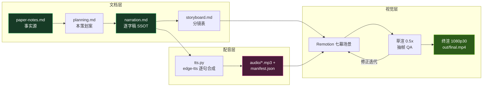

# 《会写代码的 AI，开始给自己写代码》科普视频策划案

> 基于 H. Zhou, H. Hu, Y. Shang, and Q. Zhang, "Self-Evolving Coding Agents: A Survey," arXiv:2608.03392, Aug. 2026（南京理工大学 × 南京大学综述）
> 素材事实源：[../research/paper-notes.md](../research/paper-notes.md)

## 一、定位

| 维度 | 决策 |
|---|---|
| 平台 | B 站 / YouTube 中长视频 |
| 时长 | 由内容密度决定，硬约束 12–20 分钟（估算锚 280 字/分）；目标实渲 14.5–15.5 分钟（~185 句） |
| 形态 | 动效图解式：AI 配音（edge-tts）+ Remotion 代码动画，无真人出镜 |
| 受众 | 对 AI 好奇的普通观众；不预设机器学习或软件工程背景 |
| 核心内容 | 全文主线：概念边界（三圈）→ 五个进化的对象 → 时机×证据 → 评测 → 可信进化 |
| 系列关系 | 第三集=**领域深潜**：前两集讲通用道理（部署后经验怎么攒 / 自我进化改什么），本集看自进化最先真实落地的田野——代码（可执行反馈让进化可测量）；片尾三卡回顾，顺序以 [../../series.json](../../series.json) 为准，各集独立成片 |

## 二、叙事策略

1. **一个贯穿全片的拟人化**：编码智能体 = **一位 AI 程序员**——它已经坐在真实工位上（读需求、看仓库、跑测试、修 bug），本片讲的是它被允许逐步升级装备（框架/记忆/技能/工具/工作流）乃至**改写自己的源码**（模型/框架自进化）的故事。测试、编译器、CI 是它的「免费裁判」。全片辩证主线：**洋红的进化冲动 × 绿色的验证守门**。
2. **一条主线问题**：写代码的 AI，能不能把自己越改越强——以及，**改了凭什么信**？前半（能不能）覆盖 §3 五对象 + §4 时机证据，后半（凭什么信）覆盖 §5 评测 + §6 挑战，正落论文结论 KEY QUOTE「不只是让编码智能体进化，而是让它们的进化 trustworthy」。
3. **每 60–90 秒一个记忆点**（全部取自 paper-notes 第 4 段素材库）：
   - P0「它打开的不是你的代码，是它自己的源码」（SICA 反转钩子）
   - P1「软件工程=天然试验田」+ Table 1 三圈交集图
   - P2「改自己源码的 SICA」「失败也存的经验银行」「记忆记 WHAT、技能编 HOW」「自己造 bug 再修的自己」「数据多≠变强（仓鼠轮）」「健身房不是运动员」
   - P3「一次报错当场改补丁，反复报错升级成记忆」「成绩单只有名次没有评语」「测试跑一遍，骗不了人」
   - P4「SWE-bench：真修好一个真实 issue，不是做选择题」「刷分≠进化」
   - P5「一滴墨掉进水库」（坏信号跨代遗传）、「错误的测试会教坏 agent」、KEY QUOTE 金句卡
   - P6 三集拼图卡（怎么攒 / 改什么 / 代码领域全图，顺序以 series.json 为准）
4. **理性收尾**：论文落点不是「AI 终将取代程序员」，而是工程命题——进化要过验证之门（验反馈/修记忆/审技能/限自改/评长期五机制）；开放问题留给观众（学到的进化能否迁移出代码世界，论文说 largely unexplored）。

## 三、视觉语言（本集独立契约）

- **双色语义系统（贯穿全片）**：
  - **终端绿 `#4ADE80` = 可执行证据**（测试/编译器反馈、SWE-bench 执行验证、可信进化守门——全片主色）；
  - **洋红 `#FF6EC7` = 进化动作**（自我修改/变异，五对象被"改"时的辉光与箭头）；
  - 两色互补，对应全片辩证结构「进化（洋红冲动）× 验证（绿色守门）」。
- **ok 覆写决策**：本集将底座确认绿 `#7ED321` 覆写为终端绿 `#4ADE80`（本集几乎所有 ✓ 都是「测试通过」=证据成立，语义合一；避免双绿打架）。覆写决策记录于 theme.ts / 本策划案 / README 三处。
- **反枚举色彩原则**：P2 五个进化对象**不配五色**——五卡统一 panel 底+编号+图标，被进化时加洋红辉光；颜色永远只回答「这是证据、进化还是失败」。时间维度（P3 三种时机）用位置与线型编码，不用色。
- 深色背景 `#0E1116` 系沿用；警示红 `#FF5C5C` 仅失败态（恒配 ✗ 图标）；金句卡衬线大字居中 + 英文原文出处。
- 公式只作画面角标彩蛋（如 RQ 三问、3×3 矩阵维度名），不进口播主线。
- 底部烧录字幕：单行、每句一条、与配音逐句同步。

## 四、七幕结构（时间为目标值，最终以配音实测为准）

| 幕 | 目标时间 | 主题 | 叙事要点（回溯 paper-notes） | 视觉锚点 |
|---|---|---|---|---|
| P0 | 0:00–1:10 | 冷开场 | 编码 AI 已在真实软件流程上班（读需求/看仓库/跑测试/修 bug）→ 但「上线即定型」（静态五件套被水泥浇筑）→ 反转：有一类 AI 打开的是**自己的源码文件**（SICA）→ 主线问题：能不能把自己越改越强、改了凭什么信 → 论文卡（arXiv:2608.03392，NJUST×NJU，三问：进化什么/何时靠什么证据/怎么评）→ 标题卡 | 八图标能力连环点亮；水泥浇筑齿轮；SICA 打开自己源码的反转画面；绿×洋红双色光带标题卡 |
| P1 | 1:10–3:00 | 概念边界：三个圈 | 编码智能体一句话（能读仓库改文件跑测试的 AI 员工；SWE-agent/OpenHands）→ 自进化智能体（Reflexion 复盘/Voyager 技能库/ExpeL 经验学习者）→ **Table 1 三圈交集**：普通编码智能体∩自进化智能体=自进化编码智能体 → 为什么软件工程是天然试验田：三大养料（可执行反馈=六份免费体检报告/仓库级上下文/编码轨迹） | 三圈韦恩图逐圈点亮；六仪表盘（测试/编译器/运行时/lint/CI/代码评审）；土壤+三养分管意象 |
| P2 | 3:00–8:00 | 五个进化的对象 | 总览：编码智能体的五个「可进化器官」地图 → ①**框架**（改自己的源码）：SICA 自改源码+基准验证、STOP 递归自改、Darwin Gödel Machine/Mendel/Huxley 变体档案库（每代改进体建博物馆）；**最高风险：改坏自己**（红调警示）②**记忆**：SWE-Exp 经验银行（失败轨迹也存）、EvoCoder 层级经验池、仓库记忆（commit 历史→定位知识）、EvoRepair 漏洞修复经验；**关键挑战=选择性进化，不是越多越好** ③**技能与工具**：记忆记 WHAT、技能编 HOW；CODESKILL 轨迹→技能库、gskill=自动生成的仓库入职文档、Socratic-SWE 技能注册表闭环、Live-SWE-Agent 现场造工具 ④**模型**：测试/编译器/轨迹→训练信号；Self-play SWE-RL 自己造 bug 再修自己、coder-verifier 共进化（CURE/ReVeal/ACE：出题的与解题的互相逼强）；**反直觉：数据多≠变强**（须 learnable information gain，否则仓鼠轮刷副本强化偏见）；**边界纪律：SWE-Gym/R2E-Gym=健身房器材不是运动员** ⑤**工作流与拓扑**：改「组织方式」——AFlow 搜索工作流图、AgentConductor 按任务难度调沟通密度（简单题少开会）、EvoMAC 协作网络可改写；五个灵魂拷问（何时搜仓库/测试多晚跑/日志发给谁/谁评审/沟通值多少钱） | 五器官地图（编号卡+洋红辉光逐个点亮）；SICA 打开自己源码文件；经验银行金库（含红色失败卡片）；WHAT/HOW 双卡对照；造 bug-修 bug 循环；仓鼠轮；健身房门牌；地铁线路图点亮支线 |
| P3 | 8:00–10:00 | 何时进化×凭什么进化 | WHEN 三态：**干活时**（task-time：测试一挂当场改，Live-SWE-Agent 现场造工具）/ **下班后**（post-task：复盘成记忆技能，「工单进教科书而非废纸篓」）/ **攒批换代**（stage-wise：一批轨迹攒成训练信号，影响未来版本）× EVIDENCE 三源：**结果证据**（跑分=选择压，但「成绩单只有名次没有评语」）/ **环境反馈**（编译器/测试日志=仪表盘直播，最即时）/ **轨迹证据**（完整过程录像，价值最高但要剪辑抽象）→ 3×3 矩阵合成 → Table 2 规律：改组织当场改、改模型必须攒批、攒记忆靠复盘 → 软件王牌：**可执行证据，测试跑一遍骗不了人** | 秒表/日记本/进化树三格漫画；成绩单（名次有/评语空）；仪表盘；录像带→招式卡片；3×3 矩阵网格逐格点亮（位置编码不用色） |
| P4 | 10:00–12:00 | 怎么知道真的变强了 | **SWE-bench 家族=真实 GitHub issue+执行验证**（真修好才算过，不是做选择题；Lite/Verified/Pro 变体）→ 函数级基准（HumanEval 等）只是体检指标，仓库级才是临床手术 → 分数涨了但分数不招供（功劳属于记忆？技能？工作流？模型？五个嫌疑人）→ 更完整的评测：成本/token/步数/跨仓库迁移 → **缺口：可维护性/安全/长期可靠性几乎没人测**；「在哪儿进化的，出了那间教室还算数吗」 | 真实 issue 卡+测试跑绿勾；选择题 vs 修 bug 对比；五个嫌疑人剪影+孤零零分数；六维雷达图；教室门意象 |
| P5 | 12:00–14:00 | 进化要可信 | 挑战升维：**一滴墨掉进水库**（不可靠的测试不只毁一个补丁，会被存成记忆/蒸馏成技能/选成工作流/写进模型——跨代遗传）→ 复现难（每次运行代理都在变；背题/刷榜/对公开信号过拟合三种假动作）→ **反馈可靠性：错误的测试会教坏 agent**（被污染的裁判改写球员今后全部打法）→ 记忆库四宗罪（过期/冗余/认死一个仓库/被失败轨迹污染）→ 工具可靠性不是实现细节而是正题 → **KEY QUOTE 金句卡**：「不只是让编码智能体进化，而是让它们的进化 trustworthy」+ 五机制清单（验反馈/修记忆/审技能/限自改/评长期） | 墨滴入水库全链变黑；三假动作小剧场；裁判被污染；图书馆发霉/复印/伪证；绿色大门+五格清单；衬线绿字金句卡 |
| P6 | 14:00–15:20 | 收尾 | 五对象一帧回顾+可信进化绿门收束 → **系列三卡**：《上线之后，AI 才开始上学》（金青紫·经验怎么攒）/《AI 如何自己变强？》（蓝橙·自我进化改什么）/ 本集（绿洋红·代码领域全图）→ 开放问题：学到的进化能否迁移出代码世界（largely unexplored）→ 配套仓库 Awesome-Self-Evolving-Coding-Agents → 引用卡 arXiv:2608.03392 渐黑 | 五器官地图缩略回顾；三集拼图卡并排；星空单问号；引用卡 |

## 五、生产管线

- 公共脚本收敛于 [media/pipeline/](../../pipeline/README.md)（本工程 scripts/ 为薄包装）。
- 同步机制：每句一段 MP3；Remotion `calculateMetadata` 读 manifest 自动计算时间轴（句间 0.32s、幕间 +0.9s、片头 0.6s、片尾 2s）——改稿后只需重跑 build→tts→render。
- 质量门：逐字稿定稿前过 `pipeline/skills/04-verification.md` 双重校验（真实性回溯 + 易懂性评审）；渲染后逐幕抽帧目检。

## 六、边界与不做的事

- BGM 留空轨（版权考量，用户后期自选）；不使用任何未经授权的第三方图片/音频素材，全部画面为代码生成。
- 论文之外的观点不进口播正文；需要延伸时明确口播「论文之外多说一句」。
- Table 2 巨表不进画面不进口播枚举；以「五对象概念地图」承载结构，口播仅引用精确计数（30 条收录等）。
- 与前两集差异化：不复用前两集通用比喻（入职员工/夜校/原油汽油）；P2–P4 全部锚定编码特有证据链（测试/编译器/真实 issue）。
- Remotion 采用个人科普用途免费授权；edge-tts 发布前确认平台对合成语音的标注要求。
