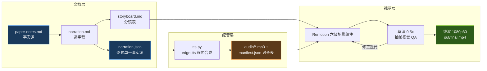

# 《AI 如何自己变强？》科普视频策划案

> 基于 [arXiv:2607.13104《Self-Improvements in Modern Agentic Systems: A Survey》](https://arxiv.org/html/2607.13104v1)
> 素材事实源：[../research/paper-notes.md](../research/paper-notes.md)

## 一、定位

| 维度 | 决策 |
|---|---|
| 平台 | B 站 / YouTube 中长视频 |
| 时长 | 目标 15 分钟（硬约束 12–20 分钟） |
| 形态 | 动效图解式：AI 配音 + 动态图表/动画，无真人出镜（量子位/回形针风格） |
| 受众 | 对 AI 好奇的普通观众；不预设机器学习背景，允许听懂"训练/模型"级词汇 |
| 核心内容 | 论文第 5 章（基础模型自进化，改"大脑"θ）与第 6 章（Agent Harness/脚手架自进化，改"装备"Σ） |

## 二、叙事策略

1. **一个贯穿全片的拟人化**：AI 智能体 = 大脑（模型权重 θ）+ 装备（Σ：眼镜=提示词、笔记本=记忆、工具箱=工具、行动守则=控制逻辑）。论文的全部形式化都翻译进这套比喻，公式只以"视觉彩蛋"形式出现在画面角落，不进入口播主线。
2. **一条主线问题**：今天的 AI 每次对话归零、用完即忘——它能不能像人一样越用越强？答案分两条路：改大脑（慢、贵、稳）与改装备（快、便宜、可逆），两条路互相嵌套成"快慢双环"。
3. **每 90 秒一个记忆点**：套娃裁判、自信地错一百遍、在梦里练车、砍树程序、一边开船一边修船、铅笔与刻石头……全部取自论文原文的比喻或由笔记素材直接派生。
4. **理性收尾不贩卖焦虑**：明确"今天的自进化全部是有边界、可验证的循环"，把悬念留在开放问题上而非末日想象上。

## 三、视觉语言

- **双色语义系统（贯穿全片）**：蓝色 `#4A9EFF` = 改大脑（θ 通路）；橙色 `#FF9F45` = 改装备（Σ 通路）。任何示意图中两条通路严格用色。
- 深色背景（`#0E1116` 系），高对比度文字；金句卡用衬线大字居中呈现，标注英文原文出处。
- 底部烧录字幕：单行、每句一条、与配音逐句同步。
- 图表遵循 dataviz 设计规范；Mermaid 式结构图用动效逐步展开而非一次性甩全图。
- 中文正文字体：PingFang SC；数字/代码：等宽字体。

## 四、六幕结构（时间为目标值，最终以配音实测时长为准）

| 幕 | 目标时间 | 主题 | 叙事要点 | 视觉锚点 |
|---|---|---|---|---|
| P0 | 0:00–1:10 | 冷开场 | I.J. Good 1966"最后一项发明"→ 今天 AI 的尴尬：金鱼记忆、每次归零 → 主线问题：AI 能不能越用越强？→ 本片依据：2026 Schmidhuber 团队综述 | 打字机金句卡；金鱼记忆动画；论文封面 |
| P1 | 1:10–3:00 | 一个 AI 智能体的解剖图 | 大脑+装备拟人化；草稿纸（临时状态）用完就扔≠成长；自我改进的定义=把经验变成**持久**升级；两条路线全片地图 | 角色装配动画；蓝/橙分叉路线图 |
| P2 | 3:00–7:30 | 改大脑的三种功法（第 5 章） | 5.1 自己出题自己练；5.2 自己当裁判（含套娃裁判、全班投票）；5.3 去真实世界撞南墙（单元测试=最干净的老师；世界模型=在梦里练车）；每小节带风险反转 | 出题循环图；套娃裁判；"自信地错一百遍"金句卡 |
| P3 | 7:30–12:00 | 改装备的四个层级（第 6 章） | 递进阶梯：6.1 换眼镜（提示）→ 6.2 记笔记（记忆）→ 6.3 造工具 → 6.4 改造全身（完整脚手架）；Voyager 砍树程序小剧场；Darwin Gödel Machine 后代树；一切过验证门 | 四层阶梯；像素风 Minecraft 小剧场；莫比乌斯环 |
| P4 | 12:00–14:00 | 平衡与安全 | 快慢双环（白天探索/睡觉固化）；铅笔 vs 刻石头；蒸馏是有损压缩；裁判是攻击面→运动员不能管裁判；把自改进 AI 当"受保护运行时里的不可信代码" | 嵌套双环图；门禁闸门动画 |
| P5 | 14:00–15:30 | 收尾 | 回到 Gödel Machine 与智能爆炸；现实检查：有边界、可验证的循环；缺的不是更大模型而是可靠反馈+安全架构+评估即持续集成；呼应开场，留开放问题 | 首尾呼应金句卡；原文链接卡 |

## 五、生产管线

- **同步机制**：每句一段音频；场景时长 = Σ 句音频时长 + 停顿帧，由 Remotion `calculateMetadata` 读取 manifest 自动计算——音画与字幕天然同步，无需手工对轨。
- **质量门**：逐字稿定稿前过真实性校验（每个断言回溯 paper-notes.md）与易懂性评审；渲染后抽帧目检。

## 六、边界与不做的事

- BGM 留空轨（版权考量，用户后期自选）；不使用任何未经授权的第三方图片/音频素材，全部画面为代码生成。
- 论文之外的观点不进入口播正文；需要延伸时明确口播"论文之外多说一句"。
- Remotion 采用个人科普用途免费授权；若日后转为公司用途需评估商业许可（备选 MIT 协议 Motion Canvas）。
