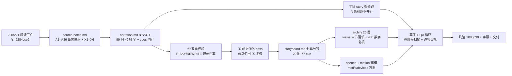

# Stage ② 策划案 ——《没有海关的港口：Skills 的签名、分发与版本战争》

> 信源：`research/sources.toml`（16 条）+ `research/source-notes.md`（A1–A36 断言映射）；叙事蓝本 =
> [220 供应链精读](../../../../../docs/research/agent-infra/220-skills-supply-chain.md)（钉 `9284cce2`）；七幕大纲 SSOT = `.context/e3-blueprint.md` 附录 A2（本地蓝图未入库；其幕四「海关还没建」落稿重排为本文 P5 投毒现场，三场战争 P1→P3 连讲，与 narration 不一致处以 narration 为准）。

## 1. 定位表

| 项 | 值 |
| --- | --- |
| 平台 | B 站 / YouTube 中长视频 |
| 时长目标 | 硬窗 [12.5, 15.6] 双口径同窗：4,279 字 @story 档实测 318 字/分 ≈ 13:28（守下限）/ @280 字/分估算 ≈ 15:17（守上限） |
| 形态 | AI 配音（story 段落演绎档，克隆音色 me-bright）+ Remotion 代码动画 + archify 逐章图解回放（20 图 = 18 新绘 + 2 张 220 入库图补章：dual-harbor / ious-route；77 章＝77 cue）；无真人 |
| 受众 | 不预设供应链背景的开发者：天天 npx 装技能、听过 npm 投毒史，但没想过「技能生态正站在同一条时间线上」的人 |
| 核心范围 | 220 六机制全部入片：#254 舱单与铅封 / 三层信任栈=sigstore 重演 / 版本双门失效 / SEP-2640 双港对照 / 四闸门与投毒战报 / 包管理器先例对账 + 三张欠条闭环收束 |
| 明确砍掉 | ClawHavoc 1,184（二手转述降级为不提）、MalSkillBench 86.3% 只留「假前置依赖」一词、allowed-tools 三线治理悬案、AI 元剧场彩蛋（不占口播）、221 仓内 DB 映射（A 表不入片）、Jev/系列他集一切关联（反串线红线） |

## 2. 叙事策略

**剧场（单一世界观，全片唯一）**：知识的港口·海关篇——剧场延续 210（箱体已在海上跑，本集讲进港之后）。角色单射表见 220 开篇 [!TIP] 映射表，本片不得出现映射表之外的新角色；确需新增先登记。

**主线问题（钩子→悬念→回答）**：
- 钩子（P0）：一段终端实录——8 个安全词干扫过 247 行规范正文，唯一命中是 L133 里一个普通单词的肚子（De-SIGN-ed）；46 家互认的港区，没有海关（A1–A3）。
- 悬念（P1–P5）：三张欠条逐张翻账——分发舱单停摆六个半月（A5–A8）、签名答案在评论区手工重造 sigstore（A10–A17）、版本编号牌压根不存在（A18–A21）；而隔壁 MCP 港区 81 天修通半条航线（A23–A26），投毒已在四道闸门间开工（A27–A35）。
- 回答（P6）：三张欠条逐一盖章——答案都不在条文里：签名在评论区原型里、分发在租客手里、版本在提案队列里；带强制力的中心设施，这里一座都还没长出来（220 §8/规律 4）。

**记忆点节奏（约 60–90 秒一个，全部可溯源 source-notes）**：
1. 「签名的 sign，藏在一个普通单词的肚子里」（A1）②
2. 「躺了六个多月的总舱单，评论区长出三层信任栈」（A8/A11）③
3. 「社区手工重造了 sigstore 的答案」（A15）④
4. 「写死就卡死，省略就全员跳变」（A18/X5）⑤
5. 「批准绑定内容，一变即作废」（A24）⑥
6. 「四道闸门，只有一道真设了卡」（A32）⑦
7. 「每一箱货，都在裸运」（A2+§7 无签名结论）⑧

**理性收尾原则**：不贩卖焦虑（战报只报可归属数字，扫描口径与自报角标随行）；不预言终战（三个可跟踪信号替代结论，对齐 220 §9 争议 3 与 §12「叙事框架非因果证明」边界）。

## 3. 视觉语言

**色彩语义契约**（theme.ts 定稿，跨幕严格用色）：

| 色 | 值 | 语义（全片唯一） |
| --- | --- | --- |
| 关税橙 | `#FF6A3D`（concept） | 海关/闸门/攻击面——一切「要过检」的摩擦面 |
| 检疫绿 | `#A6F750`（conceptDeep） | 见证/验证/批准面——一切「核过」的放行面 |
| 警示金 | `#FFC85C`（deny） | 悬案/冻结/留白 |
| 底座 | `#0E1116` 深海夜港 | 背景 |
| 瞬时红 | `#FF5C5C`（danger） | 仅攻击命中瞬间（隐形墨水显形、直执） |
| 瞬时绿 | `#7ED321`（ok） | 仅确认门拦停/校验通过瞬间 |

**港口海关篇类比映射（上屏子集；完整单射以 220 [!TIP] 表为唯一事实源）**：index.json=公示栏总舱单 · digest=铅封 · 域名+TLS=地契围墙 · DSSE sidecar=随箱签章 · 第三方见证=灯塔见证人 · 锁步竞态=阴阳舱单 · soft-404=盖章的「查无此货」 · MCP 航线=隔壁港定期班轮 · semver=编号牌 · lockfile=提单存根 · registry 历史=保税仓 · typosquat=走私船挂正规船名 · U+E0000=隐形墨水。

- 规范/SEP 原文引文用引号卡（引语态）；实测数字等宽角标；金句卡衬线体（theme.serif）。
- 恒定视觉锚〔M-001〕铅封+舱单行母题全片同形（橙描边恒线宽）；〔M-003〕持续陈述配可停驻终态。
- 空间语义恒定：左=堆场/发布方，右=泊位/用户端，「分发流向」永远向右；全屏独占期间装置让位（forbid_inset）。

## 4. 分幕结构表（七幕，字数＝narration.md 实际计数·含标点口径，与 pipeline len(text) 一致）

| 幕 | 句区间 | 字数 | 目标时间 | 核心问题 | archify 图 |
| --- | --- | --- | --- | --- | --- |
| P0 规范里没有的词 | p0-01..12（12 句） | 404 | ~1.3 min | 46 家互认的港区为什么没有海关？ | grep-verdict / port-no-customs / history-cliff（3） |
| P1 停摆的舱单 | p1-01..14（19 句） | 855 | ~2.7 min | 分发的标准答案为什么躺在仓库里六个多月？ | manifest-anatomy / three-objections / four-cracks / lockstep-race（4） |
| P2 三层信任栈 | p2-01..12（13 句） | 575 | ~1.8 min | 签名的答案长在哪里？ | trust-stack / sigstore-overlap / enforcement-gap（3） |
| P3 编号牌失踪 | p3-01..13（13 句） | 610 | ~1.9 min | 版本号为什么不存在、又为什么难产？ | version-gates / two-species / lockfile-orphan（3） |
| P4 隔壁港开了航线 | p4-01..12（16 句） | 629 | ~2.0 min | 冻结的主港对面，81 天修通了什么？ | dual-harbor / sep-mechanism / honest-boundary（3） |
| P5 投毒现场 | p5-01..11（16 句） | 779 | ~2.5 min | 规范还在吵时，海上已经发生了什么？ | toxic-funnel / invisible-ink / four-gates（3） |
| P6 三张欠条的对账 | p6-01..10（10 句） | 427 | ~1.3 min | 三张欠条各自兑付到哪一步？ | ious-route（1，含三信号灯装置） |

合计 99 句 4,279 字 ≈ 13:28 @318 / ≈ 15:17 @280（硬窗 [12.5,15.6] 内；P1/P5 为信息密度峰，P6 留白收束）。

## 5. 生产管线图

## 6. 边界与不做的事

- BGM 留空轨；本片 zh 单语（英文版触发条件=用户明确要求）。
- 220/台账之外的旁证不进口播；他方数字一律自复算或带归属角标（source-notes §三）；2,982 万必随「含 CI/bot」、18.8 万必随「文件实例含 fork」、Snyk 组数字画面带 @2026-02-05。
- 不出现他集标题、集数序号、「上一集/本系列」等顺序词；「下期」仅 p6-10 一次。
- 画面文字一律关键词锚点（≤6 字），禁整句复述口播（复述门）；storyboard 禁 archify 全屏/画中画英文字面串。
- lab3 数字口播带「我们实测/复刻/玩具」限定；E-04 只以 mock 示意呈现、不执行任何真实命令（循 Reversec 自我定位措辞）。
- 治理叙事只用事实句（#546 作者、桥维护者身份均有 gh api 实证），不作动机推断；AI 元剧场压片尾彩蛋不占口播。
- 片尾口径卡「数据截至 2026-09-27」；成片前 48h 固定复核六线：#254/#380/#546/#573/#520/#515 + 主仓 HEAD，任一解冻启用备播文案；存疑大数字不上屏（ClawHub >10,700、1,564,878、Nikolife2016 14.2%，蓝图 A4-7/A5）。
