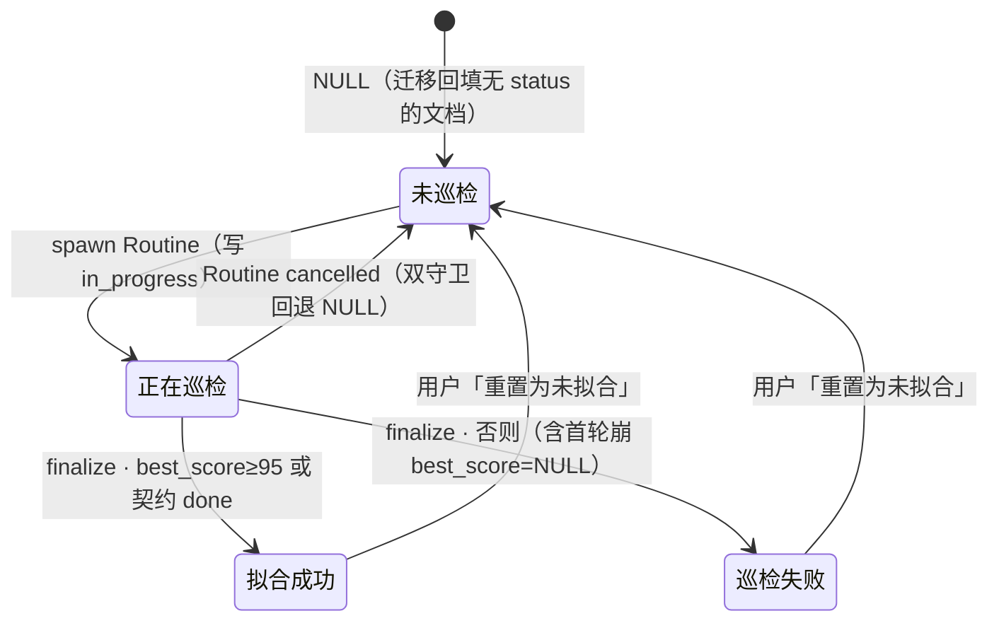
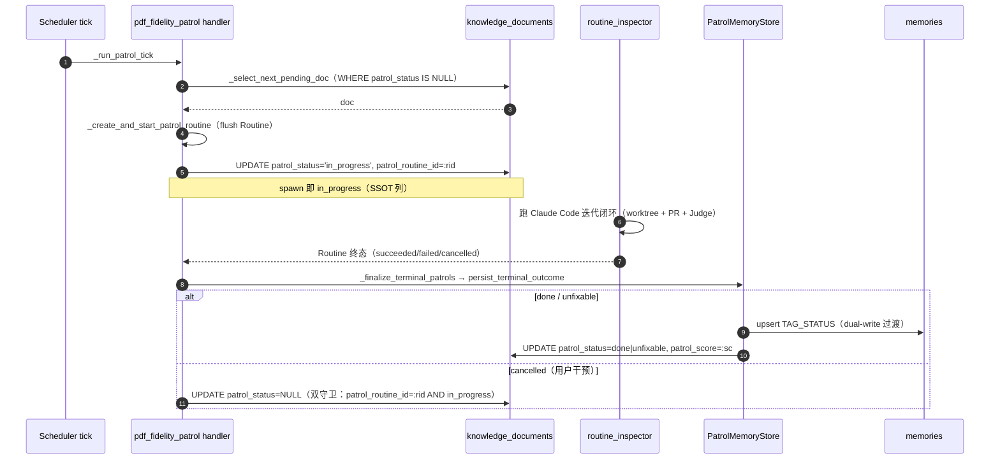
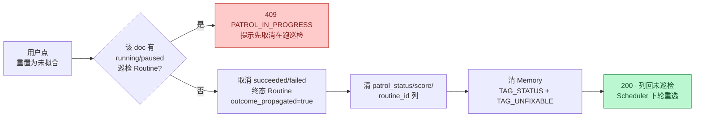

# PDF Fidelity Patrol 巡检状态落库方案

> 把「PDF Fidelity Patrol（PDF→Markdown 高保真自拟合巡检）」的**文档级巡检状态**从 Memory 标签迁为 `knowledge_documents` 持久列（SSOT），解锁前端「巡检状态」列展示与「重置为未拟合」二次巡检。
>
> 关联：[PDF 一比一还原质量迭代](./pdf-harness-engineering-parity.md)（perceives 端保真迭代，本文是「巡检状态」机制）、[Issues 摘要](./issue.md)。

## 1. 背景与动机

巡检 Scheduler（`pdf_fidelity_patrol`，每 600s tick）派生 Routine 对 PDF 文档做拟合巡检。改造前，**文档级巡检状态完全不存在于文档行**——它只以 [`negentropy.memories`](../../apps/negentropy/src/negentropy/models/) 表里 `tag=pdf-fidelity-status` 的标签行存在（值域仅 `done|unfixable`，无 `in_progress`），且 Memory 受衰减治理（`MemoryGovernanceService`）可被清理。由此产生三个问题：

1. **不精准**：状态并非与文档生命周期绑定的持久事实，selector 依赖 [`get_skip_doc_ids()`](../../apps/negentropy/src/negentropy/engine/routine/patrol_memory.py) 读 Memory 标签跳过已完成文档，Memory 衰减后语义漂移。
2. **不可见**：[`KnowledgeDocument`](../../apps/negentropy/src/negentropy/models/perception.py) 无任何巡检字段，Documents 列表无法展示巡检进度与拟合分数。
3. **不可重试**：已拟合（done）文档被永久跳过，无入口让用户主动触发「二次深度巡检」。

**目标**：文档级巡检状态迁为 `KnowledgeDocument` 持久列（权威读源 SSOT），Documents 列表新增「巡检状态」列，并提供「重置为未拟合」操作。

## 2. 四态机

`knowledge_documents.patrol_status` 列的值域（NULL 语义为核心）：

| 列展示（中文） | `patrol_status` | 触发 | 列展示附带的 `patrol_score` |
|---|---|---|---|
| 未巡检过 | `NULL` | 从未终态沉淀（含回填后无历史 status 的文档） | NULL |
| 正在巡检 | `in_progress` | spawn 巡检 Routine 时刻写入 | NULL（清空历史分） |
| 巡检失败 | `unfixable` | 终态沉淀（best_score < 95 阈值 或 契约未 done） | best_score 峰值 |
| 拟合成功 · {score} | `done` | 终态沉淀（best_score ≥ 95 或 契约自报 done） | best_score 峰值 |

合格阈值常量 [`patrol_qualified_score_threshold=95`](../../apps/negentropy/src/negentropy/config/routine.py)（env `NE_ROUTINE_PATROL_QUALIFIED_SCORE_THRESHOLD`）。非 PDF 文档巡检状态列显示「—」（巡检仅针对 PDF，判据 `content_type ILIKE '%pdf%'`）。

## 3. 写入路径（dual-write 过渡 → Phase 2 SSOT）

> **策略**：DB 列为权威**读**源（selector / UI 均读列）；Memory `TAG_STATUS` 暂保留**写**入（过渡安全网，不破坏既有集成测试断言），Phase 2 再 deprecate。两写同会话同事务，一致 commit / 一致回滚。Memory 的 `TAG_UNFIXABLE`（区域级）/`TAG_PATTERN`/`TAG_BASELINE` 保留不动（非文档级状态，有独立读者）。

三处写入点（均同事务随 tick commit）：

| 时机 | 位置 | 写入 |
|---|---|---|
| spawn | [`_create_and_start_patrol_routine`](../../apps/negentropy/src/negentropy/engine/schedulers/handlers/pdf_fidelity_patrol.py) flush 后 | `patrol_status='in_progress'` + `patrol_routine_id` + 清 `patrol_score` |
| 终态 done/unfixable | [`_upsert_status`](../../apps/negentropy/src/negentropy/engine/routine/patrol_memory.py)（`record_done`/`record_doc_unfixable`/`persist_terminal_outcome` 复用） | `patrol_status` + `patrol_score`(best_score) + `patrol_routine_id` |
| cancelled | [`_finalize_terminal_patrols`](../../apps/negentropy/src/negentropy/engine/schedulers/handlers/pdf_fidelity_patrol.py) cancelled 分支 | 回退 NULL（**双守卫** `patrol_routine_id=:rid AND patrol_status='in_progress'`，仅回退本 routine 在 spawn 时写的态，绝不覆盖同 doc 另一更高分 Routine 已 finalize 的 done/unfixable） |

> **`_has_running_patrol` 保持读 `routines` 表，不读列**——SSOT：它回答「全局是否有真实在跑的巡检」，权威源是 `routines.status`；若改读列，routine 崩溃卡死会致 `in_progress` 残留而永久 SKIP 全系统巡检。

### 3.1 巡检态校正 reconcile（权威 = 最新非 cancelled 终态 Routine）

`_finalize_terminal_patrols` 的 last-write-wins + `_collapse_superseded_patrols` 取消冗余 Routine 时**不回写状态**，会污染列：一个先以 `failed` 终态写入 `unfixable`、随后被 collapse 取消的 Routine，会把更早 `succeeded` 的 `done` 覆盖成 `unfixable`（实测：succeeded/95 被 failed/2 覆盖，ISSUE-159）。

[`_reconcile_patrol_status`](../../apps/negentropy/src/negentropy/engine/schedulers/handlers/pdf_fidelity_patrol.py) 每 tick 在 collapse 之后运行，以**权威源 = routines 表**重算列：

- 每 doc 取**最新的非 cancelled 终态 Routine**（`succeeded`/`failed`，按 **`updated_at DESC`**）——`cancelled` = 被取代/放弃，非真实结论；`updated_at` 是终态达成时间（最后一次状态变更），代表「最近一次巡检结论」（`created_at` 仅 spawn 时间，完成顺序与创建顺序不一致时会误判）。
- `succeeded` 或 `best_score ≥ patrol_qualified_score_threshold` → `done`；否则 `unfixable`。
- **跳过有 `running`/`paused` Routine 的 doc**（spawn 写的 `in_progress` 是当前真实态，不可回退到旧终态）。
- 幂等：仅在 `patrol_status`/`patrol_routine_id` 变化时写（不每 tick 刷新 `patrol_updated_at`）。

存量受污染数据由迁移 [`0093`](../../apps/negentropy/src/negentropy/db/migrations/versions/0093_reconcile_patrol_status_from_winner.py)（同 SQL）在部署时一次性修复；之后由 tick reconcile 持续维持。

## 4. selector 迁移

[`_select_next_pending_doc`](../../apps/negentropy/src/negentropy/engine/schedulers/handlers/pdf_fidelity_patrol.py) 的候选门控（缺一不可）：

1. `content_type ILIKE '%pdf%'`（PDF 文档）
2. `markdown_extract_status = 'completed'`（转换完成）
3. **`patrol_status IS NULL`**（4 态语义：仅未巡检入选；**替换**旧 `id NOT IN :skip` 的 Memory skip_ids 路径）
4. `NOT EXISTS` 非 cancelled 巡检 Routine（一文一活跃巡检并发互斥；与 `patrol_status` 正交保留）

> **命名关注正交下沉**至 [`_doc_display_title`](../../apps/negentropy/src/negentropy/engine/schedulers/handlers/pdf_fidelity_patrol.py)（`display_name` → `metadata.title` → `original_filename` 三级兜底，复用 `resolve_effective_display_name`）：巡检资格不因缺名而被否决。历史「命名门控」（要求 `display_name`/`metadata.title` 非空）曾在此预筛，致未巡检但无标题文档被永久跳过而 Scheduler 误报「无待检 PDF 文档」，已移除——仅剩原始文件名（含 arxiv-ID 如 `2603.05344v3.pdf`）时仍发起巡检，Routine 名暂以文件名兜底，待更优名源出现（用户改名 / Fix B 标题回填）由 [`_collapse_superseded_patrols`](../../apps/negentropy/src/negentropy/engine/schedulers/handlers/pdf_fidelity_patrol.py) 自愈取消旧 Routine、下 tick 以更优名重建。
>
> `skip_ids` 形参保留为 Optional（过渡兼容，已忽略）；`get_skip_doc_ids()` 过渡期保留供测试，Phase 2 随 Memory TAG_STATUS deprecate 一并移除。

## 5. 「重置为未拟合」API

- **保守策略**：在跑（running/paused）巡检 → 409 拒绝（不杀在跑任务）；done/unfixable 文档正常重置。
- **关键约束**：重置必须取消该 doc 的非 cancelled 终态 Routine（解除 selector `NOT EXISTS` 门），否则重置后仍被挡、无法被重新选中。取消范式镜像 [`_collapse_superseded_patrols`](../../apps/negentropy/src/negentropy/engine/schedulers/handlers/pdf_fidelity_patrol.py)（置 `outcome_propagated=true` 防聚合态回写污染）。
- **端点**：`POST /knowledge/base/{corpus_id}/documents/{document_id}/reset-patrol`（+ 库文档平行 `POST /knowledge/documents/{document_id}/reset-patrol`）；返回更新后的 `DocumentResponse`。
- **服务层**：[`DocumentStorageService.reset_patrol_status`](../../apps/negentropy/src/negentropy/storage/service.py)；Memory 清理经 [`PatrolMemoryStore.clear_doc_legacy_memories`](../../apps/negentropy/src/negentropy/engine/routine/patrol_memory.py)（清 `TAG_STATUS` + `TAG_UNFIXABLE`，不清 `TAG_PATTERN`/`TAG_BASELINE`——跨 doc 方法/基线知识）。

## 6. 前端展示

- **列表新增「巡检状态」列**：[`documents/page.tsx`](../../apps/negentropy-ui/app/knowledge/documents/page.tsx) 顺势由旧 `div+grid-cols-13`（`grid-cols-13` 全仓无定义、列宽靠隐式网格自适应的隐患表）重构为 `<table table-fixed> + <colgroup>` 黄金标准（与 [RoutineTable](../../apps/negentropy-ui/app/interface/routine/_components/RoutineTable.tsx) 一致，对齐 CLAUDE.md「UI Table 设计规范」）。
- **Badge**：[`PatrolStatusBadge`](../../apps/negentropy-ui/app/knowledge/documents/_components/PatrolStatusBadge.tsx) 四态配色对齐 [`routineStatusClass`](../../apps/negentropy-ui/app/interface/routine/_components/status-style.ts)（`bg-{color}-500/15 ...`）与 [巡检语义表](../../apps/negentropy-ui/features/scheduler/patrol-reason.ts)；分数用 [`scoreColorClass`](../../apps/negentropy-ui/components/transcript/status-shared.ts) 上色；非 PDF 行显示「—」。
- **重置按钮**：Actions 单元格内，仅对 `isPdfDocument(doc) && patrol_status ∈ {done, unfixable}` 显示；经 [`useConfirmDialog`](../../apps/negentropy-ui/components/ui/useConfirmDialog.tsx) 确认 → [`resetDocumentPatrol`](../../apps/negentropy-ui/features/knowledge/utils/knowledge-api.ts) → `listRefresh()`；409 时 toast 提示「该文档正在巡检，请先取消在跑巡检再重置」。

## 7. 数据迁移（0092 建列 + 0093 校正）

[`0092_pdf_fidelity_patrol_status_column.py`](../../apps/negentropy/src/negentropy/db/migrations/versions/0092_pdf_fidelity_patrol_status_column.py)：

1. `ALTER TABLE ... ADD COLUMN IF NOT EXISTS` 四列（`patrol_routine_id` 带 `REFERENCES routines(id) ON DELETE SET NULL`）。
2. **回填**：从 `memories` 取每 doc 最新一条 `TAG_STATUS`（`DISTINCT ON (doc_id) ... ORDER BY created_at DESC`），`NULLIF(metadata->>'score','')::int` + `routine_id` uuid 正则守卫，写回 `patrol_status`/`patrol_score`/`patrol_routine_id`；带 `patrol_status IS NULL` 守卫，幂等可重跑。
3. `CREATE INDEX IF NOT EXISTS ix_knowledge_documents_patrol_status`。

> 0092 回填源（Memory）本身受 finalize last-write-wins 污染（见 §3.1）。[`0093_reconcile_patrol_status_from_winner.py`](../../apps/negentropy/src/negentropy/db/migrations/versions/0093_reconcile_patrol_status_from_winner.py) 紧随其后，以 routines 表为权威重算列（同 §3.1 reconcile SQL），一次性修复存量受污染数据。
4. **downgrade 红线**：patrol 态可由重跑巡检确定性再生（终态 Routine 经 `_finalize_terminal_patrols` 重沉淀），故 `DROP COLUMN` 可接受、**不回写 memories**。

## 8. dual-write → Phase 2 路线

- **Phase 1（本次）**：DB 列为权威读源；Memory `TAG_STATUS` 仍写（dual-write），`get_skip_doc_ids()` 过渡保留。代码中以 `# TODO(phase2)` 标注。
- **Phase 2（独立 PR，待列写稳定观察后）**：删 `_upsert_status` 的 Memory 写分支 + `get_skip_doc_ids()` + `skip_ids` 形参，改测试断言到列，完成 `TAG_STATUS` deprecate。

> 选 dual-write 而非 clean-cut：保留 5 处依赖 Memory 的集成测试断言不炸（[`test_pdf_fidelity_patrol_integration.py`](../../apps/negentropy/tests/unit_tests/engine/test_pdf_fidelity_patrol_integration.py)），读侧单一事实源立即收敛，可灰度观察后移除，可逆。

## 9. 边界与风险

| 风险 | 处置 |
|---|---|
| 并发 spawn 两 tick 选同一 NULL 文档 | `_has_running_patrol`（全局互斥）+ interval=完成+600s + NOT EXISTS 门三重挡；spawn 列写在 Routine flush 后同事务，Routine 行先于列可见 |
| dual-write 漂移 | 两写同会话同事务一致回滚；列 UPDATE 命中 0 行（doc 已硬删）时 Memory 仍写为良性孤儿 |
| Memory 衰减 | 读侧已迁到列，衰减不再影响 selector 正确性（迁移核心收益）；务必同 PR 上线「列读 + dual-write」 |
| reset 与在跑 Routine 冲突 | 409 拒绝（保守），不静默杀任务 |
| 回填对无 status 文档 | TAG_STATUS 缺失 → 列 NULL = 未巡检；历史「巡检过但 memory 已衰减」文档被当未巡检重选 = 期望行为（重新拟合） |
| `patrol_routine_id` FK SET NULL | Routine 硬删时列置 NULL，`patrol_status` 保留 done/unfixable 不影响 selector；reset 仍可清 |
| `:param::uuid` cast 破坏 SQLAlchemy text() bindparam 检测 | 一律用 `CAST(:param AS uuid)`（同 [display_name 回填迁移](../../apps/negentropy/src/negentropy/db/migrations/versions/0040_add_knowledge_document_display_name.py) 的既定范式） |

## 10. 验证

- **迁移**：测试库 `uv run alembic upgrade head`（含 0092）→ 抽查 PDF 文档行回填；集成测试 `test_migration_0092_backfills_patrol_status_from_memories` 锁回填逻辑。
- **后端**：`uv run pytest tests/unit_tests/engine/test_pdf_fidelity_patrol_handler.py tests/unit_tests/engine/test_pdf_fidelity_patrol_integration.py -q`（46 用例：spawn 写 in_progress、终态写 done/unfixable、cancelled 回退、selector 读列、reset 清列+取消 Routine、reset 在跑 409、迁移回填）。
- **实机**：起后端 + 引擎，触发 patrol tick → 观察目标 PDF 文档 `patrol_status` 由 NULL→`in_progress`→终态 + `patrol_score`；前端对 done 文档点「重置为未拟合」→ 列回「未巡检」→ 下 tick 重新选中（二次巡检）。
