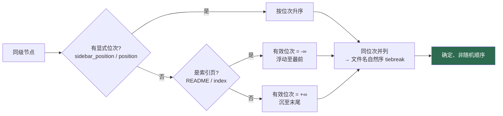
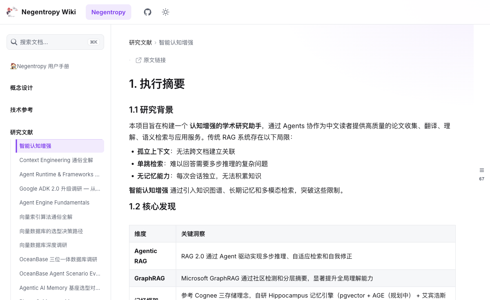

# Wiki 文档排序元数据规范

> 管理 `docs/` 子项在 wiki「Negentropy」一级目录下的**先后排序**，使其确定、可控、非随机。
> 范式对齐 [Docusaurus](https://docusaurus.io/docs/sidebar/items#doc-frontmatter) 的事实标准（与仓内既有 `sidebar_position` 约定一致，零学习成本）。

## 1. 背景与根因

wiki 站点预留的一级目录「Negentropy」由本仓 `docs/` 合成（`wiki_docs_ingest.py::build_docs_pack`，`include_dirs=["concepts","reference","research"]`）。改造前其导航排序**完全由文件名自然序决定**，存在两类「随机观感」：

- 文件 frontmatter 里的 `sidebar_position` 是**死数据**（ingest 从不解析 frontmatter）；
- 目录无任何位置元数据，目录间顺序仅靠字母序。

本规范定义**完备且足够简约**的元数据，并已让 ingest 真正消费它。

## 2. 元数据 Schema（SSOT + 正交分解）

文件的位次/标题**随文件走**，目录的位次/标签**随目录走**，两类互不耦合：

| 载体 | 字段 | 作用 | 必填 |
|---|---|---|---|
| 文件 frontmatter | `sidebar_position`（int/float） | 同级排序位次，**支持小数**（拖拽中点插入） | 排序必需 |
| 文件 frontmatter | `title`（str） | 侧栏/卡片显示标题（**优先于 H1**） | 可选 |
| 文件 frontmatter | `description`（str） | 卡片/SEO 描述（填充 `entry_description`） | 可选 |
| 目录 `_category_.json` | `position`（number） | 目录在同级中的位次 | 排序必需 |
| 目录 `_category_.json` | `label`（str） | 目录显示名（覆盖 `目录名` humanize） | 可选 |
| 目录 `_category_.json` | `description`（str） | 目录描述 | 可选 |

**文件示例**（`docs/research/000-cognitive-enhancement.md`）：

```yaml
---
id: cognitive-enhancement
sidebar_position: 0
title: 智能认知增强
description: 认知增强总览
---
# 智能认知增强
…
```

**目录示例**（`docs/research/_category_.json`）：

```json
{
  "position": 3,
  "label": "研究文献",
  "description": "认知增强、上下文工程、向量检索与 Agent 框架的学术调研"
}
```

> ⚠️ frontmatter 是 **YAML**：标题含冒号等特殊字符须**加引号**（如 `title: "Knowledge Base: RAG ..."`），否则 `yaml.safe_load` 解析失败、`sidebar_position` 会被静默忽略。

## 3. 排序规则（ingest 消费）

`wiki_docs_ingest.py::_sort_children` 以「有效位次」为主键、文件名自然序为次键：



要点：

- **显式位次恒优先**；缺省（无 position）回退到上述 `-∞/+∞` 兜底，再按文件名自然序。
- **索引页**（`README.md` / `index.md`）无显式位次时浮顶（向后兼容）；**有**显式位次时尊重作者意图。
- 全链路**确定性**：同输入恒得同 nav-tree，不依赖文件系统返回顺序。

## 4. 位次约定（治理准则）

**续编各分部既有 taxonomy，禁止盲目用文件名前缀整数覆盖**。例如 `research/` 已采用小数 taxonomy（`0`=总览、`2.x`=Agent 框架、`3.x`=向量/库/知识图谱簇、`3.41` 等），新增 `033a–033f` 续编为 `3.31–3.36`（保持 OceanBase 簇聚合），而非 `33–38`（会把簇打散）。

| 场景 | 约定 |
|---|---|
| 已有 curated `sidebar_position` | **保留**（作者意图） |
| 同级位次冲突（如两文件同为 `1.0`） | **去重**，按阅读序重排 |
| 续编缺位文件 | 沿用所在分部既有 taxonomy 的小数/整数风格 |
| 无前缀具名文件 | 归「具名尾带」（同位次、组内按文件名自然序） |
| 新增/插入 | 用**小数中点**（如 `(2, 3) → 2.5`）避免重排整段 |

## 5. 关键实现细节

- **frontmatter 不进入导出正文**：ingest 解析 frontmatter 取 `title`/`sidebar_position`/`description` 后，仅把**正文 body** 写入 `markdown_content`（wiki 渲染器未装 `remark-frontmatter`，围栏会渲染为可见 `<hr>`/裸文本；故必须在导出期剥离）。
- **链接重写只作用于 body**：frontmatter 拆出后再重写正文链接，避免围栏内 URL 被误改。
- **id/URL 稳定**：entry/document id 为 `UUIDv5(rel_path)`，重排与改标题**不改变任何 id 或站内 URL**。

## 6. 验证

治理后实测（`build_docs_pack` 真实导出 + `pnpm build` 127 页 + 浏览器实机）：



- 顶层序：用户手册 → 概念设计 → 技术参考 → 研究文献；
- 各分部按 taxonomy 升序、无随机交错；
- 带 frontmatter 的页面以 `title` 为标题、正文无 frontmatter 泄漏。

## 7. 相关

- 实现：[`wiki_docs_ingest.py`](../../apps/negentropy/src/negentropy/knowledge/lifecycle/wiki_docs_ingest.py)（`_parse_frontmatter` / `_read_category_json` / `_sort_children`）
- 导出器：[`wiki_export_service.py`](../../apps/negentropy/src/negentropy/knowledge/lifecycle/wiki_export_service.py)
- 配置：[`WikiDocsSyncSettings`](../../apps/negentropy/src/negentropy/config/knowledge.py)
- 单测：[`test_wiki_docs_ingest.py`](../../apps/negentropy/tests/unit_tests/knowledge/test_wiki_docs_ingest.py)
