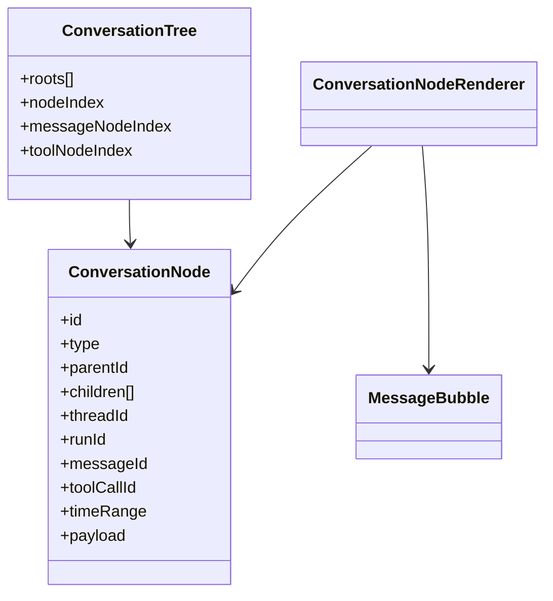

# A2UI 协议调研与 Negentropy Chat 落地

## 1. 摘要

本文档作为本项目 A2UI 调研、实施方案、实施进度与验证记录的单一事实源。

- 传输层：沿用现有 [AG-UI BFF 路由](../apps/negentropy-ui/app/api/agui/route.ts)
- 语义层：在前端新增 A2UI 风格的消息树/组件树适配
- 首期目标：让 Chat 页以“完整消息模块/事件模块”为单位渲染，并支持父子事件嵌套展示

## 2. 协议定义与关系

### 2.1 A2UI 在本项目中的工作定义

本项目中的 A2UI 指向一种“面向 Agent 的生成式 UI 语义层”：

- 以事件流作为事实源
- 以父子节点树作为渲染模型
- 以组件注册表承载不同事件类型的可视化
- 允许标准协议事件与项目自定义事件共存

### 2.2 A2UI 与 AG-UI 的关系

- AG-UI 负责传输与基础事件定义：消息、工具、状态、步骤、原始事件等<sup>[[1]](#ref1)</sup>
- A2UI 负责把这些事件适配为可递归渲染的 UI 树，并引入更强的组件化表达

在本项目中采用：

- `AG-UI transport`
- `A2UI renderer`

而不是双协议并存。

## 3. 协议原理

### 3.1 事件溯源

UI 不直接把流式片段当最终事实，而是把线性事件流重建为稳定读模型。该模式与事件溯源、快照回放一致，可降低流式拼接带来的状态漂移风险。

### 3.2 组合模式

消息、工具、活动、状态、推理步骤都抽象为统一节点，由父节点递归持有子节点。这样能自然表达：

- assistant 文本 -> tool call -> tool result
- turn -> step -> reasoning note
- turn -> activity/state/raw/custom

### 3.3 数据绑定与 JSON 结构

状态增量与快照保持 JSON 结构，便于沿用 JSON Pointer / JSON Patch 的标准语义<sup>[[6]](#ref6)</sup><sup>[[7]](#ref7)</sup>。

## 4. 经典设计模式与场景用例

### 4.1 Adapter

- 场景：`ADK payload -> AG-UI event -> A2UI node`
- 本项目锚点：[adk.ts](../apps/negentropy-ui/lib/adk.ts)、[conversation-tree.ts](../apps/negentropy-ui/utils/conversation-tree.ts)

### 4.2 Composite

- 场景：父子消息、父子工具、轮次容器递归渲染
- 本项目锚点：[ConversationNodeRenderer.tsx](../apps/negentropy-ui/components/ui/conversation/ConversationNodeRenderer.tsx)

### 4.3 Registry / Polymorphic Renderer

- 场景：不同节点类型绑定不同渲染卡片
- 本项目首期采用轻量映射；后续可演进为正式组件注册表

### 4.4 Event Sourcing + Read Model

- 场景：历史回放与实时流统一建模
- 本项目锚点：[conversation-tree.ts](../apps/negentropy-ui/utils/conversation-tree.ts)

## 5. 本项目现状与问题

改造前，Chat 页主路径为：

```mermaid
flowchart LR
  A[AG-UI Raw Events] --> B[buildChatMessagesFromEventsWithFallback]
  B --> C[ChatMessage[]]
  C --> D[ChatStream]
```

问题：

- 工具调用按 `runId` 粗粒度挂载，父子关系不稳定
- `TEXT_MESSAGE_CONTENT` 被压扁为文本，活动/状态/原始事件无法成为一级模块
- 主聊天区与右侧观察区职责失衡，导致真正的“交互结构”不可见

## 6. 实施方案

### 6.1 目标结构

```mermaid
flowchart TD
  subgraph Transport
    A[ADK SSE]
    B[/api/agui]
    C[AG-UI Events]
  end

  subgraph A2UI
    D[Conversation Tree Builder]
    E[Conversation Nodes]
    F[Recursive Renderer]
  end

  A --> B --> C --> D --> E --> F
```

### 6.2 节点模型

首期支持：

- `turn`
- `text`
- `tool-call`
- `tool-result`
- `activity`
- `reasoning`
- `state-delta`
- `state-snapshot`
- `step`
- `raw`
- `custom`
- `event`
- `error`

### 6.3 父子关系规则

- 同一 `runId` 建立 `turn` 根节点
- `TEXT_MESSAGE_*` 聚合为 `text` 节点
- `TOOL_CALL_*` 聚合为 `tool-call` 节点，优先挂到最近 assistant 消息下
- `TOOL_CALL_RESULT` 挂到对应 `tool-call`
- `STEP_*` 生成 `step` + `reasoning`
- `STATE_*`、`ACTIVITY_*`、`RAW`、`CUSTOM` 默认挂到 `turn`
- `ne.a2ui.link` 可显式重定父子关系

### 6.4 组件支持矩阵

| 节点类型 | 主聊天区 | 嵌套 | 首期状态 |
| --- | --- | --- | --- |
| `text` | 是 | 是 | 已实现 |
| `tool-call` | 是 | 是 | 已实现 |
| `tool-result` | 是 | 是 | 已实现 |
| `activity` | 是 | 是 | 已实现 |
| `reasoning` | 是 | 是 | 已实现 |
| `step` | 是 | 是 | 已实现 |
| `state-delta` | 是 | 是 | 已实现 |
| `state-snapshot` | 是 | 是 | 已实现 |
| `raw` | 是 | 是 | 已实现 |
| `custom` | 是 | 是 | 已实现 |
| `event` | 是 | 是 | 已实现 |
| `error` | 是 | 是 | 已实现 |

## 7. 类图



## 8. 实施进度

| 事项 | 状态 | 文件锚点 | 验证证据 | 风险 |
| --- | --- | --- | --- | --- |
| A2UI 文档建档 | 已完成 | [a2ui.md](./a2ui.md) | 文档已创建 | 后续需持续维护 |
| 新增节点类型 | 已完成 | [a2ui.ts](../apps/negentropy-ui/types/a2ui.ts) | 类型已落地 | 仍需随协议演进补字段 |
| 事件到树构建器 | 已完成 | [conversation-tree.ts](../apps/negentropy-ui/utils/conversation-tree.ts) | 可处理文本/工具/状态/步骤 | 复杂链路仍需更多用例覆盖 |
| Chat 树形渲染 | 已完成 | [ChatStream.tsx](../apps/negentropy-ui/components/ui/ChatStream.tsx) | 主区已切换为递归节点渲染 | 视觉细节仍可继续打磨 |
| A2UI 自定义关联事件 | 已完成 | [adk.ts](../apps/negentropy-ui/lib/adk.ts) | 已注入 `ne.a2ui.link` / `ne.a2ui.reasoning` | 上游若提供原生父子关系，可进一步收敛 |
| 单元测试补齐 | 进行中 | [tests/unit](../apps/negentropy-ui/tests/unit) | 待依赖安装后完整复验 | 当前本地缺少前端依赖 |

## 9. 最佳实践

- 始终保留原始事件流，节点树只作为派生读模型
- 父子关系优先显式链路，缺失时再推断
- 不暴露私有推理原文，仅渲染安全摘要或阶段状态
- 主聊天区负责“交互结构”，右侧面板负责“观测镜像”
- 新类型先走 `custom` 回退，再决定是否升级为正式组件

## 10. 后续建议

- 补正式组件注册表，支持插件化节点渲染
- 为 `ne.a2ui.activity-meta` 增加更丰富的活动语义
- 给技术节点增加折叠态与过滤器
- 为历史会话回放增加树差异比对测试

## 11. 参考文献

<a id="ref1"></a>[1] AG-UI Docs, "Events," *AG-UI Documentation*, 2026. [Online]. Available: https://docs.ag-ui.com/concepts/events

<a id="ref2"></a>[2] AG-UI Docs, "Serialization," *AG-UI Documentation*, 2026. [Online]. Available: https://docs.ag-ui.com/concepts/serialization

<a id="ref3"></a>[3] AG-UI Docs, "Generative User Interfaces," *AG-UI Documentation*, 2026. [Online]. Available: https://docs.ag-ui.com/draft-proposals/generative-user-interfaces

<a id="ref4"></a>[4] A2UI, "A2UI Specification," *A2UI*, 2026. [Online]. Available: https://a2ui.org/specification

<a id="ref5"></a>[5] A2UI, "A2UI Message Types," *A2UI*, 2026. [Online]. Available: https://a2ui.org/message-types

<a id="ref6"></a>[6] P. Bryan, Ed., "JavaScript Object Notation (JSON) Pointer," RFC 6901, Apr. 2013.

<a id="ref7"></a>[7] P. Bryan and M. Nottingham, "JavaScript Object Notation (JSON) Patch," RFC 6902, Apr. 2013.
