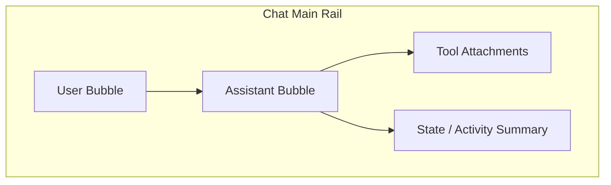

# AGUI / A2UI 协议校正与 Chat 页落地方案

## 1. 文档定位

本文档是本项目关于 AGUI / A2UI 的单一事实源，目标有三件事：

- 校正协议事实，避免把官方规范与本项目约定混写。
- 说明本项目如何用 AGUI 事件流构建 A2UI 读模型。
- 明确 Chat 页的聊天优先落地方式、边界与验证口径。

截至 2026-03-08，本项目采用：

- `AGUI` 作为传输层与事件事实源。
- `A2UI` 作为前端读模型与生成式 UI 组织方式。
- `Chat` 主区采用聊天优先呈现，而不是树形结构优先。

## 2. 协议事实

### 2.1 AGUI 的职责

AGUI 负责定义 agent 交互中的事件、消息、工具调用、状态与流式生命周期，是本项目的事实输入层<sup>[[1]](#ref1)</sup><sup>[[2]](#ref2)</sup>。

在本项目中，AGUI 的职责是：

- 提供事件流输入。
- 作为实时 SSE 与历史回放的共同语义基底。
- 保证文本消息、工具调用、状态变化等信息可被统一归并。

AGUI 不是页面布局协议。页面如何把这些事件组织成聊天流、树或组件，是前端读模型的职责。

### 2.2 A2UI 的职责

A2UI 关注的是生成式 UI 的结构化表达：容器、数据绑定、组件组合与基于状态的渲染约定<sup>[[3]](#ref3)</sup><sup>[[4]](#ref4)</sup>。

在本项目中，A2UI 不作为第二条传输协议接入；它的工作定义是：

- 使用 AGUI 事件作为输入事实源。
- 在前端构建 `Message Ledger` 与 `ConversationTree projection` 两类读模型。
- 将消息、工具、状态、活动等内容映射到聊天主轨和可递归渲染的 UI 模块。

因此，本项目的准确描述是：

- `AGUI transport`
- `A2UI-inspired read model`
- `chat-first presentation`

而不是“AGUI 与 A2UI 双传输协议并存”。

### 2.3 官方字段与项目自定义字段

官方字段：

- `RUN_STARTED`
- `TEXT_MESSAGE_*`
- `TOOL_CALL_*`
- `STATE_*`
- `MESSAGES_SNAPSHOT`
- `STEP_*`
- `RAW`
- `CUSTOM`

项目自定义事件：

- `ne.a2ui.link`
- `ne.a2ui.reasoning`

这些 `ne.*` 事件仅代表本项目的父子关系回填与额外语义补充，不属于 AGUI 或 A2UI 官方标准。

## 3. 本项目读模型约定

### 3.1 总体结构

```mermaid
flowchart TD
  subgraph Transport["Transport / Fact Source"]
    A[ADK Payload]
    B[/api/agui]
    C[AGUI Events]
  end

  subgraph Application["Session Application Service"]
    D[normalizeAguiEvent]
    E[useSessionService]
    M[useSessionListService]
  end

  subgraph ReadModel["A2UI Read Model"]
    F[Message Ledger]
    J[ConversationTree Projection]
    K[ConversationNode Tree]
    L[useSessionProjection]
  end

  subgraph Presentation["Chat-first Presentation"]
    G[Chat Main Rail]
    H[Technical Attachments]
    I[Timeline / State / Logs]
  end

  A --> B --> C --> D --> E
  B --> M
  E --> L
  L --> F
  L --> J
  F --> G
  J --> K --> H
  L --> I
```

对应代码锚点：

- 传输入口：[route.ts](../apps/negentropy-ui/app/api/agui/route.ts)
- ADK 到 AGUI 归一化：[adk.ts](../apps/negentropy-ui/lib/adk.ts)
- Session Application Service：[useSessionService.ts](../apps/negentropy-ui/features/session/hooks/useSessionService.ts)
- Session List Service：[useSessionListService.ts](../apps/negentropy-ui/features/session/hooks/useSessionListService.ts)
- Session Projection / Message Ledger：[message-ledger.ts](../apps/negentropy-ui/utils/message-ledger.ts)
- Session Projection Hook：[useSessionProjection.ts](../apps/negentropy-ui/features/session/hooks/useSessionProjection.ts)
- 事件到树构建：[conversation-tree.ts](../apps/negentropy-ui/utils/conversation-tree.ts)
- Chat 主区渲染：[ChatStream.tsx](../apps/negentropy-ui/components/ui/ChatStream.tsx)
- 递归节点渲染：[ConversationNodeRenderer.tsx](../apps/negentropy-ui/components/ui/conversation/ConversationNodeRenderer.tsx)

### 3.2 Session Projection 约定

本项目当前把 `Message Ledger` 前移为 session 级显式状态，而不是在页面渲染期临时从 `rawEvents` 全量重建。

- `rawEvents`：保留 AGUI 事件事实源。
- `messageLedger`：保留聊天消息事实与角色纠偏结果。
- `snapshot`：保留状态快照事实。
- `conversationTree`、timeline、state 面板都属于从 session projection 派生出的 surface projection。

这样做的目标是把“协议输入”“消息事实”“页面结构”三层职责拆开，避免聊天主区、历史回放与技术面板各自维护不同事实源。

当前实现进一步把这套 projection orchestration 从页面组件中抽离到 `features/session`，页面只消费 session feature 暴露的 projection 与 action，不再直接持有 reducer 和投影拼装逻辑。

当前的推荐边界为：

- `useSessionService`：负责 session detail 拉取、hydration 调度、竞态保护与 projection 更新协调。
- `useSessionListService`：负责 session list 拉取、创建、归档、改名与标题刷新调度。
- `useSessionProjection`：负责 confirmed projection、optimistic overlay 与 render projection 派生。
- 页面组件：只负责 UI 容器、输入交互和面板编排，不再直接持有 session hydration 定时器、list fetch 逻辑或请求版本控制。

遗留兼容入口：

- `useSessionManager` 仅为兼容旧调用面暂时保留，已不代表当前 session feature 的推荐架构边界。
- 新增代码已通过全量 ESLint 门禁中的 `no-restricted-imports` 明确禁止导入 `useSessionManager`，避免 legacy 入口重新漂移回主路径。
- 新增能力、回归测试与文档描述一律以 `useSessionListService + useSessionService + useSessionProjection` 为准。

### 3.3 Canonical Role 约定

本项目内部统一使用 canonical role：

- `user`
- `assistant`
- `system`
- `developer`
- `tool`

兼容入口：

- `agent` 仅作为兼容输入值保留。
- 一旦进入系统，`agent` 必须单向收敛为 `assistant`。

角色优先级：

1. 显式 `message.role` / 事件 `role`
2. `messagesSnapshot` 中的消息角色
3. 工具消息特征
4. 兼容兜底为 `assistant`

`author` 只保留为展示元数据，不作为自由 role 来源直接参与聊天主语义判定。

### 3.3 ConversationNode 节点模型

当前读模型节点类型：

- `turn`
- `text`
- `tool-call`
- `tool-result`
- `activity`
- `reasoning`
- `state-delta`
- `state-snapshot`
- `step`
- `raw`
- `custom`
- `event`
- `error`

父子关系规则：

- 同一 `runId` 生成一个 `turn` 根节点。
- `TEXT_MESSAGE_*` 聚合为 `text`。
- `TOOL_CALL_*` 优先挂到当前 assistant 文本节点下。
- `TOOL_CALL_RESULT` 挂到对应 `tool-call` 下。
- `STEP_*` 生成 `step`，并补一个 `reasoning` 摘要节点。
- `STATE_*`、`ACTIVITY_*` 默认挂到 `turn` 或对应答复上下文。
- `ne.a2ui.link` 仅做父子关系修正，不直接进入主聊天区。

### 3.4 历史回放与实时流一致性

实时流与历史回放必须走同一套归并语义，避免刷新前后出现 split-brain：

- 文本流靠 `TEXT_MESSAGE_START / CONTENT / END` 收敛。
- 乐观用户消息与历史确认消息通过统一 identity key 去重。
- `messagesSnapshot` 用于修正历史角色缺失或补足消息列表。
- 当实时 assistant 流与历史回放使用不同 `messageId` 但语义上属于同一答复时，canonical message 必须在 `Message Ledger` 层收敛为一条消息事实；`ConversationTree` 只能复用该事实，不得再次生成第二条主消息。
- 命中同一 canonical message 的 hydration / snapshot 只能升级既有节点内容与完成态，不能把 streaming 中间态和最终态并排展示。
- 树构建是读模型重建，不是事实源本身。

## 4. Chat 页落地方式

### 4.1 为什么是聊天优先

Chat 页的主任务是“阅读并参与对话”，不是“调试节点树”。如果把 turn、状态、结构性事件直接放在主车道，会破坏用户对“我说了什么、智能体回了什么”的基本心智。

因此主区遵循：

- 优先展示稳定的 user / assistant 消息流。
- 技术节点作为答复附件或折叠块。
- 调试节点进入右侧观测区或 `debug-only` 链路。

### 4.2 主区信息分层

主区分三层：

1. 聊天主语义
   - `user` 文本
   - `assistant` / `developer` 文本
   - `system` 提示

2. 技术附属语义
   - `tool-call`
   - `tool-result`
   - `activity`
   - `state-*`
   - `step`
   - `reasoning`
   - `error`

3. 调试语义
   - `raw`
   - 纯结构 `custom`
   - 空 payload 技术节点

可见性约定：

- `chat`：进入主区
- `collapsed`：进入主区但默认摘要化
- `debug-only`：不进入主区

### 4.3 当前 Chat 页强约束

1. 用户消息必须渲染为 user bubble，不能被历史回放降级为 assistant bubble。
2. assistant 的流式片段与最终快照必须收敛为一个答复块。
3. `turn` 容器只作为轻量轮次边界，不得喧宾夺主。
4. 工具、状态、活动不能伪装成一条新的聊天答复。
5. 历史刷新后，主区消息顺序、角色和数量必须与实时态保持一致。

### 4.4 UI 结构示意



## 5. 已知问题与修正策略

### 5.1 已知问题

本轮修正前，Chat 页存在以下风险：

- 用户历史消息可能因为 role 丢失，被按 assistant 方式渲染。
- `agent` / `assistant` 混用，导致类型与渲染逻辑双轨。
- `author` 被宽泛当作 role 来源，污染聊天主语义。
- A2UI 树在主区中过度显性，削弱了聊天流体验。

### 5.2 修正策略

本轮采用以下原则：

- role 统一收敛为 canonical role。
- `messagesSnapshot` 优先用于历史角色纠偏。
- `turn` 卡片视觉弱化，消息气泡回到阅读中心。
- 自定义 `ne.*` 事件只用于结构修正，不直接进入聊天主语义。

## 6. 验证口径

必须覆盖以下场景：

- 乐观用户消息发送后立即显示为 user bubble。
- 历史回拉确认同一条用户消息后，不出现重复 bubble。
- 历史 payload 中 `message.role = "user"` 时，主区稳定显示为 user bubble。
- 历史事件角色异常但 `messagesSnapshot` 正确时，主区仍以 snapshot 纠正。
- assistant 实时流与最终快照 `messageId` 不同，仍只显示一个最终答复。
- 工具、活动、状态节点仍可见，但不会打断主聊天主线。

## 7. 后续演进建议

- 引入正式的节点渲染注册表，替代当前轻量分支渲染。
- 将技术附件与聊天主语义拆成明确的 presentation layer 接口。
- 在历史 hydration 链路显式消费 `messagesSnapshot`，减少 UI 层补救负担。
- 为真实会话样本增加快照回放回归集，持续监控角色和去重一致性。

## 8. 参考文献

<a id="ref1"></a>[1] AG-UI Docs, "Events," *AG-UI Documentation*, 2026. [Online]. Available: https://docs.ag-ui.com/concepts/events

<a id="ref2"></a>[2] AG-UI Docs, "Messages," *AG-UI Documentation*, 2026. [Online]. Available: https://docs.ag-ui.com/concepts/messages

<a id="ref3"></a>[3] AG-UI Docs, "Generative User Interfaces," *AG-UI Documentation*, 2026. [Online]. Available: https://docs.ag-ui.com/concepts/generative-ui

<a id="ref4"></a>[4] A2UI, "A2UI Specification v0.8," *A2UI Documentation*, 2026. [Online]. Available: https://a2ui.org/specification
