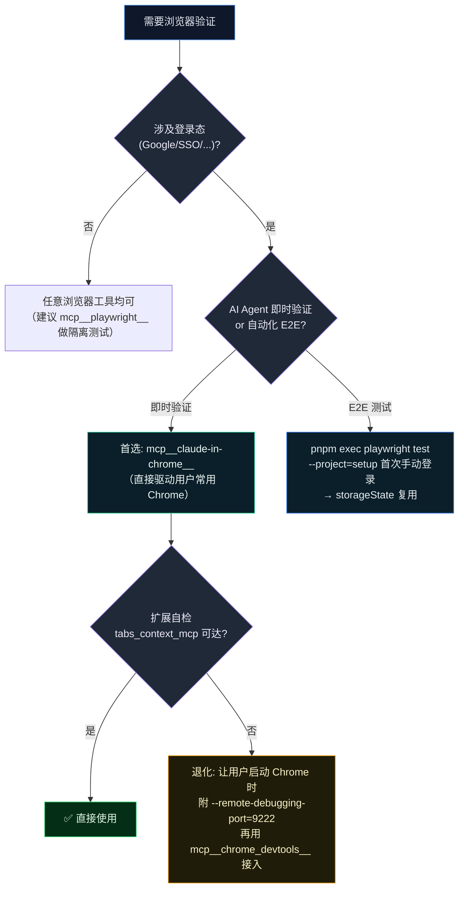
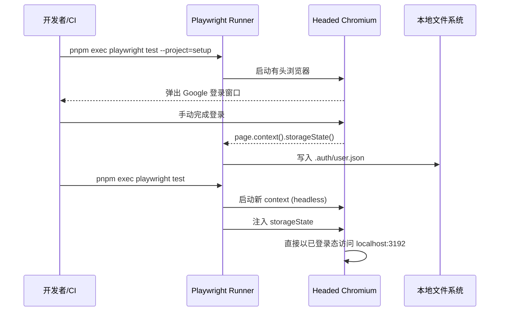

# 浏览器验证协议 (Browser Validation Protocol)

> 本文遵循 [AGENTS.md](../../CLAUDE.md) 的协作协议与循证要求；落地的硬性约束已写入 [CLAUDE.md › 术 › Browser Validation Protocol](../../CLAUDE.md)，本文为其唯一详尽来源（Single Source of Truth）。

## 1. 背景与问题陈述 (Problem Statement)

项目自带 Google OAuth 流（参考 [docs/sso.md](../sso.md)）。当 AI Agent（Claude / Antigravity）在 Sandbox 浏览器（独立、空白 profile，如 Playwright 默认 `chromium.launch()`）中访问 [`localhost:3192`](http://localhost:3192) 并被重定向至 `accounts.google.com` 时，由于该浏览器无任何 Google 登录态，会被同意屏 / 风控 / 二步验证拦截，验证链路就此中断。这是阻塞 AI Agent 完成需求验证与回归测试的核心瓶颈之一。

试图通过自动填充密码 / Cookie 注入 / 跨 profile 复制 `storageState` 的方式"绕过"登录拦截在生产环境中是不可靠且不安全的：Google 风控会基于设备指纹、IP、User-Agent、登录历史等多维度信号判断异常会话<sup>[[2]](#ref2)</sup>，且这些做法违反 Claude Code 的 `user_privacy` 安全准则中关于敏感凭证不入 chat 的硬性要求。

## 2. 目标与非目标 (Goals / Non-Goals)

- **目标**：让所有依赖登录态的浏览器验证（AI Agent 即时验证 + 项目 Playwright E2E）以**复用用户已有 Chrome 会话**的方式打通，登录动作仅由用户手动完成一次。
- **非目标**：
  - 不实现密码自动填充 / 验证码自动接收 / reCAPTCHA 自动求解；
  - 不在 CI / 共享环境内长期托管真实账号 storageState；
  - 不为多账号热切换提前抽象 profile manager（YAGNI）。

## 3. 三种 MCP 浏览器工具的能力对照

| 维度 | `mcp__claude-in-chrome__` | `mcp__chrome_devtools__` | `mcp__playwright__` |
| --- | --- | --- | --- |
| 浏览器实例 | 用户**常用** Chrome（通过扩展接管） | 任意 Chrome（通过 DevTools 协议连接） | Playwright 自启动的 Chromium |
| 登录态来源 | **用户原生 profile** | 实测：macOS 默认配置下直接复用用户 Chrome 主 profile（**已登录态可用**）；其他平台或自定义 profile 路径则取决于连接对象 | 默认空 profile，需 `storageState` / `userDataDir` |
| Google OAuth 友好度 | ✅ 高（同设备指纹） | ✅ 中-高（取决于 profile） | ❌ 低（易触发风控） |
| 安装/启动成本 | 一次性安装 Chrome 扩展 | 每次以 `--remote-debugging-port` 启 Chrome | 零额外步骤 |
| 适用场景 | **AI Agent 即时验证（首选）** | 故障定位、性能审计、首选不可用时退化 | E2E 测试套件（配合 `setup` project 复用会话） |
| 安全语义 | 用户全程在自有浏览器内完成敏感动作 | 同上 | 需要持久化 `storageState`，须 gitignore |

## 4. 选型决策图 (Routing)



## 5. 三步连通性自检 (Connectivity Self-Check)

每次会话首次需要登录态浏览前，AI Agent **必须**按下列顺序依次执行；任意一步失败立即停下并把现象告知用户。

### Step 1 — 首选驱动可达性

```ts
// AI Agent 调用
mcp__claude-in-chrome__tabs_context_mcp({ createIfEmpty: true })
```

- 期望：返回当前 Chrome tab group 与至少一个 tabId。
- 失败处理（按优先级）：
  1. **退化到 chrome-devtools MCP**：调用 `mcp__chrome_devtools__list_pages`；若返回的 page url 已带用户登录态（如 `myaccount.google.com` 显示用户邮箱），则直接采用此通道，不必再装扩展（实测在 macOS 默认配置下即可生效）。
  2. **仍不可用**：在用户常用 Chrome 中安装 [Claude in Chrome 扩展](https://claude.ai/chrome) 并允许 MCP 连接，或让用户启动 Chrome 时附 `--remote-debugging-port=9222`。

### Step 2 — Google 登录态复用性

```ts
// 在新 tab 中打开
mcp__claude-in-chrome__navigate({ url: "https://myaccount.google.com", tabId })
mcp__claude-in-chrome__read_page({ tabId, filter: "interactive" })
```

- 期望：accessibility tree 中能读到用户邮箱（如 `cm.huang@aftership.com`）。
- 失败处理：请用户在该 Chrome 中手动登录目标 Google 账号一次。

### Step 3 — 项目 OAuth 链路打通

```ts
mcp__claude-in-chrome__navigate({ url: "http://localhost:3192/auth/google/login", tabId })
```

- 前置：本地 dev server 已起（前端 `pnpm run dev`，后端 `uv run negentropy serve`）。
- 期望：无需重新输密码，直接回跳 `localhost:3192` 并完成会话写入。
- 失败处理：检查 `.env` 中 OAuth callback URL（参考 [docs/issue.md](../issue.md) 历史 Issue）。

## 6. Playwright E2E 的会话复用方案

### 6.1 配置路径

- 主配置：[`apps/negentropy-ui/playwright.config.ts`](../../apps/negentropy-ui/playwright.config.ts)
- 登录 setup：[`apps/negentropy-ui/tests/e2e/auth.setup.ts`](../../apps/negentropy-ui/tests/e2e/auth.setup.ts)
- 持久化产物：`apps/negentropy-ui/.auth/user.json`（已 gitignored）

### 6.2 工作模式



### 6.3 失效与刷新

- **触发条件**: Google 会话过期 / 项目后端 `user_states` 重建 / Cookie 域变化。
- **应对**: 删除 `.auth/user.json` 后重跑 setup project，或使用 `pnpm exec playwright test --project=setup --headed`。

## 7. 安全与凭证守则

1. AI Agent 在任何场景下都**不得**读取、复制、粘贴用户密码 / 验证码 / Refresh Token；登录步骤一律由用户在浏览器内手动完成。
2. `storageState`、`cookies`、`userDataDir` 等会话产物**仅落本地**，并通过 `.gitignore` 与 `.dockerignore` 双重屏蔽，杜绝随分支推送或镜像构建外泄。
3. CI 跑 E2E 时禁止直接挂载真实账号的 `storageState`；建议走 mock OAuth provider（后续 Issue），或使用专用脱敏测试账号并将其凭证收敛到密钥管理服务。
4. 若用户怀疑会话凭证泄漏，立即调用 [Google Account 设备登录管理](https://myaccount.google.com/device-activity) 撤销会话，并删除本地 `.auth/` 与 `.userdata/`。

## 8. 二阶风险与防护

- **风控误报**: 短时间内高频跳转 Google 同意屏会触发 reCAPTCHA / 邮箱验证。**对策**: 自检 Step 2 与 Step 3 间留 ≥ 3 秒间隔；避免在自动化循环中重复触发 OAuth。
- **storageState 漂移**: 项目修改 Cookie 域 / SameSite 后旧 `storageState` 失效但不报错。**对策**: setup project 末尾增加 `expect(page).toHaveURL(/localhost:3192\/(?!auth\/google)/)` 断言。
- **多账号干扰**: 用户常用 Chrome 同时登录多个 Google 账号会让 OAuth 选择器出现。**对策**: 自检失败时把账号选择器纳入指引，由用户显式选择目标账号。

## 9. 案例：Skills 模块自签 Cookie + Playwright MCP 实机验证

适用：本地 Agent 开发场景，**不走 Google OAuth**，用自签 `ne_sso` 直接进入业务页面做交互回归。

### 9.1 一次性环境准备

1. 在 `apps/negentropy/.env.local` 与 `apps/negentropy-ui/.env.local` 写入相同的 `NE_AUTH_TOKEN_SECRET`（必须与 `~/.negentropy/config.yaml` 的 `auth.token_secret` 一致）；
2. `./scripts/ctl.sh start backend ui` 启动；
3. 自检三步：
   ```bash
   cd apps/negentropy-ui
   TOKEN=$(node scripts/sign-dev-cookie.mjs)
   curl -fsS -b "ne_sso=$TOKEN" http://localhost:3292/auth/me
   curl -fsS -b "ne_sso=$TOKEN" http://localhost:3192/api/auth/me
   curl -fsS -b "ne_sso=$TOKEN" http://localhost:3192/api/interface/skills
   ```
   三段全 200 后再进入下一步。

### 9.2 MCP 注入 cookie

```js
// 通过 mcp__playwright__browser_navigate 先进入任意 same-origin 页面
await browser_navigate({ url: "http://localhost:3192/" });
await browser_evaluate({
  function: `() => {
    document.cookie = "ne_sso=${TOKEN}; path=/; SameSite=Lax";
    return document.cookie.includes("ne_sso");
  }`,
});
await browser_navigate({ url: "http://localhost:3192/interface/skills" });
```

### 9.3 storageState 模式（推荐 spec 复用）

```bash
node apps/negentropy-ui/scripts/sign-dev-cookie.mjs --storage-state apps/negentropy-ui/.auth/dev-admin.json
PLAYWRIGHT_STORAGE_STATE=$(pwd)/apps/negentropy-ui/.auth/dev-admin.json \
PLAYWRIGHT_AUTH=1 \
pnpm exec playwright test tests/e2e/<your.authed.spec.ts>
```

### 9.4 注意事项

- **localhost vs 127.0.0.1**：UI 进程仅监听 `localhost`（IPv6），browser navigate 必须使用 `localhost`；
- **httpOnly cookie**：自签时主动用 `document.cookie` 设置（非 httpOnly），浏览器仍会随后续请求发送，后端 `decode_token` 不区分 httpOnly；
- **Cookie 持久性**：MCP 浏览器 context 在 navigate 间保持 cookie，但 close 后会丢失。

详细落地见 [`docs/skills.md`](../skills.md) 与 [`docs/user-guide/skills-troubleshooting.md`](../user-guide/skills-troubleshooting.md)。

## 10. References (IEEE)

<a id="ref1"></a>[1] Microsoft, "Authentication," _Playwright Documentation_, 2025. [Online]. Available: https://playwright.dev/docs/auth.

<a id="ref2"></a>[2] OWASP Foundation, "Session Management Cheat Sheet," _OWASP Cheat Sheet Series_, 2024. [Online]. Available: https://cheatsheetseries.owasp.org/cheatsheets/Session_Management_Cheat_Sheet.html.

<a id="ref3"></a>[3] D. Hardt, "The OAuth 2.0 Authorization Framework," _IETF RFC 6749_, Oct. 2012, doi: 10.17487/RFC6749.
