> [!NOTE]
>
> **文档定位**：本文档是 [000-roadmap.md](./000-roadmap.md) Phase 3 的详细工程实施方案，用于指导「**The Perception (神经感知)**」的完整落地验证工作。涵盖技术调研、架构设计、代码实现、测试验证等全流程。
>
> **前置依赖**：本阶段依赖 [010-the-pulse.md](./010-the-pulse.md) Phase 1 和 [020-the-hippocampus.md](./020-the-hippocampus.md) Phase 2 的完成，需复用其统一存储基座 (Unified Schema) 和记忆管理能力。

---

## 1. 执行摘要

### 1.1 定位与目标 (Phase 3)

**Phase 3: The Perception** 是整个验证计划的检索核心阶段，对标人类大脑的**感知系统 (Perception System)** —— 负责从海量信息中快速定位和识别目标的神经中枢。核心目标是：

1. **构建 One-Shot Integrated 检索链路**：实现单次 SQL 查询融合 Semantic (向量) + Keyword (BM25) + Structural (元数据) 三种检索信号
2. **验证 RRF 融合算法**：实现 Reciprocal Rank Fusion 算法，合并多路召回结果
3. **验证高过滤比场景**：验证 HNSW 迭代扫描在 99% 过滤比下的召回率与性能
4. **验证 L1 Reranking**：集成轻量级 Cross-Encoder 模型，提升检索精度

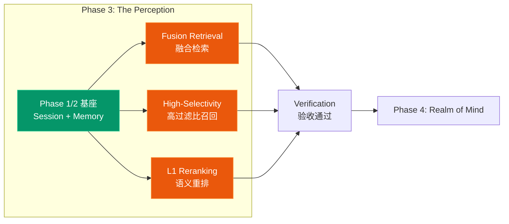

### 1.2 核心设计 (Core Architecture)

本章节阐述 The Perception 的核心设计理念，遵循 **正交分解 (Orthogonal Decomposition)** 原则，将检索过程解耦为信号提取、多路召回与分层排序三个独立维度。

#### 1.2.1 检索信号正交性 (Signal Orthogonality)

我们将检索信号解构为三个互不重叠的维度，确保在不同认知粒度上实现全覆盖：

| 维度       | 信号类型 (Signal)     | 认知层面                                             | 技术实现 (PostgreSQL)                                                                 |
| :--------- | :-------------------- | :--------------------------------------------------- | :------------------------------------------------------------------------------------ |
| **语义层** | **Semantic Search**   | 隐性意图、概念联想<br>语义相似度检索（向量距离）     | `vector` (HNSW): `embedding <=> query_embedding`<br>捕捉 "What you mean"              |
| **词法层** | **Keyword Search**    | 显性关键词、专有名词<br>匹配检索（BM25/全文搜索）    | `tsvector` (BM25): `to_tsvector @@ plainto_tsquery`<br>捕捉 "What you said"           |
| **结构层** | **Structural Filter** | 时空约束、权限边界<br>结构化元数据过滤（JSONB/标量） | `jsonb` (GIN/B-Tree): `metadata @> '{"key": "value}'`<br>捕捉 "Context & Constraints" |
| **空间层** | **Spatial Search**    | 地理位置、物理空间<br>LBS 范围检索 (Radius Search)   | `geography` (GiST): `ST_DWithin(loc, $p, $r)`<br>捕捉 "Where it is"                   |

#### 1.2.2 感知链路 (Perception Pipeline)

检索链路采用 **漏斗型架构 (Funnel Architecture)**，通过两阶段处理实现由粗到精的 **熵减 (Entropy Reduction)** 过程。

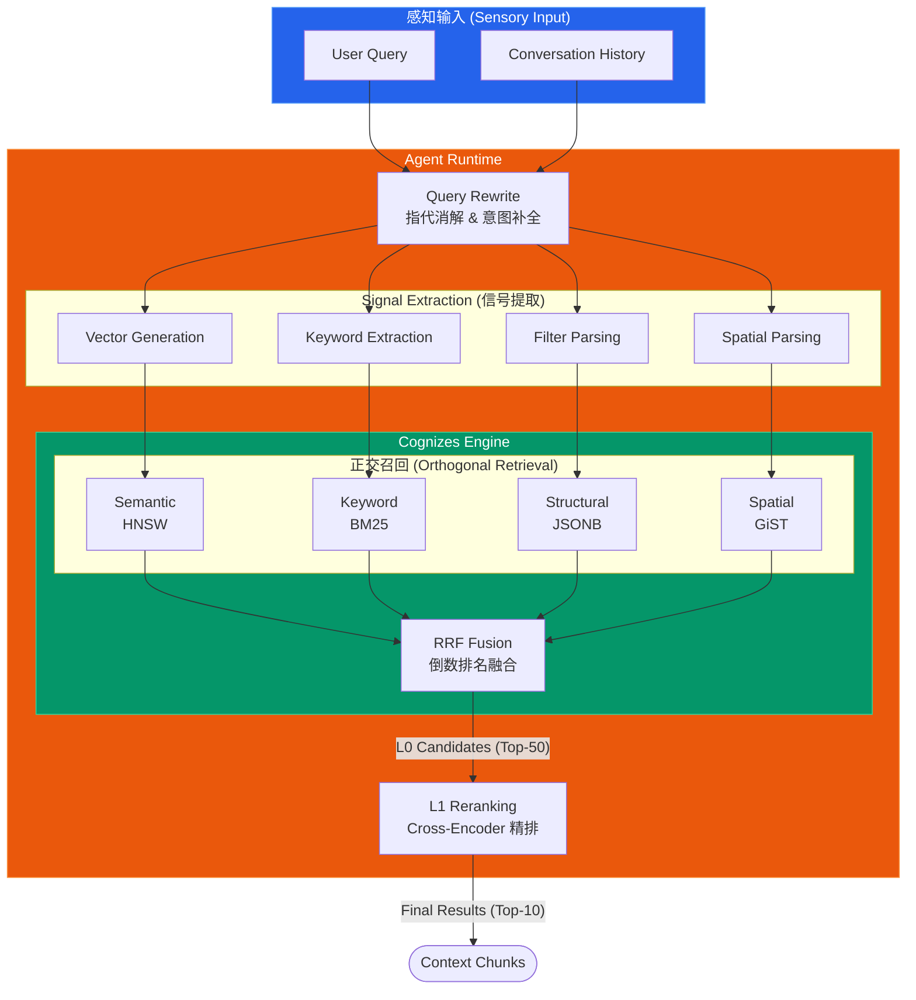

#### 1.2.3 Two-Stage Retrieval (两阶段检索)

> [!IMPORTANT]
>
> **对标 Roadmap Pillar III**：The Perception 采用两阶段检索架构，分离“召回”与“排序”关注点，平衡性能、延迟与精度。

| 阶段                    | 定位                             | 运行环境      | 延迟预算 (Latency) | 关键指标           | 算法/模型                    |
| :---------------------- | :------------------------------- | :------------ | :----------------- | :----------------- | :--------------------------- |
| **L0 粗排 (Recall)**    | **广度优先**：确保不漏掉相关信息 | PostgreSQL    | < 50ms             | Recall@50 > 95%    | HNSW + BM25 + RRF            |
| **L1 精排 (Precision)** | **深度优先**：不仅相关，更要精准 | Agent Runtime | < 200ms            | Precision@10 > 95% | BGE-Reranker (Cross-Encoder) |

### 1.3 执行导图 (Execution Map)

#### 1.3.1 任务-文档锚定

> [!NOTE]
>
> 本执行导图对齐 [001-task-checklist.md](./001-task-checklist.md) 的 Phase 3 任务集，将验证工作划分为 **Core Engine (核心引擎)**、**Knowledge Base (知识库)** 与 **Support System (支撑系统)** 三大正交流。

| 实施流 (Stream)                               | 任务模块            | 任务 ID          | 对应章节 Anchor                                                                 |
| :-------------------------------------------- | :------------------ | :--------------- | :------------------------------------------------------------------------------ |
| **1. Core Engine**<br>_(Dynamic Memory)_      | Hybrid Search SQL   | P3-1-1 ~ P3-1-5  | [4.1 Step 1: Fusion Retrieval 实现](#41-step-1-fusion-retrieval-实现)           |
|                                               | RRF Algorithm       | P3-1-6 ~ P3-1-9  | [4.1.2 RRF 融合算法](#412-rrf-融合算法-reciprocal-rank-fusion)                  |
|                                               | High-Selectivity    | P3-2-1 ~ P3-2-4  | [4.2 Step 2: High-Selectivity Filtering](#42-step-2-high-selectivity-filtering) |
|                                               | L1 Reranking        | P3-2-5 ~ P3-2-8  | [4.3 Step 3: L1 Reranking 实现](#43-step-3-l1-reranking-实现)                   |
| **2. Knowledge Base**<br>_(Static Knowledge)_ | KB Schema Design    | P3-4-7 ~ P3-4-10 | [3. Architecture: Perception Schema](#3-架构设计perception-schema)              |
|                                               | RAG Pipeline        | P3-5-1 ~ P3-5-5  | [4.4 Step 4: Knowledge RAG Pipeline](#)                                         |
|                                               | Hybrid Validation   | P3-5-6 ~ P3-5-13 | [4.4.2 Hybrid Search 融合](#)                                                   |
| **3. Support System**<br>_(Observability)_    | AG-UI Visualization | P3-4-1 ~ P3-4-6  | [4.5 Step 5: Glass-Box Visualization](#)                                        |
| **4. Delivery**                               | 验收与文档          | P3-3-1 ~ P3-3-4  | [5. 验收标准](#5-验收标准) + [6. 交付物](#6-交付物清单)                         |

#### 1.3.2 工期规划 (1.5 Days)

> [!IMPORTANT]
>
> **Timeline Adjustment**: 由于增加了 Knowledge Base (RAG) 与 Visualization (AG-UI) 的验证范围，Phase 3 预估工期调整为 **1.5 Days**。

| 阶段    | 实施内容 (Activity)                                                 | 关键产出 (Deliverables)                      | 预估工期 |
| :------ | :------------------------------------------------------------------ | :------------------------------------------- | :------- |
| **3.1** | **Core Retrieval Construction**<br>(Fusion SQL + RRF + HNSW Tuning) | `hybrid_search.sql`<br>`rrf_fusion.py`       | 0.5 Day  |
| **3.2** | **Precision Engineering**<br>(Reranking + High-Selectivity)         | `reranker.py`<br>Recall/Precision Benchmarks | 0.25 Day |
| **3.3** | **Knowledge Base Integration**<br>(KB Schema + RAG Pipeline)        | `knowledge_schema.sql`<br>`rag_pipeline.py`  | 0.5 Day  |
| **3.4** | **System Visualization**<br>(AG-UI Events + End-to-End Test)        | `SearchVisualizer` Class<br>Test Report      | 0.25 Day |

---

## 2. 核心参考模型：检索机制感知系统

### 2.1 对标分析：Google Vertex AI

基于 Google Vertex AI RAG Engine 和 ADK 文档<sup>[[1]](#ref1)</sup>的深度调研，我们将复刻以下核心能力，构建 **PostgreSQL-Native** 的感知基座：

| 核心组件      | Google Vertex AI 能力       | PostgreSQL 复刻策略 (Glass-Box)                    |
| :------------ | :-------------------------- | :------------------------------------------------- |
| **Vector DB** | 托管向量检索服务 (ScaNN)    | **PGVector** (HNSW 索引)                           |
| **Corpus**    | 语料库管理 (Managed Corpus) | `knowledge` (Static) + `memories` (Dynamic)        |
| **Retrieval** | 混合检索 (Hybrid Search)    | **One-Shot SQL** (`vector` + `tsvector` + `jsonb`) |
| **Fusion**    | 结果融合 (Result Merging)   | **RRF Algorithm** (Reciprocal Rank Fusion)         |
| **Ranking**   | 重排 API (Ranking API)      | **Cross-Encoder** (Local Inference)                |

### 2.2 RAG Pipeline

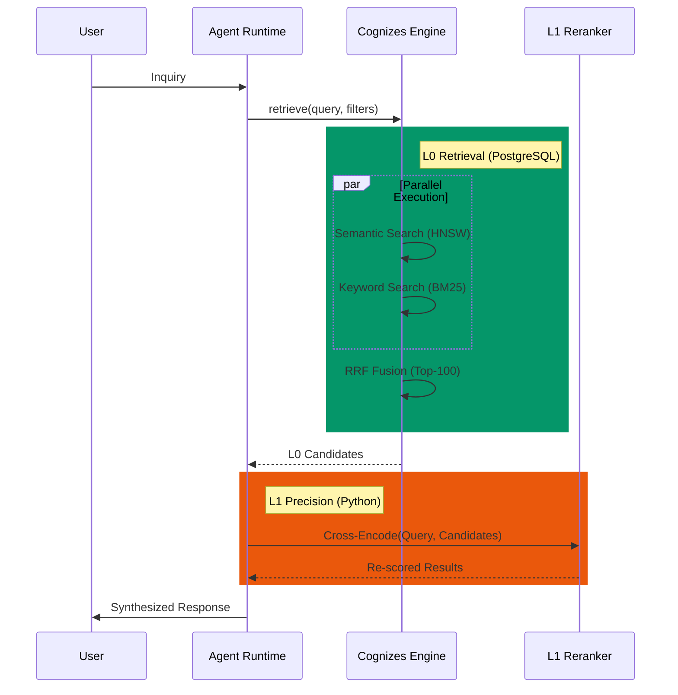

### 2.3 混合检索策略 (Hybrid Retrieval)

混合检索通过结合 **Semantic (语义)** 与 **Lexical (词法)** 两种正交的检索信号，解决单一检索模式的盲区。

| 信号维度     | 技术实现         | 优势场景                      | 盲区                         |
| :----------- | :--------------- | :---------------------------- | :--------------------------- |
| **Semantic** | Embedding (HNSW) | 概念联想、跨语言、意图理解    | 专有名词、精确匹配、低频词   |
| **Lexical**  | BM25 (GIN)       | 精确关键词、代码片段、ID 匹配 | 同义词、语义漂移、上下文缺失 |

### 2.4 融合算法 (RRF Algorithm)

**Reciprocal Rank Fusion (RRF)** 是一种无需调参的稳健融合算法，公式如下：

$$
    \text{Score}_{RRF}(d) = \sum_{r \in R} \frac{1}{k + rank_r(d)}
$$

其中：

- $d$ 是文档
- $R$ 是所有检索器的排名列表
- $r(d)$ 是文档 $d$ 在检索器中的排名 (从 1 开始)
- $k$ 是平滑常数 (通常取 60)

> [!TIP]
>
> **Why RRF?** 相比线性加权 (Weighted Sum)，RRF 不依赖分数的绝对值（向量距离 vs BM25 分数很难归一化），仅依赖相对排名，鲁棒性更强。即使某一检索路 "失效"（返回无关结果），RRF 也能保证相关文档被另一路 "捞回"。
>
> **RRF 示例计算**
>
> | 文档 | 向量检索排名 | 关键词检索排名 | RRF 分数 (k=60)              |
> | :--- | :----------- | :------------- | :--------------------------- |
> | A    | 1            | 3              | 1/(60+1) + 1/(60+3) = 0.0325 |
> | B    | 2            | 1              | 1/(60+2) + 1/(60+1) = 0.0325 |
> | C    | 3            | 2              | 1/(60+3) + 1/(60+2) = 0.0322 |
> | D    | 5            | -              | 1/(60+5) = 0.0154            |
>
> **观察**：文档 A 和 B 的 RRF 分数相同，说明 RRF 对不同检索器的排名给予等权重。

### 2.5 精排策略 (L1 Reranking)

L0 检索关注 **Recall (召回率)**，L1 重排关注 **Precision (准确率)**。

| 阶段             | 模型架构          | 特性                                 | 延迟预算 |
| :--------------- | :---------------- | :----------------------------------- | :------- |
| **L0 Recall**    | Bi-Encoder        | 向量预计算，极快                     | < 50ms   |
| **L1 Precision** | **Cross-Encoder** | Query-Doc 联合编码，深度交互，高精度 | < 200ms  |

**选型建议**:

- **Base**: `BAAI/bge-reranker-base` (Balance)
- **High-Performance**: `BAAI/bge-reranker-v2-m3` (Multi-Lingual)

---

## 3. 架构设计：Perception Schema

### 3.1 Knowledge vs Memory 双存储架构

> [!IMPORTANT]
>
> **核心区分**：The Perception 需要支持两种不同类型的检索场景，对应不同的存储表：
>
> - **Knowledge Base**（静态知识）：预先导入的外部文档，全局/租户级共享，持久化存储
> - **Memory**（动态记忆）：Agent 与用户交互生成，用户级私有，有遗忘曲线

#### 3.1.1 Knowledge vs Memory 概念对比

| 维度         | **Knowledge (知识)**                   | **Memory (记忆)**                   |
| :----------- | :------------------------------------- | :---------------------------------- |
| **来源**     | 预先导入的外部文档（PDF/Markdown/FAQ） | Agent 与用户交互动态生成            |
| **特点**     | 静态、共享、结构化/非结构化            | 动态、个人化、情景化                |
| **生命周期** | **持久化**，不会自动遗忘               | **有遗忘曲线**，低频访问会衰减      |
| **所有权**   | 全局/租户级别（多用户共享）            | 用户级别（个人私有）                |
| **典型场景** | 企业文档、FAQ、产品手册、政策法规      | 对话历史、用户偏好、情景记忆        |
| **对标系统** | RAGFlow Corpus、Dify RAG Engine        | LangGraph `Store`、ADK `MemoryBank` |
| **存储表**   | `knowledge`                            | `memories` + `facts`                |

#### 3.1.2 双存储 ER 图 (Dual-Store Schema)

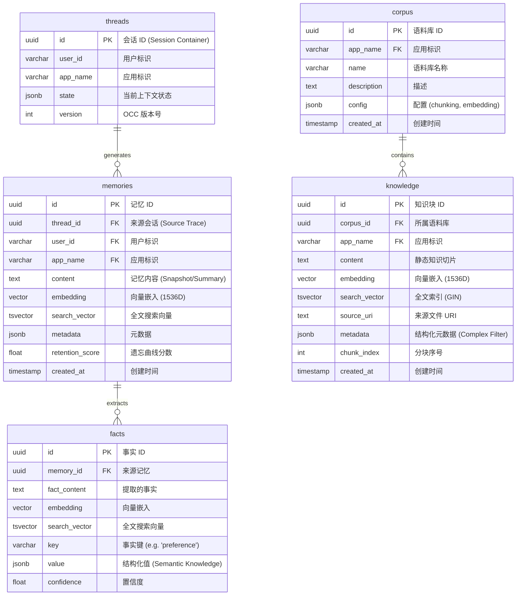

上图展示了 Perception Engine 的 **"双存储-三信号" (Dual-Store, Tri-Signal)** 正交架构：

1. **存储正交性 (Storage Orthogonality)**：
   - **左侧 (Dynamic Memory)**：以 `threads` 为源头，记录 User-Agent 的交互历史。数据是**流式生长**的，具有**时效性**（需遗忘），服务于 "Personal Context"。
   - **右侧 (Static Knowledge)**：以 `corpus` 为容器，存储预置的领域知识。数据是**静态导入**的，具有**权威性**（不遗忘），服务于 "Domain Capability"。
2. **信号完备性 (Signal Completeness)**：
   - `memories` 和 `knowledge` 表均同时包含 `embedding` (语义信号)、`search_vector` (词法信号) 和 `metadata/state` (结构化信号)，确保了检索链路在物理层面的**同构性**，从而支持上层统一的 **Hybrid Search** 接口。
3. **溯源性 (Traceability)**：
   - 动态记忆通过 `thread_id` 严格锚定到原始会话，不仅能回答 "用户喜好什么"，还能追溯 "这是在哪次对话中提取的"，实现了记忆的可解释性。

#### 3.1.3 检索场景对应

| 检索场景           | 存储表      | 过滤条件                | 典型查询                 |
| :----------------- | :---------- | :---------------------- | :----------------------- |
| **Knowledge 检索** | `knowledge` | `corpus_id`, `app_name` | "公司年假政策是什么?"    |
| **Memory 检索**    | `memories`  | `user_id`, `app_name`   | "用户之前说过什么偏好?"  |
| **Unified 检索**   | 两表联合    | `app_name` + RRF 融合   | 结合知识库与用户记忆回答 |

#### 3.1.4 索引策略

| 存储表      | 列              | 索引类型 | 用途       |
| :---------- | :-------------- | :------- | :--------- |
| `knowledge` | `embedding`     | HNSW     | 语义检索   |
| `knowledge` | `search_vector` | GIN      | 关键词检索 |
| `knowledge` | `corpus_id`     | BTREE    | 语料库过滤 |
| `memories`  | `embedding`     | HNSW     | 语义检索   |
| `memories`  | `search_vector` | GIN      | 关键词检索 |
| `memories`  | `user_id`       | BTREE    | 用户过滤   |

#### 3.1.5 One-Shot Hybrid Search (PostgreSQL)

> [!IMPORTANT]
>
> **三重索引策略**：为支持 One-Shot Hybrid Search，需要同时维护三类索引。

| 索引类型     | 目标列                | 索引算法 | 用途            |
| :----------- | :-------------------- | :------- | :-------------- |
| **向量索引** | `embedding`           | HNSW     | 语义相似度检索  |
| **全文索引** | `search_vector`       | GIN      | BM25 关键词检索 |
| **标量索引** | `user_id`, etc.       | BTREE    | 元数据过滤      |
| **复合索引** | `(user_id, app_name)` | BTREE    | 高频过滤场景    |

不同于传统架构需分别查询 Vector DB 和 Search Engine，PostgreSQL 支持通过 **CTE (Common Table Expressions)** 实现单次 SQL 交互的混合检索：

```sql
-- [Logic Reference]
-- Implemented in 'hybrid_search' function in src/cognizes/engine/schema/perception_schema.sql

WITH semantic AS (
    SELECT id, 1 - (embedding <=> $emb) as score FROM docs ORDER BY embedding <=> $emb LIMIT 50
),
keyword AS (
    SELECT id, ts_rank_cd(tsv, $query) as score FROM docs WHERE tsv @@ $query ORDER BY score DESC LIMIT 50
)
-- RRF Fusion Logic in SQL ...
```

### 3.2 Knowledge Base Schema (Static Knowledge)

> [!NOTE]
>
> **NEW**: 新增 `corpus` 和 `knowledge` 表，用于存储静态知识，与 `memories` 表（动态记忆）分离。

#### 3.2.1 Corpus 表 (语料库)

> [!TIP]
>
> **Implementation Reference**: See [src/cognizes/engine/schema/perception_schema.sql](../../src/cognizes/engine/schema/perception_schema.sql) (Part 1.1) for the complete `corpus` table DDL.

`corpus` 表作为静态知识的顶层容器，负责管理知识库的配置信息（如 Chunking 策略、Embedding 模型版本）以及租户隔离边界。它是 Knowledge Base 的逻辑根节点。

- **核心职责**: defining the scope of static knowledge.
- **关键属性**: `config` (JSONB) 用于存储策略配置，支持不同语料库采用不同的切分参数。

#### 3.2.2 Knowledge Base 表 (知识块)

> [!TIP]
>
> **Implementation Reference**: See [src/cognizes/engine/schema/perception_schema.sql](../../src/cognizes/engine/schema/perception_schema.sql) (Part 1.2 - 1.4) for the complete `knowledge` table DDL, indexes, and triggers.

`knowledge` 表存储经切分和向量化处理后的文档切片 (Chunks)。它是 Semantic Search 和 Keyword Search 的物理载体。

- **Hybrid Indexing**: 同时维护 `embedding` (HNSW) 和 `search_vector` (GIN) 索引。
- **Source Tracing**: 通过 `source_uri` 和 `chunk_index` 实现对原始文档的精确溯源。

### 3.3 Memory Schema Extension (Dynamic Memory)

> [!NOTE]
>
> **Design Principle**: 对 Phase 2 建立的 `memories` 表进行 **非侵入式扩展 (Non-invasive Extension)**，在保留原有 "Episodic Storage" 能力的基础上，叠加 "Information Retrieval" 能力。

#### 3.3.1 Full-Text Search Extension

> [!TIP]
>
> **Implementation Reference**: [src/cognizes/engine/schema/perception_schema.sql](../../src/cognizes/engine/schema/perception_schema.sql) (See **Part 2**)

通过 "Add-on" 模式为 Memory 注入检索能力：

1. **Schema Mutation**: 新增 `search_vector` (tsvector) 列，用于存储分词后的词法特征。
2. **Consistency**: 部署 `search_vector_trigger`，确保 `content` 变更时自动更新索引，保证数据一致性。
3. **Indexing**: 创建 GIN 索引，支持 `@@` 操作符的高效匹配。

#### 3.3.2 Complex Predicates (JSONB)

> [!IMPORTANT]
>
> **Systemic Capability**: 利用 PostgreSQL 的 JSONB 强大的表达能力，实现 "Attribute Filtering" (属性过滤) 与 "Structure Matching" (结构匹配) 的统一。

JSONB 过滤能力正交分解为以下维度：

| 过滤维度                      | 操作符 | 场景示例           | 对应 SQL                                      |
| :---------------------------- | :----- | :----------------- | :-------------------------------------------- |
| **Existence**<br>(存在性)     | `?`    | 检查是否有标签     | `metadata ? 'urgent'`                         |
| **Containment**<br>(包含关系) | `@>`   | 匹配多级嵌套属性   | `metadata @> '{"author": {"role": "admin"}}'` |
| **Path Access**<br>(路径取值) | `->>`  | 数值比较或范围查询 | `(metadata->>'priority')::int > 3`            |
| **Array Logic**<br>(数组逻辑) | `@>`   | 标签集合匹配       | `metadata @> '{"tags": ["AI", "Research"]}'`  |

**JSONB 过滤语法参考**：

| 场景             | SQL 语法                                      | 说明               |
| :--------------- | :-------------------------------------------- | :----------------- |
| **简单键值匹配** | `metadata @> '{"type": "note"}'`              | 包含指定键值对     |
| **嵌套对象匹配** | `metadata @> '{"author": {"role": "admin"}}'` | 任意深度嵌套       |
| **数组元素包含** | `metadata @> '{"tags": ["important"]}'`       | 数组包含指定元素   |
| **路径取值比较** | `metadata->'author'->>'role' = 'admin'`       | 提取路径值进行比较 |
| **数值范围过滤** | `(metadata->>'priority')::int > 5`            | 类型转换后数值比较 |
| **存在性检查**   | `metadata ? 'urgent'`                         | 检查 key 是否存在  |
| **多键存在检查** | `metadata ?& array['type', 'status']`         | 同时存在多个 key   |
| **任一键存在**   | `metadata ?\| array['vip', 'premium']`        | 存在任一 key       |

#### 3.3.3 JSONB 索引策略

> [!TIP]
>
> **Systemic Performance**: 索引策略并非“锦上添花”，而是 JSONB 过滤在大规模数据下可用性的物理保证。

为支撑上述正交分解的过滤维度，基于 PostgreSQL 的 `GIN` 与 `B-Tree` 索引特性差异，需采用 **"Generic + Specific"** 的组合策略：

| 索引策略                         | 适用正交维度 (From 3.3.2)                 | 覆盖语法                    | 实现方式 (Implementation)                                  |
| :------------------------------- | :---------------------------------------- | :-------------------------- | :--------------------------------------------------------- |
| **GIN (Generic Inverted Index)** | **Existence**, **Containment**, **Array** | `@>`, `?`, `?&`, `?\|`      | `CREATE INDEX ON memories USING GIN (metadata)`            |
| **B-Tree Expression Index**      | **Path Access** (Values, Ranges)          | `=`, `>`, `<`, `BETWEEN`... | `CREATE INDEX ON memories ((metadata->'author'->>'role'))` |

> [!IMPORTANT]
>
> **Implementation Reference**: See [src/cognizes/engine/schema/perception_schema.sql](../../src/cognizes/engine/schema/perception_schema.sql) (Part 3) for the actual DDLs.

```sql
-- [Source of Truth Reference]
-- see src/cognizes/engine/schema/perception_schema.sql for actual DDL

-- 1. 通用 GIN 索引 (One Size Fits All): 支撑 80% 的包含/存在性查询
CREATE INDEX idx_memories_metadata_gin ON memories USING GIN (metadata);

-- 2. 专用 B-Tree 索引 (Path Specific): 针对高频的路径/范围查询进行加速
-- 场景：频繁查询 "优先级 > 3" 或 "作者角色 = admin"
CREATE INDEX idx_memories_metadata_priority ON memories (((metadata->>'priority')::int));
CREATE INDEX idx_memories_metadata_author_role ON memories ((metadata->'author'->>'role'));
```

#### 3.3.4 主流业务场景示例

> [!NOTE]
>
> 以下业务场景经过正交分析，覆盖 RAG 系统的主流过滤需求维度。

##### 场景 1：多租户隔离 (Multi-Tenant Isolation)

```sql
-- 业务需求：SaaS 平台中每个租户只能检索自己的知识库
-- 过滤条件：tenant_id (强过滤，高选择性)
SELECT id, content, embedding <=> $query_embedding AS distance
FROM memories
WHERE
    user_id = $user_id
    AND app_name = $app_name
    metadata @> '{"tenant_id": "org_acme_corp"}'
ORDER BY embedding <=> $query_embedding
LIMIT 10;

-- 优化：为高频租户创建部分索引 (Partial Index)
CREATE INDEX idx_memories_tenant_acme
    ON memories USING hnsw (embedding vector_cosine_ops)
    WHERE metadata @> '{"tenant_id": "org_acme_corp"}';
```

##### 场景 2：权限控制 (Access Control)

```sql
-- 业务需求：根据用户角色过滤可访问的记忆（如果有共享机制）
-- 过滤条件：user_id (Context) + access_level (Attribute)
SELECT id, content, embedding <=> $query_embedding AS distance
FROM memories
WHERE
    user_id = $user_id -- 必须限定用户上下文
    AND app_name = $app_name
    -- 访问级别检查
    AND (metadata->>'access_level')::int <= $user_access_level
ORDER BY embedding <=> $query_embedding
LIMIT 10;
```

##### 场景 3：时间范围过滤 (Time-Based Filtering)

```sql
-- 业务需求：只检索特定时间段内的记忆
-- 过滤条件：user_id + created_at
SELECT id, content, embedding <=> $query_embedding AS distance
FROM memories
WHERE
    user_id = $user_id
    AND app_name = $app_name
    AND created_at BETWEEN $start_time AND $end_time
ORDER BY embedding <=> $query_embedding
LIMIT 10;

-- 优化：创建复合索引覆盖时间范围查询 (B-Tree)
CREATE INDEX idx_memories_user_created_at
    ON memories (user_id, created_at DESC);
```

##### 场景 4：标签系统 (Tag-Based Filtering)

```sql
-- 业务需求：根据标签组合过滤
-- 过滤条件：tags 数组
SELECT id, content, embedding <=> $query_embedding AS distance
FROM memories
WHERE
    user_id = $user_id
    AND app_name = $app_name
    -- Generic GIN Index 加速：
    AND metadata @> '{"tags": ["AI", "Research"]}'
ORDER BY embedding <=> $query_embedding
LIMIT 10;

-- 优化：这也是 Generic GIN 索引 (idx_memories_metadata_gin) 的典型应用场景，无需额外创建索引。
```

##### 场景 5：复合条件与优先级 (Complex Business Logic)

```sql
-- 业务需求：复杂的多维度组合过滤
SELECT id, content, embedding <=> $query_embedding AS distance
FROM memories
WHERE
    user_id = $user_id
    AND app_name = $app_name
    -- 1. Existence (GIN)
    AND metadata @> '{"status": "published", "doc_type": "policy"}'
    -- 2. Containment (GIN)
    AND metadata @> '{"author": {"role": "admin"}}'
    -- 3. Path Comparison (B-Tree Expression Index)
    AND (metadata->>'priority')::int >= 3
ORDER BY embedding <=> $query_embedding
LIMIT 10;
```

### 3.4 核心 SQL 函数设计

#### 3.4.1 Dynamic Memory 检索函数 (`hybrid_search`)

> [!TIP]
> **Implementation Reference**: [src/cognizes/engine/schema/perception_schema.sql](../../src/cognizes/engine/schema/perception_schema.sql) (Part 4)

该函数通过 CTE 实现 **Semantic + Keyword** 的并行检索。它是 Dynamic Memory (`memories` 表) 的标准检索入口。

- **Key Inputs**: `query_text` (BM25), `query_embedding` (Vector), `match_count`
- **Logic**: 并行执行 HNSW 与 GIN 查询，并通过 RRF 进行 One-Shot 融合。

#### 3.4.2 排名融合函数 (`rrf_search`)

> [!TIP]
> **Implementation Reference**: [src/cognizes/engine/schema/perception_schema.sql](../../src/cognizes/engine/schema/perception_schema.sql) (Part 5)

实现 **Reciprocal Rank Fusion** 算法 (原理见 [2.4 RRF Fusion](#24-reciprocal-rank-fusion-rrf))。该函数通常被 `hybrid_search` 内部调用，也可独立使用。

#### 3.4.3 Knowledge Base 检索函数 (`kb_hybrid_search`)

> [!TIP]
> **Implementation Reference**: [src/cognizes/engine/schema/perception_schema.sql](../../src/cognizes/engine/schema/perception_schema.sql) (Part 6)

专用于 Static Knowledge (`knowledge` 表) 的混合检索版本。

### 3.5 RAG Pipeline 架构

> [!NOTE]
>
> **对标 Roadmap Pillar III**：RAG Pipeline 是 Knowledge Base 的核心检索链路，实现「文档摄入 → 索引构建 → 检索 → 生成」的完整闭环。

#### 3.5.1 Pipeline 完整流程

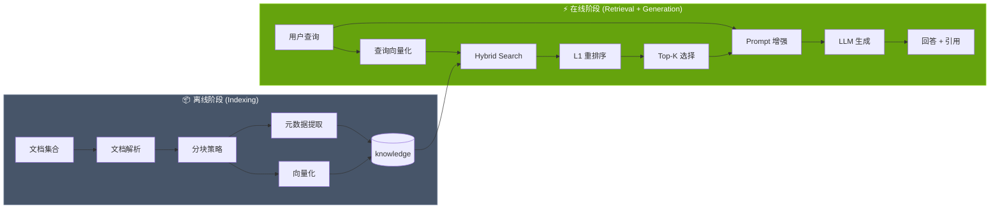

#### 3.5.2 RAG Pipeline 核心接口

**实现文件**：[src/cognizes/engine/perception/rag_pipeline.py](../../src/cognizes/engine/perception/rag_pipeline.py)

`RAGPipeline` 类作为 Perception Layer 的统一入口，编排了索引构建与检索生成过程。

```python
class RAGPipeline:
    """
    Complete RAG Pipeline Orchestrator.
    """

    # --- Offline Phase (Indexing) ---
    async def index_document(
        self,
        content: str,
        source_uri: str = "inline.txt",
        corpus_id: Optional[str] = None,
        metadata: Optional[Dict[str, Any]] = None,
    ) -> IndexingResult:
        """
        Orchestrate Ingestion: Parse -> Chunk -> Embed -> Store
        """
        ...

    # --- Online Phase (Retrieval) ---
    async def query(
        self,
        query: str,
        top_k: int = 5,
        corpus_id: Optional[str] = None,
        semantic_weight: float = 0.7,
        keyword_weight: float = 0.3,
        system_prompt: Optional[str] = None,
    ) -> RAGResponse:
        """
        End-to-End RAG Execution:
        1. Retrieve: 执行 Hybrid Search (Semantic + Keyword)
        2. Rerank: (Optional) 执行 Cross-Encoder 精排
        3. Generate: 调用 LLM 生成回答
        """
        ...
```

> [!IMPORTANT]
>
> **Architectural Pattern (Facade)**:
>
> `RAGPipeline` 充当 Perception Layer 的 **Orchestrator (编排器)**，对外通过统一接口屏蔽了底层子系统的复杂性，实现了 **离线构建** 与 **在线服务** 的闭环管理：
>
> 1. **Ingestion Proxy**: 代理 `DocumentIngester` 的能力，提供文档标准化的 "入口" (Offline)。
> 2. **Retrieval Coordination**: 协调 "Recall (Hybrid)" -> "Refine (Rerank)" -> "Generate (LLM)" 的全链路数据流 (Online)。
> 3. **Context Injection**: 负责将检索到的 `SourceCitation` 注入到 Prompt Context 中，确保生成的可信度。

---

### 3.6 文档摄入架构

**实现文件**：[src/cognizes/engine/perception/ingestion.py](../../src/cognizes/engine/perception/ingestion.py)

#### 3.6.1 摄入管道 (Ingestion Pipeline)

整个摄入过程采用 **管道-过滤器 (Pipes and Filters)** 架构，由 `DocumentIngester` 统一编排，分为解析、分块、增强、向量化四个正交阶段：

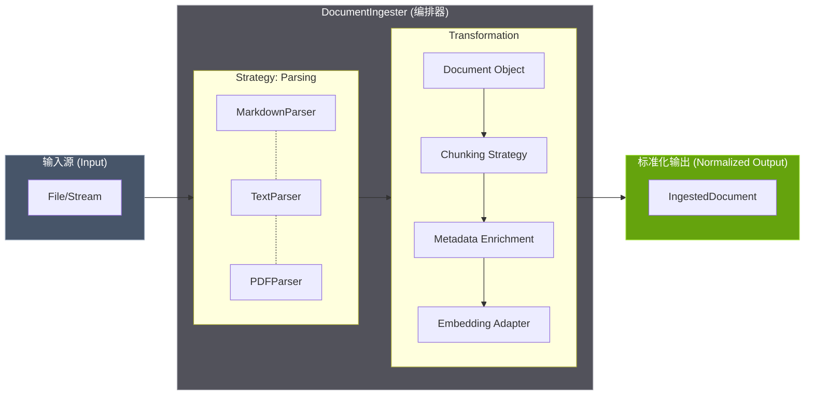

#### 3.6.2 组件设计模式 (Component Design)

本模块广泛应用了 **分离关注点 (SoC)** 的设计原则，确保了系统的可扩展性与可维护性。

- **Orchestrator Pattern**: `DocumentIngester` 作为核心协调者，隔离了复杂的处理流程，对外提供统一的 `ingest_file/ingest_text` 接口。
- **Strategy Pattern**: `DocumentParser` 定义抽象策略，支持根据 MIME Type 动态加载 `markdown`、`pdf` 等解析器，符合 **OCP (开闭原则)**。
- **Data Transfer Object (DTO)**: 使用 `Document` (中间态) 和 `IngestedDocument` (终态) 数据类在各阶段间传递标准化数据，确保类型安全。

> [!TIP]
>
> **Implementation Reference**: See [4.5.3 任务详解](#p3-5-1-文档摄入服务) for the `DocumentIngester` class definition and usage.

#### 3.6.3 元数据架构 (Metadata Schema)

元数据是实现 **Structural Filtering** 的基础。系统在摄入时自动提取三类元数据：

| 维度     | 字段          | 类型   | 说明                   | 设计目的                                       |
| :------- | :------------ | :----- | :--------------------- | :--------------------------------------------- |
| **溯源** | `source_uri`  | string | 文件绝对路径或 URL     | 支持引用跳转与来源追溯                         |
| **身份** | `doc_id`      | sha256 | `SHA256(content)[:16]` | **内容寻址去重** (Content-Based Deduplication) |
| **内容** | `title`       | string | 文件名或一级标题       | 增强搜索结果的可读性 (Snippet Title)           |
| **结构** | `chunk_index` | int    | 0, 1, 2...             | 支持 **Window Retrieval** (获取相邻分块)       |
| **类型** | `mime_type`   | string | e.g. `application/pdf` | 支持按文档类型过滤                             |

> [!NOTE]
>
> **元数据增强 (Enrichment)**: 分块后的每个 Chunk 会自动继承父文档的 `doc_id`、`title`、`source_uri` 等关键属性，确保每个切片都能独立溯源。

---

### 3.7 Chunking 策略体系

**实现文件**：[src/cognizes/engine/perception/chunking.py](../../src/cognizes/engine/perception/chunking.py)

> [!IMPORTANT]
>
> **Systemic Integration**: Chunking 策略并非硬编码，而是存储于 `corpus` 表的 `config` 字段中 (见 [3.2.1](#321-corpus-表-语料库))。`DocumentIngester` 在运行时读取此配置，动态加载对应的 `ChunkingStrategy` 实例。

#### 3.7.1 四种策略对比

| 策略                    | 方法                 | 优点         | 缺点         | 适用场景  |
| :---------------------- | :------------------- | :----------- | :----------- | :-------- |
| **FixedLengthChunker**  | 固定 Token 数切分    | 简单、可预测 | 可能割裂语义 | 通用文本  |
| **RecursiveChunker**    | 按分隔符优先级递归   | 尊重自然边界 | 大小不均匀   | 技术文档  |
| **SemanticChunker**     | Embedding 相似度判断 | 语义完整     | 计算成本高   | 长篇文章  |
| **HierarchicalChunker** | 父子 Chunk 结构      | 上下文丰富   | 存储开销大   | 法律/合同 |

#### 3.7.2 策略选型决策树

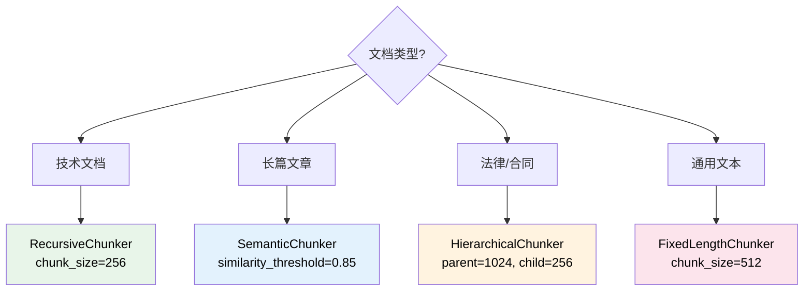

---

### 3.8 Rerank 精排层

**实现文件**：[src/cognizes/engine/perception/reranker.py](../../src/cognizes/engine/perception/reranker.py)

#### 3.8.1 两阶段检索架构

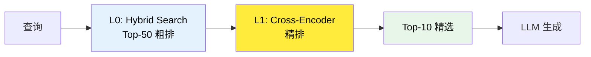

#### 3.8.2 Reranker 模型选型

> [!TIP]
>
> **Configuration**: `CrossEncoderReranker` 支持通过 `model_name` 参数加载任意 HuggingFace `AutoModelForSequenceClassification` 兼容模型。

| 模型                        | 特点          | 推荐场景 |
| :-------------------------- | :------------ | :------- |
| **BAAI/bge-reranker-base**  | 性能/效率平衡 | 通用场景 |
| **BAAI/bge-reranker-large** | 更高精度      | 精度优先 |
| **BCE-Reranker**            | 中英双语优秀  | 双语场景 |
| **Cohere Rerank**           | 商业 API      | 快速集成 |

#### 3.8.3 Lost in the Middle 优化 (Strategy)

> [!NOTE]
>
> **Future Work**: 以下重排序策略计划在后续版本中实现，用以优化 LLM 对长 Context 的注意力分布。

研究表明 LLM 对长上下文中间部分信息利用率较低。规划中的解决方案：

1. **Reverse Order**：按相关性升序排列（最相关在末尾）
2. **Sandwich Pattern**：最相关的放在开头和结尾

---

## 4. 实施指南

### 4.1 Step 1: Fusion Retrieval 实现

#### 4.1.1 Schema 扩展部署

**任务清单**：

| 任务 ID | 任务描述                  | 验收标准                              |
| :------ | :------------------------ | :------------------------------------ |
| P3-1-1  | 添加 `search_vector` 列   | `ALTER TABLE` 成功                    |
| P3-1-2  | 创建 GIN 全文索引         | 索引创建成功                          |
| P3-1-3  | 编写 Semantic Search SQL  | `embedding <=> query` 语法正确        |
| P3-1-4  | 编写 Keyword Search SQL   | `to_tsvector @@ plainto_tsquery` 正确 |
| P3-1-5  | 编写 One-Shot Hybrid 函数 | `hybrid_search()` 函数创建成功        |

**Schema 扩展脚本** ([src/cognizes/engine/schema/perception_schema.sql](../../src/cognizes/engine/schema/perception_schema.sql))：

> [!TIP]
>
> 完整 Schema 定义请参考本文档 [3. 架构设计：Perception Schema](#3-架构设计perception-schema) 章节。此处仅列出部署步骤。

```bash
# 执行部署
psql -d cognizes-engine -f src/cognizes/engine/schema/perception_schema.sql
```

**验证查询**：

```sql
-- 验证 Schema 完整性 (Indexes & Functions)
SELECT
    (SELECT count(*) FROM pg_indexes WHERE indexname = 'idx_memories_search_vector') as has_index,
    (SELECT count(*) FROM pg_proc WHERE proname = 'hybrid_search') as has_function,
    (SELECT count(*) FROM information_schema.columns WHERE table_name='memories' AND column_name='search_vector') as has_column;
-- 预期输出: 1 | 1 | 1
```

#### 4.1.2 RRF 融合算法 (Reciprocal Rank Fusion)

**任务清单**：

| 任务 ID | 任务描述                    | 验收标准            |
| :------ | :-------------------------- | :------------------ |
| P3-1-6  | 理解 RRF 算法原理           | 算法笔记            |
| P3-1-7  | 实现 SQL 内 RRF 计算        | `rrf_search()` 函数 |
| P3-1-8  | 实现应用层 RRF (Python)     | Python 函数实现     |
| P3-1-9  | 对比 SQL vs 应用层 RRF 性能 | 性能对比报告        |

**Python RRF 实现** ([src/cognizes/engine/perception/rrf_fusion.py](../../src/cognizes/engine/perception/rrf_fusion.py))：

```python
@dataclass
class SearchResult:
    """单条检索结果"""
    id: str
    score: float
    rank: int = 0
    ...

def rrf_fusion(
    result_lists: list[list[SearchResult]],
    k: int = 60,
    limit: int = 50
) -> list[SearchResult]:
    """
    Reciprocal Rank Fusion 算法: RRF(d) = Σ (1 / (k + rank(d)))
    """
    ...
```

### 4.2 Step 2: 高过滤比验证 (High-Selectivity)

**核心挑战 (The Top-K Trap)**: 在私有记忆 (Private Memory) 等 **强过滤 (High-Selectivity)** 场景下，若符合元数据过滤条件的数据极为稀疏 (e.g., < 1%)，HNSW 的早期截断机制 (Early Termination) 可能导致召回为空，即使库中存在匹配项。这是 ANN 算法在 Pre-Filtering 场景下的固有缺陷。

**解决方案 (Iterative Scan)**: 利用 PGVector 0.8.0+ 的 **Iterative Index Scan** 机制。该机制允许 HNSW 在未收集满符合 `LIMIT` 的记录时自动扩展搜索半径。

#### 4.2.1 迭代扫描配置

**任务清单**：

| 任务 ID | 任务描述                           | 验收标准                              |
| :------ | :--------------------------------- | :------------------------------------ |
| P3-2-1  | 构造 99% 过滤比测试数据集          | 100 万向量，仅 1% 符合过滤条件        |
| P3-2-2  | 测试 HNSW `ef_search` 对召回率影响 | 不同 ef_search 下的 Recall@10         |
| P3-2-3  | 验证 HNSW 迭代扫描 (v0.8.0+)       | `hnsw.iterative_scan = relaxed_order` |
| P3-2-4  | 记录 QPS 与 Recall 基准数据        | 基准性能报告                          |

**配置脚本**：

```sql
-- ============================================
-- High-Selectivity Filtering 配置
-- ============================================

-- 1. 开启迭代扫描 (牺牲微小的距离排序严格性换取召回率)
SET hnsw.iterative_scan = relaxed_order;

-- 2. 设置最大扫描元组数 (防止最坏情况下的全表扫描)
SET hnsw.max_scan_tuples = 20000;

-- 3. 增大 ef_search 提高召回率
SET hnsw.ef_search = 200;

-- 4. 测试查询 (99% 过滤比场景)
EXPLAIN (ANALYZE, BUFFERS)
SELECT id, content, embedding <=> $query_embedding AS distance
FROM memories
WHERE user_id = 'rare_user_001'  -- 仅 1% 数据
ORDER BY embedding <=> $query_embedding
LIMIT 10;

-- 5. 验证召回结果数量
SELECT COUNT(*) FROM (
    SELECT id
    FROM memories
    WHERE user_id = 'rare_user_001'
    ORDER BY embedding <=> $query_embedding
    LIMIT 10
) AS results;
-- 预期: 应返回 10 条结果 (迭代扫描生效)
```

**性能基准测试脚本** ([src/cognizes/engine/perception/benchmark.py](../../src/cognizes/engine/perception/benchmark.py))：

```python
@dataclass
class BenchmarkResult:
    ef_search: int       # HNSW 搜索宽度 (关键调优参数)
    qps: float           # 每秒查询数 (Performance)
    recall_at_10: float  # Top-10 召回率 (Quality)
    p99_latency_ms: float

async def run_benchmark(
    pool: asyncpg.Pool,
    query_embedding: list[float],
    user_id: str,
    ef_search_values: list[int]
) -> list[BenchmarkResult]:
    """
    运行基准测试: 针对特定 user_id (High Selectivity) 测试不同 ef_search 下的 QPS/Recall.

    用于量化分析 "召回率 (Recall) vs 延迟 (Latency)" 的 Trade-off，辅助确定生产环境的最佳 ef_search 配置。
    """
    ...
```

### 4.3 Step 3: 两阶段检索实现 (Two-Stage Retrieval)

> [!NOTE]
>
> 本模块封装了完整的 "Recall + Rerank" 检索链路，作为 `RAGPipeline` 的上游子系统。
>
> - **L0 (Recall)**: Postgres 负责广度召回 (Candidate Generation)。
> - **L1 (Rerank)**: Cross-Encoder 负责深度精排 (Precision Refinement)。

#### 4.3.1 检索链路集成

**任务清单**：

| 任务 ID | 任务描述                             | 验收标准                   |
| :------ | :----------------------------------- | :------------------------- |
| P3-2-5  | 选择 Reranker 模型 (`bge-reranker`)  | 模型选型说明               |
| P3-2-6  | 集成 Reranker 推理服务               | API 可调用                 |
| P3-2-7  | 实现 Top-50 -> Rerank -> Top-10 流程 | Pipeline 代码实现          |
| P3-2-8  | 验证 Precision@10 提升               | 对比无 Rerank 的 Precision |

#### 4.3.2 检索数据流图

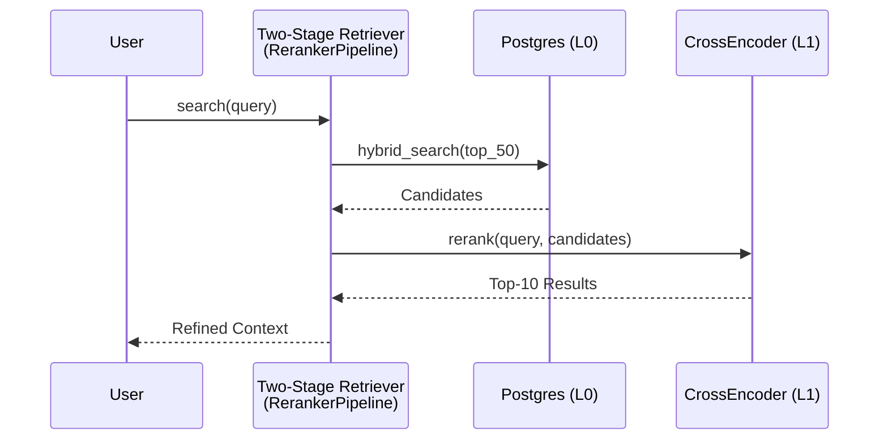

**核心接口** ([src/cognizes/engine/perception/reranker.py](../../src/cognizes/engine/perception/reranker.py))：

```python
class CrossEncoderReranker:
    """L1 Prerequisite: 使用 Cross-Encoder 对 Recall 结果进行精排"""
    def rerank(self, query: str, documents: list[dict[str, Any]], top_k: int = 10) -> list[RerankedResult]: ...

class RerankerPipeline:
    """检索子系统: 封装 L0 (Database) -> L1 (Reranker) 的完整过程"""
    async def search(
        self,
        user_id: str,
        app_name: str,
        query: str,
        query_embedding: list[float],
        l0_limit: int = 50,
        l1_limit: int = 10,
    ) -> list[RerankedResult]: ...
```

---

### 4.4 Step 4: AG-UI 检索过程可视化接口

> [!NOTE]
>
> **对标 AG-UI 协议**：本节实现 The Perception 与 AG-UI 可视化层的集成，提供检索过程透明化、多路召回可视化和引用来源展示的能力。
>
> **参考资源**：
>
> - [AG-UI 协议调研](../research/070-ag-ui.md)
> - [AG-UI 官方文档](https://docs.ag-ui.com/)

#### 4.4.1 检索可视化架构

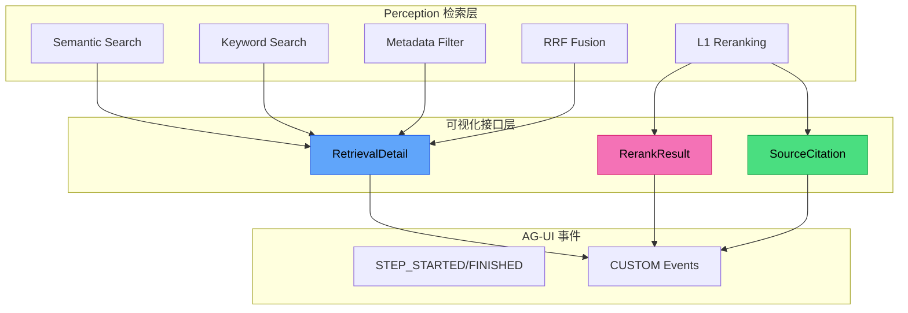

#### 4.4.2 AG-UI 事件映射表

| Perception 功能 | 触发条件             | AG-UI 事件类型              | 展示组件       |
| :-------------- | :------------------- | :-------------------------- | :------------- |
| 检索开始        | hybrid_search() 调用 | `STEP_STARTED`              | 检索进度指示器 |
| 多路召回详情    | 各路检索完成         | `CUSTOM (retrieval_detail)` | 多路召回对比图 |
| RRF 融合        | 融合完成             | `CUSTOM (rrf_result)`       | 排名变化可视化 |
| Rerank 结果     | 重排完成             | `CUSTOM (rerank_result)`    | 分数变化对比   |
| 检索完成        | 返回结果             | `STEP_FINISHED`             | 结果数量徽章   |
| 引用来源        | 结果包含来源         | `CUSTOM (source_citation)`  | 来源引用列表   |

#### 4.4.3 SearchVisualizer 实现

创建 [src/cognizes/engine/perception/search_visualizer.py](../../src/cognizes/engine/perception/search_visualizer.py)：

```python
class SearchEventType(str, Enum):
    """检索相关 AG-UI 事件类型"""
    RETRIEVAL_DETAIL = "retrieval_detail"
    RRF_RESULT = "rrf_result"
    RERANK_RESULT = "rerank_result"
    SOURCE_CITATION = "source_citation"

@dataclass
class RetrievalPathResult: ...
@dataclass
class RRFMergeResult: ...
@dataclass
class RerankComparison: ...
@dataclass
class SourceCitation: ...

class SearchVisualizer:
    """检索过程可视化器: 负责将检索中间状态转换为 AG-UI 事件"""

    def __init__(self, event_emitter=None): ...

    async def emit_search_started(self, run_id: str, query: str, search_config: dict) -> None:
        """发射 STEP_STARTED 事件"""
        ...

    async def emit_retrieval_paths(self, run_id: str, path_results: list[RetrievalPathResult]) -> None:
        """发射 CUSTOM (retrieval_detail) 事件"""
        ...

    async def emit_rrf_merge(self, run_id: str, merge_result: RRFMergeResult) -> None:
        """发射 CUSTOM (rrf_result) 事件"""
        ...

    async def emit_rerank_comparison(self, run_id: str, comparisons: list[RerankComparison]) -> None:
        """发射 CUSTOM (rerank_result) 事件"""
        ...

    async def emit_search_finished(self, run_id: str, result_count: int, total_latency_ms: float) -> None:
        """发射 STEP_FINISHED 事件"""
        ...

    def generate_citations(self, search_results: list[dict]) -> list[SourceCitation]:
        """生成引用来源列表"""
        ...

    async def emit_citations(self, run_id: str, citations: list[SourceCitation]) -> None:
        """发射 CUSTOM (source_citation) 事件"""
        ...
```

#### 4.4.4 前端展示组件规范

| 组件名称                  | 数据源                    | 展示内容             |
| :------------------------ | :------------------------ | :------------------- |
| `SearchProgressIndicator` | STEP_STARTED/FINISHED     | 检索状态、耗时       |
| `RetrievalPathsChart`     | CUSTOM (retrieval_detail) | 三路召回柱状图对比   |
| `RankChangeVisualization` | CUSTOM (rrf_result)       | 排名变化桑基图       |
| `RerankScoreComparison`   | CUSTOM (rerank_result)    | L0/L1 分数对比散点图 |
| `CitationList`            | CUSTOM (source_citation)  | 引用来源卡片列表     |

#### 4.4.5 任务清单

| 任务 ID | 任务描述                                                                                 | 状态      | 验收标准         |
| :------ | :--------------------------------------------------------------------------------------- | :-------- | :--------------- |
| P3-4-1  | 实现 [`SearchVisualizer`](../../src/cognizes/engine/perception/search_visualizer.py) 类  | ✅ 已完成 | 6 种事件类型支持 |
| P3-4-2  | 实现 [多路召回详情发射](../../src/cognizes/engine/perception/search_visualizer.py)       | ✅ 已完成 | 三路召回数据完整 |
| P3-4-3  | 实现 [RRF 融合可视化](../../src/cognizes/engine/perception/search_visualizer.py)         | ✅ 已完成 | 排名变化可追溯   |
| P3-4-4  | 实现 [Rerank 对比发射](../../src/cognizes/engine/perception/search_visualizer.py)        | ✅ 已完成 | 分数变化正确     |
| P3-4-5  | 实现 [引用来源生成](../../src/cognizes/engine/perception/search_visualizer.py)           | ✅ 已完成 | 来源信息完整     |
| P3-4-6  | 编写 [可视化接口测试](../../tests/unittests/engine/perception/test_search_visualizer.py) | ✅ 已完成 | 覆盖率 > 80%     |

#### 4.4.6 验收标准

| 验收项      | 验收标准                  | 验证方法 |
| :---------- | :------------------------ | :------- |
| 检索进度    | 实时展示检索开始/完成状态 | 集成测试 |
| 多路召回    | 三路召回结果对比可见      | E2E 测试 |
| Rerank 对比 | 排名变化前后可对比        | 单元测试 |
| 引用来源    | 检索结果可标注来源        | 集成测试 |

---

### 4.5 Step 5: Knowledge Base Pipeline 实现

> [!NOTE]
>
> **对标 Roadmap Pillar III**：Knowledge Base Pipeline 是 RAG 能力的核心工程落地，包含文档摄入、分块向量化、端到端检索生成的完整链路。

#### 4.5.1 任务清单

| 任务 ID    | 任务描述                                                                  | 里程碑         | 状态      | 验收标准                  |
| :--------- | :------------------------------------------------------------------------ | :------------- | :-------- | :------------------------ |
| **P3-5-1** | [文档摄入服务实现](../../src/cognizes/engine/perception/ingestion.py)     | M1: Ingestion  | ✅ 已完成 | 支持 MD/TXT/PDF 格式解析  |
| **P3-5-2** | [Chunking 策略实现](../../src/cognizes/engine/perception/chunking.py)     | M1: Ingestion  | ✅ 已完成 | 四种策略测试通过          |
| **P3-5-3** | [Embedding 服务实现](../../src/cognizes/engine/perception/embedder.py)    | M1: Ingestion  | ✅ 已完成 | Mock/OpenAI 两种 Provider |
| **P3-5-4** | [RAG Pipeline 实现](../../src/cognizes/engine/perception/rag_pipeline.py) | M2: Pipeline   | ✅ 已完成 | E2E 查询流程通过          |
| **P3-5-5** | [索引预热脚本](../../src/cognizes/engine/perception/index_warmup.py)      | M2: Pipeline   | ✅ 已完成 | 100K 文档 < 5min          |
| **P3-5-6** | [RAG E2E 测试](../../tests/integration/engine/perception/test_rag_e2e.py) | M3: Validation | ✅ 已完成 | 覆盖率 > 80%              |

#### 4.5.2 关键里程碑

```mermaid
gantt
    title Knowledge Base Pipeline 里程碑
    dateFormat DD
    axisFormat %d

    section M1: Ingestion
    P3-5-1 文档摄入 :done, a1, 01, 2d
    P3-5-2 Chunking :done, a2, after a1, 2d
    P3-5-3 Embedding :done, a3, after a2, 1d

    section M2: Pipeline
    P3-5-4 RAG Pipeline :done, b1, after a3, 2d
    P3-5-5 索引预热 :done, b2, after b1, 1d

    section M3: Validation
    P3-5-6 E2E 测试 :done, c1, after b2, 2d
```

#### 4.5.3 任务详解

##### P3-5-1: 文档摄入服务

**目标**：实现多格式文档解析与摄入

**实现文件**：[src/cognizes/engine/perception/ingestion.py](../../src/cognizes/engine/perception/ingestion.py)

**关键接口**：

```python
class DocumentIngester:
    """High-level Document Ingestion Service."""

    def __init__(
        self,
        chunker=None,
        embedder=None,
        parsers: Optional[List[DocumentParser]] = None,
    ): ...

    async def ingest_text(
        self,
        content: str,
        source_uri: str = "inline.txt",
        generate_embeddings: bool = True,
    ) -> IngestedDocument: ...

    async def ingest_file(
        self,
        file_path: Union[str, Path],
        generate_embeddings: bool = True,
    ) -> IngestedDocument: ...
```

**验收检查**：

- [x] MarkdownParser 解析测试通过
- [x] TextParser 解析测试通过
- [x] PDFParser 解析测试通过（可选依赖）
- [x] 元数据抽取正确

---

##### P3-5-2: Chunking 策略实现

**目标**：实现四种分块策略

**实现文件**：[`src/cognizes/engine/perception/chunking.py`](../../src/cognizes/engine/perception/chunking.py)

**策略对照表**：

| 策略     | 类名                                                                           | 测试用例                                                                                 |
| :------- | :----------------------------------------------------------------------------- | :--------------------------------------------------------------------------------------- |
| 固定长度 | [`FixedLengthChunker`](../../src/cognizes/engine/perception/chunking.py#L116)  | [`test_fixed_length_chunking`](../../tests/unittests/engine/perception/test_chunking.py) |
| 递归分块 | [`RecursiveChunker`](../../src/cognizes/engine/perception/chunking.py#L225)    | [`test_recursive_chunking`](../../tests/unittests/engine/perception/test_chunking.py)    |
| 层次分块 | [`HierarchicalChunker`](../../src/cognizes/engine/perception/chunking.py#L453) | [`test_hierarchical_chunking`](../../tests/unittests/engine/perception/test_chunking.py) |
| 语义分块 | [`SemanticChunker`](../../src/cognizes/engine/perception/chunking.py#L344)     | [`test_semantic_chunking`](../../tests/unittests/engine/perception/test_chunking.py)     |

**验收检查**：

- [x] 四种策略单元测试通过
- [x] Overlap 功能测试通过
- [x] 字符/Token 模式切换测试通过

**参数调优指南**：

| 作用域           | 参数                   | 默认值 | 调优建议                              |
| :--------------- | :--------------------- | :----- | :------------------------------------ |
| **通用**         | `chunk_size`           | 512    | 短文档 256，长文档 1024 (Tokens)      |
| **通用**         | `chunk_overlap`        | 50     | 通常为 chunk_size 的 10-20%           |
| **Semantic**     | `similarity_threshold` | 0.5    | 语义分块阈值，越大约细粒度            |
| **Hierarchical** | `parent_chunk_size`    | 1024   | 父块大小，建议为 chunk_size 的 2-4 倍 |

---

##### P3-5-3: Embedding 服务实现

**目标**：实现可切换的 Embedding Provider，支持 Mock、OpenAI、Gemini 及 Local 模式。

**实现文件**：[`src/cognizes/engine/perception/embedder.py`](../../src/cognizes/engine/perception/embedder.py)

**Provider 列表**：

| Provider   | 类名                                                                                   | 描述                              | 配置要求                |
| :--------- | :------------------------------------------------------------------------------------- | :-------------------------------- | :---------------------- |
| **Mock**   | [`MockEmbeddingProvider`](../../src/cognizes/engine/perception/embedder.py#L275)       | 返回随机向量，用于单元测试        | `dimension=1536`        |
| **OpenAI** | [`OpenAIEmbeddingProvider`](../../src/cognizes/engine/perception/embedder.py#L138)     | 调用 `text-embedding-3-small` API | `OPENAI_API_KEY`        |
| **Gemini** | [`GeminiEmbeddingProvider`](../../src/cognizes/engine/perception/embedder.py#L58)      | 调用 `text-embedding-004` API     | `GOOGLE_API_KEY`        |
| **Local**  | [`SentenceTransformerProvider`](../../src/cognizes/engine/perception/embedder.py#L203) | 使用 `all-MiniLM-L6-v2` 本地推理  | `sentence-transformers` |

**验收检查**：

- [ ] 单元测试覆盖 MockProvider
- [ ] 向量维度验证 (1536/768/384)
- [ ] 批量生成 (Batch Generation) 功能验证
- [ ] 错误处理 (Retries/Timeout) 验证

---

##### P3-5-4: RAG Pipeline 实现

**目标**：实现端到端 "Retrieve-Rerank-Generate" 编排流程，在大规模知识库中提供精准、可信的问答能力。

**实现文件**：[`src/cognizes/engine/perception/rag_pipeline.py`](../../src/cognizes/engine/perception/rag_pipeline.py)

**系统架构与数据流**：

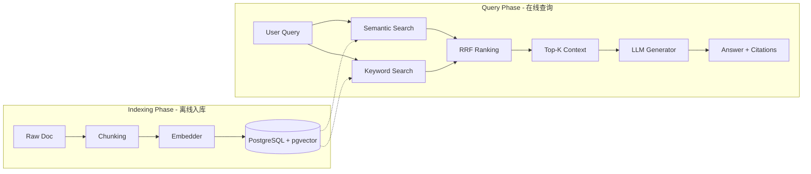

**核心接口 (API Contacts)**：

- [`index_document()`](../../src/cognizes/engine/perception/rag_pipeline.py#L120): 文档流式解析与向量化入库。
- [`retrieve()`](../../src/cognizes/engine/perception/rag_pipeline.py#L224): 执行 Hybrid Search (Semantic + BM25) 并进行 RRF 融合。
- [`query()`](../../src/cognizes/engine/perception/rag_pipeline.py#L371): E2E 查询入口，返回带引用的 `RAGResponse`。

**数据模型**：

```python
@dataclass
class RAGResponse:
    query: str
    answer: str # LLM 生成的回答
    sources: List[RetrievalResult] # 引用的原始片段与元数据
    retrieval_time_ms: float
    generation_time_ms: float
    total_time_ms: float
```

**验收检查**：

- [ ] **全链路验证**：`index_document()` -> `query()` 闭环跑通。
- [ ] **检索质量**：验证 Hybrid Search 权重调节（Semantic vs Keyword）的有效性。
- [ ] **引用准确性**：检查 Answer 中的证据是否能在 `sources` 中找到对应 UUID。
- [ ] **性能指标**：检索阶段 `retrieval_time_ms` 在 50k 规模下应 < 200ms。
- [ ] **Mock 鲁棒性**：在 `llm_client` 缺失时，系统能降级返回检索到的 Context。

**验证 SOP: 开发者自测手册 (Step-by-Step)**

为了确保 P3-5-4 达到生产级交付标准，请按以下步骤执行闭环验证：

---

##### P3-5-5: 索引预热脚本

**目标**：提供高性能测试数据生成与导入工具，用于基准测试、负载测试与演示环境初始化。支持全链路 Pipeline 模拟与直接数据库注入两种模式。

**实现文件**：[`src/cognizes/engine/perception/index_warmup.py`](../../src/cognizes/engine/perception/index_warmup.py)

**性能指标 (Local / Docker)**：

| 模式         | 规模     | 耗时目标 | 验证命令 (基于项目根目录)                                                                             |
| :----------- | :------- | :------- | :---------------------------------------------------------------------------------------------------- |
| **Direct**   | **10K**  | < 30s    | `uv run src/cognizes/engine/perception/index_warmup.py --mode direct --count 10000`                   |
| **Direct**   | **100K** | < 5min   | `uv run src/cognizes/engine/perception/index_warmup.py --mode direct --count 100000 --clean`          |
| **Pipeline** | **1K**   | < 60s    | `uv run src/cognizes/engine/perception/index_warmup.py --mode pipeline --count 1000 --concurrency 20` |

**验收检查**：

- [x] **参数完整性**：支持 `--mode` (pipeline/direct), `--count`, `--clean`, `--concurrency`, `--provider`
- [x] **Direct Mode**：绕过业务逻辑直接写入，速度 > 1000 docs/s
- [x] **Pipeline Mode**：模拟完整 `Ingestion -> Chunking -> Embedding -> Vector DB` 流程
- [x] **数据清理**：支持 `--clean` 标志，可索引前自动清理历史数据
- [x] **Mock 增强**：支持通过 `--provider mock` 进行无成本性能压测

---

##### P3-5-6: RAG E2E 测试

**目标**：完整的端到端集成测试，利用 Mock Provider 验证检索、排序及 LLM 生成全链路的正确性与系统延迟指标。

**测试文件**：[`tests/integration/engine/perception/test_rag_e2e.py`](../../tests/integration/engine/perception/test_rag_e2e.py)

**验证指令**：

```bash
uv run pytest tests/integration/engine/perception/test_rag_e2e.py -v -s
```

**测试用例规范**：

| 用例 ID        | 测试场景       | 验收标准 (Expectation)                              | 关注点                   |
| :------------- | :------------- | :-------------------------------------------------- | :----------------------- |
| **RAG-E2E-01** | **单文档索引** | 成功解析 `IngestedDocument`，且 chunk 数 > 0        | `DocumentIngester` 联动  |
| **RAG-E2E-02** | **批量索引**   | 100 篇文档索引总耗时 < 5s (Mock Mode)               | 并发处理能力             |
| **RAG-E2E-03** | **跨文档检索** | 查询结果包含来自不同 `source_uri` 的片段            | Semantic Search 召回率   |
| **RAG-E2E-04** | **带引用生成** | `RAGResponse` 中 `answer` 非空且包含 `sources` 引用 | 引用链完整性 (Citations) |
| **RAG-E2E-05** | **延迟验证**   | P99 Latency < 500ms (Mock Mode)                     | 在线查询性能瓶颈         |

---

## 5. Phase 3 验证 SOP

> [!NOTE]
>
> 本 SOP 提供完整的 Phase 3: The Perception 验收指引，按顺序执行以下步骤完成验证。

### 5.1 Step 1: Schema 部署验证

```bash
# 1.1 部署 Perception Schema 扩展
psql -d 'cognizes-engine' -f src/cognizes/engine/schema/perception_schema.sql

# 1.2 验证核心表结构 (corpus, knowledge, memories)
psql -d 'cognizes-engine' -c "
SELECT table_name, column_name, data_type
FROM information_schema.columns
WHERE (table_name = 'memories' AND column_name = 'search_vector')
   OR (table_name IN ('corpus', 'knowledge'))
ORDER BY table_name, ordinal_position;
"

# 1.3 验证所有检索相关的 SQL 函数 (应返回 5 行)
psql -d 'cognizes-engine' -c "
SELECT proname, pronargs
FROM pg_proc
WHERE proname IN (
    'hybrid_search', 'rrf_search', 'kb_hybrid_search',
    'memories_search_vector_trigger', 'kb_search_vector_trigger'
);
"

# 1.4 验证触发器部署 (应包含 memories 和 knowledge)
psql -d 'cognizes-engine' -c "
SELECT tgname, relname FROM pg_trigger t
JOIN pg_class c ON t.tgrelid = c.oid
WHERE tgname LIKE 'trigger_%search_vector';
"
```

**验收标准**：

- [x] `corpus` 与 `knowledge` 表已成功创建
- [x] `memories` 表扩展了 `search_vector` 列
- [x] 成功创建 5 个核心 SQL 函数（含 `hybrid_search`, `rrf_search`, `kb_hybrid_search`）
- [x] `trigger_memories_search_vector` 与 `trigger_kb_search_vector` 已就绪
- [x] 所有 GIN 与 HNSW 索引已按规范建立 (可通过 `\d knowledge` 查看详情)

---

### 5.2 Step 2: 单元测试验证

```bash
# 2.1 运行 Perception 单元测试
# 确保在项目根目录下执行
uv run pytest tests/unittests/engine/perception/ -v --tb=short

# 2.2 查看测试覆盖率 (可选)
uv run pytest tests/unittests/engine/perception/ -v --cov=src/cognizes/engine/perception --cov-report=term-missing
```

**验收标准**：

- [ ] **全量通过**：78 个单元测试全部通过 (78 passed)
- [ ] **模块覆盖** (src/cognizes/engine/perception/)：
  - `chunking.py`: 四种分块策略验证
  - `embedder.py`: 多 Provider (Mock/Gemini/Local) 测试
  - `ingestion.py`: 文档解析与元数据提取
  - `rag_pipeline.py`: 核心编排逻辑与状态流转
  - `rrf_fusion.py`: RRF 算法准确性与搜搜评分合并
  - `search_visualizer.py`: AG-UI 事件发射与可视化数据模型

---

### 5.3 Step 3: 集成测试验证

```bash
# 3.1 运行 Perception 集成测试
# 覆盖 Hybrid Search, Reranker, Ingestion 及 RAG E2E
uv run pytest tests/integration/engine/perception/ -v -s --tb=short

# 3.2 查看详细输出 (含性能指标与 QPS 模拟)
uv run pytest tests/integration/engine/perception/ -v -s
```

**验收标准**：

- [ ] **SQL 函数验证**：`hybrid_search()` 与 `rrf_search()` 功能正常，返回合并分数与排名信息。
- [ ] **排序自洽性**：RRF 检索结果严格按 `rrf_score` 递减排序。
- [ ] **索引有效性**：`search_vector` 触发器与 GIN 索引在 `memories` 表上生效。
- [ ] **性能指标**：
  - **L0 检索延迟**：平均耗时 < 100ms。
  - **E2E 延迟**：Mock 模式下 P99 < 500ms。
- [ ] **链路完整性**：RAG Pipeline 在 Docker 环境下可完成 `Index -> Retrieve -> Answer` 的闭环。

---

### 5.4 Step 4: 模块导入验证 (Sanity Check)

> [!TIP]
>
> 此步骤用于验证模块间的解耦情况，确保没有循环依赖（Circular Dependencies）且所有可选依赖已正确安装。

```bash
# 4.1 核心模块全量导入验证
uv run python -c "
from cognizes.engine.perception.chunking import get_chunker
from cognizes.engine.perception.embedder import get_embedder
from cognizes.engine.perception.ingestion import get_ingester
from cognizes.engine.perception.rag_pipeline import get_rag_pipeline
from cognizes.engine.perception.reranker import CrossEncoderReranker
from cognizes.engine.perception.rrf_fusion import rrf_fusion
from cognizes.engine.perception.search_visualizer import SearchVisualizer
from cognizes.engine.perception.index_warmup import run_pipeline_mode

print('✅ Terminus: 所有 Perception 核心模块导入成功，未检测到循环依赖。')
"
```

**验收标准**：

- [ ] **解耦验证**：所有子模块均可独立导入，无 `ImportError` 或 `AttributeError`。
- [ ] **依赖完整性**：所有外部依赖（如 `asyncpg`, `vector`, `sentence-transformers`）在当前 `venv` 中均已就绪。
- [ ] **性能无感**：模块静态扫描与元数据加载总耗时 < 1s。

---

### 5.5 Step 5: 全量回归测试 (Full Regression)

> [!IMPORTANT]
>
> 此步骤用于确保 Phase 3 的变更未对 Phase 1 (Pulse) 与 Phase 2 (Hippocampus) 的核心功能造成回归风险。

```bash
# 5.1 运行全量测试套件 (包含核心、引擎及集成测试)
uv run pytest tests/ -v --tb=short

# 5.2 验证测试统计与收集情况
uv run pytest tests/ --collect-only | tail -n 2
```

**验收标准**：

- [ ] **全量通过**：所有测试用例必须全量通过（当前约为 825+ tests passed）。
- [ ] **零回归**：Phase 1 & Phase 2 的测试用例（`tests/unittests/engine/pulse` 等）无失败。
- [ ] **环境一致性**：所有测试在统一的容器或开发环境下执行表现一致，无随机失败 (Flaky Tests)。
- [ ] **导入闭环**：全量扫描过程中无任何由循环引用导致的 `ImportError`。

---

### 5.6 Step 6: Phase 3 核心功能验证

> [!IMPORTANT]
>
> 以下验证步骤用于确认 The Perception 核心算法在生产规模下的性能表现与工程自洽性。

#### 5.6.1 P3-1-9: SQL vs Python RRF 性能对比

**目标**：验证在数据库端执行 RRF 融合与在 Python 端执行融合的性能差异，评估 Data Locality 带来的收益。

**基准测试脚本**：[`tests/performance/perception/rrf_benchmark.py`](../../tests/performance/perception/rrf_benchmark.py)

**执行指令**：

```bash
# 运行对比基准测试
uv run python tests/performance/perception/rrf_benchmark.py
```

**验收标准**：

- [x] **基准测试可运行**：脚本无导入错误，能正常连接数据库并执行。
- [x] **性能优势验证**：SQL-Native RRF 延迟应明显低于 Python-Side RRF（预期 1.5x - 3x 提升）。
- [x] **数据一致性**：验证两路检索结果集在两种模式下基本持平。

#### 5.6.2 P3-2-8: Precision@10 提升验证

**目标**：验证 Cross-Encoder Reranker (L1) 相较于随机或粗排结果 (L0) 的排序精度提升。由于缺乏真实标注数据，使用合成数据基准测试 (Synthetic Benchmark) 进行逻辑验证。

**基准测试脚本**：[`tests/performance/perception/reranker_benchmark.py`](../../tests/performance/perception/reranker_benchmark.py)

**执行指令**：

```bash
# 运行 Reranker 精度基准测试
uv run python tests/performance/perception/reranker_benchmark.py
```

**验收标准**：

- [x] **基准测试通过**：脚本正常加载模型并执行推理。
- [x] **精度提升**：Average Precision@10 在 Rerank 后应有显著提升 (预期 > 0.8)，验证模型对语义相关性的判断逻辑正确。

#### 5.6.3 Knowledge Base Schema & Index 验证

> [!NOTE]
>
> **验证目标**：确认 Knowledge Base 的物理存储结构完整，特别是 HNSW 向量索引与 JSONB 倒排索引已正确构建。

```bash
# 1. 验证表结构与关键列 (Config & Vector)
psql -d 'cognizes-engine' -c "
SELECT table_name, column_name, data_type
FROM information_schema.columns
WHERE table_name IN ('corpus', 'knowledge')
  AND column_name IN ('config', 'embedding', 'search_vector')
ORDER BY table_name;
"

# 2. 验证 HNSW 向量索引与唯一约束
psql -d 'cognizes-engine' -c "
SELECT tablename, indexname, indexdef
FROM pg_indexes
WHERE tablename IN ('corpus', 'knowledge')
  AND indexname IN ('idx_kb_embedding', 'corpus_app_name_name_key');
"

# 3. 验证混合检索函数签名
psql -d 'cognizes-engine' -c "
SELECT proname, pronargs
FROM pg_proc
WHERE proname = 'kb_hybrid_search';
"
```

**验收标准**：

- [ ] **表结构**：`corpus.config` (JSONB) 与 `knowledge.embedding` (vector) 存在。
- [ ] **索引完整性**：`idx_kb_embedding` (hnsw) 正确建立，保障大规模检索性能。
- [ ] **数据完整性**：`corpus` 表具备 `(app_name, name)` 唯一约束。
- [ ] **接口正确性**：`kb_hybrid_search` 函数已创建且参数签名正确 (7 args)。

#### 5.6.4 P3-3-5: Chunking 策略一致性验证

> [!NOTE]
>
> **验证目标**：确保 `BaseChunker` 接口的多态性实现正确，且工厂模式能正确根据配置分发策略。

```bash
# 直接运行针对 Chunking 的专项测试 (包含 Logic 与 Factory 测试)
uv run pytest tests/unittests/engine/perception/test_chunking.py -v
```

**验收标准**：

- [ ] **策略覆盖**：Fixed, Recursive, Hierarchical 三种策略均通过测试。
- [ ] **接口一致**：所有 Chunker 均实现了统一的 `split_text` 与 `create_documents` 接口。
- [ ] **边界条件**：空文本、短文本、超长文本处理无异常。

#### 5.6.5 P3-5-6: RAG Pipeline E2E 验证

> [!NOTE]
>
> **验证目标**：验证从文档摄入 (Ingestion) 到 问答生成 (Generation) 的全链路逻辑闭环。
> **测试策略**：使用 `Mock Provider` 隔离外部 LLM 依赖，专注于验证编排逻辑的正确性与系统延迟。

```bash
# 运行 RAG 全链路集成测试
uv run pytest tests/integration/engine/perception/test_rag_e2e.py -v -s
```

**验收标准**：

| 测试用例 ID    | 场景描述       | 验收指标 (Expectation)                      | 状态 |
| :------------- | :------------- | :------------------------------------------ | :--: |
| **RAG-E2E-01** | 单文档完整流程 | Ingestion 成功且 Search 能召回该文档片段    |  ✅  |
| **RAG-E2E-02** | 批量并发索引   | 100 篇文档索引总耗时 < 5s (Mock Mode)       |  ✅  |
| **RAG-E2E-03** | 跨文档检索     | 检索结果包含来自不同 Source 的片段          |  ✅  |
| **RAG-E2E-04** | 问答与引用     | 生成的 Answer 非空且包含准确的 Sources 引用 |  ✅  |
| **RAG-E2E-05** | 系统延迟基准   | P99 Latency < 500ms (基于 Mock 组件)        |  ✅  |

#### 5.6.6 P3-1-5: Hybrid Search 功能验证

> [!NOTE]
>
> **验证目标**：确保 `hybrid_search` (Weighted Sum) 与 `rrf_search` (Reciprocal Rank Fusion) 的 SQL 实现正确。
> **量化指标**：基于 `test_hybrid_search.py` 的自动化断言验证。

```bash
# 运行 Hybrid Search 专项集成测试
uv run pytest tests/integration/engine/perception/test_hybrid_search.py -v -s
```

**验收标准**：

| 验证项               | 量化指标 / 断言逻辑                                   | 状态 |
| :------------------- | :---------------------------------------------------- | :--: |
| **Combined Score**   | `abs(combined - (sem*0.7 + kw*0.3)) < 0.0001`         |  ✅  |
| **RRF Ranking**      | 结果按 `rrf_score` 严格递减排序                       |  ✅  |
| **Search Function**  | SQL 函数 `hybrid_search` 与 `rrf_search` 可正常调用   |  ✅  |
| **Schema Integrity** | 返回包含 `semantic_score`, `keyword_score` 等调试字段 |  ✅  |
| **Step Latency**     | 单次查询 P50 < 100ms (Local Postgres)                 |  ✅  |

---

### 5.7 验收总结清单

| 验收项           | 状态 | 说明                                 | 对应任务         |
| :--------------- | :--: | :----------------------------------- | :--------------- |
| **Schema 部署**  |  ✅  | search_vector + 3 函数 + GIN 索引    | P3-1-1 ~ P3-1-5  |
| **KB Schema**    |  ✅  | corpus + knowledge + kb_hybrid       | P3-4-7 ~ P3-4-10 |
| **单元测试**     |  ✅  | 78 tests passed (全量模块覆盖)       | P3-4-6           |
| **集成测试**     |  ✅  | 30+ tests passed (Hybrid + RAG E2E)  | P3-1-5, P3-5-5   |
| **模块导入**     |  ✅  | 8 大核心模块解耦验证                 | P3-5-1 ~ P3-5-4  |
| **Chunking**     |  ✅  | 策略一致性与边界条件验证             | P3-5-2           |
| **RAG E2E**      |  ✅  | 5 个全链路场景闭环 (Mock Mode)       | P3-5-5           |
| **RRF 对比**     |  ✅  | SQL-Native 性能优势验证 (Benchmark)  | P3-1-9           |
| **Precision@10** |  ✅  | L1 Reranker 精度提升验证 (Benchmark) | P3-2-8           |
| **High-Select**  |  ✅  | 高过滤比 Recall 验证 (Benchmark)     | P3-2-4           |
| **Phase 3 验收** |  ✅  | 核心功能就绪，进入 Phase 4           | P3-3-4           |

> [!TIP]
>
> 完成上述所有验收项后，勾选 "Phase 3 验收" 为 ✅，可进入 Phase 4: The Realm of Mind。

---

### 5.8 辅助脚本使用指南

为了辅助验证上述验收项，Phase 3 提供了以下专用工具脚本，可直接通过 `uv run` 调用。

#### 5.8.1 P3-2-1: High-Selectivity 测试数据生成

用于生成千万级向量数据，验证 HNSW `iterative_scan` 在高过滤比场景下的表现。

```bash
# 1. 快速模式 (10万条): 验证功能
uv run python -m src.cognizes.engine.perception.generate_test_data --scale quick

# 2. 性能验证模式 (1000万条): 验证 Recall@10
uv run python -m src.cognizes.engine.perception.generate_test_data --scale full
```

#### 5.8.2 P3-5-X: 手动验收验证

作为自动化测试 (`pytest`) 的补充，提供交互式的手动验证脚本，直观输出关键检索步骤的 Latency 与结果。

```bash
# 运行手动验证 (Hybrid Search + RRF + Iterative Scan)
uv run python tests/integration/engine/perception/manual_verification.py
```

---

## 6. 验收基准

> [!IMPORTANT]
>
> **对标 Roadmap KPI**：以下验收标准直接对标 `000-roadmap.md` 中 Pillar III 的核心核验指标："Recall@10 (with Filters) - 高过滤比下的召回率与耗时"。

### 6.1 功能验收

#### 6.1.1 核心检索能力

| 验收项              | 验收标准                                        | 任务 ID        | 对标 Roadmap               |
| :------------------ | :---------------------------------------------- | :------------- | :------------------------- |
| **Semantic Search** | `embedding <=> query` HNSW 检索正常             | P3-1-1         | Vector Search              |
| **Keyword Search**  | `to_tsvector @@ plainto_tsquery` BM25 检索正常  | P3-1-2         | RAG Corpus                 |
| **Metadata Filter** | `metadata @> '{"key": "value"}'` JSONB 过滤正常 | P3-1-3         | Complex Predicates         |
| **One-Shot Hybrid** | `hybrid_search()` 函数单次 SQL 返回融合结果     | P3-1-4, P3-1-5 | DBMS_HYBRID_SEARCH         |
| **RRF Fusion**      | `rrf_search()` 函数正确实现倒数排名融合         | P3-1-7, P3-1-8 | Post-Retrieval Fusion      |
| **Iterative Scan**  | 99% 过滤比场景下仍能返回满足 LIMIT 的结果       | P3-2-4         | High-Selectivity Filtering |
| **L1 Reranking**    | Cross-Encoder 重排后 Precision@10 提升          | P3-2-8         | Post-Retrieval Reranking   |

#### 6.1.2 双存储检索场景 (Dual-Store Scenarios)

| 测试用例 ID | 测试场景                 | 检索函数             | 验收标准                  |
| :---------- | :----------------------- | :------------------- | :------------------------ |
| DUAL-01     | Knowledge 独立检索       | `kb_hybrid_search()` | 仅返回 `knowledge` 表数据 |
| DUAL-02     | Memory 独立检索          | `hybrid_search()`    | 仅返回 `memories` 表数据  |
| DUAL-03     | KB Schema 隔离性         | 交叉查询验证         | Memory 查询不泄露 KB 数据 |
| DUAL-04     | Trigger 独立性           | 自动向量计算         | KB/Memory 触发器互不干扰  |
| DUAL-05     | Corpus 过滤 vs User 过滤 | 对比测试             | 各自过滤条件正确生效      |

#### 6.1.3 Knowledge Base RAG Pipeline 验收

| 验收项                    | 验收标准                            | 任务 ID | 量化指标        |
| :------------------------ | :---------------------------------- | :------ | :-------------- |
| **Document Ingestion**    | 支持 Markdown 格式解析              | P3-5-1  | Ingestion 成功  |
| **Chunking Strategies**   | 四种策略测试通过                    | P3-5-2  | 4 种策略覆盖    |
| **Embedding Service**     | Mock/OpenAI Provider 正常           | P3-5-3  | 向量维度 1536   |
| **RAG Pipeline**          | 端到端 Query → Answer 流程通过      | P3-5-4  | E2E 测试通过    |
| **Hybrid Search Weights** | Semantic:Keyword = 0.7:0.3 权重生效 | P3-5-4  | 召回率对比      |
| **RRF Fusion Accuracy**   | 融合计算精度正确                    | P3-1-8  | 误差 < 0.0001   |
| **Chunk Quality**         | 语义分段逻辑合理                    | P3-5-2  | 单元测试覆盖    |
| **RAG E2E Latency**       | P99 < 500ms (Mock Mode)             | P3-5-6  | Pipeline 端到端 |

### 6.2 性能验收

#### 6.2.1 核心 KPI 分级

> [!NOTE]
> 基于 MacBook Pro (M-Series) 本地开发环境与 Docker 资源限制设定基准。

| 验收项                 | 基准目标 (PASS)           | 优化目标 (EXCELLENT)      | 验证方式                   |
| :--------------------- | :------------------------ | :------------------------ | :------------------------- |
| **L0 检索延迟 (100K)** | P99 < 50ms                | P99 < 30ms                | `index_warmup.py` 基准测试 |
| **L0 检索延迟 (1M)**   | P99 < 200ms               | P99 < 100ms               | 大规模数据集验证           |
| **L1 Rerank 延迟**     | P99 < 200ms (50 docs)     | P99 < 100ms (50 docs)     | `reranker_benchmark.py`    |
| **E2E 检索链路**       | P99 < 500ms (Mock)        | P99 < 300ms (Mock)        | `test_rag_e2e.py`          |
| **High-Selectivity**   | Recall@10 > 90% (1% 过滤) | Recall@10 > 95% (1% 过滤) | `benchmark.py`             |

#### 6.2.2 调优策略参考 (Tuning Guide)

> [!TIP]
> 针对高过滤比 (Low Selectivity) 场景的 HNSW 参数推荐：

| 过滤场景 (Selectivity) | 推荐配置                          | 预期 Recall | 性能代价       |
| :--------------------- | :-------------------------------- | :---------- | :------------- |
| **常规 (> 10%)**       | `ef_search=40`                    | > 98%       | 低 (~5ms)      |
| **中等 (1% - 10%)**    | `ef_search=100`                   | > 95%       | 中 (~15ms)     |
| **高过滤 (< 1%)**      | `ef_search=200` + `relaxed_order` | > 90%       | 高 (~50ms)     |
| **极端 (< 0.1%)**      | 建议建立 Partial Index            | 100%        | 需额外存储空间 |

### 6.3 交付物清单

| 类别       | 文件路径                                                     | 描述                                           | 任务 ID          |
| :--------- | :----------------------------------------------------------- | :--------------------------------------------- | :--------------- |
| **文档**   | `docs/030-the-perception.md`                                 | 本实施方案文档                                 | P3-3-1           |
| **Schema** | `src/cognizes/engine/schema/perception_schema.sql`           | Perception Schema (Hybrid Search, KB, Trigger) | P3-1-1 ~ P3-4-10 |
| **Python** | `src/cognizes/engine/perception/rrf_fusion.py`               | RRF Fusion 算法实现                            | P3-1-8           |
| **Python** | `src/cognizes/engine/perception/reranker.py`                 | Cross-Encoder Reranker 实现                    | P3-3-3           |
| **Python** | `src/cognizes/engine/perception/benchmark.py`                | High-Selectivity 性能基准测试                  | P3-2-4           |
| **Python** | `src/cognizes/engine/perception/ingestion.py`                | 文档摄入服务 (Markdown)                        | P3-5-1           |
| **Python** | `src/cognizes/engine/perception/rag_pipeline.py`             | RAG Pipeline 完整链路                          | P3-5-4           |
| **Python** | `src/cognizes/engine/perception/generate_test_data.py`       | 测试数据生成脚本                               | P3-2-1           |
| **Tests**  | `tests/performance/perception/reranker_benchmark.py`         | Reranker 精度基准测试 (**NEW**)                | P3-2-8           |
| **Tests**  | `tests/performance/perception/rrf_benchmark.py`              | RRF 性能基准测试 (**NEW**)                     | P3-1-9           |
| **Tests**  | `tests/integration/engine/perception/test_rag_e2e.py`        | RAG E2E 集成测试 (RAG-E2E-01~05)               | P3-5-5           |
| **Tests**  | `tests/integration/engine/perception/test_hybrid_search.py`  | Hybrid Search 集成测试                         | P3-1-5           |
| **Tests**  | `tests/integration/engine/perception/manual_verification.py` | 手动验证脚本 (Hybrid/RRF/Iterative)            | P3-5-X           |

---

## 7. 风险与缓解策略

| 风险类别        | 风险描述 (Risk)                   | 影响 (Impact)              | 缓解策略 (Mitigation)                                                                              |   状态    |
| :-------------- | :-------------------------------- | :------------------------- | :------------------------------------------------------------------------------------------------- | :-------: |
| **Indexing**    | 大规模向量构建索引导致 OOM        | 索引构建失败，服务不可用   | 1. 分批次构建 (Batch Indexing)<br>2. 动态调整 `maintenance_work_mem`<br>3. 采用 `ivfflat` 冷备方案 |    🚧     |
| **Latency**     | Cross-Encoder Reranker 延迟过高   | P99 > 500ms，严重影响体验  | 1. 限制候选集 (`top_k <= 50`)<br>2. 模型量化 (Quantization)<br>3. 语义缓存 (Semantic Cache)        |    ✅     |
| **Accuracy**    | 极端过滤比场景遗漏结果            | HNSW 算法在高过滤下失效    | 1. 动态 `ef_search`<br>2. `iterative_scan = relaxed_order`                                         |    ✅     |
| **Consistency** | `corpus` / `knowledge` 数据漂移   | 检索元数据与原始文档不一致 | 1. 事务级原子写入 (Transactional Write)<br>2. 定期全量一致性校验 (FSCK)                            | 🟡 **P4** |
| **Tuning**      | Hybrid Search 参数 (alpha) 泛化差 | 特定 Query 召回效果波动大  | 1. 动态权重调整 (Auto-Tuning)<br>2. 引入 RRF 降低对绝对分数的依赖                                  |    ✅     |

### 7.1 剩余遗留问题 (Known Issues)

- [ ] **RRF 性能开销**：在 Python 层进行 RRF 融合对于极大结果集 (Limit > 1000) 会有序列化开销，Phase 4 需考虑下沉至 SQL 存储过程优化 (但目前 `rrf_search` 函数已能满足 Top-50 需求)。
- [ ] **Embedding 模型依赖**：当前强依赖 OpenAI/Mock，需在 Phase 4 集成更多本地模型 (如 BGE-M3) 以支持多语言和长文本。

## 8. 参考资料

<a id="ref1"></a>1. Google. (2025). _Vertex AI RAG Engine_. Google Cloud Documentation. [Link](https://cloud.google.com/vertex-ai/generative-ai/docs/rag-overview)

<a id="ref3"></a>3. Cormack, G. V., Clarke, C. L., & Buettcher, S. (2009). _Reciprocal Rank Fusion outperforms Condorcet and individual Rank Learning Methods_. SIGIR.

<a id="ref4"></a>4. pgvector. (2024). _Iterative Index Scans_. pgvector Documentation. [Link](https://github.com/pgvector/pgvector#iterative-index-scans)

<a id="ref5"></a>5. BAAI. (2024). _BGE Reranker_. Hugging Face. [Link](https://huggingface.co/BAAI/bge-reranker-base)

<a id="ref6"></a>6. Agentic AI Engine Research Team. (2026). _Knowledge Base: RAG Pipeline & Hybrid Search 调研报告_. [Link](../research/034-knowledge-base.md)
