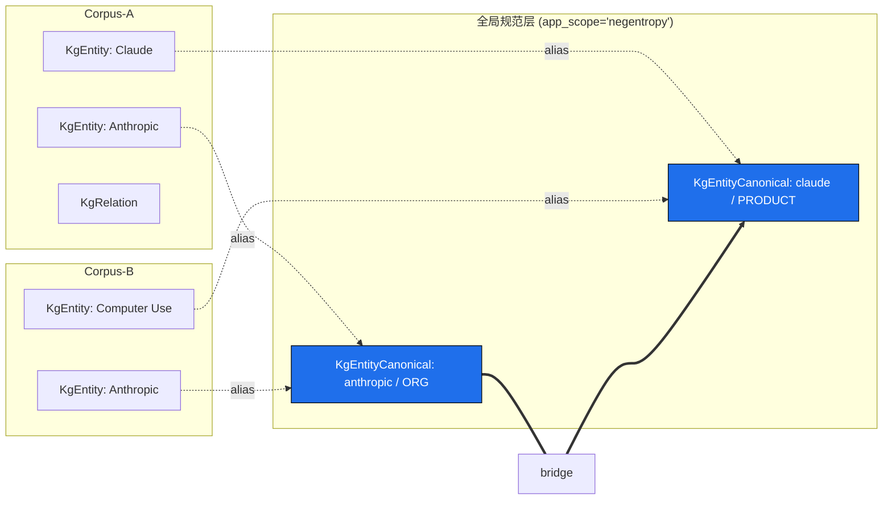
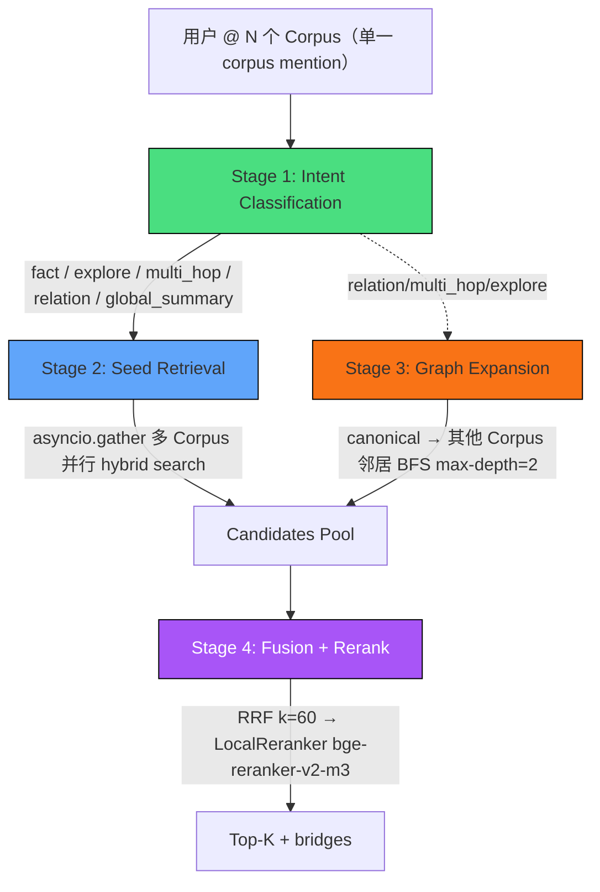

# 联邦知识图谱（Federated KG）+ 跨 Corpus 混合检索

> **状态**：PR1–PR4 一次性落地（2026-05-17）
> **作者**：Cross-Corpus KG 工作组
> **关联代码**：`apps/negentropy/src/negentropy/db/migrations/versions/0034_kg_federated_canonical.py`,
> `apps/negentropy/src/negentropy/knowledge/graph/canonical_linker.py`,
> `apps/negentropy/src/negentropy/agents/tools/hybrid_planner.py`,
> `apps/negentropy/src/negentropy/agents/tools/perception.py`,
> `apps/negentropy-ui/types/mention.ts`

## 1. 设计动机

Negentropy 知识库的现状（Phase 5/6 后）：

- **单 Corpus 混合检索**完备：pgvector HNSW + tsvector BM25 + DB 原生 `kb_hybrid_search()` / `kb_rrf_search()` + LocalReranker（bge-reranker-v2-m3）。
- **单 Corpus 知识图谱**完备：KgEntity / KgRelation / KgEntityMention + EntityResolver（Fellegi-Sunter 三阶段）+ Leiden 社区 + Community Summarizer。
- **Home Studio `@Corpus` 链路**完备：mention → `forwardedProps.corpus_ids` → state_delta → `search_knowledge_base` 读 `tool_context.state.corpus_ids`。

三大缺口：

1. Home Studio 链路**默认不调用 KG**——仅靠 LLM 自主决定何时调 `search_knowledge_graph_with_papers`。
2. 跨 Corpus 检索 = 逐 Corpus 检索后**简单拼接 + 全局排序**，无跨 Corpus 实体桥接 / 多跳推理。
3. Citation 不带 `corpus_id` 来源标签，多 Corpus 场景用户无法分辨结果来自哪个 Corpus。

## 2. 架构哲学：联邦 vs 物理合并

**结论**：采用 **Federated KG + Global Entity Canonical Layer**（联邦图谱 + 全局实体规范层），不做物理合并。

### 业界设计哲学映射（IEEE）

- [1] D. Edge *et al.*, "From Local to Global: A Graph RAG Approach to Query-Focused Summarization," arXiv:2404.16130, 2024. — **社区分层摘要**思想，应用于 `search_knowledge_graph_global`
- [2] Z. Guo *et al.*, "LightRAG: Simple and Fast Retrieval-Augmented Generation," arXiv:2410.05779, 2024. — **Dual-level（low-level entity / high-level theme）**检索，对应 canonical 层定位
- [3] B. J. Gutiérrez *et al.*, "HippoRAG 2: From RAG to Memory: Non-Parametric Continual Learning," arXiv:2502.14802, 2025. — **PPR + 2-hop 收敛最佳**经验
- [4] B. Chen *et al.*, "PathRAG: Pruning Graph-based RAG with Relational Paths," arXiv:2502.14902, 2024. — 3-hop 起 P@10 显著下降
- [5] I. P. Fellegi and A. B. Sunter, "A Theory for Record Linkage," *J. Amer. Statist. Assoc.*, vol. 64, no. 328, pp. 1183–1210, 1969. — Entity Resolution 三阶段理论基础（已在 `entity_resolver.py` 实现）
- [6] V. A. Traag *et al.*, "From Louvain to Leiden: Guaranteeing well-connected communities," *Scientific Reports*, 2019. — 社区检测算法选型

### 物理合并的三大坑

1. **权限放大攻击面**：当前 `KgEntity` 通过 `UniqueConstraint(corpus_id, canonical_name)` 实现租户隔离最后一闸；物理合并后该闸消失，一旦 SQL 注入或 ORM 误用，整租户数据泄漏。
2. **写入热点 + 重建成本**：N 个 Corpus 的实体写到同一 HNSW 索引，build 阶段并行隔离失效。canonical 层用 `primary_embedding`（centroid）而非 per-mention，索引规模降 5-10×。
3. **类型 / 命名冲突无逃生口**：Corpus-A 的 "Apple"(ORG) 与 Corpus-B 的 "Apple"(FOOD) 在物理合并下必须二选一；canonical 层用 `aliases JSONB` + 多 alias 行天然容纳一对多。

## 3. 数据层

### 表结构（Migration 0034）

| 表                       | 角色                                     | 关键字段                                                                                                                     |
| ------------------------ | ---------------------------------------- | ---------------------------------------------------------------------------------------------------------------------------- |
| `kg_entity_canonical`    | 全局规范实体（按 `app_scope` 隔离）      | `canonical_name_normalized` + `canonical_type` 唯一；`primary_embedding` HNSW；`is_under_review` / `is_stopword_like` 状态位 |
| `kg_entity_alias`        | Corpus-local 实体 → canonical 多对一映射 | `(canonical_id, local_entity_id, corpus_id, app_name, confidence, link_method)`；`UNIQUE(local_entity_id)`                   |
| `kg_cross_corpus_bridge` | 跨 Corpus 显式桥接关系（可选物化）       | `(canonical_source_id, canonical_target_id, bridge_type)` 唯一                                                               |

### 权限红线（三层防御）

1. **入口必填参数**：`UnifiedRetrievalService.search(..., accessible_corpus_ids=...)`，effective = scoped ∩ accessible，空则空返回。
2. **ORM 兜底**：`models/perception.py` 注册 `Session.do_orm_execute` event，对 `KgEntityAlias` 的查询缺 `corpus_id` 过滤时直接 `raise PermissionError`。
3. **canonical 层按 `app_scope` 严格隔离**：Phase 1 不跨 app，唯一约束包含 app_scope。

## 4. 检索编排层：HybridPlanner

### 关键参数

| 配置                             | 默认值 | 说明                                           |
| -------------------------------- | ------ | ---------------------------------------------- |
| `per_corpus_limit`               | 20     | 单 Corpus seed 召回上限                        |
| `pool_cap`                       | 100    | rerank 前总池子上限                            |
| `graph_max_depth`                | 2      | 图扩展跳数（HippoRAG 2 / PathRAG 经验）        |
| `graph_neighbors_per_hop`        | 100    | 单跳实体扩展上限                               |
| `rrf_k`                          | 60     | RRF 平滑常数（业界默认）                       |
| `timeout_seconds`                | 12.0   | 整管线 P99 SLO                                 |
| `canonical_hub_degree_threshold` | 1000   | high-degree hub 跳过阈值（stopword-like 实体） |

### 触发条件

| 用户操作         | 触发 HybridPlanner？                                | Graph Expansion？                    |
| ---------------- | --------------------------------------------------- | ------------------------------------ |
| 不 @ 任何 Corpus | 否（走 legacy 全 Corpus 聚合）                      | —                                    |
| @ 单 Corpus      | 是（仅本 Corpus hybrid）                            | 否                                   |
| @ 多 Corpus      | 是（多 Corpus 并行 hybrid + 自主图扩展决策）        | Intent ∈ {relation, multi_hop,…} 时是 |

> Graph expansion 由 Planner 内部 Intent Classifier + effective corpus 数量自主决策，
> 不再接受前端强制信号；用户只表达「想用哪些 Corpus」。

## 5. 三工具协作

| 工具                                 | 触发场景                                                | 互斥关系                      |
| ------------------------------------ | ------------------------------------------------------- | ----------------------------- |
| `search_knowledge_base`（升级版）    | **默认入口**，所有 chunk 级问题；自动判定是否触发图扩展 | 与 graph_global 互斥          |
| `search_knowledge_graph_global`      | 全局摘要类问题（关键词：主题/概览/总体/核心）           | 与 search_knowledge_base 互斥 |
| `search_knowledge_graph_with_papers` | 论文级反查（agent-papers Corpus）                       | 独立                          |

Agent instruction 在 `apps/negentropy/src/negentropy/agents/faculties/perception.py:52` 明确规则。

## 5.5 Ingest 智能识别（IntentClassifier）

ISSUE-095 把 Composer @ 唤出框收敛为 2 Tab、移除 RUN_FINISHED 强制沉淀链路之后，
沉淀入口由 LLM 根据用户自然语言意图自主触发，形成下述四组件闭环：

| 组件 | 角色 |
| --- | --- |
| `engine/utils/action_intent.py::classify` | 关键词二分类（retrieve / ingest / ambiguous），中英双语，O(N) 正则扫描 |
| `agents/agent.py::_pick_root_model` | before_model_callback 中读 user query → 写入 `state.action_intent_hint` |
| Root Agent instruction「Ingest 意图分流」段 | hint==ingest 且 corpus_ids 非空 → transfer 给 InternalizationFaculty |
| `agents/tools/ingest.py::ingest_to_corpus` | 越权防御 + Approval Gate（HIGH_RISK_TOOLS）+ 失败降级 buffer，复用 `KnowledgeService.ingest_text` |

设计哲学：**「用户只表达意图，系统决定执行路径」**——分类器仅写 hint 不强制路径，
LLM 仍可基于上下文二次决策。多 Corpus 歧义场景由 InternalizationFaculty
instruction 触发反问，避免误写入。Approval Gate 默认 per_tool 拦截写入，受顶部
ApprovalPolicy 控制可切换至 always / never。

参考文献：[Wang24 Self-RAG] / [Rebedea23 NeMo Guardrails] / [LangGraph24 Routing]
（详见末尾参考文献）。

## 6. Citation 来源标注

每条 result 携带：
- `citation_id`（数字）/ `formatted_citation`（IEEE 格式）—— 既有契约
- `corpus_id` / `corpus_label` —— P3 新增，多 Corpus 场景区分来源
- `evidence_type: "primary" | "graph_expanded"` —— P3 新增，标识跨 Corpus 桥接证据

LLM 在 *## 参考文献* 段落中，跨 Corpus 检索时**必须**在 `formatted_citation` 末尾追加 `(from Corpus: {corpus_label})`，并按桥接路径在 *## 跨 Corpus 关联* 段落呈现 `{源 Corpus} → {目标 Corpus}（经实体 X 桥接）`。

## 7. 灰度上线策略

Feature flag：`NE_KNOWLEDGE_FEATURE_FLAGS__ENABLE_CROSS_CORPUS_KG`

| 周次   | 范围                                                 | 验收信号                              |
| ------ | ---------------------------------------------------- | ------------------------------------- |
| Week 1 | 内部 dogfooding（`app_name="negentropy"` allowlist） | canonical 合并率 ≥ 40% auto_string    |
| Week 2 | 单 app 10% 用户（user_id hash）                      | 跨 Corpus 检索 ratio ≥ 15%；P99 ≤ SLO |
| Week 3 | 50% → 100%                                           | Click-through ≥ 0.6× 同 Corpus        |
| Week 4 | `enable_cross_corpus_kg=True` 默认开启               | 性能基准达标；review 队列 < 5%        |

回退路径：feature flag off → `_legacy_search_knowledge_base` 原样保留（永不删）；HybridPlanner 内部任何 Stage 抛异常 → 降级回 legacy，打 `planner_fallback` metric。

## 8. 可观测性指标

| Metric                                               | 目标                           |
| ---------------------------------------------------- | ------------------------------ |
| `canonical_linker.merge_decision` (link_method 分布) | auto_string ≥ 40%，review ≤ 5% |
| `canonical_linker.conflict_queue_depth`              | < 1000                         |
| `retrieval.cross_corpus_expansion_ratio`             | ≥ 15%（Home Studio 多 Corpus） |
| `retrieval.cross_corpus_path_length`                 | P50 1.0-1.3；P99 ≤ 2.0         |
| `retrieval.cross_corpus_clickthrough`                | ≥ 0.6× 同 Corpus               |
| `canonical_linker.build_lag_seconds`                 | P99 ≤ 60s                      |
| `planner_fallback`                                   | < 1%                           |

## 9. 关键风险与权衡

| #   | 风险                                        | 缓解                                                                            |
| --- | ------------------------------------------- | ------------------------------------------------------------------------------- |
| R1  | canonical 合并 FP 污染检索                  | 双阈值（auto 0.88 / review 0.75-0.88）+ manual override                         |
| R2  | 跨 Corpus 检索 P99 延迟膨胀                 | HNSW + 2-hop cap + LRU 缓存 + Deep 档异步流式                                   |
| R3  | canonical 成为权限旁路                      | 三层防御（入口 required 参数 + event hook + app_scope 隔离）                    |
| R4  | 用户预期错位（@ 两 Corpus 看到第三 Corpus） | UI bridges 折叠 + 文案明示「来自跨 Corpus 关联实体扩展」+ `--strict-scope` 开关 |
| R5  | embedding 模型升级时 canonical 失效         | 双写迁移期 4 周 + background scrub job                                          |

## 10. 关联文件 SSOT

| 关注点                  | 文件                                                                                                                                                      |
| ----------------------- | --------------------------------------------------------------------------------------------------------------------------------------------------------- |
| Migration               | `apps/negentropy/src/negentropy/db/migrations/versions/0034_kg_federated_canonical.py`                                                                    |
| ORM 模型 + Event Hook   | `apps/negentropy/src/negentropy/models/perception.py`（末尾）                                                                                             |
| Canonical Linker        | `apps/negentropy/src/negentropy/knowledge/graph/canonical_linker.py`                                                                                      |
| HybridPlanner           | `apps/negentropy/src/negentropy/agents/tools/hybrid_planner.py`                                                                                           |
| 检索工具改造            | `apps/negentropy/src/negentropy/agents/tools/perception.py`（`search_knowledge_base`, `_planner_search_knowledge_base`, `search_knowledge_graph_global`） |
| Agent Instruction       | `apps/negentropy/src/negentropy/agents/faculties/perception.py`                                                                                           |
| 权限注入入口            | `apps/negentropy/src/negentropy/knowledge/retrieval/unified_search.py`                                                                                    |
| Feature Flag            | `apps/negentropy/src/negentropy/config/knowledge.py`（`KnowledgeFeatureFlags`）                                                                           |
| Mention 类型契约        | `packages/agents-chat-core/src/parse/mention-types.ts`（`MentionKind = "agent" \| "corpus"`）                                                            |
| 派生 forwardedProps     | `packages/agents-chat-core/src/parse/mention-parser.ts`（`corpus_ids`，graph 模式由 HybridPlanner 自主决策）                                              |
| BFF state_delta         | `packages/agents-chat-core/src/server/state-delta.ts`                                                                                                     |
| MentionPopover 双 Tab   | `apps/negentropy-ui/components/ui/MentionPopover.tsx`（Agents / Corpus；图标 + Radix Tooltip）                                                            |
| Action Intent Classifier | `apps/negentropy/src/negentropy/engine/utils/action_intent.py`（retrieve / ingest / ambiguous 三态关键词分类） |
| ingest_to_corpus 工具    | `apps/negentropy/src/negentropy/agents/tools/ingest.py`（越权防御 + Approval Gate + 失败降级） |
| Approval 白名单          | `apps/negentropy/src/negentropy/agents/approval.py`（`HIGH_RISK_TOOLS` 含 `ingest_to_corpus`） |
| Root Callback Hint       | `apps/negentropy/src/negentropy/agents/agent.py`（`_pick_root_model` 写 `state.action_intent_hint`） |
| Internalization 接线     | `apps/negentropy/src/negentropy/agents/faculties/internalization.py`（tools 注册 + instruction「Ingest 触发协议」段） |

## 11. 浏览器实机验证清单（P0 必跑）

按 [浏览器验证协议](../../../agents/browser-validation.md) 用 `mcp__chrome_devtools` 复用用户已登录 Chrome：

- [ ] 单 @Corpus → Planner 启用但无 bridges
- [ ] 多 @Corpus + intent=fact → Planner 启用，bridges 可能为空
- [ ] 多 @Corpus + intent=multi_hop → bridges 非空，IEEE citation 含 `(from Corpus: X)`
- [ ] 多 @Corpus + "总体趋势" 关键词 → `global_summary` 意图触发 `search_knowledge_graph_global`
- [ ] feature flag off → 完全回退到 legacy `_legacy_search_knowledge_base`
- [ ] Planner Stage 抛异常（mock embedding 失败）→ 降级到 legacy 不打断 SSE 流

**Ingest 智能识别（ISSUE-095 后续）独立场景**：
- [ ] retrieve（@CorpusA 查询 X）→ `state.action_intent_hint == "retrieve"`，PerceptionFaculty 检索
- [ ] ingest 单 Corpus（沉淀这段到 @CorpusA）→ `hint=="ingest"`，InternalizationFaculty 调 `ingest_to_corpus`，DB `knowledge.metadata->>'captured_by' = 'ingest_intent'` 新行
- [ ] ingest 多 Corpus 歧义（@CorpusA @CorpusB 记一下要点）→ LLM 反问「写到哪个 Corpus」
- [ ] ambiguous（先查再沉淀）→ `hint=="retrieve"` 保守缺省；LLM 二次决策
- [ ] 越权防御（伪造 corpus_id）→ `ingest_to_corpus` 返回 `failed`，error 含「越权」
- [ ] 无 @ Corpus（普通问候）→ `state.action_intent_hint` 不写入，0 回归

## 12. 不在本次范围（明确排除）

- ❌ 跨 app（workspace federation）canonical 合并（schema 已预留 `app_scope`，Phase 2 再开）
- ❌ Apache AGE / Neo4j 切换（保持 PostgreSQL + NetworkX）
- ❌ 中文 tsvector 分词（仍为英文）
- ❌ 多模态 embedding（仅 1536d 文本）
- ❌ PostgreSQL RLS（Phase 2 加固选项）

## 参考文献（IEEE 格式）

[Wang24] J. Wang, Z. Chen, R. Pasunuru et al., "Self-RAG: Learning to Retrieve,
Generate, and Critique through Self-Reflection," in *Proc. International
Conference on Learning Representations (ICLR)*, 2024.

[Rebedea23] T. Rebedea, R. Dinu, M. Sreedhar, C. Parisien, and J. Cohen,
"NeMo Guardrails: A Toolkit for Controllable and Safe LLM Applications with
Programmable Rails," in *Proc. EMNLP System Demos*, 2023, pp. 431-445.

[LangGraph24] LangChain AI, "LangGraph: Conditional Routing and Stateful
Multi-Actor Workflows," LangGraph Documentation, 2024-2025. [Online].
Available: https://langchain-ai.github.io/langgraph/
