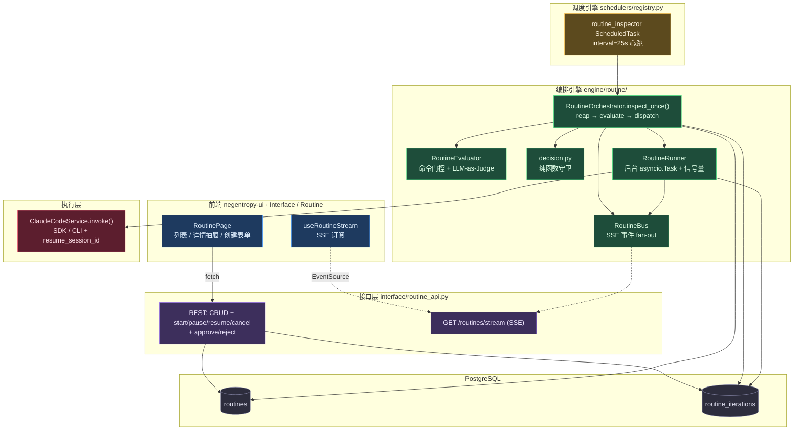
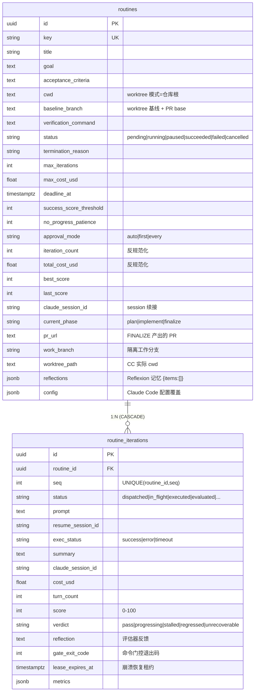
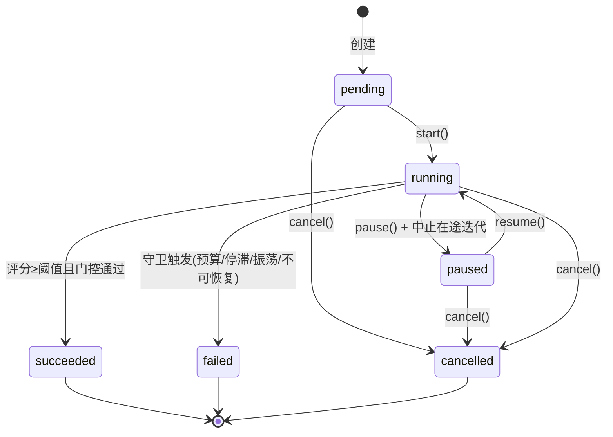
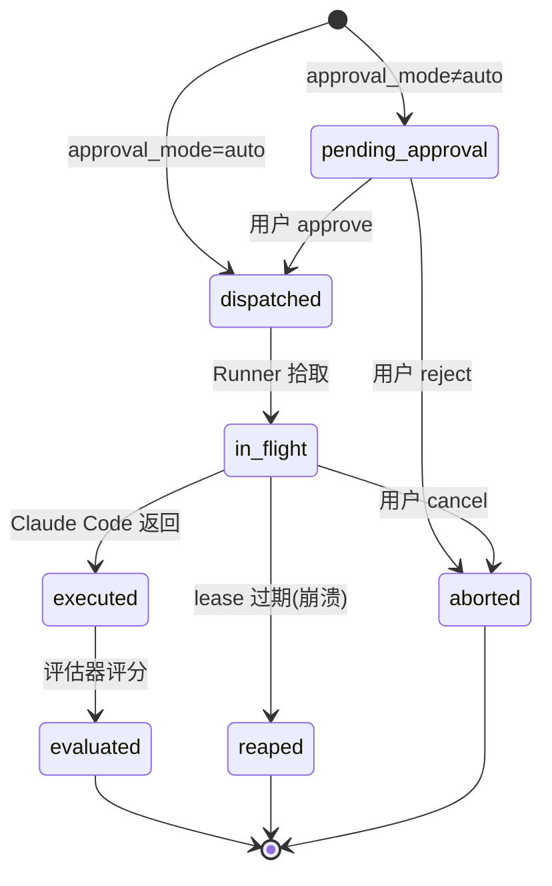
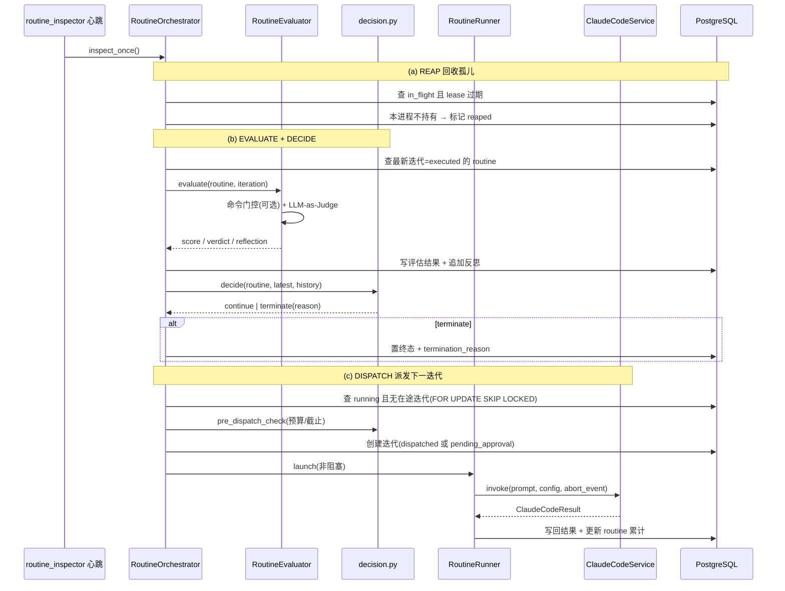
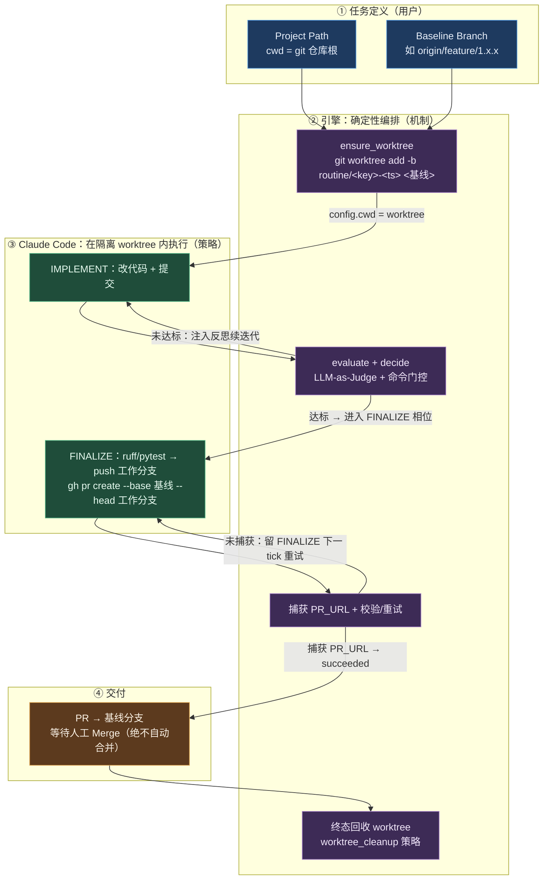

# The Routine System：长周期自主任务架构设计

> 「持续自迭代自主决策任务执行」的全生命周期支持。Negentropy Engine 担任 **Orchestrator + Evaluator**，Claude Code 担任 **Executor**，构成 Evaluator-Optimizer 闭环（结合 Reflexion 跨迭代反思记忆）。
>
> - 理论与工程调研：[Routine Agent 迭代模式调研](../research/110-routine-agent-iteration.md)
> - Claude Code 接入：[Claude Code 集成设计](./038-claude-code-integration.md)
> - 心跳调度引擎：[Framework](./framework.md)

---

## 1. 设计动机

单次 Agent 调用在长周期任务上存在结构性缺陷：无法根据中间产出自我纠偏、缺乏跨轮次的失败记忆、没有客观的完成度判定与预算护栏。Routine 把这一空白补齐为一个**闭环控制系统**：

1. 用户提交一个长任务（目标 + 验收标准 + 预算）；
2. Engine 将目标派发给 Claude Code 执行，记录阶段性结果（摘要 / session_id / 成本 / 轮数）；
3. Engine 用 **LLM-as-Judge + 可选命令门控** 评估结果，产出评分（0-100）、verdict 与自然语言反思；
4. Engine **自主决策**：继续迭代（再次调度 Claude Code，复用其 session 并注入累积反思）或终止（成功 / 不可恢复 / 预算耗尽）；
5. 如此反复，直至取得满意结果或触发终止信号。

**核心原则**：编排与执行职责分离——Engine 决策「做什么 / 是否继续」，Claude Code 决策「怎么做」；所有护栏在 Engine 代码层硬编码强制，不依赖模型自律。

## 2. 架构总览

**关键架构决策：心跳 Inspector + 后台 Runner**。Routine 不为每个任务起一个独立调度任务，而是用**单个** `routine_inspector` 心跳任务（复用统一调度引擎）周期性调用 `inspect_once()`；`inspect_once()` 只做轻量决策（DB 读写 + 后台任务调度），真正长耗时的 Claude Code 执行交由进程内 `asyncio.Task` 后台 Runner 异步完成。这样心跳 tick 始终远低于其超时阈值，且评估—决策—执行三阶段得以解耦。

> **否决方案**：「每 Routine 一个 backing ScheduledTask」。原因：① 调度引擎默认 lease（120s）短于 Claude Code 执行时长（可达 300s+），会导致重复派发；② Execute+Evaluate+Decide 三阶段无法优雅塞入单次 handler；③ Routine 是事件驱动（评估完立即再派发），非 wall-clock 定时。

## 3. 数据模型

- **`routines`**：长周期任务注册源。`reflections` JSONB 存累积反思（Reflexion episodic memory）；`config` 存 Claude Code 配置覆盖（model / max_turns / allowed_tools 等）；`iteration_count` / `total_cost_usd` / `best_score` 反规范化以加速守卫判定。
- **`routine_iterations`**：单次 Execute→Evaluate→Decide 周期的 append-mostly 事实表。`lease_expires_at` 为后台 Runner 的崩溃恢复租约；`UNIQUE(routine_id, seq)` 为并发派发的硬幂等兜底。

- **隔离 worktree 字段**：`current_phase` / `pr_url`（相位机与 PR 产出，迁移 0049）与 `baseline_branch` / `work_branch` / `worktree_path`（迁移 0054）共同支撑「基于基线分支的隔离工作区 + PR 回基线」——详见 [§6](#6-隔离-worktree-与-pr-回基线基于基线分支)。

模型定义：[`models/routine.py`](../../apps/negentropy/src/negentropy/models/routine.py)；建表与种子迁移：[`0048_routine_tables.py`](../../apps/negentropy/src/negentropy/db/migrations/versions/0048_routine_tables.py)；隔离 worktree 三列迁移：[`0054_routine_worktree.py`](../../apps/negentropy/src/negentropy/db/migrations/versions/0054_routine_worktree.py)。

## 4. 生命周期状态机

### 4.1 Routine 状态机

### 4.2 迭代状态机（含审批门控）

**Human-in-the-Loop**：`approval_mode` 决定迭代初始状态——`auto` 全自动（直接 `dispatched`）；`first` 仅首迭代需审批；`every` 每迭代需审批。`pending_approval` 的迭代不会被 Runner 拾取，等待 API `approve` 转 `dispatched` 后才执行。

## 5. 编排循环 `inspect_once()`

每次心跳 tick 执行三阶段（顺序：先回收、再评估、后派发）：

模块布局（[`engine/routine/`](../../apps/negentropy/src/negentropy/engine/routine/)）：

| 模块 | 职责 |
|------|------|
| `orchestrator.py` | `inspect_once()` 主控制循环（reap / evaluate / dispatch） |
| `runner.py` | 进程内后台执行器注册表 + 全局并发信号量；非阻塞调用 ClaudeCodeService |
| `evaluator.py` | LLM-as-Judge + 命令门控，产出 score / verdict / reflection |
| `decision.py` | 纯函数守卫与决策（可单元测试，无 IO） |
| `prompt_builder.py` | 构建含目标 + 验收标准 + 累积反思的 prompt（Reflexion 注入） |
| `bus.py` | RoutineBus，SSE 事件 fan-out |

## 6. 隔离 Worktree 与 PR 回基线（基于基线分支）

### 6.1 动机与契约

Routine 此前直接在 `cwd` 的**当前 checkout** 上工作——既可能污染用户正在使用的分支（甚至 `master`/`main`），也缺乏「基于某基线分支建隔离工作区 → 工作 → 以 PR 回基线」的标准化交付流水线。为此，每个可执行 Routine 的定义至少携带两个参数：

- **Project Path**（复用 `cwd` 列）：用户指定的 git 仓库根。worktree 模式下 `cwd` 仅作派生源，**不**作为 Claude Code 的实际工作目录。
- **Baseline Branch**（`baseline_branch`）：隔离 worktree 的基线分支与 PR base（如 `origin/feature/1.x.x`）。**非空即启用** worktree 隔离与通用 FINALIZE/PR（判定式 `phase.is_worktree_routine`）。

> **执行硬前提**：`start` 守卫要求 `cwd` + `baseline_branch` 齐备并校验仓库/基线可用，否则拒绝启动（保护未回填的旧行）。`create` 在二者提供时即时校验（早反馈），允许先创建草稿；前端创建可执行 routine 时已强制二者。

### 6.2 职责分工：引擎确定性编排，CC 执行

机制（worktree + 工作分支的创建/复用/销毁）由**引擎独占**，绝不交给 LLM；Claude Code 仅在隔离 worktree 内执行改代码/提交/push/建 PR。引擎做决策、协调、调度、**校验与重试**，并计算精确的 base/head 分支名注入 prompt。

### 6.3 worktree 生命周期

- **创建（首个 launch 前）**：`orchestrator._ensure_workspace` 在派发/审批放行的迭代 launch 前调 `workspace.ensure_worktree`——基于 `baseline_branch` 建工作分支 `routine/<key>-<ts>` 与隔离 worktree，并把 `worktree_path` / `work_branch` 写回 routine（同派发事务提交）。`_build_config` 据此把 `config.cwd` 指向 worktree。创建失败（仓库/基线异常）→ 终止该 routine 为 `unrecoverable_error`（诚实终止优于静默挂起）。
- **跨迭代复用**：`ensure_worktree` 幂等——同一 routine 的多轮迭代（含 PLAN→IMPLEMENT→FINALIZE 与反馈重试）复用同一 worktree，靠 `resume_session_id` + 同一工作分支累积 commit。
- **回收（终态）**：`inspect_once` 增 `_reap_workspaces` 步，按 `worktree_cleanup` 策略集中回收终态 routine 的 worktree（`on_success` 仅清 succeeded、failed/cancelled 保留供调试；`always` 清全部；`never` 不清）。`restart`/`delete` 另设即时回收钩子。回收**不**删除已 push 到 origin 的同名分支（PR 依赖之）。

### 6.4 通用 FINALIZE/PR

既然每个 worktree routine 都须把成果以 PR 落到基线，「FINALIZE（push + 建 PR）终止步」由原 `config.workflow=phased` 的 opt-in，**提升为 worktree routine 通用**——IMPLEMENT 命中成功不再直接 `succeeded`，而是推进到 FINALIZE；FINALIZE 捕获 `PR_URL` 后方 `succeeded`（`phase.extract_pr_url` sentinel 优先、裸链兜底）。**PLAN 前置相位仍是 opt-in**（`config.workflow=phased`）。`prompt_builder` 为 worktree routine 注入隔离工作区上下文行（各相位）与 FINALIZE 的具体命令（`git push -u origin <work_branch>`、`gh pr create --base <归一基线> --head <work_branch>`，基线经 `workspace.normalize_base_branch` 剥离 `origin/` 前缀）。

核心模块：[`engine/routine/workspace.py`](../../apps/negentropy/src/negentropy/engine/routine/workspace.py)（git 编排）；判定式 `phase.is_worktree_routine`；集成点见 `orchestrator._ensure_workspace` / `_build_config` / `_reap_workspaces`。

> **凭证前置条件**：引擎宿主需具备 git push 与 `gh` 鉴权（CC 子进程继承宿主环境）；本特性不在代码内处理鉴权。

## 7. 评估管线：混合方案

评估采用 **LLM-as-Judge + 可选命令门控** 的混合方案：

1. **命令门控**（若配置 `verification_command`）：在 routine 工作目录执行测试命令，退出码喂给 Judge prompt 并作为成功的硬约束——门控失败时评分封顶，成功的判定要求 `gate_exit_code == 0`。这是 Codex 式「测试驱动自校验」的客观锚点。
2. **LLM-as-Judge**：复用 `LLMFactExtractor` 的 LLM 调用范式（`resolve_model_config_async("routine.evaluate")` + `litellm.acompletion` 结构化 JSON 输出 + 指数退避重试），`temperature=0` 保证确定性，输出 `{score, verdict, reflection}`。

**偏差治理**：客观门控锚定评分以缓解 LLM 评审的 verbosity / self-preference 偏差；score 与 verdict 解耦，使停滞检测在绝对分数漂移时仍可依趋势判定。详见[调研 §3](../research/110-routine-agent-iteration.md)。

## 8. 停止准则与护栏

全部在 `decision.py` 中以**纯函数**实现，硬编码强制（非模型自律）：

| 守卫 | 触发条件 | termination_reason |
|------|---------|--------------------|
| 成功 | `score ≥ success_score_threshold` 且门控通过 | `success` |
| 迭代上限 | `iteration_count ≥ max_iterations` | `max_iterations` |
| 成本熔断 | `total_cost_usd ≥ max_cost_usd` | `max_cost` |
| 截止时间 | `now ≥ deadline_at` | `deadline` |
| 进度停滞 | 最近 N 次评分均未超历史最优 | `no_progress` |
| 振荡 | 评分无净增长且 verdict 反复横跳 | `oscillation` |
| 不可恢复 | judge 判 unrecoverable / 连续执行失败 / 连续评估失败 | `unrecoverable_error` |

**崩溃恢复**：进程内 Runner 非崩溃安全，由 Reaper 兜底——迭代携带 `lease_expires_at`（= 执行超时 + slack），进程重启后孤儿在途迭代被标记 `reaped`，下一 tick 重新派发并复用 `claude_session_id` 续接。

## 9. 配置

配置源：[`config/routine.py`](../../apps/negentropy/src/negentropy/config/routine.py)（`RoutineSettings`，env 前缀 `NE_ROUTINE_`，YAML 节点 `routine:`，默认值见 `config.default.yaml`）。

| 配置项 | 默认 | 说明 |
|--------|------|------|
| `enabled` | `false` | 灰度开关；关闭时心跳 no-op |
| `inspector_interval_seconds` | `25` | 心跳 tick 间隔 |
| `max_concurrent_executions` | `2` | 全局并发 Claude Code 执行上限 |
| `lease_slack_seconds` | `60` | Runner 租约宽裕量 |
| `gate_timeout_seconds` | `120` | 命令门控执行超时 |
| `max_reflections_injected` | `5` | 注入 prompt 的最近反思条数 |
| `eval_failure_patience` | `3` | 评估连续失败容忍次数 |
| `default_max_iterations` | `20` | 创建默认迭代上限 |
| `default_max_cost_usd` | `5.0` | 创建默认成本熔断 |
| `evaluator_model` | `null` | 评估器模型覆盖（走 `routine.evaluate` task slot 解析） |
| `worktree_root` | `null` | 隔离 worktree 根目录；`null` → 仓库同级 `<parent>/.negentropy-worktrees` |
| `worktree_cleanup` | `on_success` | 终态回收策略：`on_success`（成功即清）\| `always` \| `never` |
| `git_remote` | `origin` | fetch / PR base 归一所用 git 远端名 |
| `git_fetch_before_worktree` | `true` | 建 worktree 前 best-effort `git fetch`（失败不阻断） |
| `git_timeout_seconds` | `120` | 单条 git 子命令执行超时 |

评估器模型可在 Interface / Task Models 页为 `routine.evaluate` 槽位单独绑定。

## 10. API 与前端

REST 端点（[`interface/routine_api.py`](../../apps/negentropy/src/negentropy/interface/routine_api.py)，prefix `/routines`）：

| 方法 | 路径 | 说明 |
|------|------|------|
| GET | `/routines` · `/routines/{id}` · `/routines/{id}/iterations` · `/routines/kpis` | 查询 |
| POST | `/routines` · PUT/DELETE `/routines/{id}` | CRUD |
| POST | `/routines/{id}/{start\|pause\|resume\|cancel}` | 控制 |
| POST | `/routines/{id}/iterations/{iid}/{approve\|reject}` | 审批门控 |
| GET | `/routines/stream` | SSE 实时事件（routine + iteration） |

前端位于 [`app/interface/routine/`](../../apps/negentropy-ui/app/interface/routine/)：列表 + KPI + 过滤 + 创建/编辑表单 + 详情抽屉（迭代时间线 + 评分趋势 + 控制按钮 + 审批操作）。导航在 `InterfaceNav.tsx` 的 Scheduler 之后新增 Routine 二级菜单。SSE 实时更新经 `useRoutineStream` 订阅 `/api/routine/stream`。

## 11. 涟漪效应与边界

- **对调度引擎**：仅新增一个种子 ScheduledTask（`routine_inspector`），复用既有心跳与 SSE 范式，零侵入。
- **对 Claude Code**：仅作为 `ClaudeCodeService.invoke()` 的调用方，复用既有 SDK/CLI 双路径与 `resume_session_id` 能力。
- **对 git / 文件系统**：隔离 worktree 在仓库同级目录创建（默认），需可写且与仓库同文件系统；终态按策略回收。引擎宿主须具备 git push 与 `gh` 鉴权（CC 子进程继承），本特性不在代码内处理鉴权。
- **行锁内 git I/O**：worktree ensure 在持有 routine 行锁的派发事务内进行（单引擎串行 tick 下无争用，仅延长首轮事务，有超时）。多引擎部署需改为「先建 worktree 提交、再锁行派发」两阶段。
- **单进程假设**：进程内 Runner 注册表要求单 engine 进程持有 Routine 编排（与调度引擎同进程同 loop）。DB 层 `FOR UPDATE SKIP LOCKED` + 每 routine 单在途 + 唯一约束为多并发 tick 的硬幂等兜底。
- **灰度与过渡**：`routine.enabled=false` 默认关闭；未回填 `baseline_branch` 的旧行退回扁平终止语义并被 `start` 守卫拦截，须经 PUT 补齐后方可启动。
