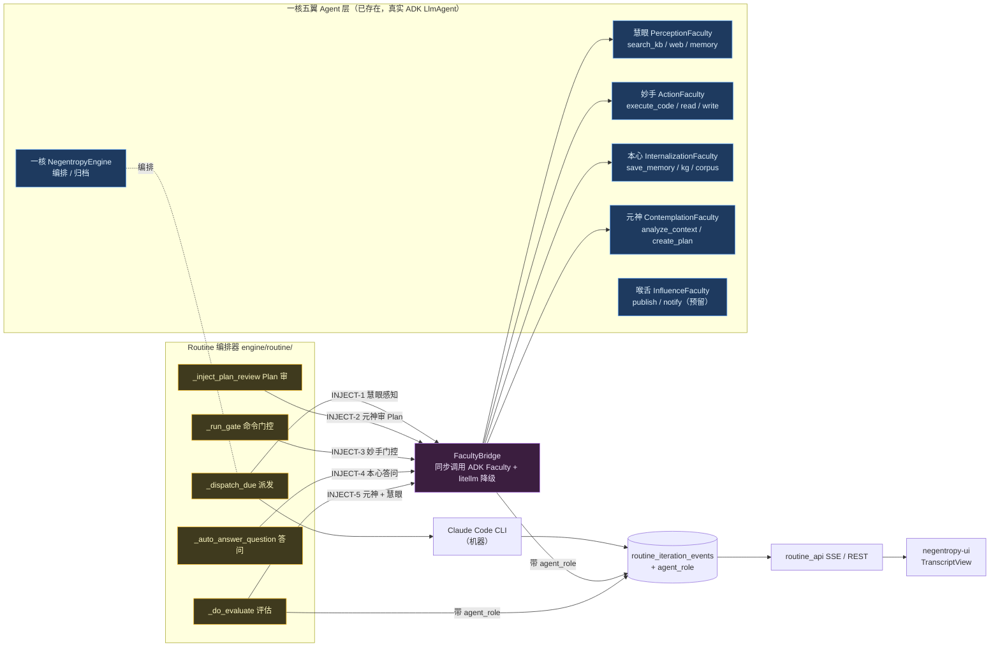

# Routine 多 Agent 归因：一核五翼 Faculty 接入 Routine 编排链

> Routine 任务的本质是**一核五翼 6 个 Agent（「人」）调用 Claude Code / Codex（「智能的机器」）**完成持续性任务。本文记录将 5 翼 Faculty 真正引入 Routine 编排链、使「人机交互」中「人」侧动作由真实 Agent 产出并归因的架构决策（ADR）。
>
> - 前置：[Claude Code 集成设计](./038-claude-code-integration.md) · [The Routine System](./039-the-routine-system.md)
> - 理论：[Routine Agent 迭代模式调研](../research/110-routine-agent-iteration.md)

---

## 1. 背景与问题

[Routine 系统](./039-the-routine-system.md) 当前是 **Negentropy Engine → Claude Code 单向链**：Engine 担任统一 Orchestrator + Evaluator，Claude Code 担任 Executor。这一设计在「编排/执行职责分离」上是自洽的，但与项目「一核五翼」的认知模型存在**语义鸿沟**：

- **一核五翼是真实存在的 6 个 ADK `LlmAgent`**（`agents/agent.py` 的 `NegentropyEngine` + `agents/faculties/*.py` 的慧眼/妙手/本心/元神/喉舌），各有独立 LLM、工具链与 instruction。
- **但它们与 Routine 编排器完全正交、零交集**：Routine 不经过 ADK Agent，所有「人」侧动作（审 Plan / 答问 / 命令门控 / 评估）均由单一 Routine Engine LLM（裸 `litellm.acompletion` 直调）产出。

这导致 Routine / Iterations 的 Full View 中，「人机交互」里的「人」是一个**虚假的单一 Engine 人格**——无法呈现「6 个 Agent 作为 6 个角色，分别调用 Claude Code 这台『智能的机器』」的真实协作图景。

**目标**：让 Routine 迭代事件流中「人」侧的每一个动作，由语义匹配的真实 Faculty Agent 产出并归因（`agent_role`），使 Full View 正确呈现 6 Agent ↔ Claude Code 的完整人机交互。

---

## 2. 目标架构

核心改造：在 Routine 编排器的 5 个注入点，通过新建 **FacultyBridge** 同步调用现有 ADK Faculty Agent，产出的事件携带 `agent_role` 归因；保留现有 `litellm.acompletion` 直调作降级。前端从「事件类型推导角色」平滑切换到「读后端 `agent_role`」。

---

## 3. 决策：采用「复用 ADK Faculty Agent」（路径 A）

在三条可行路径中权衡：

| 维度 | 路径 A 复用 ADK Faculty（采纳） | 路径 B prompt 替换 | 路径 C 新建调度框架 |
|---|---|---|---|
| 真实多 Agent 能力 | ✅ 含工具链（知识检索 / 记忆 / 执行） | ❌ 仅裸 LLM 身份 | ✅ |
| 与一核五翼架构一致 | ✅ | ❌ 浅归因 | ✅ |
| 工作量 | 中（3-4 周） | 小（1-2 周） | 大（4-6 周） |
| 风险 | ADK 异步适配 + 降级 | 归因失真 | 复杂度高 |

**决策理由**：5 翼 Faculty 已是完整可运行的 ADK Agent（沉没成本已支付），直接调用即可获得**真正的多 Agent 能力**（含各 Faculty 的工具链），且与一核五翼的 ADK 架构语义一致，归因真实可信。路径 B 仅是身份贴标、归因失真；路径 C 重复造调度轮子。路径 B 的「裸 LLM 直调」恰好作为路径 A 的**降级回退**（Faculty 不可用时），二者天然互补。

---

## 4. Faculty ↔ 注入点 ↔ 归因映射

语义映射依据各 Faculty 的真实工具能力与职责定位（慧眼=感知、妙手=行动、本心=内化、元神=思辨、喉舌=影响）：

| 注入点 | 代码位置 | Faculty | 产出 event_type | agent_role |
|---|---|---|---|---|
| INJECT-1 派发前感知 | `orchestrator._dispatch_due` build_prompt | 慧眼 PerceptionFaculty | `perception`（新） | `perception` |
| INJECT-2 Plan 审 | `runner._inject_plan_review_events` + `plan_reviewer.py` | 元神 ContemplationFaculty | `plan_review` | `contemplation` |
| INJECT-3 命令门控 | `evaluator._run_gate` | 妙手 ActionFaculty | `gate` | `action` |
| INJECT-4 答问 | `service._auto_answer_question` | 本心 InternalizationFaculty | `auto_answer`（提级为新 event_type） | `internalization` |
| INJECT-5 评估 | `orchestrator._do_evaluate` + `evaluator.py` | 元神 + 慧眼 | `evaluation` | `contemplation` |
| 编排 / 归档 | `orchestrator` | 一核 Engine | `result` / 状态翻转 | `engine` |
| CC 执行 | `service`（不变） | —（机器） | `assistant` / `tool_use` / `tool_result` / `system` | `claude_code`（或 NULL） |
| 对外发布（未来） | — | 喉舌 InfluenceFaculty | — | `influence`（预留） |

> 慧眼（派发前感知为 stretch）与喉舌（对外发布场景尚未进入 Routine 回合）在当前回合中可能不登场——这是预期的：五翼不必每次迭代全员出场，统计仅显示真正参与的角色。

---

## 5. agent_role 契约（前后端单一事实源）

- **枚举**（与前端 `features/routine/agent-role.ts` 的 `AgentRole` 完全对齐）：
  `engine | claude_code | perception | action | internalization | contemplation | influence`
- **落点**：`routine_iteration_events.agent_role`，类型 `VARCHAR(32)`，`NULL` 默认（CC 自身动作可为 NULL 或 `claude_code`）。
- **写入**：见 §6 各注入点；DTO `routine_api._serialize_event` 无白名单透传，零改动。
- **前端切换**：归一化层单点读取 `ev.agent_role ?? deriveHumanRole(action)`——后端字段缺失时回退前端语义推导（演进式平滑切换，下游零扩散）。

---

## 6. FacultyBridge 与注入点实现

### 6.1 FacultyBridge（`engine/routine/faculty_bridge.py`）

封装「Routine 编排器内同步调用 ADK Faculty Agent」：

- 输入 `(faculty_agent, task_prompt, state_context, timeout)` → 用 ADK `Runner` 同步驱动对应 Faculty 单例（`perception_agent` / `contemplation_agent` / …，均 `mode="single_turn"`）。
- 输出结构化结果（verdict / score / feedback / answer 等）+ `agent_role`。
- **降级**：超时 / 异常 → 回退 `litellm.acompletion`（复用 `resolve_model_config_async`），`agent_role` 标前端推导值或 NULL，保证 Routine 不因 Faculty 不可用而中断。

> ⚠️ ADK 调用是 async，需 `asyncio` 适配 Routine 编排段；**严禁在单 worker 事件循环里同步阻塞**（用 `asyncio.to_thread` 或确保在 async 上下文执行），否则会冻结全站。

### 6.2 注入点接线（按风险从低到高）

1. **INJECT-2 元神审 Plan**：`plan_reviewer.PlanReviewer._judge` → 改走 FacultyBridge(元神)；`runner._inject_plan_review_events` 写 `agent_role="contemplation"`。
2. **INJECT-4 本心答问**：`service._auto_answer_question` → FacultyBridge(本心)；同时把 `auto_answer` 提级为独立 `event_type`（`_normalize_stream_event` 加显式分支），并**去掉 answer 的 500 字截断**（完整回答持久化）；写 `agent_role="internalization"`。
3. **INJECT-3 妙手门控**：`evaluator._run_gate` 前 / 后 → FacultyBridge(妙手) 做命令安全审查；`gate` 事件 `agent_role="action"`。
4. **INJECT-5 评估**：`orchestrator._persist_eval_events` evaluation → 元神反思 + 慧眼事实核查；`agent_role="contemplation"`。
5. **INJECT-1 慧眼感知（stretch）**：`orchestrator._dispatch_due` build_prompt 前 → FacultyBridge(慧眼) 检索知识库注入 prompt；新增 `perception` 事件 `agent_role="perception"`。

---

## 7. 分阶段路线图

| 阶段 | 目标 | 是否动后端 | 交付价值 | 状态 |
|---|---|---|---|---|
| **Phase 0** | 本 ADR + agent_role 契约 | 否（文档） | 决策固化 | ✅ 已落地 |
| **Phase 1** | 前端人机回合渲染（6 Agent 投射 + CC 提交/人应答 + Conductor pending 卡片/折叠） | 否 | Full View 立即呈现完整人机交互 | ✅ 已落地 |
| **Phase 2** | 后端真实多 Agent（agent_role 字段 + FacultyBridge + 注入点 + auto_answer 提级） | 是（migration 0078） | Faculty 真实产出事件并归因 | ✅ 已落地 |
| **Phase 3** | 完整 Conductor 镜像打磨（状态指示 / CSS 动画 / 子 Agent 嵌套 / diff） | 否 | 全套微交互对齐 | ✅ 已落地 |

**演进式策略**：Phase 1 用前端语义投射先交付可见价值（前端 only、独立可验证），Phase 2 让归因变真实，Phase 3 补齐视觉。前端归一化层的 `ev.agent_role ?? deriveHumanRole(action)` 是 Phase 1→2 的平滑切换支点。

**Phase 2 落地范围与边界**（诚实记录）：
- **agent_role 归因**：始终生效（无开关）。`plan_review`→元神、`auto_answer`(generic)→本心、`auto_answer`(ExitPlanMode)→元神、`gate`→妙手、`evaluation`→元神；CC 自身动作（assistant/tool_use/tool_result/result）留 NULL，前端回退 `deriveHumanRole` 推导。
- **FacultyBridge 真实调用**：已接入 **INJECT-2（PlanReviewer._judge，元神）** 与 **INJECT-5（RoutineEvaluator._judge，元神）**，由 `faculty_bridge_enabled` 控制（默认关，失败/超时降级 litellm）。
- **本轮未接 FacultyBridge 真实调用**：INJECT-3（gate 妙手命令审查——涉改 subprocess 执行语义）与 INJECT-4（auto_answer 本心——reader 段写 stdin 时序敏感）仅做 agent_role 归因；INJECT-1（慧眼派发前感知）为 stretch，未改派发热路径。三者的真实 Faculty 介入留作后续增量（数据归因已就位，渲染层无需再改）。
- **auto_answer 去截断**：构造端补 `answer` 全文字段（保留 `answer_preview` 兼容旧渲染），归一化提级为独立 `event_type="auto_answer"`。

---

## 8. 风险与回滚

1. **FacultyBridge 异步阻塞单 worker**（Phase 2）：必须 async 适配 + `asyncio.to_thread`，勿同步阻塞事件循环。
2. **ADK Faculty 调用失败**：降级 litellm 直调，Routine 不中断；`agent_role` 回退前端推导。
3. **DB migration**：纯加 nullable 列，不删数据；回滚即 drop column（空列无数据风险）。
4. **hook 模式 vs clean 模式**：Plan 审在 PreToolUse hook 模式下应答为裸 `plan_review`（无 tool_use_id），前端用「就近 seq 配对」处理，归因不受影响。

---

## 9. 视觉对齐参考（Conductor）

「人机交互」的展示效果对齐 Conductor.app（其 CC ↔ 人交互为业界范本）：3 种 pending 卡片（Review plan / Answer question / tool approval）、✔/✗ 审批徽标、连续 ≥3 工具折叠 summary、角色色 + 头像区分发言人。negentropy-ui 的设计系统已较成熟，对齐为「范式对齐」而非照搬。详见 Phase 3。
