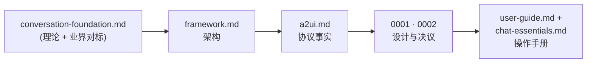
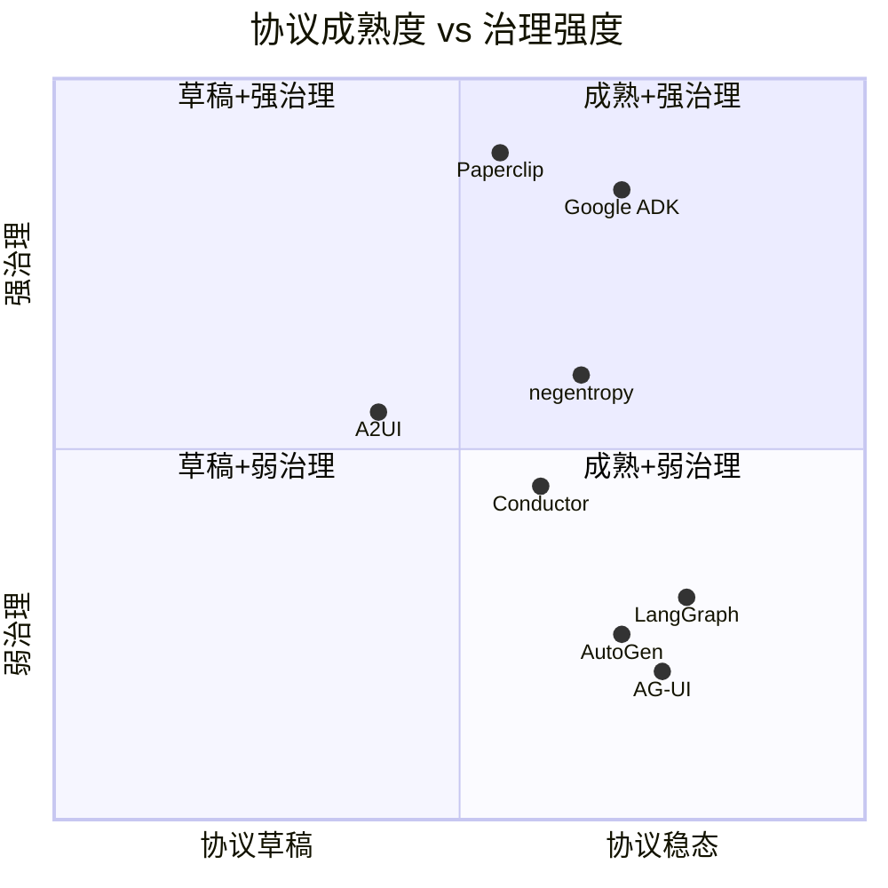

# Conversation Foundation · 人与 Agent 对话基础

> 本文档是 negentropy「Home / 人与 Agent 对话」系列的**理论总章**与**业界对标坐标**。所有具体落地方案与协议事实分别沉淀于 [framework.md](./framework.md)（架构）、[a2ui.md](./a2ui.md)（协议）、[rfc-0001](./0001-conversation-architecture-refactor.md) / [rfc-0002](./0002-ui-interaction-enhancements.md)（设计），以及 [user-guide.md](../user-guide.md) 与 [user-guide/chat-essentials.md](../user-guide/chat-essentials.md)（操作手册）。

## 0. 如何阅读本系列（Single Source of Truth 映射）

每一层只负责一层，互相之间用相对路径链接，禁止内容复制（参见 AGENTS.md "Direct Hyperlinking" 与 "Single Source of Truth"）。

---

## 1. 对话式 Agent 范式（Conversational Agent Paradigms）

### 1.1 范式综述

近三年学术界与工业界对"对话式 Agent"的范式收敛到了 **Plan-Act-Observe** 三段式循环（PAO）[[1]](#ref1)，并在此之上叠加自我反思（Reflexion[[2]](#ref2)）、树搜索（LATS[[3]](#ref3)）、计划-求解（Plan-and-Solve[[4]](#ref4)）等扩展。它们的共同前提是：**LLM 作为认知核心**，工具/记忆/检索作为外部能力，对话流作为时序状态机。

### 1.2 negentropy 的对应

negentropy 把 PAO 演化为「**一核五翼**」（PerceptionFaculty / InternalizationFaculty / ContemplationFaculty / ActionFaculty / InfluenceFaculty）协调模型，根 Agent 负责调度系部，系部负责具体能力（参见 `apps/negentropy/src/negentropy/agents/agent.py`）。这与 ReAct 的"Reason → Act"双相、Reflexion 的"act → reflect"循环相比，多了一层**正交分解**（系部即正交概念主体），在工程上把"机制"（调度）与"策略"（系部内部 LLM）解耦。

### 1.3 关键引用

[1] S. Yao et al., "ReAct: Synergizing Reasoning and Acting in Language Models," in *Proc. ICLR*, 2023, arXiv:2210.03629.
[2] N. Shinn et al., "Reflexion: Language agents with verbal reinforcement learning," in *Proc. NeurIPS*, 2023, arXiv:2303.11366.
[3] A. Zhou et al., "Language Agent Tree Search Unifies Reasoning, Acting, and Planning in Language Models," in *Proc. ICML*, 2024, arXiv:2310.04406.
[4] L. Wang et al., "Plan-and-Solve Prompting: Improving Zero-Shot Chain-of-Thought Reasoning by Large Language Models," in *Proc. ACL*, 2023, arXiv:2305.04091.

---

## 2. 流式 UI 协议（Streaming UI Protocols）

### 2.1 协议谱系

| 协议                         | 提出方                | 关键设计点                                           | negentropy 对齐情况                                                        |
| ---------------------------- | --------------------- | ---------------------------------------------------- | -------------------------------------------------------------------------- |
| **AG-UI**                    | CopilotKit (2024)     | 16 标准事件 / state delta 旁路 / generative UI       | ✅ 主信道。事件流经 `@ag-ui/client` `HttpAgent` 接入                        |
| **A2UI**                     | Google (2025)         | 双工 ChannelMap / A2A delegation / UI Component Tree | 🟡 ConversationNode 数据模型借鉴；Sub-Agent 嵌套卡片在 RFC 0002 §4.2 待落地 |
| **OpenAI Assistants Stream** | OpenAI (2024)         | thread + run + step + delta 四级事件                 | ❌ 未直接采用                                                               |
| **LangGraph events**         | LangChain (2024-2025) | StateGraph 中断 / 时间穿梭重放                       | 🟡 Run 终态 hydration 借鉴；中断门 RFC 0002 §4.4                            |

### 2.2 设计教训

- **"事件流要稀疏"**：progress 应按里程碑稀疏推送，并走 state-delta 旁路而非 message ledger（避免双气泡风险）。高频细粒度事件会挤占渲染帧预算，导致 UI 卡顿而非流畅体验。
- **"读模型与写模型分离"**：CQRS 思想[[5]](#ref5)将 server→client 与 client→server 分成不同 surface，避免事件回环。negentropy 的 `state.tool_progress` 旁路是同思想的轻量实现；A2UI 的 ChannelMap[[6]](#ref6)也遵循此模式。

### 2.3 关键引用

[5] G. Hohpe and B. Woolf, *Enterprise Integration Patterns*. Boston, MA, USA: Addison-Wesley, 2003.
[6] Google, "Agent-to-User Interface (A2UI) Concepts," 2025. [Online]. Available: https://adk.dev/

---

## 3. 业界框架对标（Industry Framework Benchmark）

| 框架               | 流式协议                                    | 治理                                   | Reasoning 可视化                       | KG 集成            | Eval        |
| ------------------ | ------------------------------------------- | -------------------------------------- | -------------------------------------- | ------------------ | ----------- |
| AG-UI / CopilotKit | ✅ 标准 16 事件                              | ❌ 无                                   | 🟡 自定义                               | ❌                  | ❌           |
| A2UI               | ✅ ChannelMap                                | 🟡 计划中                               | ✅ Component Tree                       | ❌                  | ❌           |
| Google ADK         | 🟡 SSE                                       | ✅ Eval harness                         | 🟡 step 事件                            | 🟡 Vertex AI Search | ✅           |
| Claude Code        | 🟡 stdin/stdout                              | ❌                                      | 🟡 thinking 块                          | ❌                  | ❌           |
| Paperclip          | 🟡 控制平面                                  | ✅ governance                           | 🟡 任务图                               | ❌                  | 🟡           |
| Conductor          | ✅ workspace diff                            | 🟡 plan mode                            | ❌                                      | ❌                  | ❌           |
| LangGraph          | ✅ StateGraph events                         | ❌                                      | 🟡 时间穿梭                             | 🟡 Neo4j 适配器     | 🟡 LangSmith |
| AutoGen v0.4       | ✅ multi-agent group chat                    | ❌                                      | ❌                                      | ❌                  | ❌           |
| Semantic Kernel    | 🟡 IAsyncEnumerable                          | ❌                                      | ❌                                      | 🟡 Memory connector | ❌           |
| **negentropy**     | ✅ AG-UI 16 事件 + Sub-Agent Transfer 可视化 | 🟡 Approval Gate（已接入 ingest_paper） | ✅ Reasoning Panel + Sub-Agent 嵌套卡片 | ✅ KG + 向量混合    | 🟡 Langfuse  |

**2026-05-10 更新**：
- G1 (Sub-Agent Transfer 可视化) 已落地，参考 AutoGen v0.4 GroupChat 嵌套卡片模式
- G2 (对话内搜索) 已落地，参考 ChatGPT / Claude Code 搜索模式
- G3 (Approval Gate 工具接入) 已落地，`ingest_paper` 已接入审批流程 + 前端闭环（ApprovalDialog → BFF → state.approval_responses）
- G4 (Session Summary Preview) Phase A 已落地，SessionList 显示 title + relative time

**negentropy 的取长补短**：
- 已对齐：AG-UI 事件流 + ADK 五翼调度 + LangGraph 中断思想（RFC 0002）+ Sub-Agent Transfer 可视化（G1）+ 对话内搜索（G2）+ Approval Gate 完整闭环（G3）+ Session Preview Phase A（G4）。
- 还可借鉴：A2UI Component Tree（Sub-Agent 嵌套卡片已落地 G1，后续可进一步增强）；LangGraph 时间穿梭（Conversation Branching，RFC 0002 §4.5）；ADK Eval harness（计划在 Phase 3 引入）；MemGPT/Letta 跨 session 记忆（G4 Phase B 需后端支持）。

---

## 4. RAG + 引用机制（Retrieval-Augmented + Citation）

### 4.1 主流路线对比

- **Self-RAG**[[7]](#ref7)：模型自决何时检索 + 自评 retrieval 质量。论文同时强调 **stable citation token** 是把 hallucination 压到可控的关键工程契约。
- **Corrective RAG (CRAG)**[[8]](#ref8)：retrieval 结果质量评估器，质量低时触发 web search 兜底。
- **RAG Survey 2023**[[9]](#ref9)：奠基性综述，定义 retrieval / generation / augmentation 三段。

### 4.2 negentropy 的落点

P2-3（参见本仓库 `apps/negentropy/src/negentropy/agents/tools/perception.py` `_format_citation`）实施 **IEEE 风格 stable citation**：
- 后端：`search_knowledge_base` / `search_knowledge_graph_with_papers` 在每条 result 注入 `citation_id` + `formatted_citation`；
- LLM 指令：在回复中按 `[N]` 引用 + 末尾追加「参考文献」节；
- 前端：`apps/negentropy-ui/utils/citation-parser.ts` 解析 `[N]` token + 渲染尾注 + arXiv 跳转。

### 4.3 关键引用

[7] A. Asai et al., "Self-RAG: Learning to Retrieve, Generate, and Critique through Self-Reflection," in *Proc. ICLR*, 2024, arXiv:2310.11511.
[8] S.-Q. Yan et al., "Corrective Retrieval Augmented Generation," 2024, arXiv:2401.15884.
[9] Y. Gao et al., "Retrieval-Augmented Generation for Large Language Models: A Survey," 2023, arXiv:2312.10997.

---

## 5. 知识图谱增强对话（KG-Augmented RAG）

### 5.1 主流路线

- **GraphRAG**[[10]](#ref10)：本地实体抽取 → 全局社区摘要 → 查询时层级聚合。强调 schema-guided 抽取与增量构建一致性。
- **HybridRAG**[[11]](#ref11)：向量 + 图遍历联合，对长尾问题召回率提升显著。
- **KG-RAG Survey**[[12]](#ref12)：把 KG 引入 RAG 的设计空间总览。

### 5.2 negentropy 的落点

- 实体/关系 schema：`AI_PAPER_SCHEMA`（7 实体 + 9 关系，参见 `apps/negentropy/src/negentropy/knowledge/graph/extraction_schema.py`）。
- 增量构建：P2-2 `paper_kg_pipeline.enqueue_kg_build` 在 `ingest_paper` 后异步触发 `GraphService.build_graph(incremental=True, schema=ai_paper)`，**fail-open** 不污染主路径。
- KG 反向推荐：P2-3 `search_knowledge_graph_with_papers` 工具基于 KG 实体反查相关论文，与 `search_knowledge_base` 互补。

### 5.3 关键引用

[10] D. Edge et al., "From Local to Global: A Graph RAG Approach to Query-Focused Summarization," 2024, arXiv:2404.16130.
[11] B. Sarmah et al., "HybridRAG: Integrating Knowledge Graphs and Vector Retrieval Augmented Generation for Efficient Information Extraction," 2024, arXiv:2408.04948.
[12] B. Peng et al., "Graph Retrieval-Augmented Generation: A Survey," 2024, arXiv:2408.06717.

---

## 6. HITL 与 Guardrails

- **NeMo Guardrails**[[13]](#ref13)：以 Colang DSL 在对话流中嵌入 rule-based guardrail。
- **Constitutional AI**[[14]](#ref14)：把"原则"作为内嵌反馈，让模型在生成时自我评估。
- **HITL ML Survey**[[15]](#ref15)：人在环的设计模式综述。

negentropy 的当前落地：HITL 工具确认（参见 `home-body.tsx` `handleConfirmationFollowup`）；中断门见 RFC 0002 §4.4（Phase 4 排期）。

[13] T. Rebedea et al., "NeMo Guardrails: A Toolkit for Controllable and Safe LLM Applications with Programmable Rails," in *Proc. EMNLP System Demonstrations*, 2023.
[14] Y. Bai et al., "Constitutional AI: Harmlessness from AI Feedback," 2022, arXiv:2212.08073.
[15] E. Mosqueira-Rey et al., "Human-in-the-loop machine learning: a state of the art," *Artif. Intell. Rev.*, vol. 56, 2023.

---

## 7. 可观测性（GenAI Observability）

- **OpenTelemetry GenAI Semantic Conventions**[[16]](#ref16)：把 LLM 请求/响应/Token/成本纳入 OTel 标准 span 属性，跨厂商可移植。
- **Langfuse**：LLM 应用专用 trace + cost + eval 工具链。
- **LangSmith**：LangChain 系内 trace + dataset + eval。

negentropy 已接入 Langfuse（参见 `apps/negentropy/src/negentropy/engine/bootstrap.py`），Phase 3 计划对齐 OTel GenAI semconv。

[16] OpenTelemetry Project, "Semantic Conventions for Generative AI," 2024-2025. [Online]. Available: https://opentelemetry.io/docs/specs/semconv/gen-ai/

---

## 8. 适用范围与下一步

本文档覆盖范围：**人与 Agent 对话**模块所需的理论坐标系与业界对标。它**不**重述协议字段（去 [a2ui.md](./a2ui.md)）、不重述具体架构图（去 [framework.md](./framework.md)）、不重述用户操作（去 [user-guide.md](../user-guide.md) 与 [chat-essentials.md](../user-guide/chat-essentials.md)）。

后续 Phase 3 将在此基础上叠：
1. `docs/observability-genai.md` — OTel GenAI semconv 落地说明；
2. `docs/conversation-bench.md` — Eval harness 的可执行测试集；
3. RFC 0001 / 0002 实现进度反向更新本文档第 3 节对标列。
