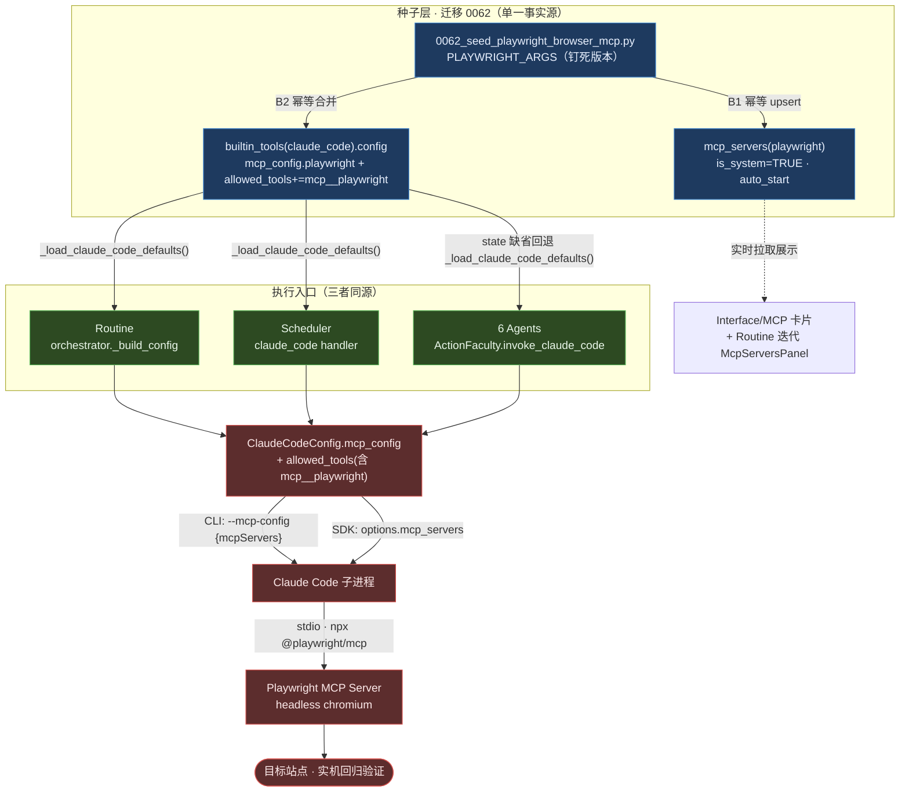

# 浏览器操作 MCP 集成方案：Playwright MCP 全系统默认配备

> 本文遵循 [AGENTS.md](../../../AGENTS.md) 的协作协议与循证要求。设计核心锚定：
> - 选型论证与横向盘点：[浏览器操作 MCP 调研](../../research/120-browser-automation-mcp.md)
> - 浏览器实机验证协议（A 类交互 / B 类自治）：[browser-validation.md](../../.agents/browser-validation.md)
> - 全系统 MCP 注入的单一事实源：`builtin_tools(claude_code).config.mcp_config`（参见 [claude_code handler](../../../apps/negentropy/src/negentropy/engine/schedulers/handlers/claude_code.py)）

## 1. 目标与约束

- **目标**：把一款浏览器操作 MCP 作为**全系统默认配备**内置——既在 [Interface / MCP](../user-guide/interface.md) 卡片中以「Built-In」呈现，又为**所有 Routine 任务**在运行时提供浏览器工具，用于**实机回归验证**。
- **选型结论**：**Playwright MCP**（`@playwright/mcp`，stdio · headless · isolated）。完整对标见[调研文档](../../research/120-browser-automation-mcp.md)，要点：可在自治无人后台运行（Routine 场景刚需），工具面为"驱动 + 断言"贴合回归，且最大化复用本仓既有的 Playwright + dev-cookie 基础设施。
- **约束**：
  - **Single Source of Truth**：传输规格在迁移中**单一定义**，同时供目录卡片与全局注入复用，杜绝 Split-Brain。
  - **最小干预**：复用既有的 Claude Code MCP 注入链路（`mcp_config`），不新建 ADK→MCP 直连桥。
  - **确定性**：版本钉死（`@playwright/mcp@0.0.75`），契合 [Routine 确定性加固](../039-the-routine-system.md)（ISSUE-114/116）的工程取向。
  - **优雅降级**：运行时若缺 Node/npx/浏览器，MCP 连接失败仅告警跳过，不阻断主流程。

## 2. 架构总览：单一注入点，三入口汇聚

全系统**所有** Claude Code 调用共享同一个 MCP 注入点——`builtin_tools` 表中 `name='claude_code'` 行的 `config.mcp_config`。三条执行入口（Routine、Scheduler、6 Agents）都经由它获得默认 MCP，再经 [`ClaudeCodeService`](../../../apps/negentropy/src/negentropy/engine/claude_code/service.py) 透传给 Claude Code CLI/SDK。本方案因此只需在这**一个**注入点种入 Playwright，即可全系统生效。



### 2.1 Provisioning 链路（源码锚点）

| 阶段 | 位置 | 行为 |
|---|---|---|
| 全局默认读取 | [`_load_claude_code_defaults`](../../../apps/negentropy/src/negentropy/engine/schedulers/handlers/claude_code.py) | 从 `builtin_tools(claude_code).config` 读 `mcp_config` / `allowed_tools` |
| Routine 构建 | [`orchestrator._build_config`](../../../apps/negentropy/src/negentropy/engine/routine/orchestrator.py) | 取全局默认；per-routine `mcp_config` **合并**（非替换）；`allowed_tools` 缺省用 `_ROUTINE_DEFAULT_TOOLS`（含 `mcp__playwright`） |
| 6 Agents 入口 | [`invoke_claude_code`](../../../apps/negentropy/src/negentropy/agents/tools/claude_code.py) | session state 无 `claude_code_config` 时**回退**全局默认（SSOT 统一） |
| 透传子进程 | [`ClaudeCodeService`](../../../apps/negentropy/src/negentropy/engine/claude_code/service.py) | CLI `--mcp-config {"mcpServers": ...}` / SDK `options.mcp_servers` |

> **为何"合并而非替换"**：若某条 Routine 自定义了 `config.mcp_config`，旧逻辑会整体覆盖、抹除默认 playwright。改为浅合并后，"为所有 Routine 内置浏览器 MCP"对自定义场景同样成立，per-routine 仍可按具名 server 覆盖。

## 3. 权限模型：allowed_tools × permission_mode

Claude Code 的相位权限（[phase.py](../../../apps/negentropy/src/negentropy/engine/routine/phase.py)）为 `plan` / `acceptEdits`。**`acceptEdits` 只自动放行文件编辑，不放行 MCP 工具调用**。因此浏览器 MCP 工具必须显式进入 `allowed_tools`：

- **通配写法** `mcp__playwright` = 放行该 server 的全部工具（亦可精确到 `mcp__playwright__browser_navigate`）。
- Routine 入口：已加入 [`_ROUTINE_DEFAULT_TOOLS`](../../../apps/negentropy/src/negentropy/engine/routine/orchestrator.py)。
- Scheduler / 6 Agents 入口：迁移 0062 已把 `mcp__playwright` 并入 `builtin_tools(claude_code).config.allowed_tools`。

## 4. 鉴权：净室默认 + dev-cookie 旁路（按需）

- **默认净室（`--isolated`）**：每会话全新 profile，适用于公开 URL 与无状态回归——开箱即用，无主机相关路径依赖。
- **鉴权回归（按需）**：回归 negentropy-ui 等需登录页面时，复用本仓既有的 **dev-cookie storageState** 旁路（[playwright.config.ts](../../../apps/negentropy-ui/playwright.config.ts) + [sign-dev-cookie.mjs](../../../apps/negentropy-ui/scripts/sign-dev-cookie.mjs)）：经 `--storage-state=<path>` 注入自签 `ne_sso` 登录态，**严禁**在自治环境跳转真实 OAuth/SSO 同意屏（详见 [browser-validation.md](../../.agents/browser-validation.md) 的安全红线）。配置方式见 §6。

## 5. 工具面（Playwright MCP 核心工具）

- **导航/感知**：`browser_navigate`、`browser_snapshot`（可访问性树，断言首选）、`browser_take_screenshot`、`browser_console_messages`、`browser_network_requests`。
- **交互**：`browser_click`、`browser_type`、`browser_fill_form`、`browser_select_option`、`browser_press_key`、`browser_hover`、`browser_wait_for`。
- **断言（testing caps）**：`browser_verify_element_visible`、`browser_verify_text_visible`、`browser_generate_locator` 等。
- **会话态**：`browser_storage_state` / `browser_set_storage_state`（运行时注入/导出登录态）。

## 6. 运营前置（部署须知）

1. **Node/npx**：Routine 运行时（后台 Claude Code 子进程）PATH 中需有 `node`/`npx`。
2. **浏览器二进制**：`@playwright/mcp@0.0.75 --browser chromium` 实际解析到 **`chrome-for-testing`** 构建（如 `ms-playwright/chromium-1224`），**不**等同于通用 `npx playwright install chromium`（后者装的是 `chromium-<n>`，版本号常不一致）。首次须执行 **`npx @playwright/mcp@0.0.75 install-browser chrome-for-testing`**（实测：缺失时 `browser_navigate` 报 `Browser "chrome-for-testing" is not installed`，连接/发现却仍成功——故须在部署期预装，不能等运行时）。
3. **预热与离线缓存**：首次 `npx @playwright/mcp@0.0.75 --help` 预拉包，避免每次 Routine 启动的网络抖动；离线环境可预置 npm cache 与上述浏览器缓存目录。
4. **版本升级**：改 [迁移 0062](../../../apps/negentropy/src/negentropy/db/migrations/versions/0062_seed_playwright_browser_mcp.py) 的 `PLAYWRIGHT_ARGS` 版本号 → 新建一条幂等 data-fix 迁移同步 `mcp_servers.args` 与 `builtin_tools.config.mcp_config`（保持单一事实源同改）。
5. **`--no-sandbox`**：容器/root 下运行 headless chromium 必需；仅用于**受控的内部/已知 URL** 回归，安全权衡见 §7。
6. **鉴权回归配置**：在目标 Routine 的 `config.mcp_config` 内按具名 server 覆盖 args，追加 `--storage-state=/abs/path/dev-admin.json`（合并语义保证其余默认不丢）。

## 7. 风险与缓解

| 风险 | 缓解 |
|---|---|
| 每次 CC 调用都拉起一个 Playwright 子进程（含非浏览器类 Routine） | "为所有 Routine 内置"的显式取舍；MCP 起不来时优雅降级；个别 Routine 可经 `disallowed_tools` 关闭 |
| `npx @latest` 不确定性 | 版本钉死；预热缓存 |
| `--no-sandbox` 降低隔离 | 限受控内部 URL；不在自治环境处理不可信外链 |
| 运行时缺浏览器/Node | 部署预装；连接失败仅告警，不阻断 |
| 真实 OAuth 被自治流程触发 | 默认净室；鉴权一律走 dev-cookie storageState（[browser-validation.md](../../.agents/browser-validation.md) 红线） |

## 8. Routine 浏览器实机回归验证 · 配方

在 Routine goal / acceptance_criteria 中显式要求浏览器实机校验即可（默认已具备工具），例如：

```text
goal: 修复 negentropy-ui 的 X 组件并回归验证
acceptance_criteria:
  - 使用 mcp__playwright 打开 http://localhost:3210/<page>
  - 以 browser_snapshot 断言关键元素存在、browser_console_messages 无 error
  - 截图留档（browser_take_screenshot）
```

迭代详情的 **MCP Servers** 面板（[McpServersPanel](../../../apps/negentropy-ui/app/interface/routine/_components/McpServersPanel.tsx)）会展示 playwright；`iteration.metrics["mcp_servers"]` 亦快照该 server，形成可审计链路。

> **实机冒烟（2026-06-06，已验证）**：以 DB 中**已种子的** playwright 配置（`npx @playwright/mcp@0.0.75 --headless --isolated --browser chromium --no-sandbox`）经系统 MCP 客户端在**单一持久会话**内驱动 `initialize → list_tools(23) → browser_navigate(https://example.com) → browser_snapshot`，快照正确返回页面 a11y 树（含 `heading "Example Domain"` 与正文），navigate/snapshot 同会话状态共享——与 Routine 的 Claude Code 子进程使用方式一致。该冒烟同时暴露并修复了 §6 运营前置中的浏览器二进制项（`chrome-for-testing` ≠ 通用 `chromium`）。

## 9. 相关文档

- [浏览器操作 MCP 调研（选型论证）](../../research/120-browser-automation-mcp.md)
- [浏览器实机验证协议](../../.agents/browser-validation.md)
- [Claude Code 集成（BuiltinTool）](../038-claude-code-integration.md)
- [Routine 长周期自主任务系统](../039-the-routine-system.md)
- [Interface 用户指南 §6.3 MCP Server 管理](../user-guide/interface.md)
