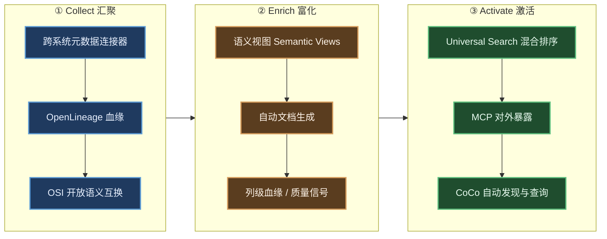
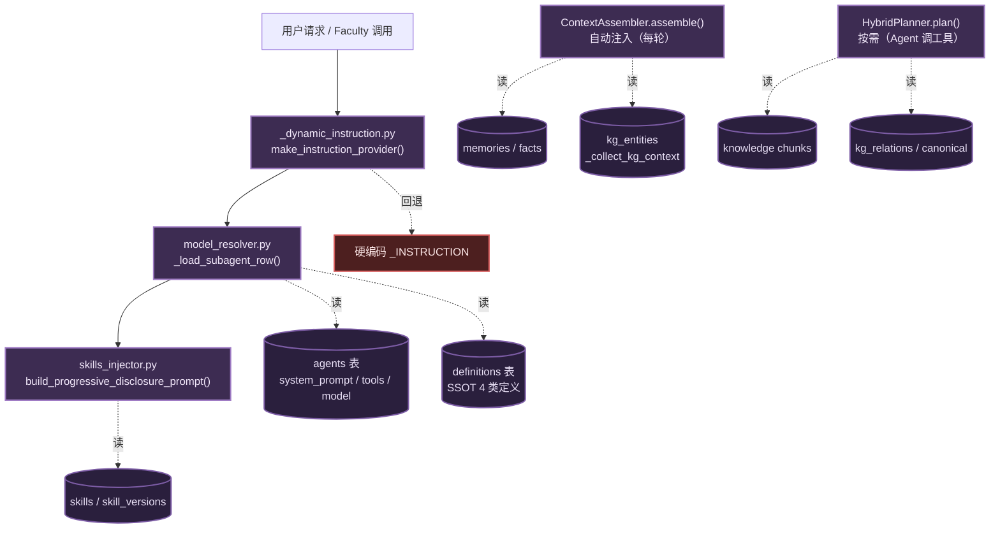
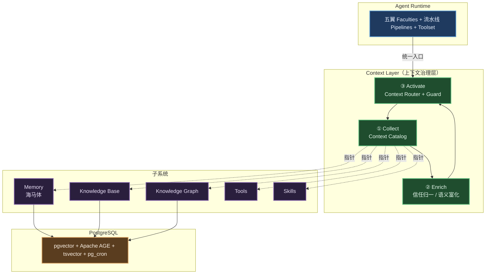
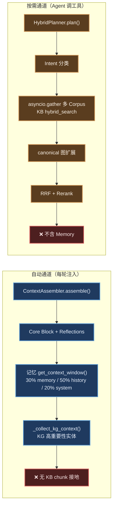
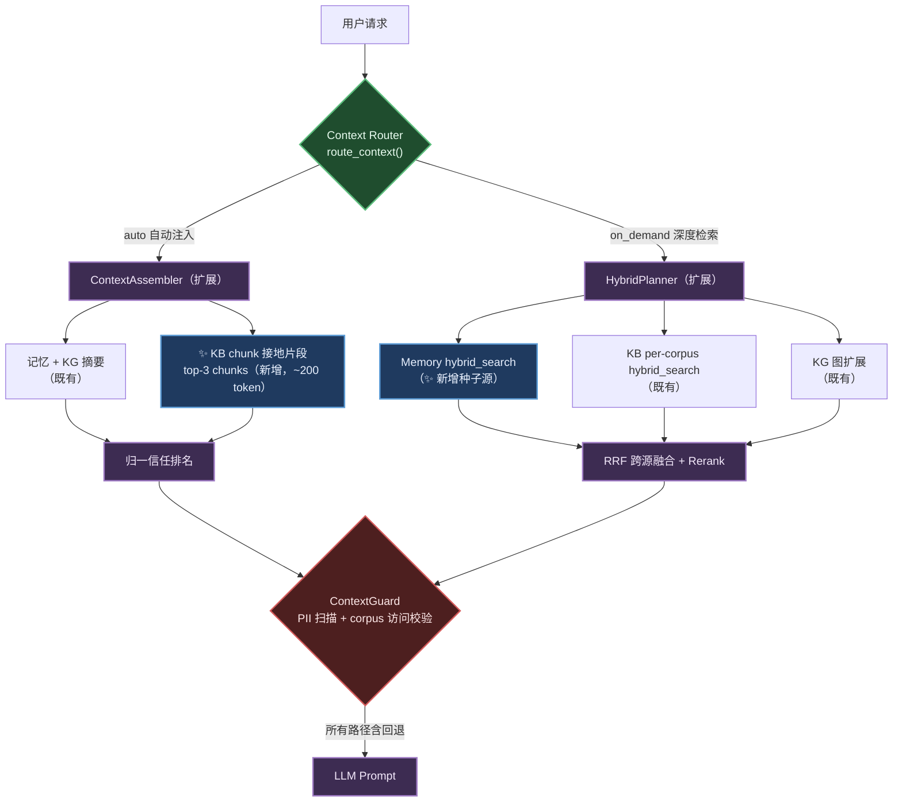
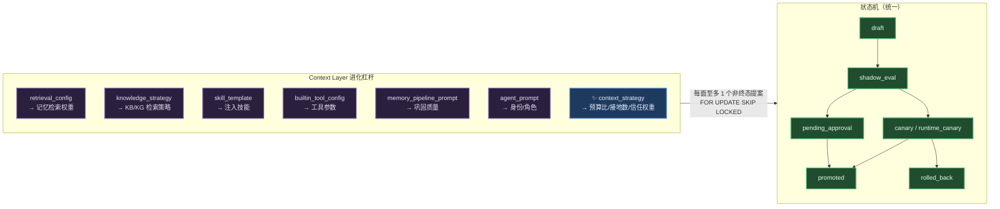

# Context Layer · 上下文治理层技术方案

> 本文遵循 [AGENTS.md](../../../AGENTS.md) 的协作协议与循证要求。
>
> 设计核心锚定：
> - **行业对标**：[Snowflake Horizon Context](https://www.snowflake.com/en/product/features/horizon-context/) · [Snowflake 数据云调研 §D7 Horizon Catalog](../../research/retrieval-storage/034-snowflake-data-cloud.md)
> - **理论基线**：[Context Engineering 通俗全解](../../research/cognitive-context/010-context-engineering.md)（Collect / Management / Usage 三段论）
> - **子系统参考**：[记忆系统](../subsystems/025-the-memory-system.md) · [记忆白皮书](../subsystems/026-memory-whitepaper.md) · [知识库](../subsystems/035-the-knowledge-base.md) · [知识图谱](../subsystems/036-the-knowledge-graph.md) · [联邦 KG](../subsystems/037-federated-kg.md) · [Skills 设计](./skills.md)
> - **架构上下文**：[系统框架 · 一核五翼](../framework.md) · [自进化 Agents Team 方案](./self-evolving-agents.md)
> - **权威源**：[`context_assembler.py`](../../../apps/negentropy/src/negentropy/engine/adapters/postgres/context_assembler.py)（自动注入范式）· [`hybrid_planner.py`](../../../apps/negentropy/src/negentropy/agents/tools/hybrid_planner.py)（按需检索范式）· [`engine/evolution/handlers/`](../../../apps/negentropy/src/negentropy/engine/evolution/handlers/)（进化杠杆范式）

---

## 0. 范围与定位

### 核心论断

> **不"从零造一个上下文引擎"，而是"把已有的上下文子系统收敛到一个治理织物（Context Fabric）之下"。**

Negentropy 的「一核五翼」智能体效能**完全取决于上下文质量**——系统提示、记忆、知识、工具、技能、会话状态。这些信号已经分散在多个子系统并被各自组装，但**缺少一个统一的治理与编排层**来汇聚、富化、治理并按需激活。Context Layer 正是这一层：它对标 Snowflake Horizon Context「让 AI Agent 基于受治理、可信、一致的定义推理，而非从原始数据猜测」的设计哲学，以**横向治理织物**的身份横亘在 Agent Runtime 与 Memory / KB / KG / Tools / Skills 之上。

### 设计对象

| 维度 | Context Layer **是什么** | Context Layer **不是什么** |
|------|------------------------|--------------------------|
| 定位 | 跨子系统的**治理 + 编排织物** | 替代现有子系统的新引擎 |
| 存储 | 复用 PostgreSQL（pgvector + AGE + tsvector） | 新建向量库 / 图库 / 记忆服务 |
| 检索 | 统一激活的**路由 + 归一化排名** | 重写各子系统的检索算法 |
| 数据 | 逻辑视图（VIEW）+ 轻量指针 | 物理复制子系统数据（防 Split-Brain） |
| 治理 | 引擎级执行（含回退路径） | 应用层可选检查 |

**范围外**：模型权重训练/微调；重写既有检索/巩固管线；新建外部存储后端。所有规划改动均为 **additive + 特性开关 + fail-soft**，不破坏现有功能。

---

## 1. 理论锚点与对标

### 1.1 行业对标：Snowflake Horizon Context

Snowflake Horizon Context 是内建于 Horizon Catalog 的**统一治理语义上下文引擎**，其核心主张是：**治理策略在查询引擎层执行，而非应用层**——无论访问者是分析师、BI 工具还是 AI Agent，策略都自动生效，**不可绕过**[[1]](#ref1)。它用一条三阶段流水线把分散的元数据转化为可信、可被 Agent 直接消费的上下文：

Horizon Context 进一步把上下文信号归纳为**四层**[[1]](#ref1)：

| 信号层 | 含义 | 作用 |
|--------|------|------|
| **Structural（结构）** | 存在什么、如何连接（表/列/血缘） | 让 Agent 知道「有哪些资产」 |
| **Operational（运行）** | 正在发生什么（查询/新鲜度/性能） | 让 Agent 知道「资产是否可用、多新」 |
| **Semantic（语义）** | 它意味什么（定义/指标/本体） | 让 Agent 基于权威定义推理 |
| **Behavioral（行为）** | 如何被使用（热度/模式） | 让 Agent 优先选高质量资产 |

**两条可迁移的核心原则**：
1. **引擎级治理执行**——策略不可被任何调用方绕过；
2. **单一事实源（SSOT）**——语义定义集中治理、Git 版本化，Agent 只引用不复制。

### 1.2 学术锚点

Context Engineering 学术框架将上下文生命周期归纳为 **Context Collection → Context Management → Context Usage** 三段[[2]](#ref2)，与 Horizon 的 Collect/Enrich/Activate 高度同构。Dey 将上下文定义为「用于刻画实体状态的任何信息」[[3]](#ref3)——对 Agent 而言，这个「实体」即当前任务，「状态」即一切可得的记忆/知识/能力信号。本方案以 Horizon 为工程对标、以 Context Engineering 为理论骨架。

---

## 2. 现状盘点（基于代码事实）

### 2.1 当前的上下文组装链路

系统**没有统一的上下文层**，上下文在运行期由一条解析链路分散组装（60s TTL 缓存 + 代码回退）：

链路汇聚的 **9 路上下文来源**：① 身份/角色（`_INSTRUCTION` ↔ `agents.system_prompt`）② Skills（三层 Progressive Disclosure）③ Tools（`NegentropyToolset` 解析 `agents.tools`）④ Model（`model_resolver`）⑤ 记忆（`preload_memory_tool` + `ContextAssembler`）⑥ 会话状态（ADK `SessionService` 前缀路由 `user:`/`app:`/`temp:`）⑦ 定义 SSOT（`definitions` 表）⑧ 用户偏好（`state.preferred_agent`）⑨ 引用协议（共享常量）。

### 2.2 三大结构性缺口

经代码级核查，确认上下文流转存在三个违背「单一治理」的结构性缺口：

| 缺口 | 表征 | 代码锚点 |
|------|------|---------|
| **① 存储层检索未统一** | Memory / KB / KG 各有独立 `hybrid_search()`；`HybridPlanner` 覆盖 KB+KG **但不含 Memory** | [`memory_service.py`](../../../apps/negentropy/src/negentropy/engine/adapters/postgres/memory_service.py) 自有 4 级检索；[`hybrid_planner.py`](../../../apps/negentropy/src/negentropy/agents/tools/hybrid_planner.py) `_seed_retrieval()` 仅 `asyncio.gather` 多 Corpus |
| **② 双通道注入割裂** | 自动通道 `ContextAssembler` 注入 **记忆 + KG 摘要**，**但不接地 KB chunks**；KB 仅在 Agent 显式调工具时才被检索 | [`context_assembler.py`](../../../apps/negentropy/src/negentropy/engine/adapters/postgres/context_assembler.py) `_collect_kg_context()` 已注入 KG，无 KB chunk 注入 |
| **③ 信任信号未归一** | Memory（retention/importance）、KB（quality_score/retrieval_count）、KG（confidence/PageRank）各自为政，无统一信任/新鲜度评分；代码回退路径可绕过治理 | 三套评分散落于各 ORM 模型 |

**后果**：Agent 可能用过期记忆回答（而新鲜 KB 知识存在却未被检索）；可能幻觉（相关记忆存在但未调 KB 工具）；信任信号无法跨子系统比较，排名失效。

---

## 3. Context Layer 架构总览

### 3.1 总览：治理织物横亘五子系统

Context Layer 是**逻辑层**而非单体模块：它复用既有子系统作为存储与检索后端，自身只承担「汇聚元数据 → 归一化信任 → 统一路由 + 治理」三件事（Collect / Enrich / Activate），遵循**正交分解**——机制（治理/路由）与策略（各子系统检索算法）分离。

### 3.2 三相 × 四信号层映射

| Horizon 相 | negentropy 映射 | 复用 | 缺口→本方案补全 |
|-----------|----------------|------|----------------|
| **Collect 汇聚** | Context Catalog：跨子系统统一元数据 + 血缘 | 既有表已齐 | 缺统一目录视图（§4） |
| **Enrich 富化** | 信任/新鲜度归一 + 语义富化 | 信任信号已存在但分立 | 缺归一评分（§4.2） |
| **Activate 激活** | 统一路由：自动注入 + 按需检索 | `ContextAssembler` + `HybridPlanner` | 缺跨子系统统一与治理兜底（§5） |

| 四信号层 | negentropy 具体来源 |
|---------|---------------------|
| **Structural** | `agents`（五翼+流水线拓扑）· `definitions`（4 类 SSOT）· `corpus`/`knowledge`/`knowledge_documents`· `kg_entities`/`kg_relations`/`kg_entity_canonical`· `memories`/`facts`· `skills`/`skill_versions`· `builtin_tools` |
| **Operational** | `memory_retrieval_logs`· `tool_invocations`/`tool_stats_daily`· `knowledge_feedback`· chunks 的 `retrieval_count`· memories 的 `access_count`+`last_accessed_at`· OTel traces |
| **Semantic** | `definitions`（SSOT 受治理定义）· 6 类 `memory_type`（core/episodic/semantic/preference/procedural/fact）· 8 类 `entity_type` + 13 `relation_type`· `fact_type`· skill `description`+`prompt_template` |
| **Behavioral** | `retention_score`+`importance_score`（记忆）· `quality_score`+`retrieval_count`（KB）· `importance_score`/PageRank+`confidence`（KG）· `interaction_feedback`· `tool_stats_daily` 成功率/延迟 |

---

## 4. Context Catalog（Horizon Catalog 对标）

### 4.1 设计决策：逻辑视图而非新物理表

> **ADR-1：Context Catalog 用 PostgreSQL VIEW 实现，不新建物理表。**
> **理由**：AGENTS.md「单一事实源——引用时必须使用轻量级指针（Link/ID）而非数据副本（Copy-Paste），从根源消除断裂（Split-Brain）风险」。所有元数据已存于 PostgreSQL，新表将制造副本与不一致。Horizon Catalog 本身也是元信息层而非数据副本。

三个只读视图（纯 SQL，无数据迁移）：

| 视图 | 职责 | 构成 |
|------|------|------|
| `context_catalog_unified` | 跨子系统资产目录（Structural） | `UNION` of memories / knowledge chunks / kg_entities / skills / builtin_tools，归一列：`item_type`·`item_id`·`app_name`·`user_id`·`semantic_type`·`source_system`·时间戳 |
| `context_trust_signals` | 信任 + 新鲜度归一（Behavioral/Operational） | JOIN 各子系统信任列，归一到 0–1（见 §4.2） |
| `context_access_log` | 行为审计（Operational/Behavioral） | `UNION` of `memory_retrieval_logs`·`tool_invocations`·`knowledge_feedback` |

### 4.2 信任信号归一化

各子系统已有信任信号（记忆 retention/importance、KB quality_score/retrieval_count、KG confidence/PageRank），但**量纲不一、无法跨子系统比较**。Context Layer 定义归一到 [0,1] 的复合信任分（`context_trust_signals` 视图计算列，**非新存储列**）：

| item_type | 信任分公式（`staleness = min(1, days_since_access/90)`） |
|-----------|--------------------------------------------------------|
| Memory | `0.4·retention_score + 0.3·importance_score + 0.3·(1−staleness)` |
| KB chunk | `0.4·(quality_score ∥ 0.5) + 0.3·min(1, retrieval_count/10) + 0.3·(1−staleness)` |
| KG entity | `0.5·confidence + 0.5·(importance_score ∥ 0)` |
| Tool | `0.6·success_rate + 0.4·(1−normalized_latency)`，`normalized_latency = min(1, p95_ms/5000)` |
| Skill | `1.0 if active_version else 0.7`（已发布=可信） |

> 上述权重为初值，本身是可进化参数（§7）。`∥` 表示空值回退。归一信任分供 Activate 阶段跨子系统统一排名使用。

### 4.3 SSOT 边界（复用 vs 新增）

| 组件 | 状态 | 在 Context Layer 中的角色 |
|------|------|--------------------------|
| [`ContextAssembler`](../../../apps/negentropy/src/negentropy/engine/adapters/postgres/context_assembler.py) | **复用 + 扩展** | 自动注入通道；扩展接入 KB chunk 接地片段（§5） |
| [`HybridPlanner`](../../../apps/negentropy/src/negentropy/agents/tools/hybrid_planner.py) | **复用 + 扩展** | 按需检索通道；扩展接入 Memory 源（§5） |
| [`definitions` Registry](../../../apps/negentropy/src/negentropy/agents/definitions/registry.py) | **原样复用** | 受治理语义层（Skill/Routine/Agent 定义 SSOT） |
| [`model_resolver`](../../../apps/negentropy/src/negentropy/config/model_resolver.py) | **原样复用** | 60s TTL 缓存与 `_load_subagent_row()` 保持不变 |
| 6 个 [`evolution/handlers/`](../../../apps/negentropy/src/negentropy/engine/evolution/handlers/) | **复用 + 增杠杆** | 既有 6 面 + 新增 `context_strategy` 面（§7） |
| [`UnifiedRetrievalService`](../../../apps/negentropy/src/negentropy/knowledge/retrieval/unified_search.py) | **原样复用** | KB 的 L0+L1 检索后端 |
| Context Catalog 视图 | **新增（仅 SQL）** | 统一目录与信任归一 |
| `Context Router` 函数 | **新增（薄编排）** | 自动 vs 按需路由决策 |
| `ContextGuard` 检查点 | **新增（薄守卫）** | 引擎级治理执行 |

---

## 5. 统一激活架构（核心设计）

### 5.1 现状：双通道割裂

两条通道完全分离：自动通道不接地 KB，按需通道不含记忆，二者信任信号互不参照。

### 5.2 目标：统一 Context Router

> **ADR-2：升级 HybridPlanner 为统一检索骨架，而非新建独立 Router 类。**
> **理由**：HybridPlanner 已具备正确架构（Intent 分类 → 并行种子检索 → 图扩展 → RRF 融合 → 重排）。把 Memory 作为第 4 路种子检索源是增量扩展，不是重设计（Reuse-Driven + Minimal Intervention）。

**两处扩展（均为 additive + 特性开关 + fail-soft）**：

1. **HybridPlanner 接入 Memory**——在 `_seed_retrieval()` 的 `asyncio.gather` 中追加 `memory_service.hybrid_search()` 作为一路种子源；`PlannerConfig` 增 `memory_enabled: bool = False`、`memory_top_k: int = 5`。Memory 候选与 KB 候选一样获得 `vector_rank`/`keyword_rank`，纳入统一 RRF 融合。Memory 单源失败 fail-soft（与既有单 Corpus 失败同处理）。
2. **ContextAssembler 接入 KB 接地片段**——复用既有 [`_collect_kg_context()`](../../../apps/negentropy/src/negentropy/engine/adapters/postgres/context_assembler.py) 范式，新增 `_collect_kb_grounding()`：对 query 做一次轻量语义检索取 top-3 chunks（每条 1 行摘要，~200 token 上限），让自动通道也获得 KB 接地，消除「记忆过期而 KB 新鲜却未被检索」的幻觉风险。

**收敛语义**（ADR-3）：自动通道给**接地摘要**（轻量、必出），按需通道给**深度检索**（重量、Agent 显式触发）。二者共享同一套归一信任排名（§4.2）。机制（路由）与策略（各子系统算法）正交。

### 5.3 引擎级治理执行

> 对标 Horizon「治理策略在查询引擎层执行，不可绕过」。

新增 `ContextGuard` 检查点（Phase 2 落地于 `engine/context/guard.py`），**两条激活路径（含代码回退）均必经**：

| 检查 | 复用既有 | 行为 |
|------|---------|------|
| PII 扫描 | [`governance/pii/`](../../../apps/negentropy/src/negentropy/engine/governance/pii/) gatekeeper | 自动注入的记忆含 PII 时脱敏/阻断 |
| corpus 访问校验 | [`auth/rbac.py`](../../../apps/negentropy/src/negentropy/auth/rbac.py) `accessible_corpus_ids` | KB 接地片段/按需结果不得越权（HybridPlanner 已做 `scoped & accessible`，Guard 为 defense-in-depth） |

Guard 是薄守卫函数，非新子系统；空上下文（回退场景）平凡通过，非空上下文才执行扫描。

---

## 6. 子系统上下文契约

每个子系统向 Context Layer 暴露统一契约（提供内容 / 信任信号 / 新鲜度 / 治理钩子 / 进化杠杆 / 现存缺口）。

### 6.1 Memory（海马体 · 内化系部）

| 维度 | 契约 |
|------|------|
| 提供 | 6 类记忆（core/episodic/semantic/preference/procedural/fact）+ Core Block + Reflections，经 `ContextAssembler` 与 `memory_service.hybrid_search()` |
| 信任 | `retention_score`（Ebbinghaus）· `importance_score`（ACT-R）· `confidence`（Facts）· `access_count`· `last_accessed_at` |
| 治理 | PII 检测 · 冲突消解（`conflict_resolver.py` AGM 信念修正）· 衰减治理（`_MEMORY_TYPE_DECAY_RATES`） |
| 进化杠杆 | `retrieval_config`（权重/RRF k/PPR）· `memory_pipeline_prompt`（抽取/反思/摘要） |
| 缺口 | 无统一新鲜度信号（`created_at`+`last_accessed_at`+`retention_score` 未合成为单一 staleness） |

### 6.2 Knowledge Base（感知系部）

| 维度 | 契约 |
|------|------|
| 提供 | chunks（4 种分块策略）+ 文档 + corpus 元数据，经 `UnifiedRetrievalService` 与 `HybridPlanner._seed_retrieval()` |
| 信任 | `quality_score`· `retrieval_count`· `entity_confidence` |
| 治理 | `accessible_corpus_ids`（RBAC）· `knowledge_feedback`· `content_validator` |
| 进化杠杆 | `knowledge_strategy`（分块/重排/抽取） |
| 缺口 | chunks 缺 `last_accessed_at`（运行信号缺失）· `quality_score` 多为 NULL（待回填/计算） |

### 6.3 Knowledge Graph（感知系部）

| 维度 | 契约 |
|------|------|
| 提供 | 8 类实体 + 13 类关系 + 跨 corpus 规范实体 + Leiden 社区，经 `graph/service.py`、`global_search.py` 与 HybridPlanner 图扩展 |
| 信任 | `confidence`（实体/关系/别名）· `importance_score`（PageRank）· `extraction_confidence` |
| 治理 | 规范实体 `is_under_review`· 溯源 `graph/provenance.py`· 双时态查询 |
| 进化杠杆 | `knowledge_strategy`（抽取 prompt / 实体消解阈值） |
| 缺口 | confidence 与 importance_score 未合成为归一复合分 |

### 6.4 Tools（妙手系部）

| 维度 | 契约 |
|------|------|
| 提供 | 工具定义（name/description/schema），经 `NegentropyToolset._resolve_names()` 与 `tools/registry.py` |
| 信任 | `tool_stats_daily`（success_rate / p50·p95 延迟 / cost / 调用数） |
| 治理 | 每翼 `_allowed_set` 白名单 · `approval.py` `HIGH_RISK_TOOLS` · skill `enforcement_mode` |
| 进化杠杆 | `builtin_tool_config`（config JSONB 参数） |
| 缺口 | 遥测新近落地，低频工具 stats 稀疏 |

### 6.5 Skills（受治理定义）

| 维度 | 契约 |
|------|------|
| 提供 | 三层 Progressive Disclosure：L1 描述常驻 / L2 模板按需（`expand_skill`）/ L3 资源挂载（`fetch_skill_resource`），经 `skills_injector.py` |
| 信任 | `active_version` 指针（已发布）· `is_global`· `visibility`· `enforcement_mode`（strict/warning） |
| 治理 | Jinja2 沙箱校验 · `required_tools` 强制 · `is_global` 提升需人工审批 |
| 进化杠杆 | `skill_template`（prompt_template 变异） |
| 缺口 | 运行时「skill 有效性」信号未回流目录（eval suite 存在但未在上下文中呈现） |

---

## 7. 进化集成

### 7.1 既有 6 杠杆 + 新增 context_strategy

自进化系统的 6 个 [`TargetHandler`](../../../apps/negentropy/src/negentropy/engine/evolution/handlers/base.py) 天然映射为 Context Layer 的进化杠杆；本方案**新增第 7 面** `context_strategy`，沿用完全相同的状态机与护栏：

`context_strategy` 可进化的参数：ContextAssembler 预算比（memory_ratio/history_ratio/system_ratio）· KB 接地片段数 · 信任分权重（§4.2）· Router 模式选择阈值。因其影响所有激活路径，采用更保守的门控（每步→人工审批），复用 [`evolution/decision.py`](../../../apps/negentropy/src/negentropy/engine/evolution/decision.py) 纯函数护栏。

### 7.2 信任信号反馈闭环

归一信任分（§4.2）与 `context_access_log` 行为审计，反哺进化 proposer：低信任/低命中资产被降权，高信任/高频资产被优先激活——形成「采集 → 归一 → 激活 → 行为 → 进化」的完整反馈闭环，对标 Horizon「Behavioral 信号驱动排序」。

---

## 8. 演进路线

> 全程遵循「不破坏现有功能」：每阶段改动均 **additive + 特性开关 + fail-soft**。

### Phase 1 · 统一目录 + 信任归一 + Memory 入 Planner（最小·高价值·低风险）

| 项 | 内容 |
|----|------|
| 改动 | ① 三个 Context Catalog 视图（纯 SQL，只读）② 信任归一纯函数 `engine/context/trust.py` ③ HybridPlanner `_seed_retrieval` 接入 Memory 源 + `PlannerConfig.memory_enabled`（默认关） |
| 文件 | 新增 `engine/context/{__init__,trust}.py`、视图迁移；改 `agents/tools/hybrid_planner.py` |
| 风险 | 低（视图只读；Memory 源 fail-soft；既有路径零变更） |
| 验证 | `memory_enabled=False` 时既有测试全过；`=True` 时返回 memory+KB+KG 候选；信任函数对所有 item_type 落在 [0,1] |

### Phase 2 · Context Router + 统一激活 + ContextGuard（核心价值）

| 项 | 内容 |
|----|------|
| 改动 | ① `engine/context/router.py` 编排 auto/on_demand ② ContextAssembler 增 `_collect_kb_grounding()` ③ `engine/context/guard.py` ContextGuard 接入两路径 ④ 注册 `context_strategy` 进化 handler |
| 文件 | 新增 `engine/context/{router,guard}.py`、`evolution/handlers/context_strategy.py`；改 `context_assembler.py`、`evolution/handlers/__init__.py` |
| 风险 | 中（触及热路径，每轮 LLM 调用）→ 缓解：接地片段可选 + fail-soft + 特性开关渐进 |
| 验证 | 接地关闭时既有测试全过；开启时返回富化上下文；ContextGuard 阻断含 PII 记忆与越权 corpus；新 handler 遵循状态机 |

### Phase 3 · Universal Search + 深度治理 + 溯源（高级）

| 项 | 内容 |
|----|------|
| 改动 | ① Universal Search：跨子系统混合排序（opt-in API，不替代既有检索）② 进化优化上下文参数（shadow eval + canary）③ KB chunks 增 `last_accessed_at` ④ 溯源日志 `context_provenance_log`（append-only，async fire-and-forget）⑤ 上下文质量指标纳入 `tool_stats_daily` 范式 |
| 文件 | 新增 `engine/context/{universal_search,provenance}.py`、两份迁移 |
| 风险 | 中高（新能力 + 写入负载）→ 缓解：Universal Search 为 opt-in 端点；溯源 async 不阻塞主链 |
| 验证 | 跨子系统检索返回相关项；进化可优化预算比；溯源记录每次注入；质量指标可观测 |

---

## 9. 风险与对策

| 风险 | 对策 |
|------|------|
| **60s TTL 缓存一致性** | KB 接地沿用既有 60s 窗口（与 instruction/model/tools 同一致性级别）；紧急失效复用 `invalidate_cache(prefix="subagent:")` |
| **回退路径治理绕过** | ContextGuard 部署在**所有路径**（含代码回退）；空上下文平凡通过，非空必扫 |
| **token 预算压力** | KB 接地片段封顶 ~200 token（对齐既有 `_collect_kg_context` ~200 token 上限）；预算比本身可进化（Phase 2）；预算压力下特性开关关闭接地 |
| **进化多目标交互** | 进化系统已支持「每 target 至多 1 个非终态提案」隔离；`context_strategy` 用更保守门控（→人工审批）；跨目标交互由 `decision.py` 纯函数护栏裁定 |
| **统一检索延迟** | Memory `hybrid_search()` 是 PostgreSQL 查询，与单 Corpus KB 检索同量级；`asyncio.gather` 并行；`PlannerConfig.timeout_seconds=12.0` 预算不变 |

---

## 10. 与既有架构的自洽性

- **[framework.md](../framework.md) 一核五翼**：Context Layer 不改变五翼调度拓扑，仅收敛其上下文供给；五翼仍经 `transfer_to_agent` 编排。
- **[self-evolving-agents.md](./self-evolving-agents.md) 四层架构**：Context Layer 是 Meta-Layer（固定框架）提供的能力织物；其参数（Phase 2 `context_strategy`）属 Evolvable-3（记忆与知识系统）进化面，记忆条目内容仍不走进化回路。
- **[skills.md](./skills.md) 三层 Progressive Disclosure**：Context Layer 的 Activate 阶段尊重并复用该注入模型，不另造技能注入路径。
- **[conversation-foundation.md](../conversation-foundation.md) AG-UI**：Context Layer 是后端内部层，不引入新协议事件；接地片段经既有 `state`/工具卡片呈现。

---

## References

[1] Snowflake, "Horizon Context — Governed Semantic Layer & Context Engine," _Snowflake Product_, 2026. [Online]. Available: https://www.snowflake.com/en/product/features/horizon-context/

[2] ThreeFish-AI, "Context Engineering 通俗全解（Context Collection / Management / Usage）," _Negentropy Research_, 2026. [Online]. Available: [`docs/research/cognitive-context/010-context-engineering.md`](../../research/cognitive-context/010-context-engineering.md)

[3] A. K. Dey, "Understanding and Using Context," *Personal and Ubiquitous Computing*, vol. 5, no. 1, pp. 4–7, 2001.

[4] Snowflake, "Horizon Catalog — 发现/理解/信任 数据治理套件," _Negentropy Research §D7_, 2026. [Online]. Available: [`docs/research/retrieval-storage/034-snowflake-data-cloud.md`](../../research/retrieval-storage/034-snowflake-data-cloud.md)

[5] Google, "Agent Development Kit — Session & State Management," _Google ADK Documentation_, 2025. [Online]. Available: https://adk.dev/

[6] D. Edge et al., "From local to global: A graph RAG approach to query-focused summarization," in *Proc. NeurIPS*, 2024, arXiv:2404.16130.（ContextAssembler `_collect_kg_context` 理论依据）

---

> **文档维护**：本文为设计提案（SSOT），规划改动落地后需回填实现锚点，并保持与 [framework.md](../framework.md) 及各子系统文档的双向链接一致性。
