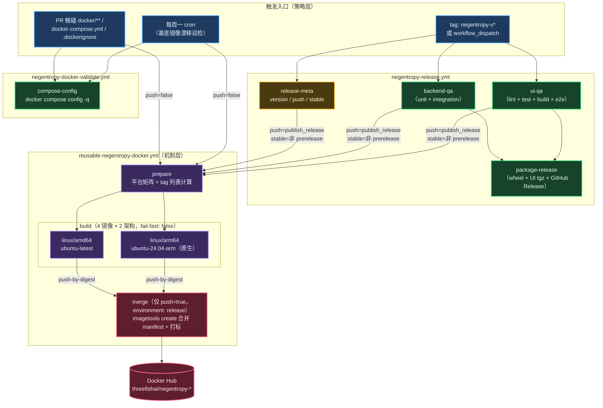

# Docker Release Pipeline（镜像构建与 Docker Hub 发布）

本文档定义 Negentropy compose 栈 4 个自建镜像（`backend` / `perceives` / `ui` / `wiki`）的 CI/CD 流水线：PR 阶段双架构构建校验（零推送副作用），tag 发布阶段经既有 QA 门禁后多架构构建并发布至 Docker Hub `threefishai` 命名空间。与 [QA Delivery Pipeline](./qa-delivery-pipeline.md) 同属交付体系，遵循仓库「入口 workflow（策略）→ 可复用 workflow（机制）」分层约定。

## 流水线总览



## 镜像与标签策略

| 镜像 | Dockerfile | 构建参数 | 服务端口 |
|---|---|---|---|
| `threefishai/negentropy-backend` | [docker/backend/Dockerfile](../../../docker/backend/Dockerfile) | — | 3292 |
| `threefishai/negentropy-perceives` | [docker/perceives/Dockerfile](../../../docker/perceives/Dockerfile) | — | 2992 |
| `threefishai/negentropy-ui` | [docker/frontend/Dockerfile](../../../docker/frontend/Dockerfile) | `TARGET_SERVICE=negentropy-ui` | 3192 |
| `threefishai/negentropy-wiki` | [docker/frontend/Dockerfile](../../../docker/frontend/Dockerfile) | `TARGET_SERVICE=negentropy-wiki` | 3092 |

标签由 `release-meta` 按既有发布通道规则派生（与 GitHub Release 的 prerelease 判定同源）：

| 发布形态 | 示例 tag | 产出镜像标签 |
|---|---|---|
| stable（`negentropy-v1.2.0`） | `1.2.0` | `1.2.0`、`1.2`、`latest` |
| prerelease（`negentropy-v1.2.0-rc.1` 或 dispatch `channel=candidate`） | `1.2.0-rc.1` | 仅 `1.2.0-rc.1`（不触碰 `latest`） |
| dispatch `publish_release=false` | — | 全链路干跑：构建但零推送 |

镜像命名的单一事实源是 [docker-compose.yml](../../../docker-compose.yml) 中各服务的 `image:` 字段（`${NEGENTROPY_IMAGE_TAG:-latest}` 可覆写）。

## 多架构构建机制

采用 [Docker 官方多平台 CI 范式](https://docs.docker.com/build/ci/github-actions/multi-platform/)：

- **per-arch 原生构建**：amd64 → `ubuntu-latest`，arm64 → `ubuntu-24.04-arm`（public 仓库免费），**零 QEMU 模拟**——镜像内的 `uv sync` / `next build` 全速执行；
- **push-by-digest + manifest 合并**：build 阶段仅推送未打标 digest（用户不可见），merge 阶段以 `docker buildx imagetools create` 合并为 manifest list 并原子打标。任一架构构建失败时 merge 整体跳过，**不会发布残缺镜像**；修复后 "Re-run failed jobs" 幂等补齐；
- **供应链安全**：发布构建附带 provenance（`mode=max`）与 SBOM attestation（Docker Hub 平台列表中的 `unknown/unknown` 条目即 attestation manifest，属预期外观）；
- **缓存**：GHA cache 按 `镜像 × 平台` 分 8 个独立 scope（`mode=max` 导出 multi-stage 全部构建层），超出 10GB 限额时走 LRU 驱逐，仅致冷构建变慢不致失败。

## 前置配置（一次性）

1. **Docker Hub**：注册/创建 `threefishai` 命名空间（组织或个人账号），并预创建 `negentropy-backend` / `negentropy-perceives` / `negentropy-ui` / `negentropy-wiki` 四个 repository（公有）；
2. **Access Token**：Docker Hub → Account Settings → Personal access tokens，生成 **Read & Write** 权限 token（勿用账号密码）；
3. **Repository secrets**（GitHub → Settings → Secrets and variables → Actions）：
   - `DOCKERHUB_USERNAME`：Docker Hub 登录用户名；
   - `DOCKERHUB_TOKEN`：上一步生成的 token。
   > 必须配置为 **repository 级** secrets：`uses:` 型 caller job 无法声明 environment，environment-scoped secrets 对其不可见。`environment: release` 仅作为审批门加在 merge job 的「打标发布」动作上。

未配置 secrets 时：PR 校验链路（`push=false`）不受影响；发布链路将在 `Login to Docker Hub` 步骤失败。

## 部署与本地用法

```bash
# 拉取发布版镜像并启动（跳过本地构建）
NEGENTROPY_IMAGE_TAG=1.2.0 docker compose pull
NEGENTROPY_IMAGE_TAG=1.2.0 docker compose up -d --no-build

# 本地开发照旧：镜像本地缺失时 compose 默认仍走本地 build
docker compose up -d
```

## 发布操作手册

1. **干跑验证**（不推送）：Actions → Release Pipeline → Run workflow，`publish_release=false`；
2. **首发用 prerelease 小步验证**：推 tag `negentropy-v<x.y.z>-rc.1`，验证 `docker buildx imagetools inspect threefishai/negentropy-backend:<x.y.z>-rc.1` 含 amd64+arm64 双平台；
3. **正式发布**：推 tag `negentropy-v<x.y.z>`，联动产出 `x.y.z` / `x.y` / `latest`。

## 相关文件

- [reusable-negentropy-docker.yml](../../../.github/workflows/reusable-negentropy-docker.yml) — 机制层：构建 + digest 合并
- [negentropy-release.yml](../../../.github/workflows/negentropy-release.yml) — 策略层：tag 发布（`release-meta` + `docker-release`）
- [negentropy-docker-validate.yml](../../../.github/workflows/negentropy-docker-validate.yml) — 策略层：PR 校验 + 周巡检
- [docker-compose.yml](../../../docker-compose.yml) — 镜像命名单一事实源 + 本地编排

## 运维操作指引

本文档聚焦流水线**设计**与**机制**。部署、日常运维、故障排查等操作指引详见 [Docker Compose 运维指引](../docker-operations.md)。
